# Cisco Application Centric Infrastructure (ACI) Contracts

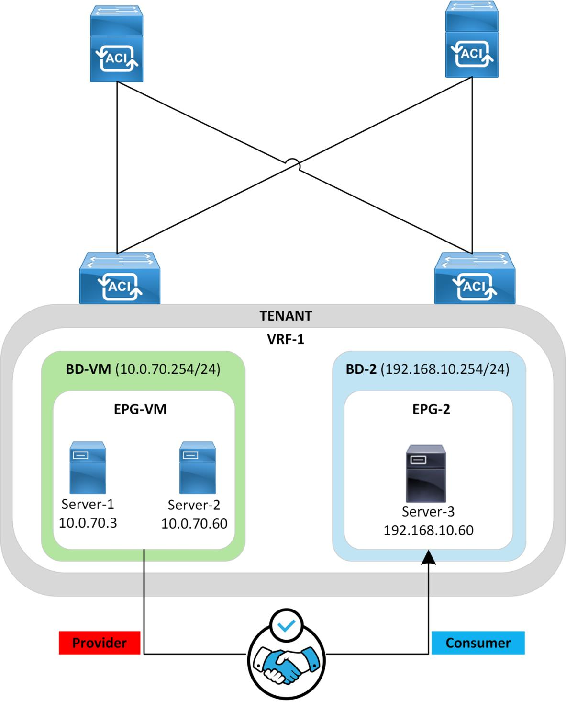

## Overview

The Cisco Application Centric Infrastructure (ACI) operates as a whitelist model by default, meaning communication is blocked unless explicitly permitted. An exception is for endpoints within the same Endpoint Group (EPG), where communication is allowed by default. To enable communication between endpoints in different EPGs, Cisco ACI uses contracts. These contracts are essentially access-list entries applied to EPGs, and they can be viewed in the zoning rule table, which will be demonstrated in this lab. Note that contracts apply specifically to unicast traffic.

In Cisco ACI, each EPG is dynamically assigned a unique ID called a pcTag or Class ID. Additionally, each configured Virtual Routing and Forwarding (VRF) instance receives a unique ID known as "Scope." The zoning rules are applied "per VRF/Scope" using the EPGs' unique identifiers, the pcTags.

A contract consists of a Root Contract Object, Subject, Filter, and Filter Entries. The Contract Object serves as the top-level logical container for contract configurations and is associated to EPGs whose endpoints require communication. It can include one or more subjects, where the permit/deny action is defined. A subject contains one or more filters. A filter references one or more filter entries that define the exact traffic to be matched (e.g. icmp, ssh, https etc.).

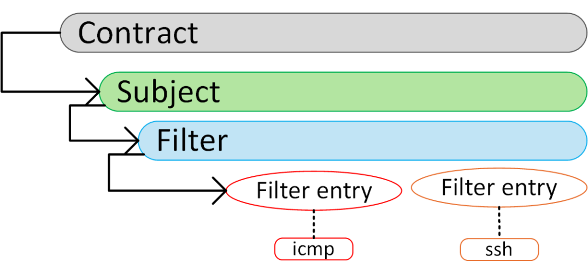

For comprehensive information about Cisco ACI contracts, please refer to the official Cisco ACI Contracts Whitepaper: [Cisco ACI Contracts Whitepaper](https://www.cisco.com/c/en/us/solutions/collateral/data-center-virtualization/application-centric-infrastructure/white-paper-c11-743951.html/).

This lab dives into Cisco ACI contracts, providing an in-depth look at how contracts function within ACI. It assumes that readers have a basic understanding of ACI concepts, such as VRFs, Bridge Domains (BDs), and Endpoint Groups (EPGs). Therefore, the basic configuration of these elements will not be covered in this lab.

!!! note
    This lab was conducted in a controlled environment. Any configurations in a production network should be implemented during a designated maintenance window. Additionally, always refer to official Cisco documentation relevant to your specific hardware and software.

## Lab-Setup

In this lab, there are two Endpoint Groups (EPGs), each within its respective Bridge Domain (BD), under the same Virtual Routing and Forwarding (VRF) instance. EPG-VM contains two endpoints that can communicate with each other by default. EPG-2 contains one endpoint that cannot communicate with endpoints in EPG-VM until a contract is configured. The figure below illustrates the logical setup of this lab.

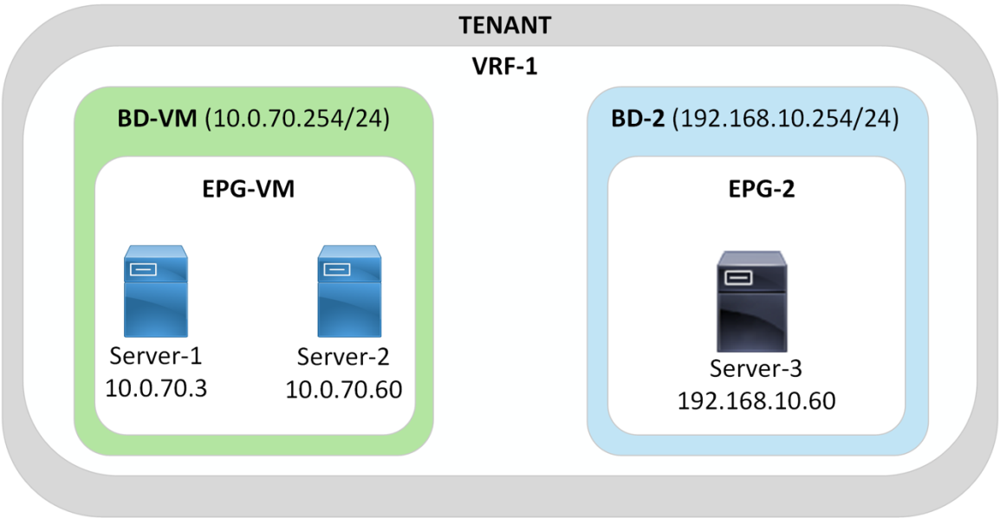

For this lab the dynamically assigned IDs of the VRF and EPGs are as follows:

| Object | Unique-ID |
|---|---|
| VRF-1 | 2129937 |
| EPG-VM | 16389 |
| EPG-2 | 49161 |

CLI Verification of Unique Identifiers:

```text
APICM3-1# show vrf VRF-1 detail
VRF Information:
 Tenant      VRF         VXLAN Encap Policy Enforced Policy Tag           Consumed Contracts
Provided Contracts    Description
 ---------- ---------- ----------    ----------       ----------          --------------------    --
------------------ ----------------------------------------
 tmajeza-    VRF-1       2129937     enforced         32770               -                       -
 tenant


APICM3-1# show tenant tmajeza-tenant epg EPG-VM detail | grep "Policy Tag"
Policy Tag                   : 16389
APICM3-1#
APICM3-1# show tenant tmajeza-tenant epg EPG-2 detail | grep "Policy Tag"
Policy Tag                   : 49161
```

GUI Verifications of Unique Identifiers:

VRF1:

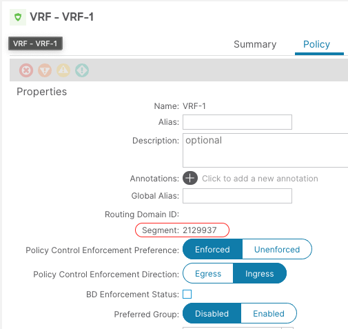

EPG-VM

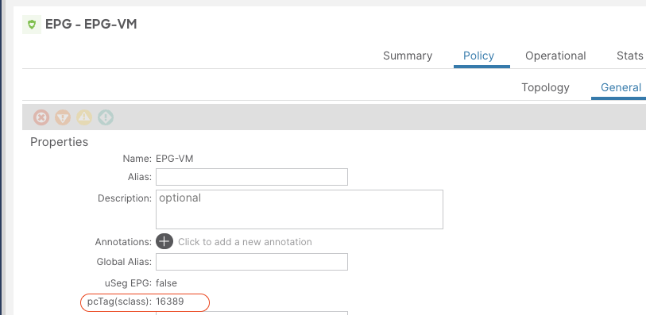

EPG-2

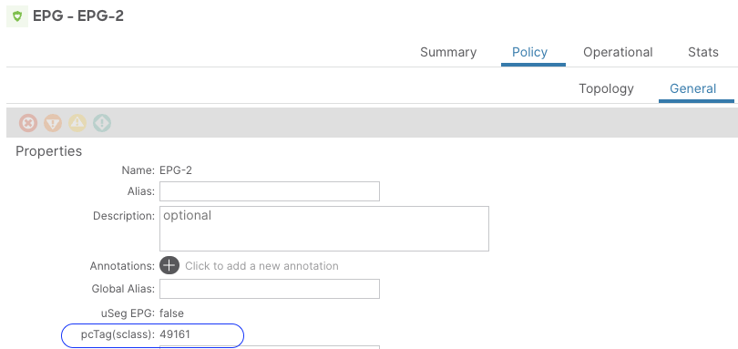

## Initial State

Before configuring contracts, it is essential to verify that endpoints are being correctly learned in the ACI fabric and that endpoints within the same Endpoint Group (EPG) can communicate freely with each other.

Verify endpoint learning:

```text
L101# show endpoint vrf tmajeza-tenant:VRF-1
Legend:
 S - static           s - arp                L - local             O - peer-attached
 V - vpc-attached     a - local-aged         p - peer-aged         M - span
 B - bounce           H - vtep               R - peer-attached-rl D - bounce-to-proxy
 E - shared-service   m - svc-mgr            C - control-ep
+-----------------------------------+---------------+-----------------+--------------+-------------+
      VLAN/                            Encap            MAC Address        MAC Info/    Interface
      Domain                           VLAN             IP Address         IP Info
+-----------------------------------+---------------+-----------------+--------------+-------------+
928                                        vlan-3129     0050.56b3.5ff3 L                   eth1/17
tmajeza-tenant:VRF-1                        vlan-3129         10.0.70.60 L                  eth1/17
928                                        vlan-3129     0050.56b3.42c8 L                    eth1/5
tmajeza-tenant:VRF-1                        vlan-3129          10.0.70.3 L                   eth1/5
60                                         vlan-3014     0050.56b3.e872 L                   eth1/17
tmajeza-tenant:VRF-1                        vlan-3014      192.168.10.60 L                  eth1/17
+------------------------------------------------------------------------------ +
                              Endpoint Summary
+------------------------------------------------------------------------------ +
Total number of Local Endpoints      : 3
Total number of non-vPC Endpoints    : 3
Total number of MACs                 : 3
Total number of Local IPs            : 3
Total number All EPs                 : 3
```

Verify communication between Server-1 and Server-2 in the EPG-VM.

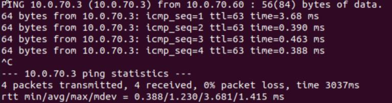

Verify that no communication is allowed between Server-1 (EPG-VM) and Server-3 (EPG-2).


Verify that Server-3 (EPG-2) cannot establish https connection to Server-1 (EPG-VM).

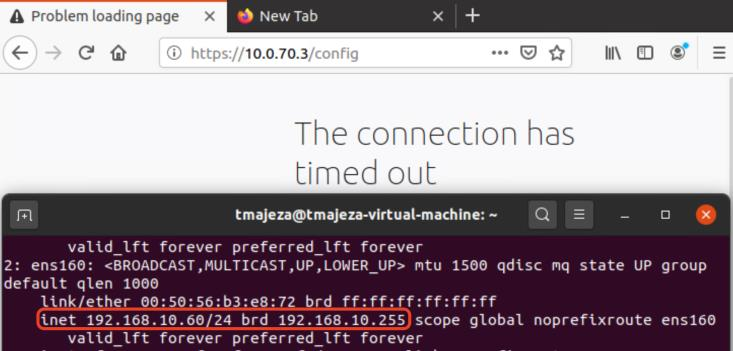

The default setting that prevents endpoints in different Endpoint Groups (EPGs) from communicating is the "Policy Control Enforcement Preference" in the VRF configuration, which is set to "Enforced."

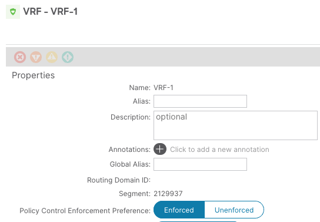

Let's examine the zoning-rule table when the VRF is configured with the default "Policy Control Enforcement Preference: Enabled" setting.

```text
L101# show zoning-rule scope 2129937
+---------+--------+--------+----------+---------+---------+---------+------+----------+----------------------+
| Rule ID | SrcEPG | DstEPG | FilterID |   Dir   | operSt | Scope | Name | Action |            Priority       |
+---------+--------+--------+----------+---------+---------+---------+------+----------+----------------------+
|   4321 |    0    |   0    | implicit | uni-dir | enabled | 2129937 |      | deny,log |   any_any_any(21)    |
|   4491 |    0    |   0    | implarp | uni-dir | enabled | 2129937 |       | permit | any_any_filter(17) |
..output truncated
```

When the policy is enforced under the VRF, any-to-any communication is denied according to Rule ID: 4321. However, any-to-any ARP traffic is implicitly permitted.

To observe changes in the zoning rules and inter-EPG communication behaviour, the "Policy Enforcement" setting is changed from "Enforced" to "Unenforced."

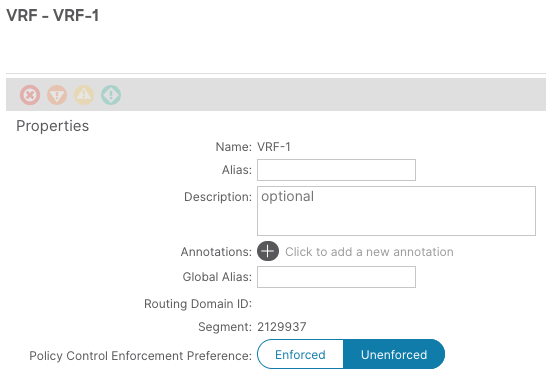

With the above configuration in place, the zoning-rule entry is as follows:

```text
L102# show zoning-rule scope 2129937
+---------+--------+--------+----------+---------+---------+---------+------+----------+------------------+
| Rule ID | SrcEPG | DstEPG | FilterID |   Dir   | operSt | Scope | Name | Action |          Priority     |
+---------+--------+--------+----------+---------+---------+---------+------+----------+------------------+
|   4331 |    0    |   0    | implicit | uni-dir | enabled | 2129937 |      | permit | any_any_any(21) |
```

The Action of any-to-any communication is “permit” which enables all endpoints in the VRF to freely communicate as shown below.

Server-2 (EPG-VM) can freely communicate with Server-3 (EPG-2).

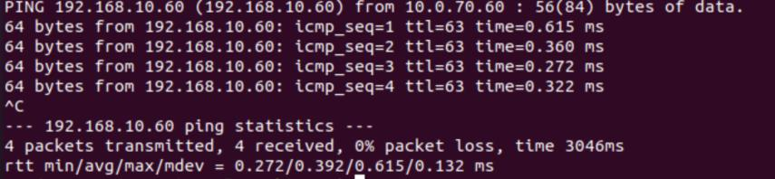

Server-3 (EPG-2) is able to SSH to Server-1 (EPG-VM)

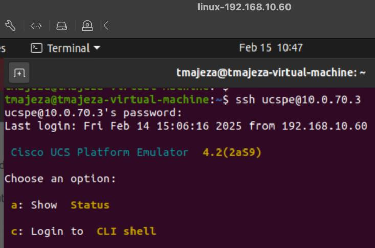

## Contracts Configuration

The VRF Policy Enforcement setting is returned to its default configuration so that a contract can be applied between the EPGs.

The configurations required are as follows:

1. Create the required filter(s)
2. Create the Contract and Subject (associating the created filter(s) to the Subject.
3. Add the Contract to the Consumer and Provider EPG.

The first building blocks that will be configured are the filters and filter entries so that traffic of interest is defined. In this lab three filters will be configured to match ICMP,SSH and HTTPS traffic.

To configure filters Navigate to Tenant >> Contracts >> Filters >> Create Filter

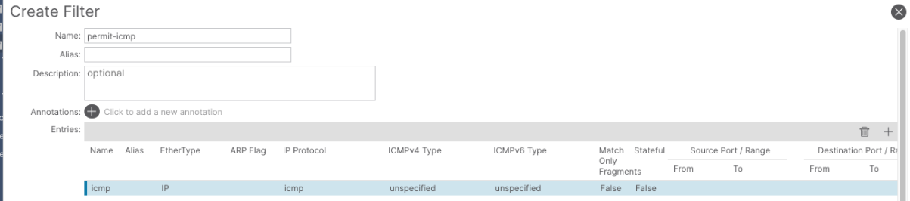

The permit-ssh filter entry allows the source port(s) and destination ports to be defined. In this configuration the source-port is define as “any” and destination port is defined as “ssh”.

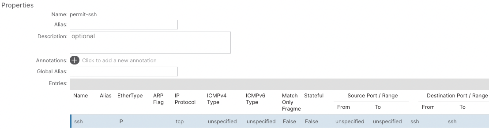

The permit-https filter entry allows the source port(s) and destination ports to be defined. In this configuration the source-port is define as “any” and destination port is defined as “https”.

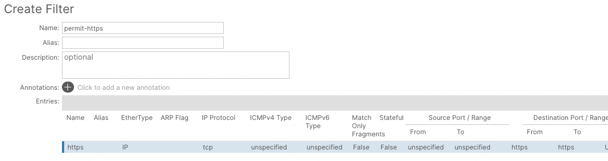

After the Filters and their respective entries are created the next step is to configure the desired contract:

To configure a Standard Contract Navigate to Tenant >> Contracts >> Standard >> Create Contract

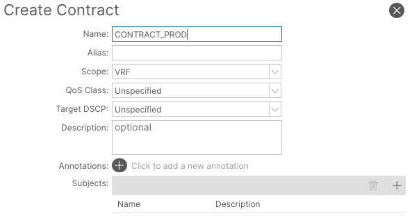

Under the Contract Configuration, the Subject is configured and it references the Filters that were created earlier.

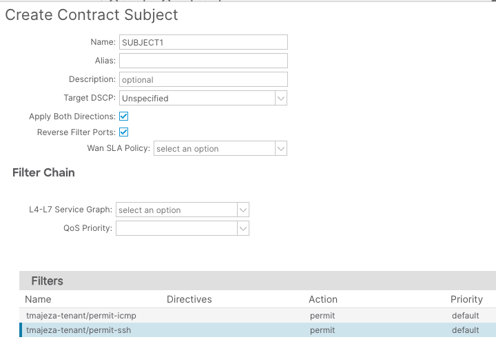

A subject defines the “permit/deny” action on the filter. In this use case ICMP, SSH and HTTPS traffic are permitted.

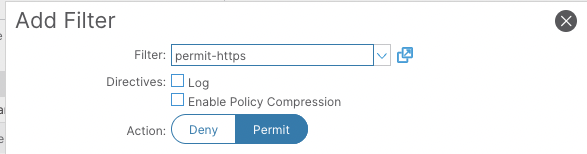

After the Contract has been defined, it must be applied to the EPGs of interest for it to take effect. The direction of the contract (where ACL filtering is applied) is defined by terms “consumer” and “provider”. Consumer is the source and Provider is the destination. In this case EPG-VM is the provider and EPG-2 is the consumer (as it initiates traffic towards the destination EPG).

To apply contracts to the EPGs, navigate to an EPG >> Contracts >> Add Provided/Consumed Contract.

Consumed Contract:

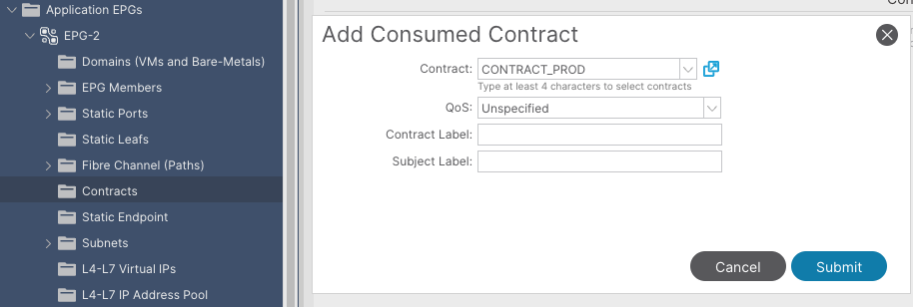

Provided Contract:

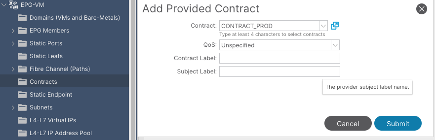

Applying the Contracts configurations result in zoning-rules programmed to the hardware in order to enforce the required policy.

```text
L102# show zoning-rule scope 2129937
+---------+--------+--------+----------+----------------+---------+---------+------------------------------+----------+----------------------+
| Rule ID | SrcEPG | DstEPG | FilterID |                       Dir            |   operSt |            Scope       |                   Name                            |     Action       |             Priority        |
+---------+--------+--------+----------+----------------+---------+---------+------------------------------+----------+----------------------+
|   4331 |    0    |   0    | implicit |    uni-dir     | enabled | 2129937 |                              | deny,log |   any_any_any(21)    |
|    4586    |      0    |     0     | implarp     |     uni-dir              | enabled | 2129937 |                                                                   |     permit       |     any_any_filter(17)      |
|   23746    | 16389     | 49161     |      5      | uni-dir-ignore | enabled | 2129937 | tmajeza-tenant:CONTRACT_PROD |                                                    permit       |         fully_qual(7)       |
|    8146    | 49161     | 16389     |      5      |     bi-dir     | enabled | 2129937 | tmajeza-tenant:CONTRACT_PROD |                                                    permit       |         fully_qual(7)       |
|    6803    | 16389     | 49161     |      45     | uni-dir-ignore | enabled | 2129937 | tmajeza-tenant:CONTRACT_PROD |                                                    permit       |         fully_qual(7)       |
|    7688    | 49161     | 16389     |      44     |     bi-dir     | enabled | 2129937 | tmajeza-tenant:CONTRACT_PROD |                                                    permit       |         fully_qual(7)       |
|    6802    | 16389     | 49161     |      43     | uni-dir-ignore | enabled | 2129937 | tmajeza-tenant:CONTRACT_PROD |                                                    permit       |         fully_qual(7)       |
|    7687    | 49161     | 16389     |      42     |       bi-dir             | enabled | 2129937 | tmajeza-tenant:CONTRACT_PROD |                                          permit       |         fully_qual(7)       |
+---------+--------+--------+----------+----------------+---------+---------+------------------------------+----------+----------------------+
```

Highlights from the zoning-rule table:

- Rule ID – 8146 & 23746: Permits ICMP traffic between EPG-VM & EPG-2. As displayed above, the zoning-rule table identifies EPGs based on their unique pcTags and not user-defined names.
- Rule ID – 7688: Permits SSH traffic from EPG-2 to EPG-VM.
- Rule ID – 6803: Permits the response from EPG-VM to EPG-2.
- Rule ID – 7687: Permits HTTPS connection from EPG-2 to EPG-VM.
- Rule ID – 6802: Permits the response from EPG-VM to EPG-2.

Each filter can be FilterID displays the actually traffic that is being permitted, as per the configuration.

icmp filter entry:

```text
L102# show zoning-filter filter 5
+----------+------+--------+-------------+------+-------------+----------+-------------+-------------+-------------+-------------+-------+-------------+-------------+
| FilterId | Name | EtherT |       ArpOpc   | Prot | ApplyToFrag | Stateful |         SFromPort       |     SToPort     |   DFromPort       |     DToPor t     |   Prio |       Icmpv4T        |    Icmpv6T   |
+----------+------+--------+-------------+------+-------------+----------+-------------+-------------+-------------+-------------+-------+-------------+-------------+
|    5      | 5_0   |   ip   | unspecified | icmp |       no         |   no       | unspecified | unspecified | unspecified | unspecif ied | sport | unspecified | unspecified |
+----------+------+--------+-------------+------+-------------+----------+-------------+-------------+-------------+-------------+-------+-------------+-------------+
```

ssh filter entries:

```text
L102# show zoning-filter filter 44
+----------+------+--------+-------------+------+-------------+----------+-------------+-------------+-----------+---------+-------+-------------+-------------+----------+
| FilterId | Name | EtherT |       ArpOpc   | Prot | ApplyToFrag | Stateful |         SFromPort       |     SToPort     | DFromPort | DToPort |              Prio |       Icmpv4T    |       Icmpv6T    | TcpRules |
+----------+------+--------+-------------+------+-------------+----------+-------------+-------------+-----------+---------+-------+-------------+-------------+----------+
|    44     | 44_0 |    ip   | unspecified | tcp   |      no         |   no       | unspecified | unspecified |               ssh       |       ssh     | dport | unspecified | unspecified |                      |
+----------+------+--------+-------------+------+-------------+----------+-------------+-------------+-----------+---------+-------+-------------+-------------+----------+
```

```text
L102# show zoning-filter filter 45
+----------+------+--------+-------------+------+-------------+----------+-----------+---------+-------------+-------------+-------+-------------+-------------+----------+
| FilterId | Name | EtherT |       ArpOpc   | Prot | ApplyToFrag | Stateful | SFromPort | SToPort |                   DFromPort   |     DToPort         |   Prio |        Icmpv4T    |       Icmpv6T    | TcpRules |
+----------+------+--------+-------------+------+-------------+----------+-----------+---------+-------------+-------------+-------+-------------+-------------+----------+
|    45     | 45_0 |    ip   | unspecified | tcp   |      no         |   no       |     ssh       |       ssh     | unspecified | unspecified | sport | unspecified | unspecified |                                |
+----------+------+--------+-------------+------+-------------+----------+-----------+---------+-------------+-------------+-------+-------------+-------------+----------+
```

https filter entries:

```text
L102# show zoning-filter filter 42
+----------+------+--------+-------------+------+-------------+----------+-------------+-------------+-----------+---------+-------+-------------+-------------+----------+
| FilterId | Name | EtherT |       ArpOpc   | Prot | ApplyToFrag | Stateful |         SFromPort       |     SToPort     | DFromPort | DToPort |              Prio |       Icmpv4T    |       Icmpv6T    | TcpRules |
+----------+------+--------+-------------+------+-------------+----------+-------------+-------------+-----------+---------+-------+-------------+-------------+----------+
|    42     | 42_0 |    ip   | unspecified | tcp   |      no         |   no       | unspecified | unspecified |              https      |       https   | dport | unspecified | unspecified |                      |
+----------+------+--------+-------------+------+-------------+----------+-------------+-------------+-----------+---------+-------+-------------+-------------+----------+
```

```text
L102# show zoning-filter filter 43
+----------+------+--------+-------------+------+-------------+----------+-----------+---------+-------------+-------------+-------+-------------+-------------+----------+
| FilterId | Name | EtherT |       ArpOpc   | Prot | ApplyToFrag | Stateful | SFromPort | SToPort |                   DFromPort   |     DToPort         |   Prio |        Icmpv4T    |       Icmpv6T    | TcpRules |
+----------+------+--------+-------------+------+-------------+----------+-----------+---------+-------------+-------------+-------+-------------+-------------+----------+
|    43     | 43_0 |    ip   | unspecified | tcp   |      no         |   no       |    https      |       https   | unspecified | unspecified | sport | unspecified | unspecified |                                |
+----------+------+--------+-------------+------+-------------+----------+-----------+---------+-------------+-------------+-------+-------------+-------------+----------+
```

The Resulting zoning-entries allow traffic to flow from one EPG to the other according to the Diagram below:

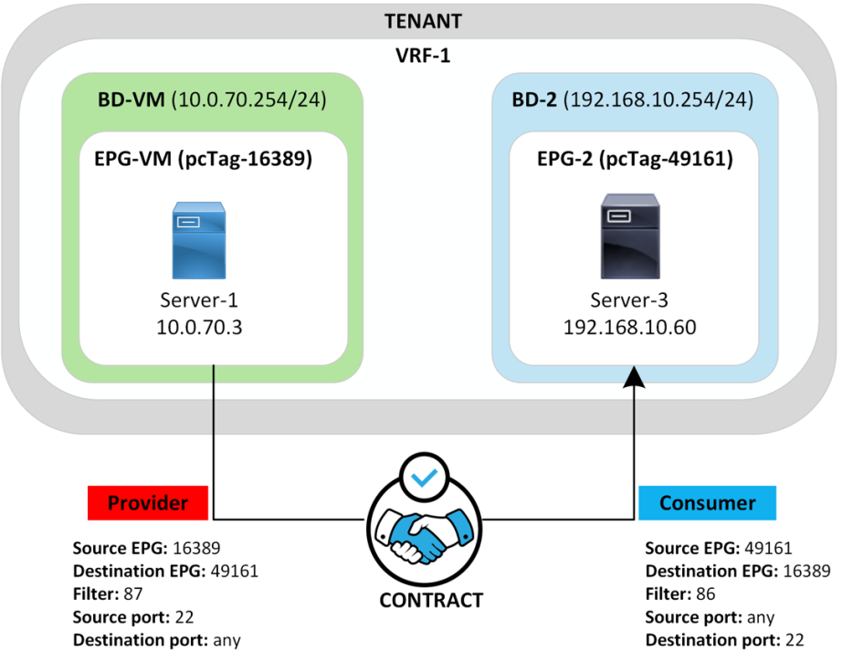

After Contracts have been applied the desired communication (ICMP, SSH and HTTPS) between the EPGs is achieved.

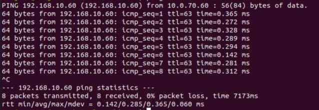

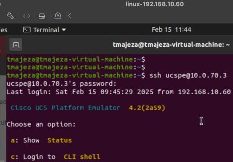

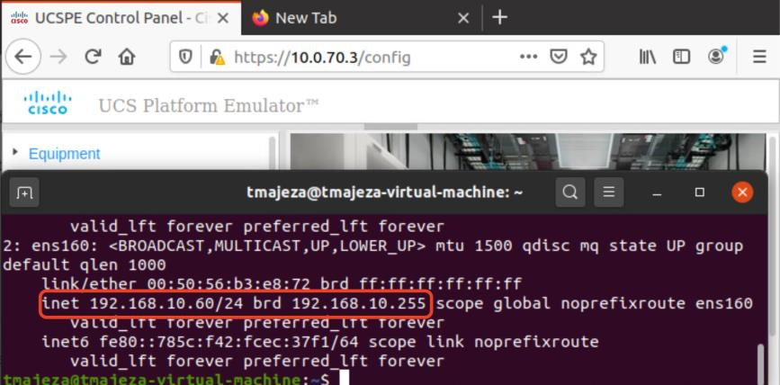

## References

- [https://www.cisco.com/c/en/us/solutions/collateral/data-center-virtualization/application-centric-infrastructure/white-paper-c11-743951.pdf](https://www.cisco.com/c/en/us/solutions/collateral/data-center-virtualization/application-centric-infrastructure/white-paper-c11-743951.pdf)
- [https://www.ciscolive.com/c/dam/r/ciscolive/global-event/docs/2023/pdf/BRKDCN-2658.pdf](https://www.ciscolive.com/c/dam/r/ciscolive/global-event/docs/2023/pdf/BRKDCN-2658.pdf)
