# Enable Transit Routing

## Introduction

In transit routing, the Cisco Application Centric Infrastructure (Cisco ACI) fabric advertises the routes that are learned from one Layer 3 Out (L3Out) connection to another L3Out connection. The transit routing function in the Cisco ACI fabric enables the advertisement of routing information from one L3Out to another, allowing full IP address connectivity between routing domains through the Cisco ACI fabric. The configuration consists of specifying which of the imported routes from an L3Out should be announced to the outside through another L3Out, and which external EPG can talk to which external EPG.

This lab will show how to establish transit routing between two L3Outs (OSPF and BGP). The end goal is to enable communication between the BGP external network and OSPF external network.

## Logical and Physical Topology

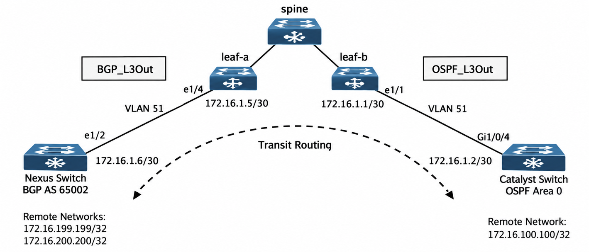

**Figure 1**: Logical and physical lab topology

## Access Policies

**Initial state:** the OSPF peering between the Catalyst switch and ACI is already pre-configured, so the access policies configured here are for the ACI interface connecting to the BGP L3Out.

Go to **Fabric > Access Policies > Interfaces > Leaf Interfaces > Policy Groups > Leaf Access Port**. Examine the interface policy group **ExtL3_IPG** that will be used for the **BGP_L3Out**.

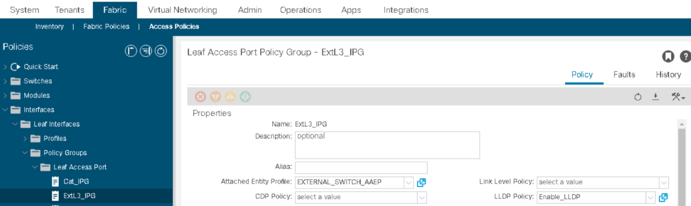

**Figure 2**: Interface policy group ExtL3_IPG

The interface policy group **ExtL3_IPG** references the **EXTERNAL_SWITCH_AAEP**, associated with the Layer 3 domain **ExtL3Dom.**

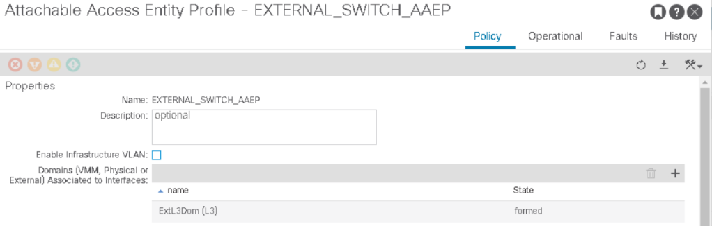

**Figure 3**: ExtL3_IPG reference to EXTERNAL_SWITCH_AAEP

The Layer 3 domain ExtL3Dom is associated with the **ExtL3_VLANs** (VLAN Pool).

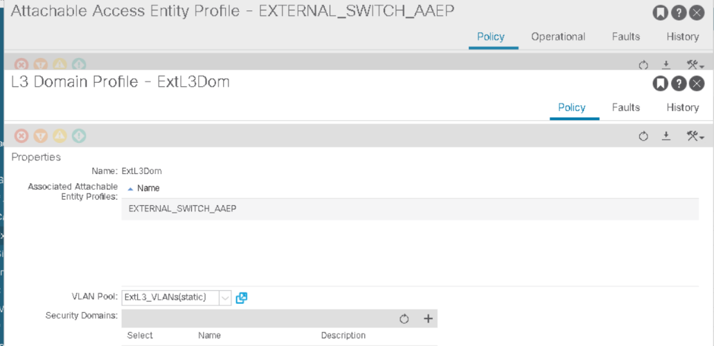

**Figure 4**: L3 domain ExtL3Dom associated with the ExtL3_VLANs VLAN pool

VLAN pool contains a block with VLAN 51 that will be used for BGP peering purposes using an SVI option.

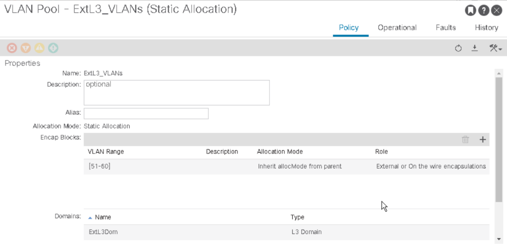

**Figure 5**: VLAN pool ExtL3_VLANs (static allocation, VLAN range 51-60)

In **Fabric > Access Policies > Interfaces > Leaf Interfaces > Profiles**, choose **LEAF101_IFP**, and click **+** and **Continue** to configure an interface selector. Add the interface selector **Ext_Nexus** with the interface ID **1/4** and associate it with the interface policy group **ExtL3_IPG**. Click **Submit**.

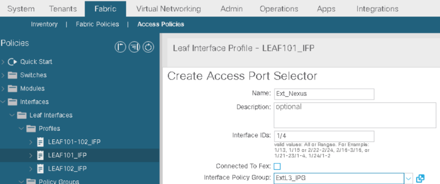

**Figure 6**: Interface selector Ext_Nexus on LEAF101_IFP

## Configure BGP_L3Out and Establish EBGP Session

Having verified and configured the required access policies under the Layer 3 domain for L3Out, you can configure BGP communication between leaf-a and the external Cisco Nexus Switch.

The external Cisco Nexus Switch has been preconfigured with AS 65002 and the border leaf should act as a peer in AS 65003.

On Nexus-24 (the external Cisco Nexus switch), verify that interface Ethernet1/2 is connected to leaf-a on Eth1/4 and is configured as a trunk that allows VLAN 51 since layer 3 peering will use an SVI.

```text
Nexus-24# show lldp neighbor | grep leaf-a
leaf-a                  Eth1/2           120          BR          Eth1/4
Nexus-24#
Nexus-24# show run int e1/2


!Command: show running-config interface Ethernet1/2
interface Ethernet1/2
  description pod1-leafA
  switchport
  switchport mode trunk
  switchport trunk allowed vlan 51
  no shutdown
```

The switchport output confirms that Ethernet1/2 operates as a trunk and allows only VLAN 51, matching the encapsulation configured for the L3Out.

```text
Nexus-24# show interface e1/2 switchport
Name: Ethernet1/2
  Switchport: Enabled
  Operational Mode: trunk
  Access Mode VLAN: 1 (default)
  Trunking Native Mode VLAN: 1 (default)
  Trunking VLANs Allowed: 51
```

Nexus-24 runs AS 65002, advertises the loopback networks 172.16.199.199/32 and 172.16.200.200/32, and peers with 172.16.1.5 (the border leaf SVI) in AS 65003.

```text
Nexus-24# show run bgp
feature bgp
router bgp 65002
  vrf l3out
      address-family ipv4 unicast
         network 172.16.199.199/32
         network 172.16.200.200/32
      neighbor 172.16.1.5
         remote-as 65003
         address-family ipv4 unicast
```

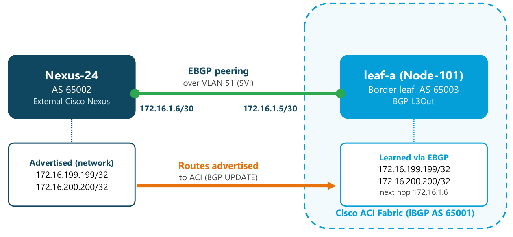

**Figure 7**: EBGP peering between Nexus-24 and ACI leaf-a, and the prefixes Nexus-24 advertises

The l3out VRF on Nexus-24 contains the SVI Vlan51 (172.16.1.6) and the two loopbacks, Lo0 (172.16.200.200) and Lo1 (172.16.199.199). All three interfaces are up.

```text
Nexus-24# show ip interface brief vrf l3out
IP Interface Status for VRF "l3out"(3)
Interface                    IP Address          Interface Status
Vlan51                       172.16.1.6          protocol-up/link-up/admin-up
Lo0                          172.16.200.200      protocol-up/link-up/admin-up
Lo1                          172.16.199.199      protocol-up/link-up/admin-up
```

Vlan51 is the SVI on Nexus-24 that terminates the peering link.

```text
Nexus-24# show run int vlan51
!Command: show running-config interface Vlan51
interface Vlan51
  no shutdown
  mtu 9150
  vrf member l3out
  ip address 172.16.1.6/30
```

By examining the SVI, you can see the interface status, IP address, and MTU.

```text
Nexus-24# show ip interface vlan 51


IP Interface Status for VRF "l3out"(3)
Vlan51, Interface status: protocol-up/link-up/admin-up, iod: 61,
  IP address: 172.16.1.6, IP subnet: 172.16.1.4/30 route-preference: 0, tag: 0
  IP broadcast address: 255.255.255.255
  IP multicast groups locally joined: none
  IP MTU: 9150 bytes (using link MTU)
```

Within the tenant **Sales**, expand **Networking**, right-click **L3Outs**, choose **Create L3Out**. Start the configuration of a L3Out with these settings:

- **Name:** BGP_L3Out
- **VRF:** Presales_VRF
- **L3 Domain:** ExtL3Dom
- **Routing protocol:** BGP

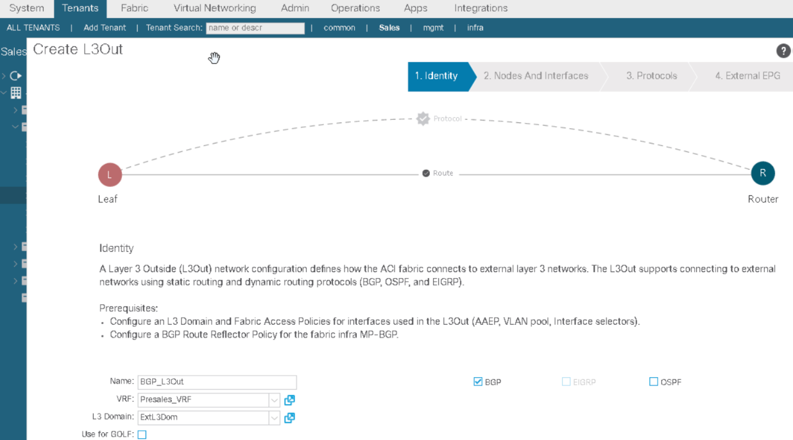

**Figure 8**: Create L3Out: name, VRF, L3 domain and routing protocol

And then click Next.

Navigate to the **Nodes and Interface** page. Enter these settings:

- Clear the **Use Defaults** check box, allowing you to enter a custom node profile name.
- Node Profile Name: **L101**
- Layer 3 Interface Type: **SVI**. Recall the interface types for external Layer 3 connections: routed interfaces, routed subinterfaces, SVIs, and floating SVIs.
- Layer 2 Interface Type: **Port**
- Node ID: **leaf-a (Node-101)**
- Router ID: **10.3.3.3**
- Delete the **Loopback Address**. You do not need to configure a loopback on the border leaf. Only the router ID is mandatory. You would use this option if the BGP peering should be sourced from a loopback.
- Interface: **eth1/4**
- Encap: **VLAN**
- VLAN ID: **51**. This VLAN ID must belong to the static VLAN pool associated with the Layer 3 domain (51-60) that was assigned to the L3Out.
- MTU: **inherit**. The default value on the ACI switches is 9216.
- IP Address: **172.16.1.5/30**. It will be applied the IP address on the SVI on the border leaf.

And then click **Next**.

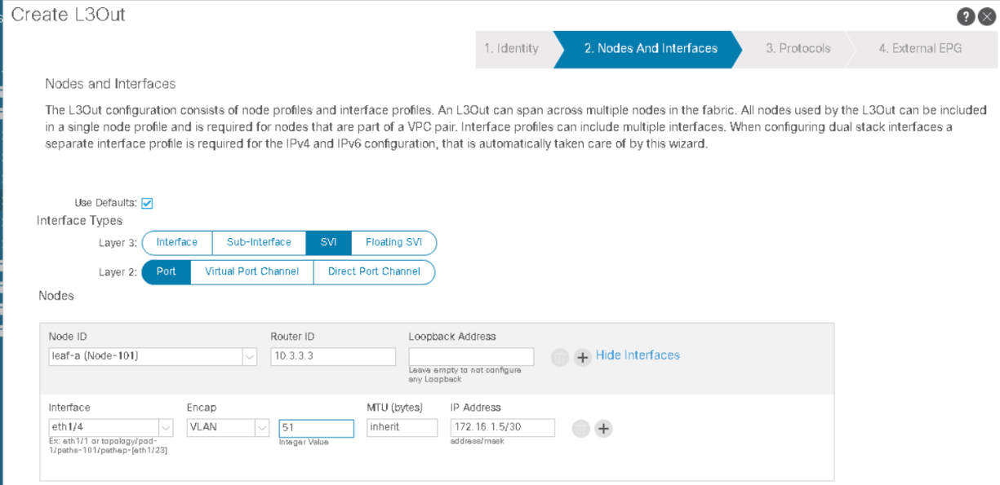

**Figure 9**: Nodes and Interfaces: node profile L101 and SVI on eth1/4

Navigate to the **Protocols** page. Under **Interface Policies** for **eth1/4**, enter these settings:

- **Peer Address:** 172.16.1.6
- **Remote ASN:** 65002

Then click **Next**.

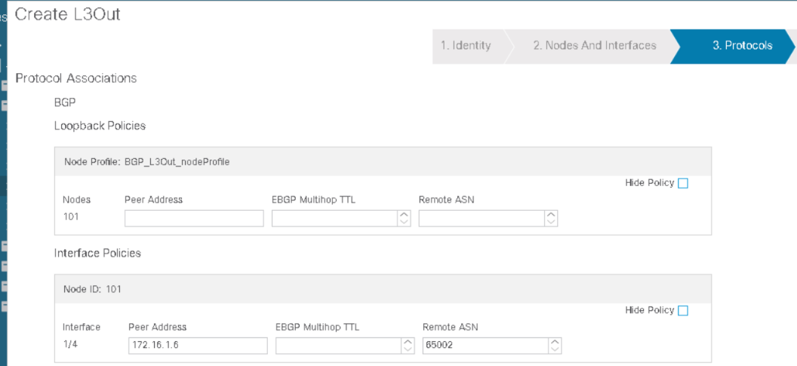

**Figure 10**: Protocols: BGP peer address and remote ASN

Navigate to the **External EPG** page.

In the page, enter the external EPG name **Nexus_ExtNet**, untick the **Default EPG for all external networks** check box, and click **+** in the **Subnets** table.

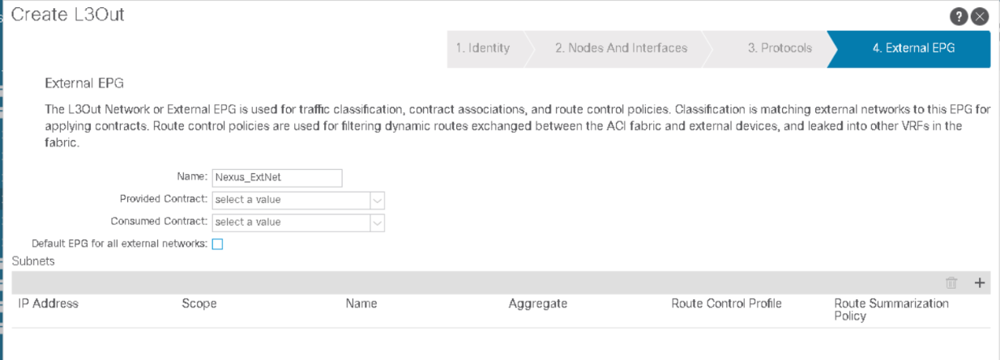

**Figure 11**: External EPG Nexus_ExtNet

In the **Create Subnet** page, enter the subnet **172.16.200.200/32** with only one External EPG classification as **External Subnets for the External EPG**, which is the default setting. This setting will classify the subnet into this external EPG when using contracts. Click **OK**.

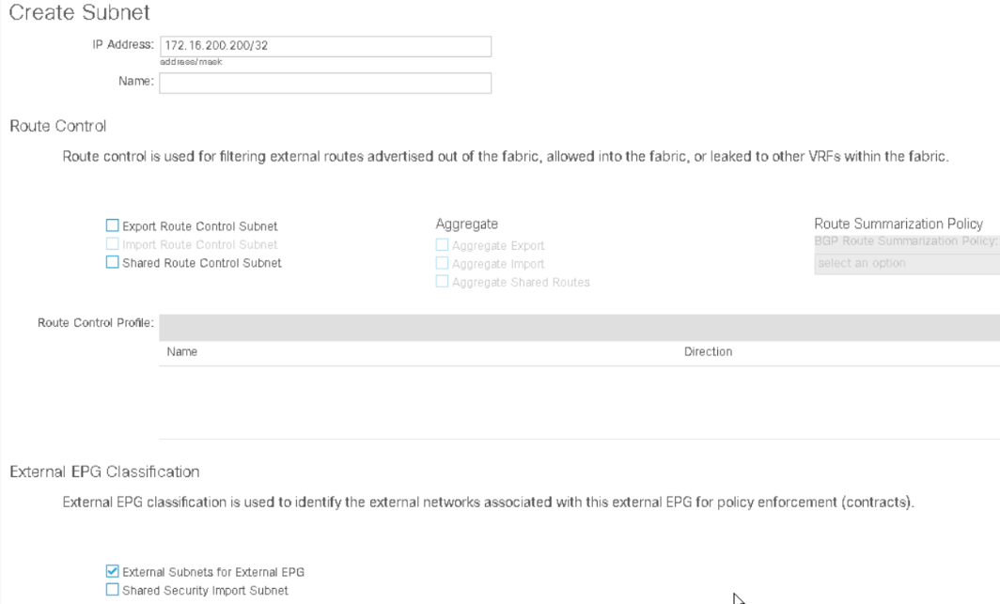

**Figure 12**: Create Subnet for 172.16.200.200/32

Back in the **Create L3Out** configuration wizard, review the external EPG configuration, and click **Finish**.

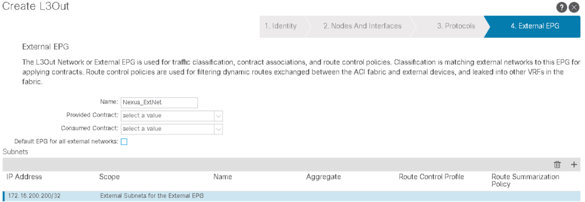

**Figure 13**: Review of the external EPG configuration

The 2 L3Outs are configured under the same VRF

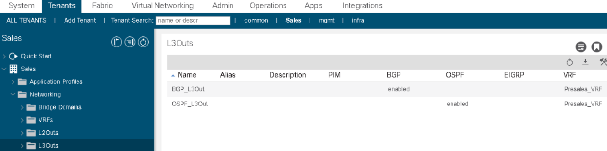

**Figure 14**: OSPF_L3Out and BGP_L3Out under the same VRF

Choose the **BGP Peer Connectivity Profile**, a sub-element of the interface profile. Set the Local AS-Number to **65003**, click **Submit,** and **Submit Changes**.

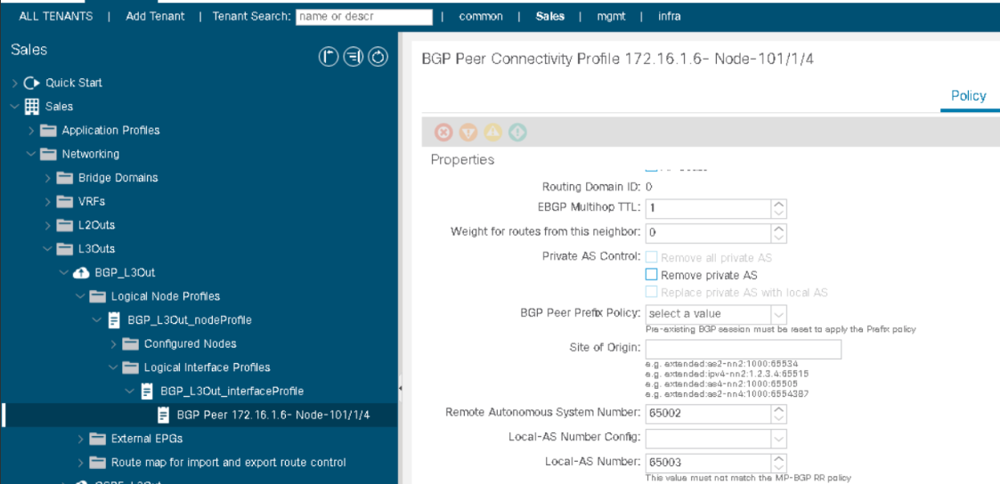

**Figure 15**: BGP Peer Connectivity Profile with Local AS-Number 65003

**Local AS-number is optional.**

If not configured, the border leaf will establish EBGP peering using the BGP autonomous system number that is configured for the internal BGP route reflectors, 65001 in this scenario.

The Local AS feature is used when the L3Out needs to disguise the fabric's own BGP AS with the configured Local AS for a given neighbor. To that neighbor, it looks as if there is one more AS (the Local AS) between itself and the ACI BGP AS, so the neighbor peers with the Local AS instead of the real ACI BGP AS. Routes advertised to the neighbor carry both the Local AS and the real ACI BGP AS in the AS_PATH, and the Local AS is also prepended to routes learned from the neighbor.

This lab guide uses another autonomous system number for the EBGP session to demonstrate the capability to decouple EBGP autonomous system number (ASN) from Internal Border Gateway Protocol (IBGP) ASN or even multiple EBGP sessions (in different L3Outs) from one another.

After the configuration has been pushed, the BGP peering can be verified under the BGP_L3Out node profile. The BGP Peer Entry for neighbor 172.16.1.6 in VRF Sales:Presales_VRF shows a BGP State of Established.

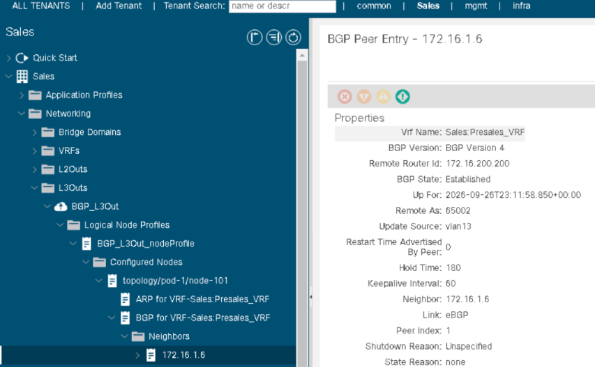

**Figure 16**: BGP peer entry for neighbor 172.16.1.6 in the Established state

On Nexus-24, verify the BGP session established for the L3Out.

```text
Nexus-24# show ip bgp summary vrf all
BGP summary information for VRF l3out, address family IPv4 Unicast
BGP router identifier 172.16.200.200, local AS number 65002
BGP table version is 7, IPv4 Unicast config peers 1, capable peers 1
2 network entries and 2 paths using 440 bytes of memory
BGP attribute entries [1/164], BGP AS path entries [0/0]
BGP community entries [0/0], BGP clusterlist entries [0/0]


Neighbor        V    AS MsgRcvd MsgSent        TblVer    InQ OutQ Up/Down State/PfxRcd
172.16.1.5      4 65003      13      13             7      0    0 00:02:10 0
```

The session table confirms that the EBGP session to 172.16.1.5 (AS 65003) in VRF l3out is in the Established state (E).

```text
Nexus-24# show bgp sessions vrf all
Total peers 1, established peers 1
ASN 65002
VRF default, local ASN 65002
peers 0, established peers 0, local router-id 0.0.0.0
State: I-Idle, A-Active, O-Open, E-Established, C-Closing, S-Shutdown


Neighbor        ASN     Flaps LastUpDn|LastRead|LastWrit St Port(L/R)            Notif(S/R)


VRF l3out, local ASN 65002
peers 1, established peers 1, local router-id 172.16.200.200
State: I-Idle, A-Active, O-Open, E-Established, C-Closing, S-Shutdown


Neighbor        ASN     Flaps LastUpDn|LastRead|LastWrit St Port(L/R)            Notif(S/R)
172.16.1.5      65003   0     00:02:56|00:00:55|00:00:55 E 24781/179                     6/0
```

On leaf-a, verify the external BGP session information. The summary shows the fabric AS, 65001, as the local AS, while the peering to Nexus-24 uses the Local-AS 65003 configured earlier. Leaf-a has received 2 prefixes from Nexus-24, whereas Nexus-24 received 0 prefixes from the fabric, because nothing has been exported yet.

```text
leaf-a# show ip bgp summ vrf all
BGP summary information for VRF Sales:Presales_VRF, address family IPv4 Unicast
BGP router identifier 10.3.3.3, local AS number 65001
BGP table version is 14, IPv4 Unicast config peers 1, capable peers 1
6 network entries and 6 paths using 1024 bytes of memory
BGP attribute entries [5/880], BGP AS path entries [0/0]
BGP community entries [0/0], BGP clusterlist entries [1/4]


Neighbor           V    AS MsgRcvd MsgSent     TblVer    InQ OutQ Up/Down State/PfxRcd
172.16.1.6         4 65002      34      33         14      0    0 00:16:16 2
```

The routing table for the Presales_VRF on leaf-a shows 172.16.199.199/32 and 172.16.200.200/32 learned through EBGP from Nexus-24 (next hop 172.16.1.6).

```text
IP Route Table for VRF "Sales:Presales_VRF"
'*' denotes best ucast next-hop
'**' denotes best mcast next-hop
'[x/y]' denotes [preference/metric]
'%<string>' in via output denotes VRF <string>


172.16.1.0/30, ubest/mbest: 1/0
    *via 10.0.32.66%overlay-1, [200/0], 00:58:15, bgp-65001, internal, tag 65001
172.16.100.100/32, ubest/mbest: 1/0
    *via 10.0.32.66%overlay-1, [200/5], 00:58:09, bgp-65001, internal, tag 65001
172.16.199.199/32, ubest/mbest: 1/0
    *via 172.16.1.6%Sales:Presales_VRF, [20/0], 00:17:12, bgp-65001, external, tag 65003
172.16.200.200/32, ubest/mbest: 1/0
    *via 172.16.1.6%Sales:Presales_VRF, [20/0], 00:17:12, bgp-65001, external, tag 65003
```

On the leafs, examine the Multiprotocol Border Gateway Protocol (MP-BGP) table for your VRF. In the AS path, 65003 is the Local-AS that leaf-a prepends to routes learned from Nexus-24 (AS 65002), which is why the path reads 65003 65002. In the opposite direction, routes that leaf-a advertises to Nexus-24 carry both the Local AS and the real fabric AS in the AS_PATH (65003 65001).

```text
leaf-a# show bgp ipv4 unicast vrf all
BGP routing table information for VRF Sales:Presales_VRF, address family IPv4 Unicast
BGP table version is 14, local router ID is 10.3.3.3
Status: s-suppressed, x-deleted, S-stale, d-dampened, h-history, *-valid, >-best
Path type: i-internal, e-external, c-confed, l-local, a-aggregate, r-redist, I-injected
Origin codes: i - IGP, e - EGP, ? - incomplete, | - multipath, & - backup


   Network               Next Hop              Metric       LocPrf    Weight Path
*>r10.0.3.0/24           0.0.0.0                     0         100     32768 ?
*>i172.16.1.0/30         10.0.32.66                  0         100         0 ?
*>r172.16.1.4/30         0.0.0.0                     0         100     32768 ?
*>i172.16.100.100/32     10.0.32.66                  5         100         0 ?
*>e172.16.199.199/32     172.16.1.6                                       0 65003 65002 i
*>e172.16.200.200/32     172.16.1.6                                       0 65003 65002 i
```

On leaf-b, the same prefixes from Nexus-24 (172.16.199.199/32 and 172.16.200.200/32) appear as iBGP routes learned through leaf-a (next hop 10.0.32.64), which shows that the fabric redistributes the external routes.

```text
leaf-b# show bgp ipv4 unicast vrf all
BGP routing table information for VRF Sales:Presales_VRF, address family IPv4 Unicast
BGP table version is 15, local router ID is 10.0.1.254
Status: s-suppressed, x-deleted, S-stale, d-dampened, h-history, *-valid, >-best
Path type: i-internal, e-external, c-confed, l-local, a-aggregate, r-redist, I-injected
Origin codes: i - IGP, e - EGP, ? - incomplete, | - multipath, & - backup


   Network              Next Hop                Metric       LocPrf          Weight Path
*>r10.0.3.0/24          0.0.0.0                       0         100           32768 ?
*>r172.16.1.0/30        0.0.0.0                       0         100           32768 ?
*>i172.16.1.4/30        10.0.32.64                    0         100               0 ?
*>r172.16.100.100/32    0.0.0.0                       5         100           32768 ?
*>i172.16.199.199/32    10.0.32.64                              100               0 65003 65002 i
*>i172.16.200.200/32    10.0.32.64                              100               0 65003 65002 i
```

Note: Topology with routes for easy reference and comparison with the routing tables.

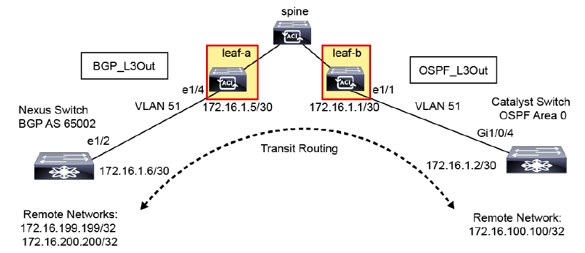

**Figure 17**: Topology with routes for reference

Before any transit routing settings are applied, each L3Out only knows its own local routes. In the OSPF_L3Out, the external EPG Cat_ExtNet lists its local subnets, 172.16.1.0/30 and 172.16.100.100/32, with the scope External Subnets for the External EPG.

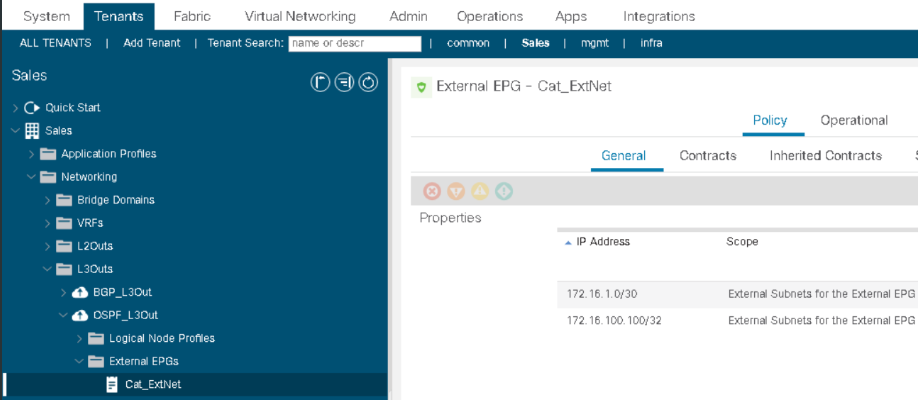

**Figure 18**: OSPF_L3Out: external EPG Cat_ExtNet before transit routing

Likewise, in the BGP_L3Out, the external EPG Nexus_ExtNet lists only its own local subnet, 172.16.200.200/32, again with the scope External Subnets for the External EPG. This is the starting state, before any of the transit routing settings are configured in the next section.

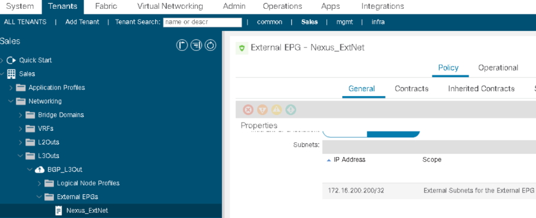

**Figure 19**: BGP_L3Out: external EPG Nexus_ExtNet before transit routing

## Export Routes and Apply Contract

To implement transit routing, external routes will be exported out of the fabric and we will use the FileServices_Ct contract that is already applied to OSPF_L3Out. After applying the contract to the external EPG in BGP_L3Out, the transit connectivity will be tested.

Each subnet in an external EPG has a scope that controls what ACI does with it. External Subnets for the External EPG classifies matching traffic into the EPG, so that a contract can be applied to it. Export Route Control Subnet advertises the matching route out of the L3Out to its neighbor.

In this lab each prefix is classified in only one external EPG: the OSPF prefixes in Cat_ExtNet and the BGP prefix in Nexus_ExtNet. Cat_ExtNet exports the BGP prefix (172.16.200.200/32) to the Catalyst switch, and Nexus_ExtNet exports the OSPF prefixes (172.16.1.0/30 and 172.16.100.100/32) to Nexus-24. ACI does not allow the same prefix to be classified with the External Subnets for the External EPG scope in two external EPGs in one VRF, and raises a fault if you try.

On Nexus-24, examine the BGP routes in the routing table.

```text
Nexus-24# show ip route bgp vrf l3out
IP Route Table for VRF "l3out"
'*' denotes best ucast next-hop
'**' denotes best mcast next-hop
'[x/y]' denotes [preference/metric]
'%<string>' in via output denotes VRF <string>
```

You will not see any routes until you allow an external OSPF subnet to be exported to the BGP_L3Out. Similarly, you would not see any external Cisco Nexus routes on the Catalyst switch.

In **Nexus_ExtNet**, go to **Policy > General** and click **+** in the **Subnets** table to add a subnet.

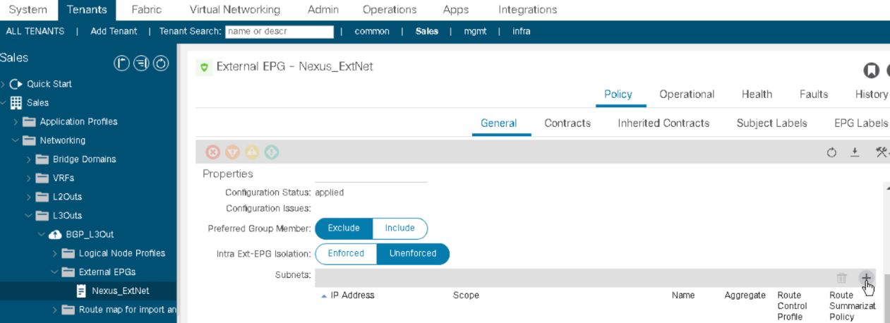

**Figure 20**: Adding a subnet to Nexus_ExtNet (Policy > General)

Enter the IP address of the external subnet received from the OSPF_L3Out, **172.16.100.100/32**, choose **Export Route Control Subnet** in the **Route Control** section and untick the **External Subnets for the External EPG** classification. Click **Submit**.

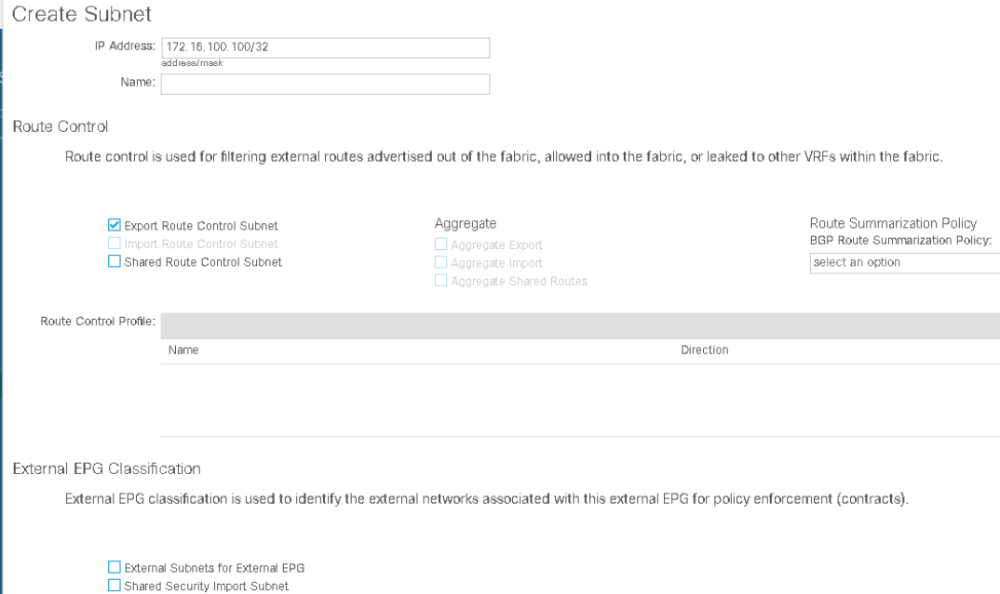

**Figure 21**: Export Route Control Subnet 172.16.100.100/32 in Nexus_ExtNet

On Nexus-24, examine the BGP routes in the routing table.

```text
Nexus-24# show ip route bgp vrf l3out
IP Route Table for VRF "l3out"
'*' denotes best ucast next-hop
'**' denotes best mcast next-hop
'[x/y]' denotes [preference/metric]
'%<string>' in via output denotes VRF <string>


172.16.100.100/32, ubest/mbest: 1/0
    *via 172.16.1.5, [20/0], 00:00:15, bgp-65002, external, tag 65003
```

On the cat, examine the OSPF routes.

```text
3560-24>show ip route ospf
Codes: L - local, C - connected, S - static, R - RIP, M - mobile, B - BGP
        D - EIGRP, EX - EIGRP external, O - OSPF, IA - OSPF inter area
        N1 - OSPF NSSA external type 1, N2 - OSPF NSSA external type 2
        E1 - OSPF external type 1, E2 - OSPF external type 2
        i - IS-IS, su - IS-IS summary, L1 - IS-IS level-1, L2 - IS-IS level-2
        ia - IS-IS inter area, * - candidate default, U - per-user static route
        o - ODR, P - periodic downloaded static route, H - NHRP, l - LISP
        a - application route
        + - replicated route, % - next hop override


Gateway of last resort is not set


       10.0.0.0/8 is variably subnetted, 5 subnets, 2 masks
O E2      10.0.3.0/24 [110/20] via 172.16.1.1, 01:06:36, Vlan51
```

The external route behind the BGP_L3Out is missing until you export it over the OSPF_L3Out. Go to the OSPF_L3Out and its external EPG Cat_ExtNet. In **Policy > General** click **+** in the **Subnets** table. Configure the external subnet received from BGP_L3Out, **172.16.200.200/32**, choose **Export Route Control Subnet** and clear the **External Subnets for the External EPG** classification. Click **Submit**.

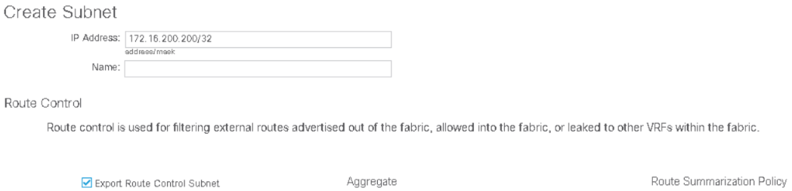

**Figure 22**: Export Route Control Subnet 172.16.200.200/32 in Cat_ExtNet

After the export, the Catalyst switch learns 172.16.200.200/32, the Nexus-24 loopback, as an OSPF external type 2 route through 172.16.1.1. Nexus-24's second loopback,172.16.199.199/32, has no export subnet configured, so the Catalyst has no route to it. In this case, only prefixes configured with Export Route Control Subnet are advertised.

```text
3560-24>show ip route ospf
Codes: L - local, C - connected, S - static, R - RIP, M - mobile, B - BGP
        D - EIGRP, EX - EIGRP external, O - OSPF, IA - OSPF inter area
        N1 - OSPF NSSA external type 1, N2 - OSPF NSSA external type 2
        E1 - OSPF external type 1, E2 - OSPF external type 2
        i - IS-IS, su - IS-IS summary, L1 - IS-IS level-1, L2 - IS-IS level-2
        ia - IS-IS inter area, * - candidate default, U - per-user static route
        o - ODR, P - periodic downloaded static route, H - NHRP, l - LISP
        a - application route
        + - replicated route, % - next hop override


Gateway of last resort is not set


       10.0.0.0/8 is variably subnetted, 5 subnets, 2 masks
O E2      10.0.3.0/24 [110/20] via 172.16.1.1, 00:01:11, Vlan51
       172.16.0.0/16 is variably subnetted, 4 subnets, 2 masks
O E2      172.16.200.200/32 [110/1] via 172.16.1.1, 00:00:05, Vlan51
```

On Nexus-24, ping the external OSPF network 172.16.100.100 from Loopback 0 172.16.200.200.

```text
Nexus-24# ping 172.16.100.100 source 172.16.200.200 vrf l3out
PING 172.16.100.100 (172.16.100.100) from 172.16.200.200: 56 data bytes
Request 0 timed out
Request 1 timed out
Request 2 timed out
Request 3 timed out
Request 4 timed out


--- 172.16.100.100 ping statistics ---
5 packets transmitted, 0 packets received, 100.00% packet loss
```

Connectivity will fail because a contract to the communicating EPGs has not been applied. In the **OSPF_L3Out** and its external EPG **Cat_ExtNet**, examine the applied contracts.

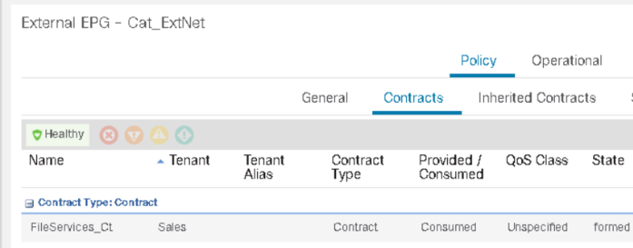

**Figure 23**: Contracts applied to Cat_ExtNet in OSPF_L3Out

Go to the **BGP_L3Out** and its external EPG **Nexus_ExtNet** and choose **Policy > Contracts**. Click the tools button and choose **Add Provided Contract**. Choose **FileServices_Ct** and click **Submit**. FileServices_Ct is an existing contract in tenant Sales: Nexus_ExtNet provides it and Cat_ExtNet consumes it. Its subject and filter must permit ICMP for the ping tests to succeed.

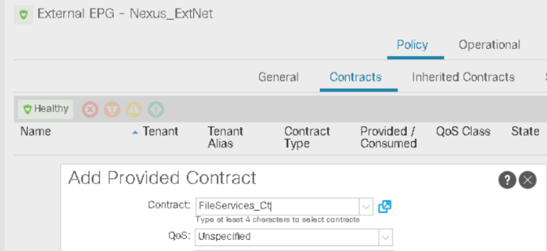

**Figure 24**: Adding the provided contract FileServices_Ct to Nexus_ExtNet

After the contract is applied, repeat the ping from Nexus-24. It now succeeds with no packet loss.

```text
Nexus-24# ping 172.16.100.100 source 172.16.200.200 vrf l3out
PING 172.16.100.100 (172.16.100.100) from 172.16.200.200: 56 data bytes
64 bytes from 172.16.100.100: icmp_seq=0 ttl=252 time=2.473 ms
64 bytes from 172.16.100.100: icmp_seq=1 ttl=252 time=1.981 ms
64 bytes from 172.16.100.100: icmp_seq=2 ttl=252 time=2.192 ms
64 bytes from 172.16.100.100: icmp_seq=3 ttl=252 time=4.567 ms
64 bytes from 172.16.100.100: icmp_seq=4 ttl=252 time=1.956 ms


--- 172.16.100.100 ping statistics ---
5 packets transmitted, 5 packets received, 0.00% packet loss
round-trip min/avg/max = 1.956/2.633/4.567 ms
```

In Nexus_ExtNet, go to **Policy > General** and add a subnet for the point-to-point OSPF peering network 172.16.1.0/30. Choose **Export Route Control Subnet** and clear the **External Subnets for the External EPG** classification. Click **Submit**.

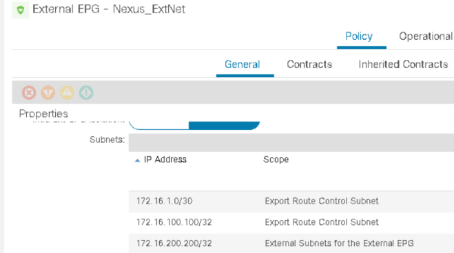

**Figure 25**: Export Route Control Subnet 172.16.1.0/30 in Nexus_ExtNet

Nexus-24 now also learns 172.16.1.0/30, the point-to-point OSPF peering network, in addition to 172.16.100.100/32.

```text
Nexus-24# show ip route bgp vrf l3out
IP Route Table for VRF "l3out"
'*' denotes best ucast next-hop
'**' denotes best mcast next-hop
'[x/y]' denotes [preference/metric]
'%<string>' in via output denotes VRF <string>


172.16.1.0/30, ubest/mbest: 1/0
    *via 172.16.1.5, [20/0], 00:00:22, bgp-65002, external, tag 65003
172.16.100.100/32, ubest/mbest: 1/0
    *via 172.16.1.5, [20/0], 00:24:23, bgp-65002, external, tag 65003
```

From the Catalyst switch, ping the Nexus-24 loopback 172.16.200.200 to confirm that transit connectivity works in the opposite direction. The Catalyst sources the ping from its interface address 172.16.1.2, so the Nexus-24 needs a return route to 172.16.1.0/30. This is why that subnet was exported from Nexus_ExtNet in the previous step.

```text
3560-24>ping 172.16.200.200
Type escape sequence to abort.
Sending 5, 100-byte ICMP Echos to 172.16.200.200, timeout is 2 seconds:
!!!!!
Success rate is 100 percent (5/5), round-trip min/avg/max = 1/2/4 ms
```

The diagram below summarises the final state of both external EPGs once the transit routing settings are in place: the scope (subnet control knob) of each subnet, and the FileServices_Ct contract that links the two EPGs.

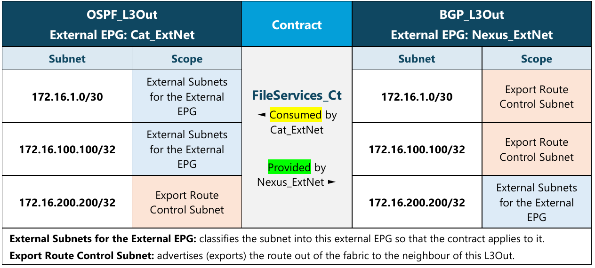

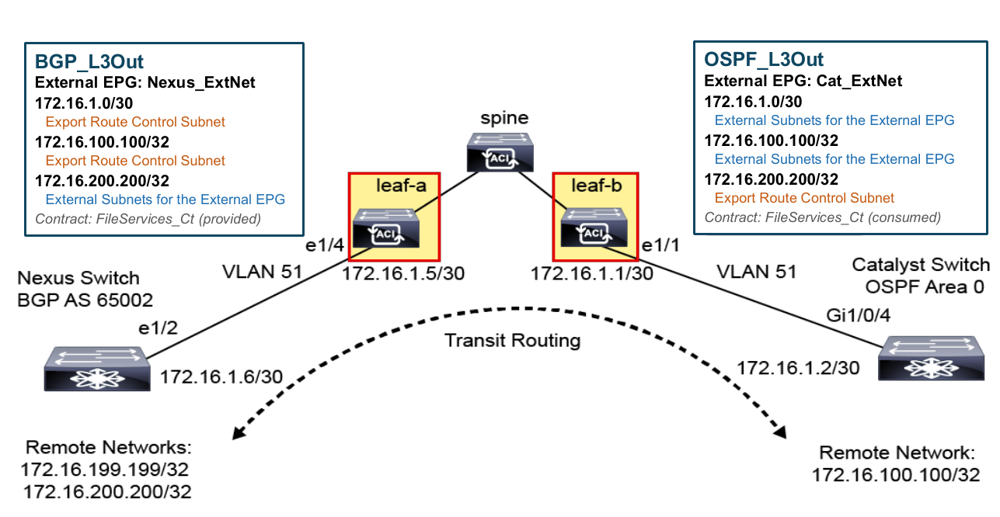

**Figure 26**: Final state of the external EPGs: subnet scopes and FileServices_Ct contract

## References

1. [https://www.cisco.com/site/us/en/learn/training-certifications/training/courses/dcaci.html](https://www.cisco.com/site/us/en/learn/training-certifications/training/courses/dcaci.html)
2. [https://www.cisco.com/c/en/us/solutions/collateral/data-center-virtualization/application-centric-infrastructure/guide-c07-743150.html](https://www.cisco.com/c/en/us/solutions/collateral/data-center-virtualization/application-centric-infrastructure/guide-c07-743150.html)
3. [https://titusm.github.io/Cisco-Data-Center/aci/transit-routing/](https://titusm.github.io/Cisco-Data-Center/aci/transit-routing/)
