# Cisco ACI Endpoint Security Groups (ESGs)

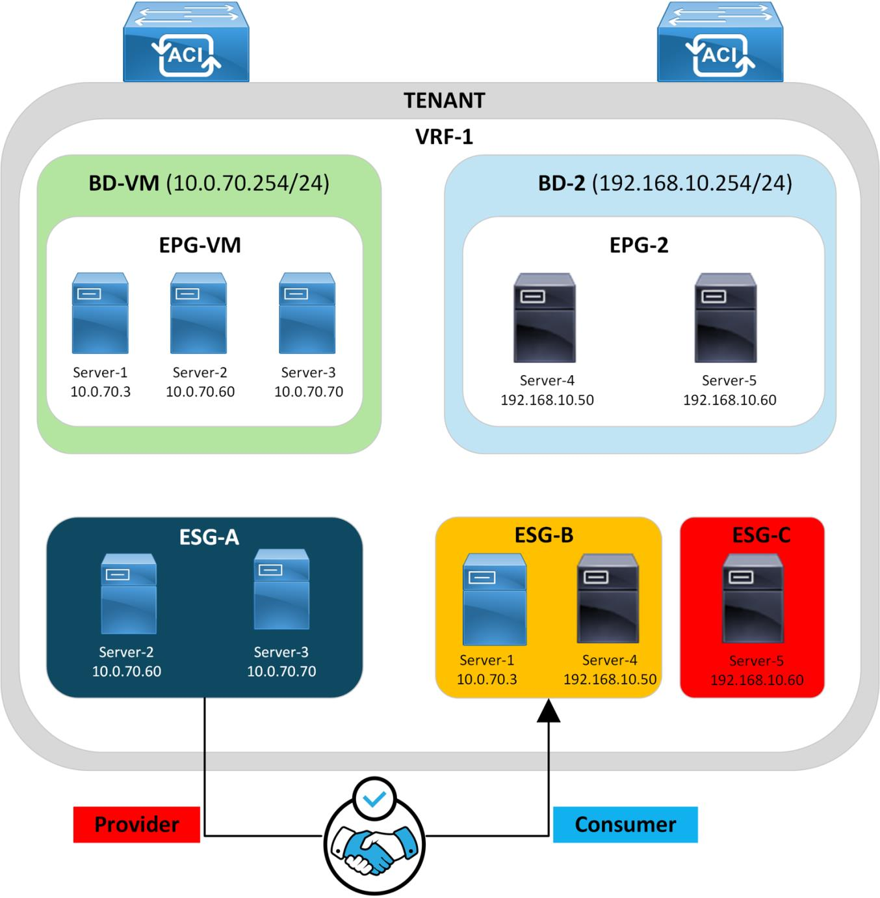

## Overview

An Endpoint Security Group (ESG) is a logical entity that contains network endpoints that are dynamically classified in them for segmentation purposes. Unlike an Endpoint Group (EPG), which defines a security zone under a Bridge Domain (BD), an ESG defines a security zone within a VRF and is independent of the Bridge Domain. ESGs allows endpoints from any EPG within the same VRF to be classified inside them. It has no dependency with the Bridge domain. When ESGs are implemented in, the contracts are applied on the ESG level and not on the EPGs.

Endpoints are not automatically learned under the ESGs, instead there are match criteria that are defined and used to classify an endpoint into a specific ESG. This match criteria is known as ESG Selectors.
These selectors include:

- virtual machine name
- virtual machine tag
- Endpoint MAC address
- Endpoint IP address.

A selector is defined under the ESG object and any endpoint within its respective EPG that matches the defined attribute will be automatically classified into that ESG. If the ESG has a contract associated with it, the contract applies to all endpoints within that ESG.

For more details, refer to the official Cisco ACI Endpoint Security Group (ESG) Design Guide: [https://www.cisco.com/c/en/us/td/docs/dcn/whitepapers/cisco-aci-esg-design-guide.html](https://www.cisco.com/c/en/us/td/docs/dcn/whitepapers/cisco-aci-esg-design-guide.html)

!!! note
    This lab was conducted in a controlled environment. Any configurations in a production network should be implemented during a designated maintenance window. Additionally, always refer to official Cisco documentation relevant to your specific hardware and software.

## Lab-Setup

In this lab, there are two Endpoint Groups (EPGs), each within its respective Bridge Domain (BD), under the same Virtual Routing and Forwarding (VRF) instance. EPG-VM contains three endpoints and EPG-2 contains two endpoints. These endpoints will be classified to different ESGs and contracts will be applied to the ESGs, instead of EPGs.

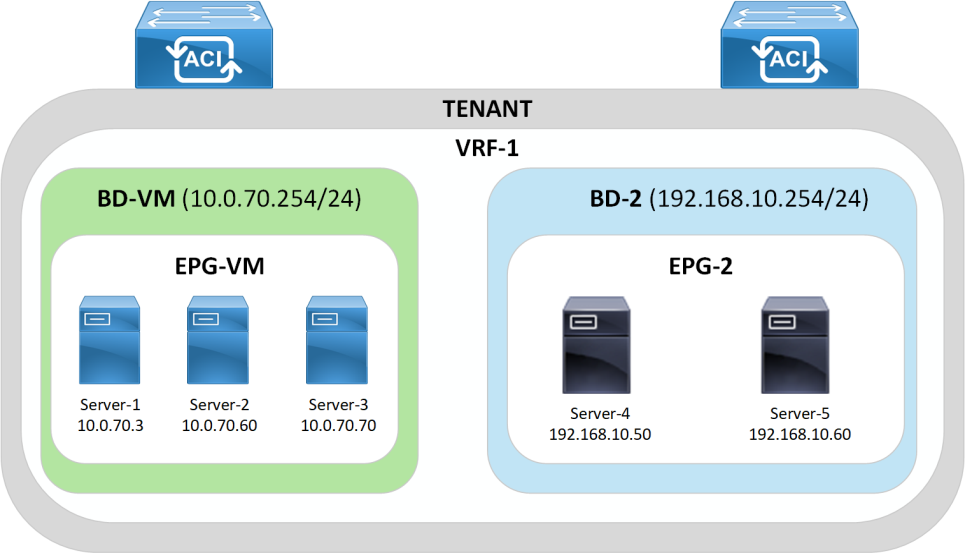

Verify endpoint learning:

```text
L101# show endpoint vrf tmajeza-tenant:VRF-1
Legend:
 S - static           s - arp               L - local             O - peer-attached
 V - vpc-attached     a - local-aged        p - peer-aged         M - span
 B - bounce           H - vtep              R - peer-attached-rl D - bounce-to-proxy
 E - shared-service   m - svc-mgr           C - control-ep
+-----------------------------------+---------------+-----------------+--------------+-------------+
      VLAN/                           Encap            MAC Address        MAC Info/     Interface
      Domain                          VLAN             IP Address         IP Info
+-----------------------------------+---------------+-----------------+--------------+-------------+
928                                       vlan-3129     0050.56b3.42c8 L                     eth1/5
tmajeza-tenant:VRF-1                       vlan-3129          10.0.70.3 L                    eth1/5
928                                       vlan-3129     0050.56b3.46ee O                   tunnel39
tmajeza-tenant:VRF-1                       vlan-3129         10.0.70.70 O                  tunnel39
928                                       vlan-3129     0050.56b3.5dd6 L                     eth1/5
tmajeza-tenant:VRF-1                       vlan-3129         10.0.70.60 L                    eth1/5
174                                        vlan-1929    cc16.7e82.a5f3 L                    eth1/50
tmajeza-tenant:VRF-1                       vlan-1929      192.168.10.50 L                   eth1/50
206                                       vlan-3014     0050.56b3.1ab7 L                     eth1/5
tmajeza-tenant:VRF-1                       vlan-3014      192.168.10.60 L                    eth1/5
```

ICMP reachability between Server-1 and Server-2 in the EPG-VM.

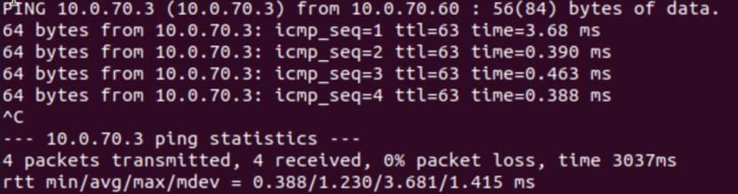

ICMP reachability between Server-2 and Server-3 in the EPG-VM.

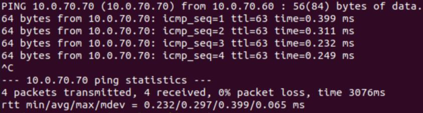

ICMP reachability between Server-1 and Server-3 in the EPG-VM.

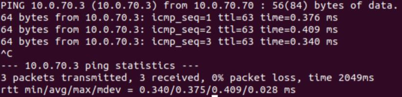

No communication is allowed between Servers in EPG-VM and Servers in EPG-2


ICMP reachability between Server-4 and Server-5 in the EPG-2.

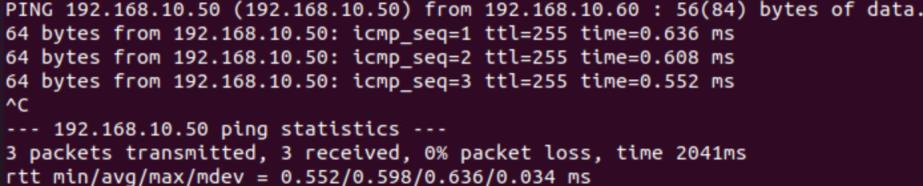

The communication matrix below provides an overview of server connectivity before any endpoint-to-ESG classification is applied. At this stage, endpoints can only communicate within their respective EPGs. No inter-ESG communication is permitted.

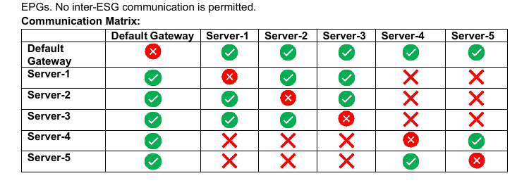

## Target State

In this lab the design requirement is to place Server-2 & Server-3 in ESG-A, Server-1 & Server-4 in ESG-B and Server-5 in ESG-C. Classification of endpoints across the EPGs into the required ESGs will be achieved by the use of the following Selectors; Tag Selectors with VMM Integration (VM tags and VM names), IP Subnet selector, Endpoint IP Tag and Endpoint MAC Tag.

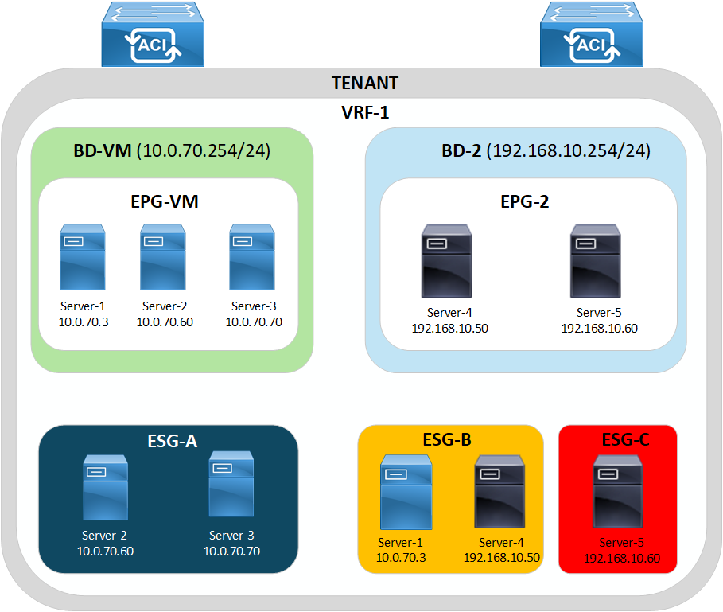

## ESG Configuration

To configure an Endpoint Security Group navigate to Tenant >> Application Profile >> Endpoint Security Groups >> Create Endpoint Security Group & Associate it with the VRF

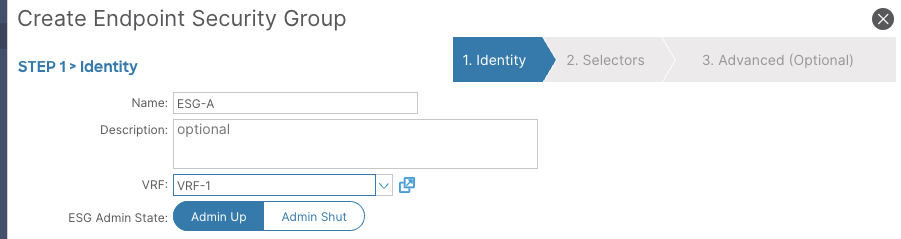

Leave the Selectors empty as these will be defined later after the creation of the required ESGs.

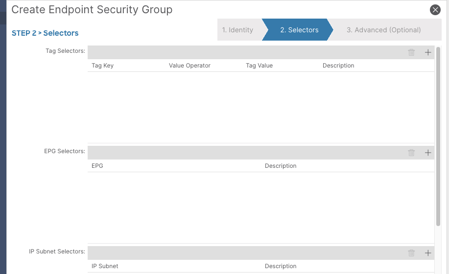

Leave the Advanced options in their default state.

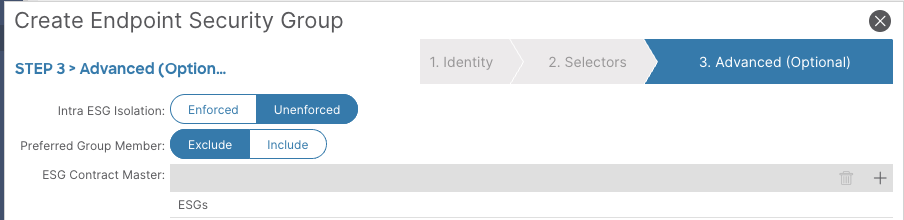

The required ESGs are successfully configured as follows:

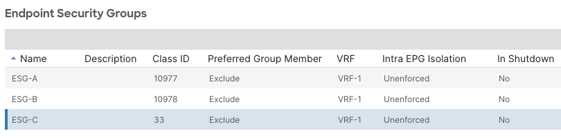

!!! note
    Just like EPGs, ESGs are also assigned a unique "Class ID" or pcTag.

After the successful creation of ESGs, there are no endpoints classified in them until Selectors are defined in each ESG to classify the endpoints.

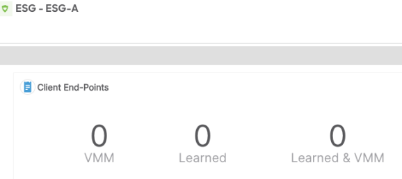

As shown below, there are no endpoints associated in any of the Endpoint Security Group.

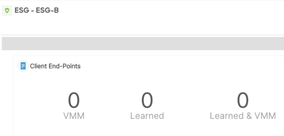

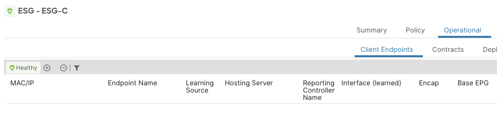

Selectors can be used to classify endpoints in the respective ESG according to the design requirements.

For ESG-A, Tag Selectors with VMM Integration are going to be used to classify Server-2 and Server-3 in this ESG. VM tags and VM names from VMware vCenter will be used for endpoint classification in an ESG.

!!! note
    For this use case, VMM domain integration with read-write permissions is required.

When VM tags or VM names are used for tag selectors, the following two configurations are required on top of the tag selectors themselves.

1. Enable "Tag Collection" under the VMM domain itself.

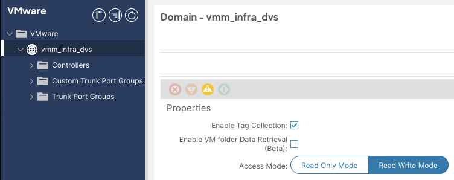

2. Enable "Allow Micro-Segmentation" through the VMM domain association in the EPG.
    a. This deploys PVLAN on Cisco ACI leaf switches and VMware vCenter port groups automatically. This is to prevent VMware virtual switches from bridging the traffic within the same port group without forwarding the traffic to Cisco ACI.

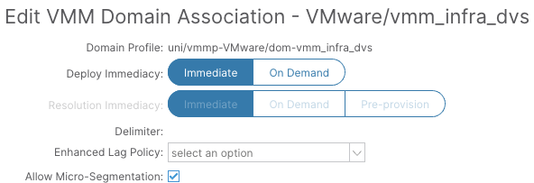

## ESG-A Endpoint Classification

1. Server-2's virtual name (i.e. linux-10.0.70.60) on VMware vCenter will be used as the attribute.

2. Server-3's assigned tag on VMware vCenter (tag: dev-server, Category: DEV-ENV) will be used as the attribute.

Create the Tag selector under ESG-A and match the VM name and VM tag that are defined in VMWare vCenter for each VM.

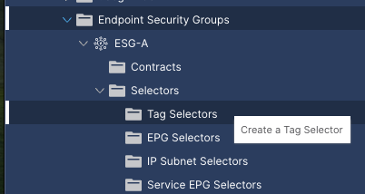

The resulting configuration is shown below (Tag selectors are successfully created under ESG-A):

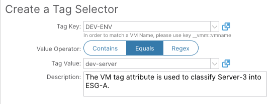

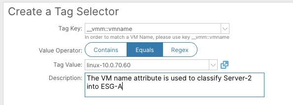

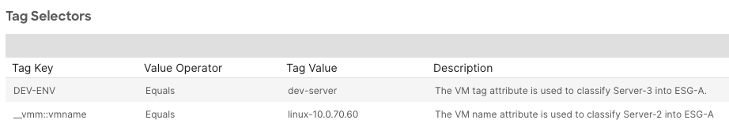

The endpoints that match the defined criteria from the Tag Selectors are dynamically learned in ESG-A as shown below.

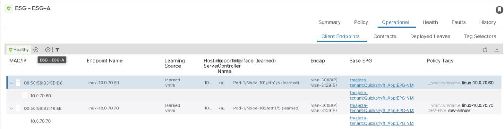

To view the endpoints that matched a specific classification criteria, navigate to ESG >> Operational >> Tag Selectors >> Associated Objects.

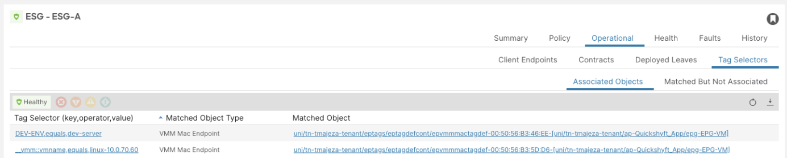

## ESG-B Endpoint Classification

Server-1's IP Address is used to classify it into ESG-B. Under ESG-B, navigate to Selectors >> IP Subnet Selectors and Create an IP Subnet Selector. In this lab the specific IP address of Server-1 was defined.

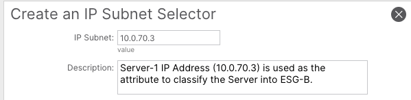

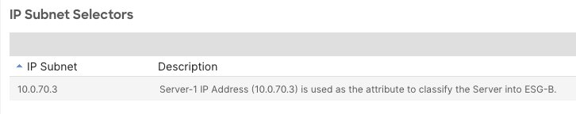

Server-4 in EPG-2 is assigned an ACI policy tag (server-4) and this tag will be used to classify the server in ESG-B.

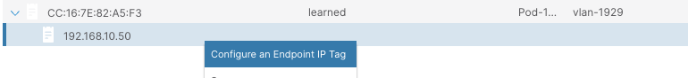

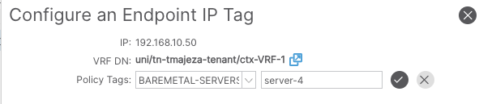

Under the ESG, Create a Tag selector that matches the IP Endpoint tag that was defined for Server-4.

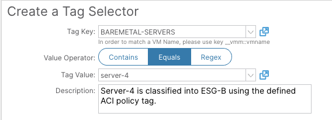

To view the Selectors that were defined under ESG-B, Navigate and Click on "Selectors":

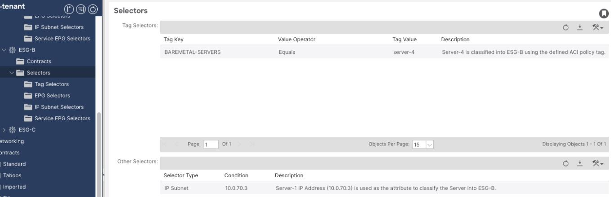

Server-1 and Server-4 are successfully matched into ESG-B based on the IP Subnet selector and Tag selector that were defined as the match criteria. The Base EPG indicates the actual EPG where the matched endpoint belongs to. It is evident that endpoints from different EPGs can be classified in the same Endpoint Security Group.

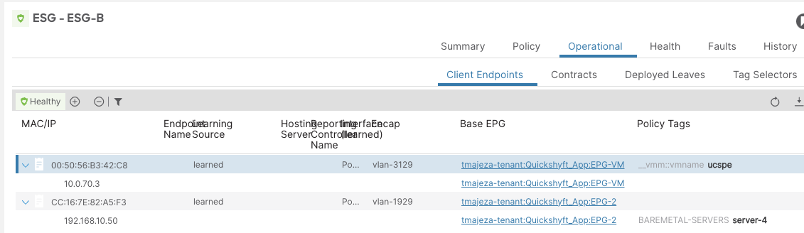

## ESG-C Endpoint Classification

An Endpoint MAC tag is created for Server-5.

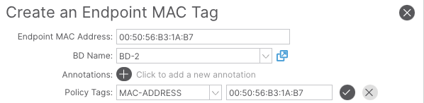

Under ESG-C, a Tag Selector is created using the MAC-ADDRESS of Server-5.

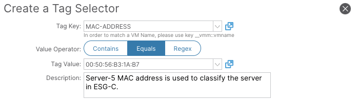

The created Tag Selector can be seen under ESG-C>>Tag Selector

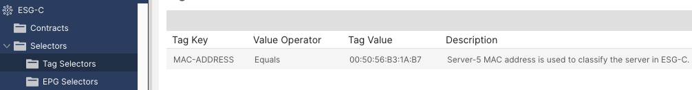

Server-5 from EPG-2 matches the defined criteria thus dynamically mapped to ESG-C.

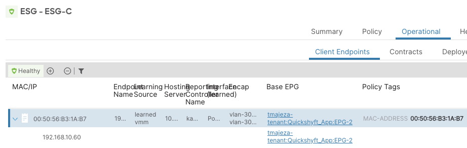

The diagram below shows the endpoints classification into ESGs that has been achieved. From this point, contracts can be applied to ESGs, and any endpoint within an ESG is subject to the security policies defined for that ESG.

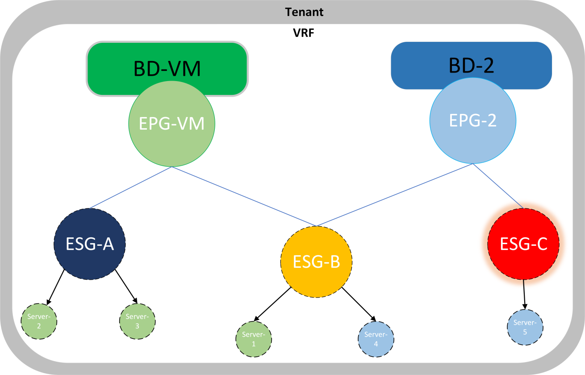

The communication matrix below shows which servers can communicate with each other before any contracts are applied between ESGs. It is evident that only endpoints within the same ESG can communicate, while inter-ESG communication is not permitted

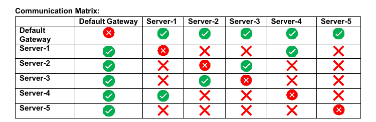

No communication is allowed between Server-1 and (Server-2/Server3) as they are in different ESGs.

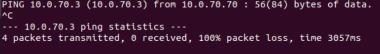

ICMP reachability between Server-2 and Server-3 in ESG-A.

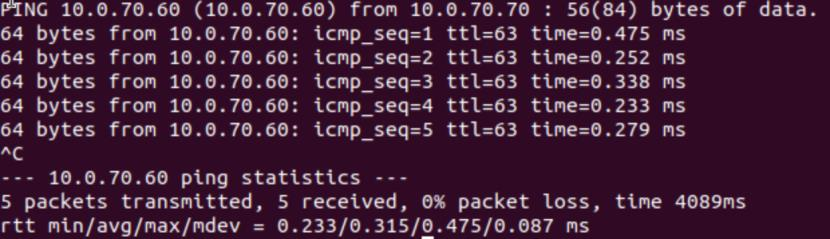

ICMP reachability between Server-1 and Server-4 in ESG-B.

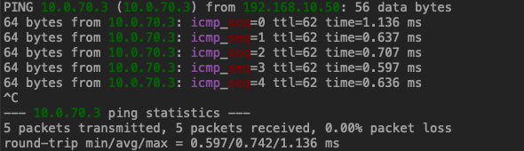

No communication is allowed between Server-4/Server-1 and Server-5 as they are in different ESGs.

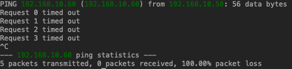

## Contracts Applied to ESGs

A contract that permits ICMP and https traffic is now applied on the ESG level to enable communication between endpoints in ESG-A and ESG-B.
To apply contracts to the ESGs, navigate to an ESG >> Contracts >> Add Provided/Consumed Contract.

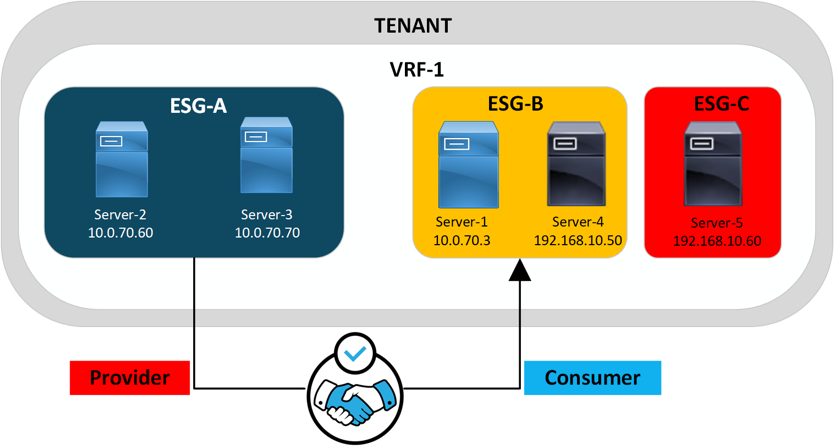

After the contract has been applied on ESG-A and ESG-B, the Provider – Consumer relationship can be observed from the Application Profile Topology.

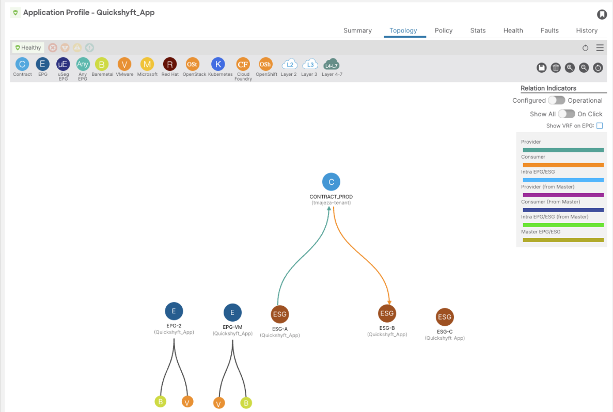

Applying the Contracts configurations result in zoning-rules programmed to the hardware in order to enforce the required policy.

```text
L102# show zoning-rule scope 2129937
+---------+--------+--------+----------+----------------+---------+---------+------------------------------+----------+----------------------+
| Rule ID | SrcEPG | DstEPG | FilterID |      Dir       | operSt | Scope |                Name             | Action |         Priority       |
+---------+--------+--------+----------+----------------+---------+---------+------------------------------+----------+----------------------+
|    4321   |   0     |   0     | implicit |    uni-dir      | enabled | 2129937 |                             | deny,log |       any_any_any(21)     |
|    4491   |   0     |   0     | implarp   |   uni-dir      | enabled | 2129937 |                             |    permit   |   any_any_filter(17)   |
|   12761   | 10977   | 10978   |    5      | uni-dir-ignore | enabled | 2129937 | tmajeza-tenant:CONTRACT_PROD |   permit   |     fully_qual(7)      |
|   33773   | 10978   | 10977   |    5      |    bi-dir      | enabled | 2129937 | tmajeza-tenant:CONTRACT_PROD |   permit   |     fully_qual(7)      |
|   29165   | 10978   | 10977   |    42     |    bi-dir      | enabled | 2129937 | tmajeza-tenant:CONTRACT_PROD |   permit   |     fully_qual(7)      |
|   33954   | 10977   | 10978   |    43     | uni-dir-ignore | enabled | 2129937 | tmajeza-tenant:CONTRACT_PROD |   permit   |     fully_qual(7)      |
|   10678   | 10978   | 10977   |    44     |     bi-dir     | enabled | 2129937 | tmajeza-tenant:CONTRACT_PROD |   permit   |     fully_qual(7)      |
|   26681   | 10977   | 10978   |    45     | uni-dir-ignore | enabled | 2129937 | tmajeza-tenant:CONTRACT_PROD |   permit   |     fully_qual(7)      |
+---------+--------+--------+----------+----------------+---------+---------+------------------------------+----------+----------------------+
```

!!! note
    The ESGs pcTags are used in the zoning-rule table, not EPG pcTags.

After the contract has been applied:

Endpoints in ESG-A can communicate with endpoints in ESG-B and vice-versa.

ICMP:

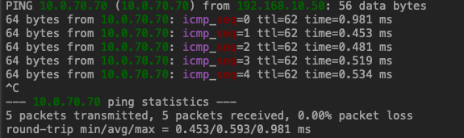

https:

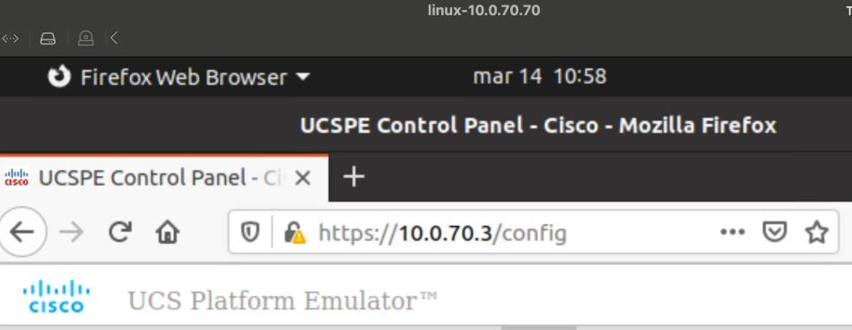

The communication matrix below indicates that inter-ESG communication is now permitted between endpoints in ESG-A and ESG-B, based on the contract security policies defined.

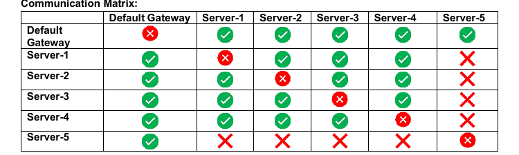

This lab successfully demonstrated the fundamental configurations needed to define ESGs and to classify endpoints into the different ESGs based on defined match criteria. Each endpoint is identified by a specific attribute (e.g., VM name, VM tag, IP address, or MAC address). ESGs use match criteria aligned with these attributes to classify endpoints into their respective groups. Additionally, a contract was applied to the ESGs to showcase how ACI enforces security policies at the ESG level.

## References

- [https://www.cisco.com/c/en/us/td/docs/dcn/whitepapers/cisco-aci-esg-design-guide.html](https://www.cisco.com/c/en/us/td/docs/dcn/whitepapers/cisco-aci-esg-design-guide.html)
- [https://blogs.cisco.com/datacenter/aci-segmentation-and-migrations-made-easier-with-endpoint-security-groups-esg](https://blogs.cisco.com/datacenter/aci-segmentation-and-migrations-made-easier-with-endpoint-security-groups-esg)
- [https://www.cisco.com/c/en/us/td/docs/dcn/aci/apic/6x/security-configuration/cisco-apic-security-configuration-guide-60x/endpoint-security-groups-60x.html](https://www.cisco.com/c/en/us/td/docs/dcn/aci/apic/6x/security-configuration/cisco-apic-security-configuration-guide-60x/endpoint-security-groups-60x.html)
