# External Layer 3 Network Connectivity (OSPF L3Out)

## Introduction

Cisco Application Centric Infrastructure (ACI) allows you to connect the fabric to outside networks using standard routing protocols that operate on Layer 3. Such connections are referred to as Layer 3 outside (L3Out). They define the interfaces, protocols, and protocol parameters that are used to provide IP connectivity to external devices through routing protocols or static routes. A border leaf is a Cisco ACI leaf that provides Layer 3 connections to outside networks.

Cisco ACI supports the following routing mechanisms: static routes, Open Shortest Path First version 2 (OSPFv2), Enhanced Interior Gateway Routing Protocol (EIGRP), and Border Gateway Protocol (BGP). Policy enforcement through contracts is required with external networks just like a normal endpoint group (EPG) to EPG communications. However, the classification of external IP addresses/prefixes to an EPG (called external EPG or L3Out EPG) differs from a normal EPG.

This lab shows how to deploy OSPF routing between an ACI leaf and and an adjacent Cisco Catalyst switch, and enable communication of an internal EPG (DB_EPG) endpoint with the external OSPF network.

## Physical & Logical Topology

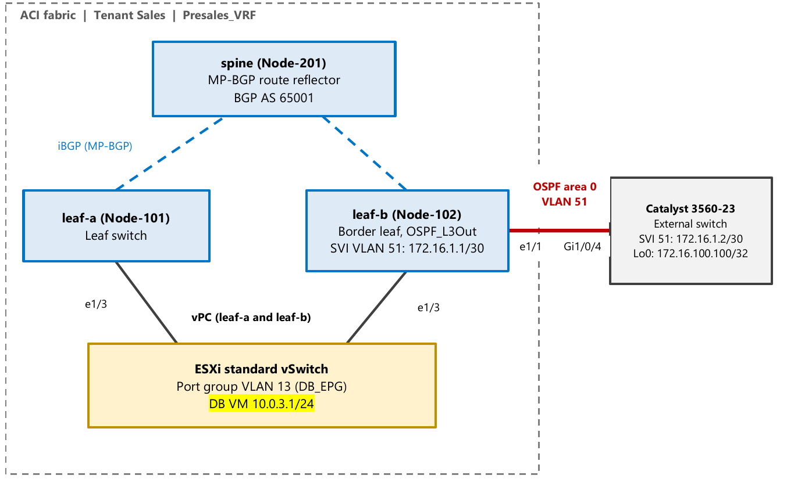

*Figure: L3Out scenario. OSPF area 0 between leaf-b and the Catalyst switch over VLAN 51, MP-BGP route reflection through spine 201, and the DB VM (10.0.3.1) behind the vPC.*

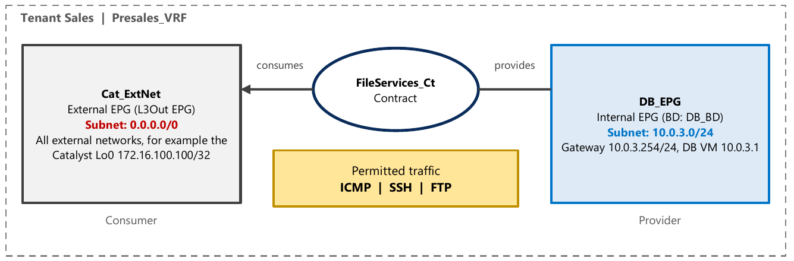

*Figure: Logical view. Cat_ExtNet (0.0.0.0/0) consumes, and DB_EPG (10.0.3.0/24) provides the FileServices_Ct contract, which permits ICMP, SSH and FTP.*

## Configure Access Policies for L3Out

The access policies for the external Layer 3 connection include:

- A Layer 3 domain references a VLAN pool, which serves the external Layer 3 connections.
- An attachable access entity profile (AAEP) references a domain, such as the Layer 3 domain, and therefore specifies the VLAN pool that can be activated on an interface.
- An interface policy defines a protocol or interface properties that are applied to interfaces.
- An interface policy group gathers multiple interface policies into one set and binds them to an AAEP.
- The interface selector identifies the interface (or interface block) for the L3Out and associates it with the interface policy group.
- An interface profile groups one or more interface selectors, effectively specifying the policies consumed by the interface blocks.
- A switch profile chooses one or more leaf switches and associates them with an interface profile, effectively specifying the policies consumed by the interface blocks on a given switch.

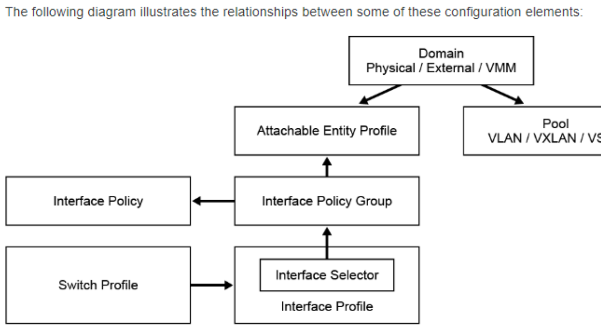

Go to **Fabric > Access Policies > Pools > VLAN** and create a VLAN pool with the settings below. Click **OK** and **Submit**.

- **Name:** ExtL3_VLANs
- **Allocation mode:** Static Allocation
- Click **+** in the Encap Blocks table and configure the range 51–60 with the default allocation mode (Inherit allocMode from the parent) and role (External or On the wire encapsulations).

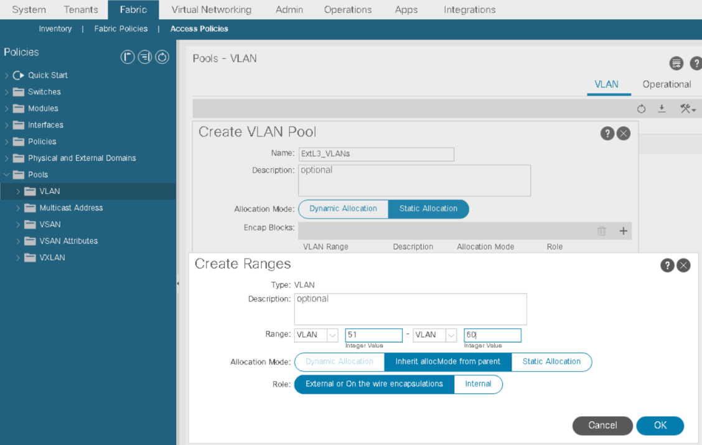

**Click OK and Submit.**

Verify that the VLAN block was created successfully.

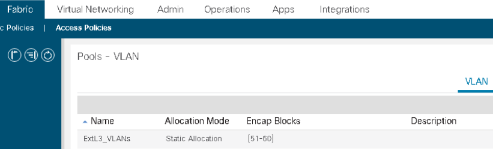

Go to **Fabric > Access Policies > Physical and External Domains > L3 Domains**, right-click the menu and choose **Create Layer 3 Domain.**

Create the domain **ExtL3Dom** that references the VLAN pool **ExtL3_VLANs** and click **Submit**.

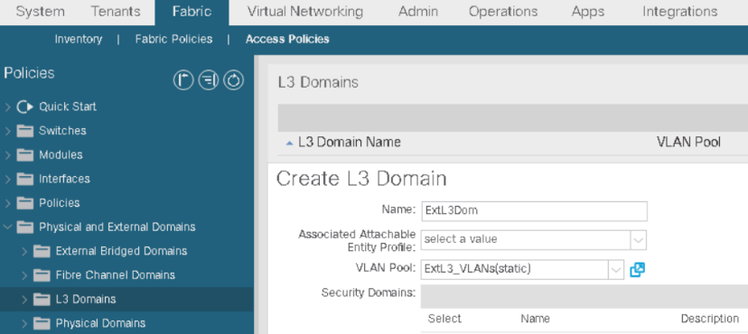

Go to **Fabric > Access Policies > Policies > Global > Attachable Access Entity Profiles** and create the AAEP **EXTERNAL_SWITCH_AAEP**. Click **+**, add the domain **ExtL3Dom** and click **Update**. Verify the encapsulation range and click **Next** and Finish.

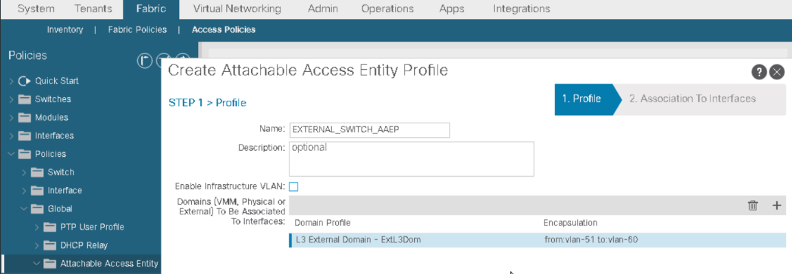

Go to **Fabric > Access Policies > Interfaces > Leaf Interfaces > Policy Groups > Leaf Access Port**. Create an interface policy group **ExtL3_IPG**, associate it with **EXTERNAL_SWITCH_AAEP** and the Link Layer Discovery Protocol (LLDP) policy **Enable_LLDP**. Click **Submit**.

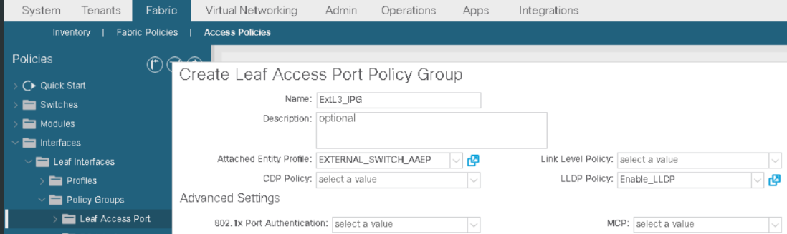

Go to **Fabric > Access Policies > Interfaces > Leaf Interfaces > Profiles**, expand **LEAF102_IFP**, click **+** to configure an interface selector and **Continue** in the Policy Usage Warning.

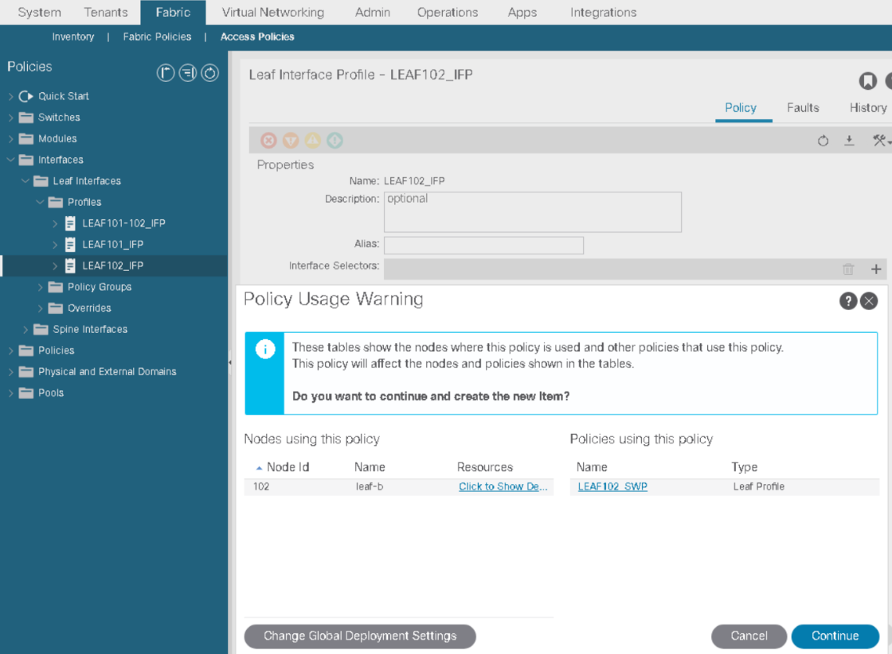

Configure an interface selector **ExtL3Cat** for the interface ID **1/1** and associate it with the interface policy group **ExtL3_IPG**. Click **Submit**.

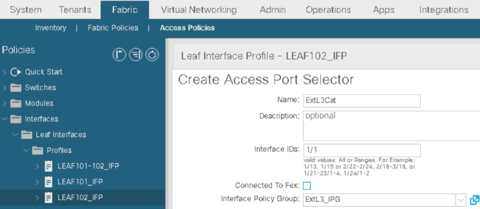

Verify LLDP neighborship with the external switch

```text
leaf-b# show lldp neig
Capability codes:
  (R) Router, (B) Bridge, (T) Telephone, (C) DOCSIS Cable Device
  (W) WLAN Access Point, (P) Repeater, (S) Station, (O) Other
Device ID              Local Intf    Hold-time Capability Port ID
3560-23                Eth1/1        120        BR          Gi1/0/4
```

Status will show as “out-of-service”.

```text
leaf-b# show interface e1/1 status
--------------------------------------------------------------------------------
Port          Name                 Status      Vlan     Duplex Speed    Type
--------------------------------------------------------------------------------
Eth1/1        --                   out-of-ser  trunk    full    1G      1000base-T
leaf-b#
```

```text
leaf-b# show interface e1/1
Ethernet1/1 is up (out-of-service)
admin state is up, Dedicated Interface
```

!!! note
    The out-of-service status is expected, and it will be resolved once the interface has been attached to the L3Out configuration.

Login the external switch to verify the configurations in place.

```text
3560-23>show ip ospf interface brief
Interface    PID   Area            IP Address/Mask                          Cost     State Nbrs F/C
Lo0          1     0               172.16.100.100/32                        1        LOOP 0/0
Vl51         1     0               172.16.1.2/30                            1        DR    0/0
3560-23>
```

```text
3560-23>show lldp neig | in leaf-b
leaf-b                Gi1/0/4                         120             B,R                    Eth1/1
3560-23>
```

```text
3560-23>show interface trunk

Port           Mode                     Encapsulation        Status                Native vlan
Gi1/0/3        on                       802.1q               trunking              1
Gi1/0/4        on                       802.1q               trunking              1

Port           Vlans allowed on trunk
Gi1/0/3        21,31
Gi1/0/4        51

Port           Vlans allowed and active in management domain
Gi1/0/3        21,31
Gi1/0/4        51

Port           Vlans in spanning tree forwarding state and not pruned
Gi1/0/3        21,31
Gi1/0/4        51
```

## Configure L3Out

Having configured the required access policies under the Layer 3 domain for L3Out, you can configure OSPF on the interface and will enable an OSPF exchange between leaf-b and the external Cisco Catalyst switch.

The border leaf supports various area types, such as a not-so-stubby area (NSSA) or regular areas, and additional features, such as authentication. The external switch has been preconfigured for the backbone area without authentication.

The OSPF adjacency will be established through the configuration of a L3Out.

Go to **Tenants > Sales > Networking > L3Outs**, right-click the menu, and choose **Create L3Out**.

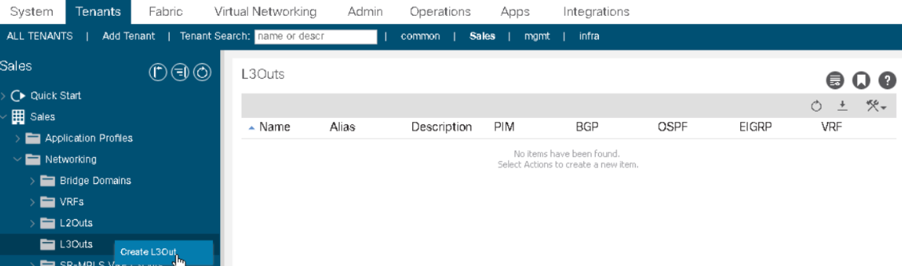

Start creating a L3Out with the settings below. Click **Next**.

- **Name:** OSPF_L3Out
- **VRF:** Presales_VRF
- **Layer 3 Domain:** ExtL3Dom
- **Routing protocol:** OSPF
- **OSPF Area ID:** 0 (backbone)
- **OSPF Area Type:** Regular area

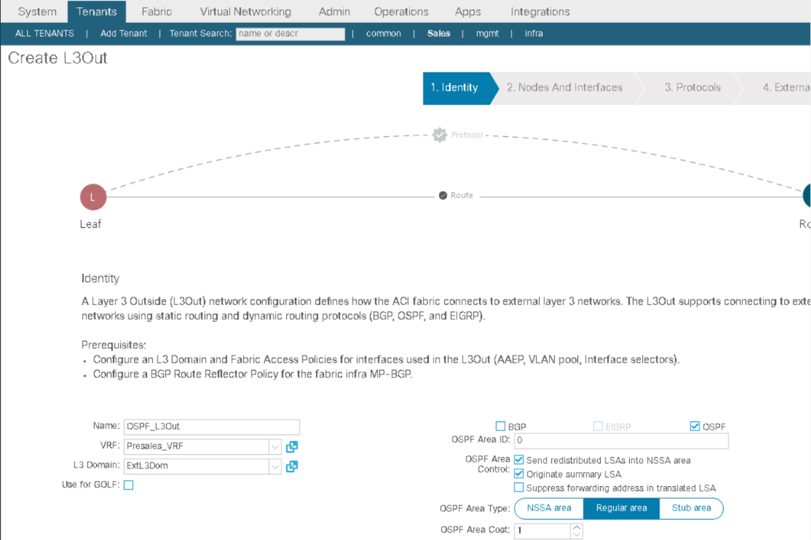

Enter these settings in the Nodes and Interfaces page and then click **Next**.

- Clear the Use Defaults checkbox. This will allow you to enter a custom node profile name.
- **Node Profile Name:** L102
- **Layer 3:** SVI. Recall the interface types for external Layer 3 connections: routed interfaces, routed subinterfaces, switched virtual interfaces (SVIs), and floating SVIs. This lab will use the SVI option, which allow multiple connections over a single physical link.
- **Layer 2:** Port
- **Node ID:** leaf-b (Node-102)
- **Router ID:** 10.1.1.1
- Delete the Loopback Address. You do not need to configure a loopback on the border leaf. Only the router ID is mandatory. In case of BGP, if the BGP peering needs to be sourced from a loopback, you may use this option.
- **Interface:** eth1/1
- **Interface Profile Name:** OSPF_L3Out_interfaceProfile. The interface profile is a container for interface settings. You can keep the default name.
- **Encap:** VLAN
- **VLAN ID:** 51. 802.1Q tagging supports multiple logical connections over the physical link. The subinterface with the tag 51 is used for L3Out connectivity. This VLAN ID must belong to the static VLAN pool associated with the Layer 3 domain (51-60) that was assigned to the L3Out.
- **MTU:** 1500 (the maximum value supported on the Catalyst switch). The default value on the Cisco ACI switches is 9216. The MTU mismatch would prevent the OSPF adjacency from being established.
- **IP Address:** 172.16.1.1/30. It will be applied as the IP address on the switch virtual interface (SVI) on the border leaf.

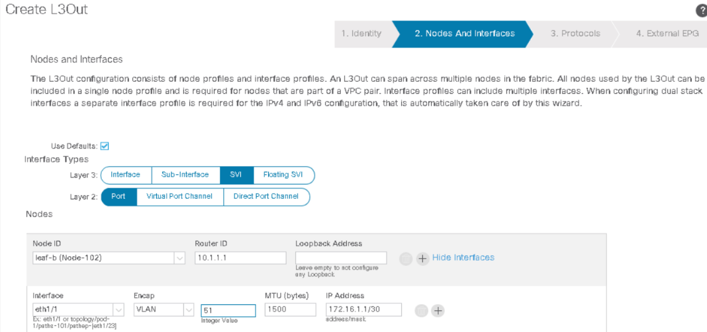

In the Protocols page, click **Next** without choosing any protocol policy.

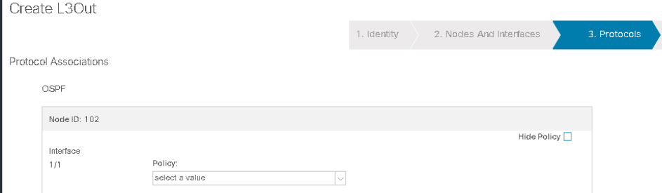

In the External EPG page, configure an external EPG with these settings and click **Finish**:

- **Name:** Cat_ExtNet. An external network instance profile (External EPG, L3Out EPG) represents a group of external subnets that have the same security behavior.
- **Default EPG for all external networks:** checked. This is a placeholder for all networks (0.0.0.0/0), to apply the consumed contract to any external network through an external EPG.

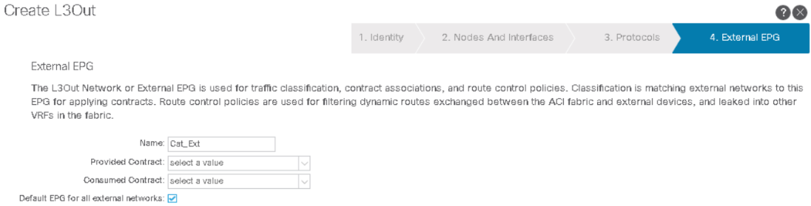

**Click Finish**

Expand the L3Out and examine its sub-components, the logical node profile, and logical interface profile.

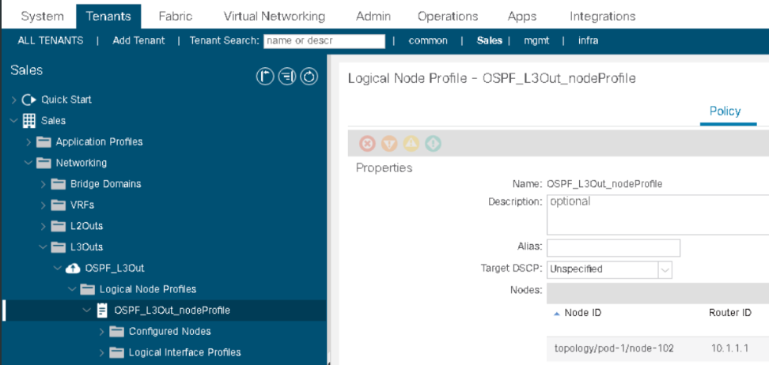

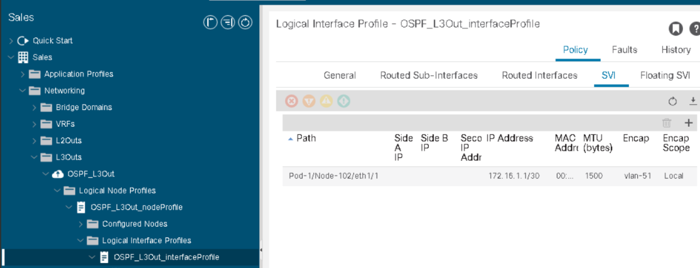

Expand the logical interface profile and verify the OSPF interface profile configuration.

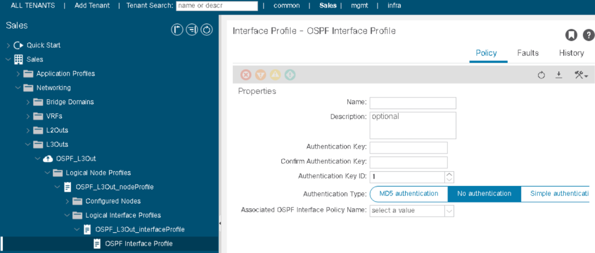

The OSPF interface profile is equivalent to the **ip router ospf area 0** command in Cisco Nexus Operating System (NX-OS). Without it, OSPF would be disabled on that interface.

Below the logical node profile, expand the **Configured Nodes** menu

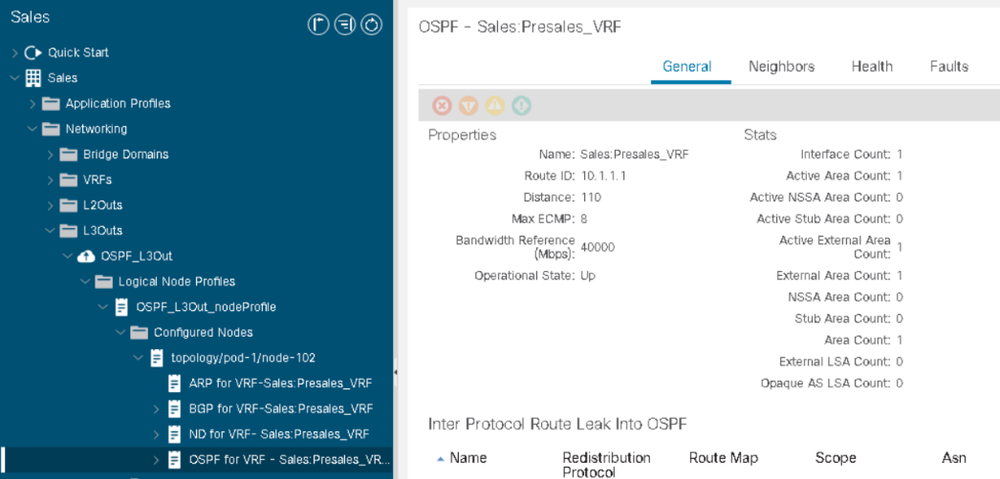

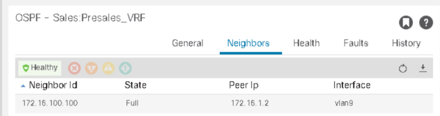

Expand the **External EPGs**, choose **Cat_ExtNet** and examine the subnet information in the **Policy > General** tab.

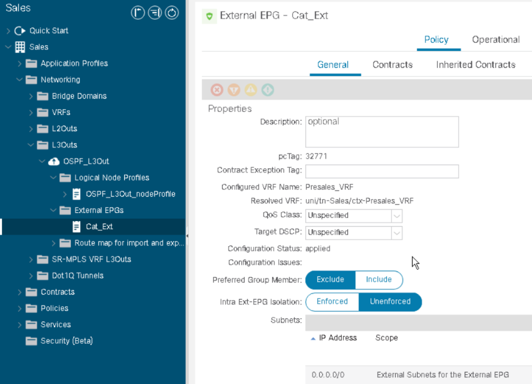

The action "**0.0.0.0/0 with External Subnets for the External EPG scope**" causes all endpoints to be classified into the same EPG. You could define more external EPGs if you wanted to apply a different policy for different groups of external endpoints. In this case, all outside endpoints are treated equally and one external EPG network for all subnets (0.0.0.0/0) was created.

Leaf102 interface status (now in connected state) (no longer out-of-ser as before).

```text
leaf-b# show interface e1/1 status
--------------------------------------------------------------------------------
Port          Name                 Status      Vlan     Duplex Speed    Type
--------------------------------------------------------------------------------
Eth1/1        --                   connected   trunk    full    1G      1000base-T
```

On the Catalyst switch, verify the OSPF adjacency resulting from your L3Out configuration.

```text
3560-23>show ip ospf neig

Neighbor ID           Pri      State                  Dead Time        Address                Interface
10.1.1.1                1      FULL/BDR               00:00:30         172.16.1.1             Vlan51
3560-23>
```

On **leaf-b** View the IP OSPF interfaces in your VRF.

```text
leaf-b# show ip ospf neig vrf Sales:Presales_VRF
 OSPF Process ID default VRF Sales:Presales_VRF
 Total number of neighbors: 1
 Neighbor ID     Pri State            Up Time Address                                     Interface
 172.16.100.100    1 FULL/DR          00:14:41 172.16.1.2                                 Vlan9
leaf-b#
```

```text
leaf-b# show ip ospf interface vrf Sales:Presales_VRF
 Vlan9 is up, line protocol is up
    IP address 172.16.1.1/30, Process ID default VRF Sales:Presales_VRF, area backbone
    Enabled by interface configuration
    State BDR, Network type BROADCAST, cost 4
    Index 77, Transmit delay 1 sec, Router Priority 1
    Designated Router ID: 172.16.100.100, address: 172.16.1.2
    Backup Designated Router ID: 10.1.1.1, address: 172.16.1.1
    1 Neighbors, flooding to 1, adjacent with 1
    Timer intervals: Hello 10, Dead 40, Wait 40, Retransmit 5
      Hello timer due in 00:00:09
    No authentication
    Number of opaque link LSAs: 0, checksum sum 0
leaf-b#
```

You can verify the OSPF operation in the Cisco Application Policy Infrastructure Controller (APIC) user interface.

Go to **Fabric > Inventory > Pod ID**, expand the node (leaf-b) and choose **Protocols > OSPF**.

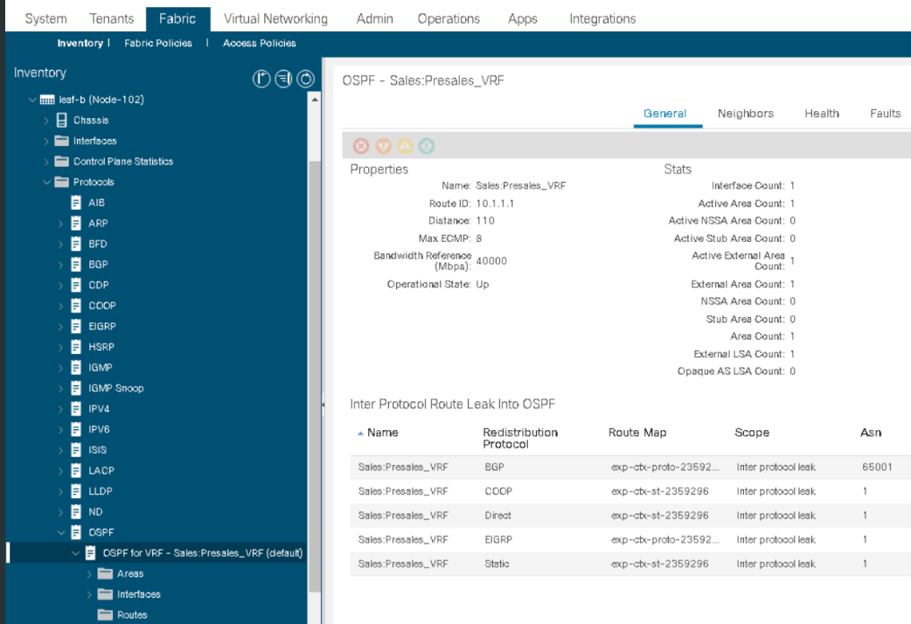

On **leaf-b**, view the OSPF routes.

```text
leaf-b# show ip route ospf vrf Sales:Presales_VRF
IP Route Table for VRF "Sales:Presales_VRF"
'*' denotes best ucast next-hop
'**' denotes best mcast next-hop
'[x/y]' denotes [preference/metric]
'%<string>' in via output denotes VRF <string>

172.16.100.100/32, ubest/mbest: 1/0
    *via 172.16.1.2, vlan9, [110/5], 00:16:30, ospf-default, intra
```

The network 172.16.100.100/32 has been received over the L3Out from the Catalyst switch. The connecting interface (vlan9 in this example) shows the Platform Independent (PI) VLAN ID.

```text
leaf-b# show vlan extended

 VLAN Name                             Encap            Ports
 ---- -------------------------------- ---------------- ------------
 1    Sales:eCommerce_AP:App_EPG       vlan-12          Eth1/3, Po4
 8    infra:default                    vxlan-16777209, Eth1/2
                                       vlan-3967
 9    Sales:Presales_VRF:l3out-        vxlan-15007704, Eth1/1
      OSPF_L3Out:vlan-51               vlan-51
```

The PI VLAN is associated with a Virtual Extensible LAN (VXLAN) ID and the encap VLAN (51) that is used on the Eth1/1 trunk.

## Configure Spine to Act as MP-BGP Route Reflector

Within the Cisco ACI fabric, Multiprotocol Border Gateway Protocol (MP-BGP) is implemented between leaf and spine switches to propagate external routes within the Cisco ACI fabric. The BGP route reflector technology is deployed to support many leaf switches within a single fabric. All the leaf and spine switches are in a single BGP AS. When a border leaf learns about external routes, it redistributes the external routes of a given VRF to an MP-BGP address family. MP-BGP maintains a separate BGP routing table for each VRF. Within MP-BGP, the border leaf advertises the routes to the spine switch that acts as a BGP route reflector. The routes are then propagated to all the leaves where the VRFs are instantiated.

Here a BGP route reflector policyis created by specifying the BGP AS number and the spine node that should act as the BGP route reflector. Cisco APIC will then automatically enable Internal Border Gateway Protocol (IBGP) peering between leaves and spine (or spines) and configure leaf switches as route reflector clients. Cisco APIC will also automatically generate the required configuration for route redistribution on the border leaves.

In the Cisco APIC user interface, go to **System > System Settings > BGP Route Reflector**.

- Set the autonomous system to 65001.
- Add the spine ID (**201**) to the Route Reflector Nodes and click **Submit**, **Submit**, and **Submit Changes**.

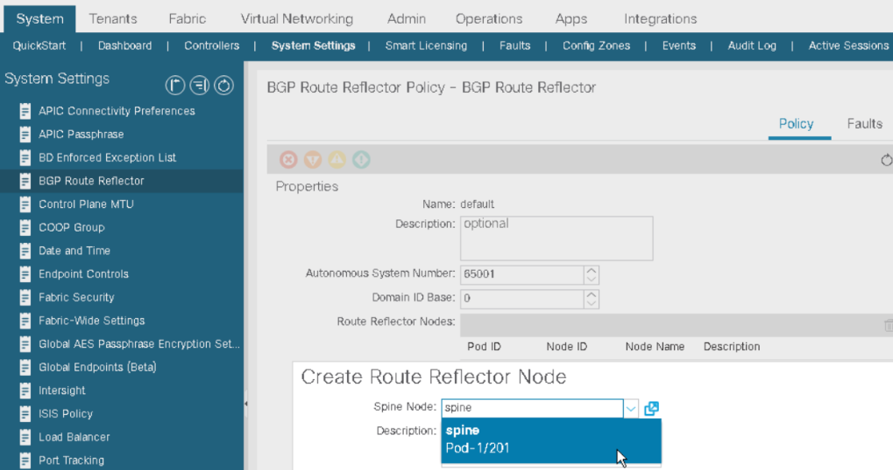

**Verify:**

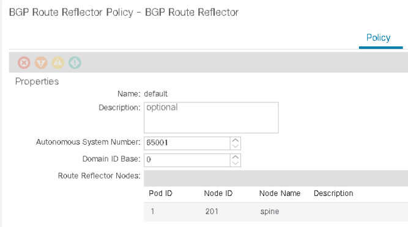

Go to **Fabric > Fabric Policies > Pods > Policy Groups**. Verify that the policy group **Pod_PG** resolves the BGP Route Reflector Policy to **default**.

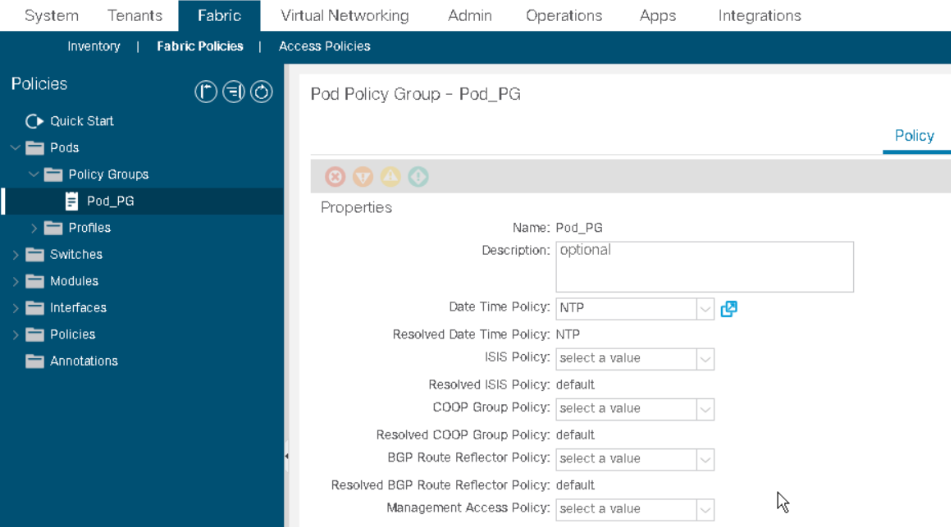

Go to **Fabric > Fabric Policies > Pods > Profiles > Pod Profile default** and verify that the policy group **Pod_PG** is assigned to the pod selector **default**.

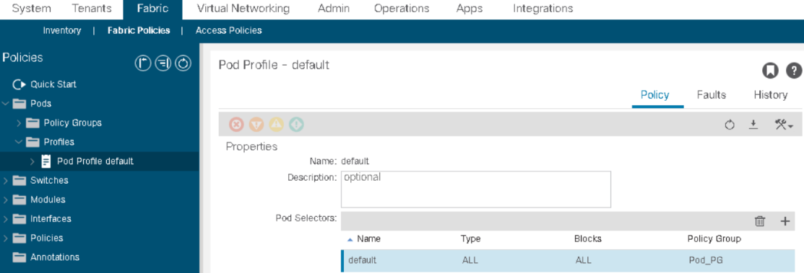

On any leaf switch, verify the MP-BGP sessions.

```text
leaf-b# show bgp sessions vrf overlay-1
Total peers 1, established peers 1
ASN 65001
VRF overlay-1, local ASN 65001
peers 1, established peers 1, local router-id 10.0.216.66
State: I-Idle, A-Active, O-Open, E-Established, C-Closing, S-Shutdown

Neighbor             ASN       Flaps LastUpDn|LastRead|LastWrit St Port(L/R)                       Notif(S/R)
10.0.216.65          65001     0     00:00:35|never   |never    E 42831/179                        0/0
leaf-b#
```

You can verify BGP sessions in the Cisco APIC user interface, in **Fabric > Inventory > Pod 1 > spine > Protocols > BGP > BGP for VRF-overlay-1 > Sessions**.

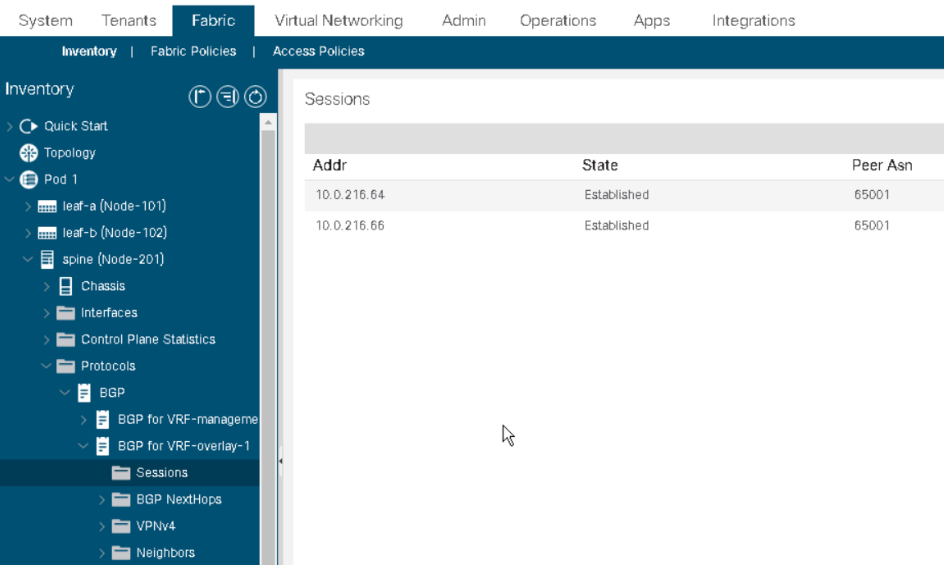

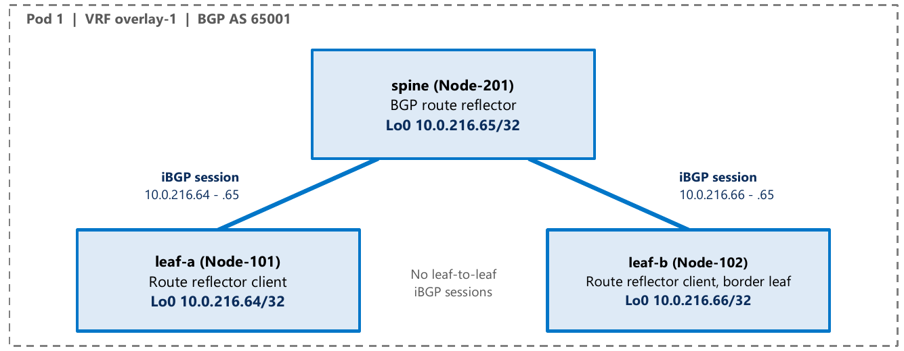

*Figure: iBGP peerings in AS 65001. Spine-201 is the route reflector, and leaf-a and leaf-b peer only with it. The addresses are the lo0 loopbacks of each node.*

On **leaf-b**, verify route redistribution from OSPF to MP-BGP.

```text
leaf-b# show bgp ipv4 unicast vrf Sales:Presales_VRF
BGP routing table information for VRF Sales:Presales_VRF, address family IPv4 Unicast
BGP table version is 8, local router ID is 10.0.1.254
Status: s-suppressed, x-deleted, S-stale, d-dampened, h-history, *-valid, >-best
Path type: i-internal, e-external, c-confed, l-local, a-aggregate, r-redist, I-injected
Origin codes: i - IGP, e - EGP, ? - incomplete, | - multipath, & - backup

   Network                      Next Hop                    Metric              LocPrf                Weight Path
*>r172.16.1.0/30                0.0.0.0                          0                 100                 32768 ?
*>r172.16.100.100/32            0.0.0.0                          5                 100                 32768 ?
```

The route 172.16.100.100/32 was received via OSPF from the Catalyst switch, while 172.16.1.0/30 is the directly connected SVI subnet. ACI redistributes both into MP-BGP.

Verify MP-BGP route propagation on **leaf-a**.

```text
leaf-a# show bgp ipv4 uni vrf Sales:Presales_VRF
BGP routing table information for VRF Sales:Presales_VRF, address family IPv4 Unicast
BGP table version is 4, local router ID is 10.0.1.254
Status: s-suppressed, x-deleted, S-stale, d-dampened, h-history, *-valid, >-best
Path type: i-internal, e-external, c-confed, l-local, a-aggregate, r-redist, I-injected
Origin codes: i - IGP, e - EGP, ? - incomplete, | - multipath, & - backup

   Network                         Next Hop                        Metric           LocPrf                Weight Path
*>i172.16.1.0/30                   10.0.216.66                          0              100                     0 ?
*>i172.16.100.100/32               10.0.216.66                          5              100                     0 ?
```

The BGP next-hop IP address is the leaf-b PTEP address.

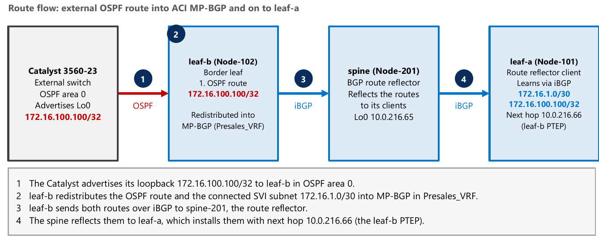

*Figure: Route flow from the Catalyst to leaf-a. The OSPF route is redistributed into MP-BGP on leaf-b, passed to the spine route reflector over iBGP and reflected to leaf-a.*

BGP will be automatically enabled on any leaf that has an external Layer 3 network attached, and also on any leaf where the VRF associated with the Layer 3 external network is instantiated (leafs that do not have the VRF associated preserve the hardware resources by not running BGP).

On **leaf-a**, verify that L3Out VXLAN does not exist here.

```text
leaf-a# show vlan extended

 VLAN Name                             Encap            Ports
 ---- -------------------------------- ---------------- ------------
 8    infra:default                    vxlan-16777209, Eth1/2
                                       vlan-3967
 17   Sales:Presales_BD                vxlan-16351138   Eth1/1, Eth1/3, Po4
 19   Sales:DB_BD                      vxlan-15925207   Eth1/3, Po4
 20   Sales:eCommerce_AP:Web_EPG       vlan-21          Eth1/1
 21   Sales:eCommerce_AP:Web_EPG       vlan-11          Eth1/3, Po4
 22   Sales:eCommerce_AP:DB_EPG        vlan-13          Eth1/3, Po4
 23   Sales:eCommerce_AP:App_EPG       vlan-12          Eth1/3, Po4
```

## Advertise BD Subnet and Enable EPG and Ext-EPG Communication

To enable bidirectional communication between a BD endpoint and the external network, you will associate the L3Out with the bridge domain DB_BD and advertise the BD subnet externally. You will create a new subnet (10.0.3.254/24) for this purpose.

Go to **Tenants > Sales > Networking > Bridge Domains > DB_BD > Policy > L3 Configurations.** In the Subnets table, click + and create a new subnet with the settings below. Click Submit.

**Gateway IP:** 10.0.3.254/24  
**Scope:** Advertised Externally

The Advertised Externally scope allows the border leaf to advertise this subnet out of the associated L3Out. With the default scope, Private to VRF, the subnet would remain inside the fabric, and the Catalyst switch would not learn it.

Verify that the subnet 10.0.3.254/24 is listed in the Subnets table with the scope Advertised Externally.

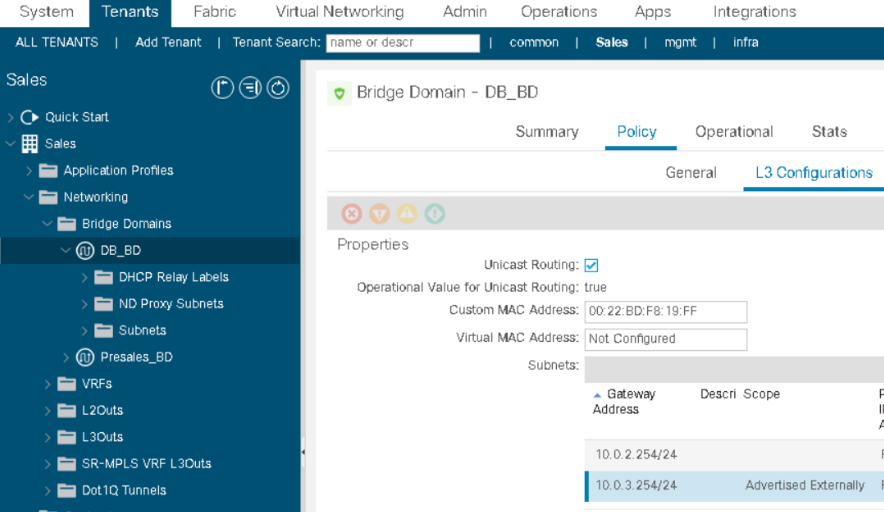

Click the plus sign (**+**) in the Associated Layer 3 Outs table, choose **OSPF_L3Out**, and click **Update**.

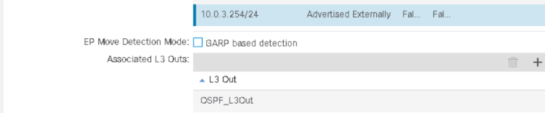

Then you will apply the FileServices_Ct contract, which permits ICMP, SSH and FTP, as a consumer contract to the external network EPG. The contract is already applied as a provider contract to DB_EPG.

!!! note
    The implementation of the FileServices_Ct contract (its subjects and filters) is not in the scope of this document. The contract is assumed to already exist.

Go to **Networking > L3Outs > OSPF_L3Out > External EPGs > Cat_ExtNet** and choose **Policy > Contracts**. Click the tools button, choose **Add Consumed Contract**, choose **FileServices_Ct** and then click **Submit**.

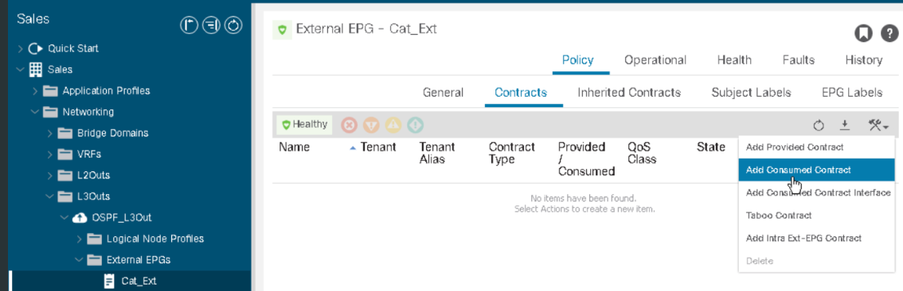

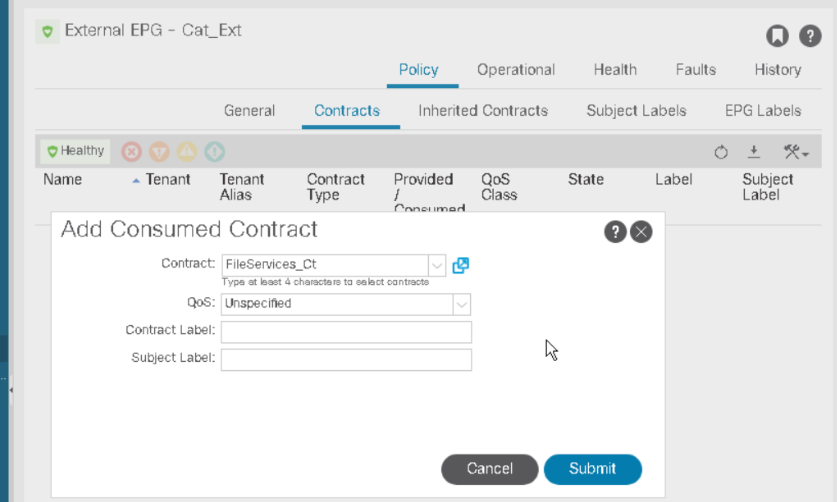

On the Catalyst switch, verify the OSPF routing table.

```text
3560-23>show ip route ospf
Codes: L - local, C - connected, S - static, R - RIP, M - mobile, B - BGP
       D - EIGRP, EX - EIGRP external, O - OSPF, IA - OSPF inter area
       N1 - OSPF NSSA external type 1, N2 - OSPF NSSA external type 2
       E1 - OSPF external type 1, E2 - OSPF external type 2
       i - IS-IS, su - IS-IS summary, L1 - IS-IS level-1, L2 - IS-IS level-2
       ia - IS-IS inter area, * - candidate default, U - per-user static route
       o - ODR, P - periodic downloaded static route, H - NHRP, l - LISP
       a - application route
       + - replicated route, % - next hop override

Gateway of last resort is not set

         10.0.0.0/8 is variably subnetted, 5 subnets, 2 masks
O E2        10.0.3.0/24 [110/20] via 172.16.1.1, 00:06:27, Vlan51
```

To verify reachability through the L3Out, ping the internal host 10.0.3.1, which belongs to the 10.0.3.0/24 subnet, from the Catalyst switch.

```text
3560-23>ping 10.0.3.1
Type escape sequence to abort.
Sending 5, 100-byte ICMP Echos to 10.0.3.1, timeout is 2 seconds:
.!!!!
Success rate is 80 percent (4/5), round-trip min/avg/max = 1/2/4 ms
3560-23>
```

## References

1. [https://www.cisco.com/site/us/en/learn/training-certifications/training/courses/dcaci.html](https://www.cisco.com/site/us/en/learn/training-certifications/training/courses/dcaci.html)
2. [https://www.cisco.com/c/en/us/solutions/collateral/data-center-virtualization/application-centric-infrastructure/guide-c07-743150.html](https://www.cisco.com/c/en/us/solutions/collateral/data-center-virtualization/application-centric-infrastructure/guide-c07-743150.html)
3. [https://titusm.github.io/Cisco-Data-Center/aci/l3out-bgp-ospf/](https://titusm.github.io/Cisco-Data-Center/aci/l3out-bgp-ospf/)
