# Cisco ACI Fabric Bring Up – from Scratch!

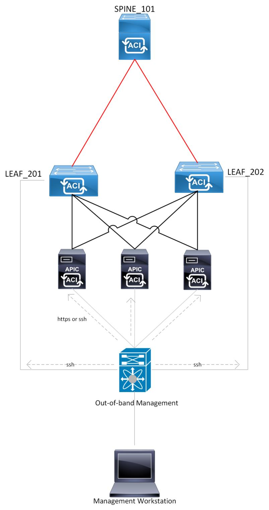

## Overview

Cisco ACI Fabric Discovery is the foundational process of deploying and configuring the ACI infrastructure to create a fully functional fabric capable of carrying workload traffic in the data center. This process involves setting up the ACI controllers—known as the Application Policy Infrastructure Controllers (APICs)—along with the leaf and spine switches.

The initial configuration of the APIC includes defining essential fabric parameters such as Node IDs, cluster size, TEP (Tunnel Endpoint) pool, out-of-band (OOB) management IP addresses, and the infrastructure VLAN etc. Once the APIC is successfully configured, the GUI becomes accessible via HTTPS using the designated OOB IP address.

To bring up the fabric, Nexus as Code was used to automate the deployment process.

During registration, each node is assigned a unique Node ID, a specific role (leaf or spine), and a hostname. The APIC also functions as a DHCP server, dynamically assigning each node a unique TEP IP address from the predefined TEP pool. These TEP addresses enable communication between fabric nodes.

This lab walks through the initial setup required to bring up an ACI fabric from scratch.

The specific configurations that are covered by this lab are as follows:

1. APIC Cluster initial configuration
2. Fabric nodes (leafs and spines) registration
3. Out of Band (OOB) management IP address configuration for the nodes
4. Date & Time (NTP) Pod Policy
5. Pod Policy Group
6. Pod Profile
7. Pod BGP Autonomous System Number (ASN) Configuration.
8. Designation of the Spine as the Route Reflector

Additionally, the lab covers key verification commands to ensure that the fabric has been deployed correctly.

!!! note
    This lab was conducted in a controlled environment. Any configurations in a production network should be implemented during a designated maintenance window. Additionally, always refer to official Cisco documentation relevant to your specific hardware and software.

## Lab-Setup

This lab consists of three APICs, two leaf switches, and one spine switch. The topology diagram below illustrates the physical connections between the hardware.

Each APIC is redundantly connected to the fabric through dual links to the leaf switches. However, both connections from an APIC should not terminate on the same leaf switch; they must be distributed across two different leafs for redundancy and high availability. The leaf switches, in turn, connect upstream to the spine. In an ACI topology, leaf nodes do not establish direct connections with each other.

### APIC to Leaf Connectivity

The APIC-SERVER-M3 APICs were used in this lab and they have a 4-port Intel X710-T4 Quad-port 10GBase-T NIC which is used to connect the APICs to the ACI fabric leafs.

The picture below shows how an APIC should be physically connected to an ACI leaf.

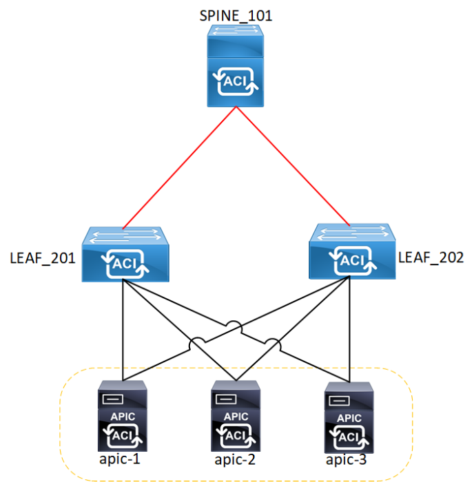

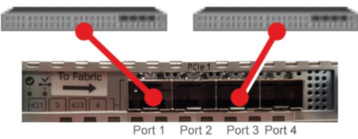

The network card has four ports: port-1, port-2, port-3 and port-4.

- Port-1 and Port-2 which makes up a single pair corresponding to eth2-1 on the APIC
- Port-3 and Port-4 which makes up a single pair corresponding to eth2-2 on the APIC

For each pair, only a single connection from the APIC to the leafs is allowed. These interfaces are configured as Linux bond interfaces with active/standby failover.

!!! note
    You can connect one cable to either port-1 or port-2 and another cable to either port-3 or port-4 but not 2 cables on the same ports that make up a pair.

### CIMC Setup

The APIC hardware can be managed using the dedicated Cisco Integrated Management Controller (CIMC) interface. The CIMC must be configured for remote access (IP address, login credentials etc) from the Serial Console. More details can be found from the link below:

[https://www.cisco.com/c/en/us/td/docs/switches/datacenter/aci/apic/server/M3-L3-server/APIC-M3-L3-Server/m_installing_the_server.html#concept_qph_5km_52b](https://www.cisco.com/c/en/us/td/docs/switches/datacenter/aci/apic/server/M3-L3-server/APIC-M3-L3-Server/m_installing_the_server.html#concept_qph_5km_52b)

Get to know about the CIMC:

To configure the CIMC initial or modify existing settings, Press the F8 key on the keyboard for the CIMC setup.

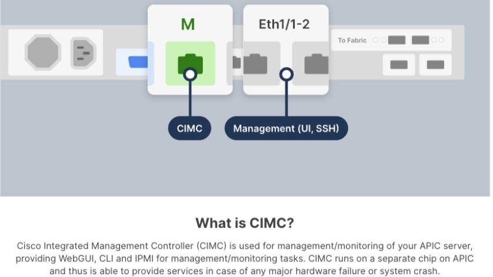

This action will enter the CIMC configuration utility.

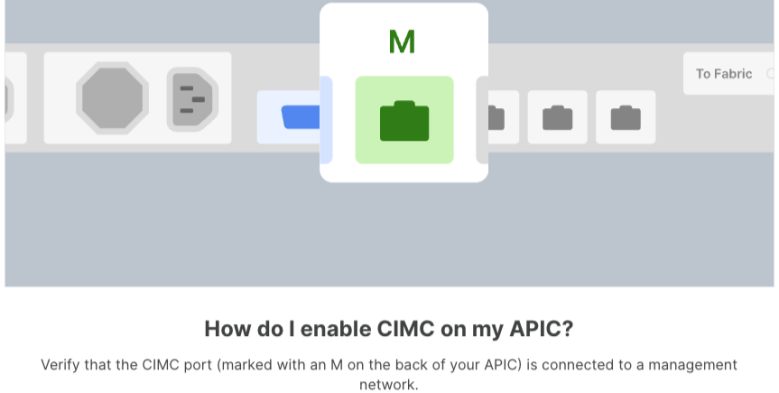

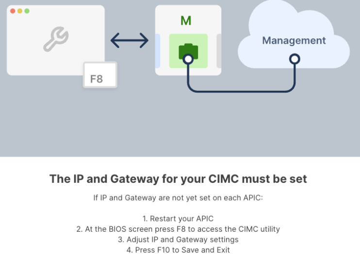

The CIMC IP address is the out of band management that will be used to access the CIMC GUI. All APIC hardware that make up the APIC cluster must be configured with their own individual IP addresses.

The hardware in this lab are configured with the below IP addresses for CIMC management purposes.

| Device | Node number | Port | CIMC OOB IP Address | CIMC Default Gateway |
|---|---|---|---|---|
| APIC1-CIMC | 1 | CIMC mgmt port | x.y.z.34/28 | x.y.z.33 |
| APIC2-CIMC | 2 | CIMC mgmt port | x.y.z.36/28 | x.y.z.33 |
| APIC3-CIMC | 3 | CIMC mgmt port | x.y.z.38/28 | x.y.z.33 |

After saving the configuration, Login to the CIMC GUI using the configured CIMC IP.

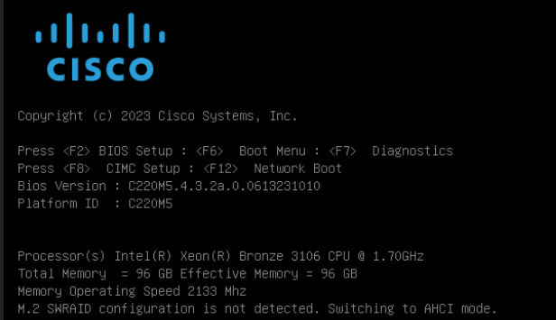

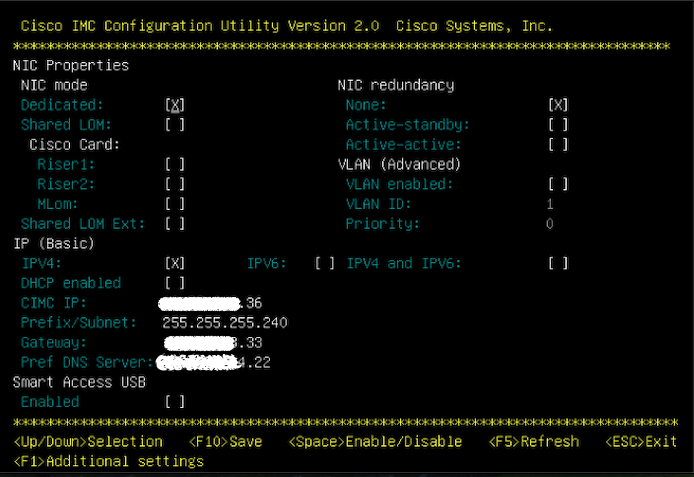

!!! note
    From ACI v6.0, only the first APIC is required for the initial bootstrap configuration. The rest of the APIC nodes will be configured via the GUI, which this lab will showcase.

Launch the vKVM to proceed with the initial configuration of the APIC.

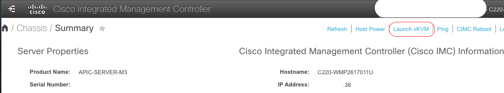

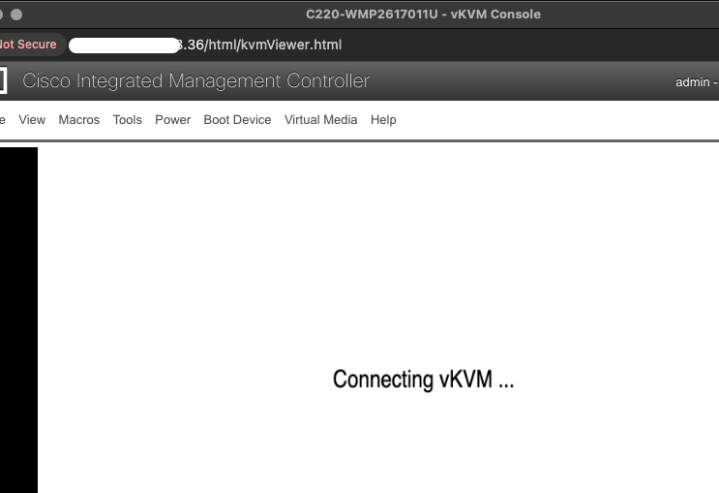

The initial APIC configuration prompt will pop-up.

Press Enter to kickstart the initial APIC bootstrap process.

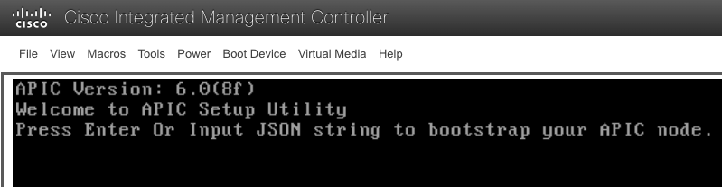

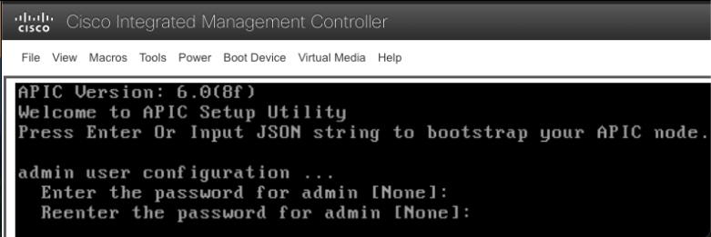

Enter the "admin" password that you will use to access the ACI APIC GUI.

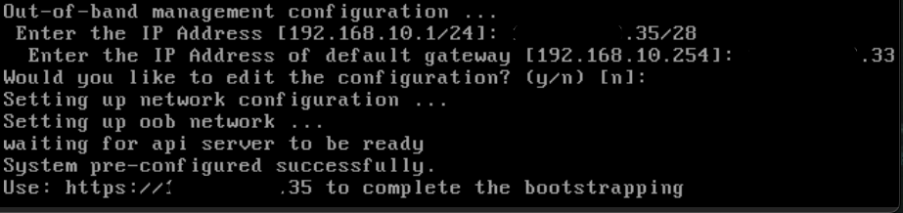

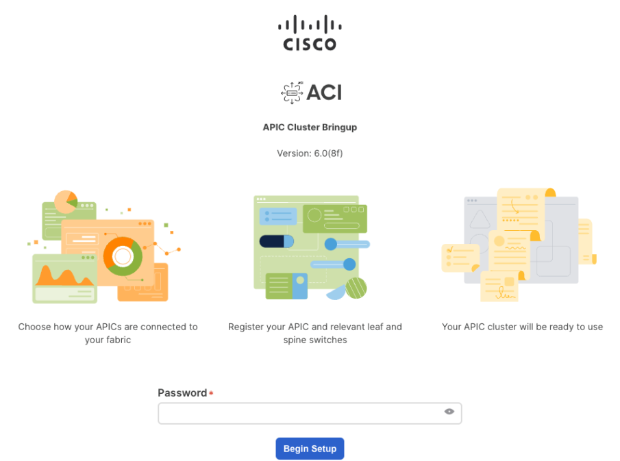

Enter the out of band IP address and the default gateway. The IP address entered here will be used to access the APIC GUI or CLI.

Login the APIC GUI via a web browser and enter the "admin" password that was configured in the prior steps in order to proceed with onboarding the other nodes of the APIC cluster.


The APIC GUI will take through the user through a number of Welcome notes which contains important information regarding the APIC cluster bring up.

## APIC Cluster Bring Up

The hardware in this lab are configured with the below IP addresses for the APIC GUI access.

| Device | Node number | Port | APIC-1 OOB IP Address | OOB Default Gateway |
|---|---|---|---|---|
| APIC1-OOB | 1 | APIC mgmt port | x.y.z.35/28 | x.y.z.33 |
| APIC2-OOB | 2 | APIC mgmt port | x.y.z.37/28 | x.y.z.33 |
| APIC3-OOB | 3 | APIC mgmt port | x.y.z.39/28 | x.y.z.33 |

Validate connectivity to the APIC CIMC. Enter APIC name and OOB IP address.

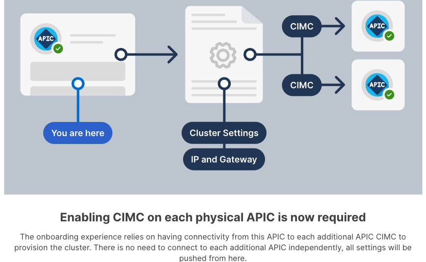

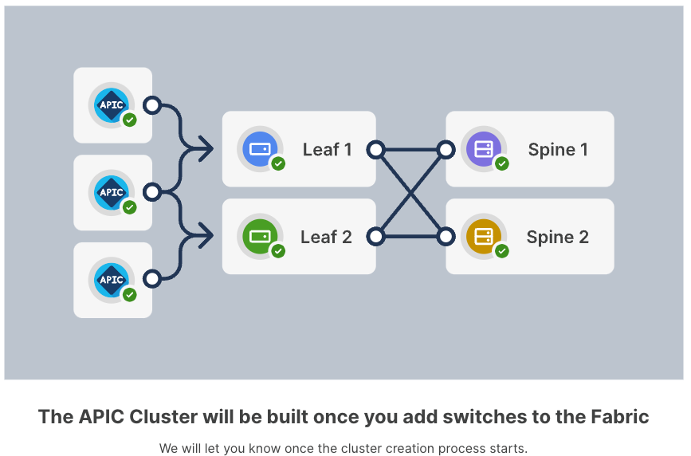


Click "Add Controller" to add the details for APIC-2 and APIC-3.

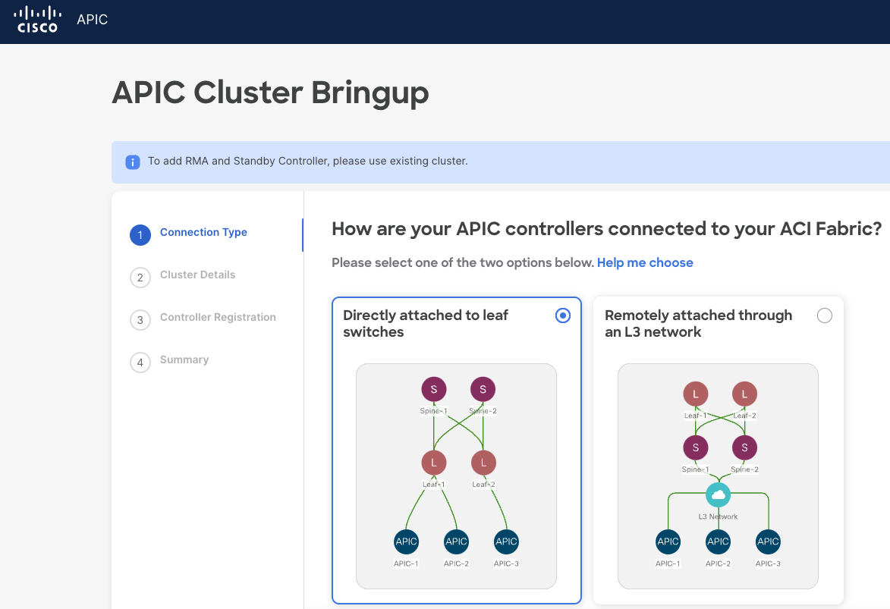

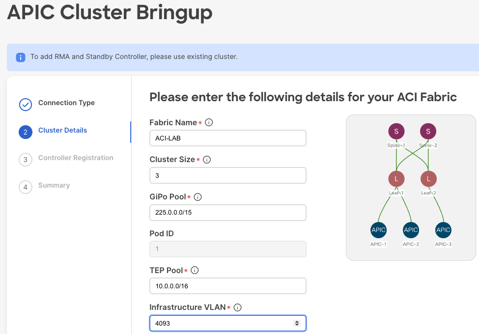

When adding a controller, Start by Entering the CIMC details (IP and login credentials) for that specific node and validate connectivity. The second step of onboarding the controller requires the following details: APIC name, Pod ID and Out of Band IP address that can be used to access the APIC's GUI interface.

Verify that the APIC names and OOB IP Addresses. If required, an option to Edit the configured details is available.

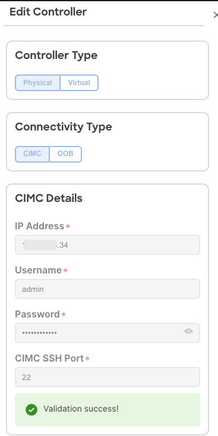

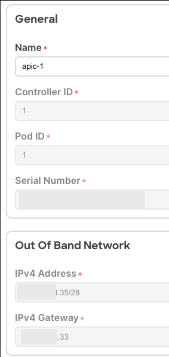

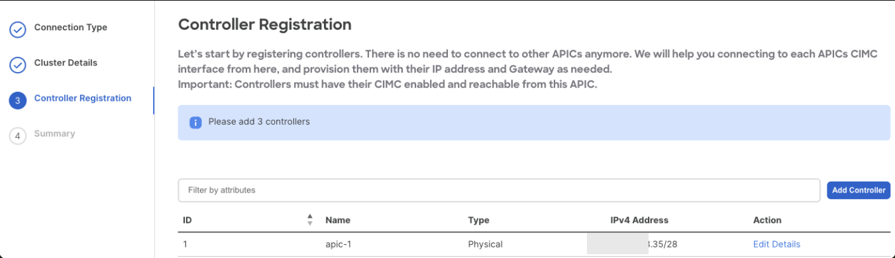

The Summary tab gives the Overview Details regarding the cluster details and configured details for each APIC node. This is the last verification checkpoint before the cluster can be deployed.

Initiate the Cluster Bring-up:

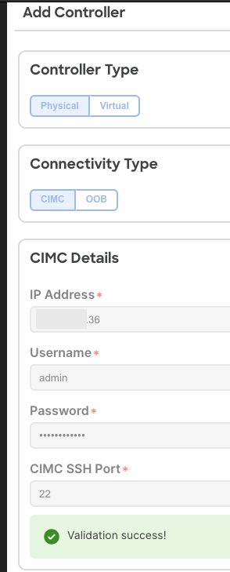

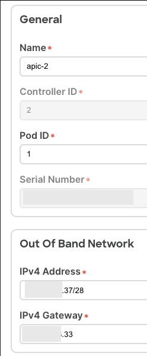

Wait for the Cluster Bringup process to complete

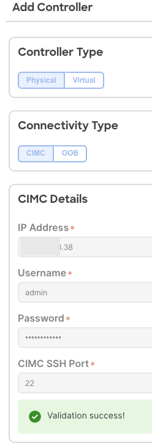

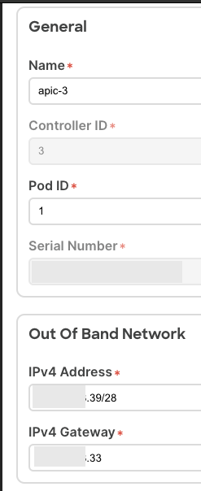

The progress details for each respective APIC can be seen by entering into each APIC.

Upon completion, Re-login into the APIC GUI;

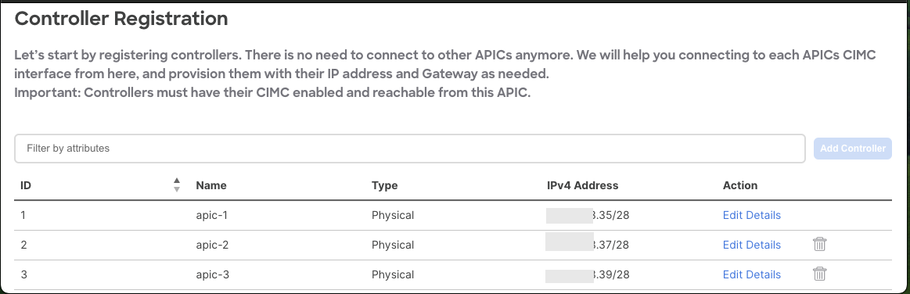

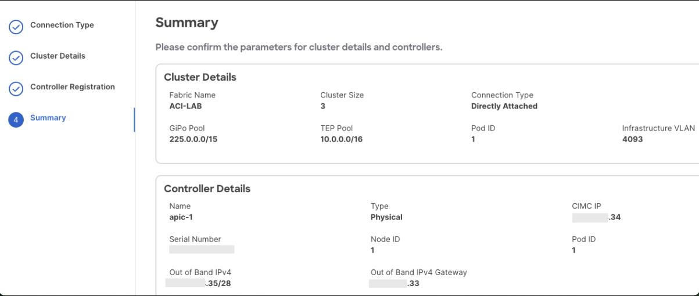

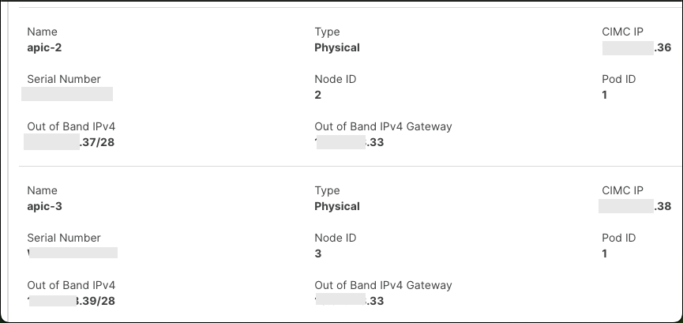

From this point, the ACI fabric is ready for initial configuration, post APICs deployment.

Verify the Cisco APIC hardware.

The acidiag verifyapic command displays the Cisco APIC hardware, including the serial number. The command also checks the certificate status and the dates that the certificate is valid for.

```text
apic-1# acidiag verifyapic
openssl_check: certificate details
subject=CN=<SERIAL>,serialNumber=PID:APIC-SERVER-M3 SN: <SERIAL>
issuer=CN=Cisco Manufacturing CA,O=Cisco Systems
notBefore=Sep 15 13:34:19 2022 GMT
notAfter=May 14 20:25:41 2029 GMT
openssl_check: passed
openssl_check: certificate details
subject=serialNumber = PID:APIC-SERVER-M3 SN:<SERIAL>, CN = <SERIAL>
Cert Type: APIC Cert
apic_cert_format_check: passed
ssh_check: passed
all_checks: passed
```

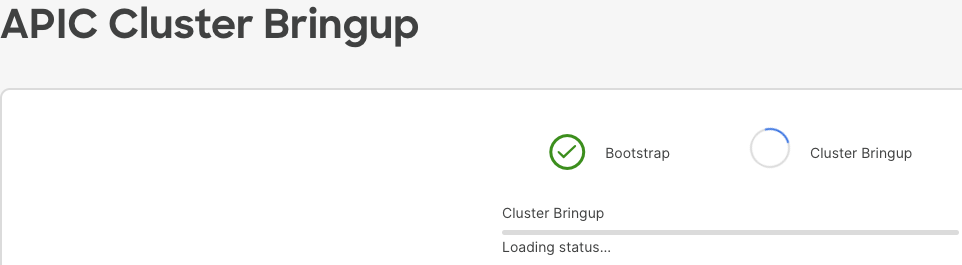

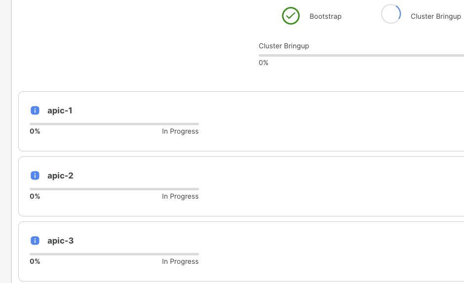

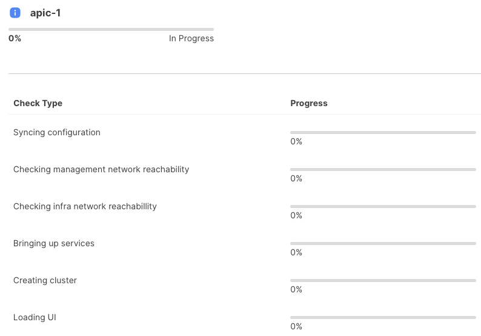

Verify that the following parameters match cross all APIC nodes:

- Fabric domain
- Fabric ID
- TEP pool
- InfraVLAN
- Group IP outside (GIPo)
- Cluster size
- Firmware version

APIC 1:

```text
apic-1# cat /data/data_admin/sam_exported.config
Setup for Active and Standby APIC
fabricDomain= ACI-LAB
fabricId= 1
systemName= apic-1
controllerID= 1
tepPool= 10.0.0.0/16
infraVlan= 4093
GIPo= 225.0.0.0/15
clusterSize= 3
standbyApic= NO
enableIPv4= Y
enableIPv6= N
firmwareVersion= 6.0(8f)
ifcIpAddr= 10.0.0.1
apicX= NO
podId= 1
standaloneApicCluster= no
oobIpAddr= x.y.z.35/28
```

APIC 2:

```text
apic-2# cat /data/data_admin/sam_exported.config
Setup for Active and Standby APIC

fabricDomain= ACI-LAB
fabricId= 1
systemName= apic-2
controllerID= 2
tepPool= 10.0.0.0/16
infraVlan= 4093
GIPo= 225.0.0.0/15
clusterSize= 3
standbyApic= NO
enableIPv4= Y
enableIPv6= N
firmwareVersion= 6.0(8f)
ifcIpAddr= 10.0.0.2
apicX= NO
podId= 1
standaloneApicCluster= no
oobIpAddr= x.y.z.37/28
```

APIC 3:

```text
apic-3# cat /data/data_admin/sam_exported.config
Setup for Active and Standby APIC

fabricDomain= ACI-LAB
fabricId= 1
systemName= apic-3
controllerID= 3
tepPool= 10.0.0.0/16
infraVlan= 4093
GIPo= 225.0.0.0/15
clusterSize= 3
standbyApic= NO
enableIPv4= Y
enableIPv6= N
firmwareVersion= 6.0(8f)
ifcIpAddr= 10.0.0.3
apicX= NO
podId= 1
standaloneApicCluster= no
oobIpAddr= x.y.z.39/28
```

Initially only apic-1 is visible under the "System" tab. All APICs will be visible once the leafs are registered in the fabric and the APICs form a cluster.

## ACI Nodes Registration

Register all the Fabric Nodes using Nexus as Code:

Link: [Initial ACI Fabric Deployment with Nexus As Code](https://github.com/TitusM/Cisco-Data-Center/tree/main/ACI/Nexus-As-Code%20-%20ACI/Initial%20Fabric%20Deployment)

!!! note
    The Nexus as code script:

    1. Registers ACI devices into the fabric.
    2. Configures the Date & Time settings (NTP servers) Pod policy.
    3. Creates a Pod Policy Group and associates it with the defined Date & Time Policy.
    4. Defines a Pod Profile and links it to the Pod Policy Group.
    5. Assigns Out-of-Band (OOB) Management IP addresses to ACI devices.
    6. Configures a DNS Profile and associate it with the default Out-of-Band Management EPG.
    7. Sets the ACI Pod BGP Autonomous System Number (ASN).
    8. Designates the Spine nodes as BGP Route Reflectors.

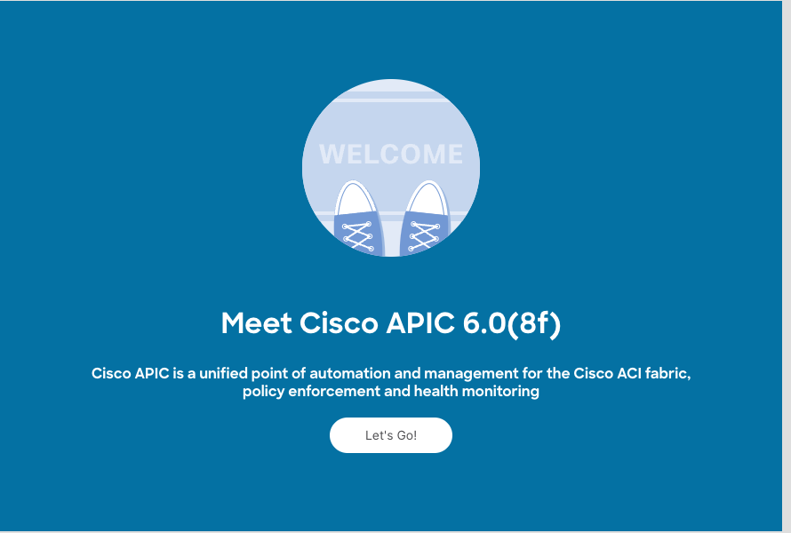

To Register the ACI nodes using the GUI follow the steps below:

Navigate to Fabric >> Inventory >> Fabric Membership >> Nodes Pending Registration.

The first leaf where the first APIC's active interface is connected to should be showing, ready to be registered to the fabric. LLDP is the protocol that is used for node discovery.

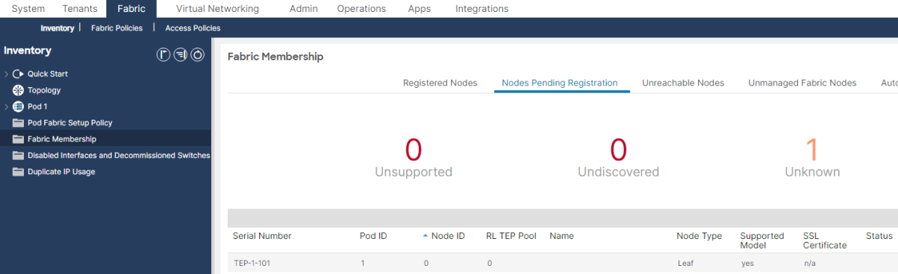

Right Click on the device and Register:
Fill in the Node-ID which will be unique for each device in the fabric and fill in the node name for the leaf.

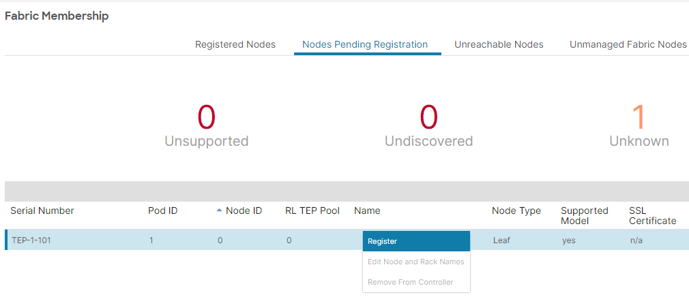

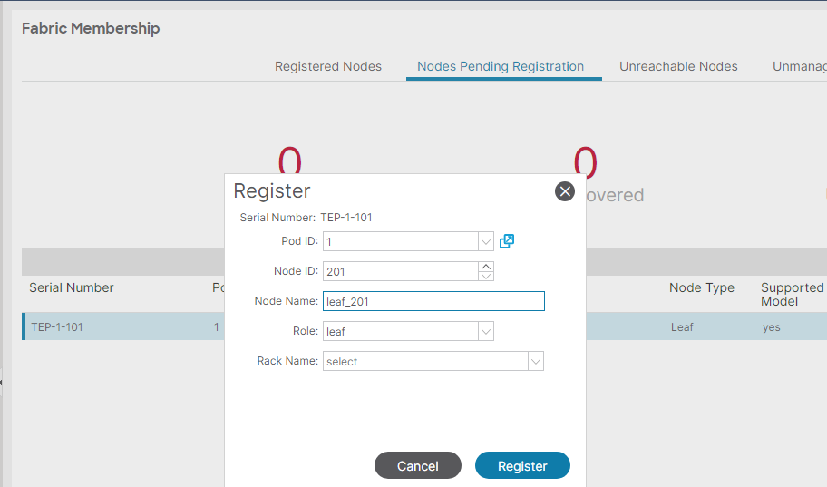

The Discovery and Registration procedure starts:

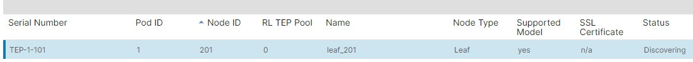

The leaf is successfully registered in the fabric. Each successfully registered node is given a TEP IP address by the APIC (via DHCP) from the TEP pool.

After the successful registration of each node, more ACI nodes starts appearing under the Nodes pending registration as the nodes communicate via LLDP.

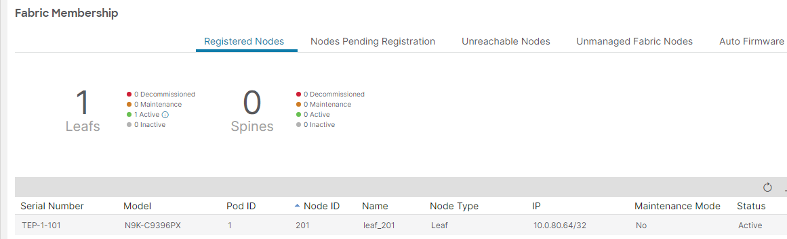

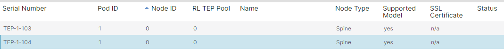

Continue with the registration process for each device providing each node with the correct Node ID and Node name.

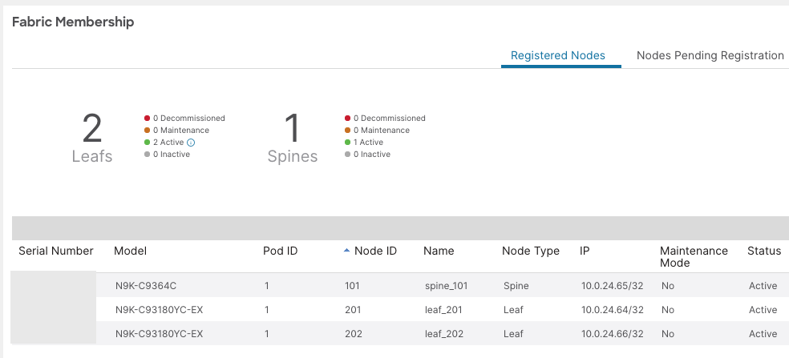

After the devices are fully discovered and registered; Navigate to Fabric >> Inventory >> Fabric Membership >> Registered Nodes

All devices should have the Status as "Active".

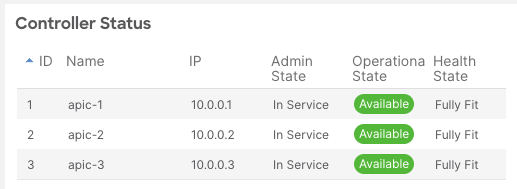

View the fabric node vector using the acidiag fnvread command

```text
apic-1# acidiag fnvread
       ID  Pod ID                 Name    Serial Number         IP Address    Role        State
LastUpdMsgId
--------------------------------------------------------------------------------------------------------
------
     101        1            spine_101      Fxxxxxxxxxx      10.0.24.65/32   spine         active   0
     201        1             leaf_201      Fxxxxxxxxxx      10.0.24.64/32    leaf         active   0
     202        1             leaf_202      Fxxxxxxxxxx      10.0.24.66/32    leaf         active   0
Total 3 nodes
```

Use the show switch command to view the nodes TEP IPs, OOB IPs, Serial number etc.

```text
apic-1# show switch
 ID    Pod   Address          In-Band IPv4      OOB IPv4          Version          Flags Serial Number    Name
---- ---- ---------------    ---------------    ---------------     ------------------ ----- ---------------- -----
 101   1     10.0.24.65       0.0.0.0          X.Y.Z.40         n9000-16.0(8f)      asiv  FXXXXXXXXXX    spine_101
 201   1     10.0.24.64       0.0.0.0          X.Y.Z.42         n9000-16.0(8f)      aliv  FXXXXXXXXXX    leaf_201
 202   1     10.0.24.66       0.0.0.0          X.Y.Z.41         n9000-16.0(8f)      aliv  FXXXXXXXXXX    leaf_202

Flags - a:Active | l/s:Leaf/Spine | v:Valid Certificate | i:In-Service
```

The IP addresses in the output resemble the TEP IP addresses assigned to the switches over DHCP through the Infra VLAN.

!!! note
    At this point the APIC cluster should be fully formed and all 3 APICs should be showing on the dashboard.

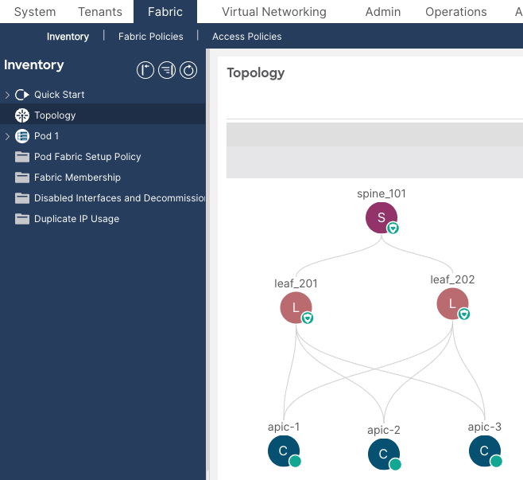

!!! note
    The acidiag avread command can be used to verify the Chassis ID/UUID, serial number, software version, TEP IP address, OOB management IP address for each APIC node.

On the APIC, verify the LLDP neighbors on the fabric interfaces (eth2-1 or eth2-2)

```text
apic-1# acidiag run lldptool in eth2-2
Chassis ID TLV
        MAC: 2c:4f:52:e1:8d:33
Port ID TLV
        Local: Eth1/1
Time to Live TLV
        120
Port Description TLV
        topology/pod-1/paths-201/pathep-[eth1/1]
System Name TLV
        leaf_201
System Description TLV
        topology/pod-1/node-201
System Capabilities TLV
        System capabilities: Bridge, Router
        Enabled capabilities: Bridge, Router
Management Address TLV
        IPv4: x.y.z.42 (OOB IP of Leaf 201)
        Ifindex: 83886080
Cisco 4-wire Power-via-MDI TLV
        4-Pair PoE supported
        Spare pair Detection/Classification not required
        PD Spare pair Desired State: Disabled
        PSE Spare pair Operational State: Disabled
Cisco Port Role TLV
        4
Cisco Port Mode TLV
        0
Cisco Port State TLV
        1
Cisco Serial Number TLV
        FDxxxxxxxxx
Cisco Model TLV
        N9K-C93180YC-EX
Cisco Node Role TLV
        1
Cisco Firmware Version TLV
        n9000-16.0(8f)
Cisco Infra VLAN TLV
        4093
Cisco Name TLV
        leaf_201
Cisco Fabric Name TLV
        ACI-LAB
Cisco Node IP TLV
        IPv4:10.0.24.64
Cisco Node ID TLV
        201
Cisco POD ID TLV
        1
Cisco Appliance Vector TLV
        Id: 1
        IPv4: 10.0.0.1
        UUID: d7a242be-
        Id: 2
        IPv4: 10.0.0.2
        UUID: 4a28bd4e-
        Id: 3
        IPv4: 10.0.0.3
        UUID: 48cca10f-
LLDP-MED Capabilities TLV
        Device Type: netcon
        Capabilities: LLDP-MED, Network Policy, Extended Power via MDI-PSE
LLDP-MED Network Policy TLV
        01400000
End of LLDPDU TLV
```

Using the name of each node, from the APIC CLI; SSH to each node and verify LLDP neighborship.

Leaf_201

```text
apic-1# ssh leaf_201

(admin@leaf_201) Password:
Last login:
Cisco Nexus Operating System (NX-OS) Software
TAC support: http://www.cisco.com/tac
……
leaf_201#
leaf_201# show lldp neig
Capability codes:
   (R) Router, (B) Bridge, (T) Telephone, (C) DOCSIS Cable Device
   (W) WLAN Access Point, (P) Repeater, (S) Station, (O) Other
Device ID             Local Intf      Hold-time Capability Port ID
apic-1                 Eth1/1          120                     eth2-2
apic-2                 Eth1/2          120                     eth2-2
apic-3                 Eth1/3          120                     eth2-2
spine_101              Eth1/49         120        BR           Eth1/2
Total entries displayed: 5
leaf_201#
```

Leaf_202

```text
apic-1# ssh leaf_202
(admin@leaf_202) Password:
Last login:
Cisco Nexus Operating System (NX-OS) Software
TAC support: http://www.cisco.com/tac
…….
leaf_202#
leaf_202# show lldp neig
Capability codes:
  (R) Router, (B) Bridge, (T) Telephone, (C) DOCSIS Cable Device
  (W) WLAN Access Point, (P) Repeater, (S) Station, (O) Other
Device ID            Local Intf       Hold-time Capability Port ID
apic-1                Eth1/1           120                    eth2-4
apic-2                Eth1/2           120                    eth2-4
apic-3                Eth1/3           120                    eth2-4
spine_101             Eth1/49          120       BR           Eth1/1
Total entries displayed: 5
leaf_202#
```

Leaf_203

```text
apic-1# ssh spine_101
Warning: Permanently added 'spine_101' (RSA) to the list of known hosts.
(admin@spine_101) Password:
Last login:
Cisco Nexus Operating System (NX-OS) Software
TAC support: http://www.cisco.com/tac
…….
spine_101#
spine_101# show lldp neig
Capability codes:
  (R) Router, (B) Bridge, (T) Telephone, (C) DOCSIS Cable Device
  (W) WLAN Access Point, (P) Repeater, (S) Station, (O) Other
Device ID            Local Intf      Hold-time Capability Port ID
leaf_202              Eth1/1          120        BR           Eth1/49
leaf_201              Eth1/2          120        BR           Eth1/49
Total entries displayed: 2
spine_101#
```

Navigate to Fabric >> Inventory >> Topology to verify that all nodes are connected as expected.

View APIC interfaces using the acidiag command.

```text
apic-1# ifconfig
bond0: flags=5187<UP,BROADCAST,RUNNING,MASTER,MULTICAST> mtu 1500
        inet6 fe80::527c:6fff:fe1b:cf48 prefixlen 64 scopeid 0x20<link>
        ether 50:7c:6f:1b:cf:48 txqueuelen 1000 (Ethernet)

eth2-1: flags=6147<UP,BROADCAST,SLAVE,MULTICAST>   mtu 1500
        ether 50:7c:6f:1b:cf:48 txqueuelen 1000    (Ethernet)

eth2-1: flags=6147<UP,BROADCAST,SLAVE,MULTICAST> mtu 1500
        ether 50:7c:6f:1b:cf:48 txqueuelen 1000 (Ethernet)
eth2-2: flags=6211<UP,BROADCAST,RUNNING,SLAVE,MULTICAST> mtu 1500
        ether 50:7c:6f:1b:cf:48 txqueuelen 1000 (Ethernet)
        RX packets 98562438 bytes 43916643746 (43.9 GB)
        RX errors 0 dropped 0 overruns 0 frame 0
        TX packets 120799046 bytes 50127412234 (50.1 GB)

eth2-3: flags=6147<UP,BROADCAST,SLAVE,MULTICAST>   mtu 1500
        ether 50:7c:6f:1b:cf:48 txqueuelen 1000    (Ethernet)

eth2-4: flags=6211<UP,BROADCAST,RUNNING,SLAVE,MULTICAST> mtu 1500
        ether 50:7c:6f:1b:cf:48 txqueuelen 1000 (Ethernet)
        RX packets 6600 bytes 2870234 (2.8 MB)
        RX errors 0 dropped 0 overruns 0 frame 0
        TX packets 6406 bytes 1769644 (1.7 MB)

bond1: flags=5187<UP,BROADCAST,RUNNING,MASTER,MULTICAST> mtu 1500
        inet6 fe80::2df:1dff:fe35:a456 prefixlen 64 scopeid 0x20<link>
        ether 00:df:1d:35:a4:56 txqueuelen 1000 (Ethernet)
        TX errors 0 dropped 0 overruns 0 carrier 0 collisions 0

eth1-1: flags=6211<UP,BROADCAST,RUNNING,SLAVE,MULTICAST> mtu 1500
        ether 00:df:1d:35:a4:56 txqueuelen 1000 (Ethernet)

eth1-2: flags=6147<UP,BROADCAST,SLAVE,MULTICAST>   mtu 1500
        ether 00:df:1d:35:a4:56 txqueuelen 1000    (Ethernet)

bond0.4093: flags=4163<UP,BROADCAST,RUNNING,MULTICAST> mtu 1500
        inet 10.0.0.1 netmask 255.255.255.255 broadcast 0.0.0.0
        inet6 fe80::527c:6fff:fe1b:cf48 prefixlen 64 scopeid 0x20<link>
        ether 50:7c:6f:1b:cf:48 txqueuelen 1000 (Ethernet)

oobmgmt: flags=4419<UP,BROADCAST,RUNNING,PROMISC,MULTICAST> mtu 1500
        inet 10.82.143.35 netmask 255.255.255.240 broadcast 0.0.0.0
        inet6 fe80::2df:1dff:fe35:a456 prefixlen 64 scopeid 0x20<link>
        ether 00:df:1d:35:a4:56 txqueuelen 1000 (Ethernet)
```

The output above has been truncated to display some interfaces of interest for this lab:

- bond0: This is the logical bond that bundles the physical interfaces attached to the fabric (eth2-2 and eth2-4)
- bond1: This is the logical bond that provides out of band connectivity
- bond0.4093: This a sub-interface of the bond0 interface that carries Infra traffic, such as packets encapsulated with the Infra VLAN (4093) 802.1Q header. The IP address of this sub-interface "10.0.0.1" belongs to the TEP address pool (10.0.0.0/16) that was configured in the Setup utility.
- oobmgmt: This is the logical interface for OOB management and it will show the IP address that is used to access the APIC via the GUI or SSH.

bond0:
The bonding mode is set to (active-backup) and eth2-2 is the active port connecting to the leaf in the fabric.

```text
apic-1# cat /proc/net/bonding/bond0
Ethernet Channel Bonding Driver: v5.15.126atom-1

Bonding Mode: fault-tolerance (active-backup)
Primary Slave: None
Currently Active Slave: eth2-2
MII Status: up
MII Polling Interval (ms): 60
Up Delay (ms): 0
Down Delay (ms): 0
Peer Notification Delay (ms): 0

Slave Interface: eth2-1
MII Status: down
Speed: Unknown
Duplex: Unknown
Link Failure Count: 0
Permanent HW addr: 50:7c:6f:1b:cf:48
Slave queue ID: 0

Slave Interface: eth2-2
MII Status: up
Speed: 1000 Mbps
Duplex: full
Link Failure Count: 0
Permanent HW addr: 50:7c:6f:1b:cf:49
Slave queue ID: 0

Slave Interface: eth2-3
MII Status: down
Speed: Unknown
Duplex: Unknown
Link Failure Count: 0
Permanent HW addr: 50:7c:6f:1b:cf:4a
Slave queue ID: 0

Slave Interface: eth2-4
MII Status: up
Speed: 1000 Mbps
Duplex: full
Link Failure Count: 0
Permanent HW addr: 50:7c:6f:1b:cf:4b
Slave queue ID: 0
apic-1#
```

View the interfaces on leaf_201 using the show interface brief command

```text
leaf_201# show interface brief
--------------------------------------------------------------------------------
Port   VRF          Status IP Address                              Speed     MTU
--------------------------------------------------------------------------------
mgmt0 --            up     x.y.z.42                                1000      9000

--------------------------------------------------------------------------------
Ethernet         VLAN    Type Mode    Status Reason                   Speed      Port
Interface                                                                        Ch #
--------------------------------------------------------------------------------
Eth1/1           0       eth trunk    up     none                     1000(D)    --
Eth1/2           0       eth trunk    up     none                     1000(D)    --
Eth1/3           0       eth trunk    up     none                     1000(D)    --
!
Eth1/49          --      eth routed up       none                     40G(D)     --
Eth1/49.8        2       eth routed up       none                     40G(D)     --
```

- Interfaces Eth1/1-3 are interfaces connected to apic-1, apic-2 and apic-3 as shown by the LLDP neighborship output earlier.
- Interface Eth1/49 is a routed port with a sub-interface. The sub-interface provides a logical connection to the spine.

Verify the VRF instances that are associated with the leaf.

```text
leaf_201# show vrf
 VRF-Name                           VRF-ID State    Reason
 black-hole                              3 Up       --
 management                              2 Up       --
 overlay-1                               4 Up       --
```

The overlay-1 VRF is part of the default "infra" tenant and it is used for VXLAN traffic.

View the IP interfaces on the leaf using the show ip interface brief vrf overlay-1 command.

```text
leaf_201# show ip interface brief vrf overlay-1
IP Interface Status for VRF "overlay-1"(4)
Interface            Address              Interface Status
eth1/49              unassigned           protocol-up/link-up/admin-up
eth1/49.8            unnumbered           protocol-up/link-up/admin-up
                     (lo0)
eth1/50              unassigned           protocol-down/link-down/admin-up
vlan7                10.0.0.30/27         protocol-up/link-up/admin-up
lo0                  10.0.24.64/32        protocol-up/link-up/admin-up
lo2047               10.0.0.32/32         protocol-up/link-up/admin-up
```

lo0: This is the TEP IP address that was obtained via DHCP from the APIC. This physical tunnel endpoint (PTEP) is also applied as unnumbered to a sub-interface peering with the spine for the underlay routing protocol (IS-IS)

lo2047: This is a fabric loopback TEP that is used to encapsulate traffic in VXLAN to a vSwitch VTEP if present. This unique FTEP address is identical on all leaf switches to allow mobility of downstream VTEP devices.

Examine the VLAN to VXLAN mapping on the leaf.

```text
leaf_201# show vlan extended

 VLAN Name                             Encap            Ports
 ---- -------------------------------- ---------------- ------------------------
 7    infra:default                    vxlan-16777209, Eth1/1, Eth1/2, Eth1/3
                                       vlan-4093
```

```text
leaf_201# show system internal epm vlan all

+----------+---------+-----------------+----------+------+----------+-----------
   VLAN ID    Type      Access Encap     Fabric    H/W id BD VLAN     Endpoint
                        (Type Value)     Encap                          Count
+----------+---------+-----------------+----------+------+----------+-----------
 7           Infra BD   802.1Q 4093      16777209   13     7          3
```

The Infra VLAN (4093) is mapped to the Platform-Independent (PI VLAN) 7 and Infra VXLAN 16777209. Validate that the Infra VLAN is trunked to all ports that are connected to the APIC nodes. The endpoint count (3) is the APIC nodes that are connected on the interfaces Eth1/1-3.

View the interfaces on the spine using the show interface brief command.

```text
spine_101# show interface brief
--------------------------------------------------------------------------------
Ethernet         VLAN    Type Mode    Status Reason                   Speed      Port
Interface                                                                        Ch #
--------------------------------------------------------------------------------
Eth1/1           --      eth routed up       none                     40G(D)     --
Eth1/1.68        2       eth routed up       none                     40G(D)     --
Eth1/2           --      eth routed up       none                     40G(D)     --
Eth1/2.67        2       eth routed up       none                     40G(D)     --
….
--------------------------------------------------------------------------------
Interface     Status     Description
--------------------------------------------------------------------------------
Lo0           up         --
Lo1           up         --
Lo2           up         --
Lo3           up         --
Lo4           up         --
Lo5           up         --
Lo6           up         --
Lo7           up         --
Lo8           up         --
Lo9           up         --

--------------------------------------------------------------------------------
Interface                Status     IP Address        Encap type      MTU
--------------------------------------------------------------------------------
Tunnel1                  up         --                ivxlan          9000
Tunnel2                  up         --                ivxlan          9000
Tunnel3                  up         --                ivxlan          9000
Tunnel4                  up         --                ivxlan          9000
Tunnel5                  up         --                ivxlan          9000
Tunnel6                  up         --                ivxlan          9000
```

View the IP interfaces on the spine using the show ip interface brief vrf overlay-1 command.

```text
spine_101# show ip interface brief vrf overlay-1
IP Interface Status for VRF "overlay-1"(4)
Interface            Address              Interface Status
eth1/1               unassigned           protocol-up/link-up/admin-up
eth1/1.68            unnumbered           protocol-up/link-up/admin-up
                     (lo0)
eth1/2               unassigned           protocol-up/link-up/admin-up
eth1/2.67            unnumbered           protocol-up/link-up/admin-up
                     (lo0)
--------------------------------------------------------------------------------
lo0                  10.0.24.65/32        protocol-up/link-up/admin-up
lo1                  10.0.0.33/32         protocol-up/link-up/admin-up
lo2                  10.0.0.34/32         protocol-up/link-up/admin-up
lo3                  10.0.0.35/32         protocol-up/link-up/admin-up
lo4                  10.0.80.67/32        protocol-up/link-up/admin-up
lo5                  10.0.80.66/32        protocol-up/link-up/admin-up
lo6                  10.0.80.65/32        protocol-up/link-up/admin-up
lo7                  10.0.128.64/32       protocol-up/link-up/admin-up
lo8                  10.0.128.65/32       protocol-up/link-up/admin-up
lo9                  10.0.128.66/32       protocol-up/link-up/admin-up
```

The spine contains several TEP addresses for different communication purposes in the ACI fabric.

lo0: is the PTEP IP address that was obtain via the APIC DHCP process. This IP address is used for the IS-IS peering on the leaf-facing sub-interfaces (IP unnumbered method).
lo7: This is the proxy-anycast-v4
lo8: This is the proxy-anycast-mac
lo9: This is the proxy-anycast-v6

These spine-proxy TEP addresses can be viewed from any leaf using the show isis dteps vrf overlay-1 command

```text
leaf_201# show isis dteps vrf overlay-1

IS-IS Dynamic Tunnel End Point (DTEP) database:
DTEP-Address       Role    Encapsulation   Type
10.0.24.65         SPINE   N/A             PHYSICAL
10.0.24.66         LEAF    N/A             PHYSICAL
10.0.128.65        SPINE   N/A             PHYSICAL,PROXY-ACAST-MAC
10.0.128.64        SPINE   N/A             PHYSICAL,PROXY-ACAST-V4
10.0.128.66        SPINE   N/A             PHYSICAL,PROXY-ACAST-V6
```

!!! note
    The spine-proxy TEP address is an anycast IP address that exists across all spines, used for forwarding lookups into the mapping database (Council of Oracle Protocol [COOP]). There is a separate spine-proxy TEP address for each address family (IPv4, IPv6 and MAC).

Examine the Spine routing table of the overlay-1 VRF.

```text
spine_101# show ip route vrf overlay-1
IP Route Table for VRF "overlay-1"
'*' denotes best ucast next-hop
'**' denotes best mcast next-hop
'[x/y]' denotes [preference/metric]
'%<string>' in via output denotes VRF <string>

10.0.0.0/16, ubest/mbest: 1/0
    *via , null0, [1/0], 2d18h, static
APIC nodes TEP IPs
10.0.0.1/32, ubest/mbest: 1/0
    *via 10.0.24.64, eth1/2.67, [115/11], 2d18h, isis-isis_infra, isis-l1-ext
10.0.0.2/32, ubest/mbest: 1/0
    *via 10.0.24.64, eth1/2.67, [115/11], 2d18h, isis-isis_infra, isis-l1-ext
10.0.0.3/32, ubest/mbest: 1/0
    *via 10.0.24.64, eth1/2.67, [115/11], 2d18h, isis-isis_infra, isis-l1-ext

10.0.0.33/32, ubest/mbest: 2/0, attached, direct
    *via 10.0.0.33, lo1, [0/0], 2d18h, direct
    *via 10.0.0.33, lo1, [0/0], 2d18h, local, local
10.0.0.34/32, ubest/mbest: 2/0, attached, direct
    *via 10.0.0.34, lo2, [0/0], 2d18h, direct
    *via 10.0.0.34, lo2, [0/0], 2d18h, local, local
10.0.0.35/32, ubest/mbest: 2/0, attached, direct
    *via 10.0.0.35, lo3, [0/0], 2d18h, direct
    *via 10.0.0.35, lo3, [0/0], 2d18h, local, local

leaf_201 PTEP
10.0.24.64/32, ubest/mbest: 1/0
    *via 10.0.24.64, eth1/2.67, [115/2], 2d18h, isis-isis_infra, isis-l1-int

spine_101 PTEP
10.0.24.65/32, ubest/mbest: 2/0, attached, direct
    *via 10.0.24.65, lo0, [0/0], 2d18h, direct
    *via 10.0.24.65, lo0, [0/0], 2d18h, local, local

leaf_202 PTEP
10.0.24.66/32, ubest/mbest: 1/0
    *via 10.0.24.66, eth1/1.68, [115/2], 2d18h, isis-isis_infra, isis-l1-int

10.0.80.65/32, ubest/mbest: 2/0, attached, direct
    *via 10.0.80.65, lo6, [0/0], 2d18h, direct
    *via 10.0.80.65, lo6, [0/0], 2d18h, local, local
10.0.80.66/32, ubest/mbest: 2/0, attached, direct
    *via 10.0.80.66, lo5, [0/0], 2d18h, direct
    *via 10.0.80.66, lo5, [0/0], 2d18h, local, local
10.0.80.67/32, ubest/mbest: 2/0, attached, direct
    *via 10.0.80.67, lo4, [0/0], 2d18h, direct
    *via 10.0.80.67, lo4, [0/0], 2d18h, local, local
10.0.128.64/32, ubest/mbest: 2/0, attached, direct
    *via 10.0.128.64, lo7, [0/0], 2d18h, direct
    *via 10.0.128.64, lo7, [0/0], 2d18h, local, local
10.0.128.65/32, ubest/mbest: 2/0, attached, direct
    *via 10.0.128.65, lo8, [0/0], 2d18h, direct
    *via 10.0.128.65, lo8, [0/0], 2d18h, local, local
10.0.128.66/32, ubest/mbest: 2/0, attached, direct
    *via 10.0.128.66, lo9, [0/0], 2d18h, direct
    *via 10.0.128.66, lo9, [0/0], 2d18h, local, local
```

The routing table of the spine will have all routes towards the leafs and APICs.

Examine the endpoint table of the leaf with the active interfaces towards the APICs.

```text
leaf_201# show endpoint
Legend:
 S - static           s - arp              L - local              O - peer-attached
 V - vpc-attached     a - local-aged        p - peer-aged         M - span
 B - bounce           H - vtep             R - peer-attached-rl D - bounce-to-proxy
 E - shared-service   m - svc-mgr          C - control-ep
+-----------------------------------+---------------+-----------------+--------------+-------------+
      VLAN/                           Encap            MAC Address        MAC Info/     Interface
      Domain                          VLAN             IP Address         IP Info
+-----------------------------------+---------------+-----------------+--------------+-------------+
overlay-1                                                   10.0.24.64 L                        lo0
7/overlay-1                          vxlan-16777209     507c.6f1b.cf48 L                     eth1/1
7/overlay-1                          vxlan-16777209     507c.6f1b.ccf0 L                     eth1/2
7/overlay-1                          vxlan-16777209     507c.6f1b.c630 L                     eth1/3
```

The MAC addresses of the APICs are obtained in this endpoint table.

## Configure Out-of-Band Management - GUI

The leafs and spine hardware have a dedicated physical interface for out-of-band management. Out of band IP addresses must be configured to be able to access these devices via SSH. In this lab the Out of Band were already configured during the Fabric Bring Up.

Link: [Initial ACI Fabric Deployment with Nexus As Code](https://github.com/TitusM/Cisco-Data-Center/tree/main/ACI/Nexus-As-Code%20-%20ACI/Initial%20Fabric%20Deployment)

To configure Out of Band Management IP addresses via the GUI follow the steps below.

Navigate to Tenants >> mgmt >> Node Management Addresses >> Static Node Management Addresses >> Right Click, Create Static Node Management Addresses. Enter the nodes details (Node ID, OOB IP addresses).

After submitting, the CLI of the nodes should be accessible via SSH.

The IP address that is assigned to a node's management interface can be verified on the node's CLI.

```text
leaf_201# show ip interface brief vrf management
IP Interface Status for VRF "management"(2)
Interface            Address              Interface Status
mgmt0                X.Y.Z.42/28      protocol-up/link-up/admin-up
```

## Configure NTP - GUI

NTP plays a crucial role in the Cisco ACI Fabric as it is used to for time synchronization across the nodes. Correct time on the fabric eases monitoring and troubleshooting use case cases as the logs will contain consistent timestamps across all devices in the fabric.

In this lab, NTP is configured to use the Out of Band management network.

Navigate to Fabric > Fabric Policies > Policies > Pod > Date and Time. Right-click, Create Date and Time Policy.

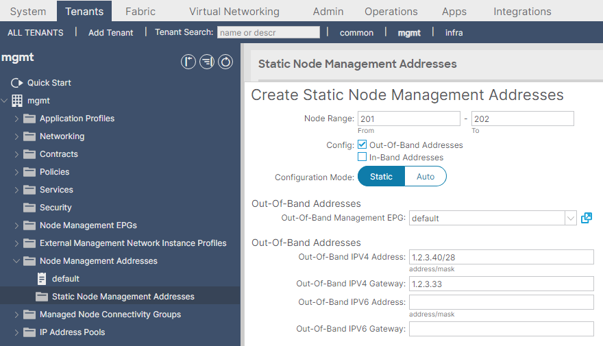

Add the NTP Server(s) and associate it with the Management EPG.

Create a Pod Policy Group.

Navigate to Fabric > Fabric Policies > Pods, right-click Policy Groups to Create Pod Policy Group and associate it with the Date and Time policy that was created.

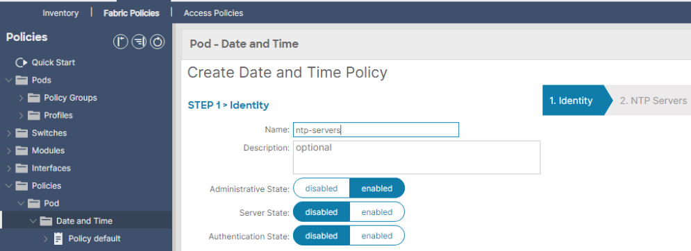

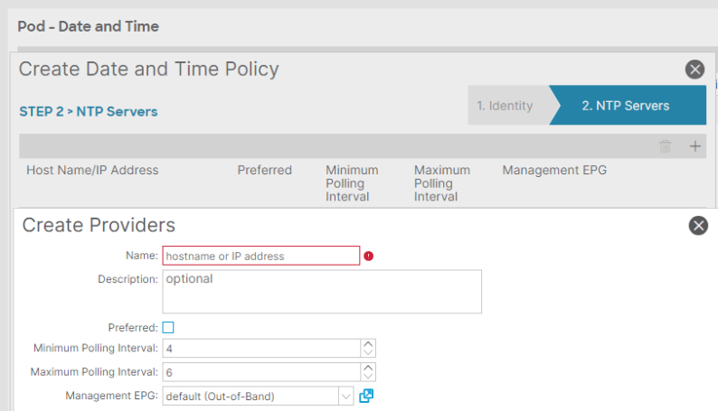

Navigate to Fabric > Fabric Policies > Pods > Profiles > Right Click, Create Pod Profile and associate it with the created Pod Policy Group.

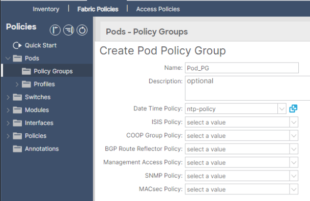

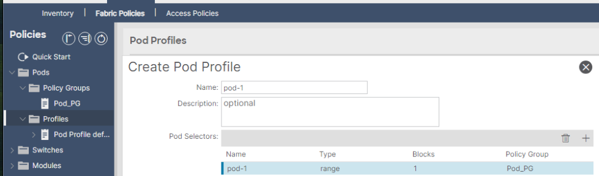

Validate the NTP Server Sync Status.

Navigate to Fabric > Fabric Policies > Policies > Pod > Date and Time > Policy NTP > NTP Server <Select NTP Server>, click on the Operational tab and examine the Sync Status.

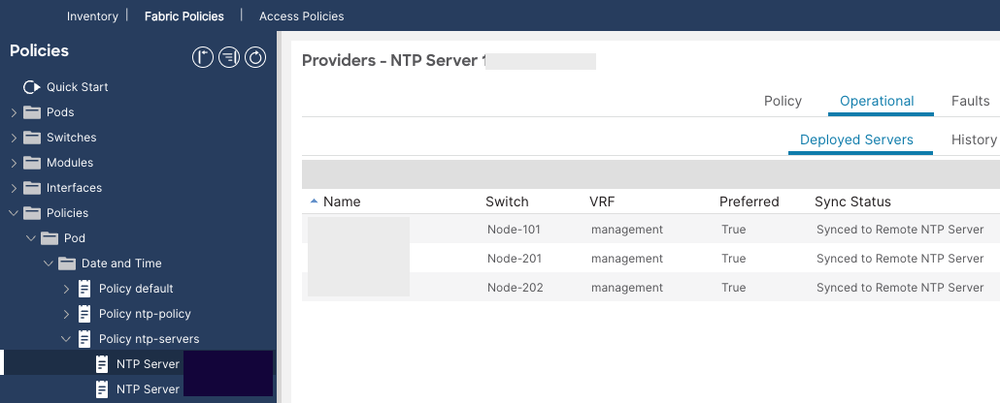

Connect to a leaf via SSH and examine the NTP peer-status.

```text
leaf_201# show ntp peer-status
Total peers : 2
* - selected for sync, + - peer mode(active),
- - peer mode(passive), = - polled in client mode
    remote                               local           st poll reach delay vrf
--------------------------------------------------------------------------------
=1.2.3.17                           0.0.0.0         2 64    377   0.000 management
*1.2.3.16                           0.0.0.0         2 64    377   0.000 management
```

## References

- [https://www.cisco.com/c/en/us/td/docs/switches/datacenter/aci/apic/sw/4-x/getting-started/Cisco-APIC-Getting-Started-Guide-421/b-Cisco-APIC-Getting-Started-Guide-421_chapter_0100.pdf](https://www.cisco.com/c/en/us/td/docs/switches/datacenter/aci/apic/sw/4-x/getting-started/Cisco-APIC-Getting-Started-Guide-421/b-Cisco-APIC-Getting-Started-Guide-421_chapter_0100.pdf)
- [https://www.cisco.com/c/en/us/td/docs/dcn/aci/apic/6x/getting-started/cisco-apic-getting-started-guide-60x/initial-setup-60x.html](https://www.cisco.com/c/en/us/td/docs/dcn/aci/apic/6x/getting-started/cisco-apic-getting-started-guide-60x/initial-setup-60x.html)
- [https://www.cisco.com/c/en/us/td/docs/dcn/whitepapers/cisco-application-centric-infrastructure-design-guide.html](https://www.cisco.com/c/en/us/td/docs/dcn/whitepapers/cisco-application-centric-infrastructure-design-guide.html)
