# Cisco ACI Inter-VRF Route-Leaking

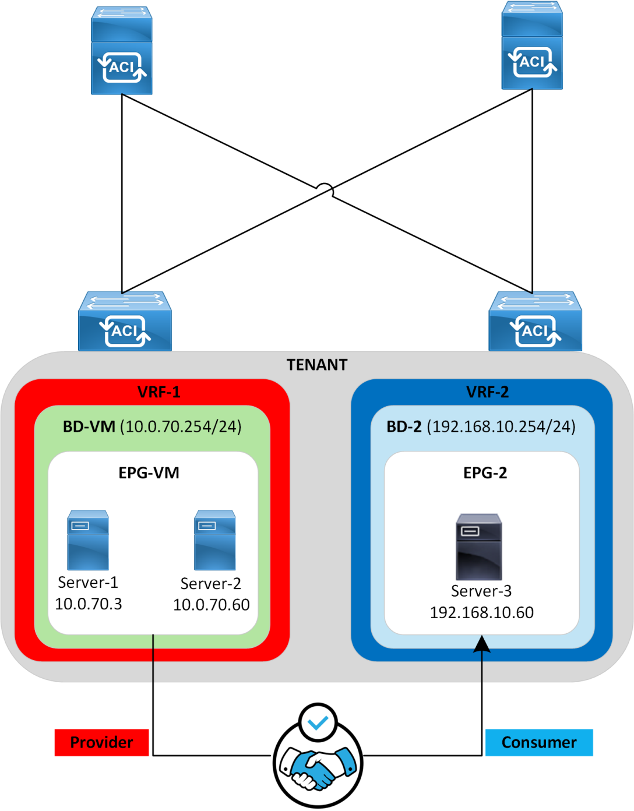

## Overview

Inter-VRF route leaking allows routes from one VRF to be accessible in another VRF. In Cisco ACI, this is achieved using contracts between EPGs in different VRFs, which results in endpoints that reside in different VRFs to communicate. Cisco ACI allows traffic from provider VRF to the consumer VRF, and filtering along with policy enforcement is performed within the consumer VRF.

The main pre-requisites to allow inter-VRF communication are as follows:

1. The scope of the contract should be set to Tenant so that the contract will program rules between EPGs that are defined within the same tenant, despite being in different VRFs.
2. For the provider EPG, a subnet should be configured under the EPG with the following settings selected
    1. Shared between VRFs
        1. To allow the subnet to be leaked and be visible in other VRFs.
    2. No default gateway SVI
        1. This is selected so that the subnet defined under the Bridge Domain remains functioning as the Default Gateway.
3. For the consumer EPG, the Subnet Scope under the Bridge Domain must be configured with the “Shared Between VRFs” setting selected.

For more details, refer to the official Cisco ACI Design Guide:
[https://www.cisco.com/c/en/us/td/docs/dcn/whitepapers/cisco-application-centric-infrastructure-design-guide.html#InterTenantandInterVRFCommunication](https://www.cisco.com/c/en/us/td/docs/dcn/whitepapers/cisco-application-centric-infrastructure-design-guide.html#InterTenantandInterVRFCommunication)

!!! note
    This lab was conducted in a controlled environment. Any configurations in a production network should be implemented during a designated maintenance window. Additionally, always refer to official Cisco documentation relevant to your specific hardware and software.

## Lab-Setup

In this lab, there are two Endpoint Groups (EPGs), each associated with its own Bridge Domain (BD), under different Virtual Routing and Forwarding (VRF) instances. EPG-VM resides in VRF-1 and EPG-2 resides in VRF-2. Inter-VRF communication will be established between EPG-VM and EPG-2 endpoints.

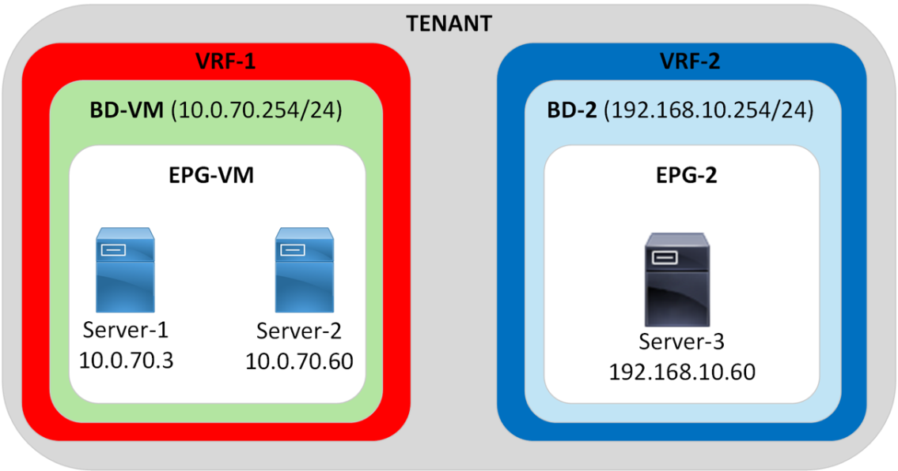

## Verify the Routing Tables for VRF-1 & VRF-2

```text
L102# show ip route vrf tmajeza-tenant:VRF-1
IP Route Table for VRF "tmajeza-tenant:VRF-1"
'*' denotes best ucast next-hop
'**' denotes best mcast next-hop
'[x/y]' denotes [preference/metric]
'%<string>' in via output denotes VRF <string>

10.0.70.0/24, ubest/mbest: 1/0, attached, direct, pervasive
    *via 10.0.80.66%overlay-1, [1/0], -02w06d, static, tag 4294967294
10.0.70.254/32, ubest/mbest: 1/0, attached, pervasive
    *via 10.0.70.254, vlan164, [0/0], -03w03d, local, local
!
L102# show ip route vrf tmajeza-tenant:VRF-2
IP Route Table for VRF "tmajeza-tenant:VRF-2"
'*' denotes best ucast next-hop
'**' denotes best mcast next-hop
'[x/y]' denotes [preference/metric]
'%<string>' in via output denotes VRF <string>

192.168.10.0/24, ubest/mbest: 1/0, attached, direct, pervasive
    *via 10.0.80.66%overlay-1, [1/0], 00:04:25, static, tag 4294967294
192.168.10.254/32, ubest/mbest: 1/0, attached, pervasive
    *via 192.168.10.254, vlan602, [0/0], 00:04:25, local, local
```

No inter-VRF communication is allowed between Servers in EPG-VM and Servers in EPG-2.
No ICMP reachability

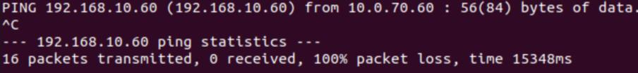

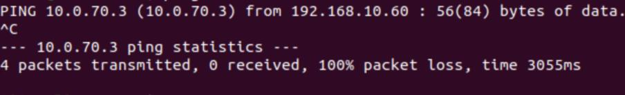

No HTTPS allowed

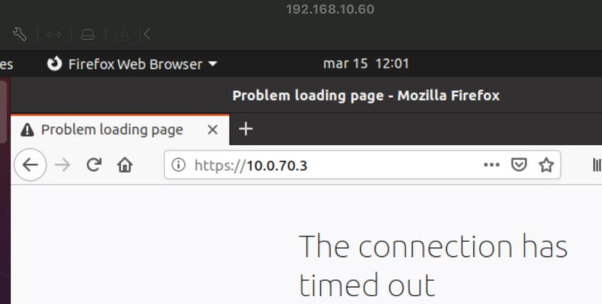

## Target State

In this lab the requirement is to establish inter-VRF communication between endpoints that reside in VRF-1 and VRF-2. A contract with Scope set to “Tenant” will be provided by EPG-VM and consumed between by EPG-2. This contract is configured to permit ICMP and HTTPS traffic.

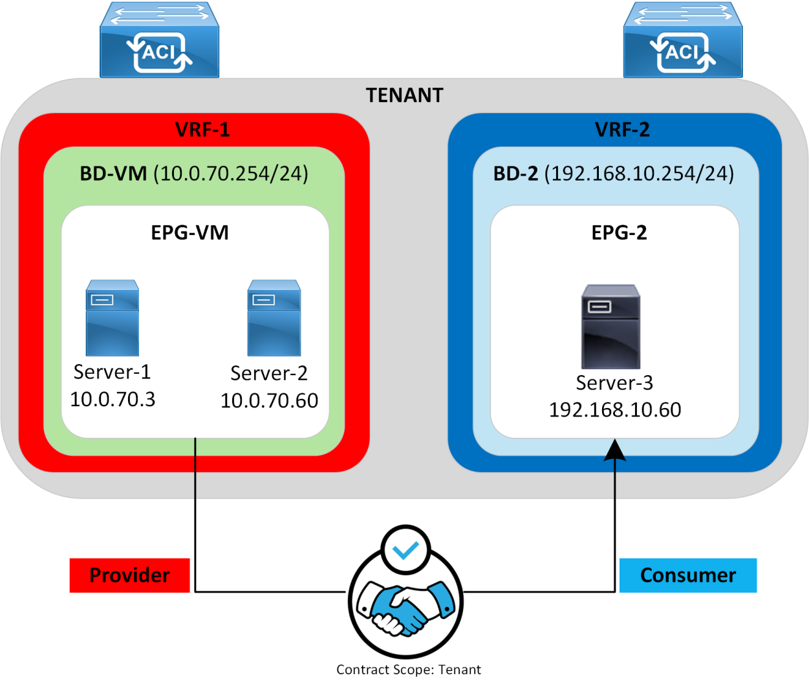

## ACI Inter-VRF Configuration

### Contract Scope

Set the Scope of the Contract to “Tenant”, so that the contract can be Provided/Consumed across the VRFs under the same Tenant.

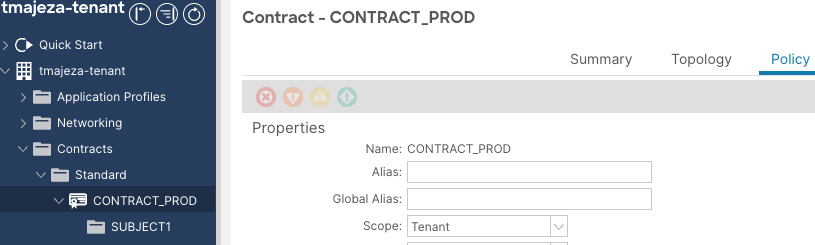

### Consumer EPG (Bridge Domain Subnet setting)

Configure the Consumer Bridge Domain subnet scope with the “Shared between VRFs” setting.

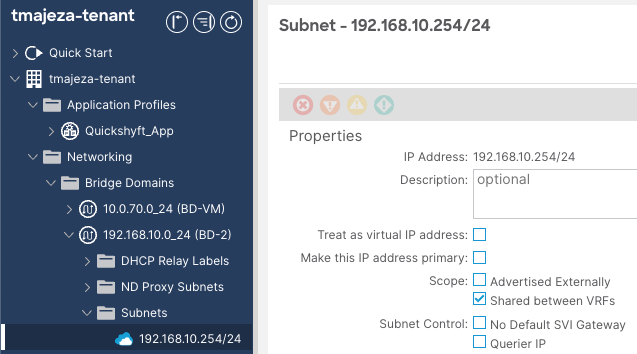

### Provider EPG (Bridge Domain Subnet Scope & Subnet under EPG configuration)

Under the Bridge Domain Subnet, Select the “Shared between VRFs” knob.

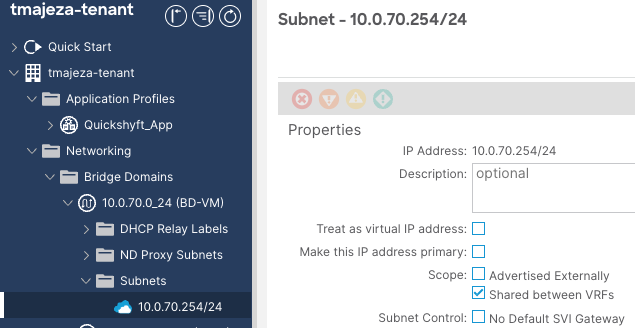

!!! note
    It is required to change the Subnet Scope on the Subnet defined under the Bridge Domain first before attempting to configure the Subnet under the EPG. Failure to do so will result in the error below.

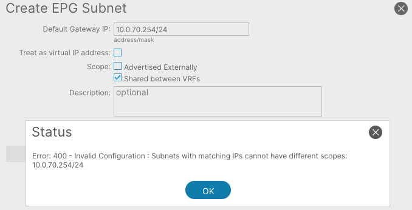

Configure the Subnet to be leaked under Provider EPG with the “Shared between VRFs” scope and “no default gateway SVI” setting selected.

Navigate to Tenant >> Application Profile >> EPG-VM >> Subnets >> Create EPG Subnet

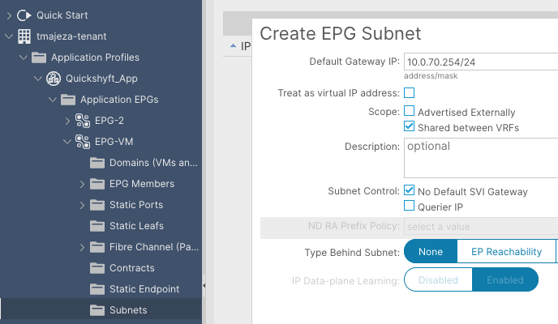

### Apply the Contract between the 2 EPGs

To apply contracts to the EPGs, navigate to an EPG >> Contracts >> Add Provided/Consumed Contract.

EPG-2 = Add Consumed Contract
EPG-VM = Add Provided Contract

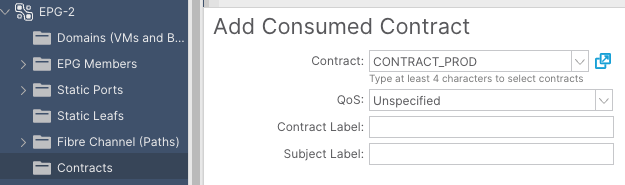

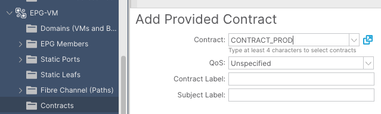

When an inter-VRF contract is applied, the Provider EPG is dynamically assigned a Global unique pcTag from the range 16 – 16384. This is due to the fact that the pcTag of the Provider EPG requires to be visible in the Consumer EPG’s VRF to enable policy enforcement in the Consumer VRF. To prevent pcTag collisions with the EPG pcTags in VRF-2, it requires a Globally unique pcTag not just one that is unique within its own VRF.

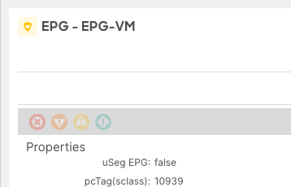

Applying the Contracts configurations result in zoning-rules programmed to the hardware in order to enforce the required policy.

Provider EPG VRF – Zoning-rule table:

```text
L102# show zoning-rule scope 2129937
+---------+--------+--------+----------+---------+---------+---------+------+-----------------+----------------------+
| Rule ID | SrcEPG | DstEPG | FilterID |   Dir   | operSt | Scope | Name |         Action     |       Priority       |
+---------+--------+--------+----------+---------+---------+---------+------+-----------------+----------------------+
|   4332 | 10939 |     14   | implicit | uni-dir | enabled | 2129937 |      | permit_override |    src_dst_any(9)    |
+---------+--------+--------+----------+---------+---------+---------+------+-----------------+----------------------+
```

An implicit zoning-rule to permit inter-VRF traffic from the Provider EPG (10939 to 14) is programmed (Rule ID 4332). This is done so that the provider-to-consumer traffic is permitted at the provider VRF without “policy applied bit” set and the policy is enforced at the consumer VRF. Class ID 14 is the system-reserved class ID for inter-VRF traffic.

Consumer EPG VRF – Zoning-rule table:

```text
L102# show zoning-rule scope 2621457
+---------+--------+--------+----------+----------------+---------+---------+------------------------------+----------+------------------------+
| Rule ID | SrcEPG | DstEPG | FilterID |      Dir       | operSt | Scope |                Name             | Action |          Priority        |
+---------+--------+--------+----------+----------------+---------+---------+------------------------------+----------+------------------------+
|    6803   | 10939   | 32771    |    5       | uni-dir-ignore | enabled | 2621457 | tmajeza-tenant:CONTRACT_PROD |                  permit      |          fully_qual(7)         |
|    7688   | 32771   | 10939    |    5       |     bi-dir     | enabled | 2621457 | tmajeza-tenant:CONTRACT_PROD |                  permit      |          fully_qual(7)         |
|    7687   | 10939   |    0     | implicit |        uni-dir     | enabled | 2621457 |                                          | deny,log | shsrc_any_any_deny(12) |
|   23746   | 10939   | 32771    |    45      | uni-dir-ignore | enabled | 2621457 | tmajeza-tenant:CONTRACT_PROD |                  permit      |          fully_qual(7)         |
|   26568   | 10939   | 32771    |    43      | uni-dir-ignore | enabled | 2621457 | tmajeza-tenant:CONTRACT_PROD |                  permit      |          fully_qual(7)         |
|    6802   | 32771   | 10939    |    44      |       bi-dir     | enabled | 2621457 | tmajeza-tenant:CONTRACT_PROD |                permit      |          fully_qual(7)         |
| 26298 | 32771 | 10939 |        42    |     bi-dir     | enabled | 2621457 | tmajeza-tenant:CONTRACT_PROD | permit |       fully_qual(7)      |
+---------+--------+--------+----------+----------------+---------+---------+------------------------------+----------+------------------------+
```

The consumer VRF has zoning rules to permit consumer-to-provider (32771-to-10939) and provider-to-consumer (10939-to-32771) traffic.

An implicit deny rule is also created in the consumer VRF to deny traffic from the provider EPG to any (10939-to-0). This is done so that the provider EPG can’t talk to any endpoints in the consumer VRF unless a contract is a configured.

ICMP and https entries can be seen from the specific filter entries obtained in the zoning-rule table.

ICMP filter entry (FilterID – 5)

```text
L102# show zoning-filter filter 5
+----------+------+--------+-------------+------+-------------+----------+-------------+-------------+-------------+-------------+-------+--------
-----+-------------+----------+
| FilterId | Name | EtherT |    ArpOpc            | Prot | ApplyToFrag | Stateful |   SFromPort       |     SToPort    |   DFromPort        |     DToPort        |   Prio |
Icmpv4T   |   Icmpv6T   | TcpRules |
+----------+------+--------+-------------+------+-------------+----------+-------------+-------------+-------------+-------------+-------+--------
-----+-------------+----------+
|    5     | 5_0 |    ip    | unspecified | icmp |     no     |    no    | unspecified | unspecified | unspecified | unspecified | sport |
unspecified | unspecified |           |
+----------+------+--------+-------------+------+-------------+----------+-------------+-------------+-------------+-------------+-------+--------
```

HTTPS filter entries (FilterID – 42 & 43)

```text
L102# show zoning-filter filter 42
+----------+------+--------+-------------+------+-------------+----------+-------------+-------------+-----------+---------+-------+-------------
+-------------+----------+
| FilterId | Name | EtherT |    ArpOpc   | Prot | ApplyToFrag | Stateful | SFromPort |     SToPort   | DFromPort | DToPort | Prio |    Icmpv4T    |
Icmpv6T   | TcpRules |
+----------+------+--------+-------------+------+-------------+----------+-------------+-------------+-----------+---------+-------+-------------
+-------------+----------+
|    42    | 42_0 |       ip    | unspecified | tcp      |      no     |    no    | unspecified | unspecified |             https       |       https   | dport | unspecified |
unspecified |              |
+----------+------+--------+-------------+------+-------------+----------+-------------+-------------+-----------+---------+-------+-------------
L102#
L102# show zoning-filter filter 43
+----------+------+--------+-------------+------+-------------+----------+-----------+---------+-------------+-------------+-------+-------------
+-------------+----------+
| FilterId | Name | EtherT |         ArpOpc       | Prot | ApplyToFrag | Stateful | SFromPort | SToPort |           DFromPort    |     DToPort          |     Prio |    Icmpv4T       |
Icmpv6T   | TcpRules |
+----------+------+--------+-------------+------+-------------+----------+-----------+---------+-------------+-------------+-------+-------------
+-------------+----------+
|    43    | 43_0 |       ip    | unspecified | tcp      |      no     |    no    |      https    |       https   | unspecified | unspecified | sport | unspecified |
unspecified |              |
+----------+------+--------+-------------+------+-------------+----------+-----------+---------+-------------+-------------+-------+-------------
```

Due to the route-leaking configuration, the routing tables of VRF-1 and VRF-2 now contain the routes/subnets from the other VRF.

Verify the Routing Tables for VRF-1 & VRF-2

```text
L102# show ip route vrf tmajeza-tenant:VRF-1
IP Route Table for VRF "tmajeza-tenant:VRF-1"
'*' denotes best ucast next-hop
'**' denotes best mcast next-hop
'[x/y]' denotes [preference/metric]
'%<string>' in via output denotes VRF <string>

10.0.70.0/24, ubest/mbest: 1/0, attached, direct, pervasive
    *via 10.0.80.66%overlay-1, [1/0], 00:30:39, static, tag 4294967294, rwVnid: vxlan-2129937
10.0.70.254/32, ubest/mbest: 1/0, attached, pervasive
    *via 10.0.70.254, vlan164, [0/0], -03w03d, local, local
192.168.10.0/24, ubest/mbest: 1/0, attached, direct, pervasive
    *via 10.0.80.66%overlay-1, [1/0], 00:30:39, static, tag 4294967294, rwVnid: vxlan-2621457
KACI-MS-S1-93180EX-L102#
L102# show ip route vrf tmajeza-tenant:VRF-2
IP Route Table for VRF "tmajeza-tenant:VRF-2"
'*' denotes best ucast next-hop
'**' denotes best mcast next-hop
'[x/y]' denotes [preference/metric]
'%<string>' in via output denotes VRF <string>

10.0.70.0/24, ubest/mbest: 1/0, attached, direct, pervasive
    *via 10.0.80.66%overlay-1, [1/0], 00:30:34, static, tag 4294967294, rwVnid: vxlan-2129937
192.168.10.0/24, ubest/mbest: 1/0, attached, direct, pervasive
    *via 10.0.80.66%overlay-1, [1/0], 01:30:07, static, tag 4294967294
192.168.10.254/32, ubest/mbest: 1/0, attached, pervasive
    *via 192.168.10.254, vlan602, [0/0], 01:30:07, local, local
```

ICMP:

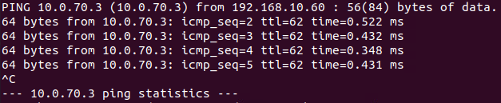

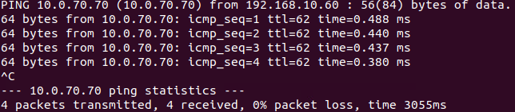

HTTPS:

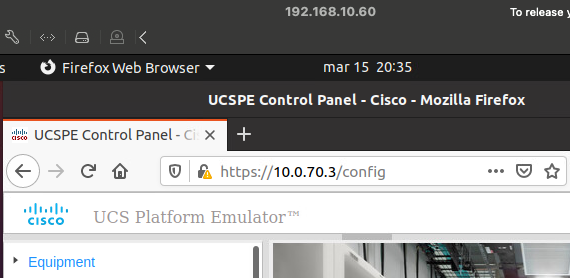

This lab successfully demonstrated the fundamental configurations needed to setup ACI inter-VRF routing between endpoints that reside in different VRFs but within the same tenant.

## References

- [https://www.cisco.com/c/en/us/td/docs/dcn/whitepapers/cisco-application-centric-infrastructure-design-guide.html#InterTenantandInterVRFCommunication](https://www.cisco.com/c/en/us/td/docs/dcn/whitepapers/cisco-application-centric-infrastructure-design-guide.html#InterTenantandInterVRFCommunication)
- [https://www.cisco.com/c/en/us/solutions/collateral/data-center-virtualization/application-centric-infrastructure/white-paper-c11-743951.html#InterVRFandintertenantcontracts](https://www.cisco.com/c/en/us/solutions/collateral/data-center-virtualization/application-centric-infrastructure/white-paper-c11-743951.html#InterVRFandintertenantcontracts)
