# Cisco ACI L3OUT (BGP & OSPF) Configuration

!!! note
    This lab was conducted in a controlled environment. Any configurations in a production network should be implemented during a designated maintenance window. Additionally, always refer to official Cisco documentation relevant to your specific hardware and software.

## ACI L3OUT Overview

Cisco ACI Layer 3 Outside (L3Out) defines the configuration required to establish routing adjacency between the ACI fabric and an external routing domain. It enables hosts within the ACI fabric to communicate with external networks through a Layer 3 connection, allowing dynamic or static route exchange with external routers.

This document provides a step-by-step configuration guide to establish Layer 3 routing adjacencies between Cisco ACI and an external router. The lab is structured into two use cases:

- Use Case 1: Routing peering using BGP
- Use Case 2: Routing peering using OSPF

## BGP Use Case — Key Highlights

The BGP section goes in-depth and covers the following:

1. BGP Peering between Cisco ACI and an external router
2. External Route Redistribution: How external routes learned on border leaf nodes are propagated across the fabric
3. Internal Route Advertisement: How an internal subnet is redistributed into BGP and advertised to the external router
4. Inter-Domain Communication: How to enable end-to-end communication between an internal ACI endpoint and an external prefix

## Lab Setup

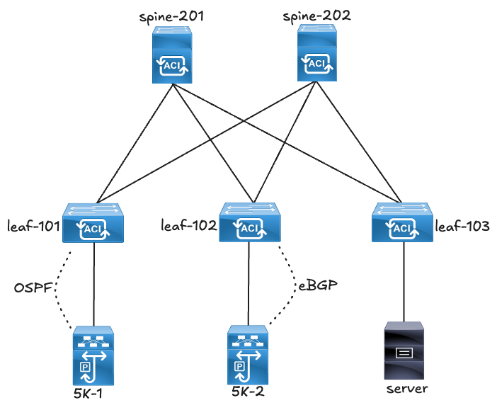

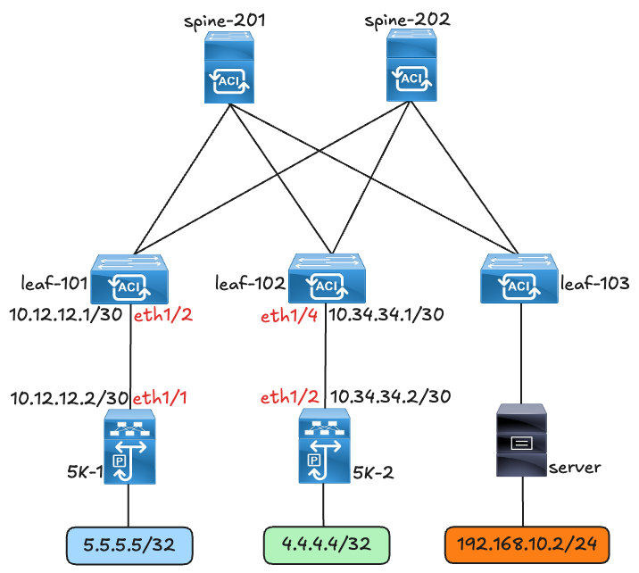

## Pre-requisites

Ensure that the access policies objects are all configured and associated accordingly.

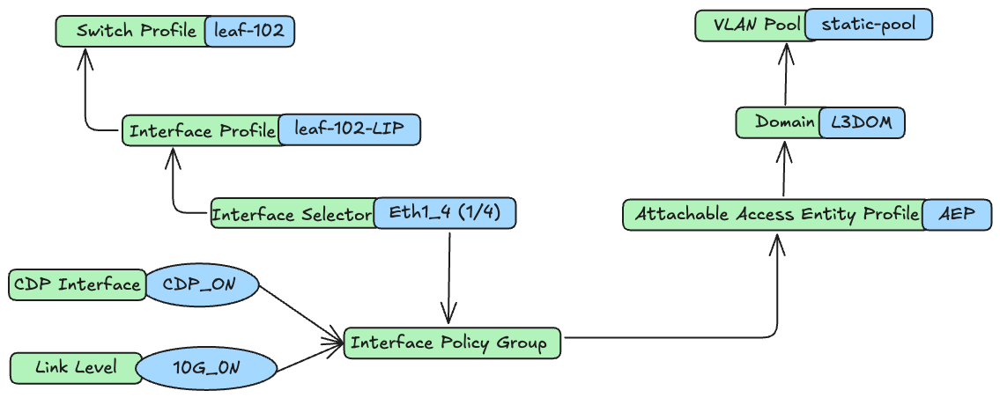

To configure the L3 Domain Navigate to Fabric >> Access Policies >> expand Physical and External Domains >> Right click on L3 Domains and Create L3 Domain.

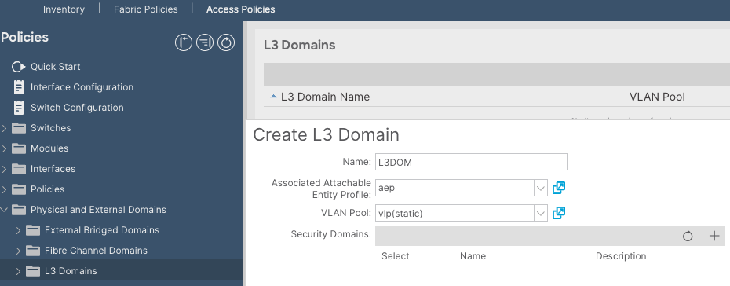

To configure the BGP Route Reflector Policy navigate to System >> System Settings >> click on BGP Route Reflector, define the Autonomous System Number for the fabric and choose the Spine nodes as the router reflectors.

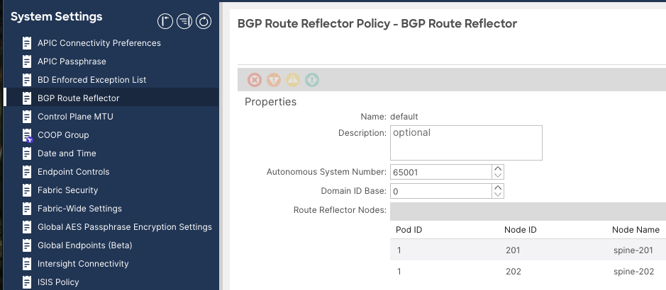

Create a Pod Policy Group.
Navigate to Fabric > Fabric Policies > Pods, right-click Policy Groups to Create Pod Policy Group and associate it with the BGP Route Reflector Policy.

Navigate to Fabric > Fabric Policies > Pods > Profiles > Right Click, Create Pod Profile and associate it with the created Pod Policy Group.

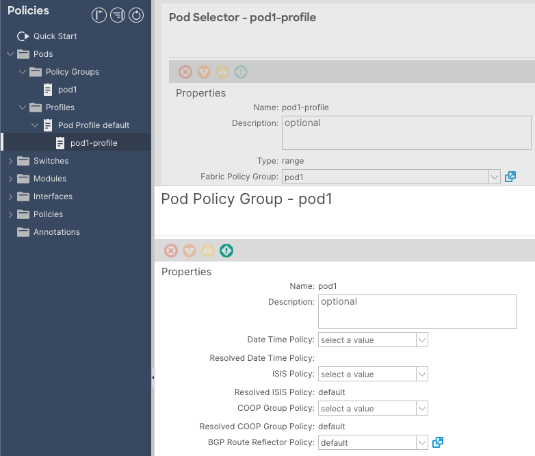

## BGP L3OUT

Objects to create a BGP L3OUT.

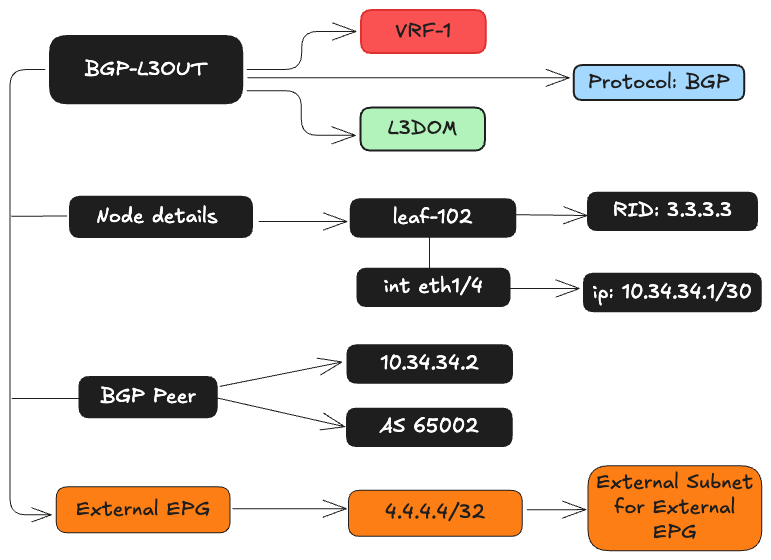

Navigate to the user defined tenant >> expand Networking >> L3Outs:
Create the L3OUT instance; associate it with a VRF, L3 Domain and choose the routing protocol for the deployment. In this case BGP is the routing protocol of choice.

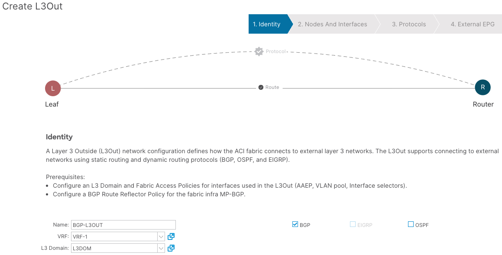

For this peering and Layer 3 interface (Eth1/4) on leaf node 102 is selected. The interface is assigned an IP address (10.34.34.1/30) which will be used for the BGP peering. The leaf node is assigned a loopback IP address of 3.3.3.3 which will be used as the Router-ID for the routing protocol.

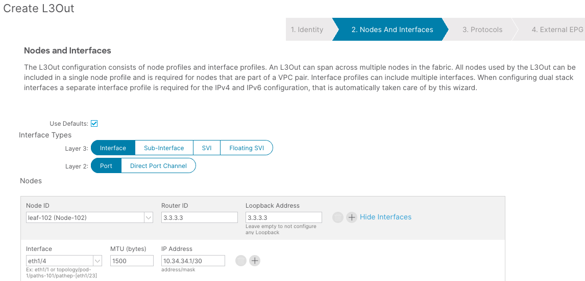

Under the protocol Associations, the peer address (10.34.34.2) which is the IP address configured on the external router is defined along with the remote-as (65002). This is required so that BGP peering can be formulated between ACI and the external router.

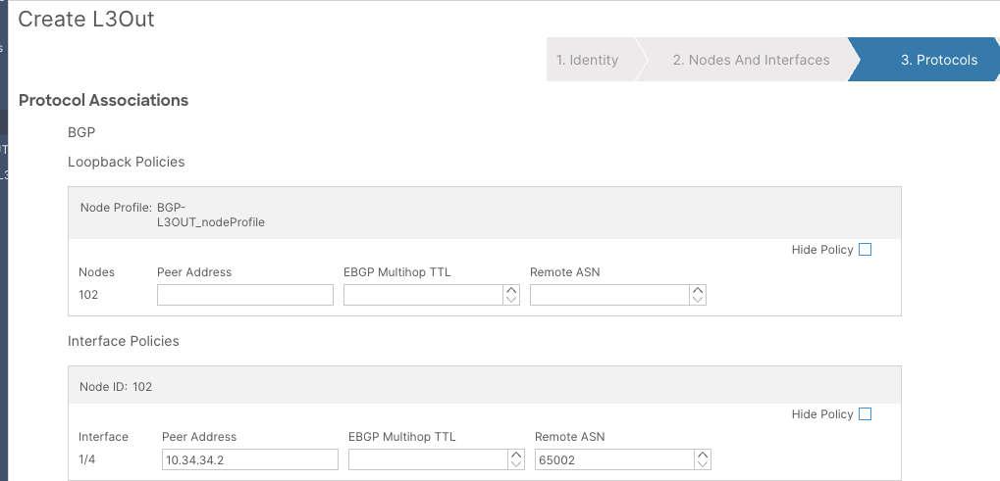

Create the external EPG and define the external subnets that will be classified in this EPG.

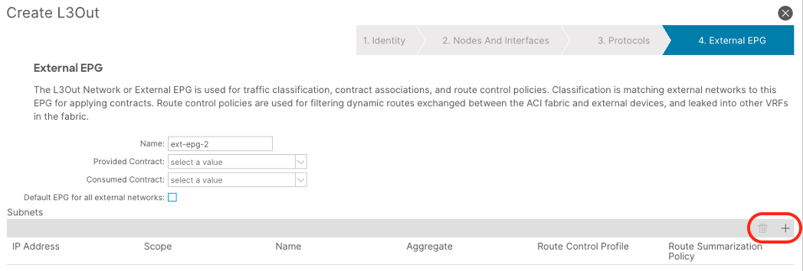

!!! note
    The “Default EPG for all external networks” is ticked by default. Leaving this option leads to an initial configuration that will classify all traffic (0.0.0.0/0) into the EPG.

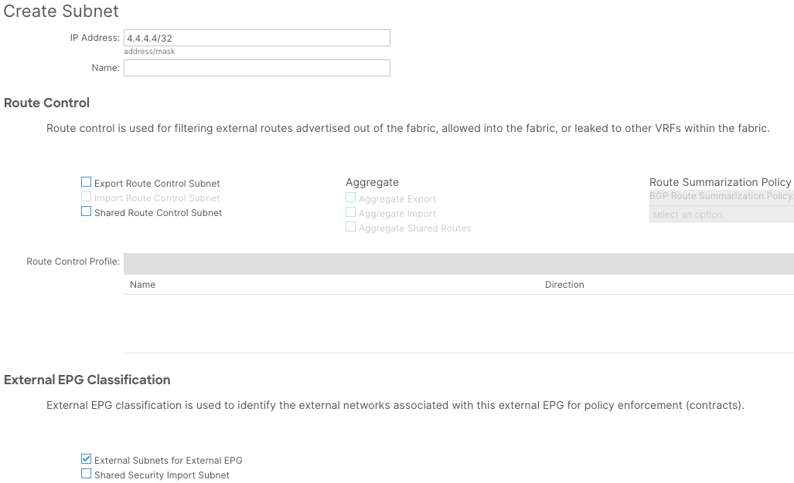

When a prefix is configured under the scope “External Subnets for the External EPG”, ACI associates that prefix/route with the pcTag (“Class”) of the External EPG. This is critical for policy enforcement that will be required between the external EPG and any other EPG.

As observed on the output below, 4.4.4.4/32 is associated to the external-EPG Class-ID/pcTag (32771).

```text
leaf-102# vsh -c "show system internal policy-mgr prefix"
Requested prefix data

Vrf-Vni VRF-Id Table-Id Table-State VRF-Name                   Addr                                Class Shared Remote Complete Svc_ena
======= ====== =========== ======= ============================ ================================= ====== ====== ====== ==== ==== ========
2818048 9      0x9           Up    tenant-1:VRF-1                                      0.0.0.0/0   15      False False False       False
2818048 9      0x80000009    Up    tenant-1:VRF-1                                           ::/0   15      False False False       False
2818048 9      0x9           Up    tenant-1:VRF-1                                      4.4.4.4/32 32771    False False False       False
```

PcTag of the External EPG:

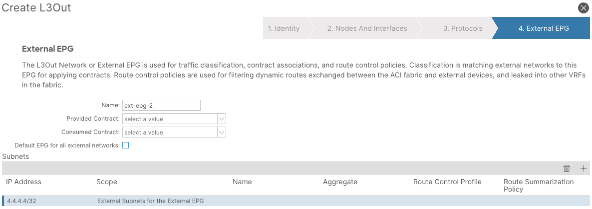

The required configurations on ACI are completed. The configurations on the external router are shown below.

```text
5K-2# show run int e1/2

interface Ethernet1/2
  no switchport
  ip address 10.34.34.2/30

5K-2# show run bgp
feature bgp

router bgp 65002
  address-family ipv4 unicast
  neighbor 10.34.34.1 remote-as 65001
    address-family ipv4 unicast
```

I hit a glitch. Despite all my configurations looking correct as l expected, the BGP between ACI and the external router was not getting to an “Established” state.


ACI leaf verification:

```text
leaf-102# show bgp process vrf tenant-1:VRF-1
Note: process currently not running
```

External router verification: The BGP State was “Active”.

```text
5K-2# show ip bgp summary
BGP summary information for VRF default, address family IPv4 Unicast
BGP router identifier 4.4.4.4, local AS number 65002
BGP table version is 2, IPv4 Unicast config peers 1, capable peers 0
0 network entries and 0 paths using 0 bytes of memory
BGP attribute entries [0/0], BGP AS path entries [0/0]
BGP community entries [0/0], BGP clusterlist entries [0/0]

Neighbor          V    AS MsgRcvd MsgSent       TblVer   InQ OutQ Up/Down State/PfxRcd
10.34.34.1        4 65001       0       0            0     0    0 00:54:59 Active
```

The output from the ACI leaf node gave a clear indication that the BGP process was not running on the ACI fabric. The issue was that the custom Pod profile was not correctly associated with the Pod Policy Group which contains the BGP Route Reflector Policy required to instantiate MP-BGP on the fabric.


!!! note
    Ensure that the Pod profile is associate with the pod-policy group that is associated with the BGP Route Reflector Policy

After the configuration fix:
The border and non-border leaf have a BGP session with the route reflector spines

```text
leaf-102# show bgp sessions vrf overlay-1 (border leaf)
Total peers 3, established peers 2
ASN 65001
VRF overlay-1, local ASN 65001
peers 2, established peers 2, local router-id 10.1.136.67
State: I-Idle, A-Active, O-Open, E-Established, C-Closing, S-Shutdown

Neighbor          ASN    Flaps LastUpDn|LastRead|LastWrit St Port(L/R)          Notif(S/R)
10.1.136.65        65001 0     14:40:26|never   |never    E 49276/179           0/0
10.1.136.66        65001 0     14:40:25|never   |never    E 52205/179           0/0

leaf-101# show bgp sessions vrf overlay-1 (non-border leaf)
Total peers 2, established peers 2
ASN 65001
VRF overlay-1, local ASN 65001
peers 2, established peers 2, local router-id 10.1.136.64
State: I-Idle, A-Active, O-Open, E-Established, C-Closing, S-Shutdown

Neighbor          ASN    Flaps LastUpDn|LastRead|LastWrit St Port(L/R)          Notif(S/R)
10.1.136.65        65001 0     14:41:47|never   |never    E 37893/179           0/0
10.1.136.66        65001 0     14:41:46|never   |never    E 41330/179           0/0
```

The BGP session was established between ACI and the external router.

```text
5K-2# show ip bgp summary
BGP summary information for VRF default, address family IPv4 Unicast
BGP router identifier 4.4.4.4, local AS number 65002
BGP table version is 3, IPv4 Unicast config peers 1, capable peers 1
0 network entries and 0 paths using 0 bytes of memory
BGP attribute entries [0/0], BGP AS path entries [0/0]
BGP community entries [0/0], BGP clusterlist entries [0/0]

Neighbor           V    AS MsgRcvd MsgSent        TblVer   InQ OutQ Up/Down State/PfxRcd
10.34.34.1         4 65001       8       8             3     0    0 00:03:33 0


N5K-2# show bgp session
Total peers 1, established peers 1
ASN 65002
VRF default, local ASN 65002
peers 1, established peers 1, local router-id 4.4.4.4
State: I-Idle, A-Active, O-Open, E-Established, C-Closing, S-Shutdown

Neighbor           ASN     Flaps LastUpDn|LastRead|LastWrit St Port(L/R) Notif(S/R)
10.34.34.1         65001   0     00:02:12|00:00:11|00:00:11 E   22509/179       0/0


leaf-102# show bgp ipv4 uni summa vrf tenant-1:VRF-1
BGP summary information for VRF tenant-1:VRF-1, address family IPv4 Unicast
BGP router identifier 3.3.3.3, local AS number 65001
BGP table version is 10, IPv4 Unicast config peers 1, capable peers 1
5 network entries and 5 paths using 704 bytes of memory
BGP attribute entries [5/880], BGP AS path entries [0/0]
BGP community entries [0/0], BGP clusterlist entries [2/8]

Neighbor           V    AS MsgRcvd MsgSent        TblVer   InQ OutQ Up/Down State/PfxRcd
10.34.34.2         4 65002      40      40            10     0    0 00:35:07 0
```

Currently no prefixes are being exchanged between ACI and the external router, as denoted by the “0” value under State/PfxRcd.

The examination of the routing table on the Border leaf node (leaf-102) indicates that there are no prefixes being received from eBGP.

```text
leaf-102# show ip route vrf tenant-1:VRF-1
IP Route Table for VRF "tenant-1:VRF-1"

1.1.1.1/32, ubest/mbest: 1/0
    *via 10.0.32.64%overlay-1, [1/0], 13:03:27, bgp-65001, internal, tag 65001
3.3.3.3/32, ubest/mbest: 2/0, attached, direct
    *via 3.3.3.3, lo6, [0/0], 13:03:28, local, local
    *via 3.3.3.3, lo6, [0/0], 13:03:28, direct
10.12.12.0/30, ubest/mbest: 1/0
    *via 10.0.32.64%overlay-1, [200/0], 11:17:57, bgp-65001, internal, tag 65001
10.34.34.0/30, ubest/mbest: 1/0, attached, direct
    *via 10.34.34.1, eth1/4, [0/0], 00:07:17, direct
10.34.34.1/32, ubest/mbest: 1/0, attached
    *via 10.34.34.1, eth1/4, [0/0], 00:07:17, local, local
```

There is no 4.4.4.4/32 from the external BGP neighbor

Configure the external router to advertise a prefix (4.4.4.4) to the border leaf on ACI.

```text
5K-2# show ip interface brief
IP Interface Status for VRF "default"(1)
Interface            IP Address      Interface Status
Lo0                  4.4.4.4         protocol-up/link-up/admin-up
Eth1/2               10.34.34.2      protocol-up/link-up/admin-up

5K-2# show run bgp

feature bgp

router bgp 65002
  address-family ipv4 unicast
    network 4.4.4.4/32
  neighbor 10.34.34.1 remote-as 65001
    address-family ipv4 unicast
```

On the ACI leaf, the PfxRcd value changes to 1, indicating that a prefix is being received from the external router.

```text
leaf-102# show bgp ipv4 uni summary vrf tenant-1:VRF-1
BGP summary information for VRF tenant-1:VRF-1, address family IPv4 Unicast
BGP router identifier 3.3.3.3, local AS number 65001
BGP table version is 27, IPv4 Unicast config peers 1, capable peers 1
5 network entries and 5 paths using 816 bytes of memory
BGP attribute entries [5/880], BGP AS path entries [0/0]
BGP community entries [0/0], BGP clusterlist entries [2/8]

Neighbor        V    AS MsgRcvd MsgSent       TblVer    InQ OutQ Up/Down State/PfxRcd
10.34.34.2      4    65002 70       66           27      0    0. 00:00:31 1
```

Verify the routing table on the Border leaf. An external route (4.4.4.4/32) now exists in the Border leaf routing table.

```text
leaf-102# show ip route vrf tenant-1:VRF-1
IP Route Table for VRF "tenant-1:VRF-1"
'*' denotes best ucast next-hop
'**' denotes best mcast next-hop
'[x/y]' denotes [preference/metric]
'%<string>' in via output denotes VRF <string>

1.1.1.1/32, ubest/mbest: 1/0
    *via 10.0.32.64%overlay-1, [1/0], 13:04:44, bgp-65001, internal, tag 65001
3.3.3.3/32, ubest/mbest: 2/0, attached, direct
    *via 3.3.3.3, lo6, [0/0], 13:04:45, local, local
    *via 3.3.3.3, lo6, [0/0], 13:04:45, direct
4.4.4.4/32, ubest/mbest: 1/0
    *via 10.34.34.2%tenant-1:VRF-1, [20/0], 00:00:05, bgp-65001, external, tag 65002
10.12.12.0/30, ubest/mbest: 1/0
    *via 10.0.32.64%overlay-1, [200/0], 11:19:14, bgp-65001, internal, tag 65001
10.34.34.0/30, ubest/mbest: 1/0, attached, direct
    *via 10.34.34.1, eth1/4, [0/0], 00:08:34, direct
10.34.34.1/32, ubest/mbest: 1/0, attached
    *via 10.34.34.1, eth1/4, [0/0], 00:08:34, local, local
```

Verify routes in the BGP table on the Border leaf.

```text
leaf-102# show bgp ipv4 unicast vrf tenant-1:VRF-1
BGP routing table information for VRF tenant-1:VRF-1, address family IPv4 Unicast
BGP table version is 27, local router ID is 3.3.3.3
Status: s-suppressed, x-deleted, S-stale, d-dampened, h-history, *-valid, >-best
Path type: i-internal, e-external, c-confed, l-local, a-aggregate, r-redist, I-injected
Origin codes: i - IGP, e - EGP, ? - incomplete, | - multipath, & - backup

   Network                Next Hop               Metric          LocPrf   Weight Path
*>i1.1.1.1/32             10.0.32.64                  0             100        0 ?
*>r3.3.3.3/32             0.0.0.0                     0             100    32768 ?
*>e4.4.4.4/32             10.34.34.2                                           0 65002 i
*>i10.12.12.0/30          10.0.32.64                   0           100         0 ?
*>r10.34.34.0/30          0.0.0.0                      0           100     32768 ?
```

Verify that ACI injects this route in the VPNv4 address family

```text
leaf-102# show bgp vpnv4 unicast vrf tenant-1:VRF-1
BGP routing table information for VRF overlay-1, address family VPNv4 Unicast
BGP table version is 37, local router ID is 10.0.96.66
Status: s-suppressed, x-deleted, S-stale, d-dampened, h-history, *-valid, >-best
Path type: i-internal, e-external, c-confed, l-local, a-aggregate, r-redist, I-injected
Origin codes: i - IGP, e - EGP, ? - incomplete, | - multipath, & - backup

   Network            Next Hop                  Metric     LocPrf         Weight Path
Route Distinguisher: 102:2818048          (VRF tenant-1:VRF-1)
*>i1.1.1.1/32         10.0.32.64                     0        100              0 ?
*>r3.3.3.3/32         0.0.0.0                        0        100          32768 ?
*>e4.4.4.4/32         10.34.34.2                                               0 65002 i
*>i10.12.12.0/30      10.0.32.64                       0           100         0 ?
*>r10.34.34.0/30      0.0.0.0                          0           100     32768 ?
```

Within the Cisco ACI fabric, MP-BGP is implemented between leaf and spine switches to propagate external routes within the ACI fabric. External networks are automatically redistributed to MP-BGP on border leaf switches.

When ACI receives an external route, it injects it in the VPNv4 address family so that the external route can be propagated in the ACI fabric. The route is advertised to the spine which are the BGP route reflectors and the spines will propagate the external route to all leafs in the fabric such that they are aware of this route.

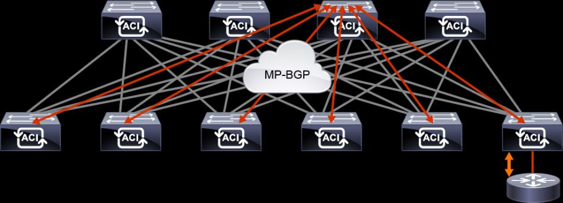

The output below shows that the external prefix 4.4.4.4 is advertised by the Border leaf to the spines.

```text
leaf-102# show bgp vpnv4 uni 4.4.4.4 vrf tenant-1:VRF-1 (Enter vsh mode to use command)
BGP routing table information for VRF overlay-1, address family VPNv4 Unicast
Route Distinguisher: 102:2818048    (VRF tenant-1:VRF-1)
BGP routing table entry for 4.4.4.4/32, version 27 dest ptr 0xa0ed8900
Paths: (1 available, best #1)
Flags: (0x80c001a 00000000) on xmit-list, is in urib, is best urib route, is in HW, exported
  vpn: version 37, (0x100002) on xmit-list
Multipath: eBGP iBGP
  Advertised path-id 1, VPN AF advertised path-id 1
  Path type (0xa94dd49c): external 0x28 0x0 ref 0 adv path ref 2, path is valid, is best
path
  AS-Path: 65002 , path sourced external to AS
    10.34.34.2 (metric 0) from 10.34.34.2 (4.4.4.4) – external neighbor
      Origin IGP, MED not set, localpref 100, weight 0 tag 0, propagate 0
      Extcommunity:
          RT:65001:2818048
          VNID:2818048

   VRF advertise information:
   Path-id 1 not advertised to any peer

   VPN AF advertise information:
   Path-id 1 advertised to peers:
     10.0.32.65         10.0.96.65
```

This output verifies that indeed (10.0.32.65 & 10.0.96.65) are the spines.

```text
apic33# acidiag fnvread
 ID   Pod ID            Name              Serial Number       IP Address         Role
 201    1            spine-201            xxxxxxxx            10.0.96.65/32      spine
 202    1            spine-202            xxxxxxxx            10.0.32.65/32      spine
```

The border leaf has a MP-BGP peering with the spines

```text
leaf-102# show bgp vpnv4 unicast summary vrf overlay-1
BGP summary information for VRF overlay-1, address family VPNv4 Unicast
BGP router identifier 10.0.96.66, local AS number 65001
BGP table version is 37, VPNv4 Unicast config peers 2, capable peers 2
7 network entries and 9 paths using 1456 bytes of memory
BGP attribute entries [4/704], BGP AS path entries [0/0]
BGP community entries [0/0], BGP clusterlist entries [2/8]

Neighbor           V    AS MsgRcvd MsgSent       TblVer   InQ OutQ Up/Down State/PfxRcd
10.0.32.65         4 65001     125     125           37     0    0 01:50:31 2
10.0.96.65         4 65001     125     127           37     0    0 01:50:31 2
```

Verify that a non-border leaf (compute leaf) received the external route from the Spines. This output shows that this non-border leaf received the external route from the spine, however it will not advertise this information to any other node.

```text
leaf-101# show bgp vpnv4 unicast 4.4.4.4/32 vrf tenant-1:VRF-1
BGP routing table information for VRF overlay-1, address family VPNv4 Unicast
Route Distinguisher: 101:2818048    (VRF tenant-1:VRF-1)
BGP routing table entry for 4.4.4.4/32, version 23 dest ptr 0xa0ef4658
Paths: (1 available, best #1)
Flags: (0x08001a 00000000) on xmit-list, is in urib, is best urib route, is in HW
  vpn: version 41, (0x100002) on xmit-list
Multipath: eBGP iBGP

  Advertised path-id 1, VPN AF advertised path-id 1
  Path type (0xa0e35be0): internal 0xc0000018 0x40 ref 0 adv path ref 2, path is valid, is
best path
             Imported from (0xa0e90a6c) 102:2818048:4.4.4.4/32
  AS-Path: 65002 , path sourced external to AS
    10.0.96.66 (metric 3) from 10.0.32.65 (10.0.32.65)
      Origin IGP, MED not set, localpref 100, weight 0 tag 0, propagate 0
      Received label 0
      Received path-id 1
      Extcommunity:
           RT:65001:2818048
            VNID:2818048
        Originator: 10.0.96.66 Cluster list: 10.0.32.65

   VRF advertise information:
   Path-id 1 not advertised to any peer

   VPN AF advertise information:
   Path-id 1 not advertised to any peer
```

!!! note
    The external route will only be propagated to a non-border leaf with the VRF deployed on it, else the message below shows:

```text
leaf-xxx# show bgp vpnv4 unicast 4.4.4.4/32 vrf tenant-1:VRF-1
Unknown vrf tenant-1:VRF-1
```

The compute-leaf installs this external route in its routing table and the next hop of this route is the TEP IP address of the border leaf

```text
leaf-101# show ip route 4.4.4.4 vrf tenant-1:VRF-1
IP Route Table for VRF "tenant-1:VRF-1"
'*' denotes best ucast next-hop
'**' denotes best mcast next-hop
'[x/y]' denotes [preference/metric]
'%<string>' in via output denotes VRF <string>

4.4.4.4/32, ubest/mbest: 1/0
    *via 10.0.96.66%overlay-1, [200/0], 01:22:07, bgp-65001, internal, tag 65002
         recursive next hop: 10.0.96.66/32%overlay-1
```

TEP of border leaf (leaf-102)

```text
apic33# acidiag fnvread
      ID   Pod ID                     Name     Serial Number          IP Address      Role         State
     102        1                 leaf-102       xxxxxxxxxxx        10.0.96.66/32      leaf       active
```

Currently, the server connected in the ACI fabric cannot communicate with the external IP.

```text
server-1# ping 4.4.4.4
PING 4.4.4.4 (4.4.4.4): 56 data bytes
Request 0 timed out
Request 1 timed out
Request 2 timed out
Request 3 timed out
Request 4 timed out

--- 4.4.4.4 ping statistics ---
5 packets transmitted, 0 packets received, 100.00% packet loss
```

The external router does not have information regarding the internal subnet (192.168.10.0/24)

```text
5K-2# show ip route 192.168.10.0
IP Route Table for VRF "default"

Route not found
5K-2#
```

!!! note
    The bridge domain subnet will only exist on the leaf where it is configured by ACI. In this case the subnet is present on leaf-103 routing table where the server is connected to.

```text
leaf-103# show ip route 192.168.10.0 vrf tenant-1:VRF-1
IP Route Table for VRF "tenant-1:VRF-1"
'*' denotes best ucast next-hop
'**' denotes best mcast next-hop
'[x/y]' denotes [preference/metric]
'%<string>' in via output denotes VRF <string>

192.168.10.0/24, ubest/mbest: 1/0, attached, direct, pervasive
    *via 10.1.184.65%overlay-1, [1/0], 00:10:40, static, tag 4294967294
         recursive next hop: 10.1.184.65/32%overlay-1
```

The subnet currently does not exist on the border leaf.

```text
Leaf-102# show ip route 192.168.10.0 vrf tenant-1:VRF-1
IP Route Table for VRF "tenant-1:VRF-1"
'*' denotes best ucast next-hop
'**' denotes best mcast next-hop
'[x/y]' denotes [preference/metric]
'%<string>' in via output denotes VRF <string>

Route not found
```

Let’s understand why this is the case.

First point is to get the internal subnet (192.168.10.0/24) to be visible on the border- leaf routing table, so that it can eventually be advertised to the external BGP peer.

Let’s first look at the zoning-rule table where the internal host is connected to, before a contract is applied. It is observed that there is no entry allowing any communication between the 2 EPGs (external-EPG and internal EPG).

```text
leaf-103# show zoning-rule scope 2818048
+---------+--------+--------+----------+---------+---------+---------+------+----------+----------------------+
| Rule ID | SrcEPG | DstEPG | FilterID |   Dir   | operSt | Scope | Name | Action |            Priority       |
+---------+--------+--------+----------+---------+---------+---------+------+----------+----------------------+
|   4102 |    0    |   0    | implarp | uni-dir | enabled | 2818048|       | permit | any_any_filter(17) |
|   4101 |    0    |   0    | implicit | uni-dir | enabled | 2818048|      | deny,log |   any_any_any(21)    |
|   4103 |    0    |   15   | implicit | uni-dir | enabled | 2818048|      | deny,log | any_vrf_any_deny(22) |
|   4104 |    0    | 32772 | implicit | uni-dir | enabled | 2818048|       | permit |      src_dst_any(9)    |
+---------+--------+--------+----------+---------+---------+---------+------+----------+----------------------+
```

A contract is applied between the external EPG and internal EPG.


```text
show zoning-rule scope 2818048
+---------+--------+--------+----------+----------------+---------+---------+---------------------+----------+----------------------+
| Rule ID | SrcEPG | DstEPG | FilterID |      Dir       | operSt | Scope |            Name        | Action |         Priority        |
+---------+--------+--------+----------+----------------+---------+---------+---------------------+----------+----------------------+
|   4102 |    0    |   0    | implarp |     uni-dir     | enabled | 2818048|                     | permit | any_any_filter(17) |
|   4101 |    0    |   0    | implicit |    uni-dir     | enabled | 2818048|                     | deny,log |   any_any_any(21)    |
|   4103 |    0    |   15   | implicit |    uni-dir     | enabled | 2818048|                     | deny,log | any_vrf_any_deny(22) |
|   4104 |    0    | 32772 | implicit |     uni-dir     | enabled | 2818048|                     | permit |      src_dst_any(9)    |
|   4105 | 32771 | 49154 |       2     | uni-dir-ignore | enabled | 2818048| tenant-1:PERMIT-ANY | permit |      fully_qual(7)     |
|   4106 | 49154 | 32771 |       2     |     bi-dir     | enabled | 2818048| tenant-1:PERMIT-ANY | permit |      fully_qual(7)     |
+---------+--------+--------+----------+----------------+---------+---------+---------------------+----------+----------------------+
```

The zoning-rule table now contain entries permitting traffic between the 2 EPGs. The pcTags in the zoning-rule table match the pcTags observed for each respective EPG on the ACI GUI.

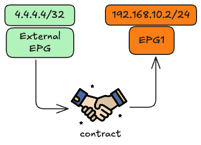

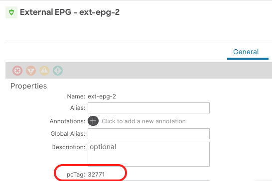

The result of applying this contract is the programming of the internal subnet on the border leaf as shown below.

```text
Leaf-102# show ip route 192.168.10.0 vrf tenant-1:VRF-1
IP Route Table for VRF "tenant-1:VRF-1"
'*' denotes best ucast next-hop
'**' denotes best mcast next-hop
'[x/y]' denotes [preference/metric]
'%<string>' in via output denotes VRF <string>

192.168.10.0/24, ubest/mbest: 1/0, attached, direct, pervasive
    *via 10.1.184.65%overlay-1, [1/0], 00:03:38, static, tag 4294967294
```

Let’s check is this subnet is being advertised to the external router by ACI.

```text
leaf-102# show bgp ipv4 unicast neighbor 10.34.34.2 advertised-routes vrf tenant-1:VRF-1

Peer 10.34.34.2 routes for address family IPv4 Unicast:
BGP table version is 18, local router ID is 3.3.3.3
Status: s-suppressed, x-deleted, S-stale, d-dampened, h-history, *-valid, >-best
Path type: i-internal, e-external, c-confed, l-local, a-aggregate, r-redist, I-injected
Origin codes: i - IGP, e - EGP, ? - incomplete, | - multipath, & - backup

    Network                Next Hop              Metric       LocPrf       Weight Path
```

The output reflects that the subnet is not being advertised to the external router. Let’s continue to investigate further.

Verify if this subnet is in the BGP table.
The BD subnet is not present in the Border leaf BGP table, so it can’t even be advertised.

```text
leaf-102# show bgp vpnv4 unicast vrf tenant-1:VRF-1
BGP routing table information for VRF overlay-1, address family VPNv4 Unicast
BGP table version is 69, local router ID is 10.0.96.66
Status: s-suppressed, x-deleted, S-stale, d-dampened, h-history, *-valid, >-best
Path type: i-internal, e-external, c-confed, l-local, a-aggregate, r-redist, I-injected
Origin codes: i - IGP, e - EGP, ? - incomplete, | - multipath, & - backup

   Network            Next Hop                  Metric     LocPrf          Weight Path
Route Distinguisher: 102:2818048          (VRF tenant-1:VRF-1)
*>i1.1.1.1/32         10.0.32.64                     0        100               0 ?
*>r3.3.3.3/32         0.0.0.0                        0        100           32768 ?
*>e4.4.4.4/32         10.34.34.2                                                0 65002 i
*>r10.34.34.0/30      0.0.0.0                          0         100        32768 ?

show bgp ipv4 unicast vrf tenant-1:VRF-1
BGP routing table information for VRF tenant-1:VRF-1, address family IPv4 Unicast
BGP table version is 18, local router ID is 3.3.3.3
Status: s-suppressed, x-deleted, S-stale, d-dampened, h-history, *-valid, >-best
Path type: i-internal, e-external, c-confed, l-local, a-aggregate, r-redist, I-injected
Origin codes: i - IGP, e - EGP, ? - incomplete, | - multipath, & - backup

   Network                 Next Hop              Metric       LocPrf       Weight Path
*>i1.1.1.1/32              10.1.136.64                0          100            0 ?
*>r3.3.3.3/32              0.0.0.0                    0          100        32768 ?
*>e4.4.4.4/32              10.34.34.2                                           0 65002 i
*>i10.12.12.0/30           10.1.136.64                 0         100            0 ?
*>r10.34.34.0/30           0.0.0.0                     0         100        32768 ?
```

!!! note
    The 192.168.10.0/24 subnet is not present in the BGP table

Q: Why is this the case?

The subnet on ACI is by default associated with a private tag (4294967294)

```text
Leaf-102# show ip route 192.168.10.0 vrf tenant-1:VRF-1
IP Route Table for VRF "tenant-1:VRF-1"
'*' denotes best ucast next-hop
'**' denotes best mcast next-hop
'[x/y]' denotes [preference/metric]
'%<string>' in via output denotes VRF <string>

192.168.10.0/24, ubest/mbest: 1/0, attached, direct, pervasive
    *via 10.1.184.65%overlay-1, [1/0], 00:03:38, static, tag 4294967294
```

In Cisco ACI, a bridge domain subnet is a “static” route, and a static route is not by default redistributed in the MP-BGP space. ACI uses a route-map to distribute a static route into BGP.

Issue the “show bgp process” command to see the route-map that ACI uses to redistribute static routes. The route-map that ACI uses is imp-ctx-bgp-st-interleak-2818048

```text
leaf-102#    show bgp process vrf tenant-1:VRF-1

   Information for address family IPv4 Unicast in VRF tenant-1:VRF-1

 Redistribution
        direct, route-map imp-ctx-bgp-direct-interleak-2818048
        static, route-map imp-ctx-bgp-st-interleak-2818048
        coop, route-map exp-ctx-coop-bgp-2818048
```

Let’s see how this route-map is configured:

```text
leaf-102# show route-map imp-ctx-bgp-st-interleak-2818048
route-map imp-ctx-bgp-st-interleak-2818048, deny, sequence 1
  Match clauses:
    tag: 4294967294
  Set clauses:
route-map imp-ctx-bgp-st-interleak-2818048, permit, sequence 20000
  Match clauses:
  Set clauses:
```

It is evident that sequence 1 of the route-map denies all routes with the tag “4294967294”<- (private tag that is assigned to the internal Bridge Domain subnet) and sequence 20000 permits the rest of the routes into the BGP VPNv4 space. So, if the Bridge domain subnet has the private tag associated with it, it will not be redistributed due to the deny policy on the redistribution route-map.

Q: how does this private tag removed from the subnet so that the route can be matched into sequence 2000 with a permit policy?

This tag on the BD-subnet is removed by changing the scope of the subnet to “Advertised Externally”. Under the tenant navigate to Networking >> expand Bridge Domains >> under the specific Bridge Domain, expand the Subnets >> click on the Subnet and tick the Scope box for the Advertised Externally option.

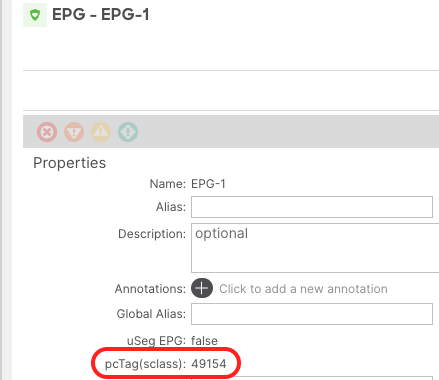

The tag is removed from the subnet as shown below:

```text
Leaf-102# show ip route 192.168.10.0 vrf tenant-1:VRF-1
IP Route Table for VRF "tenant-1:VRF-1"
'*' denotes best ucast next-hop
'**' denotes best mcast next-hop
'[x/y]' denotes [preference/metric]
'%<string>' in via output denotes VRF <string>

192.168.10.0/24, ubest/mbest: 1/0, attached, direct, pervasive
    *via 10.1.184.65%overlay-1, [1/0], 00:00:15, static
         recursive next hop: 10.1.184.65/32%overlay-1
```

Since the private tag is now removed on the internal subnet (192.168.10.0/24), this subnet should be present in the BGP table as it will be matched under sequence 20000 of the imp-ctx-bgp-st-interleak-2818048 route-map.

```text
leaf-102# show bgp vpnv4 unicast vrf tenant-1:VRF-1
BGP routing table information for VRF overlay-1, address family VPNv4 Unicast
BGP table version is 69, local router ID is 10.0.96.66
Status: s-suppressed, x-deleted, S-stale, d-dampened, h-history, *-valid, >-best
Path type: i-internal, e-external, c-confed, l-local, a-aggregate, r-redist, I-injected
Origin codes: i - IGP, e - EGP, ? - incomplete, | - multipath, & - backup

   Network            Next Hop                  Metric     LocPrf         Weight Path
Route Distinguisher: 102:2818048          (VRF tenant-1:VRF-1)
*>i1.1.1.1/32         10.0.32.64                     0        100              0 ?
*>r3.3.3.3/32         0.0.0.0                        0        100          32768 ?
*>e4.4.4.4/32         10.34.34.2                                               0 65002 i
*>r10.34.34.0/30      0.0.0.0                         0         100        32768 ?
*>r192.168.10.0/24    0.0.0.0                         0         100        32768 ?

show bgp ipv4 unicast vrf tenant-1:VRF-1
BGP routing table information for VRF tenant-1:VRF-1, address family IPv4 Unicast
BGP table version is 18, local router ID is 3.3.3.3
Status: s-suppressed, x-deleted, S-stale, d-dampened, h-history, *-valid, >-best
Path type: i-internal, e-external, c-confed, l-local, a-aggregate, r-redist, I-injected
Origin codes: i - IGP, e - EGP, ? - incomplete, | - multipath, & - backup

   Network               Next Hop               Metric       LocPrf       Weight Path
*>i1.1.1.1/32            10.1.136.64                 0          100            0 ?
*>r3.3.3.3/32            0.0.0.0                     0          100        32768 ?
*>e4.4.4.4/32            10.34.34.2                                            0 65002 i
*>i10.12.12.0/30         10.1.136.64                  0         100            0 ?
*>r10.34.34.0/30         0.0.0.0                      0         100        32768 ?
*>r192.168.10.0/24       0.0.0.0                      0         100        32768 ?
```

Now that the private tag has been removed, verify if the subnet is advertised to the external neighbor.

```text
leaf-102# show bgp ipv4 unicast neighbor 10.34.34.2 advertised-routes vrf tenant-1:VRF-1

Peer 10.34.34.2 routes for address family IPv4 Unicast:
BGP table version is 45, local router ID is 3.3.3.3
Status: s-suppressed, x-deleted, S-stale, d-dampened, h-history, *-valid, >-best
Path type: i-internal, e-external, c-confed, l-local, a-aggregate, r-redist, I-injected
Origin codes: i - IGP, e - EGP, ? - incomplete, | - multipath, & - backup

    Network              Next Hop               Metric       LocPrf       Weight Path

leaf-102#
```

Still not .

On the Border-leaf, the BGP peering with the external router has an outbound route-map configured: (exp-l3out-BGP-L3OUT-peer-2818048)

```text
leaf-102# show bgp ipv4 unicast neighbors 10.34.34.2 vrf tenant-1:VRF-1
BGP neighbor is 10.34.34.2, remote AS 65002, ebgp link,           Peer index 1, Peer Tag 0
  BGP version 4, remote router ID 4.4.4.4
  BGP state = Established, up for 00:00:36
  Using Ethernet1/4 as update source for this peer
  Peer is directly attached, interface Ethernet1/4

  Inbound route-map configured is permit-all, handle obtained
  Outbound route-map configured is exp-l3out-BGP-L3OUT-peer-2818048, handle obtained
  Last End-of-RIB received 00:00:01 after session start

  Local host: 10.34.34.1, Local port: 36621
  Foreign host: 10.34.34.2, Foreign port: 179
  fd = 69
```

This route map by default does not permit anything to be advertised to the external router

```text
leaf-102# show route-map exp-l3out-BGP-L3OUT-peer-2818048
route-map exp-l3out-BGP-L3OUT-peer-2818048, deny, sequence 4
  Match clauses:
    tag: 4294967289
  Set clauses:
```

For this outbound route map to have a permit policy that will allow the advertisement of the external router, further configuration is required on the Bridge Domain subnet. The subnet should be associated with the L3OUT.

Under the Bridge Domain, navigate to Policy >> L3 Configurations >> Associated L3 Outs and choose the required L3OUT.

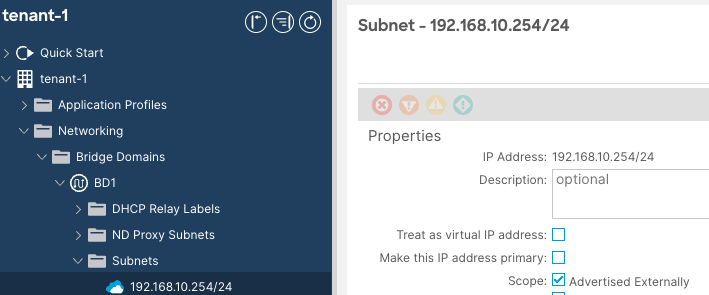

This configuration leads to extra sequences added on the route-map “exp-l3out-BGP-L3OUT-peer-2818048”, which is applied to the outbound (towards the external BGP peer).

```text
leaf-102# show route-map exp-l3out-BGP-L3OUT-peer-2818048
route-map exp-l3out-BGP-L3OUT-peer-2818048, deny, sequence 4
  Match clauses:
    tag: 4294967289
  Set clauses:
route-map exp-l3out-BGP-L3OUT-peer-2818048, permit, sequence 15801
  Match clauses:
    ip address prefix-lists: IPv4-peer32774-2818048-exc-int-inferred-export-dst
    ipv6 address prefix-lists: IPv6-deny-all
  Set clauses:
    tag 0
route-map exp-l3out-BGP-L3OUT-peer-2818048, deny, sequence 16000
  Match clauses:
    route-type: direct
  Set clauses:
```

The prefix list added to sequence 15801 of the route-map, permits the Bridge Domain subnet.

```text
leaf-102# show ip prefix-list IPv4-peer32774-2818048-exc-int-inferred-export-dst
ip prefix-list IPv4-peer32774-2818048-exc-int-inferred-export-dst: 1 entries
   seq 1 permit 192.168.10.254/24
```

At this point the subnet is advertised externally as required.

```text
leaf-102# show bgp ipv4 unicast neighbor 10.34.34.2 advertised-routes vrf tenant-1:VRF-1

Peer 10.34.34.2 routes for address family IPv4 Unicast:
BGP table version is 13, local router ID is 3.3.3.3

   Network                Next Hop                Metric         LocPrf   Weight Path
*>r192.168.10.0/24        0.0.0.0                      0            100    32768 65001 ?
```

This subnet can be seen in the routing table of the external router.

```text
5K-2# show ip route 192.168.10.0/24
IP Route Table for VRF "default"
'*' denotes best ucast next-hop
'**' denotes best mcast next-hop
'[x/y]' denotes [preference/metric]
'%<string>' in via output denotes VRF <string>

192.168.10.0/24, ubest/mbest: 1/0
    *via 10.34.34.1, [20/0], 00:08:27, bgp-65002, external, tag 65001,
```

Let’s try to ping the host on ACI from the external router.

```text
N5K-2# ping 192.168.10.2 source 4.4.4.4
PING 192.168.10.2 (192.168.10.2) from 4.4.4.4: 56 data bytes
64 bytes from 192.168.10.2: icmp_seq=0 ttl=252 time=1.152 ms
64 bytes from 192.168.10.2: icmp_seq=1 ttl=252 time=0.743 ms
64 bytes from 192.168.10.2: icmp_seq=2 ttl=252 time=0.695 ms
64 bytes from 192.168.10.2: icmp_seq=3 ttl=252 time=0.712 ms
64 bytes from 192.168.10.2: icmp_seq=4 ttl=252 time=0.687 ms

--- 192.168.10.2 ping statistics ---
5 packets transmitted, 5 packets received, 0.00% packet loss
round-trip min/avg/max = 0.687/0.797/1.152 ms
```

Server inside ACI fabric can ping the external IP address.

```text
server-1# ping 4.4.4.4
PING 4.4.4.4 (4.4.4.4): 56 data bytes
64 bytes from 4.4.4.4: icmp_seq=0 ttl=252 time=1.17 ms
64 bytes from 4.4.4.4: icmp_seq=1 ttl=252 time=0.787 ms
64 bytes from 4.4.4.4: icmp_seq=2 ttl=252 time=0.76 ms
64 bytes from 4.4.4.4: icmp_seq=3 ttl=252 time=0.739 ms
64 bytes from 4.4.4.4: icmp_seq=4 ttl=252 time=0.767 ms

--- 4.4.4.4 ping statistics ---
5 packets transmitted, 5 packets received, 0.00% packet loss
round-trip min/avg/max = 0.739/0.844/1.17 ms
```

This concludes the end-to-end configuration and verification of ACI L3Out using BGP as the routing protocol. Let’s proceed for the configuration of Cisco ACI L3Out using OSPF.

## L3OUT – OSPF

Navigate to the user defined tenant >> expand Networking >> L3Outs:
Create the L3OUT instance; associate it with a VRF, L3 Domain and choose the routing protocol for the deployment. In this case OSPF is the routing protocol of choice.

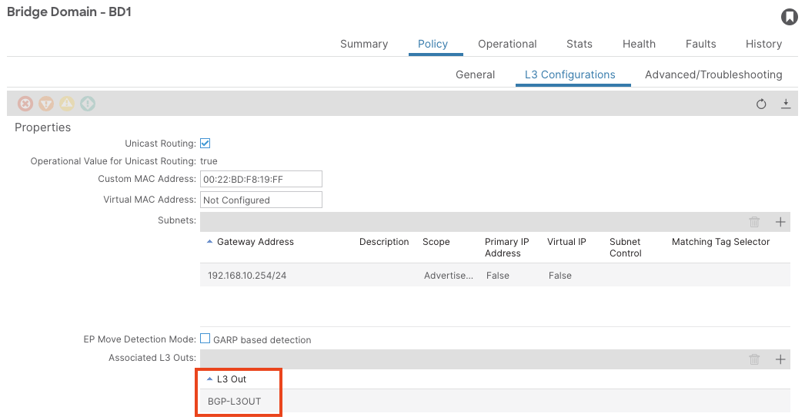

Define the OSPF Area ID and OSPF area type.

For this peering and Layer 3 interface (Eth1/2) on leaf node 101 is selected. The interface is assigned an IP address (10.12.12.1/30) which will be used for the OSPF peering. The leaf node is assigned a loopback IP address of 1.1.1.1 which will be used as the Router-ID for the routing protocol.

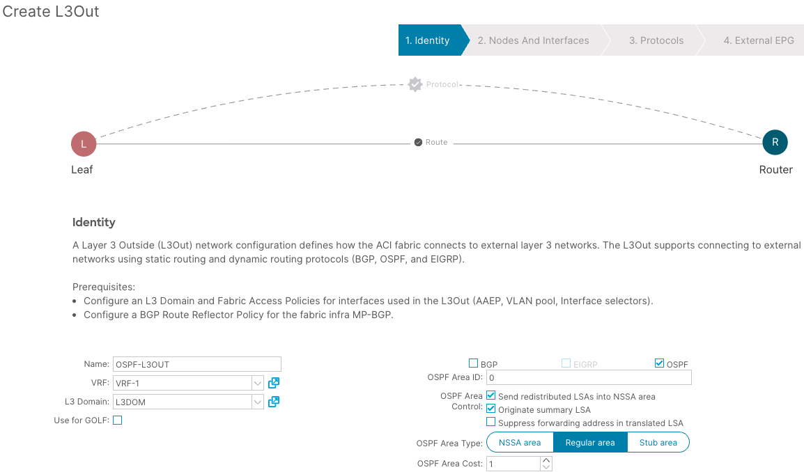

A custom OSPF interface policy is define which configured the network type to be “Point-to-point”.

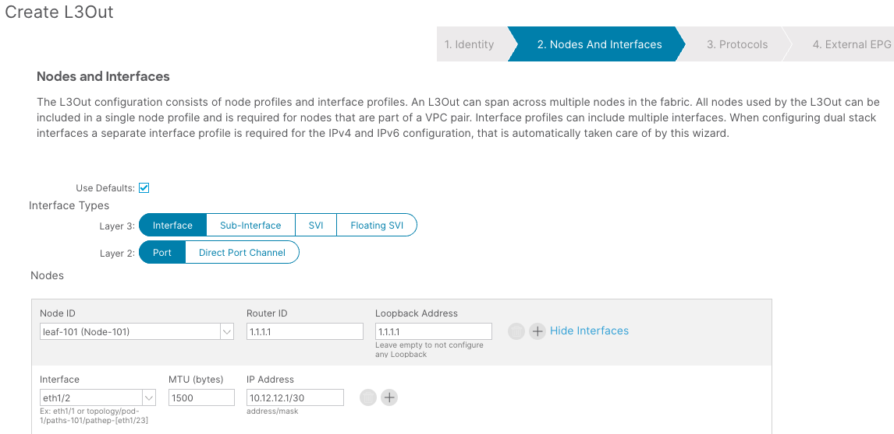

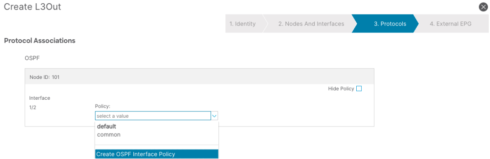

This OSP interface policy is attached to the interface that connects to the external router.

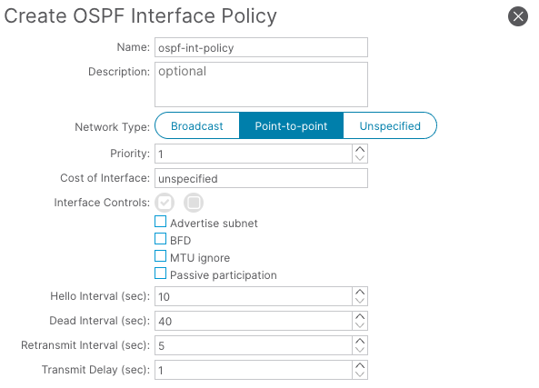

An External EPG is defined which defines a “catch-all” subnet with a scope of “External Subnets for External EPG”.

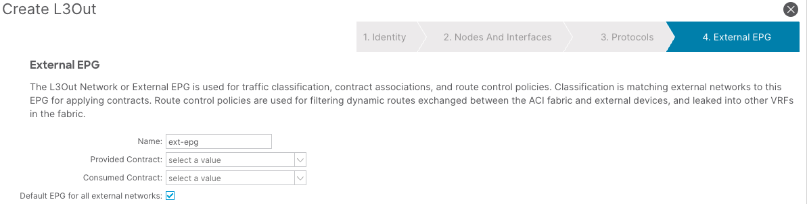

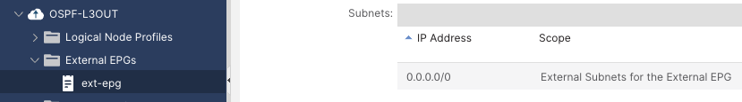

You can verify the OSPF configuration by going through the configured objects.

1. L3Out object

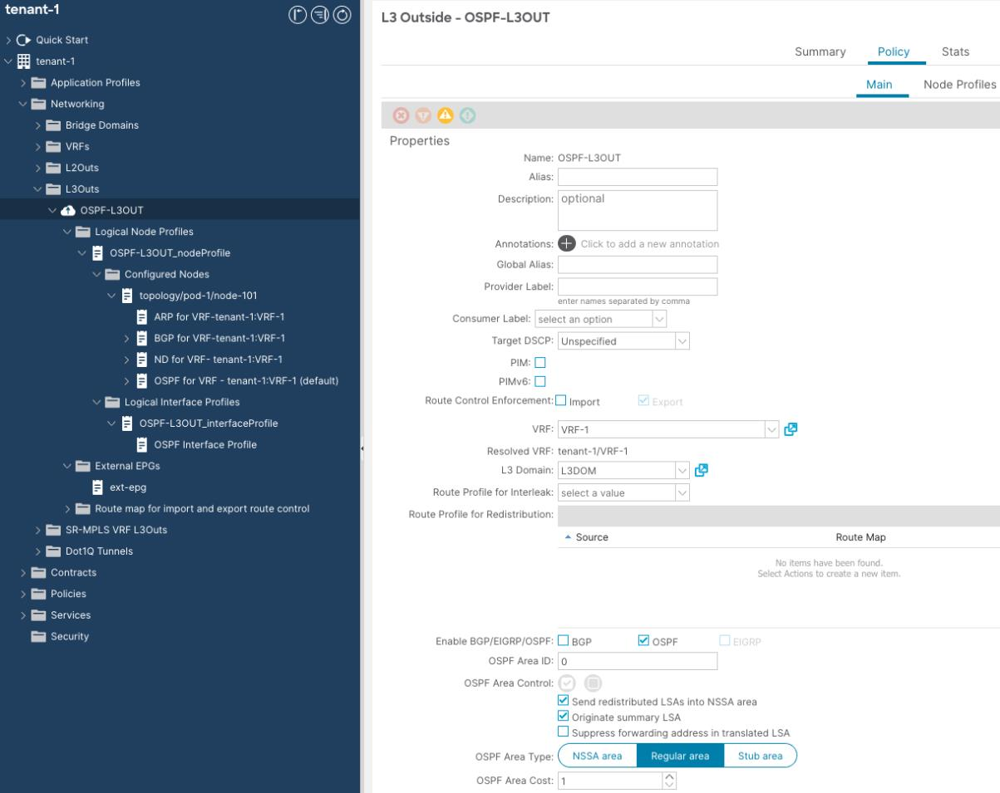

2. Logical node Profile

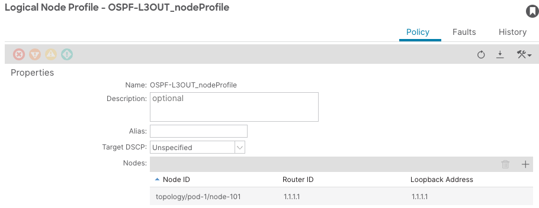

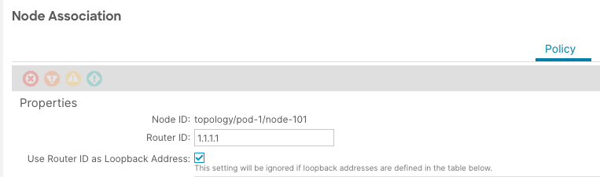

3. Logical Interface Profile

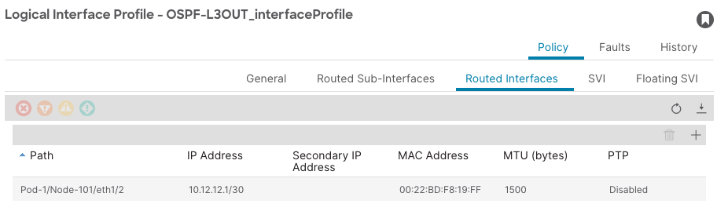

4. OSPF Neighborship status

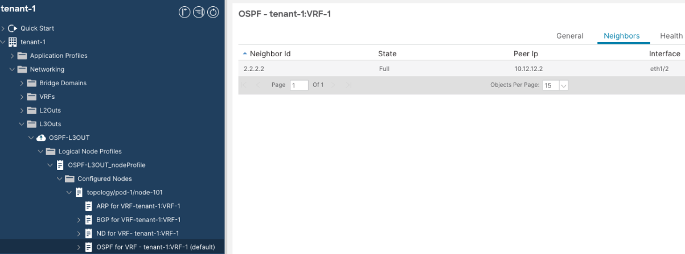

The external router is configured as follows:

```text
5K-1# show run ospf

feature ospf

router ospf 100

interface loopback0
  ip address 5.5.5.5/32
  ip router ospf 100 area 0.0.0.0

interface Ethernet1/1
  no switchport
  ip address 10.12.12.2/30
  ip ospf network point-to-point
  ip router ospf 100 area 0.0.0.0
```

Verify that the interface parameters are matching with the neighbor.

```text
leaf-101# show ip ospf interface vrf tenant-1:VRF-1
 loopback2 is up, line protocol is up
    IP address 1.1.1.1/32, Process ID default VRF tenant-1:VRF-1, area backbone
    Enabled by interface configuration
    State LOOPBACK, Network type LOOPBACK, cost 1

 Ethernet1/2 is up, line protocol is up
    IP address 10.12.12.1/30, Process ID default VRF tenant-1:VRF-1, area backbone
    Enabled by interface configuration
    State P2P, Network type P2P, cost 4
    Index 6, Transmit delay 1 sec
    1 Neighbors, flooding to 1, adjacent with 1
    Timer intervals: Hello 10, Dead 40, Wait 40, Retransmit 5
      Hello timer due in 00:00:02
    No authentication
    Number of opaque link LSAs: 0, checksum sum 0
```

Verify that OSPF is established between ACI and the external router.

```text
5K-1# show ip ospf neig
 OSPF Process ID 100 VRF default
 Total number of neighbors: 1
 Neighbor ID     Pri State                   Up Time Address           Interface
 1.1.1.1           1 FULL/ -                 00:00:40 10.12.12.1       Eth1/1
```

Verify that ACI is receiving routes from the external router.

```text
leaf-101# show ip route 5.5.5.5 vrf tenant-1:VRF-1
IP Route Table for VRF "tenant-1:VRF-1"
'*' denotes best ucast next-hop
'**' denotes best mcast next-hop
'[x/y]' denotes [preference/metric]
'%<string>' in via output denotes VRF <string>

5.5.5.5/32, ubest/mbest: 1/0
    *via 10.12.12.2, eth1/2, [110/5], 00:01:18, ospf-default, intra
```

ACI border leaf has a route-map that permits all prefixes from OSPF. The route-map “permit-all” injects the routes into the MP-BGP space.

```text
leaf-101# show bgp process vrf tenant-1:VRF-1

Information for address family IPv4 Unicast in VRF tenant-1:VRF-1
     Redistribution
          direct, route-map imp-ctx-bgp-direct-interleak-2818048
          coop, route-map exp-ctx-coop-bgp-2818048
          static, route-map imp-ctx-bgp-st-interleak-2818048
          ospf, route-map permit-all


leaf-101# show route-map permit-all
route-map permit-all, permit, sequence 2
  Match clauses:
  Set clauses:
```

## References

- [https://www.cisco.com/c/en/us/solutions/collateral/data-center-virtualization/application-centric-infrastructure/guide-c07-743150.html](https://www.cisco.com/c/en/us/solutions/collateral/data-center-virtualization/application-centric-infrastructure/guide-c07-743150.html)
- [https://www.cisco.com/c/en/us/solutions/collateral/data-center-virtualization/application-centric-infrastructure/white-paper-c11-743951.html#ContracttoanL3OutEPG](https://www.cisco.com/c/en/us/solutions/collateral/data-center-virtualization/application-centric-infrastructure/white-paper-c11-743951.html#ContracttoanL3OutEPG)
- [https://www.ciscolive.com/on-demand/on-demand-library.html?search=cisco%20aci%20l3out#/session/1750271887325001z377](https://www.ciscolive.com/on-demand/on-demand-library.html?search=cisco%20aci%20l3out#/session/1750271887325001z377)
