# Cisco ACI L4-L7 Policy-Based Redirect (PBR)

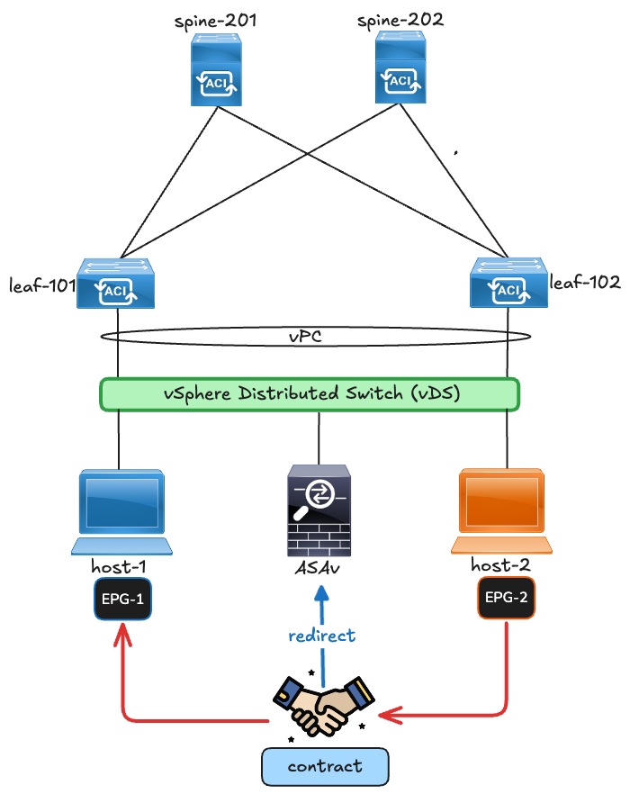

For more labs visit my GitHub repo: [https://github.com/TitusM/Cisco-Data-Center](https://github.com/TitusM/Cisco-Data-Center)

!!! note
    This lab was conducted in a controlled environment. Any configurations in a production network should be implemented during a designated maintenance window. Additionally, always refer to official Cisco documentation relevant to your specific hardware and software.

## Introduction

Cisco ACI provides the capability to insert Layer 4 through Layer 7 devices (e.g. firewall, load balancer etc.) using a Service Graph. These devices are inserted between Endpoint Groups/Endpoint Security Groups. Cisco ACI Layer 4 – Layer 7 Policy-Based Redirect (PBR) is one of Cisco’s most powerful features. ACI PBR allows traffic between two EPGs/ESGs to be bend towards an L4-L7 device. This lab showcases how to configure Cisco ACI L4-L7 PBR and how to validate the configuration. Furthermore, ELAM is used to showcase the packet walk from the source host => firewall => destination host.

The Cisco Adaptive Security Virtual Appliance (ASAv) will be deployed as a firewall service in the Cisco ACI fabric. In this lab, ACI is already integrated with vCenter via VMM domain. The configurations in this lab are based on a one-arm deployment design whereby the same firewall interface is used for traffic entering and leaving the firewall.

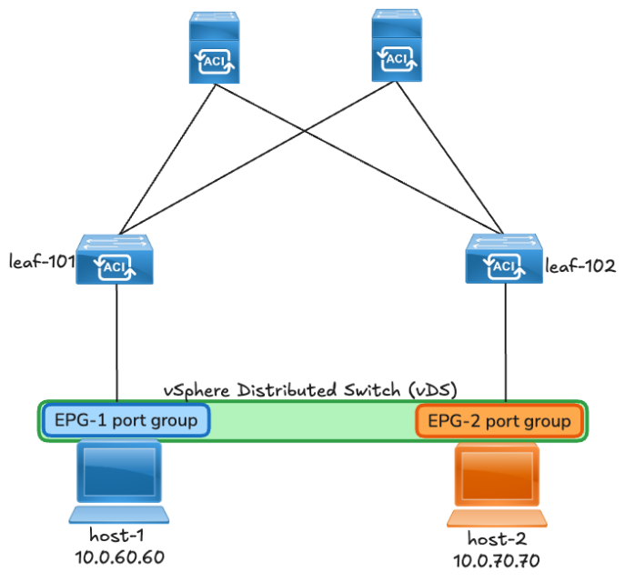

## Initial Configuration State

The initial communication state of the endpoints is shown by the output below.

host-1 (10.0.60.60) cannot ping host-2 (10.0.70.70).

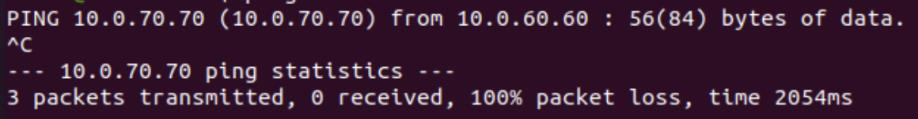

Vice-versa host-2 (10.0.70.70) cannot ping host-1 (10.0.60.60).

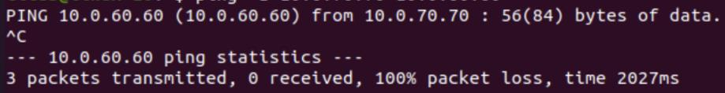

## Desired Configuration State

The desired configuration state for this lab is:

1. Configure the Service Device (firewall) Bridge Domain with a default gateway.
2. Configure the firewall with all the required configuration that will allow redirected traffic to traverse through.
3. Configure all the required elements for ACI Service Graph with PBR (Device, Redirect Policy, Service Graph Template, Device Selection Policy and the Contract that will be applied between the two EPGs).

The image below shows the setup that will be in place to accomplish the required policy based redirect when host-1 in EPG-1 is communicating with host-2 in EPG-2.

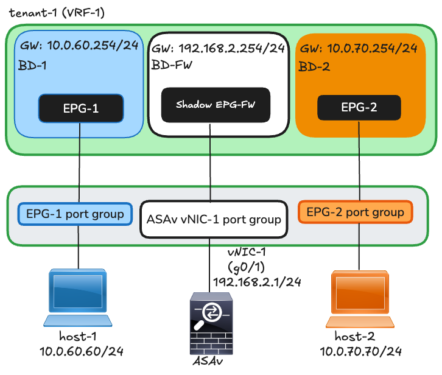

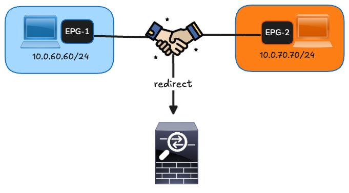

A contract permitting all IP traffic will be applied between EPG-1 (consumer) and EPG-2 (provider). The contract’s subject will be associated with the Service Graph Template to achieve the required Policy Based Redirect action.

## Lab Configurations

### ASAv Basic Configuration

This lab does not showcase how to deploy an ASAv on VMWare vCenter, however it will showcase the basic configuration that is applied on the firewall instance.

```text
ASAv#
!
interface GigabitEthernet0/0
nameif inside
security-level 50
ip address 192.168.2.1 255.255.255.0
!
access-group permit_ACI in interface inside
access-list permit_ACI extended permit ip any any
!
same-security-traffic permit intra-interface
!
route inside 0.0.0.0 0.0.0.0 192.168.2.254
```

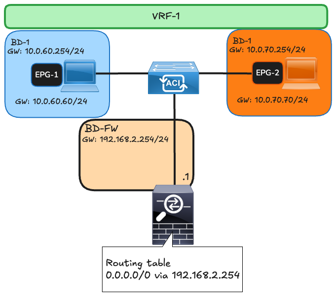

Firewall configuration considerations The firewall may deny traffic coming into and going out through the same interface. You should configure the firewall to permit intra-interface traffic. For example, Cisco ASA denies intra- interface traffic by default. To allow intra-interface traffic, configure same-security-traffic permit intra-interface on the ASA. A simple static routing configuration is applied on the firewall pointing to the default address that is configured on ACI.

The PBR node Bridge Domain is configured as follows:

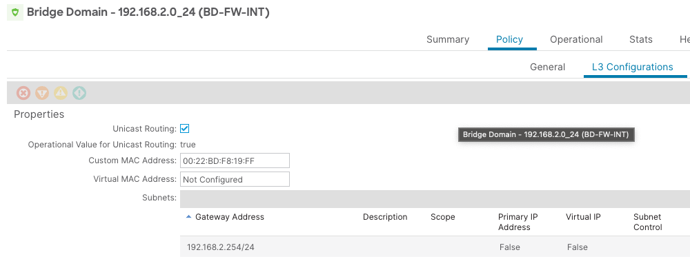

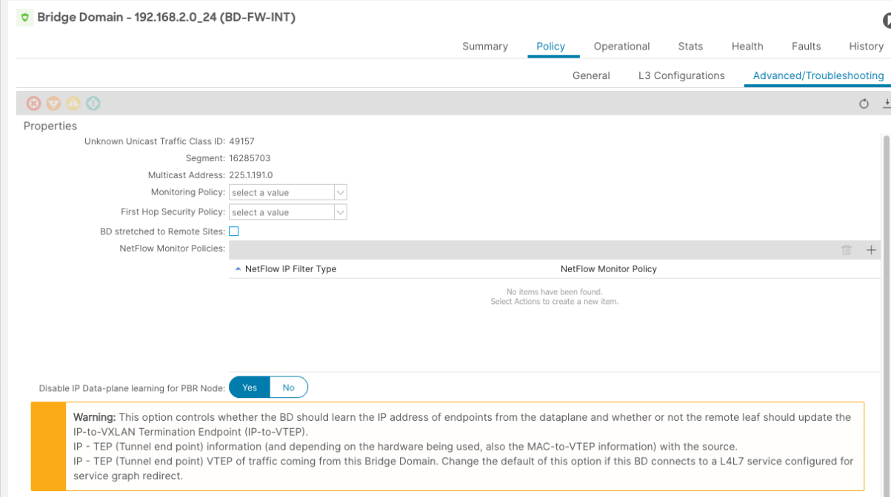

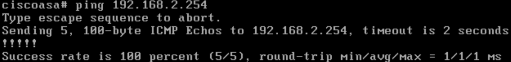

After the configuration has been applied on the firewall and ACI – verify that spine coop database has the firewall’s MAC and IP address.

```text
S1001# show coop internal info repo ep key 16285703 00:50:56:B3:0B:46 | egrep "EP|Real" | head -n 7
EP bd vnid : 16285703
EP mac : 00:50:56:B3:0B:46 (MAC address of the Firewall interface)
Current published TEP : 10.0.152.66
Real IPv4 EP : 192.168.2.1 (IP address of the firewall interface)
```

Verify that the firewall has reachability to its default gateway. The table below shows the elements required to configure PBR: Device                     The device provides information on the interfaces and logical connectors of the firewall/service device. Redirect Policy            The redirect policy defines the “next-hop” information.

Service Graph Template       The Service Graph Template defines “how” traffic should flow. Device Selection Policy      The Device Selection Policy ties the logical device to a Service Graph template and contract. It defines how the Device will communicate with the fabric.

```text
Contract                     The Subject of the contract will be associated with the Service graph template so that
the “redirect” policy will take effect when the contract is applied between two EPGs. The
contract defines the type of traffic that will be redirected to the firewall.
```

Now let’s get into the configuration steps required for PBR.

### Create a L4-L7 Device (Cisco ASAv – firewall)

Navigate to the tenant >> Services >> L4-L7 >> Devices >> Create L4-L7 Devices

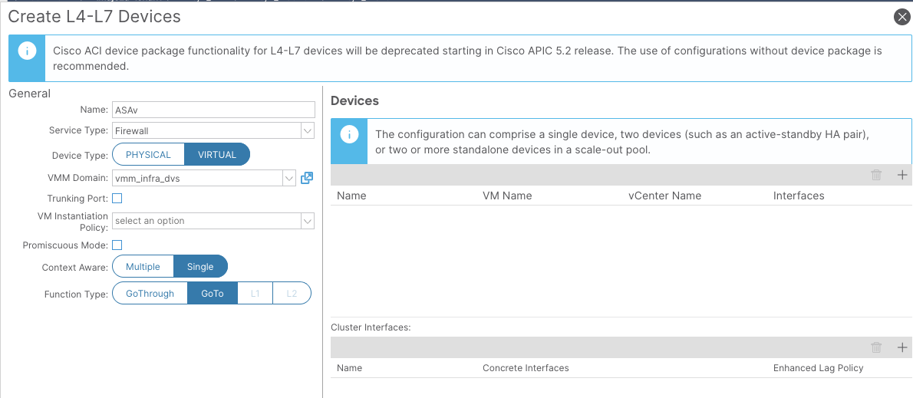

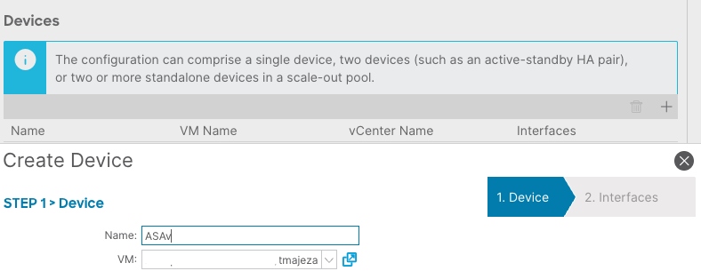

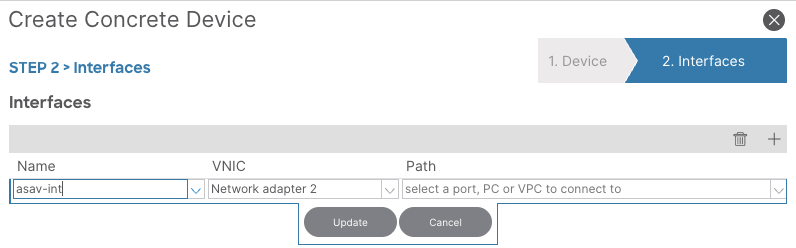

Click the (+) sign under Devices to add the concrete device details: Since ACI is already integrated with vCenter via VMM integration, the firewall VM will appear on the VM options.

Network Adapter 2 corresponds to the interface GigabitEthernet0/0 of the FW that was configured with an IP address. Click the (+) sign under the Cluster interfaces to configure the logical interfaces and map them to the concrete interfaces. The interfaces of the device cluster (cluster interfaces) are the interfaces of the ASAv VM adapters. These interfaces specify how the ASAv VM connects to the ACI.

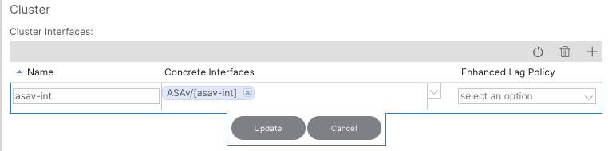

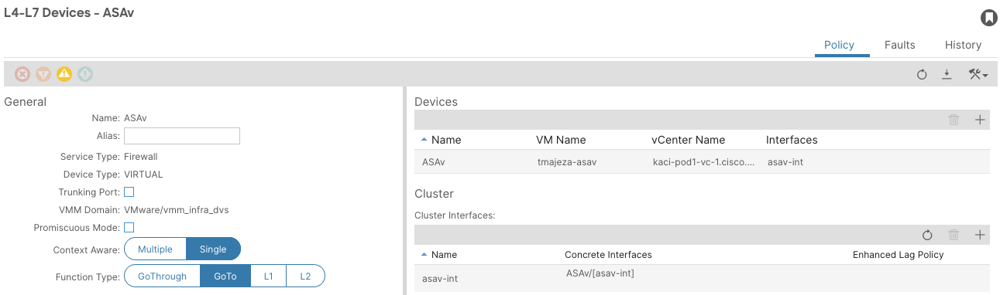

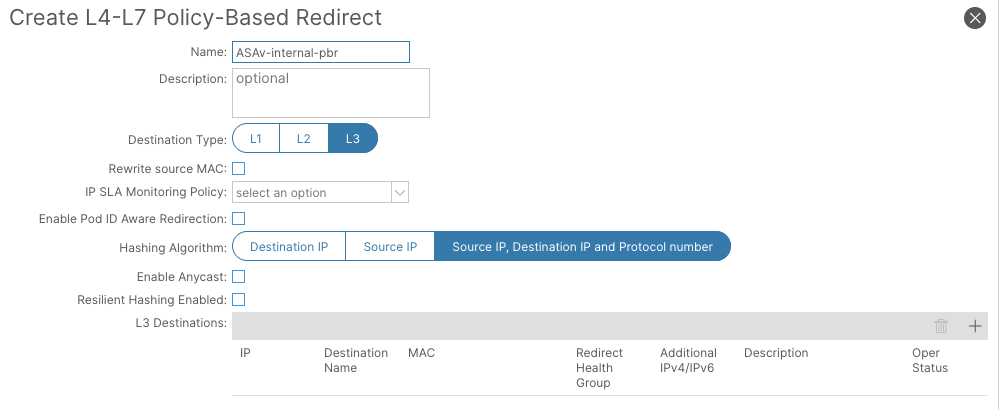

The resulting configuration is as follows:

### Configure the PBR Redirect Policy

The PBR policies define the next hop for the traffic that will be sent through the Layer 4 – layer 7 device. To create the L4-L7 Policy-Based Policy navigate to the tenant >> Policies >> L4-L4 Policy-Based Redirect >> Create L4-L7 Policy-Based Redirect Click the plus sign (+) in the Layer 3 Destinations table, enter the IP and MAC of ASAv Gi0/0. Click OK and Submit.

It is important to configure the correct MAC and IP address of the firewall interface where traffic will be directed to:

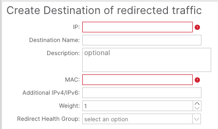

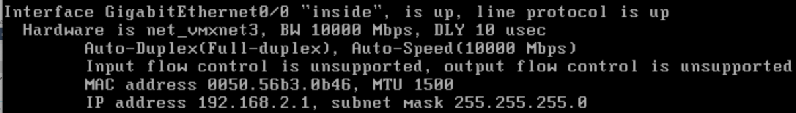

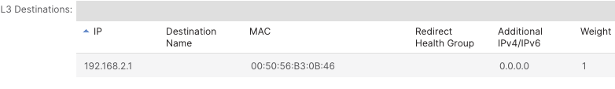

The resulting configuration is showed below:

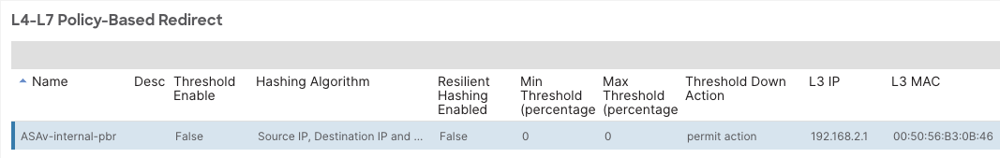

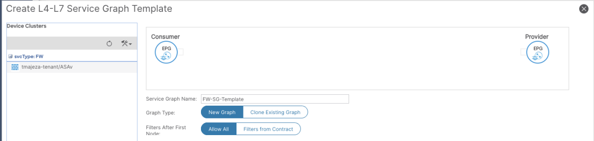

### Configure a Service Graph

A service graph allows for the insertion of a Layer 4–Layer 7 device in the traffic path between EPGs. To configure a Service Graph navigate to the tenant >> Services >> L4-L7 >> Right Click Service Graph Templates and Create L4-L7 Service Graph Template. Enter the template name Drag and drop the device cluster ASAv in the work-pane (in-between the Consumer and Provider EPG). Choose the configurations as reflected by the image below:

At this point the Service Graph Template is configured successfully.

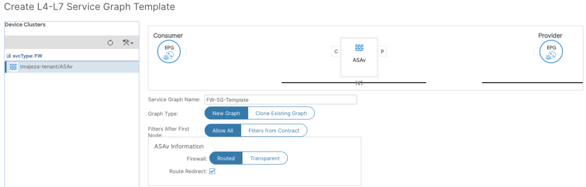

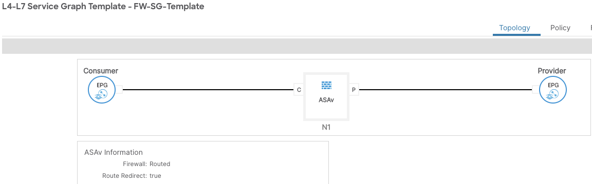

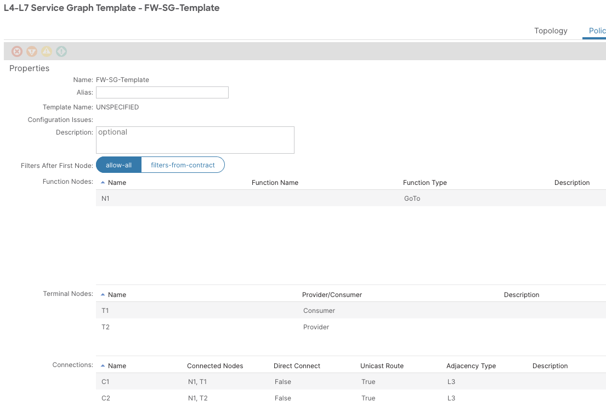

On the Service Graph Template, you can click on the Policy tab to review all the configuration associated with the Service Graph template.

- Function node: A function node represents a function that is applied to the traffic, such as a firewall.
- Terminal node: A terminal node enables input and output from the service graph.
- Connector: A connector enables input and output from a node.
- Connection: A connection determines how traffic is forwarded through the network.
### Configure Device Selection Policies:

Navigate to Services >> L4-L7 >> Device Selection Policies

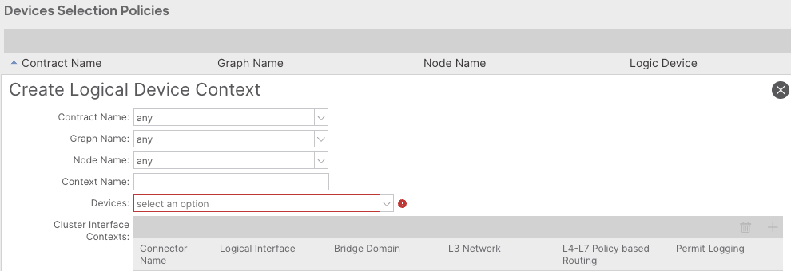

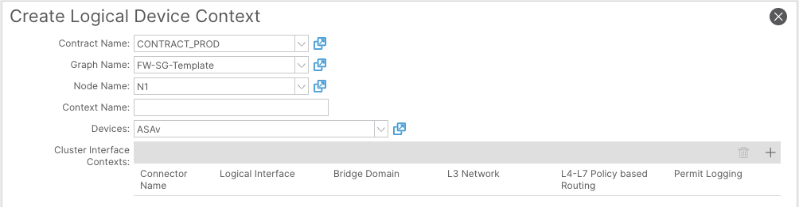

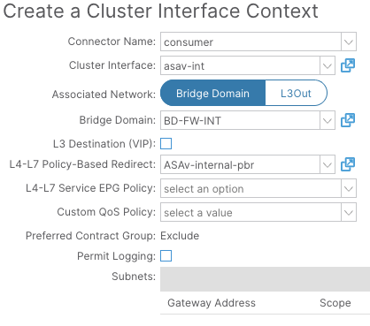

- Select the Contract where the Service Graph will be applied.
- Select the configured Service Graph Template and the Function Node.
- Select the Device (ASAv) that was created earlier.
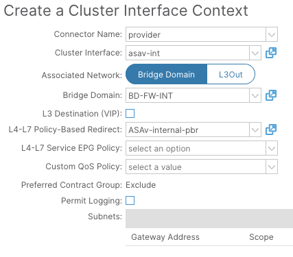

Click on the (+) symbol to create the Cluster interface contexts: Although the PBR node has one interface, the device selection policy has both consumer and provider connector configuration settings. For a one-arm mode service graph, you just select the same options for both the consumer and provider connectors in the device selection policy, so that only one segment is deployed for the one interface during service graph instantiation. Consumer connector                                   Provider connector

Resulting configuration:

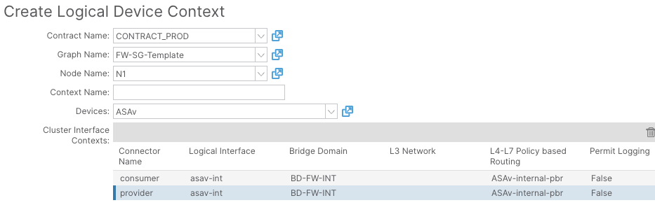

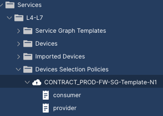

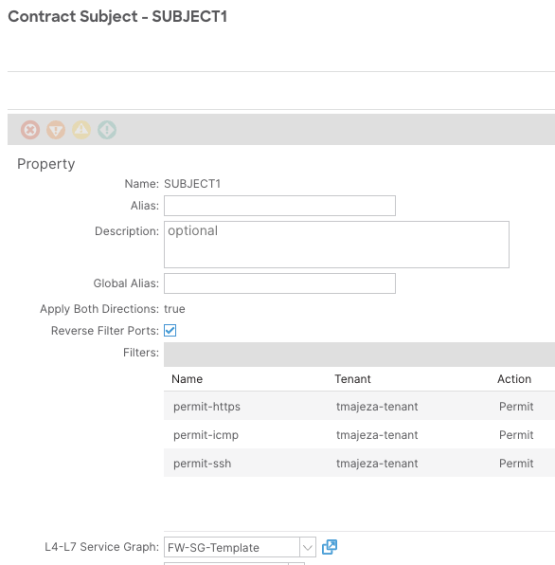

At this point all required configuration is in place however, the Graph Instance is not deployed as yet. The next step is to navigate to the Contract’s Subject >> L4-L7 Service Graph and associate it with the Service Graph Template.

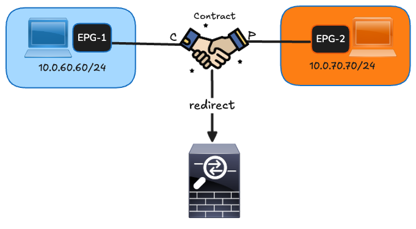

Apply the contract between the two EPGs.

The image below (contract topology) shows that the contract with an L4-L7 Service Graph association is applied between the two EPGs.

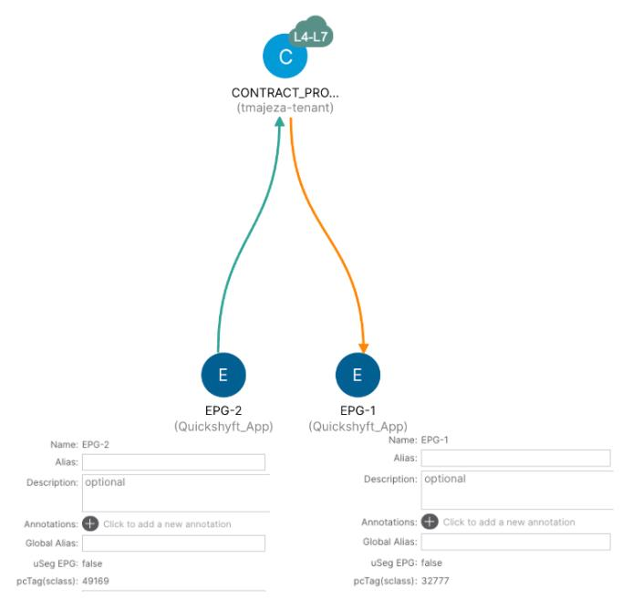

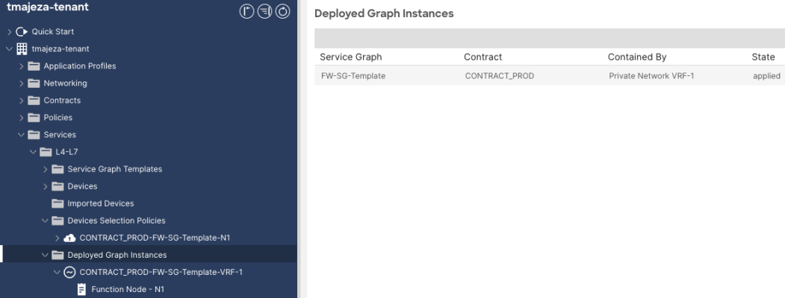

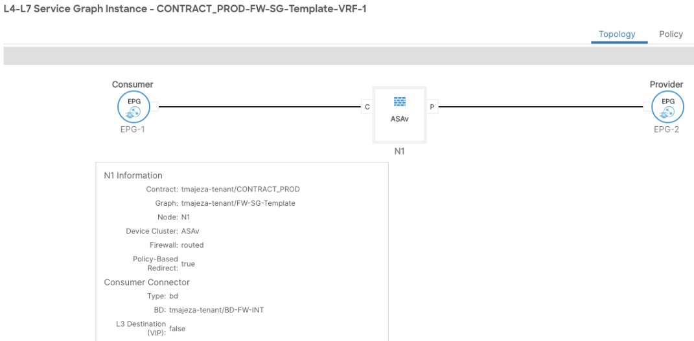

The moment the contract is successfully deployed between the two EPGs, a Graph instance is automatically deployed. Click on the Deployed Graph Instance to see the deployed configuration.

!!! note
    The Class ID highlighted above is programmed by ACI for the provider and consumer connectors. This Class ID is the pcTag of the shadow EPG of the firewall. This Class ID will be observed in the zoning-rule table.

On the ASAv that is deployed on vCenter, a port group is dynamically created and the Network adapter for the relevant firewall interface is associated with the port-group.

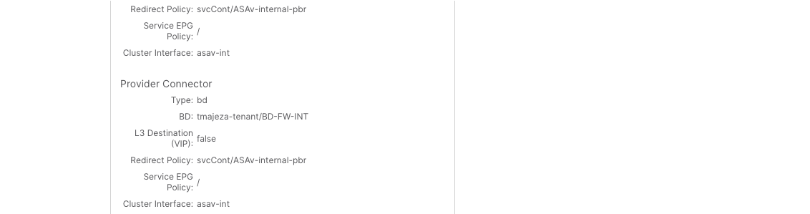

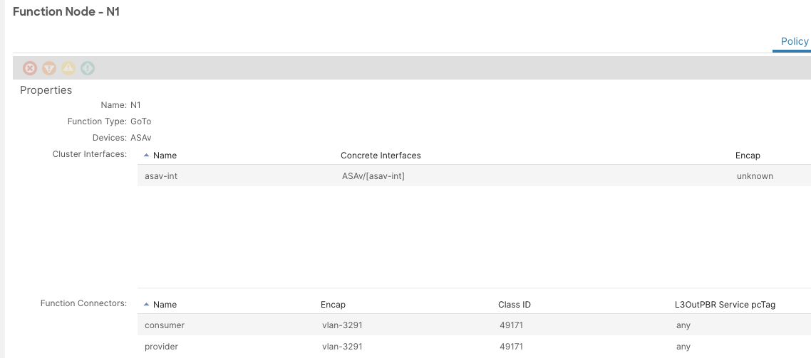

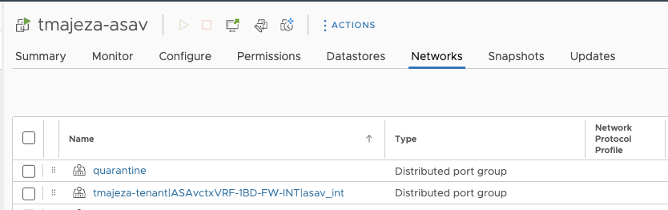

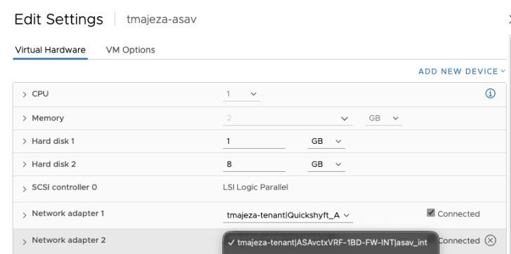

## Verifications

After the successful deployment of Service Graph instance, we can observe that host-1 and host-2 can communicate.

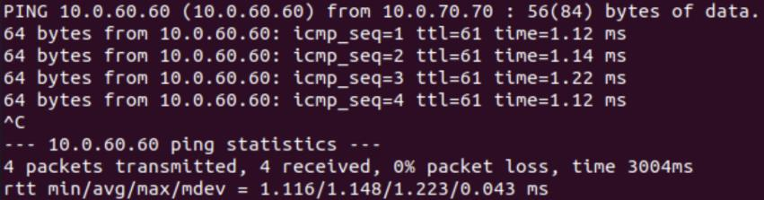

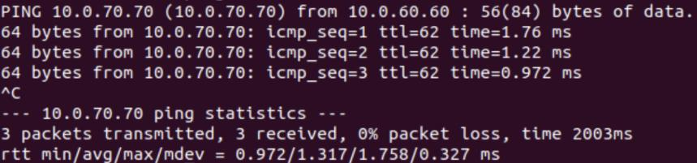

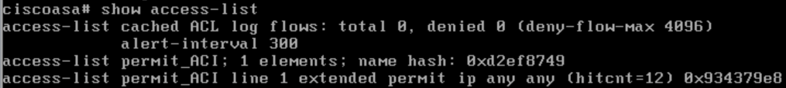

To verify that the access-list configured on the firewall is indeed taking effect, we can check if the hit count is incrementing as traffic flows. The output below shows that the access-list has a non-zero hit count verifying that the access-list is indeed in full effect.

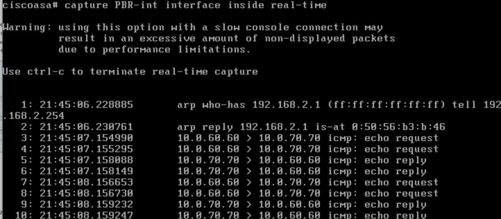

An additional check on the firewall is to capture real-time traffic on the firewall terminal. The output below reflects that ICMP traffic between host-1 (10.0.60.60) and host-2 (10.0.70.70) is being redirected to the firewall. If the requirement was to block the traffic between these hosts, the access-list “permit” action can be changed to “deny”.

Communication between the 2 hosts is now being denied.

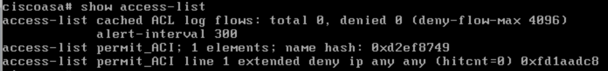

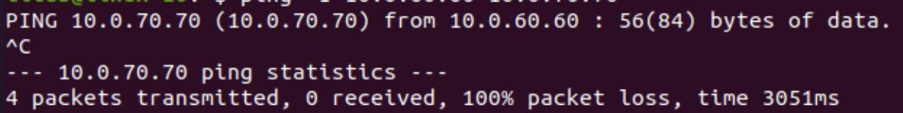

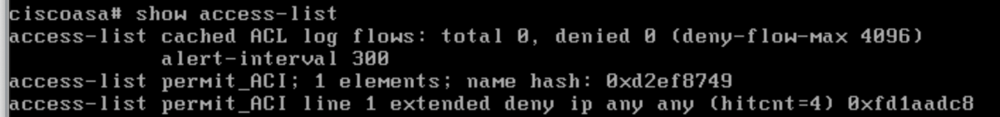

Now let’s perform some in-depth verifications on the command-line interface. Verify the service redirect information. This output reflects the MAC and IP address of the firewall that was configured in the redirect policy.

```text
L102# show service redir info
List of Dest Groups
GrpID Name            destination                             operSt
===== ====            ===========                             ==============
destgrp-5             dest-[192.168.2.1]-[vxlan-2129937]      enabled
List of destinations
Name                                                           bdVnid           vMac                 vrf                    operSt
====                                                           ======           ====                 ====                   =====
dest-[192.168.2.1]-[vxlan-2129937]                             vxlan-16285703   00:50:56:B3:0B:46    tmajeza-tenant:VRF-1   enabled
```

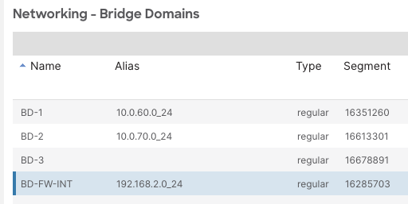

The bdVnid is the ID of the Bridge Domain that was configured for the firewall.

From a contract enforcement perspective, the zoning rule table highlights the rules that are applied between the hosts’ EPGs and the shadow EPG of the firewall.

```text
L102# show zoning-rule scope 2129937
+---------+--------+--------+----------+----------------+---------+---------+------+-------------------+----------------------+
| Rule ID | SrcEPG | DstEPG | FilterID |      Dir       | operSt | Scope | Name |          Action      |       Priority       |
+---------+--------+--------+----------+----------------+---------+---------+------+-------------------+----------------------+
| 15305 | 49169 | 32777 |        5     | uni-dir-ignore | enabled | 2129937 |      | redir(destgrp-5) |     fully_qual(7)     |
|   4127 | 32777 | 49169 |       5     |     bi-dir     | enabled | 2129937 |      | redir(destgrp-5) |     fully_qual(7)     |
|   4128 | 49171 | 32777 |       5     |    uni-dir     | enabled | 2129937 |      |      permit       |    fully_qual(7)     |
| 10582 | 49171 | 49169 | default |         uni-dir     | enabled | 2129937 |      |      permit       |    src_dst_any(9)    |
+---------+--------+--------+----------+----------------+---------+---------+------+-------------------+----------------------+
```

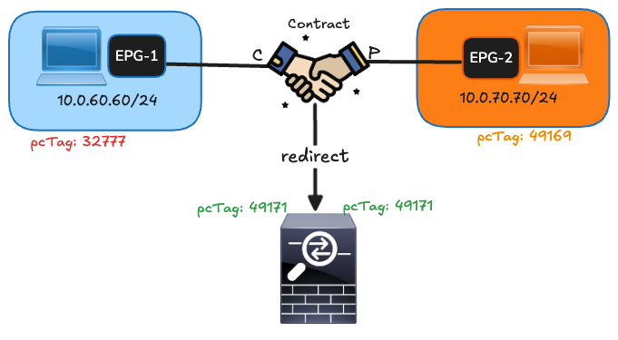

Rule 15 Rule 4127: IP (ICMP) traffic from EPG-1 (32777) to EPG-2 (49169) is redirected to the firewall. Rule 10582: any traffic from the firewall shadow EPG (49171) to EPG-2 (49169) is permitted. Rule 15305: IP (ICMP) traffic from EPG-2 (49169) to EPG-1 (32777) is redirected to the firewall. Rule 4128: Rule 10582: IP (ICMP) from the firewall shadow EPG (49171) to EPG-1 (32777) is permitted. The contract_parser.py script is also used to get more details regarding each rule, what action is involved (redirect or permit), the redirect information (MAC and IP address of the firewall) and the hit count of each rule. This is important to verify that the contract is taking effect.

```text
KACI-MS-S1-93180EX-L102# contract_parser.py --vrf tmajeza-tenant:VRF-1
Key:
[prio:RuleId] [vrf:{str}] action protocol src-epg [src-l4] dst-epg [dst-l4] [flags][contract:{str}] [hit=count]
[7:4127] [vrf:tmajeza-tenant:VRF-1] redir ip icmp tn-tmajeza-tenant/ap-Quickshyft_App/epg-EPG-1(32777) tn-tmajeza-tenant/ap-Quickshyft_App/epg-EPG-2(49169)
[contract:uni/tn-tmajeza-tenant/brc-CONTRACT_PROD] [hit=96]
destgrp-5 vrf:tmajeza-tenant:VRF-1 ip:192.168.2.1 mac:00:50:56:B3:0B:46 bd:uni/tn-tmajeza-tenant/BD-BD-FW-INT
[7:15305] [vrf:tmajeza-tenant:VRF-1] redir ip icmp tn-tmajeza-tenant/ap-Quickshyft_App/epg-EPG-2(49169) tn-tmajeza-tenant/ap-Quickshyft_App/epg-EPG-1(32777)
[contract:uni/tn-tmajeza-tenant/brc-CONTRACT_PROD] [hit=56453599]
destgrp-5 vrf:tmajeza-tenant:VRF-1 ip:192.168.2.1 mac:00:50:56:B3:0B:46 bd:uni/tn-tmajeza-tenant/BD-BD-FW-INT
[7:4128] [vrf:tmajeza-tenant:VRF-1] permit ip icmp tn-tmajeza-tenant/G-ASAvctxVRF-1/C-asav-int(49171) tn-tmajeza-tenant/ap-Quickshyft_App/epg-EPG-1(32777)
[contract:uni/tn-tmajeza-tenant/brc-CONTRACT_PROD] [hit=49390149]
[9:10582] [vrf:tmajeza-tenant:VRF-1] permit any tn-tmajeza-tenant/G-ASAvctxVRF-1/C-asav-int(49171) tn-tmajeza-tenant/ap-Quickshyft_App/epg-EPG-2(49169)
[contract:uni/tn-tmajeza-tenant/brc-CONTRACT_PROD] [hit=256]
The policy manager can be used to verify the rules within the VRF and the “Pkts” count show whether the
contract rule is being hit or not.
KACI-MS-S1-93180EX-L102# show system internal policy-mgr stats | grep 2129937
Rule (4127) DN (sys/actrl/scope-2129937/rule-2129937-s-32777-d-49169-f-5) Ingress: 0, Egress: 0, Pkts: 84 RevPkts: 0
Rule (4128) DN (sys/actrl/scope-2129937/rule-2129937-s-49171-d-32777-f-5) Ingress: 0, Egress: 0, Pkts: 24695111 RevPkts: 0
Rule (10582) DN (sys/actrl/scope-2129937/rule-2129937-s-49171-d-49169-f-default) Ingress: 0, Egress: 0, Pkts: 162 RevPkts: 0
Rule (15305) DN (sys/actrl/scope-2129937/rule-2129937-s-49169-d-32777-f-5) Ingress: 0, Egress: 0, Pkts: 24695038 RevPkts: 0
```

The section below uses the Embedded Logic Analyzer Module (ELAM) to showcase the PBR packet walk from the source to the destination. What is ELAM ? ELAM is an engineering tool that gives you the ability to look inside Cisco ASICs and understand how a packet is forwarded. It is embedded within the forwarding pipeline. ELAM can capture a packet in real time without disruptions to performance or control-plane resources. It helps to answer questions such as: Did the packet reach the forwarding engine? How does the packet appear (Layer 2-Layer 4 data)? How is the packet altered and where is it sent? To run the ELAM on the nodes in this lab, I used ELAM CLI Tool for Cisco ACI obtained from ([https://developer.cisco.com/codeexchange/github/repo/tskanai1/elam-tool2/](https://developer.cisco.com/codeexchange/github/repo/tskanai1/elam-tool2/) or [https://github.com/tskanai1/elam-tool2](https://github.com/tskanai1/elam-tool2)) The first ELAM capture is performed on the LEAF102 access port where the source endpoint is sending traffic from. Let’s look into the generated report (only important output is shown)

```text
==========================================================================================
Captured Packet
==========================================================================================
------------------------------------------------------------------------------------------
Outer Packet Attributes
------------------------------------------------------------------------------------------
Outer Packet Attributes        : l2uc ipv4 ip ipuc ipv4uc
Opcode                         : OPCODE_UC
--------------------------------------------------------------------------------------------------------
----------------------------------------------
Outer L2 Header
--------------------------------------------------------------------------------------------------------
----------------------------------------------
Destination MAC                : 0022.BDF8.19FF     MAC address of the destination host (10.0.70.70)
Source MAC                     : 0050.56B3.1AB7     MAC address of the source host (10.0.60.60)
802.1Q tag is valid            : yes( 0x1 )
CoS                            : 0( 0x0 )
Access Encap VLAN              : 3461( 0xD85 )
--------------------------------------------------------------------------------------------------------
Outer L3 Header
--------------------------------------------------------------------------------------------------------
L3 Type                        : IPv4
IP Version                     : 4
DSCP                           : 0
IP Packet Length               : 84 ( = IP header(28 bytes) + IP payload )
Don't Fragment Bit             : set
TTL                            : 64
IP Protocol Number             : ICMP
IP CheckSum                    : 5849( 0x16D9 )
Destination IP                 : 10.0.70.70
Source IP                      : 10.0.60.60
========================================================================================================
Contract Lookup ( FPC )
========================================================================================================
--------------------------------------------------------------------------------------------------------
Contract Lookup Key
--------------------------------------------------------------------------------------------------------
IP Protocol                               : ICMP( 0x1 )
L4 Src Port                               : 2048( 0x800 )
L4 Dst Port                               : 6668( 0x1A0C )
sclass (src pcTag)                        : 32777( 0x8009 )
dclass (dst pcTag)                        : 49169( 0xC011 )
src pcTag is from local table             : yes
derived from a local table on this node by the lookup of src IP or MAC
Unknown Unicast / Flood Packet            : no
```

```text
If yes, Contract is not applied here because it is flooded
--------------------------------------------------------------------------------------------------------
Contract Result
--------------------------------------------------------------------------------------------------------
Contract Drop                           : no
Contract Logging                        : no
Contract Applied                        : yes
Contract Hit                            : yes
Contract Aclqos Stats Index             : 81658
( show sys int aclqos zoning-rules | grep -B 9 "Idx: 81658" )
The output reflects that policy enforcement (contract rule) was applied on the leaf where the
source host is connected.
Check which zoning-rule is being enforced when the packet hits the leaf from the source.
module-1(DBG-elam-insel6)# show sys int aclqos zoning-rules | grep -B 9 "Idx: 81658"
Rule ID: 4127 Scope 23 Src EPG: 32777 Dst EPG: 49169 Filter 5
Redir group: 5
Sclass for          Sclass for
source endpoint   destination endpoint
LEAF-102                                                    LEAF-102
show system internal epm endpoint ip 10.0.60.60 |            show system internal epm endpoint ip 10.0.70.70 |
egrep "VRF vnid|sclass"                                      egrep "VRF vnid|sclass"
BD vnid : 16351260 ::: VRF vnid : 2129937                    BD vnid : 16613301 ::: VRF vnid : 2129937
Flags : 0x80004c04 ::: sclass : 32777 ::: Ref                Flags : 0x80000c80 ::: sclass : 49169 ::: Ref
count : 5                                                    count : 5
EP Flags : local|IP|MAC|sclass|timer|                        EP Flags : on-peer|IP|MAC|sclass|
On Leaf 102, it is evident that Rule ID:4127 is enforced. This rule’s action is a “redirect” to the firewall.
+---------+--------+--------+----------+----------------+---------+---------+------+-------------------+----------------------+
| Rule ID | SrcEPG | DstEPG | FilterID |      Dir       | operSt | Scope | Name |          Action      |       Priority       |
+---------+--------+--------+----------+----------------+---------+---------+------+-------------------+----------------------+
|   4127 | 32777 | 49169 |       5     |     bi-dir     | enabled | 2129937 |      | redir(destgrp-5) |     fully_qual(7)     |
The ELAM report furthermore verifies that indeed the packet has been redirected.
cat elam_report_ L102_LC1_ASIC0.txt | grep service_redir
sug_luc_latch_results_vec.luc3_0.service_redir: 0x1 (0x1 means that the packet is being redirected)
The next capture is on the fabric port of the of the spine connected to the leaf where the packet is coming
from.
The packet on this port will now be encapsulated with a VXLAN header as it will be traversing in the ACI
fabric.
----------------------------------------------------------------------------------------------------------------------------- ---
Inner L2 Header
----------------------------------------------------------------------------------------------------------------------------- ---
----------------------
Inner Destination MAC         : 0050.56B3.0B46    The inner destination MAC was changed by the leaf to the FW vMAC address
Source MAC                    : 0050.56B3.1AB7    Source MAC of host-1 remains unchanged.
802.1Q tag is valid           : no
CoS                           : 0
Access Encap VLAN             : 0
----------------------------------------------------------------------------------------------------------------------------- ---
Outer L3 Header
----------------------------------------------------------------------------------------------------------------------------- ---
L3 Type                       : IPv4
DSCP                          : 0
Don't Fragment Bit            : 0x0
TTL                           : 32
```

```text
IP Protocol Number            : UDP
Destination IP                : 10.0.80.65       This is the PHYSICAL,PROXY-ACAST-MAC IP address on the spine.
Source IP                     : 10.0.152.66      This is the TEP IP of LEAF102 where the packet is coming from.
----------------------------------------------------------------------------------------------------------------------------- ---
Inner L3 Header
----------------------------------------------------------------------------------------------------------------------------- ---
L3 Type                       : IPv4
DSCP                          : 0
Don't Fragment Bit            : 0x1
TTL                           : 63
IP Protocol Number            : ICMP
Destination IP                : 10.0.70.70
Source IP                     : 10.0.60.60
Outer L4 Header
----------------------------------------------------------------------------------------------------------------------------- ---
L4 Type                       : iVxLAN
Don't Learn Bit               : 1
```

Src Policy Applied Bit        : 1 Dst Policy Applied Bit        : 1

```text
sclass (src pcTag)            : 0x8009
VRF or BD VNID                : 16285703( 0xF88007 )   Outer L4 header contains the BD_VNID of the firewall
The next capture is performed on the fabric port of LEAF102. The packet comes from the spine towards
LEAF102 where the service device (firewall) is connected. The packet is destined to the Firewall (seen
from the Inner destination MAC address).
---------------------------------------------------------------------------------------------------
Inner L2 Header
---------------------------------------------------------------------------------------------------
Inner Destination MAC         : 0050.56B3.0B46
Source MAC                    : 0050.56B3.1AB7
802.1Q tag is valid           : no
CoS                           : 0
Access Encap VLAN             : 0
---------------------------------------------------------------------------------------------------
Outer L3 Header
---------------------------------------------------------------------------------------------------
L3 Type                       : IPv4
DSCP                          : 0
Don't Fragment Bit            : 0x0
TTL                           : 32
IP Protocol Number            : UDP
Destination IP                : 10.0.152.66
Source IP                     : 10.0.152.66
---------------------------------------------------------------------------------------------------
Inner L3 Header
---------------------------------------------------------------------------------------------------
L3 Type                       : IPv4
DSCP                          : 0
Don't Fragment Bit            : 0x1
TTL                           : 63
IP Protocol Number            : ICMP
Destination IP                : 10.0.70.70
Source IP                     : 10.0.60.60
---------------------------------------------------------------------------------------------------
Outer L4 Header
---------------------------------------------------------------------------------------------------
L4 Type                       : iVxLAN
Don't Learn Bit               : 1
Src Policy Applied Bit        : 1
Dst Policy Applied Bit        : 1
sclass (src pcTag)            : 0x8009
VRF or BD VNID                : 16285703( 0xF88007 )
The output below captures the packet on Leaf 102 as it comes back from the firewall and is destined for
the destination endpoint.
```

```text
-------------------------------------------------------------------------------------------------
Outer L2 Header
-------------------------------------------------------------------------------------------------
Destination MAC               : 0022.BDF8.19FF
Source MAC                    : 0050.56B3.0B46           MAC address of the firewall
802.1Q tag is valid           : yes( 0x1 )
CoS                           : 0( 0x0 )
Access Encap VLAN             : 3291( )
-------------------------------------------------------------------------------------------------
Outer L3 Header
-------------------------------------------------------------------------------------------------
L3 Type                       : IPv4
IP Version                    : 4
DSCP                          : 0
IP Packet Length              : 84 ( = IP header(28 bytes) + IP payload )
Don't Fragment Bit            : set
TTL                           : 63
IP Protocol Number            : ICMP
IP CheckSum                   : 36245( 0x8D95 )
Destination IP                : 10.0.70.70
Source IP                     : 10.0.60.60
Contract Lookup ( FPC )
-------------------------------------------------------------------------------------------------
Contract Lookup Key
-------------------------------------------------------------------------------------------------
IP Protocol                             : ICMP( 0x1 )
L4 Src Port                             : 2048( 0x800 )
L4 Dst Port                             : 23362( 0x5B42 )
sclass (src pcTag)                      : 49171( 0xC013 )
dclass (dst pcTag)                      : 49169( 0xC011 )
src pcTag is from local table           : yes
derived from a local table on this node by the lookup of src IP or MAC
Unknown Unicast / Flood Packet          : no
If yes, Contract is not applied here because it is flooded
-------------------------------------------------------------------------------------------------
Contract Result
-------------------------------------------------------------------------------------------------
Contract Drop                           : no
Contract Logging                        : no
Contract Applied                        : yes
Contract Hit                            : yes
Contract Aclqos Stats Index             : 71256
( show sys int aclqos zoning-rules | grep -B 9 "Idx: 71256" )
=================================================================================================
module-1(DBG-elam-insel6)# show sys int aclqos zoning-rules | grep -B 9 "Idx: 71256"
===========================================
Rule ID: 10582 Scope 23 Src EPG: 49171 Dst EPG: 49169 Filter 65535
unit_id: 0
=== Region priority: 2462 (rule prio: 9 entry: 158)===
On Leaf 102, it is evident that Rule ID:10582 is enforced. This rule’s action is a “permit any”.
L102# show zoning-rule scope 2129937
+---------+--------+--------+----------+----------------+---------+---------+------+-------------------+----------------------+
| Rule ID | SrcEPG | DstEPG | FilterID |      Dir       | operSt | Scope | Name |          Action      |       Priority       |
+---------+--------+--------+----------+----------------+---------+---------+------+-------------------+----------------------+
| 10582 | 49171 | 49169 | default |         uni-dir     | enabled | 2129937 |      |      permit       |    src_dst_any(9)    |
+---------+--------+--------+----------+----------------+---------+---------+------+-------------------+----------------------+
L102# show zoning-filter filter default
+----------+------+-------------+-------------+-------------+-------------+----------+-------------+-------------+-------------+-------------+------+-------------+-------------+----------+
| FilterId | Name |      EtherT   |    ArpOpc   |     Prot    | ApplyToFrag | Stateful |   SFromPort   |   SToPort   |   DFromPort   |   DToPort   | Prio |   Icmpv4T   |   Icmpv6T   | TcpRules |
+----------+------+-------------+-------------+-------------+-------------+----------+-------------+-------------+-------------+-------------+------+-------------+-------------+----------+
| default   | any   | unspecified | unspecified | unspecified |      no     |    no    | unspecified | unspecified | unspecified | unspecified | def      | unspecified | unspecified |          |
+----------+------+-------------+-------------+-------------+-------------+----------+-------------+-------------+-------------+-------------+------+-------------+-------------+----------+
```

From this point the packet will be sent to the destination leaf where the destination host resides. The reverse traffic from 10.0.70.70 to 10.0.60.60 will follow a similar pattern as shown above.

For more labs visit my GitHub repo: [https://github.com/TitusM/Cisco-Data-Center](https://github.com/TitusM/Cisco-Data-Center)

## References

- [https://www.ciscolive.com/on-demand/on-demand-library.html?search=PBR&search=PBR#/video/1751036943771001hQGc](https://www.ciscolive.com/on-demand/on-demand-library.html?search=PBR&search=PBR#/video/1751036943771001hQGc)
- [https://www.ciscolive.com/on-demand/on-demand-library.html?search=PBR&search=PBR%2C+PBR#/video/1751295632557002SSZc](https://www.ciscolive.com/on-demand/on-demand-library.html?search=PBR&search=PBR%2C+PBR#/video/1751295632557002SSZc)
- [https://www.cisco.com/c/en/us/solutions/collateral/data-center-virtualization/application-centric-infrastructure/white-paper-c11-739971.html](https://www.cisco.com/c/en/us/solutions/collateral/data-center-virtualization/application-centric-infrastructure/white-paper-c11-739971.html)

