# ACI Local SPAN (Access), Nexus 9000 Ethanalyzer & SPAN-to-CPU

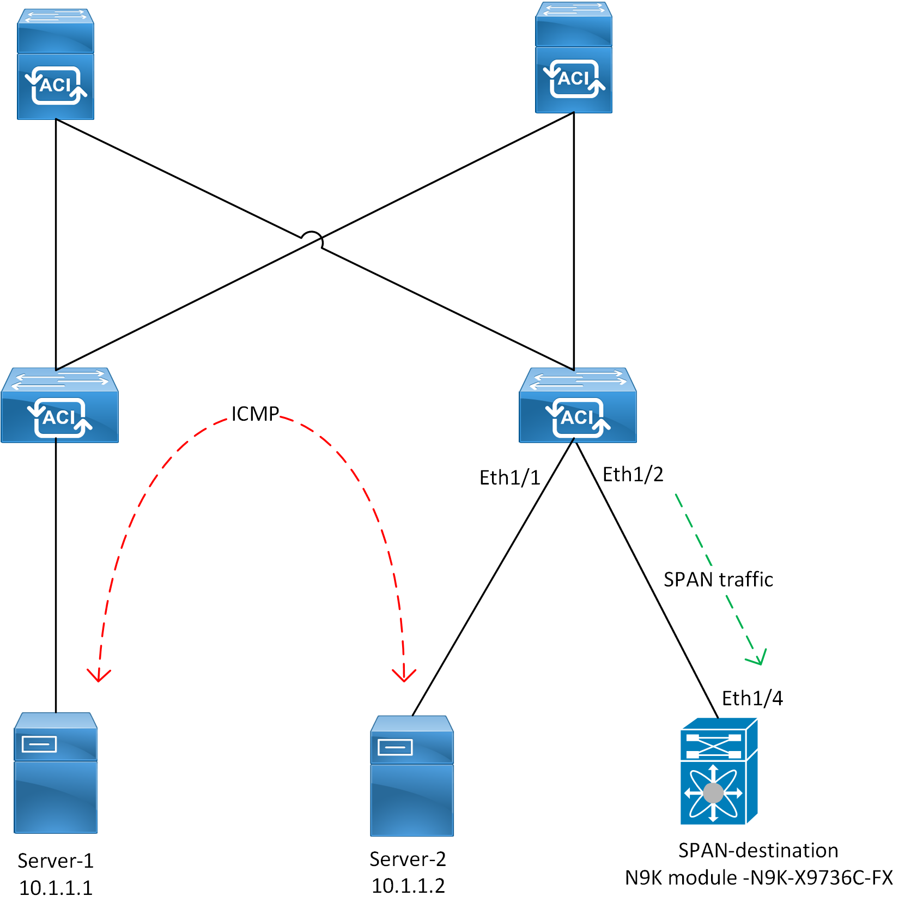

This lab configures a local Access Switch Port Analyzer (SPAN) session on Cisco ACI. To validate the SPAN functionality, a Cisco Nexus 9000 device is used as the SPAN destination (monitoring tool). The Nexus 9000's SPAN-to-CPU capability, combined with the Ethanalyzer tool embedded in its operating system, enables it to serve as an effective monitoring tool.

Ethanalyzer is an integrated packet analyzer in NX-OS, built on the command-line version of Wireshark. It can inspect packets that are either sent to the switch's supervisor or generated by the supervisor itself.

SPAN-to-CPU allows traffic from a specified interface on the Nexus switch to be redirected to its CPU interface. Once the traffic is punted to the CPU, Ethanalyzer can be used to capture and analyse the packets of interest.

## Lab Topology

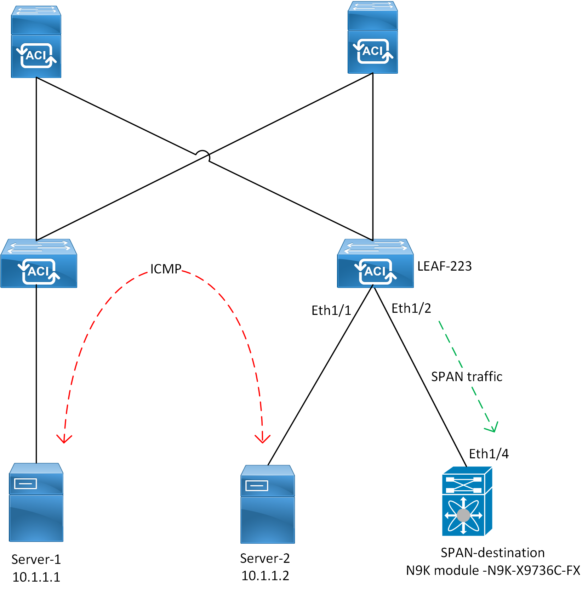

The topology above is used for this lab exercise. Server-1 and Server-2 are in the same EPG and Server-2 is used as the source of the SPAN session. A Cisco Nexus 9000 switch is then used as the SPAN destination (i.e. monitoring station) and packets will be analysed from the device.

## Pre-requisites

Before configuring ACI SPAN, ensure that the endpoints in ACI are properly learned within their respective EPGs and can communicate with each other.

In this lab, the servers (endpoints) are successfully learned in their assigned EPG.

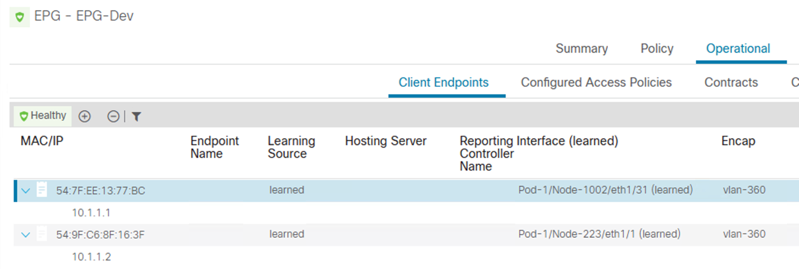

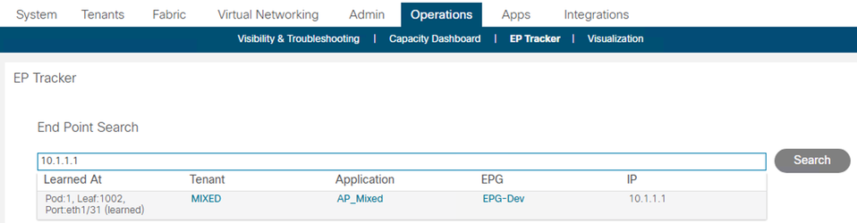

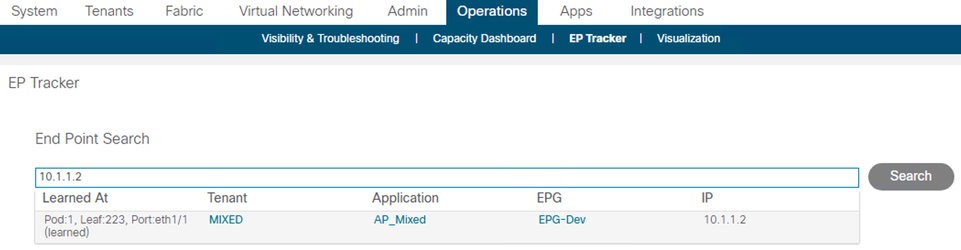

## ACI SPAN Configuration & Verifications

SPAN copies traffic from the configured source port and sends the copied traffic to the configured destination (where a network analyzer is connected) for further analysis.

!!! info
    For a local SPAN configuration, traffic on a source port is monitored and sent to a destination port local to the same leaf node.

SPAN is configured on ACI as follows.

Navigate to Fabric >> Access Policies >> Polices >> Troubleshooting >> SPAN

1. Configure the SPAN Destination Group.

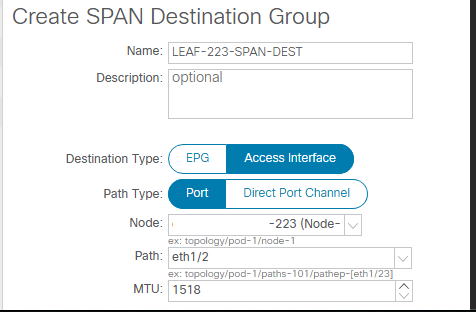

2. Configure the SPAN Source Group

The SPAN source group requires association with the Destination Group and the Source interface. The SPAN source is where the direction of desired traffic to be monitored is defined along with the source port whose traffic will be copied to the destination interface.

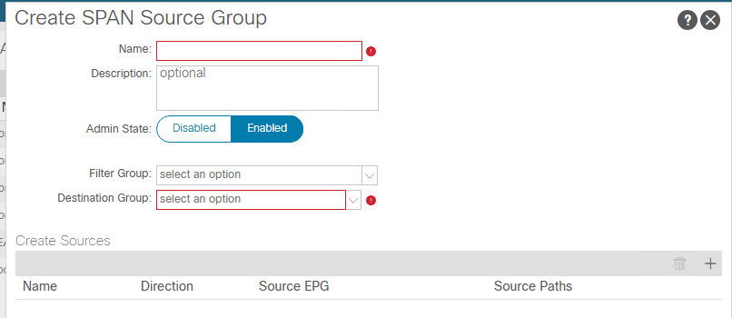

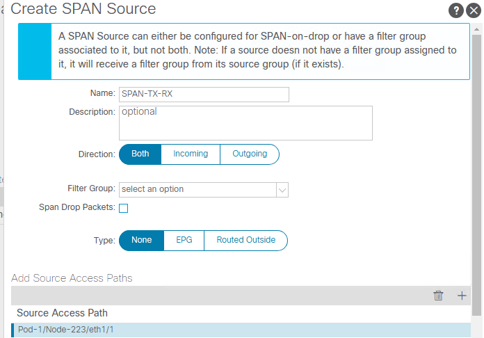

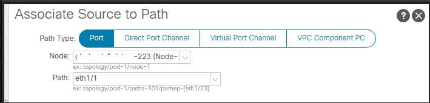

The SPAN Source Group is configured with all its associated objects as follows:

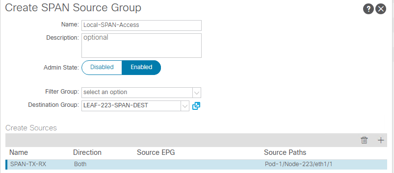

The desired operational status of the configured SPAN session can be observed:

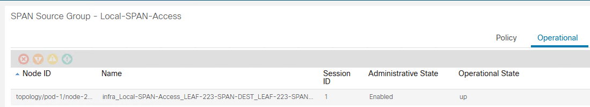

The SPAN session is Enabled and its Operational State is "up".

## Nexus SPAN-to-CPU & Ethanalyzer

As mentioned before, a Cisco Nexus 9000 will be used as a destination monitoring station. By default, SPAN replication is performed in hardware, and the supervisor CPU is not involved. To use the Ethanalayzer capability, which only analyzes control plane packets, the SPAN-to-CPU capability is used. The SPAN-to-CPU functionality copies data plane traffic (in this case, SPAN packets) and sends it to the CPU. From this point, the Ethanalyzer is then able to analyze traffic from the SPAN session.

Enable SPAN-to-CPU using the following configuration:

```text
monitor session 1
  source interface ethernet1/4 both
  destination interface sup-eth0
  no shutdown
```

This configuration was used on the Nexus 9000 switch;

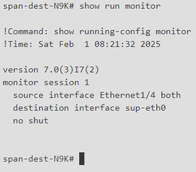

Interface Ethernet1/4 is connected to the ACI leaf port that is receiving SPAN traffic. This interface (Eth1/4) remains in its default state with no configuration applied.
Verify the monitor session on the Nexus 9000 device:

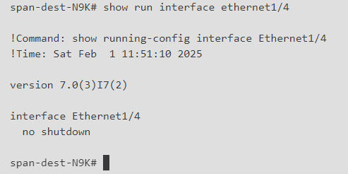

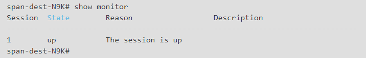

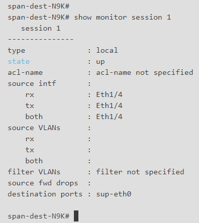

The monitor session is in an "up" state.

## Testing

To test if the Nexus 9000 switch is indeed receiving SPAN packets from ACI, Ethanalyzer is used.

1. Server-2 initiates ICMP traffic to Server-1.

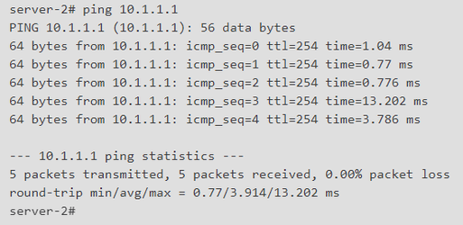

2. On the Nexus 9000 switch the ICMP packets are successfully captured for analysis:

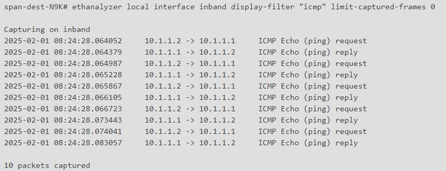

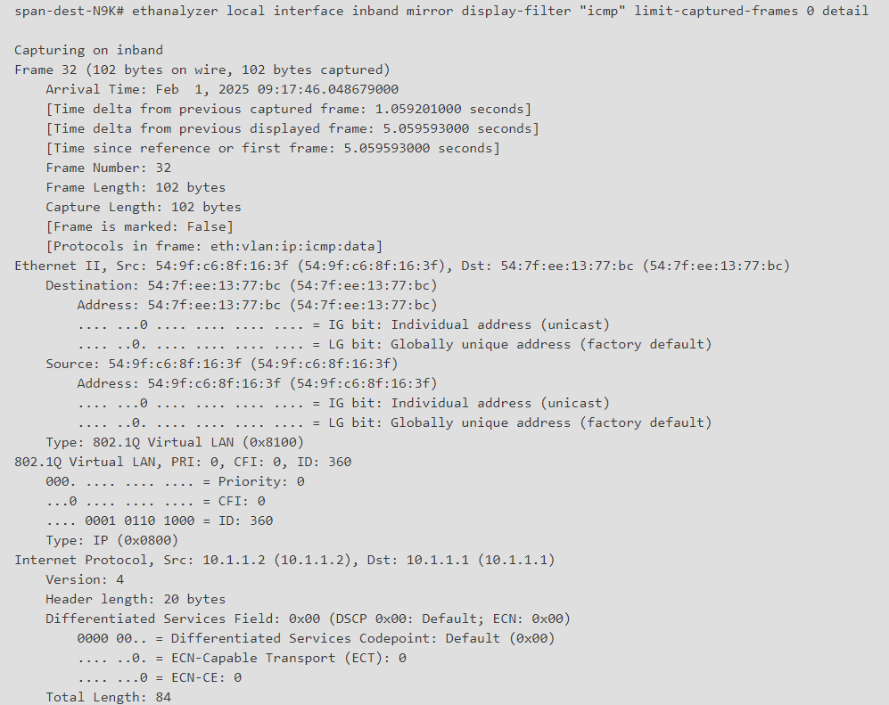

This lab successfully demonstrated the configuration and verification of a local SPAN session in Cisco ACI, with a Cisco Nexus 9000 switch serving as the SPAN destination. By leveraging the SPAN-to-CPU capability, traffic was redirected to the Nexus CPU interface and analysed using Ethanalyzer, a built-in packet capture tool in NX-OS.
