# Cisco ACI Multi-Site Configuration

!!! note
    This lab was conducted in a controlled environment. Any configurations in a production network should be implemented during a designated maintenance window. Additionally, always refer to official Cisco documentation relevant to your specific hardware and software.

## Introduction

Cisco ACI Multi-Site is a robust solution for building scalable, distributed data centers. In this architecture, each site runs as an independent ACI fabric managed by its own APIC cluster. To unify management and policy control across all sites, Cisco introduces the Nexus Dashboard Orchestrator (NDO). Acting as a centralized policy engine, the NDO provides a single point of visibility and configuration, enabling seamless application deployment and consistent policy enforcement across multiple locations.

Communication between the NDO and each APIC cluster occurs over the out-of-band management network. For inter-site data communication, a Layer 3 Inter-Site Network (ISN) is used. This ISN acts as a routed backbone connecting the ACI fabrics, enabling endpoint reachability across sites.

As part of the fabric integration with the ISN, spine switches at each site peer with the ISN using OSPF. This dynamic routing setup allows the spines to exchange reachability information with the external ISN routers. Once basic connectivity is established, MP-BGP EVPN is used to extend the overlay control plane between sites. Through MP-BGP EVPN peering over the ISN, the sites exchange endpoint information (such as MAC and IP) to ensure seamless Layer 2 and Layer 3 connectivity across the entire Multi-Site fabric.

This lab provides a guide on the full bring-up process of a Cisco ACI Multi-Site deployment—from onboarding fabrics into the NDO, to configuring the ISN and establishing OSPF and MP-BGP EVPN peering across the sites.

The diagram below reflects the logical topology of this lab.

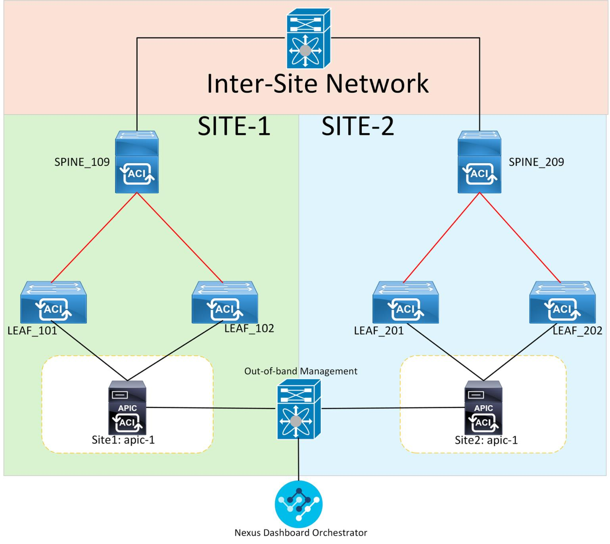

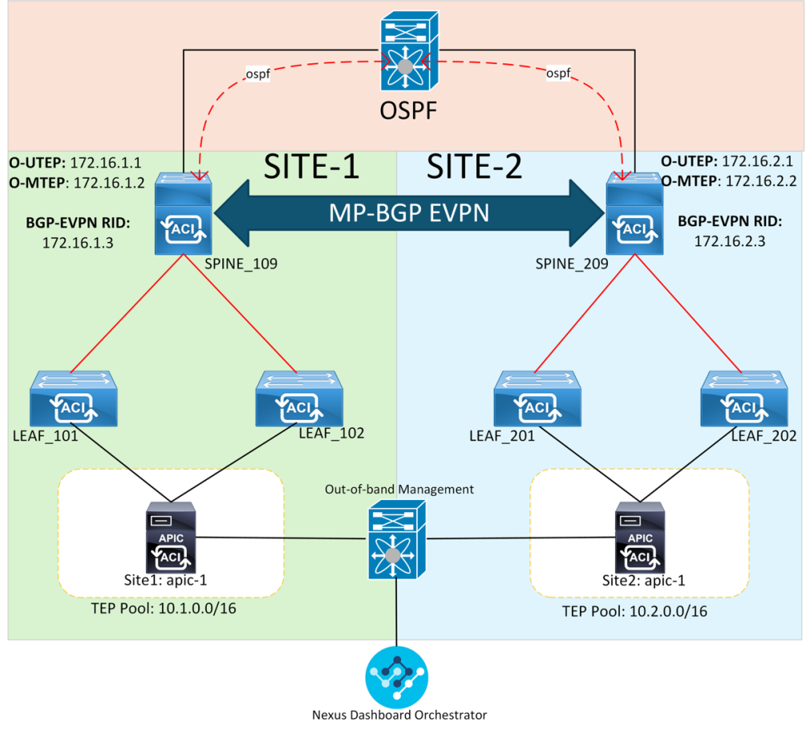

## ACI Fabrics Parameters Verification

Ensure that each site is configured with its respective BGP autonomous system (AS) number and the spine is selected as the route-reflector node for that site.

On the APIC GUI, Navigate to System >> System Settings >> BGP Route Reflector:

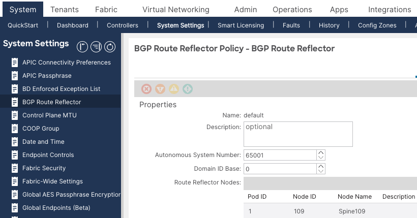

Ensure that the BGP Route Reflector policy is applied to the Pod Policy Group

On the APIC GUI, navigate to Fabric >> Fabric Policies >> Pods >> Click on the Pod Policy Group and verify that the BGP Route Reflector Policy is attached or associated to the Pod Policy group.

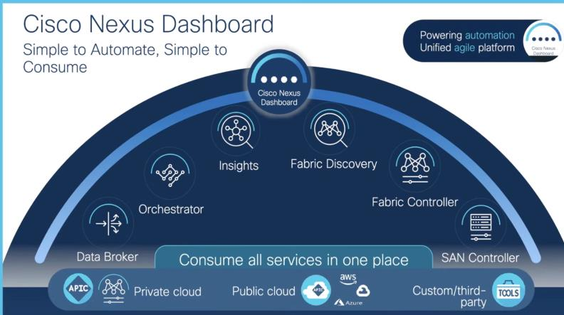

Ensure that the following are in place on the individual fabrics:

- VLAN Pool with VLAN 4
- External Routed Domain
- AAEP
- Interface Policy Group that is associated to the Spine Interfaces connecting to the ISN device(s)

## Add ACI Fabrics to the Nexus Dashboard

Before ACI fabrics can be managed in any way by the Nexus Dashboard Orchestrator, they need to be added to the Nexus Dashboard platform. The Cisco Nexus Dashboard is a central management console for multiple data center sites and a common platform for hosting Cisco data center applications, such as the Nexus Dashboard Orchestrator, Nexus Dashboard Insights and the Nexus Dashboard Fabric Controller.

Although multiple services can be deployed on top of the Nexus Dashboard platform, this lab only focuses on the Orchestrator service. This lab does not show the initial deployment to bring up a Nexus Dashboard cluster. The Nexus Dashboard is already in place, ready to have ACI fabrics to be onboarded.

The steps below show how to add Cisco ACI fabrics to the Nexus Dashboard.

Login to the Nexus Dashboard.

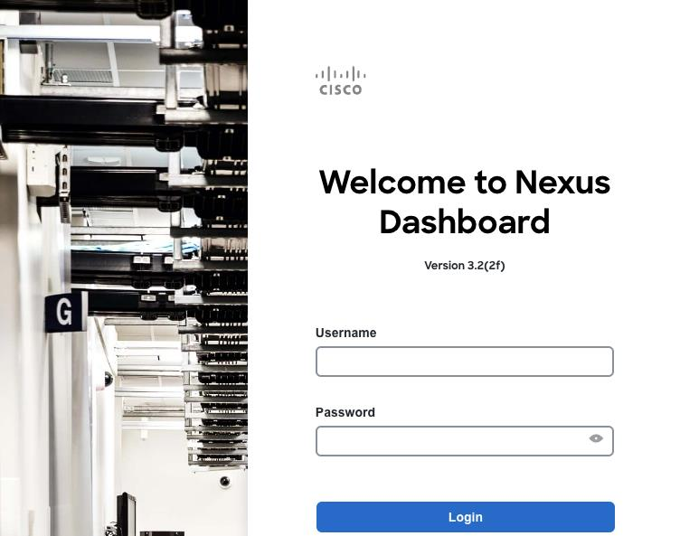

Verify the Nexus Dashboard Software Version and Installed Services.

Click on the Question Mark, top right screen and Click on About Nexus Dashboard

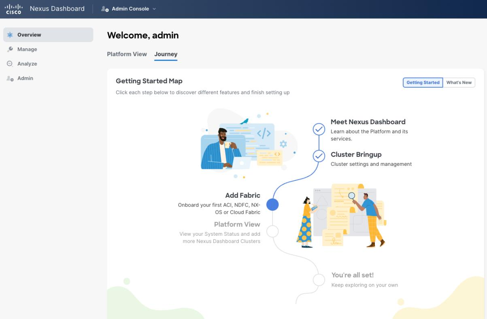

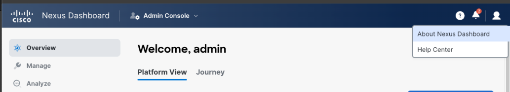

Start to onboard the ACI fabrics:

Navigate to Manage >> Fabrics

Initially, the are no Fabrics added.

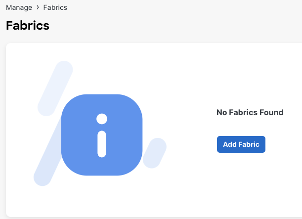

To onboard an ACI fabric, the mandatory fields required are:

1. The Hostname/IP address of the site’s APIC mgmt address
2. Login credentials (Username & Password) for that specific ACI fabric

Click on “Add Fabric”.

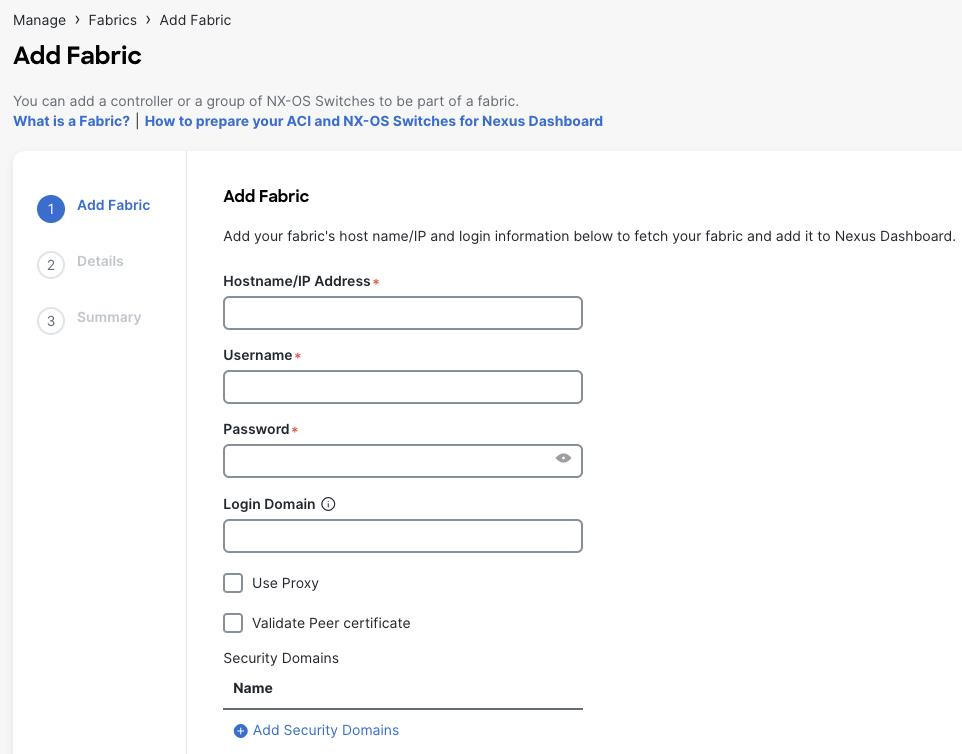

Enter the desired name of your ACI Site and its respective location.

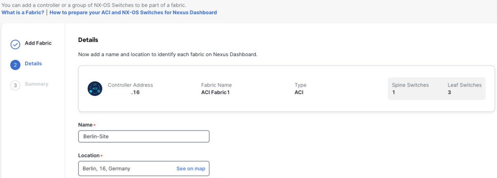

It is evident that Nexus dashboard already has visibility to the site’s inventory (number of spine switches and leaf switches shown).

The Summary tab shows the information that has been entered to on-board an ACI fabric. This tab gives the administrator the opportunity to perform final verifications before saving the configuration.

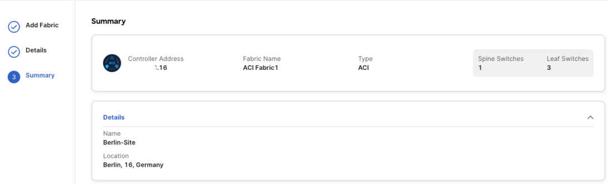

Click Save.

The fabric is successfully added.


The “Controllers” tab gives information regarding the controllers management IP address, hardware serial number and the Software version running on the APIC.

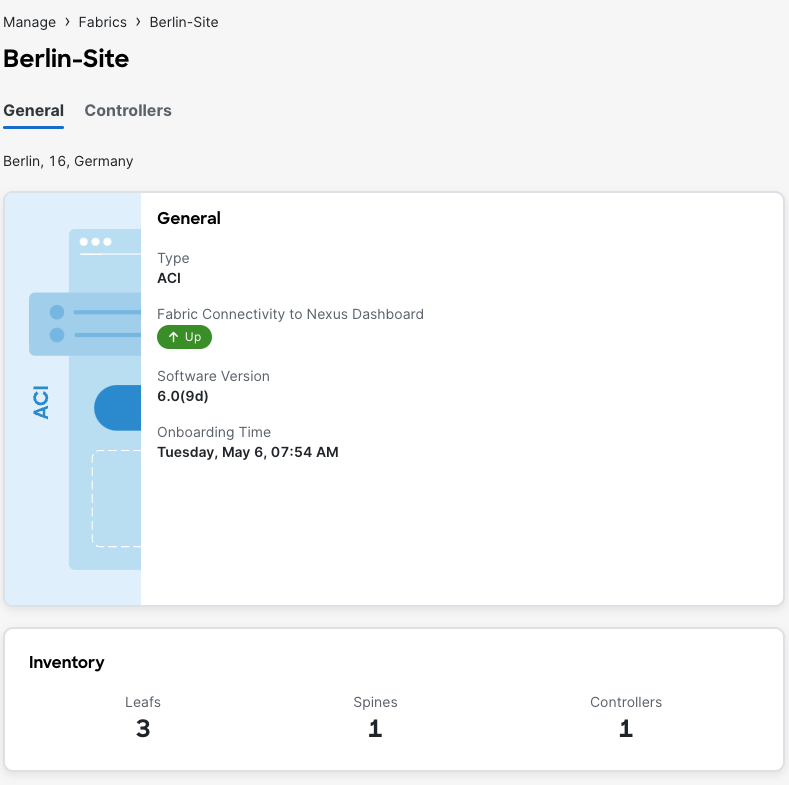

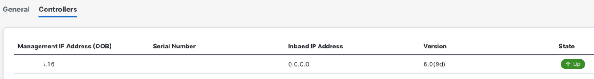

Add the second fabric to the Nexus Dashboard using the same steps outline above.

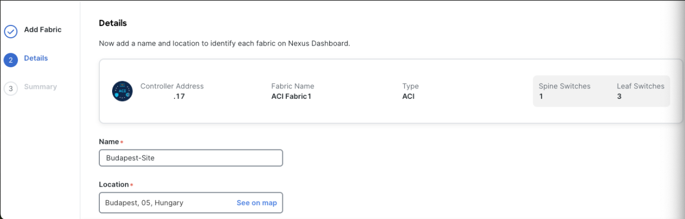

Verify that the “Fabric Connectivity to Nexus Dashboard” is “Up”.


Click on Controller to verify the Serial Numbers of the APIC controller in the respective onboarded site.

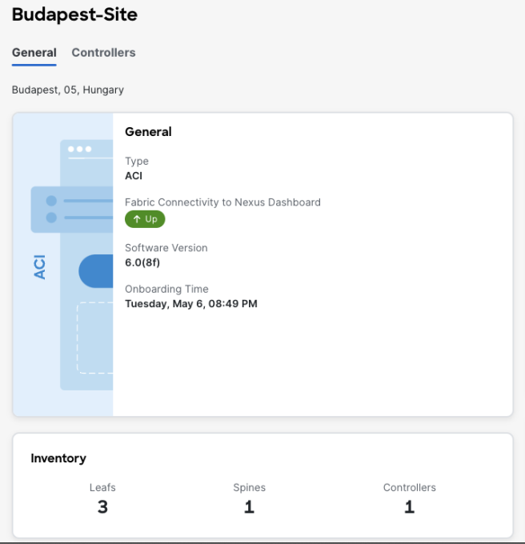

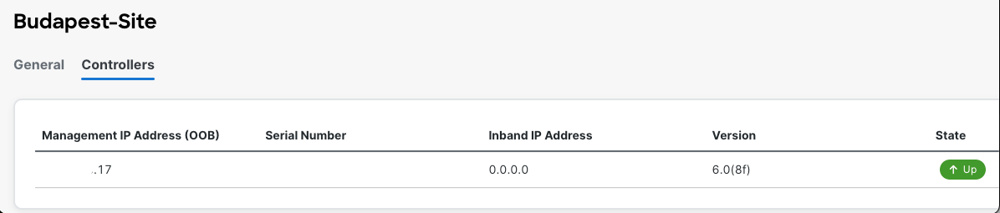

Navigate to the “Overview” tab to view the summary of the Nexus Dashboard Platform Health, the number and types of Fabrics onboarded. In this lab, 2 ACI fabrics are onboarded on the Nexus Dashboard platform.

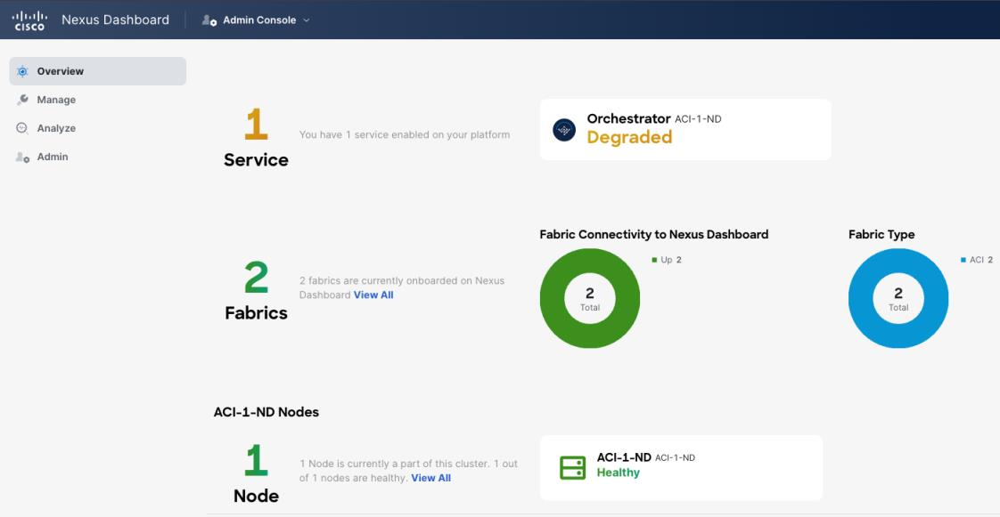

Navigate to Manage >>Fabrics to view the onboarded ACI fabrics, their Health Score, Fabric Type, Connectivity status and firmware versions running on the APICs of the 2 fabrics. These verifications showcase how the Nexus Dashboards is a single pane of glass providing visibility across different fabrics.

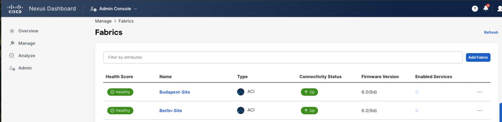

## Add and Manage ACI Fabrics on the Nexus Dashboard Orchestrator

After the successful onboarding of the Cisco ACI fabrics on the Nexus Dashboard, the ACI Fabrics will be added to the Nexus Dashboard Orchestrator. The Cisco Nexus Dashboard Orchestrator (NDO) is a tool/service that runs on top of a Cisco Nexus Dashboard cluster. The main function of Cisco NDO is to configure, orchestrate, and monitor multiple data center sites with a common configuration. Cisco NDO enables you to provision, monitor the health status, and manage the full lifecycle of Cisco ACI networking policies and stretched tenant policies across Cisco ACI sites. These policies can be pushed to the different Cisco APIC domains for rendering them on the physical switches building those fabric.

Adding fabrics to NDO is a crucial step as it enables infrastructure configuration that will enable the Spines to form the OSPF peering with the ISN. Furthermore, additional configuration will be put in place to enable Fabric-to-Fabric connectivity.

Click on drop-down next to “Admin Console” to move on to Nexus Dashboard Orchestrator (NDO).

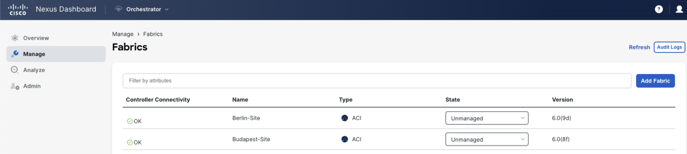

Navigate to Manage >> Fabrics

The ACI sites that were added to the ND platform are shown however their initial state is “Unmanaged” which means that the fabrics are still not under the Orchestrator’s administration domain.

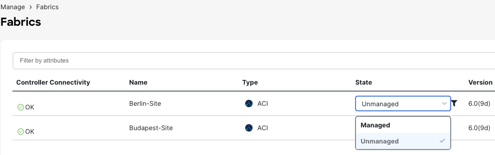

Click on the State drop down-menu to change the fabric state to “Managed”.

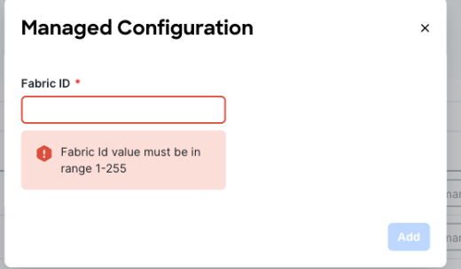

A Fabric ID will be required for the Orchestrator to manage the fabric.

Enter Fabric 1 for the “Berlin” site.

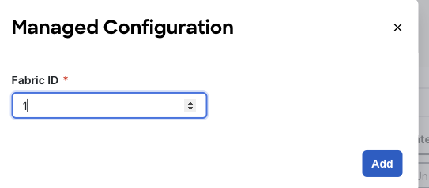

After adding the Fabric ID, the fabric’s State changes to “Managed”.

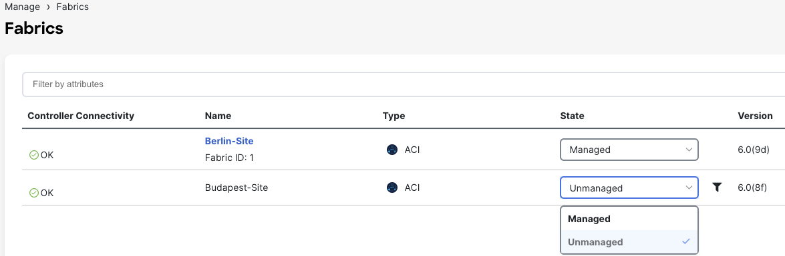

Repeat the same procedure for the second ACI fabric, to get both fabrics to be Managed by the orchestrator.

ACI fabrics are now in Managed State as required.

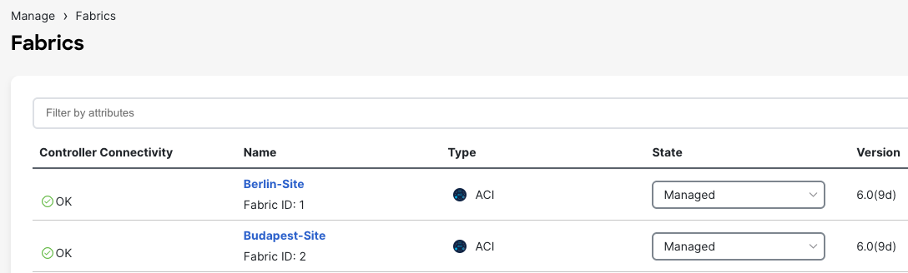

## Fabric to Fabric Connectivity Configuration

Site to Site connectivity is established through the Inter-Site network. To establish this communication between the 2 ACI fabrics/sites, each Site is required to have an OSPF peering with the Inter-Site Network (ISN) and an MP-BGP EVPN peering between the spines of the two sites. The ISN can be a generic Layer 3 infrastructure that interconnects different sites in the Cisco ACI Multi-Site solution.

Spines are connected to the ISN device(s) using point-to-point subinterfaces with a fixed VLAN 4. Sub-interfaces are configured on the spine interfaces and ISN interfaces.

Routing information between sites is made possible using the following components:

1. BGP-EVPN Router ID (EVPN-RID)

    This is a unique address defined on each spine node in a Cisco ACI fabric, which is used for MP-BGP EVPN adjacencies between the spines in different sites.

2. Overlay Unicast TEP (O-UTEP)

    This is a common anycast address that is shared by all spine nodes in a pod at the same site. The O-UTEP identifies the site and the pod. It is used to source and receive unicast VXLAN data-plane-traffic.

    NB: O-UTEP is assigned per pod in each site.

3. Overlay Multicast TEP (O-MTEP)

    This is a common anycast address that is shared by all spine nodes in the same site and is used to perform headend replication for BUM (Broadcast, Unknown Unicast and Multicast traffic).

    NB: O-MTEP is assigned per site, despite the number of pods.

Inter-Fabric Connectivity:

On the Nexus Dashboard Orchestrator, navigate to Manage >> Fabric to Fabric Connectivity >> Configure

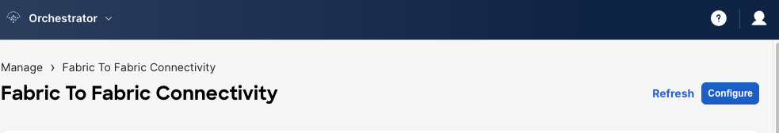

The initial “Configure” page shows the BGP default settings.

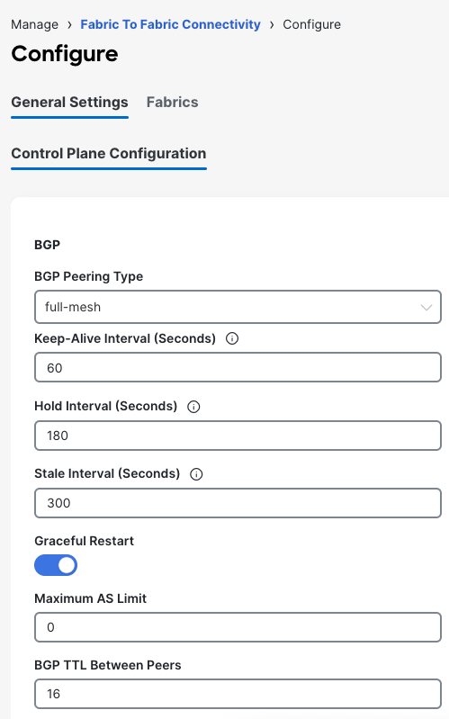

Click on Fabrics:

Both fabrics are ready for Interface-fabric Connectivity.

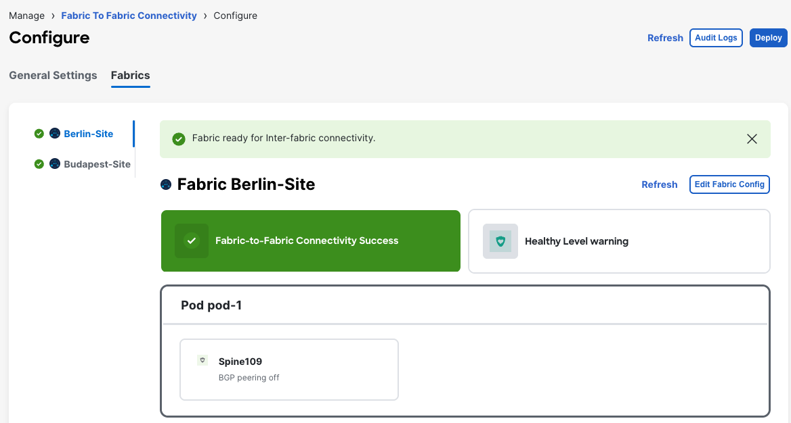

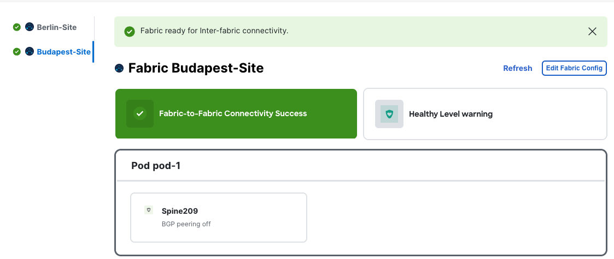

On each site, Click Edit Fabric Config and enter the respective details for each site:

| Berlin-Site | Budapest-Site |
|---|---|
| Multi-Fabric : | Multi-Fabric : |
| Overlay Multicast TEP: 172.16.1.2 | Overlay Multicast TEP: 172.16.2.2 |
| BGP AS Number: AS65001 (automatically populated from the fabric’s settings) | BGP AS Number: AS65002 (automatically populated from the fabric’s settings) |
| OSPF Area ID: 0 | OSPF Area ID: 0 |
| OSPF Area Type: regular | OSPF Area Type: regular |
| External Routed Domain: Configured on the APIC | External Routed Domain: Configured on the APIC |

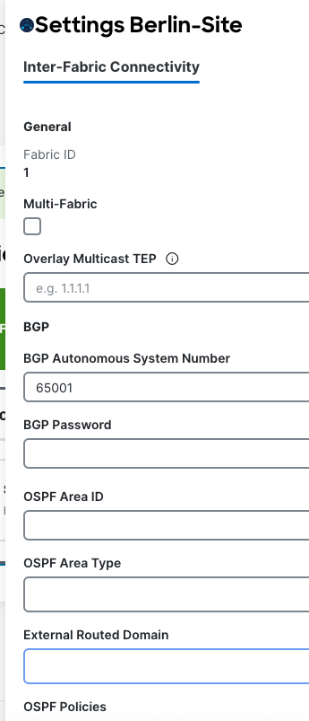

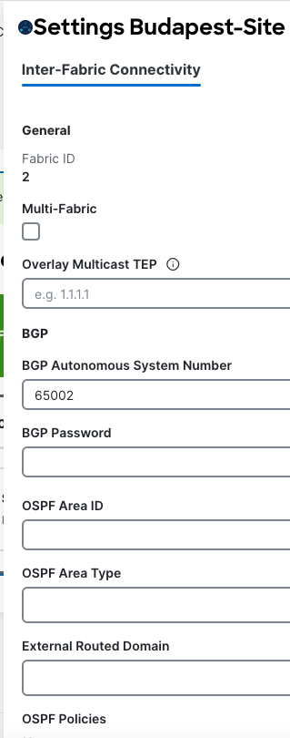

Under OSPF Policies, click on “Add Policy” to create a customized OSPF policy with “network type” Point-to-Point.

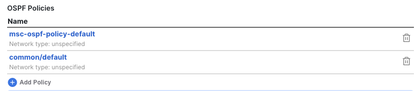

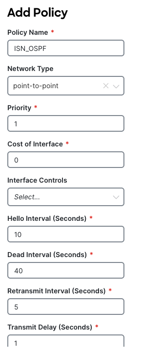

This is the policy that will be applied on the Spine interfaces that are peering with the ISN interfaces.

After Saving the Fabric Configurations, click on Pod

The Overlay Unicast TEP (O-UTEP) is configured here:

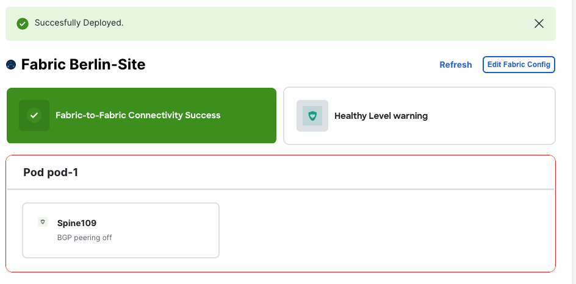

Click on the Spine to add the interfaces that are connected to the ISN.

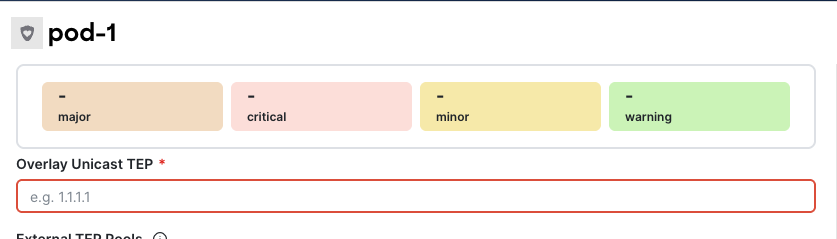

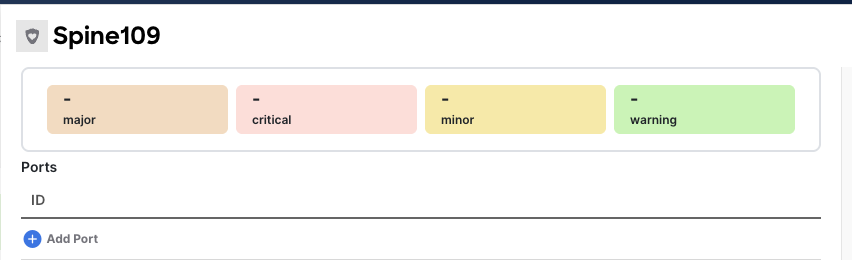

The wizard to configure each interface pops up, requiring the Port ID, IP address for OSPF peering and the MTU size.

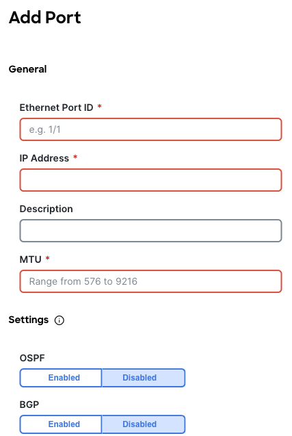

Since this lab uses OSPF peering between the spines and ISN, it is required to Enable OSPF and associate the OSPF Policy to the previously created OSPF policy.

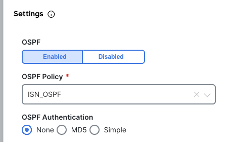

After configuring all ports:

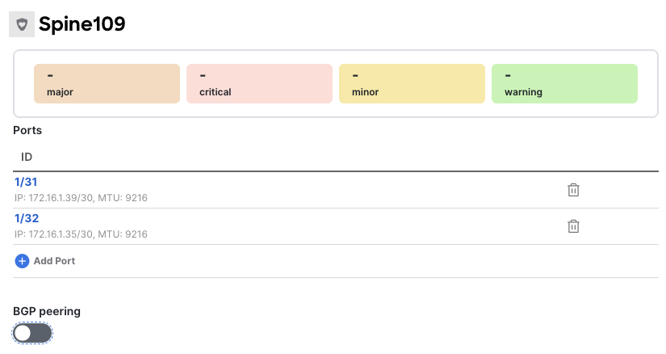

Toggle the “BGP peering” knob to configure the BGP EVPN Router-ID of the spine.

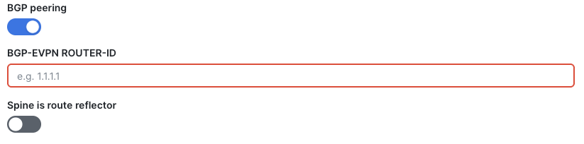

Save and Deploy to the fabric. Ensure that the “BGP peering is on”.

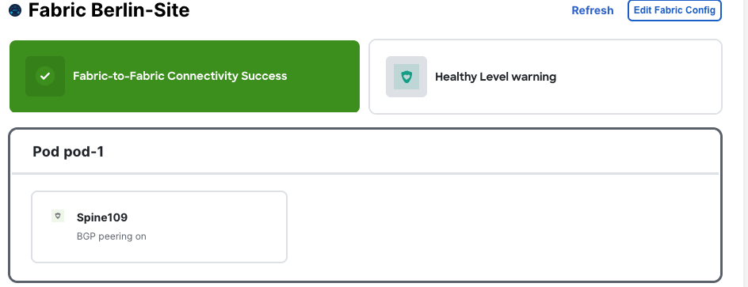

Repeat the same procedure for the second site.

The resulting configurations can be seen from each respective APIC.

On the APIC GUI, navigate to Tenants >> infra

Under Policies >> Protocol >> Fabric Ext Connection Policies >> Fabric Ext Connection Policy. The Data Plane Multicast and Unicast TEPs are configured under this policy.

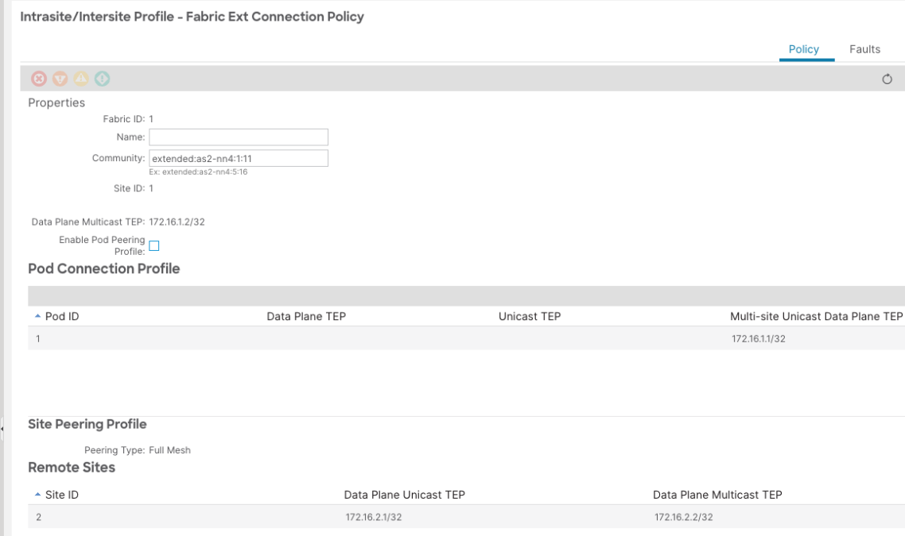

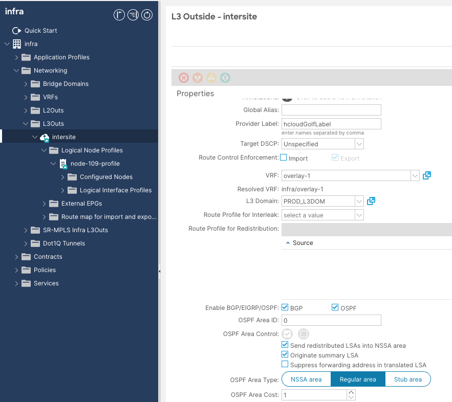

An L3Out profile is configured under the infra tenant. This is the L3Out configuration that enables OSPF connectivity between the Spine and ISN.

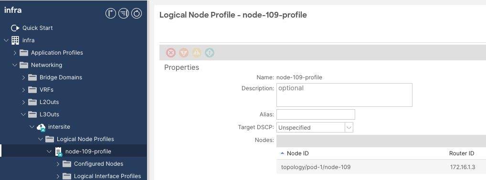

The Logical Node Profile shows the ACI node (Spine109) and the configured Router-ID

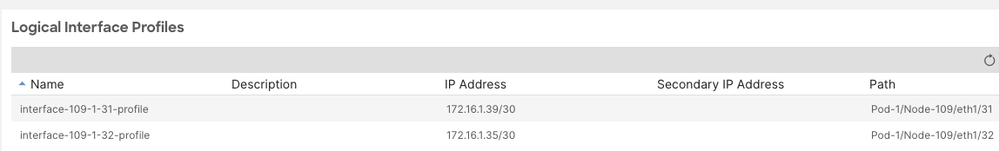

The Logical Interface Profile shows the Spine interfaces and the IP addresses that were configured.

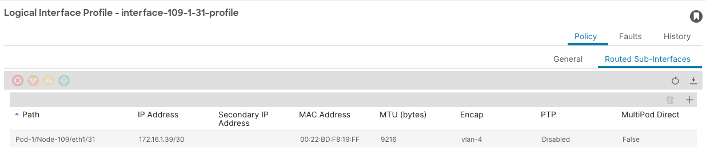

Each interface is by default configured as a sub-interface with VLAN encapsulation 4.

## Inter Site Network (ISN) Configuration

After the successful configuration on all sites, the ISN configurations can be put in place on the ISN device. The configurations are shown in the section below.

The ISN represents the Layer 3 network that is used as a transit between multiple ACI fabrics. The ISN enables spines from different fabrics to form BGP-EVPN peering and VXLAN tunnels are formed across sites to enable endpoints from different sites to communicate if required.

The LLDP neighborship between the ISN router and Spines in the ACI fabrics is shown below.

```text
ISN# show lldp neig
Capability codes:
  (R) Router, (B) Bridge, (T) Telephone, (C) DOCSIS Cable Device
  (W) WLAN Access Point, (P) Repeater, (S) Station, (O) Other
Device ID            Local Intf      Hold-time Capability Port ID
Spine109             Eth1/49         120        BR          Eth1/32
Spine209             Eth1/50         120        BR          Eth1/32
Spine109             Eth1/51         120        BR          Eth1/31
Spine209             Eth1/52         120        BR          Eth1/31
```

OSPF peering between the spines in different ACI fabrics and the ISN is required. The ISN interfaces that connect to the ISN should be configured as sub-interfaces using encapsulation VLAN 4. The full configuration of the ISN is shown below.

```text
feature lldp
feature ospf
!
vrf context ISN
  address-family ipv4 unicast
!
interface Ethernet1/49.4
  description ** To Site1 Spine109 E1/32 **
  mtu 9216
  encapsulation dot1q 4
  vrf member ISN
  no ip redirects
  ip address 172.16.1.34/30
  ip ospf network point-to-point
  ip router ospf ISN area 0.0.0.0
  no shutdown
!
interface Ethernet1/50
  mtu 9216
  no shutdown

interface Ethernet1/50.4
  description ** To Site2 Spine209 E1/32 **
  mtu 9216
  encapsulation dot1q 4
  vrf member ISN
  no ip redirects
  ip address 172.16.2.34/30
  ip ospf network point-to-point
  ip router ospf ISN area 0.0.0.0
  no shutdown
!
interface Ethernet1/51
  mtu 9216
  no shutdown

interface Ethernet1/51.4
  description ** To Site1 Spine109 E1/31 **
  mtu 9216
  encapsulation dot1q 4
  vrf member ISN
  no ip redirects
  ip address 172.16.1.38/30
  ip ospf network point-to-point
  ip router ospf ISN area 0.0.0.0
  no shutdown
!
interface Ethernet1/52
  mtu 9216
  no shutdown

interface Ethernet1/52.4
  description ** To Site2 Spine209 E1/31 **
  mtu 9216
  encapsulation dot1q 4
  vrf member ISN
  no ip redirects
  ip address 172.16.2.38/30
  ip ospf network point-to-point
  ip router ospf ISN area 0.0.0.0
  no shutdown
!
router ospf ISN
  log-adjacency-changes
  vrf ISN
```

## ACI and ISN OSPF Verification

This section verifies that OSPF peering is successfully provisioned between the Spines of each site and the ISN.

ISN device:

```text
ISN# show ip ospf neig vrf ISN
 OSPF Process ID ISN VRF ISN
 Total number of neighbors: 4
 Neighbor ID     Pri State           Up Time Address         Interface
 172.16.1.3        1 FULL/ -         00:02:30 172.16.1.35    Eth1/49.4
 172.16.2.3        1 FULL/ -         00:07:17 172.16.2.35    Eth1/50.4
 172.16.1.3        1 FULL/ -         00:02:33 172.16.1.39    Eth1/51.4
 172.16.2.3        1 FULL/ -         00:07:21 172.16.2.39    Eth1/52.4
```

SPINE – Site-1

```text
Spine109# show ip ospf neighbors vrf overlay-1
 OSPF Process ID default VRF overlay-1
 Total number of neighbors: 2
 Neighbor ID     Pri State            Up Time Address        Interface
 172.16.1.34       1 FULL/ -          00:38:46 172.16.1.34   Eth1/32.32
 172.16.1.34       1 FULL/ -          00:38:48 172.16.1.38   Eth1/31.31
```

SPINE – Site-2

```text
Spine209# show ip ospf neighbor vrf overlay-1
 OSPF Process ID default VRF overlay-1
 Total number of neighbors: 2
 Neighbor ID     Pri State            Up Time Address        Interface
 172.16.1.34       1 FULL/ -          00:46:01 172.16.2.38   Eth1/31.31
 172.16.1.34       1 FULL/ -          00:45:57 172.16.2.34   Eth1/32.32
```

## Fabric Inter-Connectivity Verification

Navigate to the Orchestrator >> Overview >> Global View.

A green line between the 2 sites is an indicator of a successful inter-site connectivity.

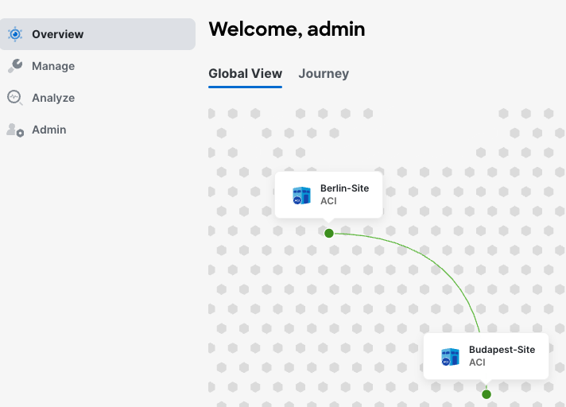

Berlin-Site (Site 1) has a successful BGP-EVPN peering to the Budapest-Site (Site 2)

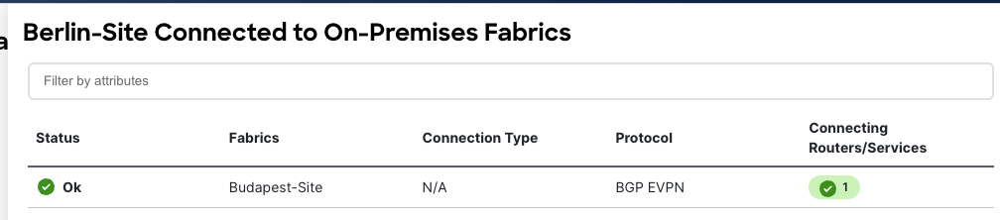

Budapest-Site (Site 2) has a successful BGP-EVPN peering to the Berlin-Site (Site 1)

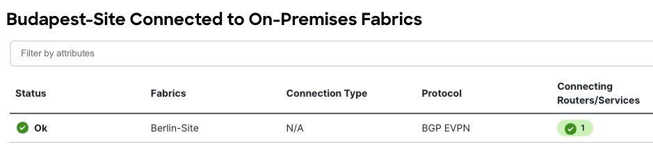

Navigate to Manage >> Fabric To Fabric Connectivity

Verify that the BGP EVPN Status is Up along with the Tunnel Status

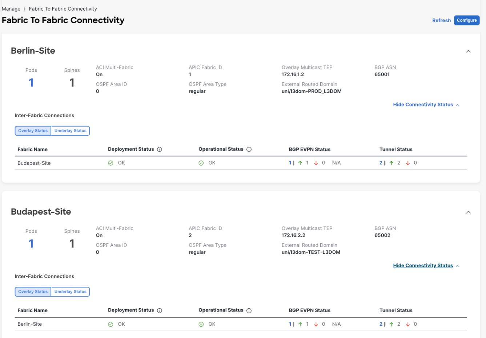

Verify that all Spines interfaces connected to the ISN are up and the OSPF peering status is up.

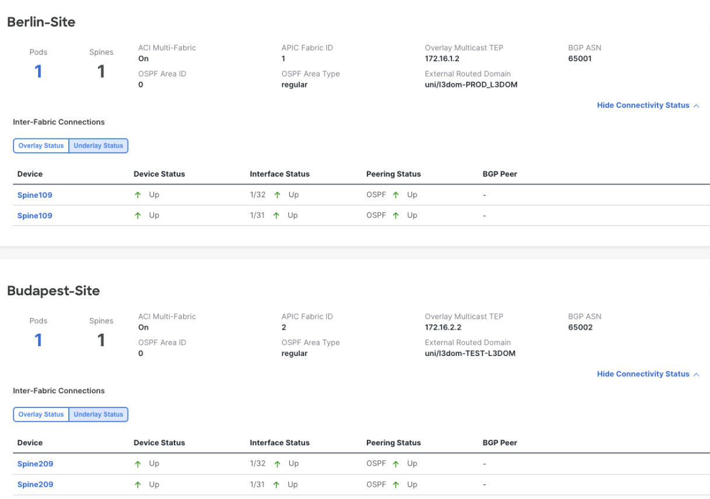

Verify the MP-BGP L2VPN EVPN peering between the sites via the Spines CLI.

SPINE – Site-1

```text
Spine109# show bgp l2vpn evpn summary vrf overlay-1
BGP summary information for VRF overlay-1, address family L2VPN EVPN
BGP router identifier 172.16.1.3, local AS number 65001
BGP table version is 70, L2VPN EVPN config peers 1, capable peers 1
0 network entries and 0 paths using 0 bytes of memory
BGP attribute entries [0/0], BGP AS path entries [0/0]
BGP community entries [0/0], BGP clusterlist entries [0/0]

Neighbor         V    AS MsgRcvd MsgSent   TblVer   InQ OutQ Up/Down
State/PfxRcd
172.16.2.3       4 65002     61       61      70      0    0 00:52:33 0
```

SPINE – Site-2

```text
Spine209# show bgp l2vpn evpn summary vrf overlay-1
BGP summary information for VRF overlay-1, address family L2VPN EVPN
BGP router identifier 172.16.2.3, local AS number 65002
BGP table version is 5, L2VPN EVPN config peers 1, capable peers 1
0 network entries and 0 paths using 0 bytes of memory
BGP attribute entries [0/0], BGP AS path entries [0/0]
BGP community entries [0/0], BGP clusterlist entries [0/0]

Neighbor         V    AS MsgRcvd MsgSent   TblVer   InQ OutQ Up/Down
State/PfxRcd
172.16.1.3       4 65001     62       62       5      0    0 00:53:20 0
```

Verify the overlay-1 interfaces on the Spines.

```text
Spine109# show ip interface vrf overlay-1
lo17, Interface status: protocol-up/link-up/admin-up, iod: 82, mode: dci-ucast
  IP address: 172.16.1.1, IP subnet: 172.16.1.1/32
  IP broadcast address: 255.255.255.255
  IP primary address route-preference: 0, tag: 0
lo18, Interface status: protocol-up/link-up/admin-up, iod: 83, mode: dci-mcast-hrep
  IP address: 172.16.1.2, IP subnet: 172.16.1.2/32
  IP broadcast address: 255.255.255.255
  IP primary address route-preference: 0, tag: 0
lo19, Interface status: protocol-up/link-up/admin-up, iod: 84, mode: mscp-etep
  IP address: 172.16.1.3, IP subnet: 172.16.1.3/32
  IP broadcast address: 255.255.255.255
  IP primary address route-preference: 0, tag: 0

Spine109# show ip interface vrf overlay-1
lo12, Interface status: protocol-up/link-up/admin-up, iod: 87, mode: dci-ucast
  IP address: 172.16.2.1, IP subnet: 172.16.2.1/32
  IP broadcast address: 255.255.255.255
  IP primary address route-preference: 0, tag: 0
lo13, Interface status: protocol-up/link-up/admin-up, iod: 88, mode: dci-mcast-hrep
  IP address: 172.16.2.2, IP subnet: 172.16.2.2/32
  IP broadcast address: 255.255.255.255
  IP primary address route-preference: 0, tag: 0
lo14, Interface status: protocol-up/link-up/admin-up, iod: 89, mode: mscp-etep
  IP address: 172.16.2.3, IP subnet: 172.16.2.3/32
  IP broadcast address: 255.255.255.255
  IP primary address route-preference: 0, tag: 0
```

Interfaces Definitions:

dci-unicast

Anycast address that is unique per each ACI site. This IP address is assigned to all the spines connected to the ISN and it is used for intersite unicast traffic. #data traffic only

dci-mcast-hrep

Anycast address unique per each ACI site. This IP address is assigned to all the spines connected to the ISN and it is used for intersite BUM traffic.

mscp-etep

This is the BGP-EVPN router id assigned to the spine in each site. It is used for inter-site BGP EVPN peering. #control plane traffic only

## BGP EVPN Router-ID advertisement from Site-1 to Site-2 Example

The steps below show-cases how the Router-ID is advertised from one site to the other. This example uses Site-1 BGP-EVPN Router-ID (172.16.1.3) as an example.

172.16.1.3 is a directly connected loopback interface on Spine109

```text
Spine109# show ip route vrf overlay-1 | grep 172.16.1.3/32
172.16.1.3/32, ubest/mbest: 2/0, attached, direct
```

The ISN learns of this prefix via OSPF.

```text
ISN# show ip route 172.16.1.3 vrf ISN
IP Route Table for VRF "ISN"
'*' denotes best ucast next-hop
'**' denotes best mcast next-hop
'[x/y]' denotes [preference/metric]
'%<string>' in via output denotes VRF <string>

172.16.1.3/32, ubest/mbest: 2/0
    *via 172.16.1.35, Eth1/49.4, [110/2], 1d00h, ospf-ISN, intra
    *via 172.16.1.39, Eth1/51.4, [110/2], 1d00h, ospf-ISN, intra
```

The ISN advertises this route to Spine209 via OSPF. Site-2 spine receives this prefix as an OSPF intra-area route

```text
Spine209# show ip route vrf overlay-1
172.16.1.3/32, ubest/mbest: 2/0
    *via 172.16.2.38, eth1/31.31, [110/3], 1d00h, ospf-default, intra
    *via 172.16.2.34, eth1/32.32, [110/3], 1d00h, ospf-default, intra
```

Spine209 (Site-2) injects this route from OSPF into the ISIS routing process, which is the routing process that runs in the ACI fabric underlay.

The following route-map is used to distribute OSPF routes into ISIS

interleak_rtmap_infra_prefix_remote_pod_teps

This route map contains several prefix-lists. In this use case our prefix-list of interest is

infra_prefix_ipn_remote_subnets

```text
Spine209# show route-map interleak_rtmap_infra_prefix_remote_pod_teps
route-map interleak_rtmap_infra_prefix_remote_pod_teps, permit, sequence 1
  Match clauses:
    ip address prefix-lists: infra_prefix_ipn_remote_subnets infra_prefix_remote_msite_teps
  Set clauses:
    metric 63
route-map interleak_rtmap_infra_prefix_remote_pod_teps, permit, sequence 2
  Match clauses:
    ip address prefix-lists: infra_prefix_all_ifcs_tep_range
  Set clauses:
    metric 63
```

A look into this prefix-list shows us the redistributed route from OSPF into ISIS

```text
Spine209# show ip prefix-list infra_prefix_ipn_remote_subnets
ip prefix-list infra_prefix_ipn_remote_subnets: 1 entries
   seq 1 permit 172.16.1.3/32
```

All leafs in this fabric will now be aware of this route under the ISIS routing process. This can be observed from the Leaf switch’s routing table.

```text
Leaf201# show ip route vrf overlay-1
172.16.1.3/32, ubest/mbest: 1/0
    *via 10.2.224.65, eth1/49.9, [115/64], 1d00h, isis-isis_infra, isis-l1-ext
```

## References

- [https://www.cisco.com/c/en/us/solutions/collateral/data-center-virtualization/application-centric-infrastructure/white-paper-c11-739609.html](https://www.cisco.com/c/en/us/solutions/collateral/data-center-virtualization/application-centric-infrastructure/white-paper-c11-739609.html)
- [https://www.cisco.com/c/en/us/support/docs/cloud-systems-management/application-policy-infrastructure-controller-apic/214270-configure-aci-multi-site-deployment.html](https://www.cisco.com/c/en/us/support/docs/cloud-systems-management/application-policy-infrastructure-controller-apic/214270-configure-aci-multi-site-deployment.html)
- [https://www.cisco.com/c/en/us/td/docs/dcn/whitepapers/cisco-multi-site-deployment-guide-for-aci-fabrics.html](https://www.cisco.com/c/en/us/td/docs/dcn/whitepapers/cisco-multi-site-deployment-guide-for-aci-fabrics.html)
