# Cisco ACI Multi-Pod Fabric Bring Up – from Scratch!

## Overview

Cisco ACI Multi-Pod, falls under the Cisco distributed data centres solution whereby there are 2 distinct Pods that belong to the same APIC cluster/domain; which means that the separate pods are managed as if they were a single logical entity. Each pod contains its own set of spine and leafs and its own set of control-plane protocols (ISIS, COOP and MP-BGP) which helps with fault isolation within each pod. The ACI Multi-Pod solution uses an external layer 3 network known as the Inter-Pod Network (IPN) to interconnect the pods. Logical configurations like tenants, VRFs, Bridge Domains and EPGs are applicable and usable between multiple pods. In a multi-pod setup, endpoints can belong to the same EPG despite their physical location.

This lab goes through the deployment of the Cisco ACI Multi-Pod architecture. The lab contains of 2 pods with the seed pod containing 2 APICs and the 3rd APIC is contained in the second pod. Each pod contains a single spine which and the spine switch from each pod is directly connected to an IPN device. OSPF routing protocol is used for peering between each Spine and the IPN. The two IPN devices peer with each other using OPSF as well.

The Multi-Pod deployment is conducted as follows:

1. Bring up the Pod 1 fabric.
2. Register all nodes in Pod 1
3. Use the MultiPod Wizard to configure the L3Out connectivity between Pod 1 Spines and the IPN
4. Configure the Inter-Pod Network
5. Use the MultiPod Wizard to configure the L3Out connectivity between Pod 2 Spines and the IPN
6. Register Pod-2 devices

Fabric Bring up troubleshooting commands and outputs are also shown at the end of the lab.

For comprehensive information about Cisco ACI Multi-Pod please refer to:

- ACI Multi-Pod Whitepaper: [https://www.cisco.com/c/en/us/solutions/collateral/data-center-virtualization/application-centric-infrastructure/white-paper-c11-737855.html](https://www.cisco.com/c/en/us/solutions/collateral/data-center-virtualization/application-centric-infrastructure/white-paper-c11-737855.html)
- ACI Multi-Pod Configuration Guide: [https://www.cisco.com/c/en/us/solutions/collateral/data-center-virtualization/application-centric-infrastructure/white-paper-c11-739714.html](https://www.cisco.com/c/en/us/solutions/collateral/data-center-virtualization/application-centric-infrastructure/white-paper-c11-739714.html)
- ACI Single Pod Fabric Bring Up: [https://github.com/TitusM/Cisco-Data-Center/blob/main/ACI/Cisco-ACI-v6.0-Fabric-Bring-Up.pdf](https://github.com/TitusM/Cisco-Data-Center/blob/main/ACI/Cisco-ACI-v6.0-Fabric-Bring-Up.pdf)

!!! note
    This lab was conducted in a controlled environment. Any configurations in a production network should be implemented during a designated maintenance window. Additionally, always refer to official Cisco documentation relevant to your specific hardware and software.

## Lab-Setup

This lab consists two pods and an APIC cluster of three nodes. Pod 1 contains 2 APICs and Pod2 contains 1 APIC node. Each Pod contains a single spine and three leafs. The topology diagram below illustrates the physical connections between the hardware, along with the point to point IP addresses that are used for OSPF peering between the Spines and IPN. PIM Bidir and DHCP relay are also configured on the IPN devices.

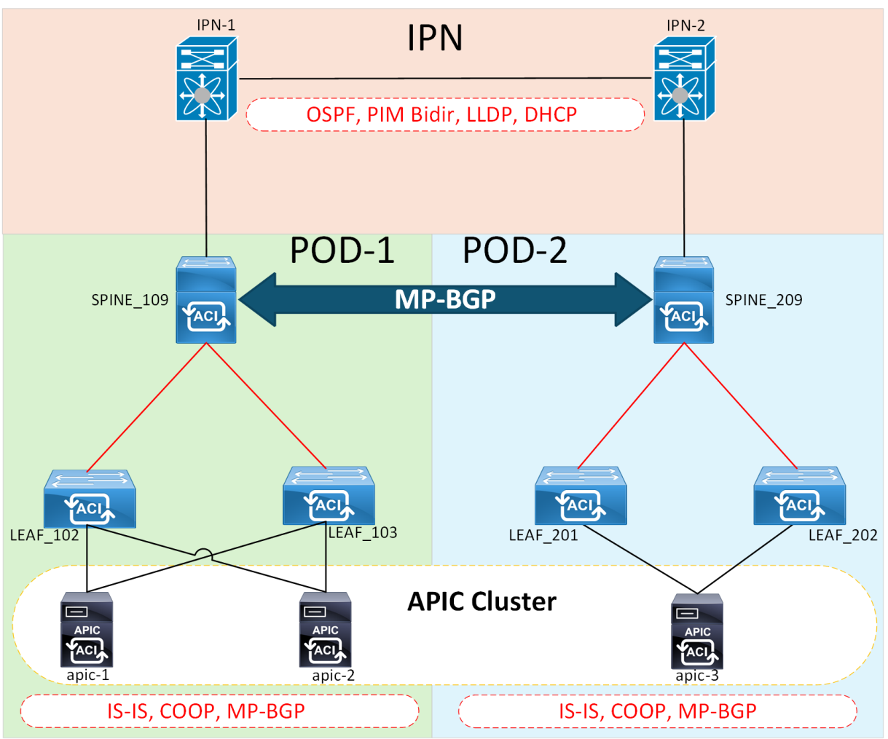

## APIC Cluster Bring Up – Pod 1

Start the initial bootstrap process on APIC 1;

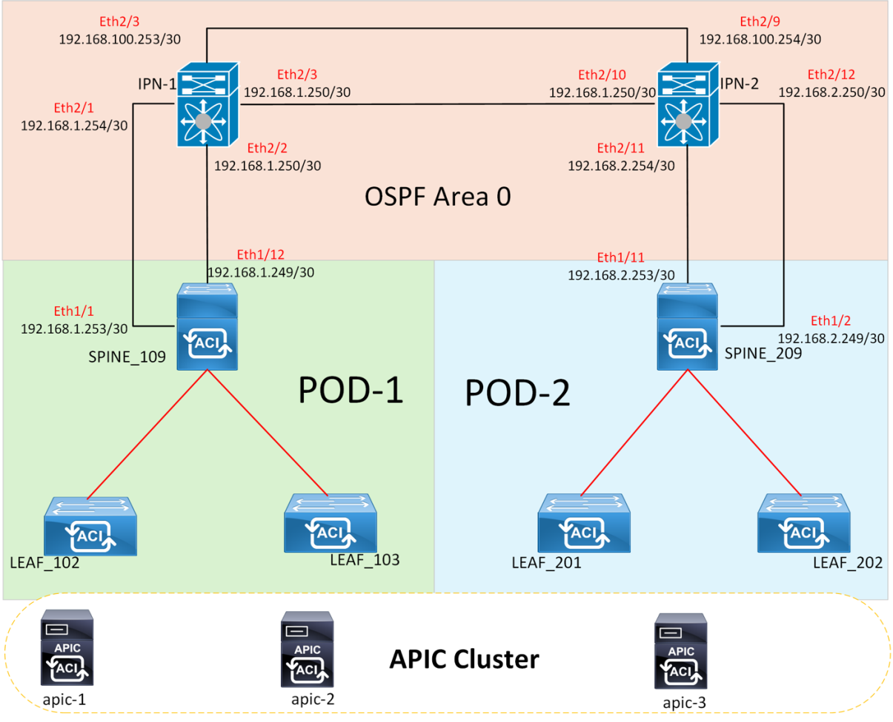

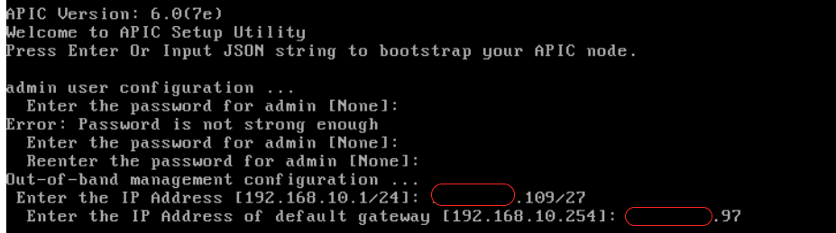

1. Enter the "admin" password that you will use to access the ACI APIC GUI.
2. Enter the out of band IP address and the default gateway.
    - The IP address entered here will be used to access the APIC GUI or CLI

Login the APIC GUI via a web browser and enter the "admin" password that was configured in the prior steps in order to proceed with onboarding the other nodes of the APIC cluster.

Click "Add Controller" to add the details for APIC-2 and APIC-3.

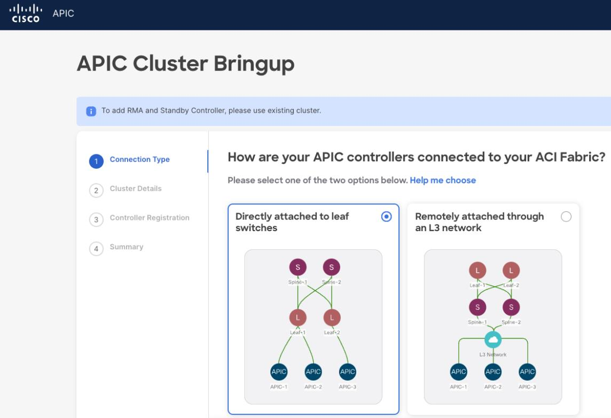

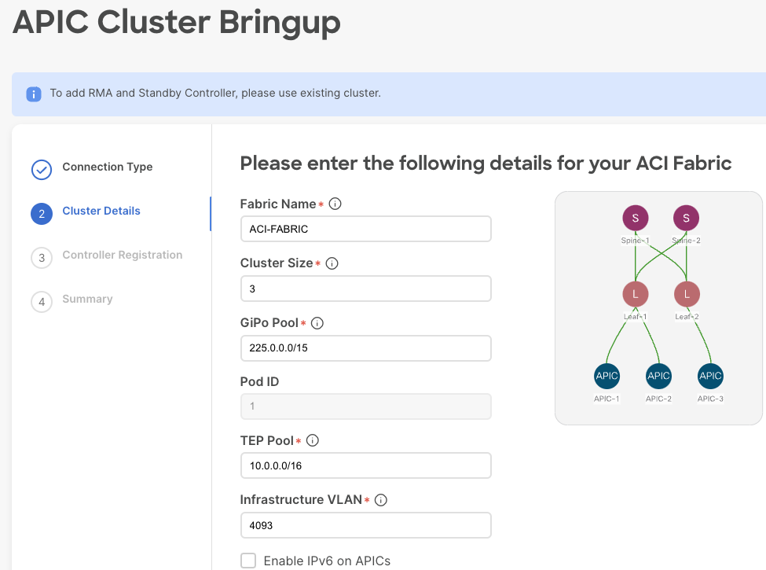

When adding a controller, Start by Entering the CIMC details (IP and login credentials) for that specific node and validate connectivity. The second step of onboarding the controller requires the following details: APIC name, Pod ID and Out of Band IP address that can be used to access the APIC's GUI interface. APIC-3 is also be added at this stage however its Pod ID should be configured as "2.

The Summary tab gives the Overview Details regarding the cluster details and configured details for each APIC node. This is the last verification checkpoint before the cluster can be deployed.

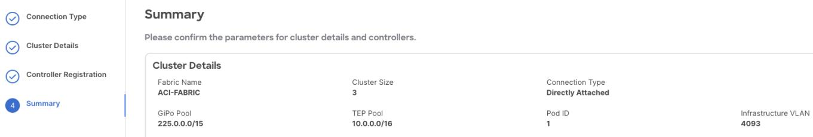

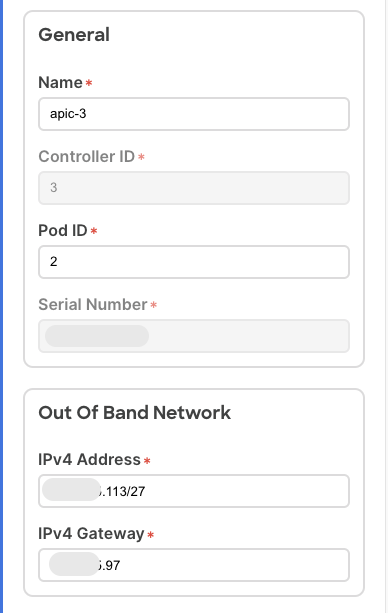


Configure apic-3 with POD ID – 2 as it is connected to Pod 2.

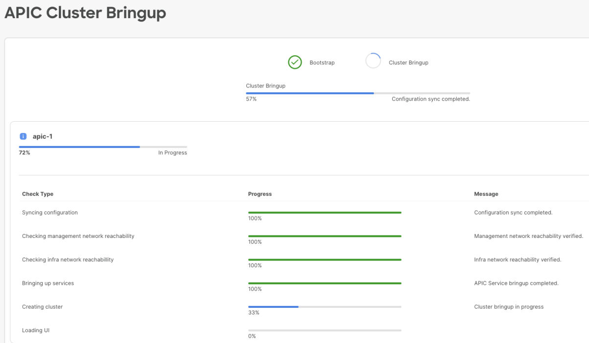

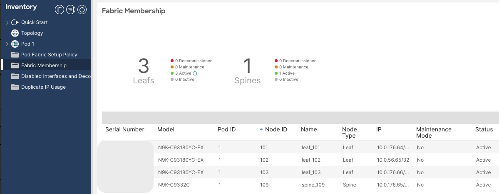

Initiate the Cluster Bring-up:

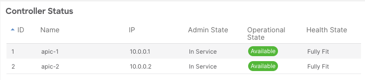

Wait for the Cluster Bringup process to complete

Upon completion, Re-login into the APIC GUI;

## Fabric Nodes Registration

From this point, the ACI nodes in Pod-1 can be registered.

To Register the ACI nodes using the GUI follow the steps below:

Navigate to Fabric >> Inventory >> Fabric Membership >> Nodes Pending Registration.

Right Click on the device and Register the node(s).

At this point the spine and all leafs in Pod-1 are successfully registered in the ACI fabric.

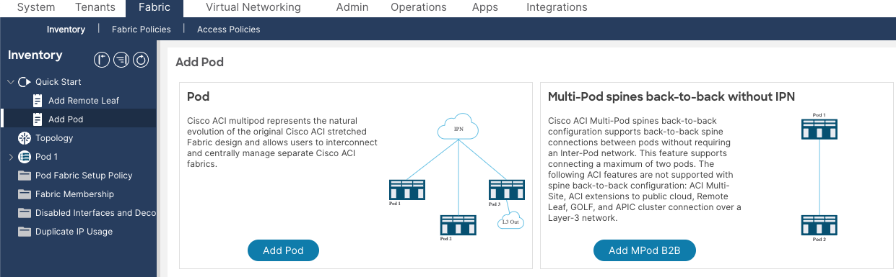

The APIC cluster of 2 APICs in Pod-1 is observed to have formed successfully and is fully fit.

Configure the initial required parameters in Pod-1 (i.e. NTP, OOB management, BGP {AS number & designate spines as the route reflectors}, DNS etc).

After the successful deployment of the first Pod, the next step is to use the ACI Multi-pod wizard from the APIC GUI.

## Configuring the Multi-Pod setup

The wizard takes care of configuring:

- An L3Out in the infra tenant specifying the spine nodes and interfaces to connect each pod to the IPN.
- Access policies for the spine interfaces connecting to the IPN.
- An internal TEP pool to be assigned to each pod.
- An external TEP pool to be assigned to each pod, used to define the control-plane IP addresses on the spines used for establishing MP-BGP EVPN adjacencies across pods and also to assign an anycast TEP address to each pod used for data-plane traffic.

Navigate to Fabric >> Inventory >> Add Pod

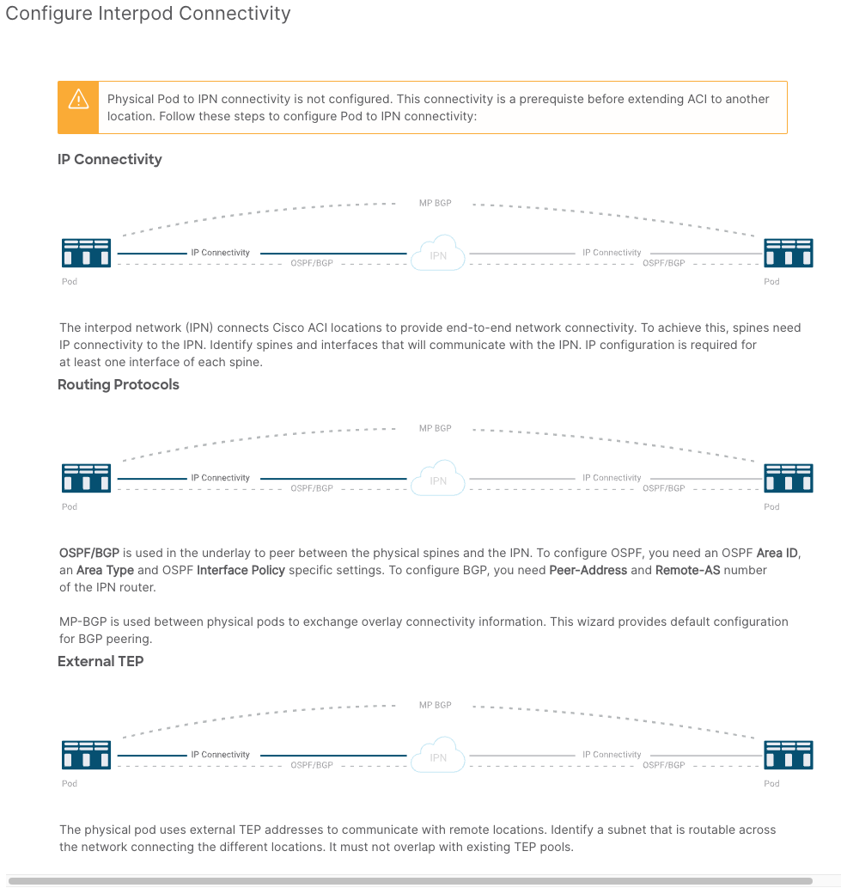

### Inter-Pod Connectivity Start up

The Inter-Pod Configuration wizard will pop up with detailed instructions:

Selected the interfaces on the spine(s) in Pod-1 that are connected to the IPN devices. Assign IP addresses to these interfaces to be able to establish IP connectivity between the spines and IPN devices. Ensure that the MTU configured on these interfaces match the MTU on the IPN interfaces.

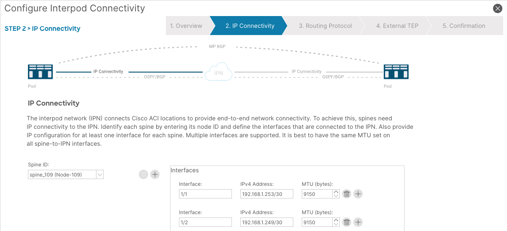

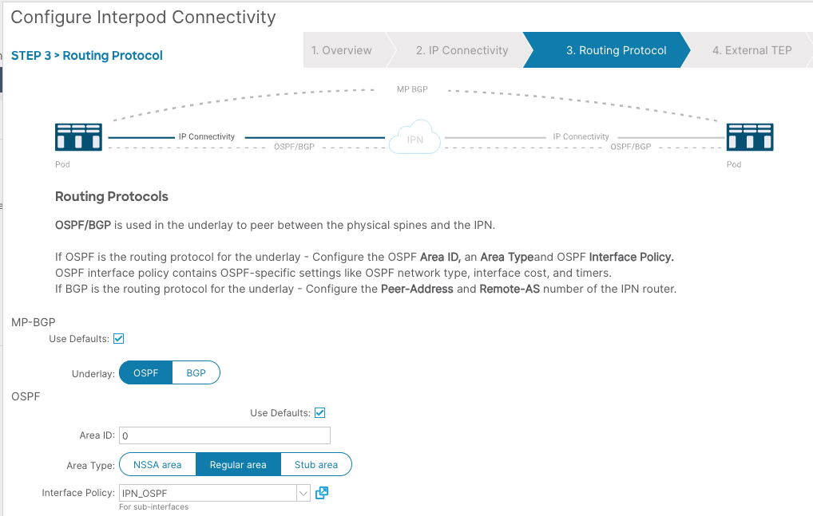

After assign IP addresses on the spine's interfaces, the next step is to configure the OSPF/BGP -based parameters required for peering between spines and IPN devices. This lab uses OSPF and the routing process is configured as a regular area.

The OSPF Interface Policy is required under the configured OSPF routing process. In the Interface Policy, attributes like the network type, interface cost, MTU ignore etc can be configured.

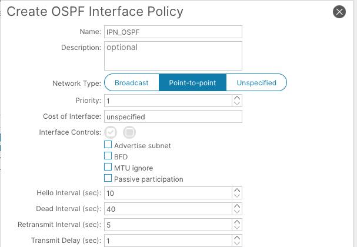

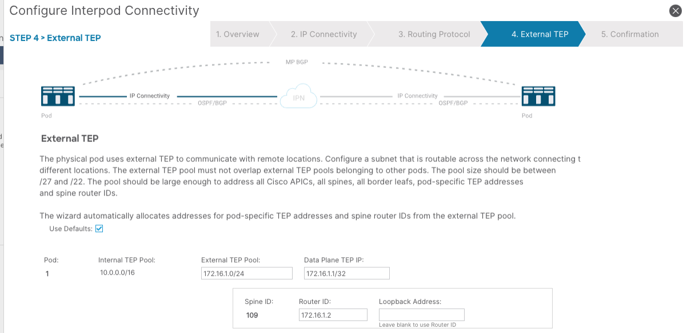

After the completion of OSPF configurations, the next step is to configure the External TEP pool, Data Plane TEP IP and Spine(s) Router ID(s). The External TEP pool must be routable across the IPN and it should have a subnet mask of length between /22 and /29. The External TEP pool is used to assign a unique Router-ID to each spine in the pod and a common Data Plane TEP IP. The Router-ID is used to establish MP-BGP EVPN peering between spines in different Pods. The Data Pane TEP IP represents an anycast TEP IP address used to reach any spines in the respective Pod. The purpose of this configuration is to allow for host reachability between the 2 pods. The spines in a Pod will get host information from a different Pod via the MP-BGP EVPN advertisements (Type-2 EVPN).

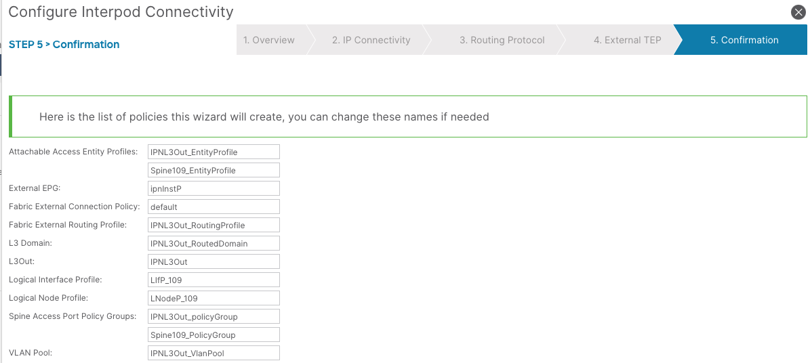

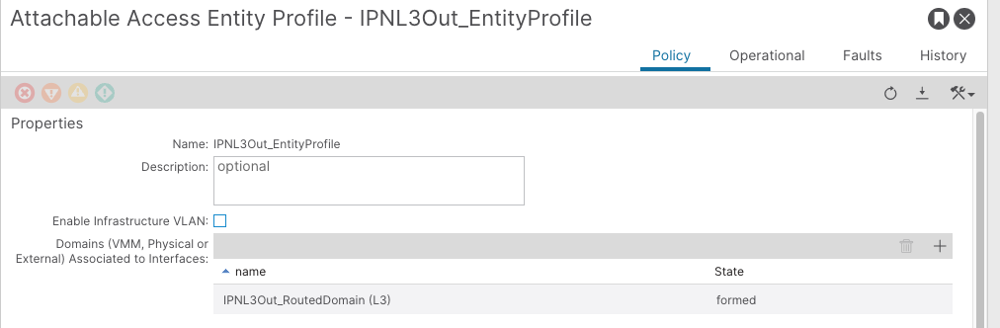

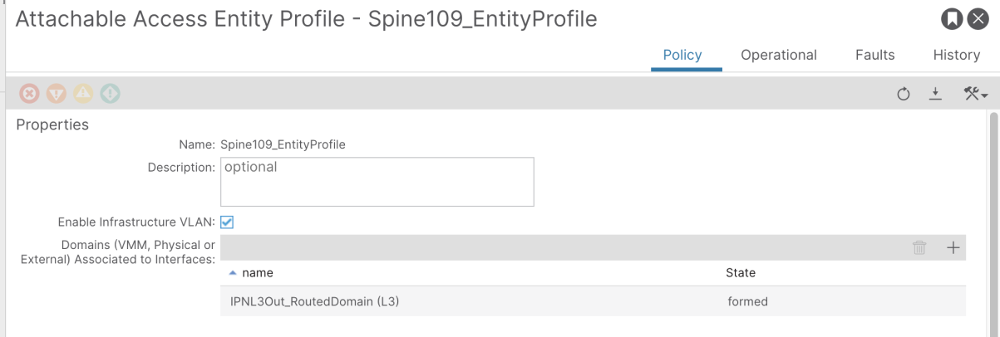

- A Router-ID is unique per-spine
- A Data Plane TEP IP is unique per-pod

After the input of all required parameters, a confirmation Page shows all the list of Policies that will be configured as a result.

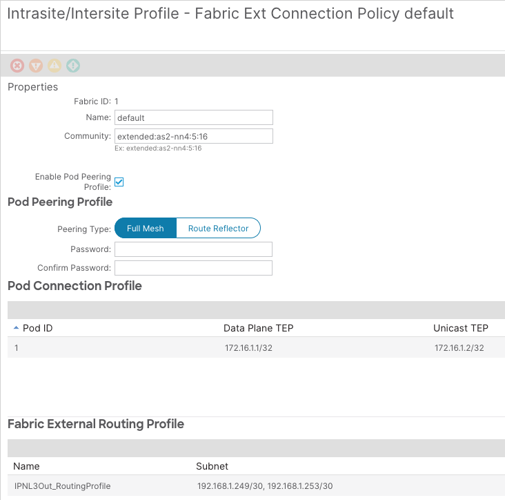

These are the individual objects created from the wizard:

IPN_L3OUT AAEP associated with an L3 Routed Domain

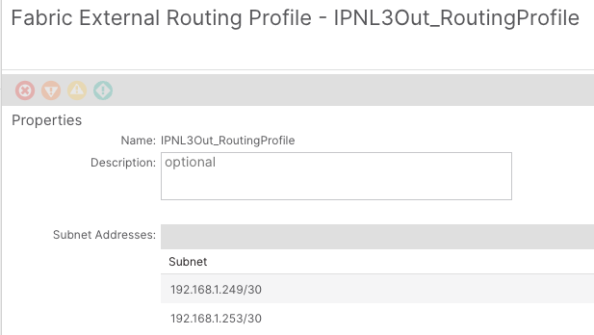

Spine109 AAEP associated with an L3 Routed Domain

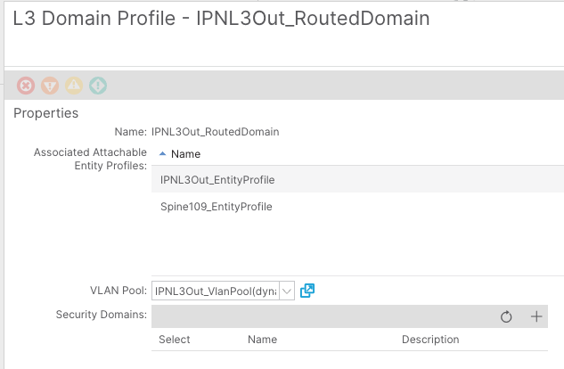

Navigate to Tenants >> Infra >> Policies >> Protocol >> Fabric Ext Connection Policies:

### Fabric External Connection Policy

The "Community" allows PODs to import BGP paths to each other.

The Fabric External Routing Protocol contains subnets big enough to accommodate the required point-to-point IP addresses between the Spines and IPN.

These IPN subnets will be redistributed into the IS-IS routing process.

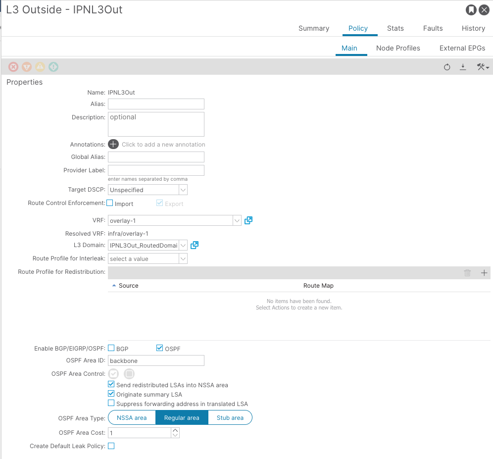

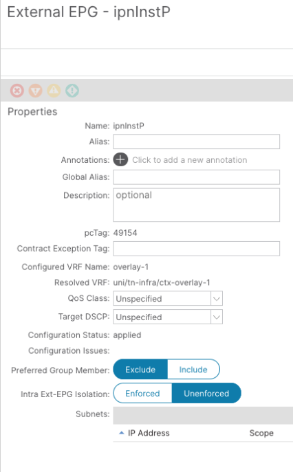

### L3 Domain

Navigate to Tenants >> infra >> Networking >> L3Outs >> IPNL3Out

### OSPF – L3OUT & the External EPG Objects

Logical Interface Profile – showing the Spine sub-interfaces that are configured with the IP addresses for OSPF peering with the IPN.

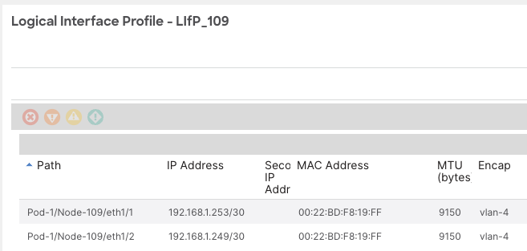

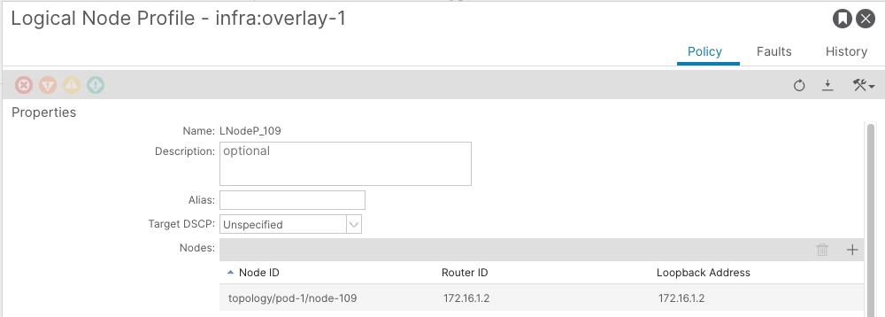

Logical Node Profile – showing the Spine node and its assigned Router-ID.

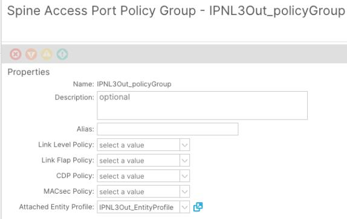

Spine Access Port Policy Groups

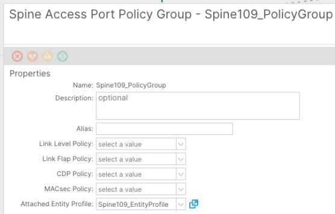

VLAN Pool (with encapsulation – 4)

After this point, there is an option to Add Another Pod which will repeat the same configuration panes, allowing the administrator to add a different Pod. In this lab, the second Pod will be added after setting up the IPN.

Before the IPN configuration is in place, all nodes in Pod-2 do not appear under the "Nodes Pending Registration" section.

The next section goes through the configuration of the IPN. After the successful configuration of the IPN, OSPF peering should be established between the Spine in pod-1 and the IPN device. Furthermore, OSPF peering will be established between the IPN devices. After the mentioned OSPF peerings have been established, the second Pod will be added via the Configuration wizard as shown before to allow Pod-2 devices to be added in the fabric.

## Inter-Pod Network (IPN Configuration)

The IPN requires the following protocols to be configured: LLDP, Multicast (PIM-Bidir), OSPF and DHCP.

### LLDP

Configure LLDP on the IPN devices and verify LLDP neighborship with the Spines.

```text
feature lldp
```

```text
IPN-1# show lldp neig
Capability codes:
  (R) Router, (B) Bridge, (T) Telephone, (C) DOCSIS Cable Device
  (W) WLAN Access Point, (P) Repeater, (S) Station, (O) Other
Device ID                          Local Intf         Hold-time    Capability Port ID
spine_109                          Eth2/1              120          BR           Eth1/1
spine_109                          Eth2/2              120          BR           Eth1/2
IPN-2                        Eth2/3              120          BR           Eth2/9
IPN-2                        Eth2/4              120          BR           Eth2/10
Total entries displayed:   4
```

```text
IPN-2# show lldp neig
Capability codes:
  (R) Router, (B) Bridge, (T) Telephone, (C) DOCSIS Cable Device
  (W) WLAN Access Point, (P) Repeater, (S) Station, (O) Other
Device ID                          Local Intf         Hold-time    Capability Port ID
IPN-1                        Eth2/9              120          BR         Eth2/3
IPN-1                        Eth2/10             120          BR         Eth2/4
switch                             Eth2/11             120          BR         Eth1/1
switch                             Eth2/12             120          BR         Eth1/2
Total entries displayed:   4
```

NB: The LLDP neighbor "switch" of IPN-2 is the unregistered spine in Pod-2.

### IPN VRF Instance

Create a dedicated VRF instance on the IPN devices. This VRF will contain inter-pod connectivity routes.

```text
! IPN-1
vrf context MPOD
```

```text
! IPN-2
vrf context MPOD
```

```text
IPN-1# show vrf
VRF-Name                 VRF-ID State   Reason
MPOD                          4 Up      --
default                       1 Up      --
management                    2 Up      --
```

```text
IPN-2# show vrf
VRF-Name                VRF-ID State   Reason
MPOD                         4 Up      --
default                      1 Up      --
management                   2 Up      --
```

### OSPF Configuration

Configure OSPF on the IPN devices. OSPF is the routing protocol that is used for peering between each IPN device and ACI spines. The IPN devices form an OSPF neighborship between each other as well. A VRF instance is configured the under the OSPF process. The configuration below configures the OSPF routing process and all interfaces that are required for OSPF peering:

- IPN device to IPN device interface
- IPN to spine(s) interface

```text
! IPN-1
feature ospf
!
router ospf 100
  vrf MPOD
    router-id 192.168.1.1
!
interface Ethernet2/1
  description To-Spine109-Eth1/1
  mtu 9150
  no shutdown
!
interface Ethernet2/1.4
  mtu 9150
  encapsulation dot1q 4
  vrf member MPOD
  ip address 192.168.1.254/30
  ip ospf network point-to-point
  ip router ospf 100 area 0.0.0.0
  no shutdown
!
interface Ethernet2/2
  description To-Spine109-Eth1/2
  mtu 9150
  no shutdown
!
interface Ethernet2/2.4
  mtu 9150
  encapsulation dot1q 4
  vrf member MPOD
  ip address 192.168.1.250/30
  ip ospf network point-to-point
  ip router ospf 100 area 0.0.0.0
  no shutdown
!
interface Ethernet2/3
  description To-IPN-2-Eth2/9
  mtu 9150
  no shutdown
interface Ethernet2/3.4
  mtu 9150
  encapsulation dot1q 4
  vrf member MPOD
  ip address 192.168.100.253/30
  ip ospf network point-to-point
  ip router ospf 100 area 0.0.0.0
  no shutdown
!
interface Ethernet2/4
  description To-IPN-2-Eth2/10
  mtu 9150
  no shutdown
!
interface Ethernet2/4.4
  mtu 9150
  encapsulation dot1q 4
  vrf member MPOD
  ip address 192.168.100.249/30
  ip ospf network point-to-point
  ip router ospf 100 area 0.0.0.0
  no shutdown
```

```text
! IPN-2
feature ospf
!
router ospf 100
  vrf MPOD
    router-id 192.168.2.1
!
interface Ethernet2/11
  description To-Spine209-Eth1/1
  mtu 9150
  no shutdown
!
interface Ethernet2/11.4
  mtu 9150
  encapsulation dot1q 4
  vrf member MPOD
  ip address 192.168.2.254/30
  ip ospf network point-to-point
  ip router ospf 100 area 0.0.0.0
  no shutdown
!
interface Ethernet2/12
  description To-Spine209-Eth1/2
  mtu 9150
  no shutdown
!
interface Ethernet2/12.4
  mtu 9150
  encapsulation dot1q 4
  vrf member MPOD
  ip address 192.168.2.250/30
  ip ospf network point-to-point
  ip router ospf 100 area 0.0.0.0
  no shutdown
!
interface Ethernet2/9
  description To-IPN-1-Eth2/3
  mtu 9150
  no shutdown
interface Ethernet2/9.4
  mtu 9150
  encapsulation dot1q 4
  vrf member MPOD
  ip address 192.168.100.254/30
  ip ospf network point-to-point
  ip router ospf 100 area 0.0.0.0
  no shutdown
!
interface Ethernet2/10
  description To-IPN-1-Eth2/4
  mtu 9150
  no shutdown
!
interface Ethernet2/10.4
  mtu 9150
  encapsulation dot1q 4
  vrf member MPOD
  ip address 192.168.100.250/30
  ip ospf network point-to-point
  ip router ospf 100 area 0.0.0.0
  no shutdown
```

Verify OSPF neighborship between IPN-1 and the Spine in Pod1 & IPN-1 and IPN-2.

```text
IPN-1# show ip ospf neig vrf MPOD
OSPF Process ID 100 VRF MPOD
Total number of neighbors: 4
Neighbor ID     Pri State                          Up Time Address          Interface
172.16.1.2        1 FULL/ -                        01:12:00 192.168.1.253   Eth2/1.4
172.16.1.2        1 FULL/ -                        01:11:59 192.168.1.249   Eth2/2.4
192.168.2.1       1 FULL/ -                        00:07:25 192.168.100.254 Eth2/3.4
192.168.2.1       1 FULL/ -                        00:07:19 192.168.100.250 Eth2/4.4
```

```text
IPN-2# show ip ospf neig vrf MPOD
OSPF Process ID 100 VRF MPOD
Total number of neighbors: 2
Neighbor ID     Pri State                          Up Time Address          Interface
192.168.1.1       1 FULL/ -                        00:05:54 192.168.100.253 Eth2/9.4
192.168.1.1       1 FULL/ -                        00:05:49 192.168.100.249 Eth2/10.4
```

```text
spine_109# show ip ospf neighbors vrf overlay-1
OSPF Process ID default VRF overlay-1
Total number of neighbors: 2
Neighbor ID     Pri State            Up Time Address                                 Interface
192.168.1.1       1 FULL/ -          18:27:25 192.168.1.254                          Eth1/1.1
192.168.1.1       1 FULL/ -          18:27:25 192.168.1.250                          Eth1/2.2
```

!!! note
    The configuration of subinterfaces on the links connecting the IPN devices to the spines is mandatory; it is, however, optional for the links between IPN devices and is only required when multiple VRFs need to be connected over the same physical interface.

### Multicast Configuration

The IPN requires Bidirectional Protocol-Independent Multicast (Bidir PIM) to be configured. Multicast in the IPN is required to forward Broadcast, Unknown Unicast and Multicast (BUM) traffic between the ACI pods.

IPN Configuration Requirements are as follows:

- The IPN is required to support Bidir PIM for a subnet range of at least /15
- A multicast Rendezvous Point (RP) is required
    - A single RP handles all communication and if any failure occurs, a backup-RP will take over.
- Each IPN device is configured with a loopback interface and each loopback will have a different subnet mask. The loopback with the longer-prefix-match will be used.
- The RP address must be part of the same IP subnet as defined under the interface loopback.

```text
! IPN-1
feature pim
!
ip pim rp-address 192.168.100.2 group-list 225.0.0.0/15 bidir
ip pim rp-address 192.168.100.2 group-list 239.255.255.240/28 bidir
ip pim ssm range 232.0.0.0/8
!
vrf context MPOD
  ip pim ssm range 232.0.0.0/8
!
interface loopback1
  description BiDir Phantom-RP
  vrf member MPOD
  ip address 192.168.100.1/30
  ip ospf network point-to-point
  ip router ospf 100 area 0.0.0.0
  ip pim sparse-mode
```

```text
! IPN-2
feature pim
!
ip pim rp-address 192.168.100.2 group-list 225.0.0.0/15 bidir
ip pim rp-address 192.168.100.2 group-list 239.255.255.240/28 bidir
ip pim ssm range 232.0.0.0/8
!
vrf context MPOD
  ip pim ssm range 232.0.0.0/8
!
interface loopback1
  description BiDir Phantom-RP
  vrf member MPOD
  ip address 192.168.100.1/29
  ip ospf network point-to-point
  ip router ospf 100 area 0.0.0.0
  ip pim sparse-mode
```

192.168.100.2 is the RP-address and it will be reachable via IPN-1 which has the longest prefix-match.

Add PIM configurations to all required interfaces on the IPN devices.

```text
! IPN-1
interface Ethernet2/1.4
  ip pim sparse-mode
!
interface Ethernet2/2.4
  ip pim sparse-mode
!
interface Ethernet2/3.4
  ip pim sparse-mode
!
interface Ethernet2/4.4
  ip pim sparse-mode
```

```text
! IPN-2
interface Ethernet2/9.4
  ip pim sparse-mode
!
interface Ethernet2/10.4
  ip pim sparse-mode
!
interface Ethernet2/11.4
  ip pim sparse-mode
!
interface Ethernet2/12.4
  ip pim sparse-mode
```

### DHCP Relay Configuration

DHCP relay configuration is required on all sub-interfaces facing the spine switches. The IP addresses of the APIC nodes are configured and DHCP messages/requests that are received will be sent to the relevant APIC node.

```text
! IPN-1
feature dhcp
service dhcp
ip dhcp relay
!
interface Ethernet2/1.4
  ip dhcp relay address 10.0.0.1
  ip dhcp relay address 10.0.0.2
  ip dhcp relay address 10.0.0.3
!
interface Ethernet2/2.4
  ip dhcp relay address 10.0.0.1
  ip dhcp relay address 10.0.0.2
  ip dhcp relay address 10.0.0.3
```

```text
! IPN-2
feature dhcp
service dhcp
ip dhcp relay
!
interface Ethernet2/11.4
  ip dhcp relay address 10.0.0.1
  ip dhcp relay address 10.0.0.2
  ip dhcp relay address 10.0.0.3
!
interface Ethernet2/12.4
  ip dhcp relay address 10.0.0.1
  ip dhcp relay address 10.0.0.2
  ip dhcp relay address 10.0.0.3
```

!!! note
    Since it is not possible to know beforehand in which pod the specific APIC nodes may get connected, the recommendation is to configure a DHCP relay statement for each APIC node on all the IPN interfaces connecting to the spines.

### Full IPN Configuration

```text
! IPN-1 — full configuration
feature ospf
feature pim
feature dhcp
feature lldp
!
service dhcp
ip dhcp relay
!
ip pim rp-address 192.168.100.2 group-list 225.0.0.0/15 bidir
ip pim rp-address 192.168.100.2 group-list 239.255.255.240/28 bidir
!
vrf context MPOD
  ip pim ssm range 232.0.0.0/8
!
interface Ethernet2/1
  description To-Spine109-Eth1/1
  mtu 9150
  no shutdown

interface Ethernet2/1.4
  mtu 9150
  encapsulation dot1q 4
  vrf member MPOD
  ip address 192.168.1.254/30
  ip ospf network point-to-point
  ip router ospf 100 area 0.0.0.0
  ip pim sparse-mode
  ip dhcp relay address 10.0.0.1
  ip dhcp relay address 10.0.0.2
  ip dhcp relay address 10.0.0.3
  no shutdown

interface Ethernet2/2
  description To-Spine109-Eth1/2
  mtu 9150
  no shutdown

interface Ethernet2/2.4
  mtu 9150
  encapsulation dot1q 4
  vrf member MPOD
  ip address 192.168.1.250/30
  ip ospf network point-to-point
  ip router ospf 100 area 0.0.0.0
  ip pim sparse-mode
  ip dhcp relay address 10.0.0.1
  ip dhcp relay address 10.0.0.2
  ip dhcp relay address 10.0.0.3
  no shutdown

interface Ethernet2/3
  description To-IPN-2-Eth2/9
  mtu 9150
  no shutdown

interface Ethernet2/3.4
  mtu 9150
  encapsulation dot1q 4
  vrf member MPOD
  ip address 192.168.100.253/30
  ip ospf network point-to-point
  ip router ospf 100 area 0.0.0.0
  ip pim sparse-mode
  no shutdown

interface Ethernet2/4
  mtu 9150
  no shutdown

interface Ethernet2/4.4
  description To-IPN-2-Eth2/10
  mtu 9150
  encapsulation dot1q 4
  vrf member MPOD
  ip address 192.168.100.249/30
  ip ospf network point-to-point
  ip router ospf 100 area 0.0.0.0
  ip pim sparse-mode
  no shutdown

interface loopback1
  description BiDir Phantom-RP
  vrf member MPOD
  ip address 192.168.100.1/30
  ip ospf network point-to-point
  ip router ospf 100 area 0.0.0.0
  ip pim sparse-mode

router ospf 100
  vrf MPOD
    router-id 192.168.1.1
```

```text
! IPN-2 — full configuration
feature ospf
feature pim
feature dhcp
feature lldp
!
service dhcp
ip dhcp relay
!
ip pim rp-address 192.168.100.2 group-list 225.0.0.0/15 bidir
ip pim rp-address 192.168.100.2 group-list 239.255.255.240/28 bidir
!
vrf context MPOD
  ip pim ssm range 232.0.0.0/8
!
interface Ethernet2/9
  description To-IPN-1-Eth2/3
  mtu 9150
  no shutdown

interface Ethernet2/9.4
  mtu 9150
  encapsulation dot1q 4
  vrf member MPOD
  ip address 192.168.100.254/30
  ip ospf network point-to-point
  ip router ospf 100 area 0.0.0.0
  ip pim sparse-mode
  no shutdown

interface Ethernet2/10
  description To-IPN-1-Eth2/4
  mtu 9150
  no shutdown

interface Ethernet2/10.4
  mtu 9150
  encapsulation dot1q 4
  vrf member MPOD
  ip address 192.168.100.250/30
  ip ospf network point-to-point
  ip router ospf 100 area 0.0.0.0
  ip pim sparse-mode
  no shutdown

interface Ethernet2/11
  description To-Spine209-Eth1/1
  mtu 9150
  no shutdown

interface Ethernet2/11.4
  mtu 9150
  encapsulation dot1q 4
  vrf member MPOD
  ip address 192.168.2.254/30
  ip ospf network point-to-point
  ip router ospf 100 area 0.0.0.0
  ip pim sparse-mode
  ip dhcp relay address 10.0.0.1
  ip dhcp relay address 10.0.0.2
  ip dhcp relay address 10.0.0.3
  no shutdown

interface Ethernet2/12
  description To-Spine209-Eth1/2
  mtu 9150
  no shutdown

interface Ethernet2/12.4
  mtu 9150
  encapsulation dot1q 4
  vrf member MPOD
  ip address 192.168.2.250/30
  ip ospf network point-to-point
  ip router ospf 100 area 0.0.0.0
  ip pim sparse-mode
  ip dhcp relay address 10.0.0.1
  ip dhcp relay address 10.0.0.2
  ip dhcp relay address 10.0.0.3
  no shutdown

interface loopback1
  description BiDir Phantom-RP
  vrf member MPOD
  ip address 192.168.100.1/29
  ip ospf network point-to-point
  ip router ospf 100 area 0.0.0.0
  ip pim sparse-mode

router ospf 100
  vrf MPOD
    router-id 192.168.2.1
```

## Adding the Second Pod

After the successful configuration of the IPN, the second Pod can be added. The steps below showcase how to add the second Pod in the ACI fabric.

Add the ID of the spine in Pod-2 even though the device is still not registered in the fabric. Configure IP addresses on the interfaces that are directly connected to the IPN.

Associate the OSPF routing process with the previously configured OSPF Interface Policy.

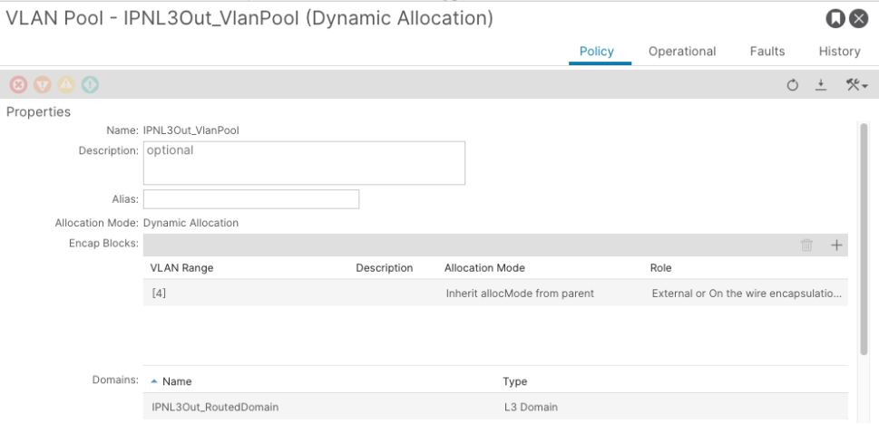

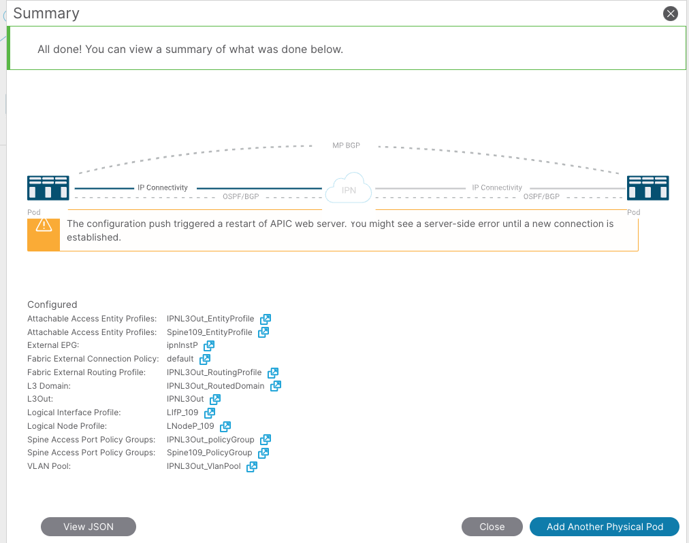

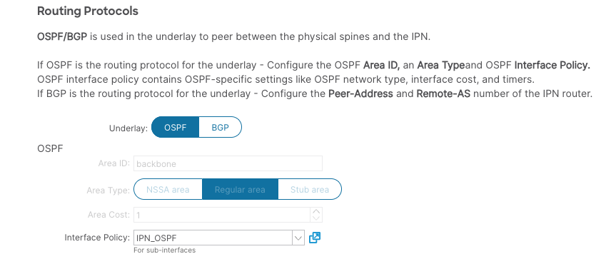

Configure the External TEP pool for Pod-2, allocate the Data Plane TEP IP and Router-ID for the Spine(s) in Pod-2.

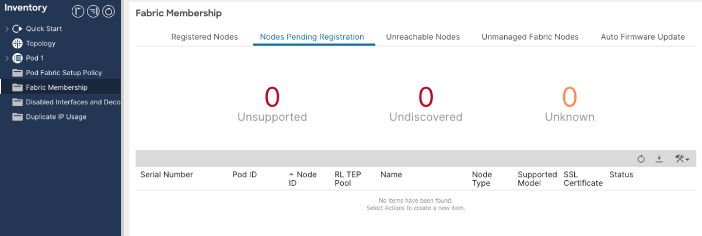

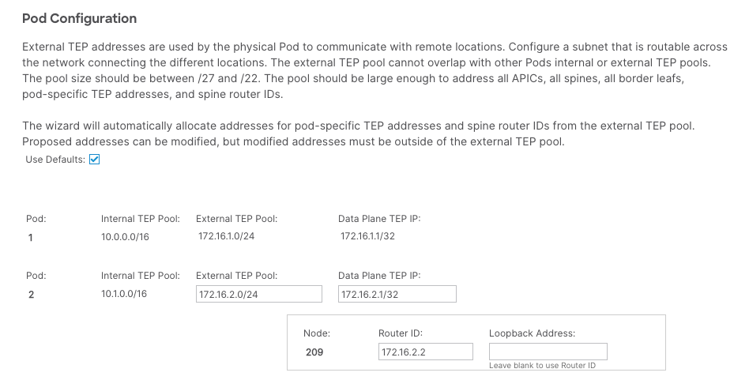

Confirmation of the Objects that will be automatically created by the APIC:

Summary:

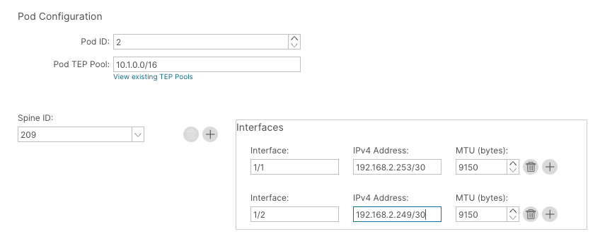

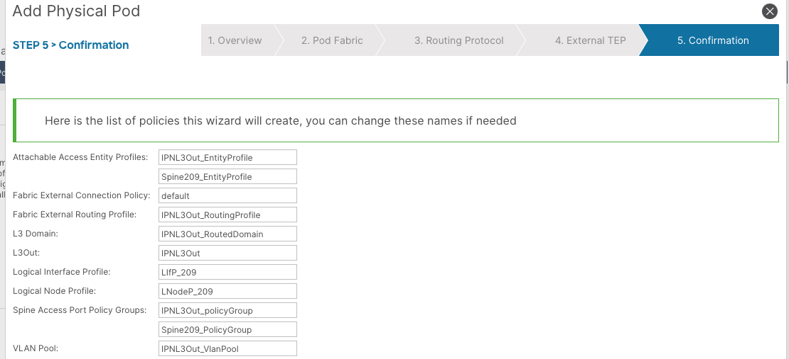

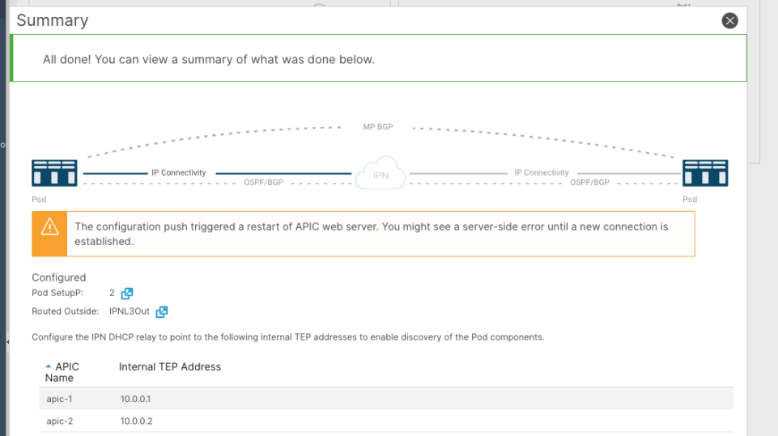

From this point, the Spine in Pod-2 appears under Nodes Pending Registration and it can be registered in the ACI fabric.

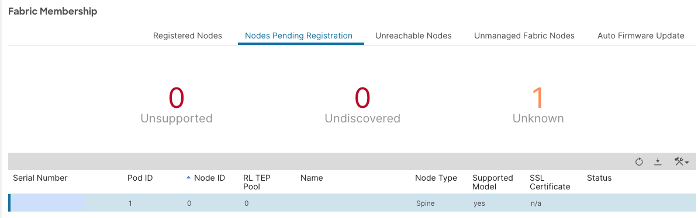

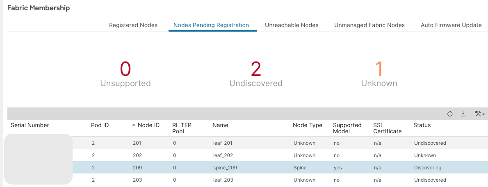

All nodes in Pod-2 are registered in the Fabric.

Note: ACI nodes in Pod-1 are assigned TEP IP addresses from TEP pool (10.0.0.0/16) and nodes in Pod-2 are assigned TEP IP addresses from TEP pool (10.1.0.0/16) and this can be observed from the Fabric Membership.

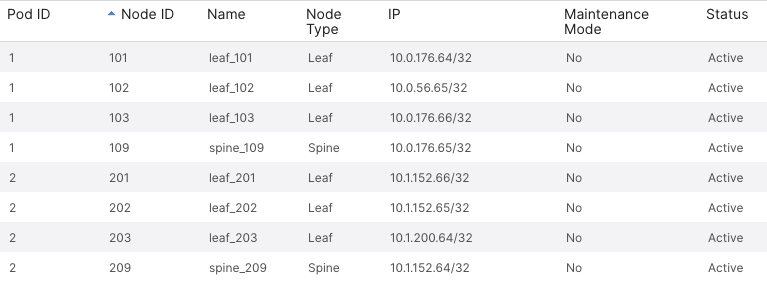

The APIC cluster is fully formed with all APICs across both Pod1 and Pod2.

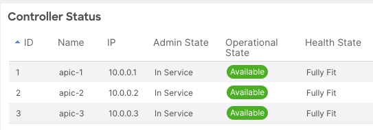

Check OSPF between IPN-2 and Spine in Pod 2

```text
IPN-2# show ip ospf neig vrf MPOD
OSPF Process ID 100 VRF MPOD
Total number of neighbors: 4
Neighbor ID     Pri State          Up Time Address          Interface
192.168.1.1       1 FULL/ -        07:38:17 192.168.100.253 Eth2/9.4
192.168.1.1       1 FULL/ -        07:38:12 192.168.100.249 Eth2/10.4
172.16.2.2        1 FULL/ -        00:02:37 192.168.2.253   Eth2/11.4
172.16.2.2        1 FULL/ -        00:02:36 192.168.2.249   Eth2/12.4
```

Verify the configured Fabric Ext Connection Policy by navigation to Tenant >> infra >> Policies >> Protocol >> Fabric Ext Connection Policies and Click on the Fabric Ext Connection Policy default:

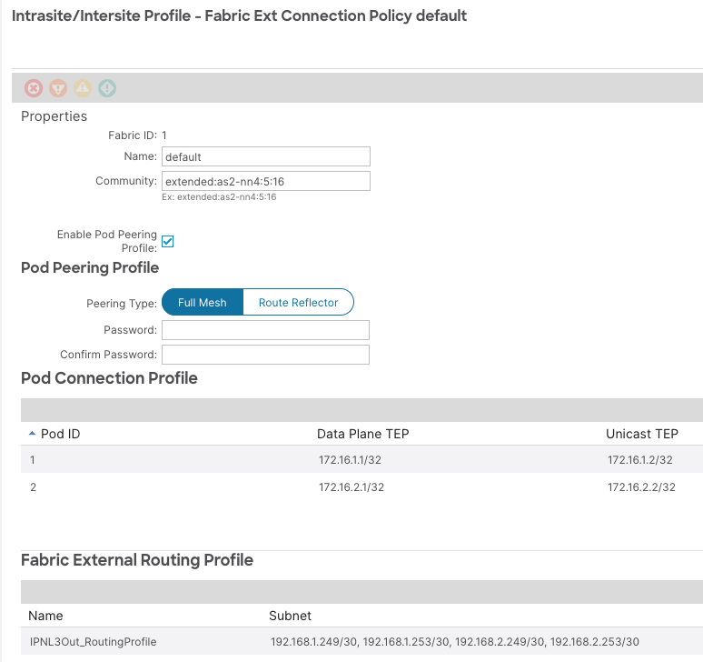

The Community value that is automatically assigned allows for the exchange of EVPN prefixes with spines in remote pods. The subnets that were used for the spines to IPN OSPF peering are displayed under the Fabric External Routing Profile.

The pod connection profile defines a new VXLAN TEP (VTEP) address called the external TEP (ETEP) address. It is used as the anycast shared address across all spine switches in a pod and as the EVPN next-hop IP address for inter-pod data-plane traffic. This IP address should not be part of the TEP pool assigned to each pod.

The Fabric External Routing Profile defines the subnets that are used in the point-to-point connections between the two separate pods in the IPN interfaces.

These subnets are redistributed into the IS-IS control plane running inside each Pod.

```text
Spine109# show ip route vrf overlay-1
!
192.168.1.248/30, ubest/mbest: 1/0, attached, direct
    *via 192.168.1.249, eth1/2.2, [0/0], 3d01h, direct
192.168.1.249/32, ubest/mbest: 1/0, attached
    *via 192.168.1.249, eth1/2.2, [0/0], 3d01h, local, local
192.168.1.252/30, ubest/mbest: 1/0, attached, direct
    *via 192.168.1.253, eth1/1.1, [0/0], 3d01h, direct
192.168.1.253/32, ubest/mbest: 1/0, attached
    *via 192.168.1.253, eth1/1.1, [0/0], 3d01h, local, local
192.168.2.248/30, ubest/mbest: 2/0
    *via 192.168.1.254, eth1/1.1, [110/3], 2d23h, ospf-default, intra
    *via 192.168.1.250, eth1/2.2, [110/3], 2d23h, ospf-default, intra
192.168.2.252/30, ubest/mbest: 2/0
    *via 192.168.1.254, eth1/1.1, [110/3], 2d23h, ospf-default, intra
    *via 192.168.1.250, eth1/2.2, [110/3], 2d23h, ospf-default, intra
```

```text
Spine209# show ip route vrf overlay-1
!
192.168.1.248/30, ubest/mbest: 2/0
    *via 192.168.2.254, eth1/1.1, [110/3], 1d16h, ospf-default, intra
    *via 192.168.2.250, eth1/2.2, [110/3], 1d16h, ospf-default, intra
192.168.1.252/30, ubest/mbest: 2/0
    *via 192.168.2.254, eth1/1.1, [110/3], 1d16h, ospf-default, intra
    *via 192.168.2.250, eth1/2.2, [110/3], 1d16h, ospf-default, intra
192.168.2.248/30, ubest/mbest: 1/0, attached, direct
    *via 192.168.2.249, eth1/2.2, [0/0], 2d15h, direct
192.168.2.249/32, ubest/mbest: 1/0, attached
    *via 192.168.2.249, eth1/2.2, [0/0], 2d15h, local, local
192.168.2.252/30, ubest/mbest: 1/0, attached, direct
    *via 192.168.2.253, eth1/1.1, [0/0], 2d15h, direct
192.168.2.253/32, ubest/mbest: 1/0, attached
    *via 192.168.2.253, eth1/1.1, [0/0], 2d15h, local, local
```

Verify the Spine MP-BGP EVPN

```text
Spine109#
spine_109# show bgp l2vpn evpn summary vrf overlay-1
BGP summary information for VRF overlay-1, address family L2VPN EVPN
BGP router identifier 10.0.208.65, local AS number 65001
BGP table version is 15, L2VPN EVPN config peers 1, capable peers 1
4 network entries and 4 paths using 720 bytes of memory
BGP attribute entries [2/416], BGP AS path entries [0/0]
BGP community entries [0/0], BGP clusterlist entries [0/0]

Neighbor         V    AS MsgRcvd MsgSent   TblVer   InQ OutQ Up/Down   State/PfxRcd
172.168.2.2      4 65001       7       6       15    0 0 00:00:25 1
```

```text
Spine209#
spine_209# show bgp l2vpn evpn summary vrf overlay-1
BGP summary information for VRF overlay-1, address family L2VPN EVPN
BGP router identifier 10.1.72.64, local AS number 65001
BGP table version is 8, L2VPN EVPN config peers 1, capable peers 1
5 network entries and 5 paths using 828 bytes of memory
BGP attribute entries [2/416], BGP AS path entries [0/0]
BGP community entries [0/0], BGP clusterlist entries [0/0]

Neighbor         V    AS MsgRcvd MsgSent   TblVer   InQ OutQ Up/Down   State/PfxRcd
172.16.1.2       4 65001       7       6       8     0 0 00:00:45 2
```

!!! note
    Ensure the Fabric BGP AS is configured and the Spines from each Pod are designated as route-reflectors else MP-BGP L2VPN EVPN peering will not be established.

## Verify Redistribution in ACI Multi-Pod

Route Maps are at the center of redistribution between OSPF and ISIS.

### On Spine_109 (OSPF to IS-IS Redistribution)

```text
spine_109# moquery -d sys/isis/inst-default/dom-overlay-1/interleak-ospf-default-1
Total Objects shown: 1

# isis.InterLeakP
proto        : ospf
inst         : default
asn          : 1
childAction  :
descr        :
dn           : sys/isis/inst-default/dom-overlay-1/interleak-ospf-default-1
lcOwn        : local
modTs        : 2025-04-18T10:55:37.545+00:00
name         :
nameAlias    :
rn           : interleak-ospf-default-1
rtMap        : interleak_rtmap_infra_prefix_remote_pod_teps
scope        : inter
status       :
```

```text
spine_109# vsh -c 'show isis protocol vrf overlay-1' | egrep -A 3 'Redis'
    Redistributing :
      bgp-65001       policy interleak_rtmap_infra_prefix_remote_pod_teps
      direct          policy intra-site-deny
      ospf-default    policy interleak_rtmap_infra_prefix_remote_pod_teps
```

A look into the route-map & prefix-lists to see which routes are being distributed:

```text
spine_109# show route-map interleak_rtmap_infra_prefix_remote_pod_teps
route-map interleak_rtmap_infra_prefix_remote_pod_teps, permit, sequence 1
  Match clauses:
    ip address prefix-lists: infra_prefix_remote_pod_teps infra_prefix_ipn_remote_subnets
  Set clauses:
    metric 63
route-map interleak_rtmap_infra_prefix_remote_pod_teps, permit, sequence 2
  Match clauses:
    ip address prefix-lists: infra_prefix_all_ifcs_tep_range
  Set clauses:
    metric 60

spine_109# show ip prefix-list infra_prefix_remote_pod_teps
ip prefix-list infra_prefix_remote_pod_teps: 6 entries
   seq 2 permit 10.1.0.33/32 – SPINE 209 ANYCAST
   seq 3 permit 10.1.0.34/32 – SPINE 209 ANYCAST
   seq 4 permit 10.1.0.35/32 - SPINE 209 ANYCAST
   seq 5 permit 172.168.2.1/32 – POD 2 DATAPLANE TEP IP
   seq 6 permit 172.168.2.2/32 – SPINE 209 ROUTER ID
   seq 7 permit 10.1.0.0/16 – POD 2 TEP Pool

spine_109# show ip prefix-list infra_prefix_ipn_remote_subnets
ip prefix-list infra_prefix_ipn_remote_subnets: 4 entries
! IPN - SPINES OSPF ROUTING SUBNETS
   seq 1 permit 192.168.1.253/30 le 32
   seq 2 permit 192.168.1.249/30 le 32
   seq 3 permit 192.168.2.249/30 le 32
   seq 4 permit 192.168.2.253/30 le 32

spine_109# show ip prefix-list infra_prefix_all_ifcs_tep_range
ip prefix-list infra_prefix_all_ifcs_tep_range: 1 entries
   seq 1 permit 10.0.0.0/27 eq 32
```

### On Spine_209 (OSPF to IS-IS Redistribution)

```text
spine_209# moquery -d sys/isis/inst-default/dom-overlay-1/interleak-ospf-default-1
Total Objects shown: 1

# isis.InterLeakP
proto        : ospf
inst         : default
asn          : 1
childAction  :
descr        :
dn           : sys/isis/inst-default/dom-overlay-1/interleak-ospf-default-1
lcOwn        : local
modTs        : 2025-04-18T10:55:37.545+00:00
name         :
nameAlias    :
rn           : interleak-ospf-default-1
rtMap        : interleak_rtmap_infra_prefix_remote_pod_teps
scope        : inter
status       :
```

```text
spine_209# vsh -c 'show isis protocol vrf overlay-1' | egrep -A 3 'Redis'
    Redistributing :
      bgp-65001       policy interleak_rtmap_infra_prefix_remote_pod_teps
      direct          policy intra-site-deny
      ospf-default    policy interleak_rtmap_infra_prefix_remote_pod_teps
```

A look into the route-map & prefix-lists to see which routes are being distributed:

```text
spine_209# show route-map interleak_rtmap_infra_prefix_remote_pod_teps
route-map interleak_rtmap_infra_prefix_remote_pod_teps, permit, sequence 1
  Match clauses:
    ip address prefix-lists: infra_prefix_remote_pod_teps infra_prefix_ipn_remote_subnets
  Set clauses:
    metric 63
route-map interleak_rtmap_infra_prefix_remote_pod_teps, permit, sequence 2
  Match clauses:
    ip address prefix-lists: infra_prefix_all_ifcs_tep_range
  Set clauses:
    metric 63

spine_209# show ip prefix-list infra_prefix_remote_pod_teps
ip prefix-list infra_prefix_remote_pod_teps: 6 entries
   seq 1 permit 10.0.0.33/32
   seq 2 permit 10.0.0.34/32
   seq 3 permit 10.0.0.35/32
   seq 4 permit 172.16.1.1/32
   seq 5 permit 172.16.1.2/32
   seq 6 permit 10.0.0.0/16

spine_209# show ip prefix-list infra_prefix_ipn_remote_subnets
ip prefix-list infra_prefix_ipn_remote_subnets: 4 entries
! IPN - SPINES OSPF ROUTING SUBNETS
   seq 1 permit 192.168.2.249/30 le 32
   seq 2 permit 192.168.2.253/30 le 32
   seq 3 permit 192.168.1.249/30 le 32
   seq 4 permit 192.168.1.253/30 le 32

spine_209# show ip prefix-list infra_prefix_all_ifcs_tep_range
ip prefix-list infra_prefix_all_ifcs_tep_range: 1 entries
   seq 1 permit 10.0.0.0/27 eq 32
```

### Spine_109 (IS-IS to OSPF redistribution)

```text
spine_109# moquery -d sys/ospf/inst-default/dom-overlay-1/interleak-isis-isis_infra-1
Total Objects shown: 1

# ospf.InterLeakP
proto        : isis
inst         : isis_infra
asn          : 1
always       : no
childAction  :
descr        :
dn           : sys/ospf/inst-default/dom-overlay-1/interleak-isis-isis_infra-1
lcOwn        : local
modTs        : 2025-04-18T09:57:05.106+00:00
name         :
nameAlias    :
rn           : interleak-isis-isis_infra-1
rtMap        : interleak_rtmap_infra_prefix_local_pod_cp_eteps_and_ifcs
scope        : inter
status       :
```

```text
spine_109# show route-map interleak_rtmap_infra_prefix_local_pod_cp_eteps_and_ifcs
route-map interleak_rtmap_infra_prefix_local_pod_cp_eteps_and_ifcs, permit, sequence 1
  Match clauses:
    ip address prefix-lists: infra_prefix_local_pod_ifcs infra_prefix_local_pod_cp_eteps_and_ifcs
  Set clauses:

spine_109# show ip prefix-list infra_prefix_local_pod_ifcs
ip prefix-list infra_prefix_local_pod_ifcs: 2 entries
   seq 1 permit 10.0.0.1/32
   seq 2 permit 10.0.0.2/32

spine_109# show ip prefix-list infra_prefix_local_pod_cp_eteps_and_ifcs
ip prefix-list infra_prefix_local_pod_cp_eteps_and_ifcs: 1 entries
   seq 1 permit 172.16.1.2/32
```

On Spine_109 (OSPF Database):

```text
spine_109# show ip ospf database external vrf overlay-1
        OSPF Router with ID (172.16.1.2) (Process ID default VRF overlay-1)

                Type-5 AS External Link States

Link ID         ADV Router      Age        Seq#       Checksum Tag
10.0.0.0        172.16.1.2      587        0x8000002c 0x2d9c    0
10.0.0.1        172.16.1.2      587        0x8000002c 0x23a5    0
10.0.0.2        172.16.1.2      587        0x8000002c 0x19ae    0
10.0.0.3        172.168.2.2     1817       0x80000025 0x51e2    0
10.0.0.33       172.16.1.2      587        0x8000002c 0xe1c6    0
10.0.0.34       172.16.1.2      587        0x8000002c 0xd7cf    0
10.0.0.35       172.16.1.2      587        0x8000002c 0xcdd8    0
10.1.0.0        172.168.2.2     627        0x8000002a 0x59d7    0
10.1.0.33       172.168.2.2     627        0x8000002b 0x0c03    0
10.1.0.34       172.168.2.2     627        0x8000002b 0x020c    0
10.1.0.35       172.168.2.2     627        0x8000002a 0xf914    0
172.16.1.0      172.16.1.2      1507       0x80000029 0x25f3    0
172.16.1.1      172.16.1.2      587        0x8000002c 0x15ff    0
172.16.1.228    172.16.1.2      1507       0x80000029 0x34ff    0
172.16.1.229    172.16.1.2      1507       0x80000029 0x2a09    0
172.168.2.0     172.168.2.2     627        0x8000002a 0x25bf    0
172.168.2.1     172.168.2.2     627        0x8000002a 0x1bc8    0
172.168.2.228   172.168.2.2     627        0x8000002a 0x34cb    0
172.168.2.229   172.168.2.2     627        0x8000002a 0x2ad4    0
```

```text
spine_109# show ip ospf database vrf overlay-1
        OSPF Router with ID (172.16.1.2) (Process ID default VRF overlay-1)

                Router Link States (Area 0.0.0.0)

Link ID         ADV Router      Age        Seq#       Checksum Link Count
172.16.1.2      172.16.1.2      1538       0x8000002e 0x57b6   6
172.168.2.2     172.168.2.2     668        0x8000002f 0x645e   6
192.168.1.1     192.168.1.1     1459       0x800000cd 0xa9ae   9
192.168.2.1     192.168.2.1     1310       0x800000d1 0xad71   9

                Type-5 AS External Link States

Link ID         ADV Router      Age        Seq#       Checksum Tag
10.0.0.0        172.16.1.2      628        0x8000002c 0x2d9c    0
10.0.0.1        172.16.1.2      628        0x8000002c 0x23a5    0
10.0.0.2        172.16.1.2      628        0x8000002c 0x19ae    0
10.0.0.3        172.168.2.2     38         0x80000026 0x4fe3    0
10.0.0.33       172.16.1.2      628        0x8000002c 0xe1c6    0
10.0.0.34       172.16.1.2      628        0x8000002c 0xd7cf    0
10.0.0.35       172.16.1.2      628        0x8000002c 0xcdd8    0
10.1.0.0        172.168.2.2     668        0x8000002a 0x59d7    0
10.1.0.33       172.168.2.2     668        0x8000002b 0x0c03    0
10.1.0.34       172.168.2.2     668        0x8000002b 0x020c    0
10.1.0.35       172.168.2.2     668        0x8000002a 0xf914    0
172.16.1.0      172.16.1.2      1548       0x80000029 0x25f3    0
172.16.1.1      172.16.1.2      628        0x8000002c 0x15ff    0
172.16.1.228    172.16.1.2      1548       0x80000029 0x34ff    0
172.16.1.229    172.16.1.2      1548       0x80000029 0x2a09    0
172.168.2.0     172.168.2.2     668        0x8000002a 0x25bf    0
172.168.2.1     172.168.2.2     668        0x8000002a 0x1bc8    0
172.168.2.228   172.168.2.2     668        0x8000002a 0x34cb    0
172.168.2.229   172.168.2.2     668        0x8000002a 0x2ad4    0
```

### On Spine_209 (IS-IS to OSPF Redistribution)

```text
spine_209# moquery -d sys/ospf/inst-default/dom-overlay-1/interleak-isis-isis_infra-1
Total Objects shown: 1

# ospf.InterLeakP
proto          : isis
inst           : isis_infra
asn            : 1
always         : no
childAction    :
descr          :
dn             : sys/ospf/inst-default/dom-overlay-1/interleak-isis-isis_infra-1
lcOwn          : local
modTs          : 2025-04-18T10:55:00.875+00:00
name           :
nameAlias      :
rn             : interleak-isis-isis_infra-1
rtMap          : interleak_rtmap_infra_prefix_local_pod_cp_eteps_and_ifcs
scope          : inter
status         :
```

```text
spine_209# show route-map interleak_rtmap_infra_prefix_local_pod_cp_eteps_and_ifcs
route-map interleak_rtmap_infra_prefix_local_pod_cp_eteps_and_ifcs, permit, sequence 1
  Match clauses:
    ip address prefix-lists: infra_prefix_local_pod_ifcs infra_prefix_local_pod_cp_eteps_and_ifcs
  Set clauses:

spine_209# show ip prefix-list infra_prefix_local_pod_ifcs
ip prefix-list infra_prefix_local_pod_ifcs: 1 entries
   seq 1 permit 10.0.0.3/32

spine_209# show ip prefix-list infra_prefix_local_pod_cp_eteps_and_ifcs
ip prefix-list infra_prefix_local_pod_cp_eteps_and_ifcs: 1 entries
   seq 1 permit 172.168.2.2/32
```

## Fabric Discovery Troubleshooting

This section goes through Fabric Discovery validation and troubleshooting commands. The commands and explanations are adopted from the official Troubleshoot ACI Fabric Discovery; [https://www.cisco.com/c/en/us/support/docs/cloud-systems-management/application-policy-infrastructure-controller-apic/218031-troubleshoot-aci-fabric-discovery-init.html](https://www.cisco.com/c/en/us/support/docs/cloud-systems-management/application-policy-infrastructure-controller-apic/218031-troubleshoot-aci-fabric-discovery-init.html)

### Check the System State

When a leaf has been registered in the fabric its state should be "in-service".

```text
leaf_101# moquery -c topSystem | grep state
state                    : in-service
```

### Check – DHCP status

```text
(none)# tcpdump -ni kpm_inb port 67 or 68
tcpdump: verbose output suppressed, use -v or -vv for full protocol decode
listening on kpm_inb, link-type EN10MB (Ethernet), capture size 262144 bytes
10:02:31.820279 IP 10.0.176.64.67 > 10.0.0.1.67: BOOTP/DHCP, Request from 64:3a:ea:93:63:01, length 345

Broadcast message from root@leaf101 (Sun Apr 13 10:02:38 2025):

This switch is now part of the ACI fabric. Please re-login with the right credentials.
Launching getty
```

The output above shows that a leaf was allocated a TEP IP by the APIC during registration.

### DHCP on the APIC

```text
apic-1# ps aux | grep dhcp
ifc        11972 2.4 0.7 1565680 681540 ?        Ssl 09:44    0:36 /mgmt//bin/dhcpd.bin -f -4 -cf
/data//dhcp/dhcpd.conf -lf /data//dhcp/dhcpd.lease -pf /var/run//dhcpd.pid --no-pid bond0.4093
admin      74832 0.0 0.0     3312   656 pts/0    S+   10:08   0:00 grep dhcp
```

Validate that the dhcpd is running on the APIC and listening to the bond interface (interface that connects to the ACI fabric).

### Unregistered leaf AV details

```text
(none) login: admin
********************************************************************************
     Fabric discovery in progress, show commands are not fully functional
     Logout and Login after discovery to continue to use show commands.
     Run show discoveryissues for more details.
********************************************************************************
(none)# acidiag avread
Cluster of 0 lm(t):0(zeroTime) appliances (out of targeted 0 lm(t):0(zeroTime)) with FABRIC_DOMAIN
name=Undefined Fabric Domain Name set to version= lm(t):0(zeroTime); discoveryMode=PERMISSIVE
lm(t):0(zeroTime); drrMode=OFF lm(t):0(zeroTime); kafkaMode=OFF lm(t):0(zeroTime); autoUpgradeMode=OFF
lm(t):0(zeroTime); clusterInterface=infra
---------------------------------------------
clusterTime=<diff=0 common=2025-04-13T10:13:17.578+00:00 local=2025-04-13T10:13:17.578+00:00
pF=<displForm=1 offsSt=0 offsVlu=0 lm(t):0(zeroTime)>>
---------------------------------------------
```

Before the leaf is registered, it does not have details regarding the cluster.

### Registered leaf

```text
leaf_101# acidiag avread
Cluster of 3 lm(t):0(2025-04-18T12:51:37.363+00:00) appliances (out of targeted 3 lm(t):0(2025-04-
18T13:01:14.070+00:00)) with FABRIC_DOMAIN name=ACI-FABRIC set to version=6.0(7e) lm(t):0(2025-04-
18T13:01:14.070+00:00); discoveryMode=PERMISSIVE lm(t):0(zeroTime); drrMode =OFF lm(t):0(zeroTime);
kafkaMode=ON lm(t):1(2025-04-18T07:13:19.173+00:00); autoUpgradeMode=OFF lm(t):3(2025-04-
18T12:51:37.796+00:00); clusterInterface=infra
        appliance id=1 address=10.0.0.1 lm(t):1(2025-04-18T07:04:20.705+00:00) tep address=10.0.0.0/16
lm(t):1(2025-04-18T07:04:20.705+00:00) routable address=0.0.0.0 lm(t):0(zeroTime) oob address=0.0.0.0
lm(t):0(zeroTime) version=6.0(7e) lm(t):1(2025-04-18T07:04:28.099+00:00) chassisId=074f7d6f-1c23-11f0-
b546-2cf89bb06570 lm(t):1(2025-04-18T07:04:28.099+00:00) capabilities=0X17EEFFFFFFFFF--0X2020--0X3--0X1
lm(t):1(2025-04-18T07:32:58.598+00:00) rK=(stable,absent,0) lm(t):0(zeroTime) aK=(stable,absent,0)
lm(t):0(zeroTime) oobrK=(stable,absent,0) lm(t):0(zeroTime) oobaK=(stable,absent,0) lm(t):0(zeroTime)
cntrlSbst=(APPROVED, Wxxxxxxxx) lm(t):1(2025-04-18T12:51:37.848+00:00) (targetMbSn= lm(t):0(zeroTime),
failoverStatus=0 lm(t):0(zeroTime)) podId=1 lm(t):1(2025-04-18T07:04:20.705+00:00) commissioned=YES
lm(t):101(2025-04-18T07:30:05.294+00:00) registered=YES lm(t):1(2025-04-18T07:04:20.705+00:00)
standby=NO lm(t):0(zeroTime) DRR=NO lm(t):101(2025-04-18T07:30:05.294+00:00) apicX=NO lm(t):0(zeroTime)
virtual=NO lm(t):0(zeroTime) oob gw address=0.0.0.0 lm(t):0(zeroTime) oob address v6=0.0.0.0
lm(t):0(zeroTime) oob gw address v6=0.0.0.0 lm(t):0(zeroTime) active=YES
        appliance id=2 address=10.0.0.2 lm(t):101(2025-04-18T07:31:26.429+00:00) tep
address=10.0.0.0/16 lm(t):2(2025-04-18T07:05:59.732+00:00) routable address=0.0.0.0 lm(t):0(zeroTime)
oob address=0.0.0.0 lm(t):0(zeroTime) version=6.0(7e) lm(t):2(2025-04-18T07:06:06.217+00:00)
chassisId=4768bab6-1c23-11f0-903f-34ed1b8b68ef lm(t):101(2025-04-18T07:31:26.429+00:00)
capabilities=0X17EEFFFFFFFFF--0X2020--0X3--0X1 lm(t):2(2025-04-18T07:33:21.825+00:00)
rK=(stable,absent,0) lm(t):0(zeroTime) aK=(stable,absent,0) lm(t):0(zeroTime) oobrK=(stable,absent,0)
lm(t):0(zeroTime) oobaK=(stable,absent,0) lm(t):0(zeroTime) cntrlSbst=(APPROVED, Wxxxxxx) lm(t):2(2025-
04-18T12:51:37.794+00:00) (targetMbSn= lm(t):0(zeroTime), failoverStatus=0 lm(t):0(zeroTime)) podId=1
lm(t):101(2025-04-18T07:31:26.429+00:00) commissioned=YES lm(t):101(2025-04-18T07:32:56.609+00:00)
registered=YES lm(t):1(2025-04-18T07:32:56.945+00:00) standby=NO lm(t):0(zeroTime) DRR=NO
lm(t):101(2025-04-18T07:32:56.609+00:00) apicX=NO lm(t):0(zeroTime) virtual=NO lm(t):0(zeroTime) oob gw
address=0.0.0.0 lm(t):0(zeroTime) oob address v6=0.0.0.0 lm(t):0(zeroTime) oob gw address v6=0.0.0.0
lm(t):0(zeroTime) active=YES
        appliance id=3 address=10.0.0.3 lm(t):201(2025-04-18T12:19:40.111+00:00) tep
address=10.0.0.0/16 lm(t):3(2025-04-18T12:46:36.039+00:00) routable address=0.0.0.0 lm(t):0(zeroTime)
oob address=0.0.0.0 lm(t):0(zeroTime) version=6.0(7e) lm(t):3(2025-04-18T12:46:44.126+00:00)
chassisId=ddef615a-1c52-11f0-aa56-2cf89bb04dd0 lm(t):202(2025-04-18T12:48:45.870+00:00)
capabilities=0X17EEFFFFFFFFF--0X2020--0X7--0X1 lm(t):3(2025-04-18T12:51:58.626+00:00)
rK=(stable,absent,0) lm(t):0(zeroTime) aK=(stable,absent,0) lm(t):0(zeroTime) oobrK=(stable,absent,0)
lm(t):0(zeroTime) oobaK=(stable,absent,0) lm(t):0(zeroTime) cntrlSbst=(APPROVED, WZ xxxxxx)
lm(t):202(2025-04-18T12:48:45.870+00:00) (targetMbSn= lm(t):0(zeroTime), failoverStatus=0
lm(t):0(zeroTime)) podId=2 lm(t):201(2025-04-18T12:19:40.111+00:00) commissioned=YES lm(t):101(2025-04-
18T12:51:37.363+00:00) registered=YES lm(t):2(2025-04-18T12:51:37.368+00:00) standby=NO
lm(t):0(zeroTime) DRR=NO lm(t):101(2025-04-18T12:51:37.363+00:00) apicX=NO lm(t):0(zeroTime) virtual=NO
lm(t):0(zeroTime) oob gw address=0.0.0.0 lm(t):0(zeroTime) oob address v6=0.0.0.0 lm(t):0(zeroTime) oob
gw address v6=0.0.0.0 lm(t):0(zeroTime) active=YES
---------------------------------------------
clusterTime=<diff=-262 common=2025-04-18T13:01:46.378+00:00 local=2025-04-18T13:01:46.640+00:00
pF=<displForm=0 offsSt=0 offsVlu=0 lm(t):3(2025-04-18T12:51:49.791+00:00)>>
```

When the node is registered it is able to display details of the APIC nodes in the cluster.

### IP reachability to the APIC

```text
leaf101# iping -V overlay-1 10.0.0.1
PING 10.0.0.1 (10.0.0.1) from 10.0.0.30: 56 data bytes
64 bytes from 10.0.0.1: icmp_seq=0 ttl=64 time=0.409 ms
64 bytes from 10.0.0.1: icmp_seq=1 ttl=64 time=0.294 ms
64 bytes from 10.0.0.1: icmp_seq=2 ttl=64 time=0.274 ms
^C
--- 10.0.0.1 ping statistics ---
3 packets transmitted, 3 packets received, 0.00% packet loss
round-trip min/avg/max = 0.274/0.325/0.409 ms
```

Verify ICMP connectivity to the APIC IP from the leaf node.

### Infra VLAN

```text
(none)# moquery -c lldpInst
Total Objects shown: 1

# lldp.Inst
adminSt         : enabled
childAction     :
ctrl            :
dn              : sys/lldp/inst
holdTime        : 120
infraVlan       : 4093
initDelayTime   : 2
lcOwn           : local
md5CACert       :
modTs           : 2025-04-13T09:46:39.414+00:00
monPolDn        : uni/fabric/monfab-default
name            :
operErr         :
optTlvSel       : mgmt-addr,port-desc,port-vlan,sys-cap,sys-desc,sys-name
rn              : inst
status          :
sysDesc         :
txFreq          : 30
```

An unregistered node is able to get the Infra VLAN details via LLDP messages. If an ACI node is located in a Pod without an APIC, the Infra VLAN check is expected to fail.

The leaf programs the infra VLAN on the ports connected to the APIC.

```text
(none)# show vlan encap-id 4093

 VLAN Name                             Status    Ports
 ---- -------------------------------- --------- -------------------------------
 8    infra:default                    active    Eth1/2, Eth1/3

 VLAN Type Vlan-mode
 ---- ----- ----------
 8    enet CE
```

If a node has not received an Infra VLAN on its interfaces connected to the APIC, verify if there are no wiring issues detected using the following command:

```text
moquery -c lldpIf -f 'lldp.If.wiringIssues!=""'
```

### LLDP Adjacency

```text
(none)# show lldp neig
Capability codes:
  (R) Router, (B) Bridge, (T) Telephone, (C) DOCSIS Cable Device
  (W) WLAN Access Point, (P) Repeater, (S) Station, (O) Other
Device ID            Local Intf      Hold-time Capability Port ID
N9K-C9372PX-E         Eth1/1          120        BR             Ethernet1/2
apic-1                Eth1/2          120                       eth2-4
apic-2                Eth1/3          120                       eth2-2
spine109              Eth1/49         120        BR             Eth1/31
Total entries displayed: 4
```

Even before a node is registered in the fabric, the LLDP neighbors can be seen. This is used to validate that each node is cabled correctly.

### ACI Switch Software Version

```text
(none)# show version
Cisco Nexus Operating System (NX-OS) Software
TAC support: http://www.cisco.com/tac
Documents: http://www.cisco.com/en/US/products/ps9372/tsd_products_support_series_home.html
Copyright (c) 2002-2014, Cisco Systems, Inc. All rights reserved.
The copyrights to certain works contained in this software are
owned by other third parties and used and distributed under
license. Certain components of this software are licensed under
the GNU General Public License (GPL) version 2.0 or the GNU
Lesser General Public License (LGPL) Version 2.1. A copy of each
such license is available at
http://www.opensource.org/licenses/gpl-2.0.php and
http://www.opensource.org/licenses/lgpl-2.1.php

Software
  BIOS:      version 07.69
  kickstart: version 16.0(7e) [build 16.0(7e)]
  system:    version 16.0(7e) [build 16.0(7e)]
  PE:        version 6.0(7e)
  BIOS compile time:       04/07/2021
  kickstart image file is: /bootflash/aci-n9000-dk9.16.0.7e.bin
  kickstart compile time: 08/14/2024 09:09:40 [08/14/2024 09:09:40]
  system image file is:    /bootflash/auto-s
  system compile time:     08/14/2024 09:09:40 [08/14/2024 09:09:40]

Hardware
  cisco N9K-C93180YC-EX ("supervisor")
   Intel(R) Xeon(R) CPU @ 1.80GHz with 24480768 kB of memory.
  Processor Board ID FDxxxxx

  Device name: none
  bootflash:    62522368 kB

Kernel uptime is 00 day(s), 00 hour(s), 55 minute(s), 21 second(s)

Last reset at 428000 usecs after Sun Apr 13 09:24:40 2025 UTC
  Reason: reset-requested-by-cli-command-reload
  System version: 16.0(7e)
  Service: PolicyElem Ch reload

plugin
  Core Plugin, Ethernet Plugin
```

### APIC Switch Software Version

```text
apic-1# show version
 Role        Pod         Node         Name                        Version
 ---------- ----------   ----------   ------------------------    --------------------
 controller 1            1            apic-1                      6.0(7e)
 controller 1            2            apic-2                      6.0(7e)
 controller 2            3            apic-3                      6.0(7e)
 leaf        1           101          leaf_101                    n9000-16.0(7e)
 leaf        1           102          leaf_102                    n9000-16.0(7e)
 leaf        1          103         leaf_103                 n9000-16.0(7e)
 spine       1          109         spine_109                n9000-16.0(7e)
 leaf        2          201         leaf_201                 n9000-16.0(7e)
 leaf        2          202         leaf_202                 n9000-16.0(7e)
 leaf        2          203         leaf_203                 n9000-16.0(7e)
 spine       2          209         spine_209                n9000-16.0(7e)
```

Validate that the leaf, spines and APICs are all running the same software version.

!!! note
    Ensure the Fabric BGP AS is configured and the Spines from each Pod are designated as route-reflectors else MP-BGP L2VPN EVPN peering will not be established.

### FPGA/EPLD/BIOS

!!! note
    The FPGA, EPLD and BIOS versions could affect the leaf node's ability to bring up the modules as expected. If these are too far out of date, the interfaces of the switch could fail to come up.

Validate the running and expected versions of FPGA, EPLD, and BIOS.

```text
(none)# moquery -c firmwareCardRunning
Total Objects shown: 2

# firmware.CardRunning
biosUpgSt        : upg-not-req
biosVer          : v07.69(04/07/2021)
childAction      :
descr            :
dn               : sys/ch/supslot-1/sup/running
expectedVer      : v07.69(04/07/2021)
interimVer       : 16.0(7e)
internalLabel    :
modTs            : never
mode             : normal
monPolDn         : uni/fabric/monfab-default
operSt           : ok
rn               : running
srFwFlashRecVer :
srFwFlashVer     :
srFwImageVer     :
srFwRunningSrc   : unknown
srFwRunningVer   :
status           :
ts               : 1970-01-01T00:00:00.000+00:00
type             : switch
version          : 16.0(7e)

# firmware.CardRunning
biosUpgSt        : upg-not-req
biosVer          : v07.69(04/07/2021)
childAction      :
descr            :
dn               : sys/ch/lcslot-1/lc/running
expectedVer      : v07.69(04/07/2021)
interimVer       : 16.0(7e)
internalLabel    :
modTs            : never
mode             : normal
monPolDn         : uni/fabric/monfab-default
operSt           : ok
rn               : running
srFwFlashRecVer :
srFwFlashVer     :
srFwImageVer     :
srFwRunningSrc   : unknown
srFwRunningVer   :
status           :
ts               : 1970-01-01T00:00:00.000+00:00
type             : switch
version          : 16.0(7e)
```

```text
(none)# moquery -c firmwareCompRunning
Total Objects shown: 2

# firmware.CompRunning
childAction    :
descr          :
dn             : sys/ch/supslot-1/sup/fpga-1/running
epldUpgSt      : upg-not-req
expectedVer    : 0x15
internalLabel :
modTs          : never
mode           : normal
monPolDn       : uni/fabric/monfab-default
operSt         : ok
rn              : running
status          :
ts              : 1970-01-01T00:00:00.000+00:00
type            : controller
version         : 0x15

# firmware.CompRunning
childAction    :
descr          :
dn             : sys/ch/supslot-1/sup/fpga-2/running
epldUpgSt      : upg-not-req
expectedVer    : 0x4
internalLabel :
modTs          : never
mode           : normal
monPolDn       : uni/fabric/monfab-default
operSt         : ok
rn             : running
status         :
ts             : 1970-01-01T00:00:00.000+00:00
type           : controller
version        : 0x4
```

### SSL

```text
(none)# cd /securedata/ssl && openssl x509 -noout -subject -in server.crt
subject=serialNumber = PID:N9K-C93180YC-EX SN:FXXXXX, CN = N9K-C93180YC-EX
```

```text
(none)# cd /securedata/ssl && openssl x509 -noout -dates -in server.crt
notBefore=Aug 6 05:41:44 2019 GMT
notAfter=May 14 20:25:42 2029 GMT
```

SSL communication is used between all fabric nodes to ensure encryption of control plane traffic. The SSL certificate used is installed during manufacturing and is generated based on the serial number of the chassis.

Ensure that the certificate is valid.

### Verify Equipment Serial Number

```text
(none)# show inventory
NAME: "Chassis", DESCR: "Nexus C93180YC-EX Chassis"
PID: N9K-C93180YC-EX    , VID: V04 , SN: FDO2cccccc

NAME: "Slot 1 ", DESCR: "48x10/25G               "
PID: N9K-C93180YC-EX    , VID: V04      ,   SN: FDO2cccccc

NAME: "GEM    ", DESCR: "6x40/100G Switch "
PID: N9K-C93180YC-EX    , VID: V04 , SN: FDO2cccccc
```

Verify the status of the bootstrapping process on the leaf.

```text
(none)# moquery -c pconsBootStrap
Total Objects shown: 1

# pcons.BootStrap
allLeaderAcked         : no
allPortsInService      : no
allResponsesFromLeader : yes
canBringPortInService : no
childAction            :
completedPolRes        : no
dn                       : rescont/bootstrap
lcOwn                    : local
modTs                    : 2025-04-13T10:33:29.920+00:00
policySyncNodeBringup    : yes
rn                       : bootstrap
state                    : completed
status                   :
timerTicks               : 257
try                      : 0
worstCaseTaskTry         : 0
```

The bootstrap process is when the leaf is downloading initial configuration from the APIC.

Verify the date and time and ensure that there is a small delta between the APIC and switch time.

```text
apic-1# date
Sun Apr 13 10:30:53 UTC 2025
```

Verify that the equipment modules are online, powered up and operating at normal thresholds.

```text
(none)# show module

Mod   Ports   Module-Type                         Model              Status
---   -----   ----------------------------------- ------------------ ----------
1     54      48x10/25G+6x40/100G Switch          N9K-C93180YC-EX    ok

Mod   Sw                Hw
---   --------------    ------
1     16.0(7e)          1.0

Mod   MAC-Address(es)                             Serial-Num
---   --------------------------------------      ----------
1     00-a6-ca-09-e5-df to 00-a6-ca-09-e6-28      Fhxxxxxxx

Mod   Online Diag Status
---   ------------------
1     pass
```

```text
(none)# show environment
Power Supply:
Voltage: 12.0 Volts

Power                                  Actual          Total
Supply      Model                      Output       Capacity     Status
                                     (Watts )       (Watts )
-------    -------------------    -----------    -----------    --------------
1          NXA-PAC-650W-PI              N/A W          650 W          ok
2          NXA-PAC-650W-PI              N/A W          650 W         shut

                                       Actual          Power
Module        Model                      Draw      Allocated     Status
                                      (Watts )       (Watts )
--------    -------------------    -----------    -----------    --------------
1           N9K-C93180YC-EX                0 W          492 W      Powered-Up
fan1        NXA-FAN-30CFM-B                N/A            N/A      Powered-Up
fan2        NXA-FAN-30CFM-B                N/A            N/A      Powered-Up
fan3        NXA-FAN-30CFM-B                N/A            N/A      Powered-Up
fan4        NXA-FAN-30CFM-B                N/A            N/A      Powered-Up
N/A - Per module power not available

Power Usage Summary:
--------------------
Power Supply redundancy mode (configured)                 Non-Redundant(combined)
Power Supply redundancy mode (operational)                Non-Redundant(combined)

Total Power Capacity (based on configured mode)                 650 W
Total Power of all Inputs (cumulative)                          650 W
Total Power Output (actual draw)                                  0 W
Total Power Allocated (budget)                                N/A
Total Power Available for additional modules                  N/A

Fan:
------------------------------------------------------
Fan             Model                Hw         Status
------------------------------------------------------
Fan1(sys_fan1) NXA-FAN-30CFM-B       --         ok
Fan2(sys_fan2) NXA-FAN-30CFM-B       --         ok
Fan3(sys_fan3) NXA-FAN-30CFM-B       --         ok
Fan4(sys_fan4) NXA-FAN-30CFM-B       --         ok
Fan_in_PS1      --                   --         ok
Fan_in_PS2      --                   --         unknown
Fan Speed: Zone 1: 0x0
Fan Air Filter : Absent

Temperature:
-----------------------------------------------------------------------------------
Module   Sensor                       MajorThresh   MinorThres   CurTemp     Status
                                      (Celsius)     (Celsius)    (Celsius)
-----------------------------------------------------------------------------------
1        Inlet(1)                      70            42           N/A        normal
1        outlet(2)                     80            70           N/A        normal
1        x86 processor(3)              90            80           N/A        normal
1        Sugarbowl(4)                  110           90           N/A        normal
1        Sugarbowl vrm(5)              120           110          N/A        normal
```

Verify that the APIC is sending LLDP TLVs matching the parameters set in the setup script.

```text
apic-1# acidiag run lldptool out eth2-1
Chassis ID TLV
        MAC: 2c:f8:9b:b0:65:70
Port ID TLV
        MAC: 2c:f8:9b:b0:65:70
Time to Live TLV
        120
Port Description TLV
        eth2-1
System Name TLV
        apic-1
System Description TLV
        topology/pod-1/node-1
Management Address TLV
        IPv4: 10.0.0.1
        Ifindex: 2
Cisco Port State TLV
        1
Cisco Node Role TLV
        0
Cisco Node ID TLV
        1
Cisco POD ID TLV
        1
Cisco Fabric Name TLV
        ACI-FABRIC
Cisco Appliance Vector TLV
        Id: 1
        IPv4: 10.0.0.1
        UUID: 72480098-
Cisco Node IP TLV
        IPv4:10.0.0.1
Cisco Port Role TLV
        1
Cisco Infra VLAN TLV
        4093
Cisco Serial Number TLV
        WZxxxxxxx
Cisco Authentication Cookie TLV
        988001963
Cisco Standby APIC TLV
        0
End of LLDPDU TLV
```

Verify that the APIC is receiving LLDP TLVs from the directly connected leaf node.

```text
apic-1# acidiag run lldptool in eth2-1
Chassis ID TLV
        MAC: 10:b3:d6:a4:7e:b2
Port ID TLV
        Local: Eth1/2
Time to Live TLV
        120
Port Description TLV
        topology/pod-1/paths-101/pathep-[eth1/2]
System Name TLV
        leaf101
System Description TLV
        topology/pod-1/node-101
System Capabilities TLV
        System capabilities: Bridge, Router
        Enabled capabilities: Bridge, Router
Management Address TLV
        MAC: 10:b3:d6:a4:7e:b2
        Ifindex: 83886080
Cisco 4-wire Power-via-MDI TLV
        4-Pair PoE supported
        Spare pair Detection/Classification not required
        PD Spare pair Desired State: Disabled
        PSE Spare pair Operational State: Disabled
Cisco Port Role TLV
        4
Cisco Port Mode TLV
        0
Cisco Port State TLV
        1
Cisco Serial Number TLV
        FDO233201DV
Cisco Model TLV
        N9K-C93180YC-EX
Cisco Node Role TLV
        1
Cisco Firmware Version TLV
        n9000-16.0(7e)
Cisco Infra VLAN TLV
        4093
Cisco Name TLV
        leaf101
Cisco Fabric Name TLV
        ACI-FABRIC
Cisco Node IP TLV
        IPv4:10.0.176.64
Cisco Node ID TLV
        101
Cisco POD ID TLV
        1
Cisco Appliance Vector TLV
        Id: 1
        IPv4: 10.0.0.1
        UUID: 72480098-184b
        Id: 2
        IPv4: 10.0.0.2
        UUID: a0466b6a-184b
LLDP-MED Capabilities TLV
        Device Type: netcon
        Capabilities: LLDP-MED, Network Policy, Extended Power via MDI-PSE
LLDP-MED Network Policy TLV
        01400000
End of LLDPDU TLV
```

### Validate the APIC cluster

```text
apic-1# acidiag cluster
admin password:

Running...

Checking Wiring and UUID: OK
Checking AD Processes: Running
Checking All Apics in Commission State: OK
Checking All Apics in Active State: OK
Checking Fabric Nodes: OK
Checking Apic Fully-Fit: OK
Checking Shard Convergence: OK
Checking Leadership Degration: Optimal leader for all shards
Ping OOB IPs:
APIC-1: 10.66.55.109 - OK
APIC-2: 10.66.55.111 - OK
APIC-3: 10.66.55.113 - OK
Ping Infra IPs:
APIC-1: 10.0.0.1 - OK
APIC-2: 10.0.0.2 - OK
APIC-3: 10.0.0.3 - OK
Checking APIC Versions: Same (6.0(7e))
Checking SSL: OK
Full file system(s): None

Done!
```

Validate if all settings match across all APICs.

```text
apic-1# acidiag avread
Cluster:
-------------------------------------------------------------------------
operSize                3
clusterSize             3
fabricDomainName        ACI-FABRIC
version                 6.0(7e)
discoveryMode           PERMISSIVE
drrMode                 OFF
kafkaMode               ON
autoUpgradeMode         OFF

APICs:
-------------------------------------------------------------------------
                  APIC 1                  APIC 2                  APIC 3
version           6.0(7e)                 6.0(7e)                 6.0(7e)
address           10.0.0.1                10.0.0.2                10.0.0.3
oobAddress        10.66.55.109/27         10.66.55.111/27         10.66.55.113/27
oobAddressV6      fc00::1/7               ::                      ::
routableAddress    0.0.0.0                  0.0.0.0                0.0.0.0
tepAddress         10.0.0.0/16              10.0.0.0/16            10.0.0.0/16
podId              1                        1                      2
chassisId          074f7d6f-.-9bb06570      4768bab6-.-1b8b68ef    ddef615a-.-9bb04dd0
cntrlSbst_serial   (APPROVED,WZxxxxxxxc)   (APPROVED,WZxxxxxxxx)   (APPROVED,WZccxxxxxx)
active             YES                      YES                    YES
flags              cra-                     cra-                   cra-
health             255                      255                    255
```

### Discovery issues on an unregistered leaf

```text
(none)# show discoveryissues
================================================================================
Check 1 Platform Type
================================================================================
Test01 Retrieving Node Role                                                PASSED
      [Info] Current node role: LEAF
      [Info] Please check CH09 DHCP status section for configured node role
================================================================================
Check 2 FPGA/BIOS in sync test
================================================================================
Test01 FPGA version check                                                  PASSED
      [Info] No issues found for FPGA versions
Test02 BIOS version check                                                  PASSED
      [Info] No issues found for BIOS versions
================================================================================
Check 3 HW Modules Check
================================================================================
Test01 Fans status check                                                   PASSED
      [Info] All fans status is ok
Test02 Power Supply status check                                           PASSED
      [Info] All PSUs status is ok
Test03 Fan Tray status check                                               PASSED
      [Info] All FanTrays status is ok
Test04 Line Card status check                                              PASSED
      [Info] All LineCard status is ok
================================================================================
Check 4 Node Version
================================================================================
Test01 Check Current Version                                               PASSED
      [Info] Node current running version is : n9000-16.0(7e)
================================================================================
Check 5 System State
================================================================================
Test01 Check System State                                                   FAILED
      [Warn] Top System State is : out-of-service
      [Info] Node upgrade is in notscheduled state
================================================================================
Check 6 Updated LLDP Adjacencies
================================================================================
Port: eth1/1
   Test02 Adjacency Check                                                   PASSED
              [Warn] Adjacency detected with Non-ACI node on port:eth1/1
Port: eth1/49
   Test02 Wiring Issues Check                                               PASSED
              [Info] No Wiring Issues detected
   Test03 Port Types Check                                                  PASSED
              [Info] No issues with port type, type is:fab
   Test04 Port Mode Check                                                   PASSED
              [Info] No issues with port mode, type is:routed
   Test02 Adjacency Check                                                   PASSED
              [Info] Adjacency detected with spine
Port: eth1/2
   Test02 Wiring Issues Check                                               PASSED
              [Info] No Wiring Issues detected
   Test03 Port Types Check                                                  PASSED
              [Info] No issues with port type, type is:leaf
   Test04 Port Mode Check                                                  PASSED
             [Info] No issues with port mode, type is:trunk
   Test02 Adjacency Check                                                  PASSED
             [Info] Adjacency detected with APIC
Port: eth1/3
   Test02 Wiring Issues Check                                              PASSED
             [Info] No Wiring Issues detected
   Test03 Port Types Check                                                 PASSED
             [Info] No issues with port type, type is:leaf
   Test04 Port Mode Check                                                  PASSED
             [Info] No issues with port mode, type is:trunk
   Test02 Adjacency Check                                                  PASSED
             [Info] Adjacency detected with APIC
================================================================================
Check 7 BootStrap Status
================================================================================
Test01 Check Bootstrap/L3Out config download                               FAILED
      [Warn] BootStrap/L3OutConfig URL not found
      [Info] Ignore this if this node is not an IPN attached device
================================================================================
Check 8 Infra VLAN Check
================================================================================
Test01 Check if infra VLAN is received                                     PASSED
      [Info] Infra VLAN received is : 4093
Test02 Check if infra VLAN is deployed                                     PASSED
      [Info] Infra VLAN deployed successfully
================================================================================
Check 9 DHCP Status
================================================================================
Test01 Check Node Id                                                       FAILED
      [Error] Valid Node Id not received via DHCP response
Test02 Check Node Name                                                     FAILED
      [Error] Valid Node name not revevied via DHCP
Test03 Check TEP IP                                                        FAILED
      [Error] Valid TEP IP not revevied via DHCP
Test04 Check Configured Node Role                                          FAILED
      [Error] Valid Node Role not received via DHCP response
Test05 DHCP Msg Stats                                                      FAILED
      [Info] Total DHCP discover sent by switch : 629

      [Error] Cannot retrive DHCP offer stats
      [Error] Cannot retrive DHCP request stats
      [Error] Cannot retrive DHCP ACK stats
      [Fatal-Error] Please check DHCP issues...Aborting command execution
```

### Discovery issues on a registered leaf

```text
leaf101# show discoveryissues
================================================================================
Check 1 Platform Type
================================================================================
Test01 Retrieving Node Role                                                PASSED
      [Info] Current node role: LEAF
      [Info] Please check CH09 DHCP status section for configured node role
================================================================================
Check 2 FPGA/BIOS in sync test
================================================================================
Test01 FPGA version check                                                  PASSED
      [Info] No issues found for FPGA versions
Test02 BIOS version check                                                  PASSED
      [Info] No issues found for BIOS versions
================================================================================
Check 3 HW Modules Check
================================================================================
Test01 Fans status check                                                   PASSED
      [Info] All fans status is ok
Test02 Power Supply status check                                           PASSED
      [Info] All PSUs status is ok
Test03 Fan Tray status check                                               PASSED
      [Info] All FanTrays status is ok
Test04 Line Card status check                                              PASSED
      [Info] All LineCard status is ok
================================================================================
Check 4 Node Version
================================================================================
Test01 Check Current Version                                               PASSED
      [Info] Node current running version is : n9000-16.0(7e)
================================================================================
Check 5 System State
================================================================================
Test01 Check System State                                                  PASSED
      [Info] TopSystem State is : in-service
================================================================================
Check 6 Updated LLDP Adjacencies
================================================================================
Port: eth1/49
   Test02 Wiring Issues Check                                              PASSED
              [Info] No Wiring Issues detected
   Test03 Port Types Check                                                 PASSED
              [Info] No issues with port type, type is:fab
   Test04 Port Mode Check                                                  PASSED
              [Info] No issues with port mode, type is:routed
   Test02 Adjacency Check                                                  PASSED
              [Info] Adjacency detected with spine
Port: eth1/2
   Test02 Wiring Issues Check                                              PASSED
              [Info] No Wiring Issues detected
   Test03 Port Types Check                                                 PASSED
              [Info] No issues with port type, type is:leaf
   Test04 Port Mode Check                                                  PASSED
              [Info] No issues with port mode, type is:trunk
   Test02 Adjacency Check                                                  PASSED
              [Info] Adjacency detected with APIC
Port: eth1/3
   Test02 Wiring Issues Check                                              PASSED
              [Info] No Wiring Issues detected
   Test03 Port Types Check                                                 PASSED
              [Info] No issues with port type, type is:leaf
   Test04 Port Mode Check                                                  PASSED
              [Info] No issues with port mode, type is:trunk
   Test02 Adjacency Check                                                  PASSED
              [Info] Adjacency detected with APIC
Port: eth1/1
   Test02 Adjacency Check                                                  PASSED
              [Warn] Adjacency detected with Non-ACI node on port:eth1/1
================================================================================
Check 7 BootStrap Status
================================================================================
Test01 Check Bootstrap/L3Out config download                               FAILED
      [Warn] BootStrap/L3OutConfig URL not found
      [Info] Ignore this if this node is not an IPN attached device
================================================================================
Check 8 Infra VLAN Check
================================================================================
Test01 Check if infra VLAN is received                                     PASSED
      [Info] Infra VLAN received is : 4093
Test02 Check if infra VLAN is deployed                                     PASSED
      [Info] Infra VLAN deployed successfully
================================================================================
Check 9 DHCP Status
================================================================================
Test01 Check Node Id                                                       PASSED
      [Info] Node Id received is : 101
Test02 Check Node Name                                                     PASSED
      [Info] Node name received is : leaf101
Test03 Check TEP IP                                                        PASSED
      [Info] TEP IP received is : 10.0.176.64
Test04 Check Configured Node Role                                          PASSED
      [Info] Configured Node Role received is : LEAF
================================================================================
Check 10 IS-IS Adj Info
================================================================================
Test01 check IS-IS adjacencies                                             PASSED
      [Info] IS-IS adjacencies found on interfaces:
      [Info] eth1/49.7
================================================================================
Check 11 Reachability to APIC
================================================================================
Test01 Ping check to APIC                                                  PASSED
      [Info] Ping to APIC IP 10.0.0.1 from 10.0.176.64 successful
================================================================================
Check 12 BootScript Status
================================================================================
Test01 Check BootScript download                                           PASSED
      [Info] BootScript successfully downloaded at 2025-04-13T10:02:32.986+00:00 from URL
http://10.0.0.1:7777/fwrepo/boot/node-FDO233201DV
================================================================================
Check 13 SSL Check
================================================================================
Test01 Check SSL certificate validity                                      PASSED
      [Info] SSL certificate validation successful
================================================================================
Check 14 AV Details
================================================================================
Test01 Check AV details                                                    PASSED
      [Info] AppId: 1 address: 10.0.0.1 registered: YES version: 6.0(7e)
      [Info] AppId: 2 address: 10.0.0.2 registered: YES version: 6.0(7e)
================================================================================
Check 15 Policy Download
================================================================================
Test01 Policy download status                                              PASSED
      [Info] Registration to all shards complete
      [Info] Policy download is complete
      [Info] PconsBootStrap MO in complete state
================================================================================
Check 16 Version Check
================================================================================
Test01 Check Switch and APIC Version                                       PASSED
      [Info] Switch running version is : n9000-16.0(7e)
      [Info] APIC running version is : 6.0(7e)
```

## References

- [https://www.cisco.com/c/en/us/support/docs/cloud-systems-management/application-policy-infrastructure-controller-apic/218031-troubleshoot-aci-fabric-discovery-init.html](https://www.cisco.com/c/en/us/support/docs/cloud-systems-management/application-policy-infrastructure-controller-apic/218031-troubleshoot-aci-fabric-discovery-init.html)
- [https://www.cisco.com/c/en/us/td/docs/switches/datacenter/aci/apic/sw/4-x/getting-started/Cisco-APIC-Getting-Started-Guide-421/b-Cisco-APIC-Getting-Started-Guide-421_chapter_0100.pdf](https://www.cisco.com/c/en/us/td/docs/switches/datacenter/aci/apic/sw/4-x/getting-started/Cisco-APIC-Getting-Started-Guide-421/b-Cisco-APIC-Getting-Started-Guide-421_chapter_0100.pdf)
- [https://www.cisco.com/c/en/us/td/docs/dcn/aci/apic/6x/getting-started/cisco-apic-getting-started-guide-60x/initial-setup-60x.html](https://www.cisco.com/c/en/us/td/docs/dcn/aci/apic/6x/getting-started/cisco-apic-getting-started-guide-60x/initial-setup-60x.html)
- [https://www.cisco.com/c/en/us/td/docs/dcn/whitepapers/cisco-application-centric-infrastructure-design-guide.html](https://www.cisco.com/c/en/us/td/docs/dcn/whitepapers/cisco-application-centric-infrastructure-design-guide.html)
