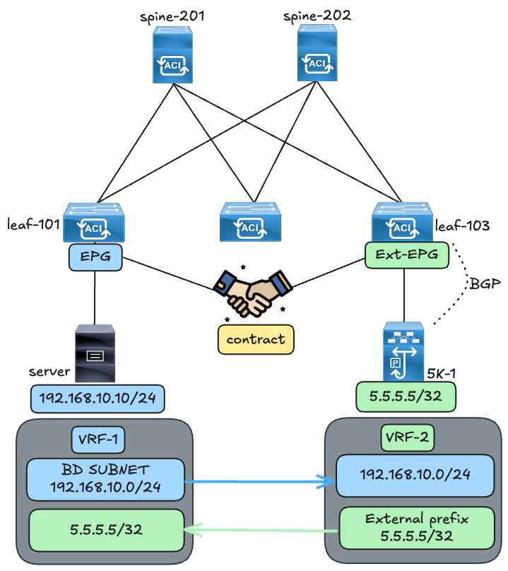
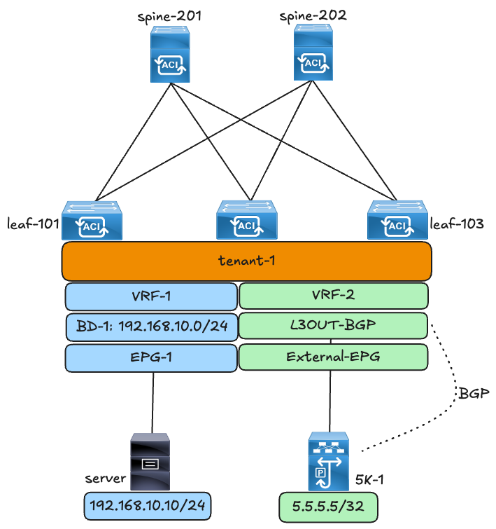
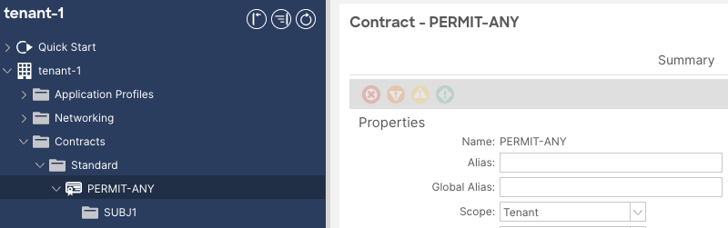
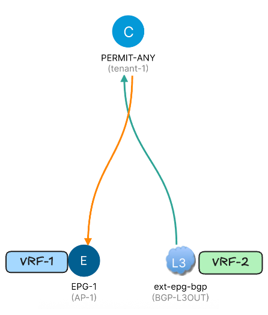
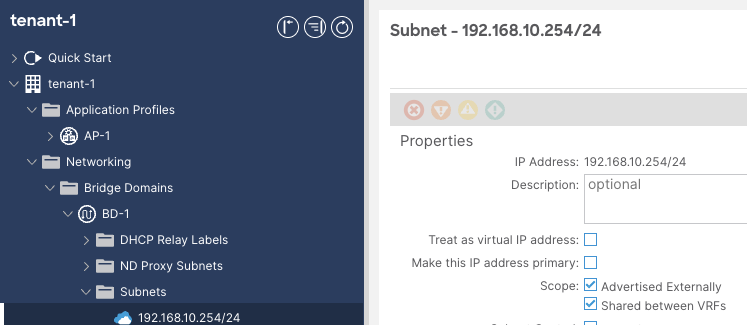
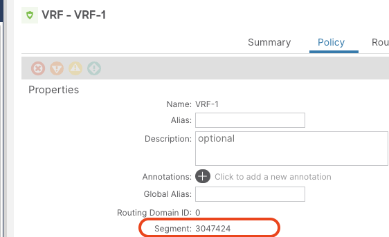
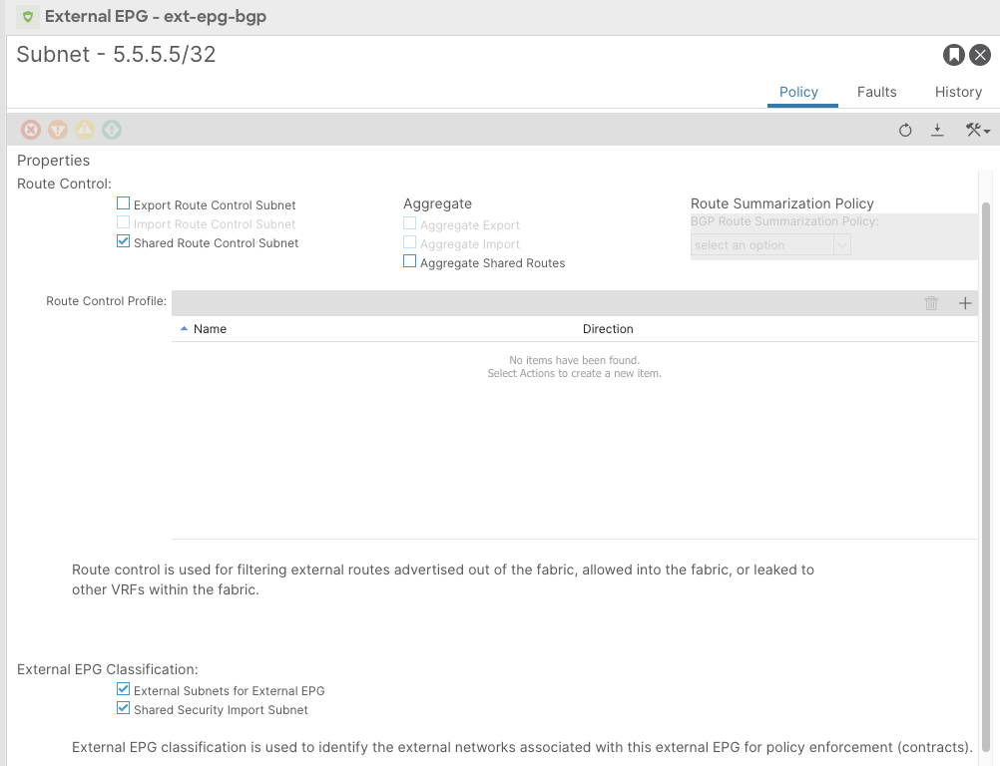
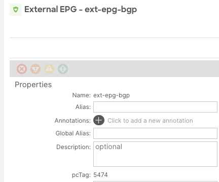
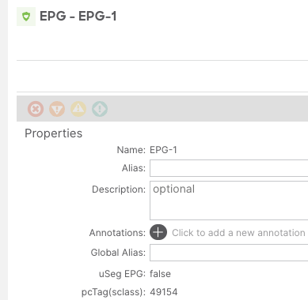

# Cisco ACI Shared L3OUT (VRF Leaking)



!!! note
    This lab was conducted in a controlled environment. Any configurations in a production network should be implemented during a designated maintenance window. Additionally, always refer to official Cisco documentation relevant to your specific hardware and software.

## ACI Shared L3OUT

The concept of VRF leaking with L3Out (known as Shared L3OUT) allows the leaking of external routes learned via an L3Out to another VRF so that it can be consumed by EPGs in that VRF.

This lab will showcase how to leak external routes from a BGP L3OUT in VRF-1 to VRF-2 where the internal subnet resides. The internal subnet will in turn be leaked to VRF-1 as well so that it can be advertised to the external BGP domain. From a contract perspective, the L3OUT external EPG will be configured as the provider and the internal subnet EPG will be the consumer.

## Lab Setup



The initial setup of this lab is as follows:

1. BGP is established between the external router and ACI.
2. The internal subnet is not configured to be shared to another VRF.
3. There is no contract applied yet between the internal EPG (VRF-1) and external EPG (VRF-2).
4. There is no inter-VRF leaking configuration. This will be configured in this lab.

## Initial State Overview

This section will show an overview of the routing tables in VRF-1 and VRF-2.

Leaf-101 – this is the leaf where the server is connected to. (VRF-1)

```text
leaf-101# show ip route vrf tenant-1:VRF-1
IP Route Table for VRF "tenant-1:VRF-1"
'*' denotes best ucast next-hop
'**' denotes best mcast next-hop
'[x/y]' denotes [preference/metric]
'%<string>' in via output denotes VRF <string>

2.2.2.2/32, ubest/mbest: 1/0
    *via 10.0.40.64%overlay-1, [1/0], 00:04:14, bgp-65001, internal, tag 65001
10.12.12.0/30, ubest/mbest: 1/0
    *via 10.0.40.64%overlay-1, [200/0], 00:04:14, bgp-65001, internal, tag 65001
192.168.10.0/24, ubest/mbest: 1/0, attached, direct, pervasive
    *via 10.0.224.66%overlay-1, [1/0], 00:04:15, static
192.168.10.254/32, ubest/mbest: 1/0, attached, pervasive
    *via 192.168.10.254, vlan13, [0/0], 00:04:15, local, local
leaf-101#
leaf-101# show ip route vrf tenant-1:VRF-2
No IP Route Table for VRF "tenant-1:VRF-2"
```

Leaf-103 is the border leaf where the external BGP peer is connected to. (VRF-2)

```text
leaf-103# show ip route vrf tenant-1:VRF-2
IP Route Table for VRF "tenant-1:VRF-2"
'*' denotes best ucast next-hop
'**' denotes best mcast next-hop
'[x/y]' denotes [preference/metric]
'%<string>' in via output denotes VRF <string>

3.3.3.3/32, ubest/mbest: 2/0, attached, direct
    *via 3.3.3.3, lo2, [0/0], 00:12:00, direct
    *via 3.3.3.3, lo2, [0/0], 00:12:00, local, local
5.5.5.5/32, ubest/mbest: 1/0
    *via 10.34.34.2%tenant-1:VRF-2, [20/0], 00:11:53, bgp-65001, external, tag 65002
10.34.34.0/30, ubest/mbest: 1/0, attached, direct
    *via 10.34.34.1, eth1/4, [0/0], 00:11:57, direct
10.34.34.1/32, ubest/mbest: 1/0, attached
    *via 10.34.34.1, eth1/4, [0/0], 00:11:57, local, local
leaf-103#
leaf-103# show ip route vrf tenant-1:VRF-1
No IP Route Table for VRF "tenant-1:VRF-1"
```

## Configuration

The first part of the configuration in this lab is to apply a contract between the internal EPG (in VRF-1) and External EPG (in VRF-2). Since VRF-1 and VRF-2 are in the same tenant, the scope of the contract will be configured as “Tenant” so that it can be visible in both VRFs.



The second part of the configuration is to allow the internal subnet to be “Advertised Externally” and to be “Shared between VRFs”.





After this configuration is applied to the Bridge Domain subnet, the subnet is leaked from VRF-1 to VRF-2. This can be seen on the routing table of the Border Leaf (leaf-103) that has the BGP L3OUT configured.

When the configuration on the Bridge Domain was applied to the subnet, it becomes visible in VRF-2 (i.e. internal subnet in VRF-1 was leaked to VRF-2).

```text
leaf-103# show ip route vrf tenant-1:VRF-2
5.5.5.5/32, ubest/mbest: 1/0
    *via 10.34.34.2%tenant-1:VRF-2, [20/0], 01:38:06, bgp-65001, external, tag 65002
10.34.34.0/30, ubest/mbest: 1/0, attached, direct
    *via 10.34.34.1, eth1/4, [0/0], 01:38:10, direct
10.34.34.1/32, ubest/mbest: 1/0, attached
    *via 10.34.34.1, eth1/4, [0/0], 01:38:10, local, local
192.168.10.0/24, ubest/mbest: 1/0, attached, direct, pervasive
    *via 10.0.224.66%overlay-1, [1/0], 00:01:03, static, tag 4294967292, rwVnid: vxlan-3047424
```

As observed from the output, the leaked internal subnet is assigned a tag 4294967292 and a rwVnid: vxlan-3047424. The tag 4294967292 is automatically applied to a subnet that has been marked to be shared to other VRFS. The VNID “30474724” is the VNID of VRF-1, where the Bridge Domain resides.

VRF-1 VNID verification:



A ‘moquery’ command can be used to show the tag that is automatically assigned to the subnet when it is leaked to another VRF.

```text
admin@apic1:~> moquery -d topology/pod-1/node-103/sys/ipv4/inst/dom-tenant-1:VRF-2/rt-[192.168.10.0/24]
Total Objects shown: 1

# ipv4.Route
prefix              : 192.168.10.0/24
childAction         :
ctrl                : pervasive
descr               :
dn                  : topology/pod-1/node-103/sys/ipv4/inst/dom-tenant-1:VRF-2/rt-[192.168.10.0/24]
flushCount          : 0
lcOwn               : local
modTs               : 2025-09-04T20:42:34.092+00:00
monPolDn            :
name                :
nameAlias           :
pcTag               : any
pref                : 1
rn                  : rt-[192.168.10.0/24]
routingDomId        : 16001
sharedConsCount     : 0
status              :
tag                 : 4294967292
trackId             : 0
```

Note: Keep this tag value in mind -> 4294967292

The third part of the configuration is to allow the external prefix in VRF-2 to be leaked to the consumer VRF (VRF-1).

However, before putting the configuration in place, let us review the outbound route-map towards the external BGP peer.

```text
leaf-103# show bgp ipv4 unicast neighbor 10.34.34.2 vrf tenant-1:VRF-2 | egrep route-map
  Inbound route-map configured is permit-all, handle obtained
  Outbound route-map configured is exp-l3out-BGP-L3OUT-peer-3112960, handle obtained

leaf-103# show route-map exp-l3out-BGP-L3OUT-peer-3112960
route-map exp-l3out-BGP-L3OUT-peer-3112960, deny, sequence 4
  Match clauses:
    tag: 4294967289
  Set clauses:
```

The output indicates that there is no permit action in the existing route-map sequence.

In addition, the internal subnet that has been leaked to VRF-2 is still not advertised to the external BGP peer.

```text
leaf-103# show bgp ipv4 unicast neighbors 10.34.34.2 advertised-routes vrf tenant-1:VRF-2

Peer 10.34.34.2 routes for address family IPv4 Unicast:
BGP table version is 15, local router ID is 3.3.3.3
Status: s-suppressed, x-deleted, S-stale, d-dampened, h-history, *-valid, >-best
Path type: i-internal, e-external, c-confed, l-local, a-aggregate, r-redist, I-injected
Origin codes: i - IGP, e - EGP, ? - incomplete, | - multipath, & - backup

    Network               Next Hop               Metric       LocPrf       Weight Path

leaf-103#
```

This last part of the required configuration is to leak the L3Out subnet (IN VRF-2) to the internal VRF (VRF-1). This is achieved by enabling the ‘Shared Route Control Subnet” and “Shared Security Import Subnet” options on the external EPG under the external prefix.



1. The Shared Route Control Subnet allows the external prefix to be leaked to another VRF.
2. The Shared Security Import Subnet is required in order for the external prefix to be allocated a correct pcTag for contract enforcement.

After this configuration is applied:

1. The outbound route-map towards the external BGP peer is populated with additional sequences.

```text
leaf-103# show route-map exp-l3out-BGP-L3OUT-peer-3112960
route-map exp-l3out-BGP-L3OUT-peer-3112960, deny, sequence 4
  Match clauses:
    tag: 4294967289
  Set clauses:
route-map exp-l3out-BGP-L3OUT-peer-3112960, permit, sequence 15801
  Match clauses:
    tag: 4294967292
  Set clauses:
    tag 0
route-map exp-l3out-BGP-L3OUT-peer-3112960, permit, sequence 15802
  Match clauses:
    tag: 4294967291
  Set clauses:
    tag 4294967295
```

Sequence 15801 is programmed to match any prefix with the internal tag 4294967292 that was assigned to the internal subnet.

2. The internal subnet that was leaked from VRF-1 to VRF-2 is now being advertised to the external BGP peer.

```text
leaf-103# show bgp ipv4 unicast neighbors 10.34.34.2 advertised-routes vrf tenant-1:VRF-2

Peer 10.34.34.2 routes for address family IPv4 Unicast:
BGP table version is 16, local router ID is 3.3.3.3
Status: s-suppressed, x-deleted, S-stale, d-dampened, h-history, *-valid, >-best
Path type: i-internal, e-external, c-confed, l-local, a-aggregate, r-redist, I-injected
Origin codes: i - IGP, e - EGP, ? - incomplete, | - multipath, & - backup

   Network               Next Hop               Metric      LocPrf       Weight Path
*>r192.168.10.0/24       0.0.0.0                     0         100        32768 65001 ?
```

3. The internal subnet is present in the routing table of the external BGP peer

```text
5K-1# show ip route
IP Route Table for VRF "default"
'*' denotes best ucast next-hop
'**' denotes best mcast next-hop
'[x/y]' denotes [preference/metric]
'%<string>' in via output denotes VRF <string>

5.5.5.5/32, ubest/mbest: 2/0, attached
    *via 5.5.5.5, Lo0, [0/0], 2d05h, local
    *via 5.5.5.5, Lo0, [0/0], 2d05h, direct
10.34.34.0/30, ubest/mbest: 1/0, attached
    *via 10.34.34.2, Eth1/3, [0/0], 02:38:48, direct
10.34.34.2/32, ubest/mbest: 1/0, attached
    *via 10.34.34.2, Eth1/3, [0/0], 02:38:48, local
192.168.10.0/24, ubest/mbest: 1/0
    *via 10.34.34.1, [20/0], 00:01:02, bgp-65002, external, tag 65001,
```

4. The external prefix that was leaked from VRF-2 to VRF-1 is now present on the routing table of the server leaf in VRF-1

```text
leaf-101# show ip route vrf tenant-1:VRF-1
IP Route Table for VRF "tenant-1:VRF-1"
'*' denotes best ucast next-hop
'**' denotes best mcast next-hop
'[x/y]' denotes [preference/metric]
'%<string>' in via output denotes VRF <string>

2.2.2.2/32, ubest/mbest: 1/0
    *via 10.0.40.64%overlay-1, [1/0], 02:14:17, bgp-65001, internal, tag 65001
5.5.5.5/32, ubest/mbest: 1/0
    *via 10.0.40.68%overlay-1, [200/0], 00:01:10, bgp-65001, internal, tag 65002, rwVnid:
vxlan-3112960
10.12.12.0/30, ubest/mbest: 1/0
    *via 10.0.40.64%overlay-1, [200/0], 02:14:17, bgp-65001, internal, tag 65001
192.168.10.0/24, ubest/mbest: 1/0, attached, direct, pervasive
    *via 10.0.224.66%overlay-1, [1/0], 01:53:37, static
192.168.10.254/32, ubest/mbest: 1/0, attached, pervasive
    *via 192.168.10.254, vlan13, [0/0], 02:14:18, local, local
```

5. The external prefix is advertised to the spines as a VPNv4 prefix with an extended community (i.e. the Export Route-target) associated with it. Note that the route target is made up of the ACI fabric’s Autonomous System number and the VNID of the VRF where the external L3Out belongs to.

```text
leaf-103# show bgp vpnv4 unicast 5.5.5.5/32 vrf tenant-1:VRF-2
BGP routing table information for VRF overlay-1, address family VPNv4 Unicast
Route Distinguisher: 103:3112960    (VRF tenant-1:VRF-2)
BGP routing table entry for 5.5.5.5/32, version 5 dest ptr 0x99e124fc
Paths: (1 available, best #1)
Flags: (0x00000000080c001a 0000000000) on xmit-list, is in urib, is best urib route, is in HW, exported
  vpn: version 50, (0x0000000000100002) on xmit-list
Multipath: eBGP iBGP

  Advertised path-id 1, VPN AF advertised path-id 1
  Path type (0xa2780ba8): external 0x28 0x400 ref 0 adv path ref 2, path is valid, is best path, in rib
  AS-Path: 65002 , path sourced external to AS
    10.34.34.2 (metric 0) from 10.34.34.2 (5.5.5.5)
      Origin IGP, MED not set, localpref 100, weight 0 tag 0, propagate 0, tunnel resolved 0
      Extcommunity:
          RT:65001:3112960
          VNID:3112960

  VRF advertise information:
  Path-id 1 not advertised to any peer

  VPN AF advertise information:
  Path-id 1 advertised to peers:
    10.0.40.65         10.0.40.66
```

6. On the server leaf an import-route map is configured and the route-target that was exported by the border leaf is imported in the BGP process (VRF-1).

```text
leaf-101# show bgp process vrf tenant-1:VRF-1
Information regarding configured VRFs:

BGP Information for VRF tenant-1:VRF-1
VRF VNID                       : 3047424
VRF RD                         : 101:3047424
…..
    Import route-map 3047424-shared-svc-leak
    Export RT list:
        65001:3047424
    Import RT list:
        65001:3047424
        65001:3112960  allows to import the BGP subnet that were exported from the BGP VRF
    Label mode: per-vrf
```

The route-map “3047424-shared-svc-leak” sequence 22001 is programmed from the application of the “Shared Route Control Subnet” knob and it is configured as shown by the output below:

```text
leaf-101# show route-map 3047424-shared-svc-leak
route-map 3047424-shared-svc-leak, deny, sequence 1
  Match clauses:
    pervasive: 2
  Set clauses:
route-map 3047424-shared-svc-leak, permit, sequence 2
  Match clauses:
    extcommunity (extcommunity-list filter): 3047424-shared-svc-leak
  Set clauses:
route-map 3047424-shared-svc-leak, permit, sequence 22001
  Match clauses:
    ip address prefix-lists: IPv4-3112960-49154-5474-3047424-shared-svc-leak
    ipv6 address prefix-lists: IPv6-deny-all
    extcommunity (extcommunity-list filter): 3112960-49154-5474-3047424-shared-svc-leak-excom
  Set clauses:
```

The extcommunity-list in Sequence 2 allows for the import of VRF-1’s own prefixes.

```text
leaf-101# show ip extcommunity-list 3047424-shared-svc-leak
Standard Extended Community List 3047424-shared-svc-leak
    permit RT:65001:3047424
```

The prefix-list in sequence 22001 matches the external prefix from the BGP L3OUT.

```text
leaf-101# show ip prefix-list IPv4-3112960-49154-5474-3047424-shared-svc-leak
ip prefix-list IPv4-3112960-49154-5474-3047424-shared-svc-leak: 1 entries
   seq 1 permit 5.5.5.5/32
```

In addition, the extended community filter ensures that in VRF-1, the external subnet is imported in the VRF only if it was exported from VNID of the L3OUT VRF (VRF-2). This prevents unwanted route-leaking.

```text
leaf-101# show ip extcommunity-list 3112960-49154-5474-3047424-shared-svc-leak-excom
Standard Extended Community List 3112960-49154-5474-3047424-shared-svc-leak-excom
    permit RT:65001:3112960
```

The external prefix from VRF-2 is imported into the MP-BGP space of VRF-1.

```text
leaf-101# show bgp vpnv4 unicast 5.5.5.5/32 vrf tenant-1:VRF-1
BGP routing table information for VRF overlay-1, address family VPNv4 Unicast
Route Distinguisher: 101:3047424    (VRF tenant-1:VRF-1)
BGP routing table entry for 5.5.5.5/32, version 10 dest ptr 0x99e074fc
Paths: (1 available, best #1)
Flags: (0x000000000008001a 0000000000) on xmit-list, is in urib, is best urib route, is in HW
  vpn: version 102, (0x0000000000100002) on xmit-list
Multipath: eBGP iBGP

  Advertised path-id 1, VPN AF advertised path-id 1
  Path type (0x99d9a094): internal 0xc0000018 0x440 ref 0 adv path ref 2, path is valid, is best path, in
rib
             Imported from (0x99e540f0) 103:3112960:5.5.5.5/32
  AS-Path: 65002 , path sourced external to AS
    10.0.40.68 (metric 3) from 10.0.40.65 (10.0.40.65)
      Origin IGP, MED not set, localpref 100, weight 0 tag 0, propagate 0, tunnel resolved 0
      Received label 0
      Received path-id 1
      Extcommunity:
          RT:65001:3112960
          VNID:3112960
      Originator: 10.0.40.68 Cluster list: 10.0.40.65

  VRF advertise information:
  Path-id 1 not advertised to any peer

  VPN AF advertise information:
  Path-id 1 not advertised to any peer
```

The external BGP peer learns of the internal subnet from VRF-2

```text
5K-1# show ip route
IP Route Table for VRF "default"
'*' denotes best ucast next-hop
'**' denotes best mcast next-hop
'[x/y]' denotes [preference/metric]
'%<string>' in via output denotes VRF <string>

5.5.5.5/32, ubest/mbest: 2/0, attached
    *via 5.5.5.5, Lo0, [0/0], 5d04h, local
    *via 5.5.5.5, Lo0, [0/0], 5d04h, direct
10.34.34.0/30, ubest/mbest: 1/0, attached
    *via 10.34.34.2, Eth1/3, [0/0], 3d02h, direct
10.34.34.2/32, ubest/mbest: 1/0, attached
    *via 10.34.34.2, Eth1/3, [0/0], 3d02h, local
192.168.10.0/24, ubest/mbest: 1/0
    *via 10.34.34.1, [20/0], 2d22h, bgp-65002, external, tag 65001,
```

The server in VRF-1 has reachability to the external prefix in VRF-2.

```text
server# ping 5.5.5.5 source 192.168.10.10
PING 5.5.5.5 (5.5.5.5) from 192.168.10.10: 56 data bytes
64 bytes from 5.5.5.5: icmp_seq=0 ttl=252 time=0.999 ms
64 bytes from 5.5.5.5: icmp_seq=1 ttl=252 time=0.744 ms
64 bytes from 5.5.5.5: icmp_seq=2 ttl=252 time=0.819 ms
64 bytes from 5.5.5.5: icmp_seq=3 ttl=252 time=0.745 ms
64 bytes from 5.5.5.5: icmp_seq=4 ttl=252 time=0.736 ms
```

The internal subnet can be reached from the external BGP router.

```text
5K-1# ping 192.168.10.10 source 5.5.5.5
PING 192.168.10.10 (192.168.10.10) from 5.5.5.5: 56 data bytes
64 bytes from 192.168.10.10: icmp_seq=0 ttl=252 time=1.228 ms
64 bytes from 192.168.10.10: icmp_seq=1 ttl=252 time=0.852 ms
64 bytes from 192.168.10.10: icmp_seq=2 ttl=252 time=0.886 ms
64 bytes from 192.168.10.10: icmp_seq=3 ttl=252 time=0.839 ms
64 bytes from 192.168.10.10: icmp_seq=4 ttl=252 time=0.83 ms

--- 192.168.10.10 ping statistics ---
5 packets transmitted, 5 packets received, 0.00% packet loss
round-trip min/avg/max = 0.83/0.926/1.228 ms
```

## Bonus

The policy enforcement (i.e. contract application) is enforced on the consumer leaf. The zoning prefix table shows that the external prefix along with the external EPG tag are known in VRF-1.

```text
leaf-101# show zoning-prefixes
+---------+----------------+------------+-------+-----------+
| Vrf-Vni |    Vrf-Name    | Address    | Class | OperState |
+---------+----------------+------------+-------+-----------+
| 3047424 | tenant-1:VRF-1 | 0.0.0.0/0 |    15 | enabled |
| 3047424 | tenant-1:VRF-1 |    ::/0    |   15 | enabled |
| 3047424 | tenant-1:VRF-1 | 5.5.5.5/32 | 5474 | enabled |
+---------+----------------+------------+-------+-----------+
```

The zoning rule table is programmed as follows:

```text
leaf-101# show zoning-rule scope 3047424
+---------+--------+--------+----------+----------------+---------+---------+---------------------+----------+------------------------+
| Rule ID | SrcEPG | DstEPG | FilterID |      Dir       | operSt | Scope |            Name        | Action |          Priorit y       |
+---------+--------+--------+----------+----------------+---------+---------+---------------------+----------+------------------------+
|   4100 | 5474 | 49154 |        2     | uni-dir-ignore | enabled | 3047424 | tenant-1:PERMIT-ANY | permit |       fully_qual(7)      |
|   4101 | 49154 | 5474 |        2     |     bi-dir     | enabled | 3047424 | tenant-1:PERMIT-ANY | permit |       fully_qual(7)      |
|   4102 | 5474 |      0    | implicit |    uni-dir     | enabled | 3047424 |                     | deny,log | shsrc_any_any_deny(12) |
+---------+--------+--------+----------+----------------+---------+---------+---------------------+----------+------------------------+
```





pcTag of the external EPG is – 5474. pcTag of the internal EPG is - 49154

Contract hit count indicates that policy enforcement is indeed taking place.

```text
leaf-101# contract_parser.py --vrf tenant-1:VRF-1
Key:
[prio:RuleId] [vrf:{str}] action protocol src-epg [src-l4] dst-epg [dst-l4] [flags][contract:{str}] [hit=count]

[7:4101] [vrf:tenant-1:VRF-1] permit ip icmp tn-tenant-1/ap-AP-1/epg-EPG-1(49154) tn-tenant-1/l3out-BGP-L3OUT/instP-ext-epg-bgp(5474)
[contract:uni/tn-tenant-1/brc-PERMIT-ANY] [hit=15]
[7:4100] [vrf:tenant-1:VRF-1] permit ip icmp tn-tenant-1/l3out-BGP-L3OUT/instP-ext-epg-bgp(5474) tn-tenant-1/ap-AP-1/epg-EPG-1(49154)
[contract:uni/tn-tenant-1/brc-PERMIT-ANY] [hit=15]
```

On the provider leaf there is no contract enforcement. The external EPG pcTag is the SrcEPG and by default the destination EPG pcTag is 14. The rule between these pcTag is just a permit_override/ permit bypass policy. This is the programmed rule when traffic comes from an external EPG and it wants to communicate with a subnet in a different VRF.

```text
leaf-103# show zoning-rule scope 3112960
+---------+--------+--------+----------+---------+---------+---------+------+-----------------+----------------------+
| Rule ID | SrcEPG | DstEPG | FilterID |   Dir   | operSt | Scope | Name |         Action     |       Priority       |
+---------+--------+--------+----------+---------+---------+---------+------+-----------------+----------------------+
|   4101 | 5474 |      14   | implicit | uni-dir | enabled | 3112960 |      | permit_override |    src_dst_any(9)    |
+---------+--------+--------+----------+---------+---------+---------+------+-----------------+----------------------+
```

## References

- [https://www.cisco.com/c/en/us/solutions/collateral/data-center-virtualization/application-centric-infrastructure/guide-c07-743150.html#L3OutsharedserviceVRFrouteleaking](https://www.cisco.com/c/en/us/solutions/collateral/data-center-virtualization/application-centric-infrastructure/guide-c07-743150.html#L3OutsharedserviceVRFrouteleaking)
- [https://www.cisco.com/c/en/us/solutions/collateral/data-center-virtualization/application-centric-infrastructure/white-paper-c11-743951.html#ContracttoanL3OutEPG](https://www.cisco.com/c/en/us/solutions/collateral/data-center-virtualization/application-centric-infrastructure/white-paper-c11-743951.html#ContracttoanL3OutEPG)
