# Cisco ACI Transit Routing Configuration

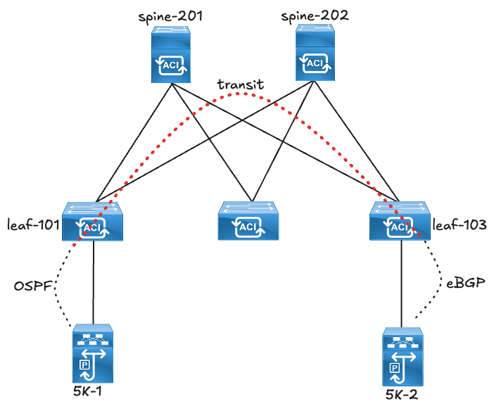

!!! note
    This lab was conducted in a controlled environment. Any configurations in a production network should be implemented during a designated maintenance window. Additionally, always refer to official Cisco documentation relevant to your specific hardware and software.

## ACI L3OUT Transit Routing Overview

Cisco ACI supports transit routing, allowing the fabric to act as an intermediary between external routing domains. When transit routing is configured, ACI learns routes from one domain and advertises them into another. This capability is often used to interconnect data centers, WAN and internet edge routers, or heterogeneous routing environments, while still enforcing ACI’s policy and security constructs.

In this lab, ACI is configured as a transit network between an external OSPF-routed domain and an external BGP-routed domain. Routes learned from OSPF are redistributed into BGP, and vice versa.

Two methods are demonstrated for controlling route advertisement:

1. Export Route Control Subnet knob – defining prefixes directly under the External EPG with export scope.
2. Default-export route-map – using policy-based control to filter and advertise specific routes.

The lab highlights how each method influences the resulting prefix-lists and route-maps programmed in the fabric.

## Lab Setup

The initial setup of this lab is as follows:

1. Established OSPF and BGP peerings between ACI and the external routing domains.
2. OSPF routes are advertised into ACI and BGP routes are also advertised into ACI.
3. There is currently no advertisement of OSPF into BGP or BGP into OSPF, which will be achieved by this lab.

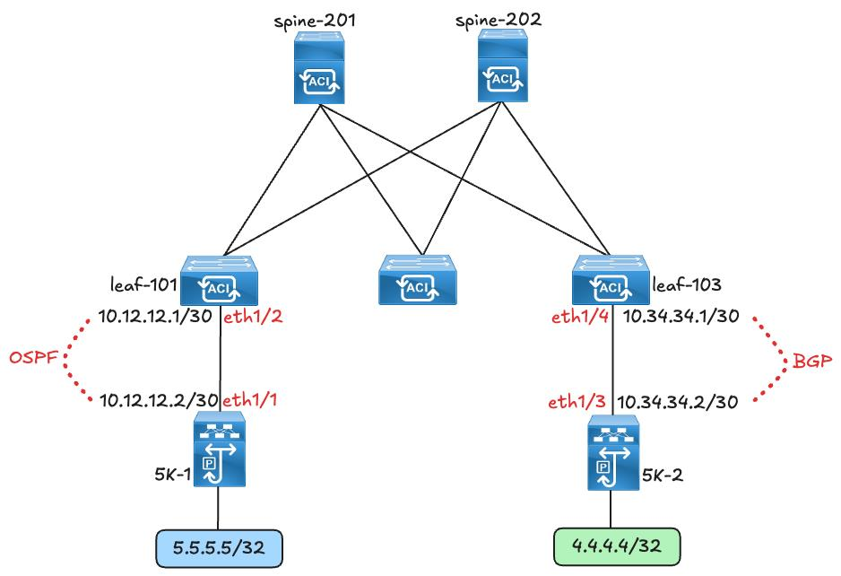

## Pre-requisites

Ensure that the required configuration for standard ACI L3OUT is in place.

!!! note
    This document does not show the step by step configuration for ACI L3Out.

Initial State (before Transit routing is put in place):

1. External OSPF route is injected into MP-BGP (ACI).

By issuing the “show bgp process” command on a border leaf; the output shows the route maps that are used for Redistribution from a different routing domain into ACI MP-BGP. The default permit-all route map allows external OSPF routes to be automatically redistributed into the ACI MP-BGP space.

```text
leaf-101# show bgp process vrf tenant-1:VRF-1

Information regarding configured VRFs:

BGP Information for VRF tenant-1:VRF-1
VRF Type                       : System
VRF Flag                       : default
VRF Id                         : 5
VRF state                      : UP
VRF configured                 : yes
VRF refcount                   : 0
VRF VNID                       : 3047424
Router-ID                      : 2.2.2.2
……
No. of established peers       : 0
VRF RD                         : 101:3047424
VRF EVPN RD                    : 101:3047424
VRF Internal Domain ID         : 0
VRF label index                : 0

     Information for address family IPv4 Unicast in VRF tenant-1:VRF-1
     Table Id                   : 5
     Table state                : UP
     Table refcount             : 8
     Peers      Active-peers    Routes     Paths      Networks   Aggregates
     0          0               5          5          0          0

     Redistribution
         coop, route-map exp-ctx-coop-bgp-3047424
         direct, route-map imp-ctx-bgp-direct-interleak-3047424
         static, route-map imp-ctx-bgp-st-interleak-3047424
         ospf, route-map permit-all
```

The route map allows all prefixes by default, there are no restrictions.

```text
leaf-101# show route-map permit-all
route-map permit-all, permit, sequence 2
  Match clauses:
  Set clauses:
```

The 5.5.5.5/32 prefix that is advertised from the external OSPF domain is redistributed into ACI (MP-BGP space) by the border leaf and advertised to the spines (route reflectors) which in turn will advertise the prefix to the rest of the leafs in the fabric.

```text
leaf-101# show bgp vpnv4 unicast 5.5.5.5/32 vrf tenant-1:VRF-1
BGP routing table information for VRF overlay-1, address family VPNv4 Unicast
Route Distinguisher: 101:3047424    (VRF tenant-1:VRF-1)
BGP routing table entry for 5.5.5.5/32, version 7 dest ptr 0x7fca0780067c
Paths: (1 available, best #1)
Flags: (0x00000000080c0002 0000000000) on xmit-list, is not in urib, exported
  vpn: version 14, (0x0000000000100002) on xmit-list
Multipath: eBGP iBGP

   Advertised path-id 1, VPN AF advertised path-id 1
   Path type (0x7fca10213a18): redist 0x408 0x1 ref 0 adv path ref 2, path is valid, is best path
   AS-Path: NONE, path locally originated
     0.0.0.0 (metric 0) from 0.0.0.0 (10.0.40.64)
       Origin incomplete, MED 5, localpref 100, weight 32768 tag 0, propagate 0, tunnel resolved 0
       Extcommunity:
           RT:65001:3047424
           VNID:3047424
           COST:pre-bestpath:162:110

   VRF advertise information:
   Path-id 1 not advertised to any peer

   VPN AF advertise information:
   Path-id 1 advertised to peers:
     10.0.40.65            10.0.40.66
```

2. External BGP ipv4 route is injected into MP-BGP (ACI).

The 4.4.4.4/32 prefix that is advertised from the external BGP domain is redistributed into ACI (MP-BGP space) by the border leaf and advertised to the spines (route reflectors) which in turn will advertise the prefix to the rest of the leafs in the fabric.

```text
leaf-103# show bgp vpnv4 unicast 4.4.4.4/32 vrf tenant-1:VRF-1
BGP routing table information for VRF overlay-1, address family VPNv4 Unicast
Route Distinguisher: 103:3047424    (VRF tenant-1:VRF-1)
BGP routing table entry for 4.4.4.4/32, version 9 dest ptr 0x99dd0218
Paths: (1 available, best #1)
Flags: (0x00000000080c001a 0000000000) on xmit-list, is in urib, is best urib route, is in HW, exported
  vpn: version 23, (0x0000000000100002) on xmit-list
Multipath: eBGP iBGP

   Advertised path-id 1, VPN AF advertised path-id 1
   Path type (0xa2738c10): external 0x28 0x400 ref 0 adv path ref 2, path is valid, is best path, in rib
   AS-Path: 65002 , path sourced external to AS
     10.34.34.2 (metric 0) from 10.34.34.2 (4.4.4.4)
       Origin IGP, MED not set, localpref 100, weight 0 tag 0, propagate 0, tunnel resolved 0
       Extcommunity:
           RT:65001:3047424
           VNID:3047424

   VRF advertise information:
   Path-id 1 not advertised to any peer

   VPN AF advertise information:
   Path-id 1 advertised to peers:
     10.0.40.65            10.0.40.66
```

3. External OSPF Router – Routing table check

5K-1, the external OSPF router is currently not learning any prefixes from ACI, other that the border leaf Router-ID (2.2.2.2/320 which is in the OSPF area. The point to highlight at this stage is that 5K-1 is not learning 4.4.4.4/32 which is advertised from BGP. This is expected as the Transit Routing configuration has not been put in place as yet.

```text
(5K-1 OSPF Peer)
5K-1# show ip route
IP Route Table for VRF "default"
'*' denotes best ucast next-hop
'**' denotes best mcast next-hop
'[x/y]' denotes [preference/metric]
'%<string>' in via output denotes VRF <string>

2.2.2.2/32, ubest/mbest: 1/0
    *via 10.12.12.1, Eth1/1, [110/5], 00:06:13, ospf-10, intra
5.5.5.5/32, ubest/mbest: 2/0, attached
    *via 5.5.5.5, Lo0, [0/0], 00:49:28, local
    *via 5.5.5.5, Lo0, [0/0], 00:49:28, direct
10.12.12.0/30, ubest/mbest: 1/0, attached
    *via 10.12.12.2, Eth1/1, [0/0], 00:07:07, direct
10.12.12.2/32, ubest/mbest: 1/0, attached
    *via 10.12.12.2, Eth1/1, [0/0], 00:07:07, local
```

4. External BGP Router – Routing table check

5K-2, the external BGP router is currently not learning any prefixes from ACI. The point to highlight at this stage is that 5K-2 is not learning 5.5.5.5/32 which is advertised from OSPF. This is expected as the Transit Routing configuration has not been put in place as yet.

```text
(5K-2 BGP Peer)
5K-2# show ip route
IP Route Table for VRF "default"
'*' denotes best ucast next-hop
'**' denotes best mcast next-hop
'[x/y]' denotes [preference/metric]
'%<string>' in via output denotes VRF <string>

4.4.4.4/32, ubest/mbest: 2/0, attached
    *via 4.4.4.4, Lo0, [0/0], 00:46:00, local
    *via 4.4.4.4, Lo0, [0/0], 00:46:00, direct
10.34.34.0/30, ubest/mbest: 1/0, attached
    *via 10.34.34.2, Eth1/3, [0/0], 00:10:22, direct
10.34.34.2/32, ubest/mbest: 1/0, attached
    *via 10.34.34.2, Eth1/3, [0/0], 00:10:22, local
```

Now that the playing field has been set, the rest of the document will show case how to configure Transit Routing on Cisco ACI, what route-maps gets programmed and how external prefixes are redistributed from their origin domain to another external routing domain.

Let’s head to the configuration!!

## Method 1: Export Route Control Subnet

The first method is the Export Route Control Subnet configuration knob. In this configuration, the prefix that needs to be advertised to the external router must be defined under the corresponding L3Out external EPG, with its scope marked as Export Route Control Subnet. This setting ensures that the fabric advertises the selected subnet into the external routing domain.

In this example, 5.5.5.5/32 (originating from OSPF) is defined in the BGP L3Out with the scope Export Route Control Subnet, while 4.4.4.4/32 (originating from BGP) is defined in the OSPF L3Out with the same scope. The diagram below provides a graphical representation of these subnets and their scope within each L3Out.”

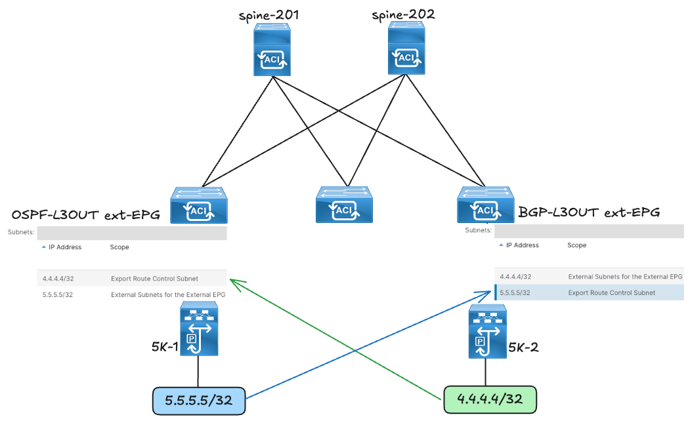

To achieve this configuration, navigate to the L3OUT of interest >> expand the External EPG and Create a new subnet, tick the Export Route Control Subnet and ensure to untick the External Subnets for External EPG box as this is ticked by default.

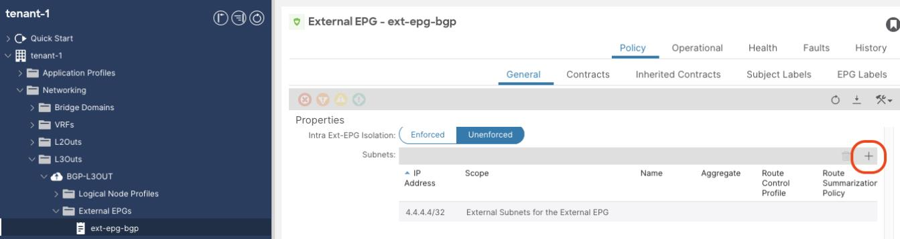

!!! note
    5.5.5.5/32 (origin BGP) is configured under the OSPF External EPG.

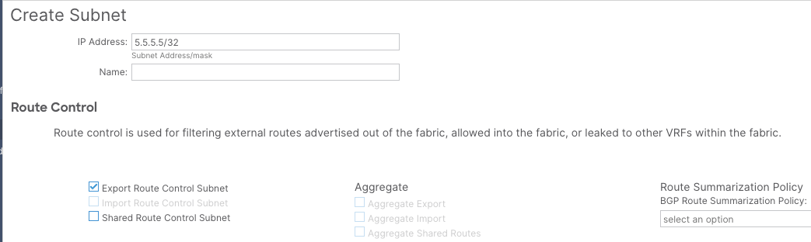

Perform the same configuration under OSPF L3Out

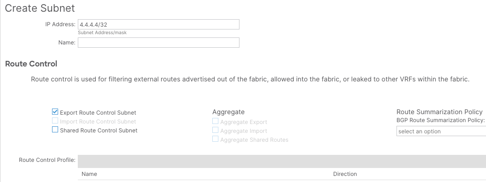

!!! note
    4.4.4.4/32 (origin OSPF) is configured under the BGP External EPG.

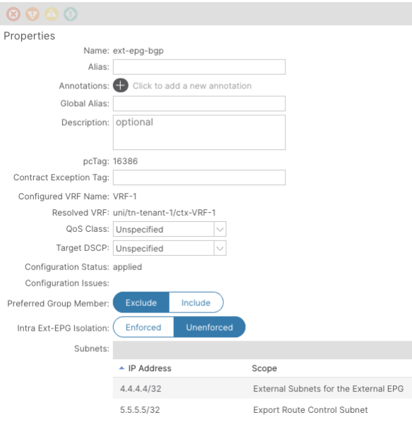

The resulting configuration under the respective External EPGs are illustrated below:

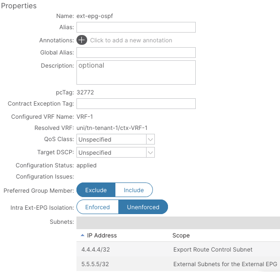

After this configuration has been implemented, we can now analyse the routing tables of the external routers.

As seen by the output below; 4.4.4.4/32 from BGP is now being learned by the OSPF router.

```text
(5K-1 OSPF Peer)
5K-1# show ip route
IP Route Table for VRF "default"
'*' denotes best ucast next-hop
'**' denotes best mcast next-hop
'[x/y]' denotes [preference/metric]
'%<string>' in via output denotes VRF <string>

2.2.2.2/32, ubest/mbest: 1/0
    *via 10.12.12.1, Eth1/1, [110/5], 10:55:19, ospf-10, intra
4.4.4.4/32, ubest/mbest: 1/0
    *via 10.12.12.1, Eth1/1, [110/1], 00:02:24, ospf-10, type-2, tag 4294967295,

5.5.5.5/32, ubest/mbest: 2/0, attached
    *via 5.5.5.5, Lo0, [0/0], 11:38:34, local
    *via 5.5.5.5, Lo0, [0/0], 11:38:34, direct
10.12.12.0/30, ubest/mbest: 1/0, attached
    *via 10.12.12.2, Eth1/1, [0/0], 10:56:13, direct
10.12.12.2/32, ubest/mbest: 1/0, attached
    *via 10.12.12.2, Eth1/1, [0/0], 10:56:13, local
```

5.5.5.5/32 from OSPF is now being learned by the BGP router.

```text
(5K-2 BGP Peer)
5K-2# show ip route
IP Route Table for VRF "default"
'*' denotes best ucast next-hop
'**' denotes best mcast next-hop
'[x/y]' denotes [preference/metric]
'%<string>' in via output denotes VRF <string>

4.4.4.4/32, ubest/mbest: 2/0, attached
    *via 4.4.4.4, Lo0, [0/0], 00:55:16, local
    *via 4.4.4.4, Lo0, [0/0], 00:55:16, direct
5.5.5.5/32, ubest/mbest: 1/0
    *via 10.34.34.1, [20/0], 00:00:09, bgp-65002, external, tag 65001,
10.34.34.0/30, ubest/mbest: 1/0, attached
    *via 10.34.34.2, Eth1/3, [0/0], 00:19:38, direct
10.34.34.2/32, ubest/mbest: 1/0, attached
    *via 10.34.34.2, Eth1/3, [0/0], 00:19:38, local
```

Let’s explore in-depth how this advertisement is accomplished:

BGP side.

1. Verify the outbound route-map for the BGP neighbor

```text
leaf-103# show bgp ipv4 unicast neighbors 10.34.34.2 vrf tenant-1:VRF-1 | egrep Outbound

  Outbound route-map configured is exp-l3out-BGP-L3OUT-peer-3047424, handle obtained
```

An outbound route-map towards the external BGP peer was in place and as shown below it only had sequencies with “deny” actions and there was no sequence matching any prefix.

```text
leaf-103# show route-map exp-l3out-BGP-L3OUT-peer-3047424
route-map exp-l3out-BGP-L3OUT-peer-3047424, deny, sequence 4
  Match clauses:
    tag: 4294967289
  Set clauses:
route-map exp-l3out-BGP-L3OUT-peer-3047424, deny, sequence 16000
  Match clauses:
    route-type: direct
  Set clauses:
```

When the Transit Routing configuration was added, an extra sequence with “permit” action was added to the route-map.

```text
leaf-103# show route-map exp-l3out-BGP-L3OUT-peer-3047424
route-map exp-l3out-BGP-L3OUT-peer-3047424, deny, sequence 4
  Match clauses:
    tag: 4294967289
  Set clauses:
route-map exp-l3out-BGP-L3OUT-peer-3047424, permit, sequence 15801
  Match clauses:
    ip address prefix-lists: IPv4-peer16386-3047424-exc-ext-inferred-export-dst
    ipv6 address prefix-lists: IPv6-deny-all
  Set clauses:
    tag 4294967295
route-map exp-l3out-BGP-L3OUT-peer-3047424, deny, sequence 16000
  Match clauses:
    route-type: direct
  Set clauses:
```

Let’s check the prefix-list that was programmed under the sequence 15801 with a “permit” action

```text
leaf-103# show ip prefix-list IPv4-peer16386-3047424-exc-ext-inferred-export-dst
ip prefix-list IPv4-peer16386-3047424-exc-ext-inferred-export-dst: 1 entries
   seq 1 permit 5.5.5.5/32
```

It is evident from the prefix-list that it matches the 5.5.5.5/32 prefix advertised by OSPF.

Verify the advertised route from ACI to the external BGP peer

```text
leaf-103# show bgp ipv4 unicast neighbors 10.34.34.2 advertised-routes vrf tenant-1:VRF-1

Peer 10.34.34.2 routes for address family IPv4 Unicast:
BGP table version is 8, local router ID is 3.3.3.3
Status: s-suppressed, x-deleted, S-stale, d-dampened, h-history, *-valid, >-best
Path type: i-internal, e-external, c-confed, l-local, a-aggregate, r-redist, I-injected
Origin codes: i - IGP, e - EGP, ? - incomplete, | - multipath, & - backup

   Network                Next Hop                Metric       LocPrf       Weight Path
*>i5.5.5.5/32             10.0.40.64                   5          100            0 65001 ?
```

The 5.5.5.5/32 is advertised to the external BGP neighbor.

OSPF side:

Let’s look on the OSPF side to see how the prefix from BGP was advertised to OSPF.

By evaluating the OSPF process on ACI, it is evident that route-maps remain at the core for redistribution. There is an outbound route-map that is used for redistributing routes from BGP into an OSPF area.

Evaluate the outbound route-map for BGP to OSPF redistribution

```text
leaf-101# show ip ospf vrf tenant-1:VRF-1

 Routing Process default with ID 2.2.2.2 VRF tenant-1:VRF-1
 Stateful High Availability enabled
Graceful-restart helper mode is enabled
 Supports only single TOS(TOS0) routes
 Supports opaque LSA
 Table-map using route-map exp-ctx-3047424-deny-external-tag
 Redistributing External Routes from
   static route-map exp-ctx-st-3047424
   direct route-map exp-ctx-st-3047424
    bgp route-map exp-ctx-proto-3047424
    coop route-map exp-ctx-st-3047424
    eigrp route-map exp-ctx-proto-3047424
```

!!! note
    Before the Transit Routing configuration was put in place, there was no policy configured under this route-map.

```text
leaf-101# show route-map exp-ctx-proto-3047424
% Policy exp-ctx-proto-3047424 not found
```

When the Transit Routing configuration was put in place, 2 sequences were programmed under the route-map. The scope of this document will only evaluate sequence 15801 with a “permit” action and a prefix-list added to it.

Route-map sequence

```text
leaf-101# show route-map exp-ctx-proto-3047424
route-map exp-ctx-proto-3047424, deny, sequence 4
  Match clauses:
    tag: 4294967289
  Set clauses:
route-map exp-ctx-proto-3047424, permit, sequence 15801
  Match clauses:
    ip address prefix-lists: IPv4-proto32772-3047424-exc-ext-inferred-export-dst
    ipv6 address prefix-lists: IPv6-deny-all
  Set clauses:
    tag 4294967295
```

Prefix-list

```text
leaf-101# show ip prefix-list IPv4-proto32772-3047424-exc-ext-inferred-export-dst
ip prefix-list IPv4-proto32772-3047424-exc-ext-inferred-export-dst: 1 entries
   seq 1 permit 4.4.4.4/32
```

The prefix list has the 4.4.4.4/32 which is advertised from BGP.

The prefix (5.5.5.5/32) is in the OSPF database as an external LSA type 5 on the border leaf with the OSPF L3OUT and on the external OSPF router:

```text
leaf-101# show ip ospf database external 4.4.4.4 vrf tenant-1:VRF-1
        OSPF Router with ID (2.2.2.2) (Process ID default VRF tenant-1:VRF-1)

                   Type-5 AS External Link States

Link ID            ADV Router        Age          Seq#       Checksum Tag
4.4.4.4            2.2.2.2           38           0x80000002 0xf5c2    4294967295


5K-1# show ip ospf database
        OSPF Router with ID (5.5.5.5) (Process ID 10 VRF default)

                   Router Link States (Area 0.0.0.0)

Link ID            ADV Router        Age          Seq#       Checksum Link Count
2.2.2.2            2.2.2.2           388          0x8000017e 0xc17b   3
5.5.5.5            5.5.5.5           425          0x80000003 0xffa2   3

                   Type-5 AS External Link States

Link ID            ADV Router        Age          Seq#       Checksum Tag
4.4.4.4            2.2.2.2           333          0x80000002 0xf5c2    4294967295
```

Now that routes are successfully advertisement from either external routing domain, a contract is required between the 2 external EPGs (OSPF and BGP) so allow reachability between the 2 prefixes.

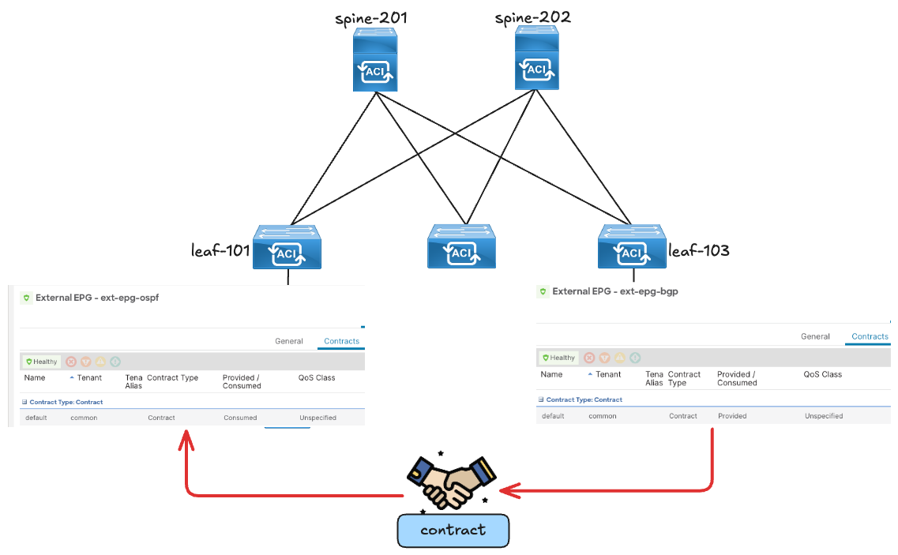

In order to analyse the zoning-rule table it is important to take note of the pcTags of each respective external EPG as shown below.

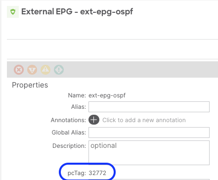

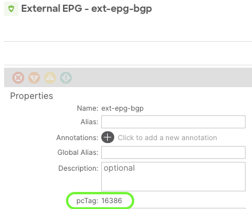

The pcTag for the OSPF External EPG is 32772 and the pcTag for the BGP External EPG is 16386.

The output below show that the 5.5.5.5/32 prefix that originates from OSPF is classified in the OSPF External EPG and the 4.4.4.4/32 prefix that originates from BGP is classified in the BGP External EPG.

```text
leaf-101# show zoning-prefix
+---------+----------------+------------+-------+-----------+
| Vrf-Vni |    Vrf-Name    | Address    | Class | OperState |
+---------+----------------+------------+-------+-----------+
| 3047424 | tenant-1:VRF-1 |    ::/0    |   15 | enabled |
| 3047424 | tenant-1:VRF-1 | 0.0.0.0/0 |    15 | enabled |
| 3047424 | tenant-1:VRF-1 | 5.5.5.5/32 | 32772 | enabled |
| 3047424 | tenant-1:VRF-1 | 4.4.4.4/32 | 16386 | enabled |
```

The zoning-rule table below shows the permit action applied between the 2 External EPGs to allow the required ICMP reachability.

```text
leaf-101# show zoning-rule scope 3047424
+---------+--------+--------+----------+----------------+---------+---------+----------------+----------+----------------------+
| Rule ID | SrcEPG | DstEPG | FilterID |      Dir       | operSt | Scope |         Name      | Action |         Priority       |
+---------+--------+--------+----------+----------------+---------+---------+----------------+----------+----------------------+
|   4099 |    0    |   0    | implarp |     uni-dir     | enabled | 3047424 |                | permit | any_any_filter(17) |
|   4098 |    0    |   0    | implicit |    uni-dir     | enabled | 3047424 |                | deny,log |   any_any_any(21)    |
|   4100 |    0    |   15   | implicit |    uni-dir     | enabled | 3047424 |                | deny,log | any_vrf_any_deny(22) |
|   4102 | 16386 | 32772 | default | uni-dir-ignore | enabled | 3047424 | common:default | permit |          src_dst_any(9)    |
|   4101 | 32772 | 16386 | default |         bi-dir     | enabled | 3047424 | common:default | permit |      src_dst_any(9)    |
+---------+--------+--------+----------+----------------+---------+---------+----------------+----------+----------------------+
```

ICMP reachability is achieved ☺

5K-1 (OSPF peer)

```text
5K-1# ping 4.4.4.4 source 5.5.5.5
PING 4.4.4.4 (4.4.4.4) from 5.5.5.5: 56 data bytes
64 bytes from 4.4.4.4: icmp_seq=0 ttl=252 time=0.992 ms
64 bytes from 4.4.4.4: icmp_seq=1 ttl=252 time=0.714 ms
64 bytes from 4.4.4.4: icmp_seq=2 ttl=252 time=0.704 ms
64 bytes from 4.4.4.4: icmp_seq=3 ttl=252 time=0.631 ms
64 bytes from 4.4.4.4: icmp_seq=4 ttl=252 time=0.704 ms
```

5K-2 (BGP peer)

```text
5K-2# ping 5.5.5.5 source 4.4.4.4
PING 5.5.5.5 (5.5.5.5) from 4.4.4.4: 56 data bytes
64 bytes from 5.5.5.5: icmp_seq=0 ttl=252 time=1.02 ms
64 bytes from 5.5.5.5: icmp_seq=1 ttl=252 time=0.763 ms
64 bytes from 5.5.5.5: icmp_seq=2 ttl=252 time=0.659 ms
64 bytes from 5.5.5.5: icmp_seq=3 ttl=252 time=0.739 ms
64 bytes from 5.5.5.5: icmp_seq=4 ttl=252 time=0.647 ms
```

## Method 2: Using L3Out Route Profile/Route Map

A route map can be configured to redistribute (export) external routes from one L3Out to another.

In this use case, I will use a default-export route map to advertise another external route from OSPF to BGP.

An additional prefix is added on the external router (OSPF) and it will be advertised to the BGP space using a default-export route-map instead of the Export Route Control Subnet option.

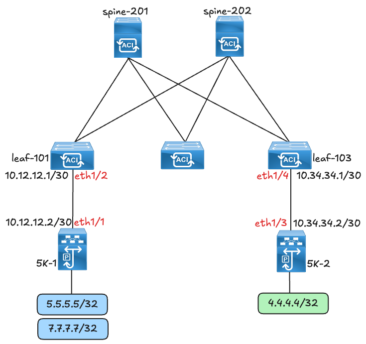

On the OSPF external EPG:

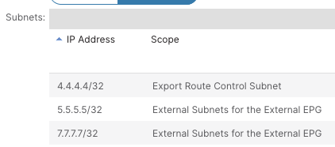

In this use case, the required default-export route map will be created under the BGP L3OUT.

To configure and a default export, Navigate to and expand the specific L3OUT >> Right click on the Route map for import and export route control to create the route map.

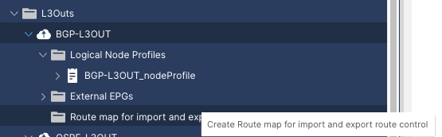

Under name, select the default-export option:

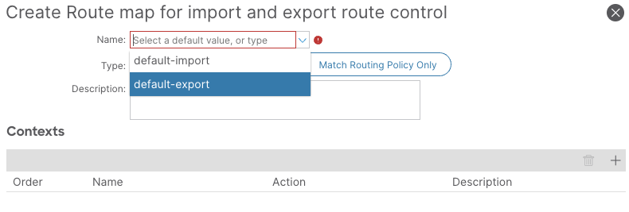

There are 2 Options regarding the Route Profile Type. “Match Prefix AND Routing Policy” and “Match Routing Policy Only”. Do you want to know the difference between these 2? Check out the last section of this document “Bonus: Differences between “Match Prefix AND Routing Policy” and “Match Routing Policy Only”.

For now l will proceed with the configuration steps and choose the Match Prefix AND Routing Policy option.

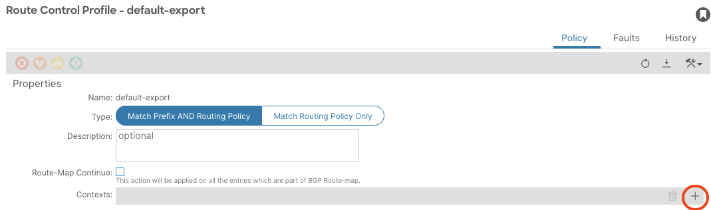

Click on the (+) icon to add a Route Control Context. A context is equivalent to a sequence in a route-map.

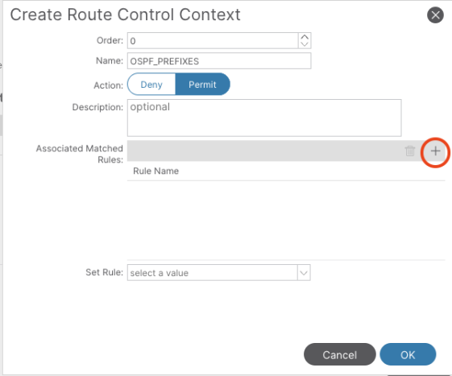

Select a Deny/Permit action for the context and proceed to add “Associated Match Rules”.

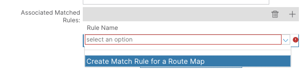

Create Match Rule for a Route Map:

Match Rules are equivalent to match clauses in a route-map. For this Match Rule, the intention is to match the 7.7.7.7/32 prefix that is being advertised from OSPF.

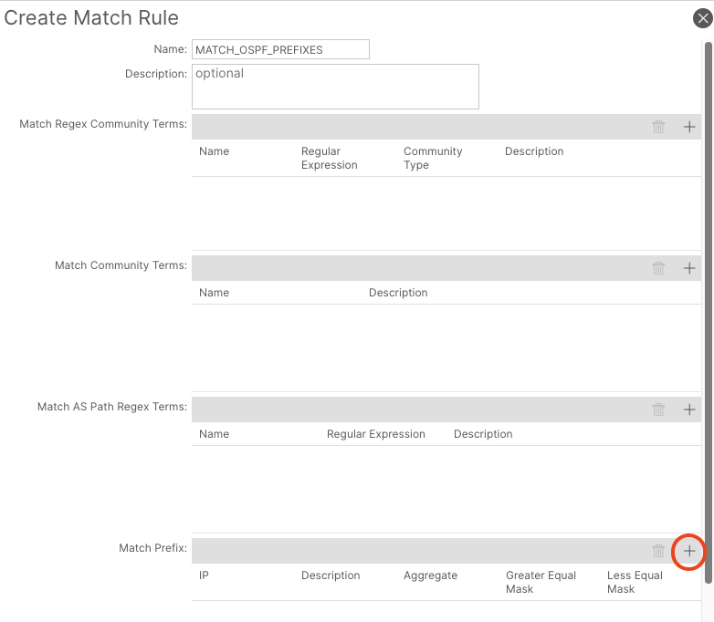

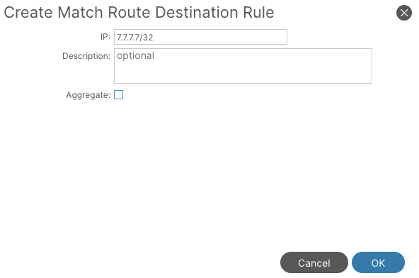

The default-export route map is automatically applied to the entire L3OUT that it is configured under.

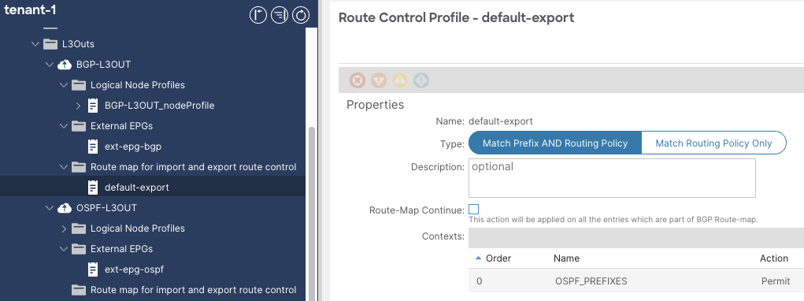

A quick look on the routing table of the BGP external router shows that the 7.7.7.7/32 has been successfully advertised from OSPF to BGP.

Routing table on 5K-2 (BGP router)

```text
5K-2# show ip route
IP Route Table for VRF "default"
'*' denotes best ucast next-hop
'**' denotes best mcast next-hop
'[x/y]' denotes [preference/metric]
'%<string>' in via output denotes VRF <string>

4.4.4.4/32, ubest/mbest: 2/0, attached
    *via 4.4.4.4, Lo0, [0/0], 2d22h, local
    *via 4.4.4.4, Lo0, [0/0], 2d22h, direct
5.5.5.5/32, ubest/mbest: 1/0
    *via 10.34.34.1, [20/0], 00:00:08, bgp-65002, external, tag 65001,
7.7.7.7/32, ubest/mbest: 1/0
    *via 10.34.34.1, [20/0], 00:02:56, bgp-65002, external, tag 65001,
10.34.34.0/30, ubest/mbest: 1/0, attached
    *via 10.34.34.2, Eth1/3, [0/0], 2d21h, direct
10.34.34.2/32, ubest/mbest: 1/0, attached
    *via 10.34.34.2, Eth1/3, [0/0], 2d21h, local
```

Let’s evaluate the route-map that was configured as a result of the default-export route-map configuration that was put in place.

1. Evaluate the route-map

```text
leaf-103# show route-map exp-l3out-BGP-L3OUT-peer-3047424
route-map exp-l3out-BGP-L3OUT-peer-3047424, deny, sequence 4
  Match clauses:
    tag: 4294967289
  Set clauses:
route-map exp-l3out-BGP-L3OUT-peer-3047424, permit, sequence 8201
  Match clauses:
    ip address prefix-lists: IPv4-peer16386-3047424-exc-ext-out-default-export2OSPF_PREFIXES0MATCH_OSPF_PREFIXES-dst
    ipv6 address prefix-lists: IPv6-deny-all
  Set clauses:
    tag 4294967295
route-map exp-l3out-BGP-L3OUT-peer-3047424, deny, sequence 16000
  Match clauses:
    route-type: direct
  Set clauses:
```

2. Check the prefix-list that programmed under the sequence 15801 with a “permit” action

```text
leaf-103# show ip prefix-list IPv4-peer16386-3047424-exc-ext-out-default-export2OSPF_PREFIXES0MATCH_OSPF_PREFIXES-dst
ip prefix-list IPv4-peer16386-3047424-exc-ext-out-default-export2OSPF_PREFIXES0MATCH_OSPF_PREFIXES-dst: 2 entries
   seq 1 permit 7.7.7.7/32
   seq 2 permit 5.5.5.5/32
```

As shown by the output, the 7.7.7.7/32 prefix was added to the outbound route-map that is applied to the external BGP neighbor.

## Bonus: Differences between “Match Prefix AND Routing Policy” and “Match Routing Policy Only”

This section show-cases the difference between selecting “Match Prefix AND Routing Policy” and “Match Routing Policy Only” when a route-map is being configured.

1. Match Prefix AND Routing Policy

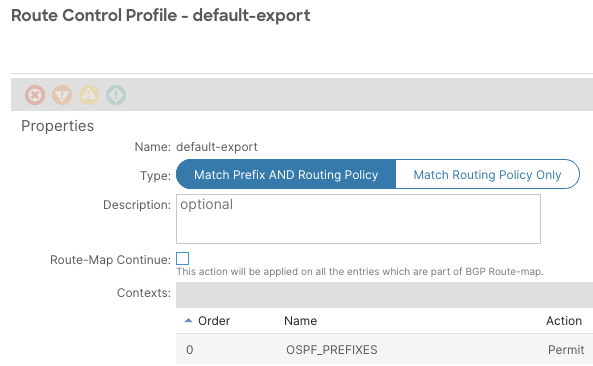

When “Match Prefix AND Routing Policy” is selected, the resulting route-map and prefix-list configuration take into account both the existing fabric configuration and the newly defined routing policy.

In this example:

- 5.5.5.5/32 was configured under the External EPG with the scope set to Export Route Control Subnet.
- 7.7.7.7/32 was configured through a route-map.

The system consolidates both configurations, producing a single prefix list that contains both prefixes. This demonstrates how ACI merges export route control settings with explicitly defined routing policies when the AND option is used.

```text
leaf-103# show ip prefix-list IPv4-peer16386-3047424-exc-ext-out-default-
export2OSPF_PREFIXES0MATCH_OSPF_PREFIXES-dst
ip prefix-list IPv4-peer16386-3047424-exc-ext-out-default-export2OSPF_PREFIXES0MATCH_OSPF_PREFIXES-dst: 2 entries
   seq 1 permit 7.7.7.7/32
   seq 2 permit 5.5.5.5/32
```

```text
5K-2# show ip route
IP Route Table for VRF "default"
'*' denotes best ucast next-hop
'**' denotes best mcast next-hop
'[x/y]' denotes [preference/metric]
'%<string>' in via output denotes VRF <string>

4.4.4.4/32, ubest/mbest: 2/0, attached
    *via 4.4.4.4, Lo0, [0/0], 2d22h, local
    *via 4.4.4.4, Lo0, [0/0], 2d22h, direct
5.5.5.5/32, ubest/mbest: 1/0
    *via 10.34.34.1, [20/0], 00:01:06, bgp-65002, external, tag 65001,
7.7.7.7/32, ubest/mbest: 1/0
    *via 10.34.34.1, [20/0], 00:24:24, bgp-65002, external, tag 65001,
10.34.34.0/30, ubest/mbest: 1/0, attached
    *via 10.34.34.2, Eth1/3, [0/0], 2d22h, direct
10.34.34.2/32, ubest/mbest: 1/0, attached
    *via 10.34.34.2, Eth1/3, [0/0], 2d22h, local
```

2. Match Routing Policy Only

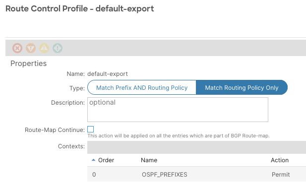

In contrast, when “Match Routing Policy Only” is selected, ACI overrides any prefixes that were configured under the External EPG with the scope “Export Route Control Subnet” knob. In this mode, the routing policy becomes the sole source of prefix-list entries.

In this case:

- The 5.5.5.5/32 prefix, originally configured under the External EPG with the Export Route Control Subnet scope, is removed.
- The resulting prefix list contains only the 7.7.7.7/32 subnet from the routing policy.

This demonstrates that the Routing Policy Only option does not merge configurations—it completely replaces the subnets defined via the Export Route Control Subnet knob with those from the routing policy.

```text
leaf-103# show ip prefix-list IPv4-peer16386-3047424-exc-ext-out-default-
export2OSPF_PREFIXES0MATCH_OSPF_PREFIXES-dst
ip prefix-list IPv4-peer16386-3047424-exc-ext-out-default-export2OSPF_PREFIXES0MATCH_OSPF_PREFIXES-dst: 1 entries
   seq 1 permit 7.7.7.7/32
```

```text
5K-2# show ip route
IP Route Table for VRF "default"
'*' denotes best ucast next-hop
'**' denotes best mcast next-hop
'[x/y]' denotes [preference/metric]
'%<string>' in via output denotes VRF <string>

4.4.4.4/32, ubest/mbest: 2/0, attached
    *via 4.4.4.4, Lo0, [0/0], 2d22h, local
    *via 4.4.4.4, Lo0, [0/0], 2d22h, direct
7.7.7.7/32, ubest/mbest: 1/0
    *via 10.34.34.1, [20/0], 00:21:06, bgp-65002, external, tag 65001,
10.34.34.0/30, ubest/mbest: 1/0, attached
    *via 10.34.34.2, Eth1/3, [0/0], 2d22h, direct
10.34.34.2/32, ubest/mbest: 1/0, attached
    *via 10.34.34.2, Eth1/3, [0/0], 2d22h, local
```

5.5.5.5/32 is no longer advertised out to the external BGP neighbor

## References

- [https://www.cisco.com/c/en/us/solutions/collateral/data-center-virtualization/application-centric-infrastructure/guide-c07-743150.html#L3OutTransitRouting](https://www.cisco.com/c/en/us/solutions/collateral/data-center-virtualization/application-centric-infrastructure/guide-c07-743150.html#L3OutTransitRouting)
- [https://www.cisco.com/c/en/us/solutions/collateral/data-center-virtualization/application-centric-infrastructure/white-paper-c11-743951.html#ContracttoanL3OutEPG](https://www.cisco.com/c/en/us/solutions/collateral/data-center-virtualization/application-centric-infrastructure/white-paper-c11-743951.html#ContracttoanL3OutEPG)
- [https://www.ciscolive.com/on-demand/on-demand-library.html?search=cisco%20aci%20l3out#/session/1750271887325001z377](https://www.ciscolive.com/on-demand/on-demand-library.html?search=cisco%20aci%20l3out#/session/1750271887325001z377)
