# Cisco ACI Virtual Port-Channel (vPC)

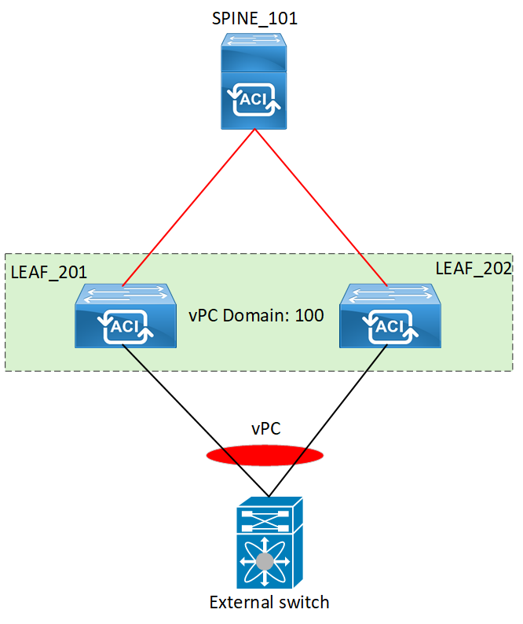

## Overview

A Cisco ACI virtual port-channel (vPC) allows two different ACI leaf nodes to appear as a single node to a downstream device (server or switch that is configured with a port-channel towards these ACI nodes).

Two leaf switches are configured as vPC peers and they are dynamically assigned a virtual TEP IP from the TEP pool. This virtual IP is the anycast IP address that represents the switch pair (single logical unit) and all traffic destined to the vPC-connected endpoints of the leaf pair will use the assigned anycast IP address as the destination. Which leaf switches are part of a vPC pair is determined by the configuration of the vPC Protection Group.

This lab showcases how to configure and verify the functionality of vPC in Cisco ACI.

For more details, refer to the official Cisco ACI Design Guide: [https://www.cisco.com/c/en/us/td/docs/dcn/whitepapers/cisco-application-centric-infrastructure-design-guide.html#PortChannelsandvPC](https://www.cisco.com/c/en/us/td/docs/dcn/whitepapers/cisco-application-centric-infrastructure-design-guide.html#PortChannelsandvPC)

!!! note
    This lab was conducted in a controlled environment. Any configurations in a production network should be implemented during a designated maintenance window. Additionally, always refer to official Cisco documentation relevant to your specific hardware and software.

## Lab-Setup

This lab consists of two ACI leaf nodes that will be configured as vPC peers and a downstream switch that is dual-homed to the ACI leaf nodes. A port-channel will be configured on the external switch, bundling the 2 physical interfaces connected to ACI nodes. After the successful completion of the required configurations, the ACI nodes will appear as a single logical device to the downstream switch.

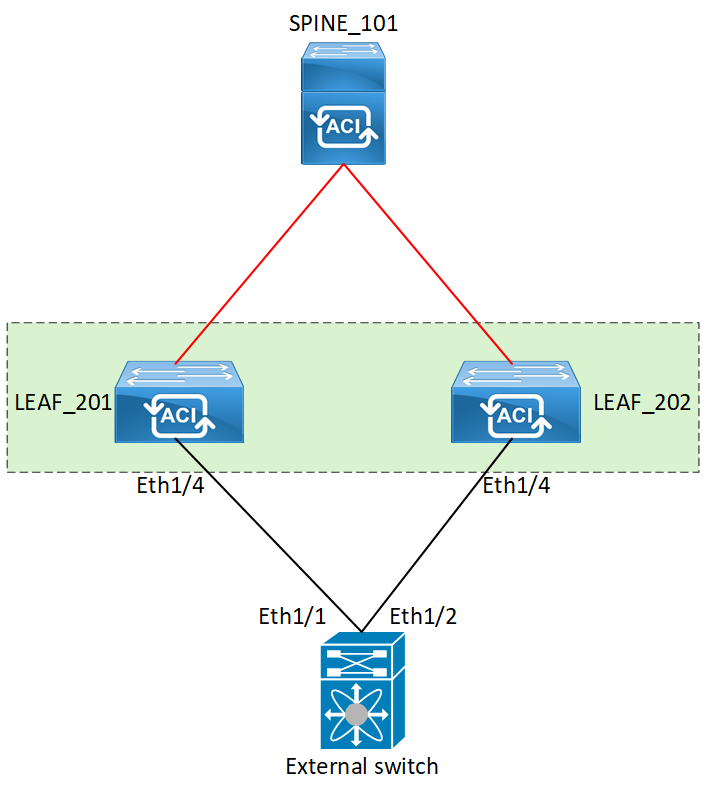

The physical connectivity is verified by querying for the LLDP neighborships details.

```text
external-switch# show lldp neighbor
Capability codes:
  (R) Router, (B) Bridge, (T) Telephone, (C) DOCSIS Cable Device
  (W) WLAN Access Point, (P) Repeater, (S) Station, (O) Other
Device ID            Local Intf      Hold-time Capability Port ID
leaf_201             Eth1/1          120        BR          Eth1/4
leaf_202             Eth1/2          120        BR          Eth1/4
Total entries displayed: 2
external-switch#
```

## vPC Configuration

The initial step is to configure the vPC Explicit Protection Group. The vPC Explicit Protection Group defines the leaf switches that belong to the vPC domain.

In this lab, Leaf-201 & Leaf-202 will be configured as vPC peers, under vPC domain 100.

To configure a vPC Explicit Protection Group navigate to;
Fabric >> Access Policies >> Policies >> Switch >> Virtual Port Channel default >> Create VPC Explicit Protection Group

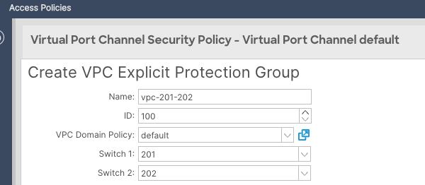

The configuration results in a vPC domain creation and a Virtual TEP IP is dynamically assigned from the TEP pool.
To verify the configuration navigate to Fabric >> Access Policies >> Policies >> Switch >> Virtual Port Channel default and click on the newly created security policy.

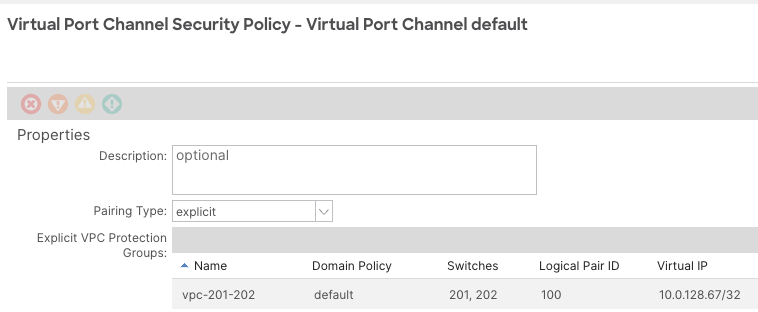

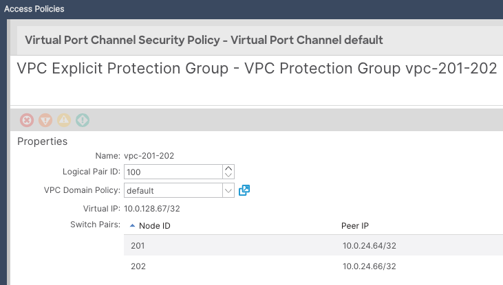

In order to connect the downstream external switch, a number of objects are created namely;

1. A combined Leaf Profile (LEAF201_202_SWP) associated with the Node IDs 201 & 202.
2. A combined Interface Profile (LEAF201_202_IP)
3. Access Port Selector under the LEAF201_202_IP Profile
4. The access port selector is associated with a vPC_IPG that contains CDP, LLDP and LACP policies.

The Figure below shows all the individual objects and their relationships.

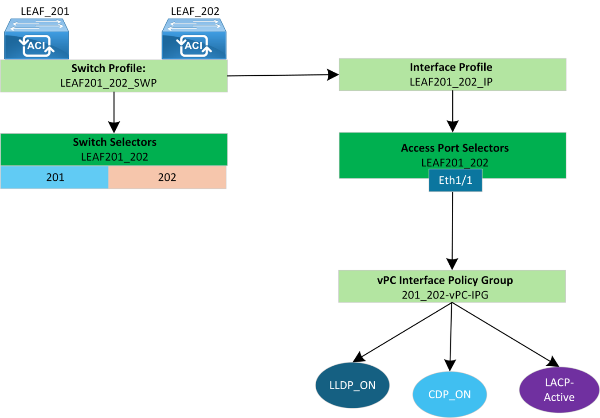

A combined Leaf Profile:

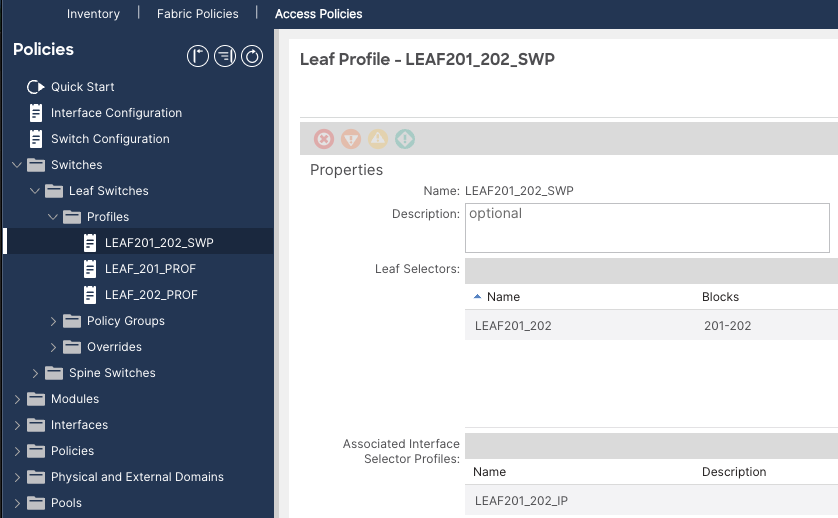

A combined Interface Profile:

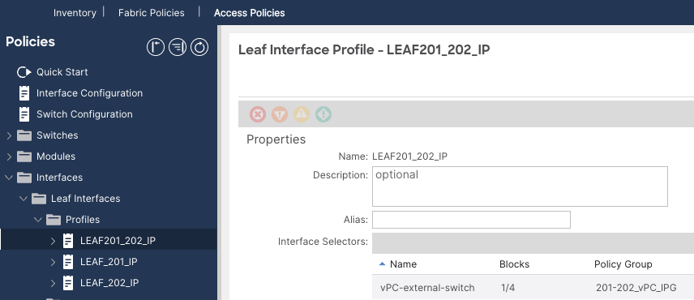

Access Port selector:

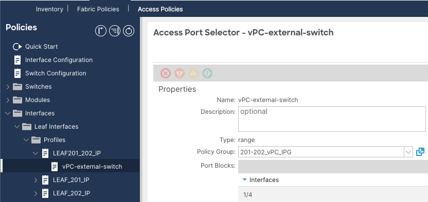

vPC Interface Policy Group

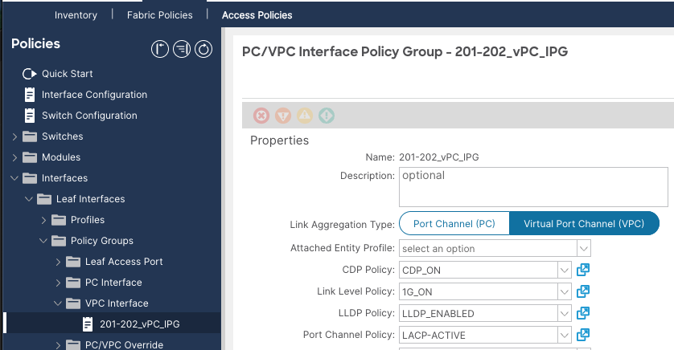

To verify that the configured objects are correctly associated, you can check the CDP neighborship on the external switch. This helps confirm that the CDP_ON policy, which is part of the vPC Interface Policy Group (IPG) associated with the interfaces connecting to the external switch, is functioning as expected.

```text
external-switch# show cdp neighbor
Capability Codes: R - Router, T - Trans-Bridge, B - Source-Route-Bridge
                  S - Switch, H - Host, I - IGMP, r - Repeater,
                  V - VoIP-Phone, D - Remotely-Managed-Device,
                  s - Supports-STP-Dispute

Device-ID            Local Intrfce   Hldtme Capability Platform      Port ID
leaf_201             Eth1/1          146    R S s     N9K-C93180YC-EX Eth1/4
leaf_202             Eth1/2          141    R S s     N9K-C93180YC-EX Eth1/4
```

Create a port-channel on the external device; bundling the physical interfaces that are connecting to the ACI nodes.

```text
external-switch#
feature lacp
feature lldp
!
interface port-channel10
!
interface Ethernet1/1
  channel-group 10 mode active
!
interface Ethernet1/2
  channel-group 10 mode active
!
```

## vPC Validation

### vPC Status

The domain ID is 100 as configured. The vPC keep-alive status is disabled as there is no dedicated link required in ACI.

```text
leaf_201# show vpc
Legend:
                (*) - local vPC is down, forwarding via vPC peer-link

vPC domain id                        : 100
Peer status                          : peer adjacency formed ok
vPC keep-alive status                : Disabled
Configuration consistency status     : success
Per-vlan consistency status          : success
Type-2 consistency status            : success
vPC role                             : primary
Number of vPCs configured            : 1
Peer Gateway                         : Disabled
Dual-active excluded VLANs           : -
Graceful Consistency Check           : Enabled
Auto-recovery status                 : Enabled (timeout = 200 seconds)
Delay-restore status                 : Enabled (timeout = 120 seconds)
Delay-restore SVI status             : Enabled (timeout = 0 seconds)
Operational Layer3 Peer              : Disabled

vPC Peer-link status
---------------------------------------------------------------------
id   Port   Status Active vlans
--   ----   ------ --------------------------------------------------
1           up     -

vPC status
----------------------------------------------------------------------
id   Port   Status Consistency Reason                     Active vlans
--   ----   ------ ----------- ------                     ------------
684 Po1     up     success     success                    -
```

```text
leaf_202# show vpc
Legend:
                (*) - local vPC is down, forwarding via vPC peer-link

vPC domain id                        : 100
Peer status                          : peer adjacency formed ok
vPC keep-alive status                : Disabled
Configuration consistency status     : success
Per-vlan consistency status          : success
Type-2 consistency status            : success
vPC role                             : secondary
Number of vPCs configured            : 1
Peer Gateway                         : Disabled
Dual-active excluded VLANs           : -
Graceful Consistency Check           : Enabled
Auto-recovery status                 : Enabled (timeout = 200 seconds)
Delay-restore status                 : Enabled (timeout = 120 seconds)
Delay-restore SVI status             : Enabled (timeout = 0 seconds)
Operational Layer3 Peer              : Disabled

vPC Peer-link status
---------------------------------------------------------------------
id   Port   Status Active vlans
--   ----   ------ --------------------------------------------------
1           up     -

vPC status
----------------------------------------------------------------------
id   Port   Status Consistency Reason                     Active vlans
--   ----   ------ ----------- ------                     ------------
684 Po1     up     success     success                    -
```

### vPC Roles, vPC System mac and LAG ID

The vPC system mac "00:23:04:ee:be:64" is shared across both devices leaf_201 and leaf_202. This is the mechanism that ensures that the connected downstream device sees the two leafs switches as a single logical unit.

```text
leaf_201# show vpc role

vPC Role status
----------------------------------------------------
vPC role                        : primary
Dual Active Detection Status    : 0
vPC system-mac                  : 00:23:04:ee:be:64
vPC system-priority             : 32667
vPC local system-mac            : 2c:4f:52:e1:8d:81
vPC local role-priority         : 201
leaf_201#
```

```text
leaf_202# show vpc role

vPC Role status
----------------------------------------------------
vPC role                        : secondary
Dual Active Detection Status    : 0
vPC system-mac                  : 00:23:04:ee:be:64
vPC system-priority             : 32667
vPC local system-mac            : 00:d7:8f:c3:0e:bf
vPC local role-priority         : 202
leaf_202#
```

This system-mac being advertised in the LACP packets and it can be observed on the downstream external switch.

```text
external-switch# show lacp interface eth1/1 (connected to leaf_201)
Interface Ethernet1/1 is up
  Channel group is 10 port channel is Po10
  PDUs sent: 85
  PDUs rcvd: 46
  Markers sent: 0
  Markers rcvd: 0
  Marker response sent: 0
  Marker response rcvd: 0
  Unknown packets rcvd: 0
  Illegal packets rcvd: 0
Lag Id: [ [(7f9b, 0-23-4-ee-be-64, 82ac, 8000, 104), (8000, 4c-77-6d-9b-e8-41, 9
, 8000, 101)] ]
Operational as aggregated link since Mon Jan 8 03:11:06 2001

Local Port: Eth1/1   MAC Address= 4c-77-6d-9b-e8-41
  System Identifier=0x8000, Port Identifier=0x8000,0x101
  Operational key=9
  LACP_Activity=active
  LACP_Timeout=Long Timeout (30s)
  Synchronization=IN_SYNC
  Collecting=true
  Distributing=true
  Partner information refresh timeout=Long Timeout (90s)
Actor Admin State=61
Actor Oper State=61
Neighbor: 0x104
  MAC Address= 0-23-4-ee-be-64 (system mac from leaf_201)
  System Identifier=0x7f9b, Port Identifier=0x8000,0x104
  Operational key=33452
  LACP_Activity=active
  LACP_Timeout=Long Timeout (30s)
  Synchronization=IN_SYNC
  Collecting=true
  Distributing=true
Partner Admin State=61
Partner Oper State=61
Aggregate or Individual(True=1)= 1
```

```text
external-switch# show lacp interface eth1/2 (connected to leaf_202)
Interface Ethernet1/2 is up
  Channel group is 10 port channel is Po10
  PDUs sent: 80
  PDUs rcvd: 46
  Markers sent: 0
  Markers rcvd: 0
  Marker response sent: 0
  Marker response rcvd: 0
  Unknown packets rcvd: 0
  Illegal packets rcvd: 0
Lag Id: [ [(7f9b, 0-23-4-ee-be-64, 82ac, 8000, 4104), (8000, 4c-77-6d-9b-e8-41,
9, 8000, 105)] ]
Operational as aggregated link since Mon Jan 8 03:11:00 2001

Local Port: Eth1/2   MAC Address= 4c-77-6d-9b-e8-41
  System Identifier=0x8000, Port Identifier=0x8000,0x105
  Operational key=9
  LACP_Activity=active
  LACP_Timeout=Long Timeout (30s)
  Synchronization=IN_SYNC
  Collecting=true
  Distributing=true
  Partner information refresh timeout=Long Timeout (90s)
Actor Admin State=61
Actor Oper State=61
Neighbor: 0x4104
  MAC Address= 0-23-4-ee-be-64 (system mac from leaf 202)
  System Identifier=0x7f9b, Port Identifier=0x8000,0x4104
  Operational key=33452
  LACP_Activity=active
  LACP_Timeout=Long Timeout (30s)
  Synchronization=IN_SYNC
  Collecting=true
  Distributing=true
Partner Admin State=61
Partner Oper State=61
Aggregate or Individual(True=1)= 1
```

### Port-channel status

A port-channel is established between the ACI leaf nodes and the external switch.

```text
leaf_201# show port-channel extended
Flags: D - Down         P - Up in port-channel (members)
        I - Individual H - Hot-standby (LACP only)
        s - Suspended   r - Module-removed
        b - BFD Session Wait
        S - Switched    R - Routed
        U - Up (port-channel)
        M - Not in use. Min-links not met
        F - Configuration failed
-----------------------------------------------------------------------------
Group Port-       BundleGrp                Protocol Member Ports
      Channel
-----------------------------------------------------------------------------
1     Po1(SU)     201-202_vPC_IPG          LACP      Eth1/4(P)
!
!
leaf_202# show port-channel extended
-----------------------------------------------------------------------------
Group Port-       BundleGrp                Protocol Member Ports
      Channel
-----------------------------------------------------------------------------
1     Po1(SU)     201-202_vPC_IPG          LACP      Eth1/4(P)
```

```text
external-switch# show port-channel summary
Flags: D - Down         P - Up in port-channel (members)
        I - Individual H - Hot-standby (LACP only)
        s - Suspended   r - Module-removed
        b - BFD Session Wait
        S - Switched    R - Routed
        U - Up (port-channel)
        p - Up in delay-lacp mode (member)
        M - Not in use. Min-links not met
--------------------------------------------------------------------------------
Group Port-       Type     Protocol Member Ports
      Channel
--------------------------------------------------------------------------------
10    Po10(SU)    Eth      LACP      Eth1/1(P)    Eth1/2(P)
external-switch#
```

### TEP details and Logical Peer-link status

```text
leaf_201# show system internal epm vpc

Local TEP IP                   : 10.0.24.64
Peer TEP IP                    : 10.0.24.66
vPC configured                 : Yes
vPC VIP                        : 10.0.128.67
MCT link status                : Up
Local vPC version bitmap       : 0x7
Peer vPC version bitmap        : 0x7
Negotiated vPC version         : 3
Peer advertisement received    : Yes
Tunnel to vPC peer             : Up

vPC# 684
if : port-channel1, if index : 0x16000000
local vPC state : MCEC_STATE_UP, peer vPC state : MCEC_STATE_UP
current link state : LOCAL_UP_PEER_UP
vPC fast conv : Off
```

```text
leaf_202# show system internal epm vpc

Local TEP IP                   : 10.0.24.66
Peer TEP IP                    : 10.0.24.64
vPC configured                 : Yes
vPC VIP                        : 10.0.128.67
MCT link status                : Up
Local vPC version bitmap       : 0x7
Peer vPC version bitmap        : 0x7
Negotiated vPC version         : 3
Peer advertisement received    : Yes
Tunnel to vPC peer             : Up

vPC# 684
if : port-channel1, if index : 0x16000000
local vPC state : MCEC_STATE_UP, peer vPC state : MCEC_STATE_UP
current link state : LOCAL_UP_PEER_UP
vPC fast conv : Off
```

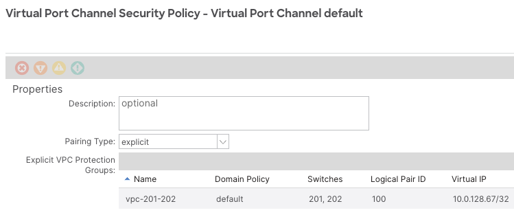

### vPC Consistency Parameters

Verify that the required vPC parameters are consistent.

```text
leaf_201# show vpc consistency-parameters interface port-channel 1

    Legend:
        Type 1 : vPC will be suspended in case of mismatch

Name                           Type   Local Value            Peer Value
-------------                  ----   ---------------------- -----------------------
lag-id                         1      [(7f9b,                [(7f9b,
                                      0-23-4-ee-be-64, 82ac, 0-23-4-ee-be-64, 82ac,
                                        0, 0), (8000,          0, 0), (8000,
                                      4c-77-6d-9b-e8-41, 9, 4c-77-6d-9b-e8-41, 9,
                                      0, 0)]                 0, 0)]
mode                           1      active                 active
Speed                          1      1000 Mb/s              1000 Mb/s
Duplex                         1      full                   full
Port Mode                      1      trunk                  trunk
Native Vlan                    1      0                      0
MTU                            1      9000                   9000
vPC card type                  1      Empty                  Empty
Allowed VLANs                  -      -                      -
Local suspended VLANs          -      -                      -
leaf_201#
```

```text
leaf_202# show vpc consistency-parameters interface port-channel 1

    Legend:
        Type 1 : vPC will be suspended in case of mismatch

Name                           Type   Local Value            Peer Value
-------------                  ----   ---------------------- -----------------------
lag-id                         1      [(7f9b,                [(7f9b,
                                      0-23-4-ee-be-64, 82ac, 0-23-4-ee-be-64, 82ac,
                                        0, 0), (8000,          0, 0), (8000,
                                      4c-77-6d-9b-e8-41, 9, 4c-77-6d-9b-e8-41, 9,
                                      0, 0)]                 0, 0)]
mode                           1      active                 active
Speed                          1      1000 Mb/s              1000 Mb/s
Duplex                         1      full                   full
Port Mode                      1      trunk                  trunk
Native Vlan                    1      0                      0
MTU                            1      9000                   9000
vPC card type                  1      Empty                  Empty
Allowed VLANs                  -      -                      -
Local suspended VLANs          -      -                      -
```

!!! note
    If there is a mismatch in the LAG-ID, ports are suspended.

For events related to LACP events us the command below:

```text
leaf_201# show lacp internal event-history interface eth1/4
```

## References

- [https://www.cisco.com/c/dam/en/us/solutions/collateral/data-center-virtualization/application-centric-infrastructure/aci-guide-vpc.pdf](https://www.cisco.com/c/dam/en/us/solutions/collateral/data-center-virtualization/application-centric-infrastructure/aci-guide-vpc.pdf)
- [https://www.cisco.com/c/en/us/support/docs/cloud-systems-management/application-policy-infrastructure-controller-apic/218374-troubleshoot-virtual-port-channel-vpc.html](https://www.cisco.com/c/en/us/support/docs/cloud-systems-management/application-policy-infrastructure-controller-apic/218374-troubleshoot-virtual-port-channel-vpc.html)
- [https://www.cisco.com/c/en/us/support/docs/cloud-systems-management/application-policy-infrastructure-controller-apic/218194-troubleshoot-aci-vpc.html](https://www.cisco.com/c/en/us/support/docs/cloud-systems-management/application-policy-infrastructure-controller-apic/218194-troubleshoot-aci-vpc.html)

