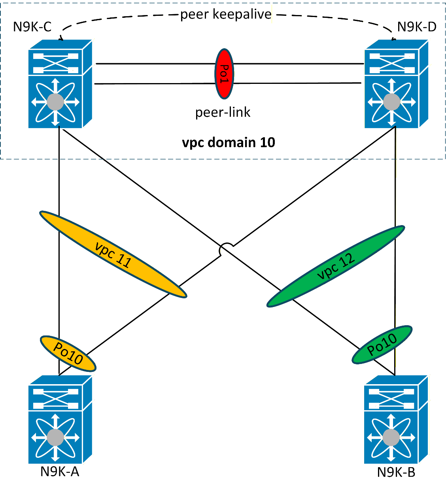
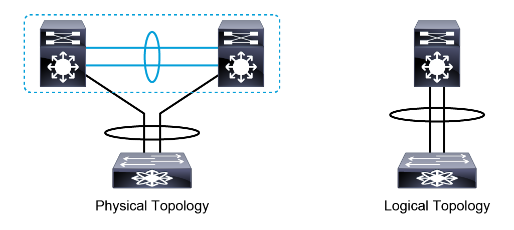
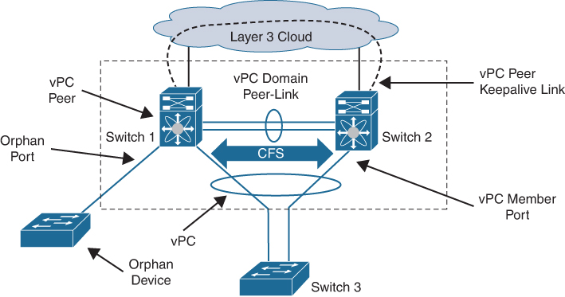
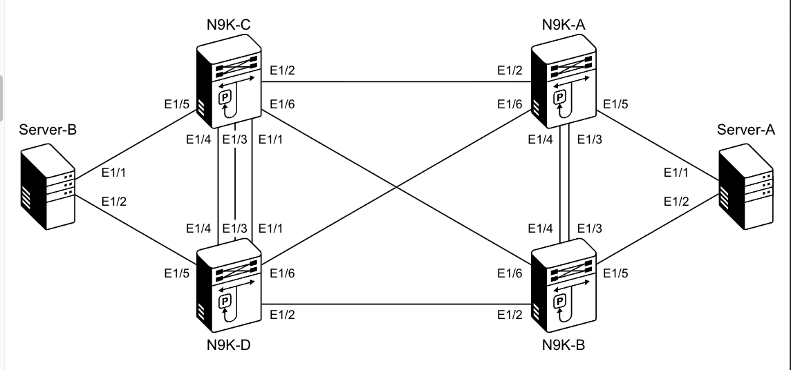
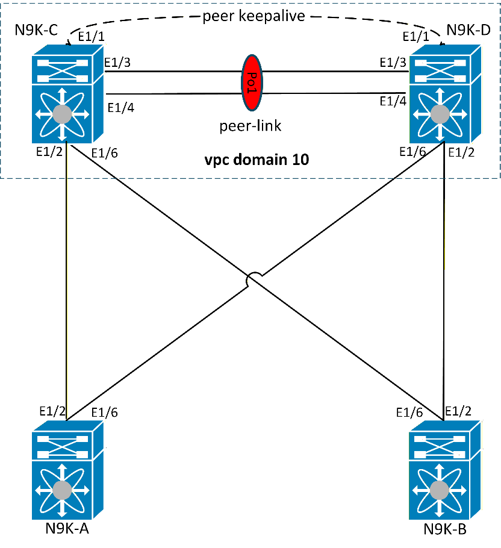
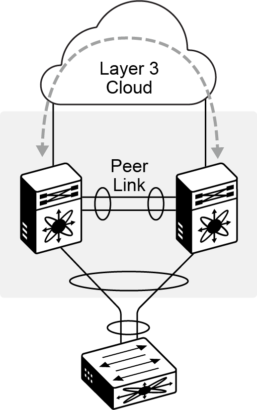
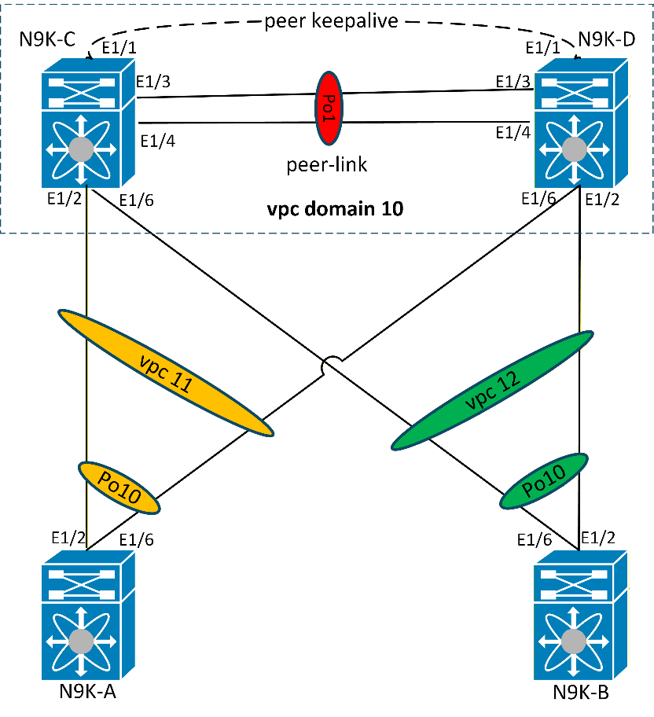

# Cisco Virtual Port-Channel (vPC) – Basic Configuration - CLI



!!! note
    This lab was conducted in a controlled environment. Any configurations in a production network should be implemented during a designated maintenance window. Additionally, always refer to official documentation relevant to your specific hardware and software.

## Virtual Port Channel (vPC)

In traditional spanning-tree designs, redundant Layer 2 links between
switches are blocked to prevent loops — leaving expensive bandwidth
unused and creating suboptimal traffic paths. Virtual Port Channel (vPC)
eliminates this limitation by allowing two physical Cisco Nexus switches
to appear as a single logical switch to downstream devices. This enables
all links to actively forward traffic, effectively doubling the
available bandwidth while providing redundancy. If one vPC peer fails,
the remaining peer continues to forward traffic with no disruption to
the downstream devices.



Before jumping into the configurations, this section will go through a
high-level overview of the virtual Port-channel (vPC) architecture and
components.



1.  **vPC domain**

The vPC domain is formed when two physical switches are linked together
and appear as one logical switch. Only two devices can be part of the
same vPC domain. The domain includes both vPC peer devices, the vPC
peer-keepalive link, the vPC peer link, and all port channels in the vPC
domain that are connected to the downstream devices.

2.  **vPC peers**

The pair of physical switches in a vPC domain are known as vPC peers. A
maximum of two switches can be vPC peers in a vPC domain.

3.  **vPC peer-keepalive link**

The peer-keepalive link is a Layer 3 link that often runs over an
out-of-band (OOB) network. It provides a communication path that is used
as a secondary test to decide whether the remote peer is operating
properly. The peer-keepalive status helps the vPC switch determine if
the peer-link itself has failed or if the vPC peer has failed entirely.
A separate Layer 3 network can also be used for vPC peer-keepalive,
often in a dedicated VRF. No data or synchronization traffic is sent
over the vPC peer-keepalive link.

4.  **vPC peer-link**

The vPC peer-link is used to create the illusion of a single control
plane by forwarding traffic between switches in vPC. Control plane
information such as spanning-tree BPDUs and LACP packets are exchanged
over the peer link. The peer link is also used to synchronize MAC
address tables, ARP caches, and IGMP tables that are built via IGMP
snooping so that both switches can function in unison.

5.  **Cisco Fabric Services over Ethernet (CFSoE)**

The CFSoE is a reliable messaging protocol that is designed to support
rapid, stateful, configuration-message passing, and synchronization.
Cisco Fabric Services over Ethernet is used to synchronize control plane
information between vPC peer switches, to perform vPC configuration and
compatibility checks, and to monitor the status of the vPC member ports.

6.  **vPC**

This is the combined port-channel that spans both switches in a vPC
domain. A vPC is configured towards the downstream devices that support
port-channels.

7.  **vPC member port**

This is an interface that belongs to a vPC.

**Some general guidelines for deploying a vPC topology are as follows:**

- A vPC domain has only two peer switches.

- Only one vPC domain can be configured per switch.

- vPC Peer Link must use a 10-Gigabit Ethernet interface at a minimum.
  Higher-bandwidth interfaces may also be used.

- It is recommended to use at least two dedicated 10-Gigabit Ethernet
  links for the vPC peer link.

- The downstream device can be any port channel-capable device. The
  downstream device is not aware that a vPC is present. It only sees a
  traditional port channel.

## Lab Topology



This lab consists of 4 devices (N9K-A, N9K-B, N9K-C, N9K-D), whereby
N9K-C and N9K-D will be configured as vPC peers and N9K-A and N9K-B will
be configured as the downstream devices.



## vPC Configurations Steps

No time to read through the step-by-step configuration build up. →
Navigate to the [**Full Configurations**](#full-configurations) section
to view the full configurations.

1.  **Configure the vPC Domain**

Each vPC domain has a vPC instance number that two devices share. The
domain ID can be any value between 1 and 1000, and you must configure
the same value on both switches that form the vPC pair. **Ensure that
the *“vpc”* feature is enabled on the devices.**

```text
N9K-C
feature vpc
!
vpc domain 10
```

```text
N9K-D
feature vpc
!
vpc domain 10
```

At this point, the vPC is still not operational as the peer-link and
peer keep-alive link are not configured as yet.

```text
N9K-C# show vpc
Legend:
(*) - local vPC is down, forwarding via vPC peer-link
vPC domain id : 10
Peer status : peer link not configured
vPC keep-alive status : Disabled
Configuration consistency status : failed
Per-vlan consistency status : failed
Configuration inconsistency reason: vPC peer-link does not exist
Type-2 consistency status : failed
Type-2 inconsistency reason : vPC peer-link does not exist
vPC role : none established
Number of vPCs configured : 0
Peer Gateway : Disabled
Dual-active excluded VLANs : -
Graceful Consistency Check : Disabled (due to peer configuration)
Auto-recovery status : Disabled
Delay-restore status : Timer is off.(timeout = 30s)
Delay-restore SVI status : Timer is off.(timeout = 10s)
Delay-restore Orphan-port status : Timer is off.(timeout = 0s)
Operational Layer3 Peer-router : Disabled
Virtual-peerlink mode : Disabled
N9K-C#
```

```text
N9K-D# show vpc
Legend:
(*) - local vPC is down, forwarding via vPC peer-link
vPC domain id : 10
Peer status : peer link not configured
vPC keep-alive status : Disabled
Configuration consistency status : failed
Per-vlan consistency status : failed
Configuration inconsistency reason: vPC peer-link does not exist
Type-2 consistency status : failed
Type-2 inconsistency reason : vPC peer-link does not exist
vPC role : none established
Number of vPCs configured : 0
Peer Gateway : Disabled
Dual-active excluded VLANs : -
Graceful Consistency Check : Disabled (due to peer configuration)
Auto-recovery status : Disabled
Delay-restore status : Timer is off.(timeout = 30s)
Delay-restore SVI status : Timer is off.(timeout = 10s)
Delay-restore Orphan-port status : Timer is off.(timeout = 0s)
Operational Layer3 Peer-router : Disabled
Virtual-peerlink mode : Disabled
N9K-D#
```

Notice that the vPC roles and vPC domain MAC address is not yet
determined. The vPC peers must first communicate via the vPC peer link
to negotiate the vPC role.

```text
N9K-C# show vpc role
vPC Role status
----------------------------------------------------
vPC role : none established
Dual Active Detection Status : 0
vPC system-mac : 00:00:00:00:00:00
vPC system-priority : 32667
vPC local system-mac : 52:92:fa:1f:1b:08
vPC local role-priority : 0
vPC local config role-priority : 32667
vPC peer system-mac : 00:00:00:00:00:00
vPC peer role-priority : 0
vPC peer config role-priority : 0
```

```text
N9K-D# show vpc role
vPC Role status
----------------------------------------------------
vPC role : none established
Dual Active Detection Status : 0
vPC system-mac :
00:00:00:00:00:00
vPC system-priority : 32667
vPC local system-mac : 52:90:bf:c0:1b:08
vPC local role-priority : 0
vPC local config role-priority : 32667
vPC peer system-mac : 00:00:00:00:00:00
vPC peer role-priority : 0
vPC peer config role-priority : 0
```

2.  **Configure the vPC Peer Keepalive**

Configure a vPC peer-keepalive between the N9K-C and N9K-D switches on
Ethernet 1/1.

Use the IP
address 209.165.200.225/24 on N9K-C and 209.165.200.226/24 on N9K-D.

```text
N9K-C
conf t
!
vrf context VPC-KEEPALIVE
!
interface ethernet1/1
no switchport
vrf member VPC-KEEPALIVE
ip address 209.165.200.225/24
no shutdown
!
```

```text
N9K-D
conf t
!
vrf context VPC-KEEPALIVE
!
interface ethernet1/1
no switchport
vrf member VPC-KEEPALIVE
ip address 209.165.200.226/24
no shutdown
!
```

Verify that the Layer 3 interfaces are up in the VPC-KEEPALIVE VRF using
the show ip interface brief vrf VPC-KEEPALIVE command
on N9K-C and N9K-D.

```text
N9K-C# show ip interface brief vrf
VPC-KEEPALIVE
IP Interface Status for VRF "VPC-KEEPALIVE"(4)
Interface IP Address Interface Status
Eth1/1 209.165.200.225 protocol-up/link-up/admin-up
```

```text
N9K-D# show ip interface brief vrf
VPC-KEEPALIVE
IP Interface Status for VRF "VPC-KEEPALIVE"(4)
Interface IP Address Interface Status
Eth1/1 209.165.200.226 protocol-up/link-up/admin-up
N9K-D# ping 209.165.200.225 vrf VPC-KEEPALIVE
PING 209.165.200.225 (209.165.200.225): 56 data bytes
36 bytes from 209.165.200.226: Destination Host Unreachable
Request 0 timed out
64 bytes from 209.165.200.225: icmp_seq=1 ttl=254 time=2.504 ms
64 bytes from 209.165.200.225: icmp_seq=2 ttl=254 time=1.529 ms
64 bytes from 209.165.200.225: icmp_seq=3 ttl=254 time=1.374 ms
64 bytes from 209.165.200.225: icmp_seq=4 ttl=254 time=1.799 ms
--- 209.165.200.225 ping statistics ---
5 packets transmitted, 4 packets received, 20.00% packet loss
round-trip min/avg/max = 1.374/1.801/2.504 ms
Note: The first ICMP packet (Request 0) timed out because the ARP
table had no entry for the destination. The switch had to broadcast an
ARP request and wait for a reply before it could forward the packet.
This is normal behavior for the first ping to a new
destination.
```

Under the vPC domain configure the vPC peer-keepalive link.

```text
N9K-C#
vpc domain 10
peer-keepalive destination 209.165.200.226 source 209.165.200.225 vrf
VPC-KEEPALIVE
```

```text
N9K-D#
vpc domain 10
peer-keepalive destination 209.165.200.225 source 209.165.200.226 vrf
VPC-KEEPALIVE
```

At this point, the vPC peers can reach each other via the peer-keepalive
link.

```text
N9K-C# show vpc
Legend:
(*) - local vPC is down, forwarding via vPC peer-link
vPC domain id : 10
Peer status : peer link not configured
vPC keep-alive status : peer is alive
```

```text
N9K-D# show vpc
Legend:
(*) - local vPC is down, forwarding via vPC peer-link
vPC domain id : 10
Peer status : peer link not configured
vPC keep-alive status : peer is alive
```

Use the show vpc peer-keepalive which shows you various statistics that
you can use to verify that the device sends and receives status updates
over the intended interface and in the correct VRF instance.

```text
N9K-C# show vpc peer-keepalive
vPC keep-alive status : peer is alive
--Peer is alive for : (37) seconds, (577) msec
--Send status : Success
--Last send at : 2026.04.06 09:34:44 609 ms
--Sent on interface : Eth1/1
--Receive status : Success
--Last receive at : 2026.04.06 09:34:44 722 ms
--Received on interface : Eth1/1
--Last update from peer : (0) seconds, (552) msec
vPC Keep-alive parameters
--Destination : 209.165.200.226
--Keepalive interval : 1000 msec
--Keepalive timeout : 5 seconds
--Keepalive hold timeout : 3 seconds
--Keepalive vrf : VPC-KEEPALIVE
--Keepalive udp port : 3200
--Keepalive tos : 192
```

```text
N9K-D# show vpc peer-keepalive
vPC keep-alive status : peer is alive
--Peer is alive for : (97) seconds, (795) msec
--Send status : Success
--Last send at : 2026.04.06 09:35:45 470 ms
--Sent on interface : Eth1/1
--Receive status : Success
--Last receive at : 2026.04.06 09:35:45 382 ms
--Received on interface : Eth1/1
--Last update from peer : (0) seconds, (713) msec
vPC Keep-alive parameters
--Destination : 209.165.200.225
--Keepalive interval : 1000 msec
--Keepalive timeout : 5 seconds
--Keepalive hold timeout : 3 seconds
--Keepalive vrf : VPC-KEEPALIVE
--Keepalive udp port : 3200
--Keepalive tos : 192
```

To display various vPC-related statistics, you can use the show vpc
statistics peer-keepalive

```text
N9K-C# show vpc statistics peer-keepalive
vPC keep-alive statistics
----------------------------------------------------
peer-keepalive tx count: 300
peer-keepalive rx count: 245
average interval for peer rx: 1165
Count of peer state changes: 0
```

```text
N9K-D# show vpc statistics peer-keepalive
vPC keep-alive statistics
----------------------------------------------------
peer-keepalive tx count: 274
peer-keepalive rx count: 271
average interval for peer rx: 998
Count of peer state changes: 0
```

3.  **Configure the vPC Peer-Link**



The vPC peer link carries essential vPC traffic between the vPC peer
switches. The vPC peer link is a port channel and should consist of at
least two dedicated 10 Gigabit Ethernet links.

```text
N9K-C
conf t
!
feature lacp
!
interface ethernet1/3-4
switchport
switchport mode trunk
channel-group 1 mode active
no shut
!
interface port-channel 1
vpc peer-link
Warning: Bridge Assurance MUST be enabled at the remotely connected
interface
```

```text
N9K-D
conf t
!
feature lacp
!
interface ethernet1/3-4
switchport
switchport mode trunk
channel-group 1 mode active
no shut
!
interface port-channel 1
vpc peer-link
Warning: Bridge Assurance MUST be enabled at the remotely connected
interface
```

Verify that Bridge-Assurance is enabled on N9K-C and N9K-D.

```text
N9K-C# show spanning-tree summary
Switch is in rapid-pvst mode
Root bridge for: none
L2 Gateway STP is disabled
Port Type Default is disable
Edge Port [PortFast] BPDU Guard Default is disabled
Edge Port [PortFast] BPDU Filter Default is disabled
Bridge Assurance is enabled
Loopguard Default is disabled
Pathcost method used is short
STP-Lite is disabled
Name Blocking Listening Learning Forwarding STP Active
---------------------- -------- --------- -------- ----------
----------
VLAN0001 0 0 0 1 1
VLAN0200 1 0 0 3 4
---------------------- -------- --------- -------- ----------
----------
2 vlans 1 0 0 4 5
```

```text
N9K-D# show spanning-tree summary
Switch is in rapid-pvst mode
Root bridge for: VLAN0001
L2 Gateway STP is disabled
Port Type Default is disable
Edge Port [PortFast] BPDU Guard Default is disabled
Edge Port [PortFast] BPDU Filter Default is disabled
Bridge Assurance is enabled
Loopguard Default is disabled
Pathcost method used is short
STP-Lite is disabled
Name Blocking Listening Learning Forwarding STP Active
---------------------- -------- --------- -------- ----------
----------
VLAN0001 0 0 0 1 1
VLAN0200 0 0 0 4 4
---------------------- -------- --------- -------- ----------
----------
2 vlans 0 0 0 5 5
```

Verify that the port channel interface (peer-link) is operational.

```text
N9K-C# show port-channel summary
Flags: D - Down P - Up in port-channel (members)
I - Individual H - Hot-standby (LACP only)
s - Suspended r - Module-removed
b - BFD Session Wait
S - Switched R - Routed
U - Up (port-channel)
p - Up in delay-lacp mode (member)
M - Not in use. Min-links not met
---------------------------------------------------------------------
Group Port- Type Protocol Member Ports
Channel
---------------------------------------------------------------------
1 Po1(SU) Eth LACP Eth1/3(P) Eth1/4(P)
```

```text
N9K-D# show port-channel summary
Flags: D - Down P - Up in port-channel (members)
I - Individual H - Hot-standby (LACP only)
s - Suspended r - Module-removed
b - BFD Session Wait
S - Switched R - Routed
U - Up (port-channel)
p - Up in delay-lacp mode (member)
M - Not in use. Min-links not met
---------------------------------------------------------------------
Group Port- Type Protocol Member Ports
Channel
---------------------------------------------------------------------
1 Po1(SU) Eth LACP Eth1/3(P) Eth1/4(P)
```

The “show vpc” status now shows that peer adjacency is correctly formed
and configuration consistency checks have passed.

```text
N9K-C# show vpc
Legend:
(*) - local vPC is down, forwarding via vPC peer-link
vPC domain id : 10
Peer status : peer adjacency formed ok
vPC keep-alive status : peer is alive
Configuration consistency status : success
Per-vlan consistency status : success
Type-2 consistency status : success
vPC role : secondary
Number of vPCs configured : 0
Peer Gateway : Disabled
Dual-active excluded VLANs : -
Graceful Consistency Check : Enabled
Auto-recovery status : Disabled
Delay-restore status : Timer is off.(timeout = 30s)
Delay-restore SVI status : Timer is off.(timeout = 10s)
Delay-restore Orphan-port status : Timer is off.(timeout = 0s)
Operational Layer3 Peer-router : Disabled
Virtual-peerlink mode : Disabled
vPC Peer-link status
---------------------------------------------------------------------
id Port Status Active vlans
-- ---- ------ -------------------------------------------------
1 Po1 up 1,200
```

```text
N9K-D# show vpc
Legend:
(*) - local vPC is down, forwarding via vPC peer-link
vPC domain id : 10
Peer status : peer adjacency formed ok
vPC keep-alive status : peer is alive
Configuration consistency status : success
Per-vlan consistency status : success
Type-2 consistency status : success
vPC role : primary
Number of vPCs configured : 0
Peer Gateway : Disabled
Dual-active excluded VLANs : -
Graceful Consistency Check : Enabled
Auto-recovery status : Disabled
Delay-restore status : Timer is off.(timeout = 30s)
Delay-restore SVI status : Timer is off.(timeout = 10s)
Delay-restore Orphan-port status : Timer is off.(timeout = 0s)
Operational Layer3 Peer-router : Disabled
Virtual-peerlink mode : Disabled
vPC Peer-link status
---------------------------------------------------------------------
id Port Status Active vlans
-- ---- ------ -------------------------------------------------
1 Po1 up 1,200
```

The vPC roles have been successfully formed. By default, the switch with
the lowest local system-mac is elected as the primary switch in the vPC
domain.

```text
N9K-C# show vpc role
vPC Role status
----------------------------------------------------
vPC role : secondary
Dual Active Detection Status : 0
vPC system-mac : 00:23:04:ee:be:0a
vPC system-priority : 32667
vPC local system-mac : 52:92:fa:1f:1b:08
vPC local role-priority : 32667
vPC local config role-priority : 32667
vPC peer system-mac : 52:90:bf:c0:1b:08
vPC peer role-priority : 32667
vPC peer config role-priority : 32667
```

```text
N9K-D# show vpc role
vPC Role status
----------------------------------------------------
vPC role : primary
Dual Active Detection Status : 0
vPC system-mac : 00:23:04:ee:be:0a
vPC system-priority : 32667
vPC local system-mac : 52:90:bf:c0:1b:08
vPC local role-priority : 32667
vPC local config role-priority : 32667
vPC peer system-mac : 52:92:fa:1f:1b:08
vPC peer role-priority : 32667
vPC peer config role-priority : 32667
```

The vPC peer devices use the vPC domain ID to automatically assign a
unique vPC system MAC address. Each vPC domain has a unique MAC address
that is a unique identifier for the specific vPC-related operations.
This vPC system-mac, is what is presented to downstream devices during
LACP exchanges; hence the downstream devices see the devices in a vPC
domain as a single device.

Use the show vpc consistency-parameters global command to check for a
potential vPC configuration inconsistency.

```text
N9K-C# show vpc consistency-parameters
global
Legend:
Type 1 : vPC will be suspended in case of
mismatch
Name Type Local Value Peer Value
------------- ---- ---------------------- -----------------------
STP MST Simulate PVST 1 Enabled Enabled
STP Port Type, Edge 1 Normal, Disabled, Normal, Disabled,
BPDUFilter, Edge BPDUGuard Disabled Disabled
STP MST Region Name 1 "" ""
STP Disabled 1 None None
STP Mode 1 Rapid-PVST Rapid-PVST
STP Bridge Assurance 1 Enabled Enabled
STP Loopguard 1 Disabled Disabled
STP MST Region Instance to 1
VLAN Mapping
STP MST Region Revision 1 0 0
Interface-vlan admin up 2 200 200
Interface-vlan routing 2 1,200 1,200
capability
Xconnect Vlans 1
QoS (Cos) 2 ([0-7], [], [], [], ([0-7], [], [], [],
[], [], [], []) [], [], [], [])
Network QoS (MTU) 2 (1500, 1500, 1500, (1500, 1500, 1500,
1500, 0, 0, 0, 0) 1500, 0, 0, 0, 0)
Network Qos (Pause: 2 (F, F, F, F, F, F, F, (F, F, F, F, F, F, F,
T->Enabled, F->Disabled) F) F)
Input Queuing (Bandwidth) 2 (0, 0, 0, 0, 0, 0, 0, (0, 0, 0, 0, 0, 0,
0,
0) 0)
Input Queuing (Absolute 2 (F, F, F, F, F, F, F, (F, F, F, F, F, F,
F,
Priority: T->Enabled, F) F)
F->Disabled)
Output Queuing (Bandwidth 2 (100, 0, 0, 0, 0, 0, (100, 0, 0, 0, 0,
0,
Remaining) 0, 0) 0, 0)
Output Queuing (Absolute 2 (F, F, F, T, F, F, F, (F, F, F, T, F, F,
F,
Priority: T->Enabled, F) F)
F->Disabled)
Allowed VLANs - 1,200 1,200
Local suspended VLANs - - -
```

4.  **Configure the vPC Member Interfaces**



Configure a port channel on the **N9K-C** and **N9K-D** switches to each link toward the **N9K-A**. Use port-channel ID **11**.

```text
N9K-C#
!
interface ethernet1/2
switchport
switchport mode trunk
channel-group 11 mode active
no shutdown
!
interface port-channel 11
vpc 11
```

```text
N9K-D#
!
interface ethernet1/6
switchport
switchport mode trunk
channel-group 11 mode active
no shutdown
!
interface port-channel 11
vpc 11
```

Configure a port channel on the **N9K-C** and **N9K-D** switches to each link toward the **N9K-B** switch. Use port-channel ID **12**.

```text
N9K-C#
!
interface ethernet1/6
switchport
switchport mode trunk
channel-group 12 mode active
no shutdown
!
interface port-channel 12
vpc 12
```

```text
N9K-D#
!
interface ethernet1/2
switchport
switchport mode trunk
channel-group 12 mode active
no shutdown
!
interface port-channel 12
vpc 12
```

Bind the **N9K-A** and **N9K-B** Ethernet 1/2 and 1/6 interfaces into a
port-channel by adding them to the port-channel group 10 using active
mode of LACP.

```text
N9K-A#
feature lacp
!
interface ethernet1/2,ethernet1/6
switchport
switchport mode trunk
channel-group 10 mode active
no shutdown
```

```text
N9K-B#
feature lacp
!
interface ethernet1/2,ethernet1/6
switchport
switchport mode trunk
channel-group 10 mode active
no shutdown
```

Verify the port-channel status on all devices.

```text
N9K-C# show port-channel summary
Flags: D - Down
P - Up in port-channel (members)
I - Individual H - Hot-standby (LACP only)
s - Suspended r - Module-removed
b - BFD Session Wait
S - Switched R - Routed
U - Up (port-channel)
p - Up in delay-lacp mode (member)
M - Not in use. Min-links not met
---------------------------------------------------------------------
Group Port- Type Protocol Member Ports
Channel
---------------------------------------------------------------------
1 Po1(SU) Eth LACP Eth1/3(P) Eth1/4(P)
11 Po11(SU) Eth LACP Eth1/2(P)
12 Po12(SU) Eth LACP Eth1/6(P)
```

```text
N9K-D# show port-channel summary
Flags: D - Down
P - Up in port-channel (members)
I - Individual H - Hot-standby (LACP only)
s - Suspended r - Module-removed
b - BFD Session Wait
S - Switched R - Routed
U - Up (port-channel)
p - Up in delay-lacp mode (member)
M - Not in use. Min-links not met
---------------------------------------------------------------------
Group Port- Type Protocol Member Ports
Channel
---------------------------------------------------------------------
1 Po1(SU) Eth LACP Eth1/3(P) Eth1/4(P)
11 Po11(SU) Eth LACP Eth1/6(P)
12 Po12(SU) Eth LACP Eth1/2(P)
```

```text
N9K-A# show port-channel summary
Flags: D - Down P - Up in port-channel (members)
I - Individual H - Hot-standby (LACP only)
s - Suspended r - Module-removed
b - BFD Session Wait
S - Switched R - Routed
U - Up (port-channel)
p - Up in delay-lacp mode (member)
M - Not in use. Min-links not met
---------------------------------------------------------------------
Group Port- Type Protocol Member Ports
Channel
---------------------------------------------------------------------
10 Po10(SU) Eth LACP Eth1/2(P) Eth1/6(P)
```

```text
N9K-B# show port-channel summary
Flags: D - Down P - Up in port-channel (members)
I - Individual H - Hot-standby (LACP only)
s - Suspended r - Module-removed
b - BFD Session Wait
S - Switched R - Routed
U - Up (port-channel)
p - Up in delay-lacp mode (member)
M - Not in use. Min-links not met
---------------------------------------------------------------------
Group Port- Type Protocol Member Ports
Channel
---------------------------------------------------------------------
10 Po10(SU) Eth LACP Eth1/2(P) Eth1/6(P)
```

Verify the vPC status.

```text
N9K-C# show vpc
vPC status
---------------------------------------------------------------------
Id Port Status Consistency Reason Active vlans
-- ------------ ------ ----------- ------ --------
11 Po11 up success success 1,200
12 Po12 up success success 1,200
Please check "show vpc consistency-parameters vpc <vpc-num>"
for the
consistency reason of down vpc and for type-2 consistency reasons
for
any vpc.
```

```text
N9K-D# show vpc
vPC status
---------------------------------------------------------------------
Id Port Status Consistency Reason Active vlans
-- ------------ ------ ----------- ------ --------
11 Po11 up success success 1,200
12 Po12 up success success 1,200
Please check "show vpc consistency-parameters vpc <vpc-num>"
for the
consistency reason of down vpc and for type-2 consistency reasons
for
any vpc.
```

## Full Configurations

```text
N9K-C
feature vpc
feature lacp
!
vrf context VPC-KEEPALIVE
!
interface ethernet1/1
no switchport
vrf member VPC-KEEPALIVE
ip address 209.165.200.225/24
no shutdown
!
vpc domain 10
peer-keepalive destination 209.165.200.226 source 209.165.200.225 vrf
VPC-KEEPALIVE
!
interface ethernet1/3-4
switchport
switchport mode trunk
channel-group 1 mode active
no shut
!
interface port-channel 1
vpc peer-link
!
interface ethernet1/2
switchport
switchport mode trunk
channel-group 11 mode active
no shutdown
!
interface port-channel 11
vpc 11
!
interface ethernet1/6
switchport
switchport mode trunk
channel-group 12 mode active
no shutdown
!
interface port-channel 12
vpc 12
```

```text
N9K-D
feature vpc
feature lacp
!
vrf context VPC-KEEPALIVE
!
interface ethernet1/1
no switchport
vrf member VPC-KEEPALIVE
ip address 209.165.200.226/24
no shutdown
!
vpc domain 10
peer-keepalive destination 209.165.200.225 source 209.165.200.226 vrf
VPC-KEEPALIVE
!
interface ethernet1/3-4
switchport
switchport mode trunk
channel-group 1 mode active
no shut
!
interface port-channel 1
vpc peer-link
!
interface ethernet1/6
switchport
switchport mode trunk
channel-group 11 mode active
no shutdown
!
interface port-channel 11
vpc 11
!
interface ethernet1/2
switchport
switchport mode trunk
channel-group 12 mode active
no shutdown
!
interface port-channel 12
vpc 12
```

```text
N9K-A#
feature lacp
!
interface ethernet1/2,ethernet1/6
switchport
switchport mode trunk
channel-group 10 mode active
no shutdown
```

```text
N9K-B#
feature lacp
!
interface ethernet1/2,ethernet1/6
switchport
switchport mode trunk
channel-group 10 mode active
no shutdown
```

For more labs visit my GitHub repo:
<https://github.com/TitusM/Cisco-Data-Center>

## References

**Cisco U courses:**

1.  Understanding Cisco Data Center Foundations \| DCFNDU

2.  Troubleshooting Cisco Data Center Infrastructure \| DCIT

3.  Designing Cisco Data Center Infrastructure \| DCID

**Cisco Official Whitepaper(s):**

1.  <https://www.cisco.com/c/en/us/td/docs/dcn/nx-os/nexus9000/105x/configuration/interfaces/cisco-nexus-9000-series-nx-os-interfaces-configuration-guide-release-105x/m_configuring_vpcs_9x.html#_0524b521-5191-4eab-8354-6942d82737f8>
