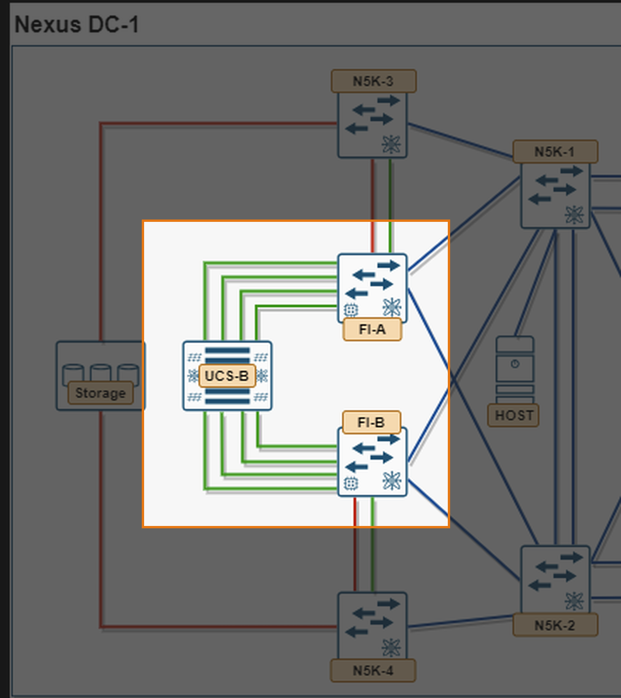
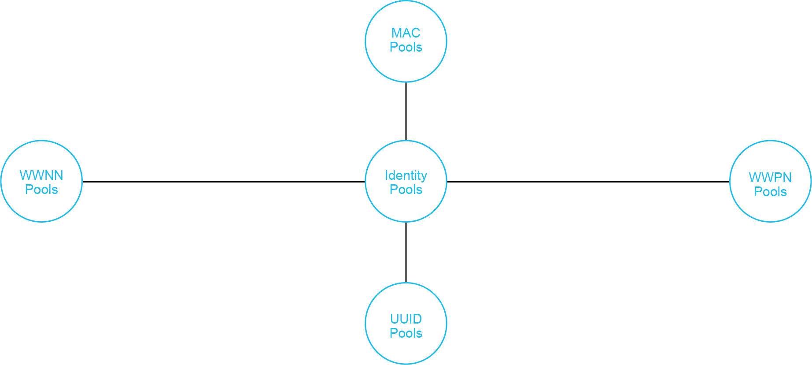
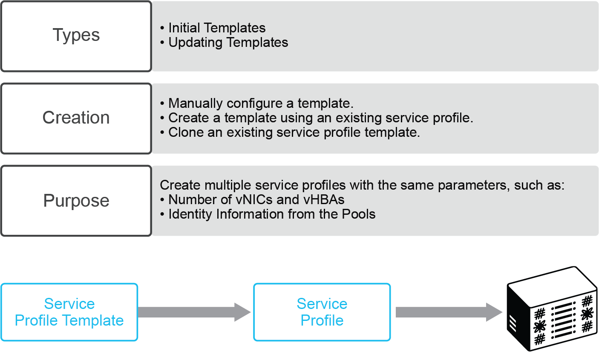

# 2. Module 1 — Compute Policies, Profiles, and Templates (4.1.a)


*Compute aspect of Nexus DC-1: UCS-B chassis and FI-A/FI-B highlighted*

**Objective:** build every reusable building block UCS Manager needs before a service profile can be associated to a UCS-B blade, then instantiate a profile from a template. Everything in this module lives on the highlighted devices above — the UCS-B chassis and the two Fabric Interconnects — before any of it reaches the LAN or SAN switches.

## 2.1 Task 1.0 — Chassis Discovery Policy

**Objective:** set this before anything else in the module — until the chassis is fully discovered, UCS-B blades don't exist as poolable inventory, so pools and profiles have nothing to attach to.

**Step 0 — the chassis-facing ports start with no role at all.** On a fresh FI, every physical port shows **Unconfigured** in the Equipment tab (you confirmed this in section 1.3). Chassis discovery cannot begin until the ports facing each IOM are explicitly set to **Server Port**: right-click the port(s) under **Equipment > Fabric Interconnects > Fixed Module > Ethernet Ports > Configure as Server Port**. Only once these are Server Ports does the Chassis Discovery Policy below have anything to act on.

Chassis Discovery Policy is a **global policy** (**Equipment > Policies > Global Policies > Chassis/FEX Discovery Policy**), not a per-chassis setting. It tells UCSM how many IOM-to-FI links per chassis to expect before it treats the chassis as fully discovered:

- **Action** — the number of links (1, 2, 4, or 8, depending on IOM/FI model) UCSM should expect from *each* IOM. The platform default is **1 Link**.
- **Link Grouping Preference** — **None** (each link discovered/managed individually) or **Port Channel** (links from one IOM bundle into a single port channel to the FI). Port Channel is the recommended setting whenever more than one link per IOM is cabled, since it gives you the port-channel resiliency and load-balancing behavior from Modules 8–9 on the chassis-to-FI links themselves.

**Why this matters, concretely:** the default of 1 Link means UCSM only needs to see *one* functioning IOM-to-FI link to call the chassis discovered — it will not automatically bring up additional cabled links just because they're physically present. If your UCS-B chassis has, say, two links per IOM cabled to each FI but the policy still says 1 Link, the extra link per IOM sits unused until you act. The inverse failure mode is just as real: if the policy is set to 4 Links and a chassis only has fewer than four links cabled per IOM, UCSM will not recognize that chassis at all.

1. **Set the policy to match your cabling:** **Equipment > Policies > Global Policies**, set Action to match your actual per-IOM link count (this topology's diagram shows the UCS-B chassis cabled with multiple links per IOM to each FI, so confirm your real cable count here rather than assuming the 1-Link default). Set Link Grouping Preference to **Port Channel** if more than one link per IOM is cabled.
2. **Acknowledge the chassis** now that Server Ports are set and the policy matches your cabling — on a chassis being discovered for the first time this happens automatically. If you change the policy *after* a chassis was already discovered under the old setting, Cisco's own guidance is to **acknowledge the individual IO Modules** (**Equipment > Chassis > Chassis N > IO Modules > [module] > General > Acknowledge**) rather than the whole chassis, since that picks up the new link count with less disruption. Full **Reacknowledge Chassis** (**Equipment > Chassis > Chassis N > General > Reacknowledge Chassis**) is the more disruptive fallback — it disconnects and rebuilds the entire chassis-to-FI connection from scratch, with a transient chassis/server flap, and is really only needed if acknowledging the IO Modules individually doesn't resolve it.
3. **Confirm completion** via the **Overall Status** field on the chassis's General tab — it should read **OK** once discovery (or reacknowledgment) finishes and all expected links are up.

**Verify:**

??? "Commands"
    ```text
    show chassis detail
    show fex-connectivity        ! or equivalent under Equipment > Chassis > IO Modules, depending on platform
    ```

In the GUI: **Equipment > Chassis > IO Modules**, confirm the expected number of links per IOM shows **Up**, and that they're bundled into a port channel if Link Grouping Preference was set to Port Channel.

!!! question "Check yourself"
    You cable two links per IOM but leave the discovery policy at the 1-Link default. What exactly happens to the second link — does UCSM report an error, or does it just sit unused — and what's the one action that fixes it without re-cabling anything?

### Fabric Interconnect Information Policy

While you're in **Equipment > Policies > Global Policies**, it's worth setting one more global policy that has nothing to do with chassis discovery but lives on the same screen: the **Info Policy**. It controls whether UCSM discovers and displays the upstream switches connected to the fabric interconnect — the SAN, LAN, and LLDP neighbors seen on its uplink ports. This is purely visibility, not connectivity: leaving it disabled doesn't break any uplink, LAN, or SAN function elsewhere in this guide, but it does mean the neighbor information UCSM would otherwise show you simply isn't collected.

!!! important
    You must enable the Info Policy on the fabric interconnect before UCSM will show you SAN, LAN, or LLDP neighbor details for that FI — with it disabled (the default), those neighbor panes stay empty even though the physical links are up and passing traffic fine.

**Configuring the Info Policy:**

1. Navigate to **Equipment > Policies > Global Policies**.
2. In the **Info Policy** group, choose one of:
    - **Disabled** — the information policy is off. This is the default.
    - **Enabled** — UCSM discovers and displays the FI's upstream SAN/LAN/LLDP neighbors.
3. Click **Save Changes**.

**Verify:** with Info Policy enabled, **Equipment > Fabric Interconnects > FI-A (or FI-B) > Neighbors** (or the LAN/SAN/LLDP neighbor tabs, depending on UCSM version) should populate with the directly connected N5K uplink switch once the corresponding uplink port is up — useful later in Module 2 for confirming an uplink actually landed on the switch you think it did, without leaving UCSM to check the N5K side.

## 2.2 Task 1.1 — Create Base Network Objects (VLANs and VSANs)

**Objective:** define the VLAN and VSAN IDs the rest of this module's pools and templates need to reference, before anything tries to select them from a dropdown that would otherwise be empty.

On a fresh UCSM, the only objects that exist are the defaults — **VLAN 1** and **VSAN 1** — and neither should be repurposed for production data traffic (VLAN 1 stays the untagged/native default; VSAN 1 stays the FI's default zone). This guide uses two shared VLANs and two VSANs per fabric (see 0.3) rather than a single ID of each, so create all six IDs now, before Task 1.4 (vNIC/vHBA templates) needs to select from them:

1. **LAN > LAN Cloud > VLANs > Add**, create two VLANs: **10** (`Data`) and **11** (`Mgmt`). Both are shared — trunked to both Fabric A and Fabric B uplinks rather than split per fabric — so you only need one pair, not one per fabric. Leave them unassigned to any uplink for now — that assignment happens in Module 2, Task 2.1.
2. **SAN > SAN Cloud > VSANs > Add**, create four VSANs: **100** (`SAN-A-Boot`, FCoE VLAN 1000) and **101** (`SAN-A-Data`, FCoE VLAN 1001) on Fabric A; **200** (`SAN-B-Boot`, FCoE VLAN 2000) and **201** (`SAN-B-Data`, FCoE VLAN 2001) on Fabric B. Again, assigning these to actual FC/FCoE uplink ports happens later, in Module 4.
3. This UCSM-side object is independent of the **N5K-local VLAN/VSAN database** on N5K-1–4 — creating these here does not create them on N5K-1/N5K-2 or N5K-3/N5K-4. Each platform keeps its own database; you'll create the matching N5K-side entries in Module 2 (Tasks 2.1 and 2.3). Both sides must agree on every numeric ID — that agreement, not the object's existence in only one place, is what makes trunking and FLOGI work end to end.

**Verify:** **LAN > LAN Cloud > VLANs** shows VLAN 1, 10, 11; **SAN > SAN Cloud > VSANs** shows VSAN 1, 100, 101, 200, 201.

!!! question "Check yourself"
    If you skip this task and go straight to creating the vNIC/vHBA templates in Task 1.4, what exactly happens when you try to select a VLAN or VSAN for them? And why does reaching VSAN 101 need a whole second vHBA, while reaching VLAN 11 just needs one more entry in an existing vNIC's allowed list?

## 2.3 Task 1.2 — Pools

**Literature review — Identity Pools.**


*Identity Pools overview: MAC Pools, WWNN Pools, WWPN Pools, and UUID Pools all feed a service profile's identity*

These four pool types sit under **Identity Pools** conceptually; in the UCSM GUI they're created individually under **Servers > Pools** (MAC/UUID/Server) and **SAN > Pools** (WWNN/WWPN). A service profile or service profile template simply references a pool for each identity type rather than hard-coding an address — which is also what makes the pools a prerequisite for Task 1.4's vNIC/vHBA templates and Task 1.5's service profile template.

Create, in **Servers > Pools**:

- **UUID Suffix Pool** — e.g. `UUID-Pool-A`, seed `0000-000000000001`, size 16.
- **Server Pool** — e.g. `Blade-Pool`, populate with qualifying UCS-B blades (use a Server Pool Policy Qualification if you want automatic membership by CPU/memory/adapter). Note this pool will be empty until Task 1.0's chassis discovery actually surfaces blades to add.
- **MAC Pool** — one per fabric: `MAC-Pool-A` (e.g. `00:25:B5:0A:00:00`), `MAC-Pool-B` (e.g. `00:25:B5:0B:00:00`). Keeping the byte that encodes fabric (`0A`/`0B`) makes packet captures self-documenting later.
- **WWNN Pool** — `WWNN-Pool`, one pool node-wide (a node has one WWNN regardless of fabric).
- **WWPN Pool** — one per fabric: `WWPN-Pool-A`, `WWPN-Pool-B`. Each fabric's pool now needs to supply *two* vHBAs per blade (boot + data, see Task 1.4), so size it accordingly — e.g. 16 addresses covers 8 blades' worth of boot+data vHBAs on that fabric.

### KVM Console — Management IP Pool (`ext-mgmt`)

**Objective:** give every blade's CIMC a management IP address before you need to open a KVM console to watch it POST, install an OS, or troubleshoot a boot that isn't working — none of which you can do blind.

Every server in a UCS domain needs one or more management IP addresses assigned to its **CIMC** (Cisco Integrated Management Controller) — either directly, or via a pool — because that's the address Cisco UCS Manager uses for all external access terminating in the CIMC: **KVM console**, Serial over LAN, and IPMI. Without one, "launch KVM" has nothing to connect to, independent of whether the blade's data-plane networking (VLANs, VSANs, zoning) is working at all.

Two address families exist, and this lab only needs one of them:

- **Out-of-band (OOB)** — traffic reaches the CIMC via the FI's dedicated management port, completely separate from the fabric uplinks this whole guide has been building. This is what the lab should use: KVM access shouldn't depend on the same data-plane trunks and port-channels you're deliberately breaking and fixing in later modules.
- **Inband** — traffic reaches the CIMC via a fabric uplink port instead, drawn from a VLAN and pool assigned to the service profile. Skip this for the lab; it's the right choice in production when you don't want a dedicated OOB management network, but it ties KVM reachability to the same uplinks Module 7's trunking drills intentionally break.

Cisco UCS Manager ships a default OOB management IP pool named **`ext-mgmt`** — a collection of external IPv4/IPv6 addresses UCSM hands out to CIMCs automatically. On a fresh domain it's empty, which is exactly the "blank" state this guide assumes, so populating it is a Task 1.2 activity, not something you can defer.

**Populate the pool:**

1. **LAN > Pools > [root or your org] > IP Pools > right-click IP Pool `ext-mgmt` > Create Block of IP Addresses.**
2. Fill in the block: **From** / **To** (a contiguous range sized for at least as many addresses as `Blade-Pool` above — one CIMC per blade), **Subnet**, **Default Gateway**, **Primary DNS**, **Secondary DNS**.
3. **Click OK.**

**Constraints worth knowing before you fill in that dialog** (this is where most first attempts fail):

- Every address in this pool must sit in the **same IPv4 subnet** (or share the same IPv6 prefix) as the fabric interconnects' own management IP — this pool is not routed independently.
- The pool must **not** contain any address already assigned as a *static* management IP to some other server or service profile; UCSM rejects the overlap.
- If a server or service profile already has a **static** address assigned from `ext-mgmt`, you cannot repurpose those specific addresses without first clearing that static assignment.

**Nothing above assigns an address to a blade yet** — creating the block only stocks the pool. Association is what actually draws one out: once Task 1.6 associates a service profile from the Updating Template with a blade, that blade's CIMC pulls its OOB address from this pool automatically, no separate per-blade step required. If you ever need to check or force it manually instead, it's under **Equipment > Chassis > Chassis N > Servers > [blade] > Inventory > CIMC tab > Use Outband Pooled Management IP.**

**Verify:** after Task 1.6's association, **Equipment > Chassis > Chassis N > Servers > [blade] > Inventory > CIMC** shows an assigned IPv4 address drawn from this pool's range; **Servers > Service Profiles > [name] > General** shows the same address under Management IP Address. From there, right-click the service profile (or the server in Equipment) and **Launch KVM Console** should reach the blade's screen — this is your first real look at whether a blade is even POSTing, well before Module 10's SAN boot proof needs it.

!!! question "Check yourself"
    If you associate a service profile to a blade before this pool has any free addresses left in it, what happens to that association — does it fail outright, succeed without a management IP, or queue and retry? And separately: why does this guide deliberately use the OOB pool instead of an inband one, given that inband is also a documented, supported option?

## 2.4 Task 1.3 — Policies

Create, in **Servers > Policies**:

- **BIOS Policy** — disable unused boot devices, set CPU performance profile as required by the lab scenario.
- **Boot Policy** — SAN Boot; built out in full in its own subsection immediately below, since it's the policy the entire lab's capstone objective depends on.
- **Local Disk Configuration Policy** — built out in full in its own subsection below, right after Boot Policy; the mode you pick here has a sharper effect on association than the one-line summary above suggests.
- **Maintenance Policy** — set to `user-ack` so profile changes don't silently reboot a blade mid-lab.
- **Adapter Policy** — leave at platform default (`VMWare`/`Linux`/`Windows`) unless the lab scenario specifies OS-specific tuning.
- **Power Control Policy**, **Scrub Policy** — defaults are fine; know where they live for the exam.

### Boot Policy (SAN Boot)

**Objective:** build the one policy the entire session's capstone depends on — everything from Module 5 onward exists to make a blade associated with this policy actually boot.

A **Boot Policy** (**Servers > Policies > Boot Policies**) overrides the server's BIOS boot order and determines which device the server boots from, the location it boots from, and the order boot devices are tried. Cisco's own guidance is to create a **named, global boot policy** you can attach to multiple service profiles or templates, rather than a local boot policy tied to one service profile — this lab creates one named policy (`Boot-SANBoot`) and reuses it from the Updating Service Profile Template in Task 1.5, so a later fix applies everywhere at once.

**Why SAN boot specifically:** Cisco recommends SAN boot over local-disk or LAN boot for exactly the property this lab is built around — service profile mobility. Because the OS image lives on the array rather than on the blade, moving the service profile to different hardware (or re-associating after a blade failure) boots the new blade from the identical image, so the network sees the same server. That mobility is also *why* Module 10's SAN boot proof matters as the capstone: it's demonstrating the one thing this whole design exists to provide.

**Create the policy:**

1. **Servers > Policies > [root or your org] > right-click Boot Policies > Create Boot Policy.**
2. **Name it** `Boot-SANBoot` — 1–16 alphanumeric characters; no spaces; hyphen, underscore, colon, and period are the only punctuation allowed, and the name can't be changed once saved.
3. **Reboot on Boot Order Change** — leave unchecked for this lab. Be aware this checkbox only controls *reordering* an existing entry: on servers with a non-Cisco VIC adapter, adding, deleting, or reordering a **SAN device** in the boot order always triggers a reboot when the policy is saved, regardless of this setting.
4. **Enforce vNIC/vHBA/iSCSI Name** — check this. With it checked, UCSM validates that the vHBA names you reference below (`vHBA0`, `vHBA1`) actually exist with those exact names in the service profile, and flags a configuration error if they don't — catching a Task 1.5 typo immediately instead of at boot time.
5. **Boot Mode** — **Legacy**, unless your blade/adapter generation requires UEFI (UEFI is mandatory on newer M7+ server generations; check your actual hardware before assuming Legacy).
6. **Add the SAN boot entries** — expand the **vHBAs** area and use **Add SAN Boot** twice:
    - **Add SAN Boot** → vHBA name `vHBA0`, Type = **Primary** → **OK**.
    - With `vHBA0` still selected, **Add SAN Boot Target** → Boot Target LUN `0`, Boot Target WWPN = the storage array's **Fabric A** target port WWPN, Type = **Primary** → **OK**.
    - **Add SAN Boot** → vHBA name `vHBA1`, Type = **Secondary** → **OK**.
    - With `vHBA1` selected, **Add SAN Boot Target** → Boot Target LUN `0`, Boot Target WWPN = the storage array's **Fabric B** target port WWPN, Type = **Primary** → **OK**.
    - Get the array's actual target WWPNs from its own management tool, or from `show fcns database` once the array has logged into the fabric — don't guess them.
7. **Click OK** to save the policy.

Boot only ever uses the **Boot** VSANs from 0.3's numbering: `vHBA0` rides VSAN 100 (Fabric A), `vHBA1` rides VSAN 200 (Fabric B). The **Data** VSANs (101/201) hold a second LUN you'll zone in Module 5 for practice — that LUN is never in this boot policy, because a boot policy only ever points at the LUN(s) it should try to boot from, not every LUN the blade can see once it's up.

!!! warning "This policy alone will not produce a working boot"
    A blade associated with this boot policy sits at "no bootable device" (or keeps retrying) until Module 5's zoning and the array's LUN masking both reference the exact same WWPN/LUN pair used here. That's expected at this stage of the guide, not a fault — Module 10 is where you come back to this exact policy and prove the boot actually completes end to end.

**Verify:** **Servers > Policies > Boot Policies > Boot-SANBoot**, confirm both SAN Boot entries show under vHBAs with the correct Primary/Secondary order and target WWPN/LUN. Once a service profile using this policy is associated (Task 1.6), **Servers > Service Profiles > [name] > General > Boot Order Details** shows the same order — that tab reflects the *actual* boot order the server will attempt, which is worth comparing against the policy any time the two seem to disagree.

!!! question "Check yourself"
    If the primary SAN boot path (`vHBA0` → Fabric A target) is unreachable at boot time — cable pulled, zoning wrong, whatever — does the server automatically try the secondary path, and what exactly in this policy is what makes that automatic instead of something you'd have to trigger by hand?

### Local Disk Configuration Policy

**Objective:** pick the local-storage mode that actually matches your blades' hardware, not just the mode that sounds right for "boot from SAN."

A **Local Disk Configuration Policy** (**Servers > Policies > Local Disk Config Policies**) configures the SAS local drives on the server's own on-board RAID controller — a separate concern from the SAN boot target you just built. Cisco documents several **Mode** options for this policy; the ones relevant to this lab are:

- **No Local Storage** — for a diskless server or a SAN-only configuration. This is stricter than it sounds: if you select it, **you cannot associate any service profile using this policy with a server that actually has a local disk** — association fails outright, it doesn't just ignore the disk.
- **Any Configuration** — for a server configuration that carries forward whatever local disk configuration is already present, without changing it. This is the safe choice when your UCS-B blades physically have local disks you simply want the OS to ignore in favor of the SAN boot LUN, since it won't fight with hardware that's actually there.
- **RAID 1 Mirrored** — data is written to two disks at once, giving complete data redundancy if either single disk fails; the usable array size is capped at whichever of the two drives is smaller. This is what "mirrored" means concretely: every write is duplicated to both disks, not striped across them, so you trade half your raw capacity for the ability to lose one disk without losing data.
- **RAID 0 Striped** — data is striped across all disks for fast throughput, with no redundancy at all; losing any one disk loses everything.
- **No RAID** — disks behave individually, like JBOD, with no interdependency.

**Why this matters for a SAN-boot lab specifically:** the natural instinct is "we're booting from SAN, so pick No Local Storage." That's only correct if your actual UCS-B blades have zero local disks installed. Most B-Series blades ship with at least one local SAS/SATA drive whether or not you intend to use it — associate a service profile carrying **No Local Storage** to a blade like that, and the association fails with a configuration mismatch, for reasons that have nothing to do with zoning, VSANs, or anything else this guide has built so far. **Any Configuration** is the mode that actually matches "boot from SAN, and also happens to have a local disk we don't care about."

**Create the policy:**

1. **Servers > Policies > [root or your org] > right-click Local Disk Config Policies > Create Local Disk Configuration Policy.**
2. **Name it** `LocalDisk-SANBoot`.
3. **Mode** — choose **Any Configuration** if your blades have a local disk you're deliberately not booting from, or **No Local Storage** only if you've confirmed the blades genuinely have none installed. When in doubt, check **Equipment > Chassis > Servers > [blade] > Inventory > Storage** before picking — don't guess from the blade model number alone.
4. **Protect Configuration** — leave unchecked for this lab. When checked, the local disk configuration survives a service profile disassociation; re-associating with a different local disk policy afterward then produces a configuration mismatch instead of quietly applying the new setting, which is a rough edge worth avoiding while you're still iterating on this template.
5. **Click OK.**

**Verify:** attach this policy in Task 1.5's Service Profile Template (Storage panel), then after association, **Servers > Service Profiles > [name] > Storage > Local Disk Configuration Policy** should show the mode you set here with no configuration-mismatch fault against it.

!!! question "Check yourself"
    If a blade with one physical local disk is associated with a service profile carrying the **No Local Storage** mode, what exactly fails — does UCSM silently ignore the disk, warn you, or block the association? Now compare that to what **Any Configuration** would do on the exact same hardware.

## 2.5 Task 1.4 — vNIC and vHBA Templates

Create templates under **LAN > Policies > vNIC Templates** and **SAN > Policies > vHBA Templates**, referencing the VLAN/VSAN objects you created in Task 1.1. vNICs and vHBAs behave differently here, and it's worth seeing why:

**vNIC templates — one per fabric, each trunking two VLANs.** A single vNIC can carry multiple VLANs at once, so reaching both of Fabric A's VLANs only takes one template:

- `vNIC-Template-A` — Fabric A, no failover, MAC pool `MAC-Pool-A`, VLAN 10 (native) + VLAN 11.
- `vNIC-Template-B` — Fabric B, mirrors A with `MAC-Pool-B`, same VLAN 10 (native) + VLAN 11 — the VLANs are shared, only the fabric side and MAC pool differ.

**vHBA templates — two per fabric, because a vHBA belongs to exactly one VSAN.** Reaching both of Fabric A's VSANs takes two separate vHBAs, each with its own template:

- `vHBA-Template-A-Boot` — Fabric A, WWPN pool `WWPN-Pool-A`, VSAN 100.
- `vHBA-Template-A-Data` — Fabric A, WWPN pool `WWPN-Pool-A`, VSAN 101.
- `vHBA-Template-B-Boot` — Fabric B, WWPN pool `WWPN-Pool-B`, VSAN 200.
- `vHBA-Template-B-Data` — Fabric B, WWPN pool `WWPN-Pool-B`, VSAN 201.

Set **Template Type = Updating Template** on all six so a later change (e.g. adding a VLAN) propagates to every service profile derived from them — this distinction (initial vs. updating) is a favorite exam trap.

### Adapter Policy on the vHBAs

Every vHBA — whether it lands on a blade via one of the four templates above or is added directly to a service profile — uses a **Fibre Channel Adapter Policy** that governs host-side adapter behavior: queues, error recovery, and FLOGI/PLOGI timing. Cisco ships a set of pre-configured, OS-specific FC adapter policies (`VMware`, `Linux`, `Windows`, and so on) with recommended values for each OS, and its own guidance is blunt about them: use the default policy for your OS, and don't hand-edit the values unless your storage array vendor or Cisco TAC directs you to.

**Create one (only if the defaults don't fit your scenario):**

1. **Servers > Policies > [root or your org] > right-click Adapter Policies > Create Fibre Channel Adapter Policy.**
2. **Name it** (1–16 alphanumeric characters, same punctuation rules as every other UCSM policy name) and give it a description.
3. **Resources area** — Ring Size for Transmit/Receive/I/O queues; leave at platform defaults unless you have a specific performance reason to change them, since larger ring sizes trade memory for headroom under burst I/O, not raw throughput.
4. **Options area** — this is the section actually worth reading closely for a SAN-boot lab; the two fields below are the ones Cisco's own documentation calls out as boot-relevant:
    - **Flogi Timeout (ms)** — how long the vHBA waits before retrying its fabric login. Default is 4,000 ms. Cisco's documentation is explicit that a Flogi timeout of **20,000 ms or more on a boot vHBA can cause a SAN boot failure** if the adapter doesn't receive an accept to its initial FLOGI in time — for any boot-enabled vHBA, keep this at **5,000 ms or less**.
    - **Plogi Timeout (ms)** — the same idea one layer up, for logging into a specific target port. Default is 20,000 ms, but the same warning applies: **20,000 ms or more on a boot vHBA risks a SAN boot failure**; Cisco recommends **5,000 ms or less** for boot-enabled vHBAs specifically (4,000 ms if the target OS is Windows).
    - **Port Down Timeout (ms)** — how long a remote FC port can sit offline before the SCSI upper layer is told it's gone; default 30,000 ms, but Cisco recommends 10,000 ms for VIC adapters running ESX.
5. **Click OK**, confirm the dialog if one appears.

Every one of these timeout values only matters *before* the fabric is actually usable — which is exactly the state Module 1 leaves you in. If Module 10's SAN boot attempt hangs or times out in a way that looks like the array simply never answered, these three values (not zoning, not the boot policy itself) are worth checking before you assume the fault is upstream.

!!! question "Check yourself"
    The platform defaults leave Flogi and Plogi timeout well above the 5,000 ms boot-safe threshold Cisco documents. Why doesn't that already break every SAN boot in this lab if you've left the adapter policy at its OS default? (Hint: what has to actually go wrong at FLOGI/PLOGI time for the timeout value to matter at all?)

## 2.6 Task 1.5 — Service Profile Template

**Literature review — Service Profile Templates.**


*Service Profile Template: types, creation methods, purpose, and the template-to-profile-to-server flow*

A template is the reusable definition; a service profile is the concrete, per-server instance generated from it; associating that profile to a blade is what actually applies the identity (UUID, MACs, WWPNs, boot policy, and so on) to hardware. Task 1.5 below builds the template; Task 1.6 generates and associates the profiles from it.

Build a **Service Profile Template** named `SPT-ESX-SANBoot`.

**Set Type = Updating Template** — this is a field in the creation wizard itself (**Servers > Service Profile Templates > Create Service Profile Template > Type: Initial Template / Updating Template**), not a detail to configure afterward, so set it correctly on the first screen. The distinction matters for a different reason here than it did for the vNIC/vHBA templates in 2.5: an **Initial Template** is a one-time stamp — every service profile created from it is independent afterward, and editing the template later touches nothing already derived from it. An **Updating Template** keeps every derived service profile permanently bound to the template — change the Boot Policy, a pool, or any policy on the template later, and every service profile instantiated from it (Task 1.6) picks up that change automatically, without being re-created. For a lab where you'll likely be iterating on the boot policy, pools, or vHBA/vNIC placement, Updating is what lets a single fix apply everywhere at once instead of requiring you to touch each service profile individually.

With Type set, continue through the wizard:

1. Identity: UUID pool = `UUID-Pool-A`.
2. Storage: local disk configuration policy `LocalDisk-SANBoot` from this module's Local Disk Configuration Policy subsection; add four vHBAs from the templates in 2.5 — `vHBA0` (Boot-A), `vHBA1` (Boot-B), `vHBA2` (Data-A), `vHBA3` (Data-B). Naming them in boot/data pairs like this makes the Boot Policy's vHBA0/vHBA1 references unambiguous later.
3. Networking: add `vNIC0` (Template-A) and `vNIC1` (Template-B) from the templates in 2.5.
4. Zoning (if using UCSM-managed zoning instead of switch-based — see Module 5 note): configure storage connection policies here if applicable.
5. **Server Boot Order** — its own wizard page, not part of Storage above. Select **Boot Policy = `Boot-SANBoot`** (the policy built earlier in this module) from the drop-down. This is the page that actually binds the template to the vHBA0/vHBA1 Primary/Secondary SAN boot order — everything in step 2 makes the vHBAs exist, but this step is what tells the server to boot from them.
6. Server Assignment: pool = `Blade-Pool`, maintenance policy from 2.4.
7. Operational Policies: BIOS policy from 2.4.

!!! question "Check yourself"
    If this template were Initial instead of Updating, and you later discovered the Boot Policy had the wrong LUN ID, what would you have to do differently to fix every service profile already derived from it?

## 2.7 Task 1.6 — Instantiate and Associate

From the template, right-click **Create Service Profiles from Template**, generate 2+ profiles (e.g. `Blade01`, `Blade02`). Confirm they auto-associate to pool members, or associate manually to specific blade slots if the lab calls for deterministic placement.

**Verify:**

??? "Commands"
    ```text
    show service-profile status
    show server inventory (via UCSM CLI: scope org / scope service-profile <name> / show config)
    ```

In the GUI: **Servers > Service Profiles**, confirm Assoc State = `associated`, Overall Status = `ok`.

!!! note
    Overall Status may show a fault or sit at "discovery"/boot-related warnings at this point in the guide — that's expected. Association only means UCSM successfully applied the identity, pools, and policies to the blade; it says nothing about whether the blade can actually boot yet, since the SAN path (zoning, NPIV, LUN masking) doesn't exist until Modules 5–6. Don't chase boot faults now — come back to this exact service profile in Module 10 once the rest of the fabric is built, and confirm the boot itself there.

!!! question "Check yourself"
    What happens to already-associated profiles if you edit an *updating* vNIC template's VLAN list versus editing an *initial* template? Be able to explain the propagation difference out loud.

### Worked Example: Unbinding a Service Profile to Make a One-Off Change

**Scenario:** `SPT-ESX-SANBoot` is an **Updating Template** (Task 1.5, by design), so every profile generated from it in this task — `Blade01`, `Blade02`, and so on — stays permanently bound to it: change the template later and every bound profile picks up that change automatically. Now suppose you need to make a change on **`Blade02` only** — a one-off BIOS tweak while you diagnose something, a different boot LUN ID for a single test blade, whatever — without that change propagating to `Blade01` and every other profile sharing the template. A bound profile won't let you do this directly.

**Why the direct edit doesn't work:** Cisco's own documentation is explicit about what binding actually means: *"you can only change the configuration of a bound service profile through the associated template."* While a profile is bound, UCSM treats the template as the single source of truth — if you try to edit a template-controlled field directly on the bound profile, either the field is not editable, or UCSM reconfigures the profile back to match the template the next time it reconciles. Binding isn't a one-time copy; it's a standing link.

**Fix — unbind the one profile you need to diverge:**

1. **Servers > Service Profiles > [org] > `Blade02`.**
2. **Work pane > General tab.**
3. **Actions area > Unbind from the Template.**
4. Confirm **Yes** on the dialog.

**CLI equivalent**, for the same result:

??? "Commands"
    ```text
    scope org
    scope service-profile Blade02
    set src-templ-name ""
    commit-buffer
    ```

**What actually changes:** unbinding only removes the link to the parent template — it does **not** revert or clear anything. `Blade02` keeps every setting and resource it already had (VLANs, VSANs, boot policy, pools, everything from the last time it matched the template) and simply becomes a **static, independent service profile** from that point on. You can now edit `Blade02` directly, and — just as important — the reverse is now also true: if you go back and change `SPT-ESX-SANBoot` itself, `Blade02` no longer picks up that change, while `Blade01` (still bound) does. That asymmetry is the actual trade-off, not a side effect: unbinding buys per-profile flexibility at the cost of that one profile falling out of the template's future updates until you explicitly **Bind to a Template** again (same General tab, **Actions > Bind to a Template**).

**Verify:** **Servers > Service Profiles > `Blade02` > General**, confirm the template reference field is now empty and the fields you needed to change are editable directly.

!!! question "Check yourself"
    Six months from now, someone adds a VLAN to `SPT-ESX-SANBoot` for a new environment requirement. `Blade01` picks it up automatically; `Blade02` doesn't. Nothing in UCSM raises an alarm about this by itself — what would actually tip you off that `Blade02` silently drifted out of sync, and where would you look to confirm it?
