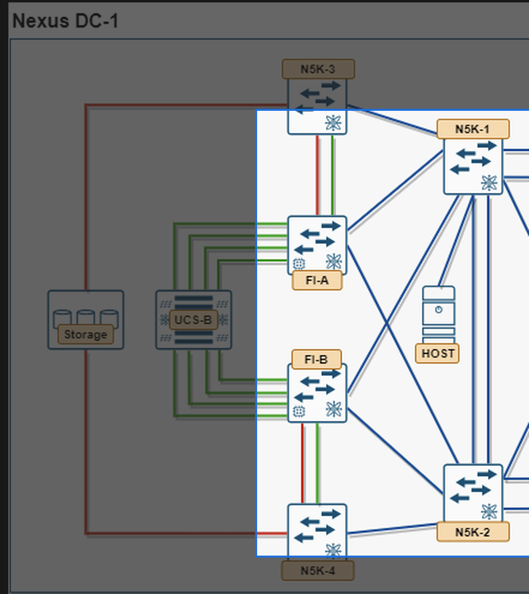

# 3. Module 2 — SAN/LAN Uplinks (4.2.a)

**Objective:** get traffic off the Fabric Interconnects and onto both the LAN switches and the SAN switches, correctly typed as uplink ports.

## 3.1 Task 2.1 — Ethernet (LAN) Uplinks


*LAN aspect of Nexus DC-1: N5K-1/N5K-2, FI-A/FI-B, and Host highlighted*

On each FI (UCSM: **Equipment > Fabric Interconnects > Fixed Module > Ethernet Ports**), set the ports facing N5K-1/N5K-2 to **Uplink Port**. If more than one physical link per FI, bundle them (see Module 8).

On N5K-1/N5K-2, first create the local VLANs in the switch's own VLAN database (this is separate from the UCSM VLAN objects you created in Module 1, Task 1.1 — matching IDs are what tie the two together, not a shared database). VLAN 10 and 11 are shared, so both N5K uplink interfaces — the one toward FI-A and the one toward FI-B — carry the same Data/Mgmt pair. The one thing that must *not* be shared is the FCoE VLAN: it's bound to that fabric's VSANs (Module 4), so mixing FCoE VLAN 1000 onto the FI-B-facing interface (or 2000 onto the FI-A-facing one) would leak one fabric's SAN traffic onto the other's Ethernet path and defeat the point of keeping the SAN fabrics isolated:

```text
vlan 10
  name Data
vlan 11
  name Mgmt

! Toward FI-A
interface Ethernet1/1
  switchport mode trunk
  switchport trunk allowed vlan 10,11,1000
  no shutdown

! Toward FI-B
interface Ethernet1/2
  switchport mode trunk
  switchport trunk allowed vlan 10,11,2000
  no shutdown
```

If N5K-1/N5K-2 run vPC to each FI, see Module 8 for the vPC-specific config.

## 3.2 Task 2.2 — FC/FCoE (SAN) Uplinks

Decide per-FI whether SAN connectivity is **native FC** or **FCoE**. On the FI (UCSM: **Equipment > Fixed Module > FC Ports**, or **Uplink FCoE Interfaces**), set the ports facing N5K-3/N5K-4 to **FC Uplink Port** (or **FCoE Uplink Port**).

Set the FI's global SAN switching mode first, since it gates what an uplink port can do:

**SAN > SAN Cloud > Fabric A > set FC Switching Mode = End Host (default) or Switching.** End-host mode is the far more common exam and production default — it makes the FI behave as an N-Port/NPV-style device toward the core, which is exactly what Module 6 exercises.

## 3.3 Task 2.3 — N5K-Side F Ports

On N5K-3/N5K-4, the ports facing FI-A/FI-B must come up as **F ports** (fabric ports) so the FI can log in as an N-Port. Each fabric's core switch carries both of that fabric's VSANs (Boot + Data) over the same physical uplink, so the trunk allowed-list needs both IDs, not just one. `feature npiv` is **not** configured here — this pod already has it enabled per the Section 1.1 confirm step, and it needs to already be live the moment this F-port trunk comes up:

```text
! N5K-3 (Fabric A core)
! feature npiv          — already enabled, confirmed in Section 1.1; not reconfigured here
vsan database
  vsan 100
  vsan 101
interface fc1/1
  switchport mode F
  switchport trunk allowed vsan 100,101
  no shutdown

! N5K-4 (Fabric B core) — mirrors N5K-3 with Fabric B's VSANs
! feature npiv          — already enabled, confirmed in Section 1.1; not reconfigured here
vsan database
  vsan 200
  vsan 201
interface fc1/1
  switchport mode F
  switchport trunk allowed vsan 200,201
  no shutdown
```

**Verify:**

```text
show interface brief
show flogi database
show fcns database vsan 100
show fcns database vsan 101
```

You should see the FI's WWPN(s) FLOGI into the fabric as soon as the link and VSAN membership are correct — expect two logins per fabric once Module 1's boot and data vHBAs are both associated (one FLOGI/FDISC per vHBA, both riding the same physical F port).

!!! question "Check yourself"
    Why must `feature npiv` be enabled on N5K-3/N5K-4 even though NPIV itself is the FI's behavior, not the core switch's? (Answer lives in Module 6 — come back to this after that module if it's not obvious yet.) And why was this the one feature you were told to only *confirm* back in Section 1.1, rather than enable fresh like `feature fcoe` or `feature vpc`? And why does adding VSAN 101 to this trunk's allowed-list not require a second physical F port, when adding VSAN 101 to a *blade* required a second vHBA back in Module 1?

## 3.4 Task 2.4 — VLAN Groups

**Objective:** organize related VLANs into a named, reusable object and pin that whole set to a preferred uplink, instead of managing each VLAN's uplink assignment one at a time.

A **VLAN Group** (UCSM: **LAN > LAN Cloud > VLAN Groups**) is a container of VLANs that can be assigned to one or more uplink ports or uplink port channels as a single unit. It doesn't replace VLANs or trunking — it's a management and traffic-engineering layer on top of them. Since VLAN 10 and 11 are both shared and trunked to both fabrics' uplinks for redundancy (Task 2.1), a VLAN Group here isn't used to keep one VLAN off a given uplink — it's used to give each VLAN a *preferred, primary* path, so normal-condition traffic splits predictably across the two uplinks instead of being left to hash unpredictably.

1. **Create the groups:** a VLAN Group can only contain VLANs that already exist as objects under **LAN > LAN Cloud > VLANs** — Module 1, Task 1.1 already created both you need, so this task is purely about grouping and pinning. Right-click **VLAN Groups > Create VLAN Group** twice: `VG-Data` with member VLAN 10, and `VG-Mgmt` with member VLAN 11.
2. **Pin each group to a preferred uplink:** in the same wizard (or by editing the group afterward), assign `VG-Data` to the uplink port/port-channel facing FI-A as its primary path, and `VG-Mgmt` to the uplink facing FI-B as its primary path, under **LAN Uplink Ports** / **Port Channels**. This is a preference, not an exclusion — both VLANs stay trunked on both uplinks (Task 2.1), so either one still fails over to the other uplink if its pinned path goes down.
3. **Match the N5K side:** the trunk `allowed vlan` list on both N5K-1/N5K-2 interfaces (Task 2.1) should already permit VLAN 10 and 11 on both physical interfaces — a VLAN Group pin doesn't need a matching restriction on the N5K allowed-list the way a hard-segregation design would, since both VLANs are legitimately allowed on both trunks:

```text
! N5K-1/N5K-2 — both VLANs are legitimately allowed on both interfaces;
! the VLAN Group pin only affects which uplink the FI/UCSM side prefers as primary
interface Ethernet1/1
  switchport trunk allowed vlan 10,11
interface Ethernet1/2
  switchport trunk allowed vlan 10,11
```

**Verify:** **LAN > LAN Cloud > VLAN Groups**, confirm each group's member VLAN and its pinned uplink; cross-check with `show interface trunk` on N5K-1/N5K-2 that VLAN 10 and 11 both appear on both physical interfaces — that's expected here, unlike a hard-segregated design.

!!! question "Check yourself"
    If VLAN Group pinning only sets a *preferred* path rather than an exclusive one, what would you actually expect to change if you shut down `VG-Data`'s pinned uplink — and how would you confirm VLAN 10's traffic failed over rather than simply stopped?
