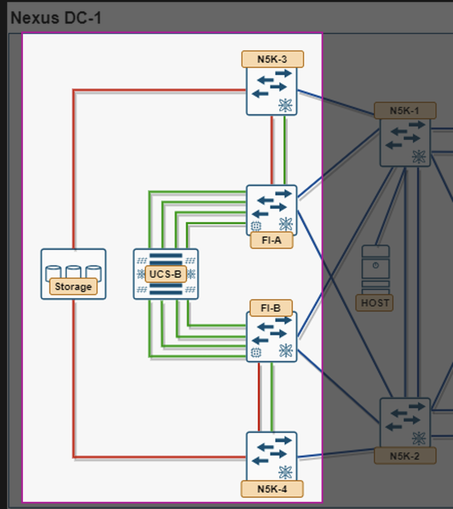

# 6. Module 5 — Zoning (5.1.a)


*SAN aspect of Nexus DC-1: N5K-3/N5K-4, FI-A/FI-B, UCS-B, and Storage highlighted*

**Objective:** restrict fabric visibility so each blade's vHBA sees only its intended storage target, per fabric. Zoning is enforced on N5K-3/N5K-4 above — the two SAN core switches sitting between the FIs and the array.

## 6.1 Task 5.1 — Device Aliases

On N5K-3, one device-alias per vHBA you're zoning plus one per storage target port. This lab has two VSANs on Fabric A (boot + data), so there are two blade-side aliases and — if the array uses a different target port per LUN — potentially two storage-side aliases as well:

??? "Commands"
    ```text
    device-alias database
      device-alias name Blade01-hba0 pwwn 20:00:00:25:b5:0a:00:01    ! vHBA0, VSAN 100 (boot)
      device-alias name Blade01-hba2 pwwn 20:00:00:25:b5:0a:00:03    ! vHBA2, VSAN 101 (data)
      device-alias name Storage-fa-boot pwwn 50:0a:09:81:88:9a:6b:c0
      device-alias name Storage-fa-data pwwn 50:0a:09:82:88:9a:6b:c0
    device-alias commit
    ```

Pull the actual WWPNs from `show flogi database` (blade side) and the array's documentation or `show fcns database` (storage side) rather than guessing. Repeat the equivalent alias set on N5K-4 for Fabric B (VSAN 200 boot, VSAN 201 data), using `-fb` names.

## 6.2 Task 5.2 — Zones and Zoneset

Single-initiator, single-target zoning is the standard, exam-expected pattern. Each VSAN gets its own zone and its own zoneset — a zone is scoped to exactly one VSAN, so the boot zone and the data zone can't share one even though they're on the same physical switch:

??? "Commands"
    ```text
    ! VSAN 100 — boot path
    zone name Blade01-Boot-to-Storage-fa vsan 100
      member device-alias Blade01-hba0
      member device-alias Storage-fa-boot

    zoneset name ZS-Fabric-A-Boot vsan 100
      member Blade01-Boot-to-Storage-fa

    zoneset activate name ZS-Fabric-A-Boot vsan 100

    ! VSAN 101 — data path
    zone name Blade01-Data-to-Storage-fa vsan 101
      member device-alias Blade01-hba2
      member device-alias Storage-fa-data

    zoneset name ZS-Fabric-A-Data vsan 101
      member Blade01-Data-to-Storage-fa

    zoneset activate name ZS-Fabric-A-Data vsan 101
    ```

Repeat both pairs with fabric-B naming (`-fb`) on N5K-4, under VSAN 200 (boot) and VSAN 201 (data).

## 6.3 Task 5.3 — Verify

??? "Commands"
    ```text
    show zoneset active vsan 100
    show zoneset active vsan 101
    show zone name Blade01-Boot-to-Storage-fa vsan 100
    show device-alias database
    ```

Confirm the storage array's LUN masking (on the array side) presents each LUN to exactly the WWPNs you zoned for it — zoning and masking are two independent controls that must both agree, and this now matters twice (once per VSAN) instead of once.

!!! danger "Zoning is not the whole gate — array-side masking is a separate, independent control"
    If you don't have management access to the storage array (common in a shared/pre-provisioned pod), you cannot verify or build LUN masking yourself. In that case, treat masking as a known-good black box built ahead of time by the pod provider — and treat your **WWPN pool seed values** (Module 1, Task 1.2) as non-arbitrary: they likely need to match whatever WWPNs the array was already masked to. If zoning, FLOGI, and the boot policy all check out in Module 10 and boot still fails, a WWPN mismatch against pre-existing array masking is the most likely cause, not a fabric misconfiguration.

!!! question "Check yourself"
    Why can't the boot zone and the data zone be combined into a single zone spanning both VSANs, even though they're both "Fabric A" and both involve the same blade? What's the practical difference between zoning at the switch (what you just did) and any zoning-like construct available inside UCSM itself? When would you prefer one over the other?
