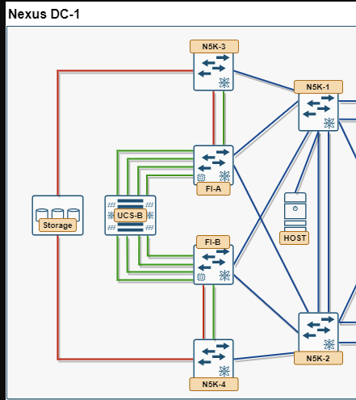

# 11. Module 10 — End-to-End Verification and SAN Boot

*Nexus DC-1 full topology: the complete path a boot I/O traverses, from UCS-B through FI-A/FI-B to N5K-3/N5K-4 and Storage*

**This is the payoff module.** Everything from Module 1 onward was building toward one thing: a blade that actually boots its OS from the SAN LUN. Walk the path hop by hop first — don't skip straight to powering on the blade, because if boot fails you want to already know which of these seven links is broken rather than guessing from a blank console.

1. **Blade → vHBA:** `show service-profile status` — associated, no faults.
2. **vHBA → FI:** confirm vHBA appears under the correct FI/fabric in UCSM Equipment tab.
3. **FI → Core:** `show npv flogi-table` (FI) matches `show flogi database` (N5K-3/N5K-4).
4. **Core → Storage:** `show fcns database` shows both the blade's WWPN and the storage target's WWPN in the same VSAN.
5. **Zoning:** `show zoneset active` includes a zone joining that exact WWPN pair (Module 5).
6. **Storage → LUN presentation:** array-side masking shows boot LUN 0 presented to exactly that WWPN, on both fabrics.
7. **Boot policy sanity:** the service profile's Boot Policy (Module 1, Task 1.3) lists the same target WWPN/LUN you just confirmed in steps 4–6 — a boot policy pointing at the wrong WWPN is a common self-inflicted failure that has nothing to do with the fabric.

!!! danger "If you have no access to the array's management plane"
    Steps 6 and 7 above are the two places a pre-provisioned pod most commonly breaks in a way you can't directly diagnose. If zoning, FLOGI, and NPIV all check out (steps 1–5) and boot still fails, suspect a WWPN mismatch between your Module 1 WWPN pool and whatever the array was actually pre-masked to — see the note in [Module 5 — Zoning](06-zoning.md).

## 11.1 Task 10.1 — Watch It Actually Boot from SAN

1. **Launch the KVM console:** **Servers > Service Profiles > [name] > KVM Console**, then power-cycle the blade (Boot Server) if it isn't already up.
2. **Watch POST for the FC boot target.** During boot, the adapter's option ROM (or the server's boot device list) should enumerate the FC boot target(s) you configured — confirm it shows the array's WWPN and LUN 0, not "No bootable device found." If it hangs here, go back to steps 1–7 above before touching anything else; this is the single most informative moment in the whole lab, because it tells you definitively whether the SAN path is actually live.
3. **Confirm the OS boots from the LUN, not local disk.** If the LUN was pre-imaged, watch it load the OS normally. If it's blank, run the OS installer now and target the presented SAN LUN as the install destination — a successful install-to-SAN-LUN and subsequent reboot from it is the strongest possible proof this lab's objective was met.
4. **From inside the OS, confirm the boot disk is FC-attached**, not local — e.g. `lsblk` / disk manager showing the LUN over an FC HBA, not a local RAID controller.
5. **OS multipath:** confirm two active paths to the boot LUN, one per fabric, using the OS's native multipath tool (e.g. `multipath -ll` on Linux, MPIO on Windows). This is what actually uses the redundancy every prior module built — Fabric A failing should not take the blade down, only drop it to one path.
6. **Confirm the data LUN too, from inside the OS.** The boot LUN only exercises vHBA0/vHBA1 (VSAN 100/200) — once the OS is up, confirm it also sees the second LUN presented over vHBA2/vHBA3 (VSAN 101/201, zoned back in Module 5) as an additional disk. This is the one piece of the day's build that booting successfully doesn't already prove, since the OS never needs the data LUN just to start.

!!! question "Check yourself"
    If POST shows the FC boot target correctly but the OS installer/bootloader still can't see the LUN as a valid install/boot disk, is that more likely a SAN-side problem (zoning/masking) or a host-side problem (missing FC HBA driver in the OS)? What's the one piece of evidence from step 2 that already rules one of those out?

## 11.2 Suggested Failure Injection Tests

Once SAN boot is confirmed working, break things on purpose and re-verify recovery — this is where CCIE-level understanding actually gets tested, and it's also the fastest way to prove the redundancy you built actually does something:

- Shut the FC uplink on Fabric A only — confirm Fabric B path keeps the boot LUN reachable, multipath drops to one active path, and (if you reboot the blade) it still boots successfully over Fabric B alone.
- Shut one member of an Ethernet port channel — confirm the channel stays up with the remaining member(s), `show port-channel summary` reflects reduced membership.
- Fail over the subordinate FI's cluster role — confirm UCSM management stays reachable via the surviving FI's VIP, and data plane for associated blades — including the booted OS's access to its SAN LUN — is undisturbed (since data traffic doesn't transit the cluster interconnect).

## 11.3 Task 10.2 — Traffic Monitoring Session (SPAN) on a Boot vHBA

**Objective:** go one level deeper than "the boot worked" and actually watch the FC frames — FLOGI, PRLI, and the SCSI I/O to LUN 0 — that made it work, by mirroring `vHBA0`'s traffic to an analyzer.

Cisco UCS Manager calls this feature **Traffic Monitoring**, and it's the same concept as SPAN (Switched Port Analyzer) on a regular switch: copy traffic from one or more **source** ports to a dedicated **destination** port, non-disruptively, for a network/FC analyzer to capture. It doesn't touch the traffic itself — the blade keeps booting normally whether or not a session is active — so there's no risk to the SAN boot you just proved in Task 10.1.

**Why `vHBA0` specifically:** a **service profile vHBA** is one of the documented source types for a Fibre Channel traffic monitoring session. `vHBA0` is the Fabric A **boot** vHBA (VSAN 100) from Module 1 — mirroring it is what actually lets you see the FLOGI/PLOGI exchange and the boot LUN's SCSI traffic on the wire, rather than just inferring it worked from `show flogi database` and a successful OS boot.

**Guidelines worth knowing before you build this** (Cisco documents these explicitly — most first attempts trip over one of them):

- The type of **destination** port determines the session type. For a Fibre Channel session, the destination must be an **FC uplink port** — an unused one, since it stops passing normal fabric traffic once it becomes a SPAN destination.
- All sources and the destination must sit on the **same Fabric Interconnect**. You can't mirror a Fabric A vHBA's traffic to a destination port hanging off FI-B.
- A vHBA can be a source for an Ethernet **or** a Fibre Channel monitoring session, but **not both at the same time**.
- Up to **16 monitoring sessions** can be created and stored per FI, but only **4 can be active simultaneously** — Ethernet and FC sessions both count against that same limit.
- A session is **disabled by default** when created; nothing is mirrored until you explicitly activate it.

**Build the session on FI-A** (SAN > Traffic Monitoring Sessions):

1. **SAN > Traffic Monitoring Sessions > FI-A > right-click > Create Traffic Monitoring Session.**
2. **Name** it `Span-vHBA0-Boot`, **Admin State = Disabled** for now (activate it explicitly once sources are attached — don't rely on creating it "hot"), **Destination** = an unused FC uplink port on FI-A, **Admin Speed** = Auto unless your analyzer needs a fixed rate.
3. **Click OK.**
4. **Add the source:** select the new session > **General tab > Sources area**, expand the **vHBA** source type, click **+ (Add Monitoring Session Source)**, select `vHBA0` from the list, **OK**, then **Save Changes**.
5. **Activate it:** back on the session's **General tab > Properties area**, set **Admin State = Enabled**, **Save Changes**.

**Verify:** with the session active and the blade powered on (or rebooting), the analyzer connected to the destination FC uplink port should show FLOGI/FDISC frames from `vHBA0`'s WWPN, followed by PRLI and SCSI Read/Write commands against LUN 0 once the OS starts issuing I/O — this is the packet-level confirmation behind everything Task 10.1 verified indirectly through UCSM and NX-OS `show` commands.

!!! question "Check yourself"
    The vHBA source list under this session's Sources area also lets you add `vHBA2` (the Fabric A **data** vHBA). If you add it to this same session alongside `vHBA0`, what exactly changes about what the analyzer sees — and does that still count as a single session against the 4-active-session limit, or two?
