# Configure a Cisco UCS Service Profile

**Titus Majeza**

([https://www.linkedin.com/in/titus-majeza/](https://www.linkedin.com/in/titus-majeza/))

For more labs visit my GitHub repo: [https://github.com/TitusM/Cisco-Data-Center](https://github.com/TitusM/Cisco-Data-Center)

!!! note
    This lab was conducted in a controlled environment. Any configurations in a production network should be implemented during a designated maintenance window. Additionally, always refer to official documentation relevant to your specific hardware and software.

## Introduction

Cisco UCS Service Profiles are policy bundles that you apply to a server. By applying a service profile to a server, you assign configuration to that server. Configuring an individual server may be simpler than creating all the necessary policies and service profiles; however, when you are running several servers at once, the ability to create standardized configurations for servers becomes more practical.

When you are running a specific workload, most often you must configure the servers that run that workload in the same way. Having the ability to simply duplicate an existing server configuration when adding servers to a workload makes scaling much simpler. If the requirements of a workload change, it is also practical to change the configuration for all the servers simultaneously.

Cisco UCS Manager **allows you to create service profile templates from which you derive your service profiles.** When you create a service profile template, you also must define policies and pools (value ranges) for use in that service profile template. When you create a service profile from a template, the policies are automatically associated with that service profile and values are assigned from the associated pools.

If you create an updating service profile template, the service profiles created from that template will automatically change when you change the service profile template. This functionality allows you to make changes to entire groups of servers at once.

When deploying service profiles, the best practice is to first create the policies, pools, interface templates, and firmware packages that the service profile templates use and then create the service profiles. This sequence allows you more flexibility during configuration, but you can also create some policies and pools during service profile creation.

## Lab Topology

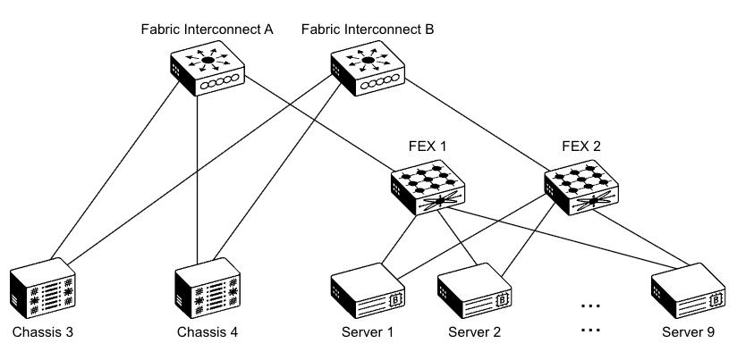

## Configure Ports on the UCS 6400 Fabric Interconnects

To allow Cisco UCS Manager to properly communicate with devices, you must assign port roles to the Cisco Fabric Interconnect ports. Various port roles are available, but most commonly you define network ports and server ports.

- Network ports are northbound uplink ports.

- Server ports are southbound ports connecting to servers.

On the Equipment tab, navigate to **Fabric Interconnects**. Click **Fabric Interconnect A** to see the graphical view of the fabric interconnect in the Work Pane.

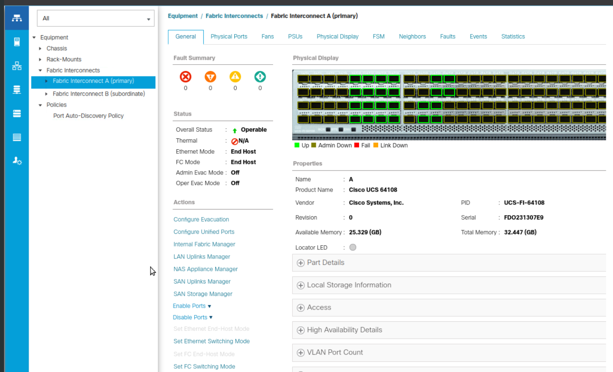

In the Navigation Pane, expand **Fabric Interconnect A** by clicking the small triangle next to it. Expand **Fixed Module** and then expand the **Ethernet Ports** and choose **Port 1**.

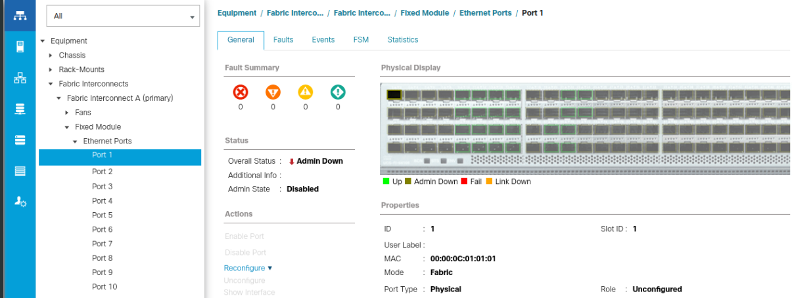

Click **Reconfigure** and select **Configure as** **Uplink Port**.

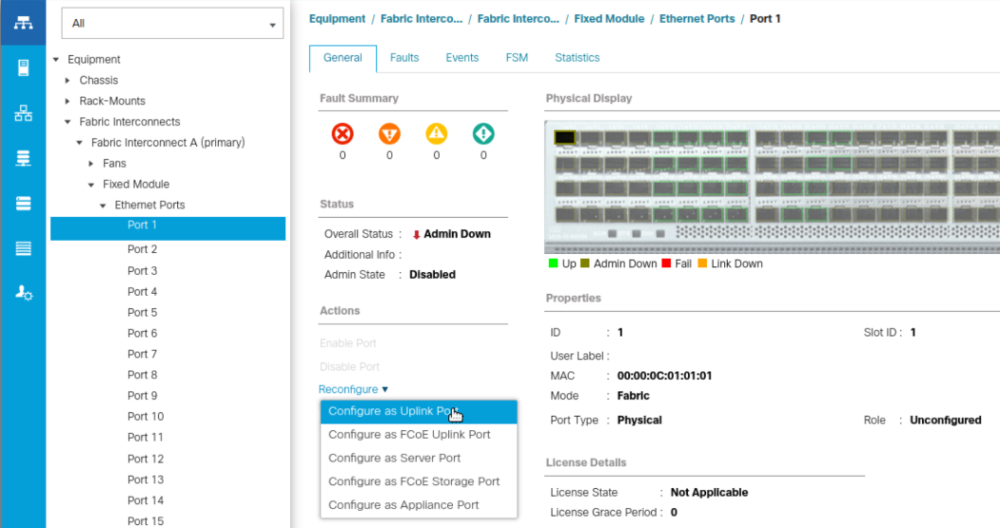

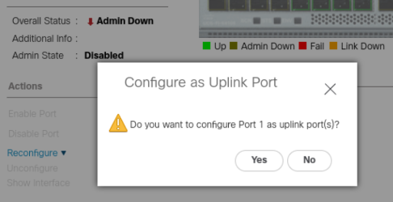

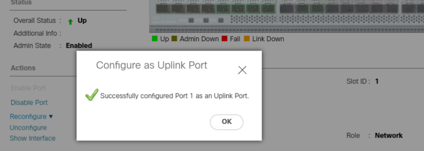

Verify that the **Port 1** status is **Up** and the **Role** is set to **Network**, which indicates that Port 1 is an uplink port.

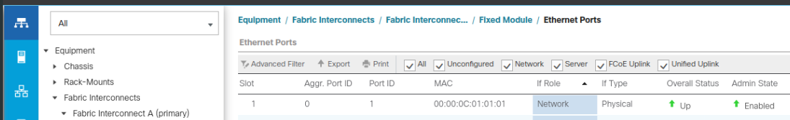

If you now right-click Port 1, the **Configure as Uplink Port** entry in the menu is grayed out because the port is already configured as an uplink port.

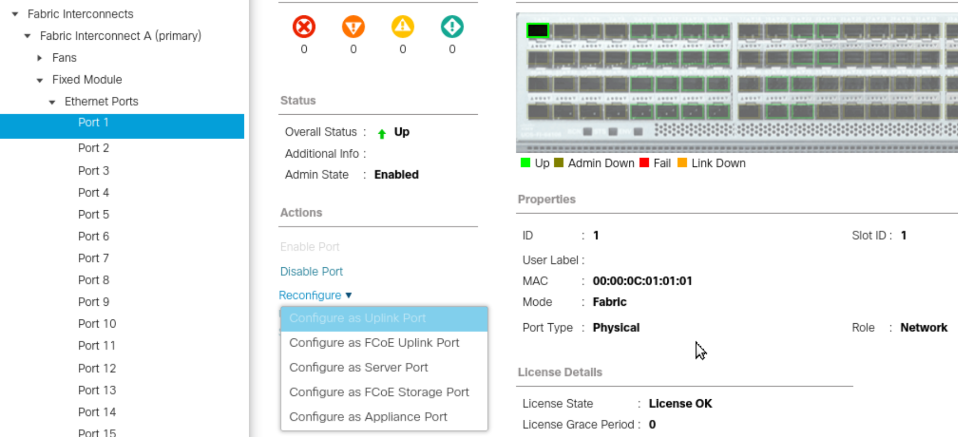

Choose **Port 2** in the navigation pane. Click **Reconfigure** and select **Configure as Server Port**.

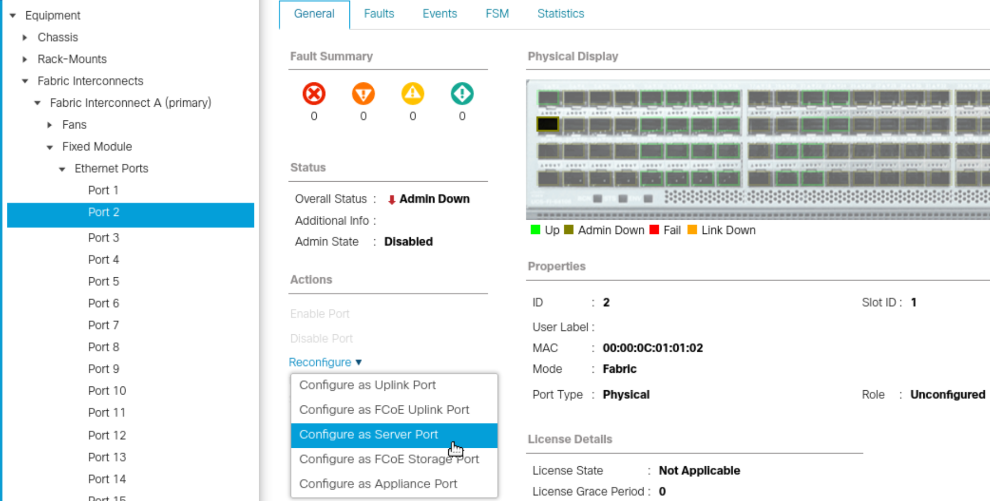

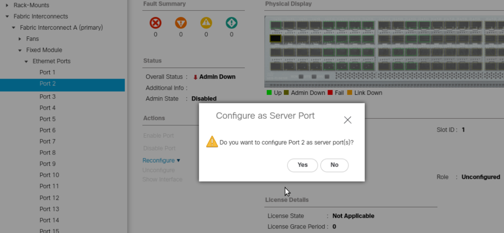

Verify that **Port 2 **status is **Up** and the **Role** is set to **Server**, which indicates that Port 2 is connected to a server.

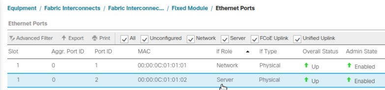

If a port is active, it will light up green in the graphical representation of the device in the **Physical Display** area. You can also click ports on the graphical representation to review their status and reconfigure them.

If the port status is not green, click **Disable Port** and then click **Enable Port**.

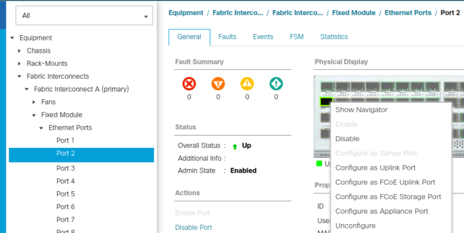

## Verify Server Discoveries and Create an Organization

Server ports connect to Cisco UCS Servers. To add a server to Cisco UCS Manager, it must be discovered. The discovery happens automatically when you assign the **Server Port** role to a fabric interconnect port that connects to a server.

In the navigation pane, choose **Equipment**. Then click the **Main Topology View** tab in the Work Pane. The **Main Topology View** graphically depicts the connectivity from the fabric interconnects to the Cisco rack server. You will see that Fabric Interconnect A is connected to two FEXs and two chassis.

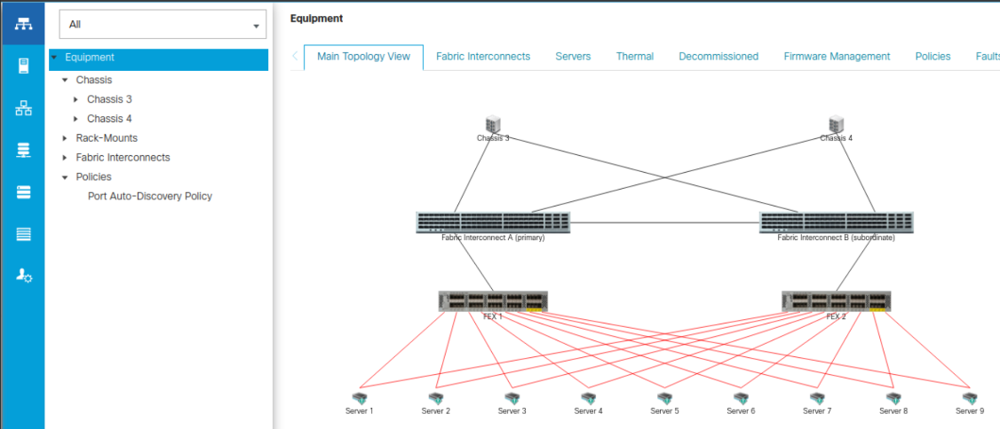

In the Navigation Pane under **Rack-Mounts**, navigate to **Enclosures > Rack Enclosure 1 > Servers > Server 1**. Click the displayed server, which an unassociated Cisco UCS C220 M4S server.

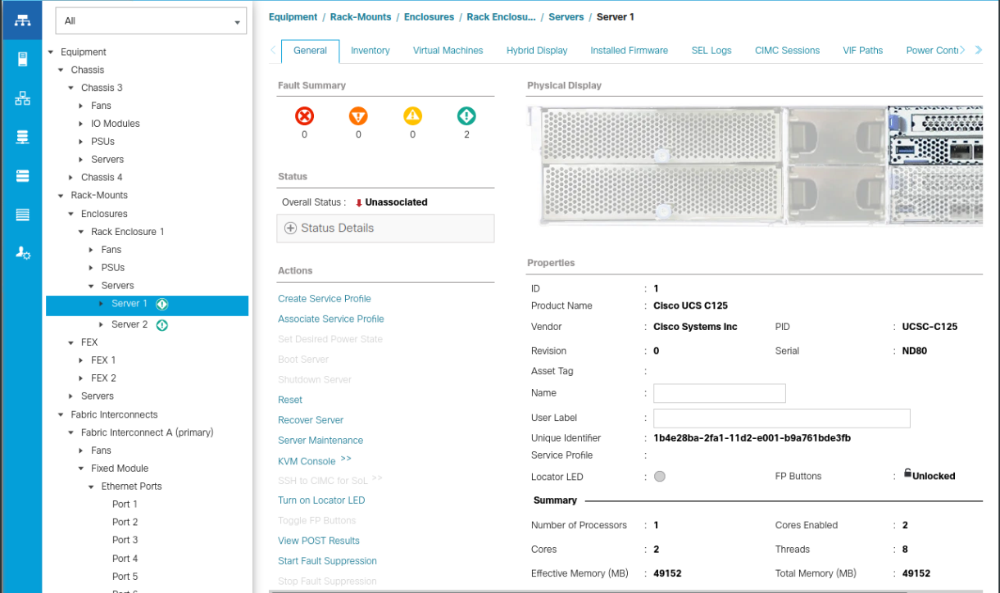

Navigate to **Equipment > Chassis > Chassis 3 > Servers**. Click **Server1**. This server is a Cisco UCS B200 M5 2 Socket Blade Server.

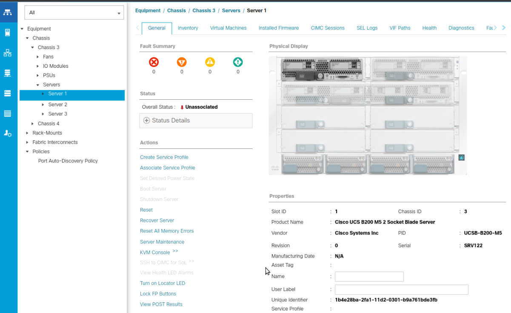

In the Side Pane, click the **Servers** tab and choose **Servers > Service Profiles**. Choose **root** and right-click the **root** entry. Choose **Create Organization** from the menu.

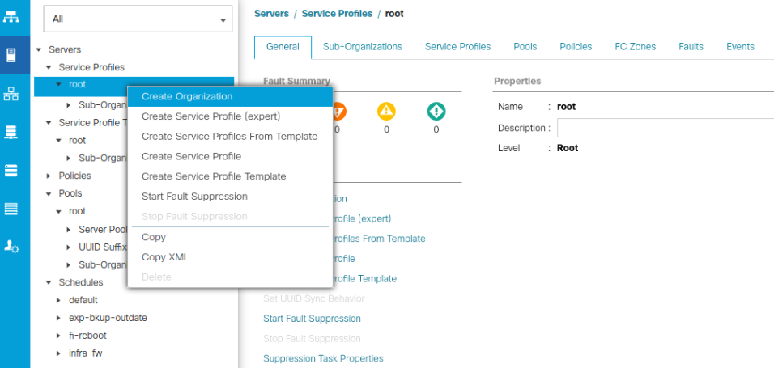

Note: The organization serves as a container for all policies, profiles, and pools that you create. It also acts as a management group for RBAC.

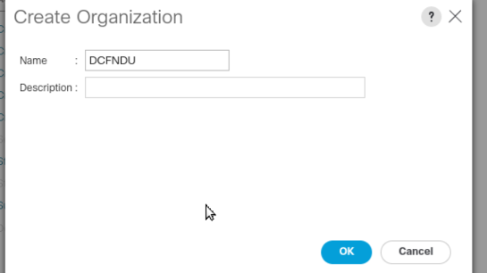

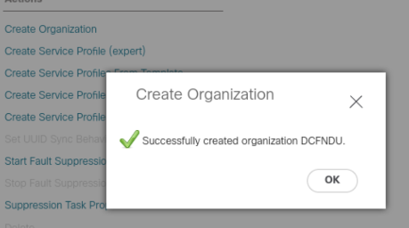

Click the **Sub-Organizations** entry in the Navigation Pane and confirm the creation of the DCFNDU organization.

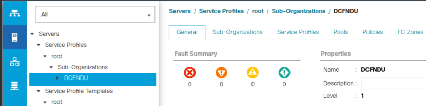

## Create a MAC Pool and VLAN

Pools determine the value ranges that a service profile can use. Each time you create a new service profile, a new value is extracted from the pool and reserved so that it cannot be used anywhere else within the Cisco UCS domain. This functionality avoids potential addressing conflicts.

In the Side Bar, click the **LAN** tab and expand **Pools > root > Sub-Organizations >** **DCFNDU**. Then right-click **MAC Pools**. Choose **Create MAC Pool** from the menu.

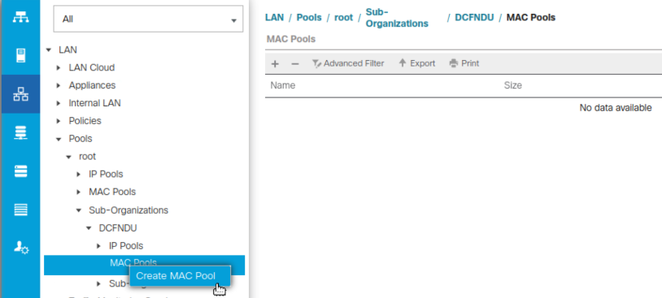

In the MAC pool creation wizard, enter name of the MAC pool the **Name** field. Name the new MAC pool **MAC_POOL**. Click **Next** to continue.

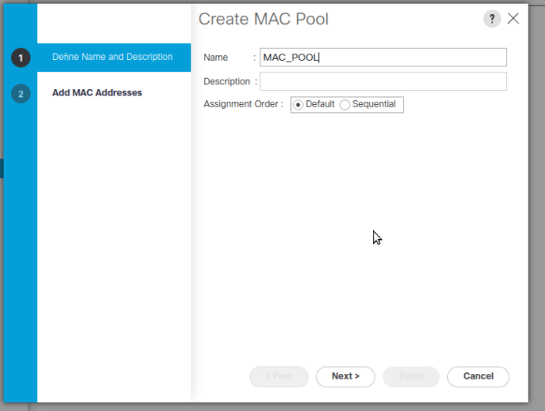

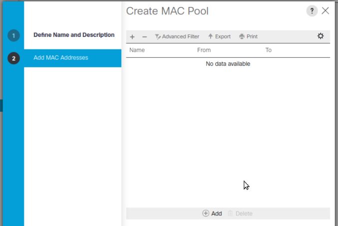

Create a new pool of eight MAC entries starting with **00:25:B5:00:80:00**.

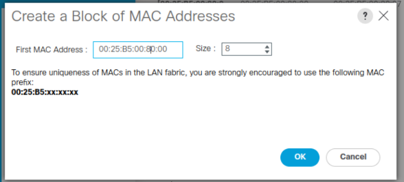

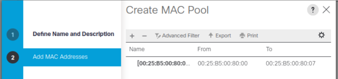

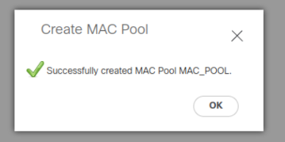

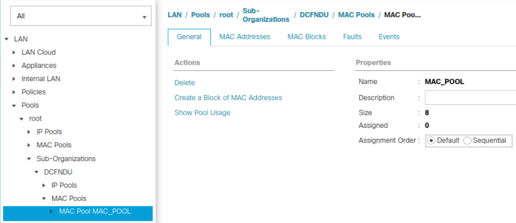

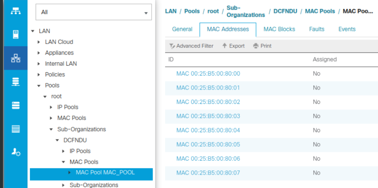

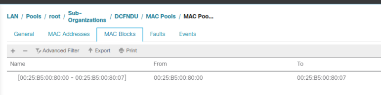

In the LAN tab, navigate to **LAN** **> LAN Cloud > Fabric A**. Right-click **VLANs **and choose **Create VLANs**.

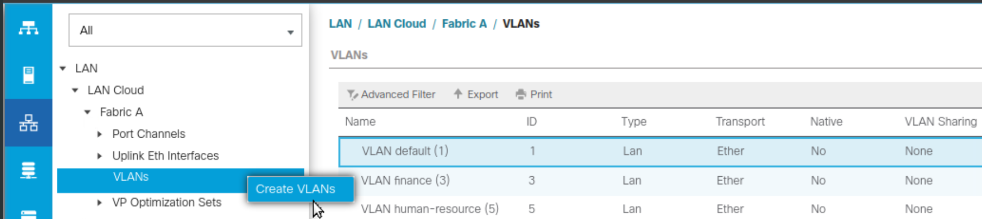

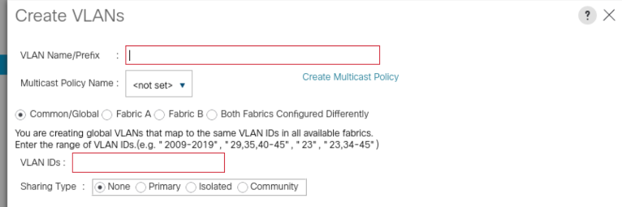

In the **VLAN Name/Prefix** field, enter **VM_Network**. In the **VLAN ID**, enter **12**. Make sure that **Common/Global** is selected. Click **OK** twice to continue.

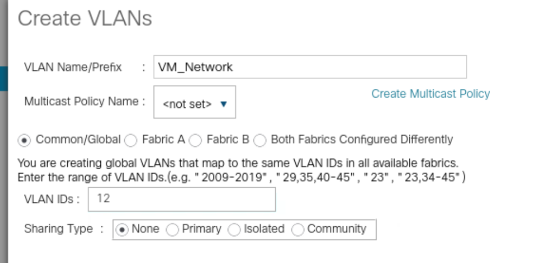

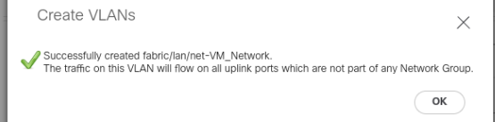

Note: Since you selected Common/Global, you can now navigate to **LAN > LAN Cloud > VLANs**. Verify that the new VLAN has been created.

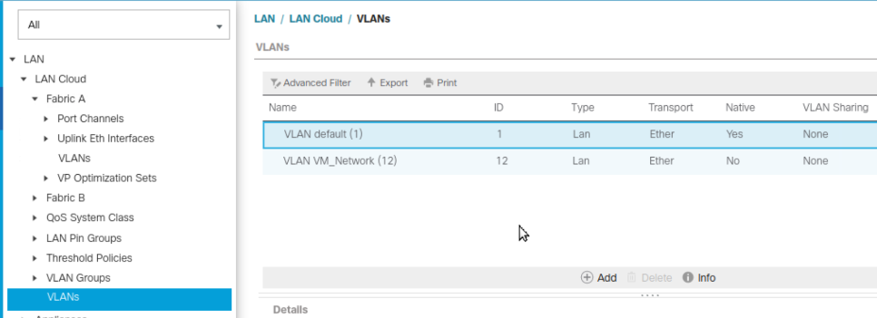

## Configure UUID Prefix and Suffix Pools

The Universal Unique Identifier (UUID) is a unique device identifier that is configured on a device. This identifier determines the device that an operating system (OS) runs upon. It is visible by the operating system that runs on the device. For example, the UUID is how an OS would know that you have moved it to a different device. The UUID comprises two parts—the prefix and the suffix. You must define both to derive a device UUID.

In the Side Bar, choose the **Servers** tab and expand **Pools > root > Sub-Organizations > DCFNDU**. Then right-click **UUID Suffix Pools**. Choose **Create UUID Suffix Pool** from the menu.

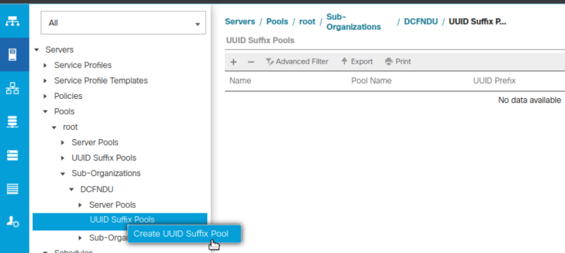

| **Parameter**  | **Value**          |
|----------------|--------------------|
| UUID pool name | UUID_POOL          |
| Prefix         | 00000000-0000-0080 |
| Suffix         | 8000-000000000001  |
| Pool size      | 8                  |

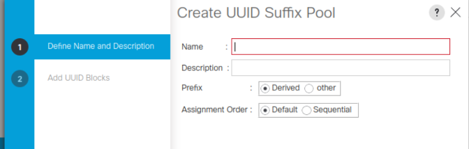

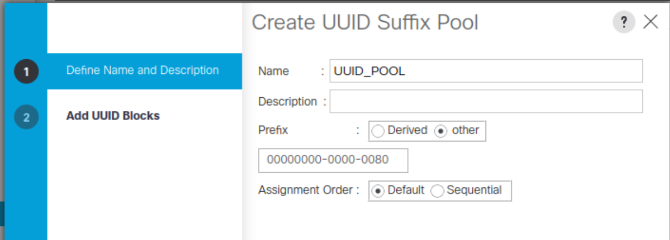

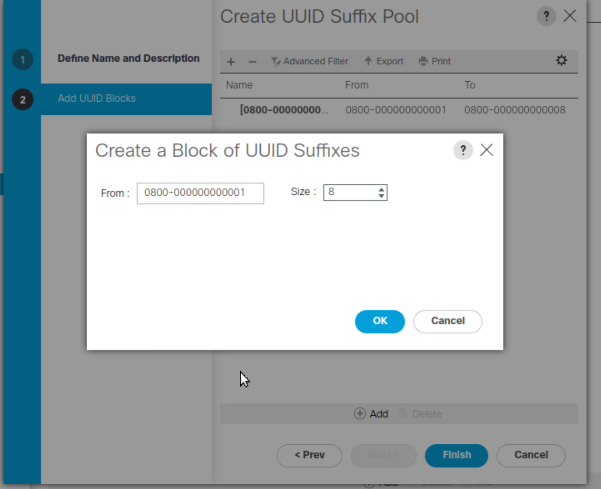

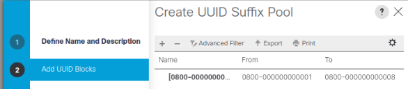

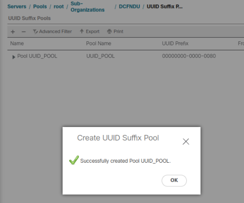

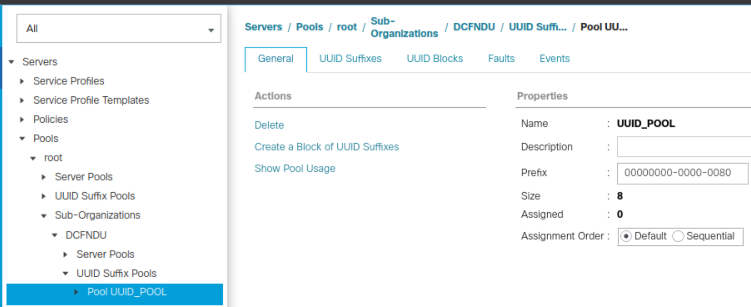

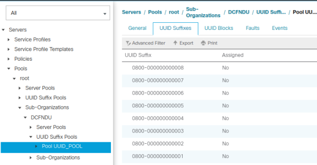

## Configure Boot Policy

Boot policy determines the boot order of storage devices available to your server. The devices will be checked for a bootable operating system one by one according to priority set in the boot policy. You can override boot order by entering the boot menu (the **F6** key) during the server boot.

In the Servers tab, expand **Policies > root > Sub-Organizations > DCFNDU**. Then right-click **Boot Policies**. Choose **Create Boot Policy** from the menu.

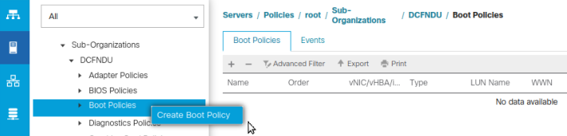

Name the new boot policy **BOOT_POLICY** and choose **CD/DVD** as the first boot device and **Local Disk** as the second.

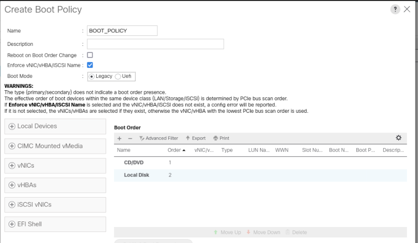

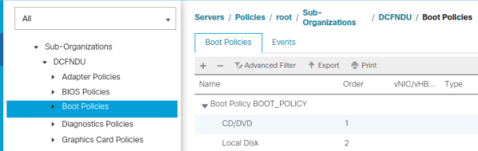

## Create an Updating Service Profile Template

An updating service profile template combines the boot policies and pools. You can use it to create new service profiles from those policies. Service profiles that you create from updating templates will stay bound to those templates and will change as the updating template changes. You can choose to unbind a service profile from its updating template at any time. This action prevents a service profile from changing when the updating template changes.

In the **Servers** tab, expand **Servers > Service Profile Templates > root > Sub-Organizations** and right-click **DCFNDU**. Choose **Create Service Profile Template** from the menu.

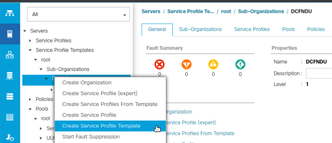

In the **Identify Service Profile Template** step, create an **Updating Template** named **SPT**. Assign it the UUID pool **UUID_POOL**.

Remember: You have created the **UUID_POOL** entry in previous steps. This action makes the template creation easier, as you simply select existing entries during the creation wizard.

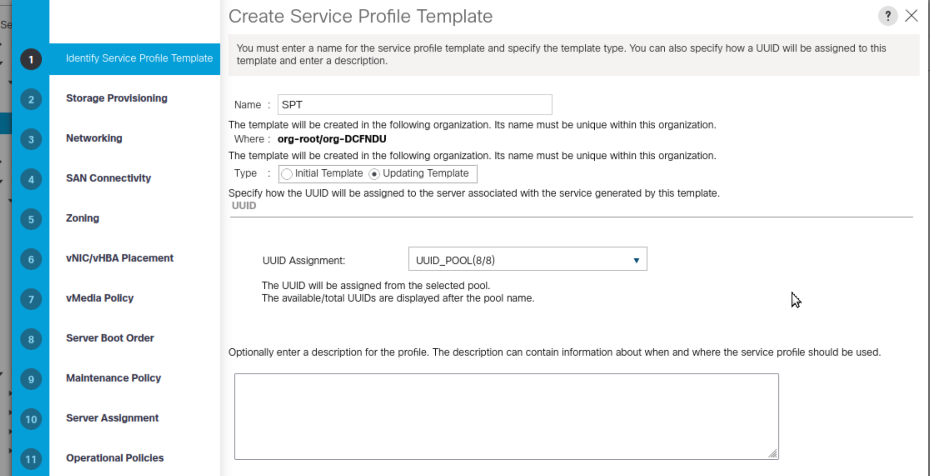

In the **Storage Provisioning** step, click the **Local Disk Configuration Policy** tab, choose the **default** policy, and click **Next** to continue.

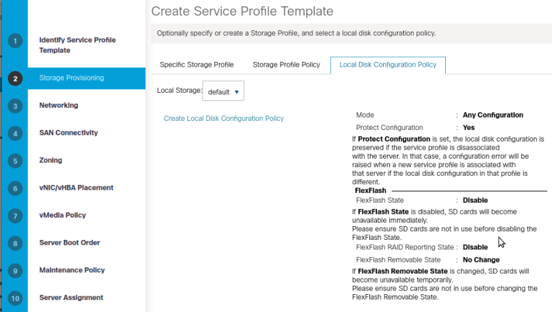

In the **Networking** step, click the **Expert** radio button and click the plus sign (+ **Add**) to create the vNIC for **Fabric A**.

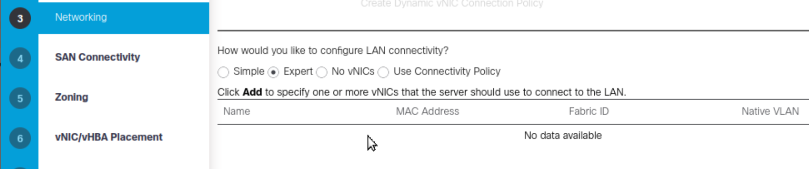

For **Fabric A**, create a vNIC named **vNIC0**. Use the MAC addresses from the MAC address pool **MAC_POOL** with allowed VLANs **1** and **12**.

In the **Create vNIC** wizard, create a new vNIC named **vNIC0** and choose **MAC_POOL** in the **MAC Address Assignment** drop-down menu. Make sure that **Fabric A** is selected. Check both VLANs (**12** and the **default**) and click **OK** to return to the **Networking** service profile creation step. Then click **Next** to continue.

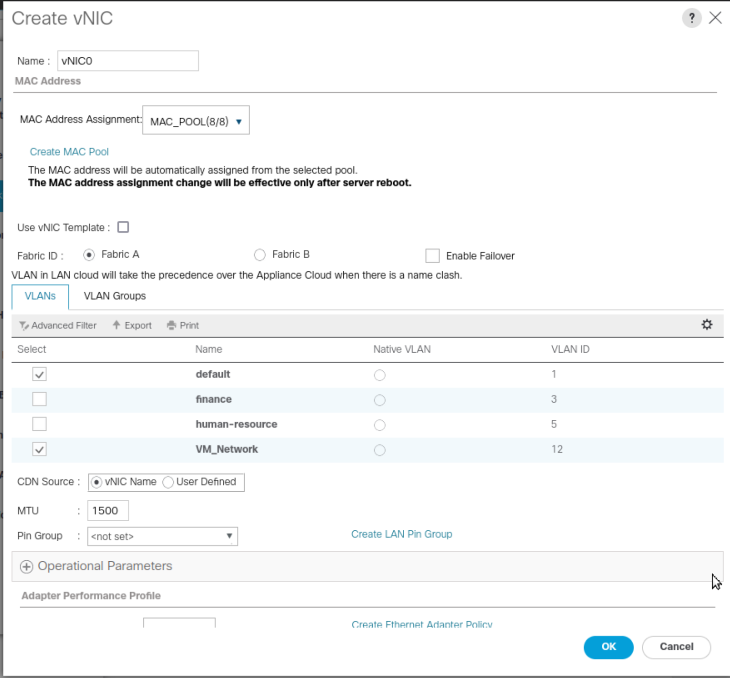

In the **SAN Connectivity** step, click **No vHBAs** and click **Next** to skip this step because you are going to access the local disk only.

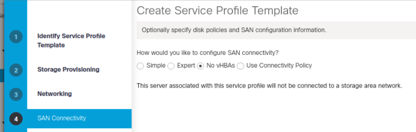

In the **Zoning** step, leave the defaults and click **Next** to continue.

In the **vNIC/vHBA Placement** step, leave the defaults so the system can perform the placement and click **Next** to continue.

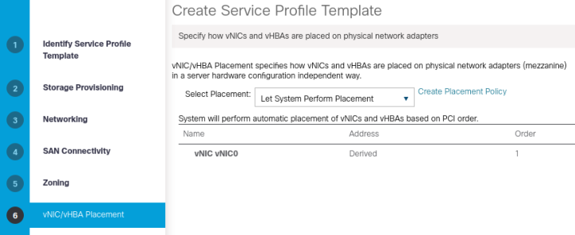

In the **vMedia Policy** step, leave the defaults and click **Next**.

In the **Server Boot Order** step, choose the boot policy **BOOT_POLICY**, which you created previously. Click **Next** to continue.

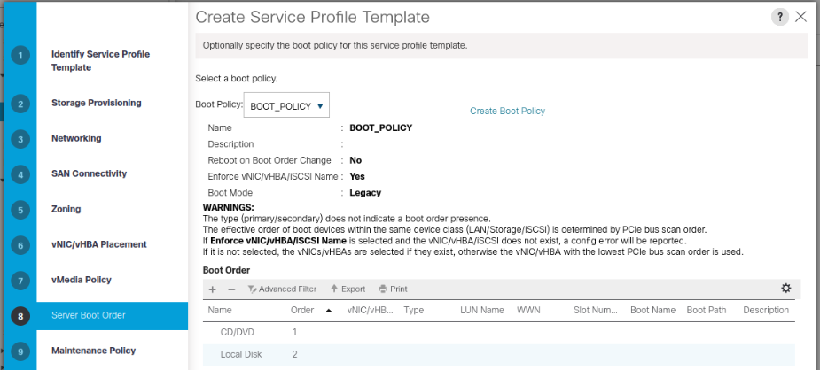

In the **Maintenance Policy** step, select the **default** maintenance policy and click **Next**.

In the **Server Assignment** step, leave the default and click **Next**.

In the **Operational Policies** step, expand the **Management IP Address** menu by clicking the plus (**+**) sign.

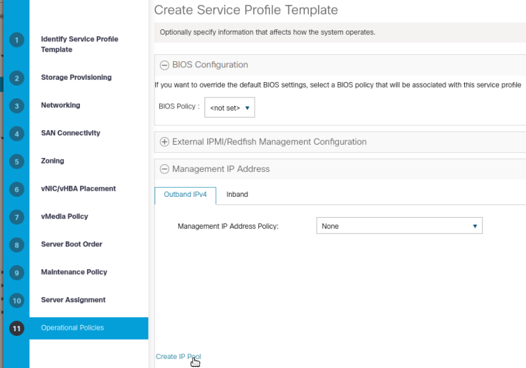

In the IP pool creation wizard, enter **MGMT_POOL** as the name of the IP pool. Click **Next** to continue.

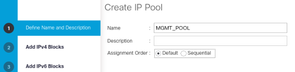

Add IPv4 pool of **5** management IP addresses starting with **10.10.1.151/24**, using default gateway **10.10.1.254** and DNS server **192.168.10.40**.

The management IP pool provides IP addresses to Cisco Integrated Management Controller (IMC) on the servers. These addresses must be on the same subnetwork as the management IP addresses of the fabric interconnects when you are using out-of-band fabric interconnect management. The OOB management is the recommended option for most situations, as it uses the dedicated IP port on fabric interconnects, providing additional redundancy.

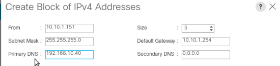

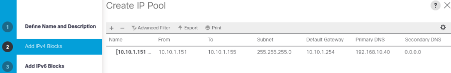

In the **Create IPv6 Blocks** step, leave the defaults and click **Finish** and then click **OK** to finish creating the management pool.

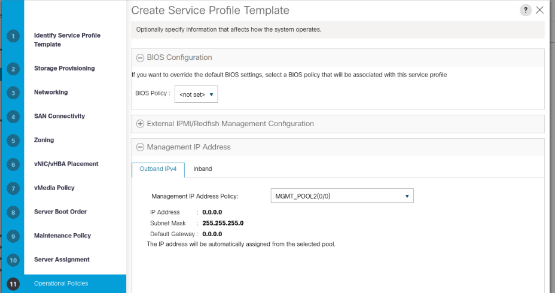

Template has been created successfully

## Create a Service Profile from the Updating Template and Assign a Server to the New Profile

You cannot assign service profile templates directly to servers. You must first create a service profile. When you create a service profile, the pools assigned to that service profile template assign values upon service profile creation. The values do not return to the pool until you delete the service profile.

Right-click **Service Template SPT** under the **DCFNDU** organization and choose **Create Service Profiles From Template**.

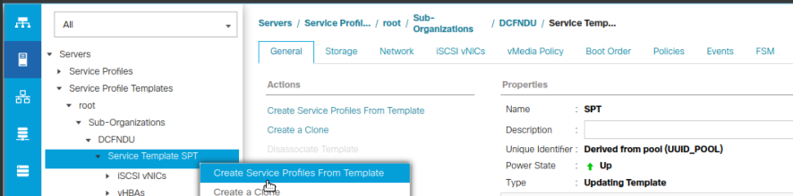

Create two service profiles using the prefix **SP** with a suffix starting with **1**.

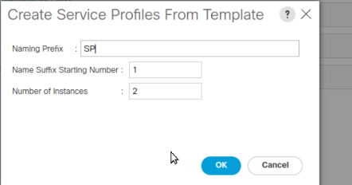

To access the new service profile, choose **Servers > Service Profiles > root > Sub-Organizations > DCFNDU > SP1**.

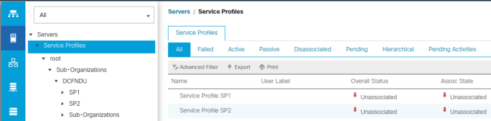

The warning on the service profile appears because you created this service profile from an updating template. You cannot modify this service profile directly unless it is unbound.

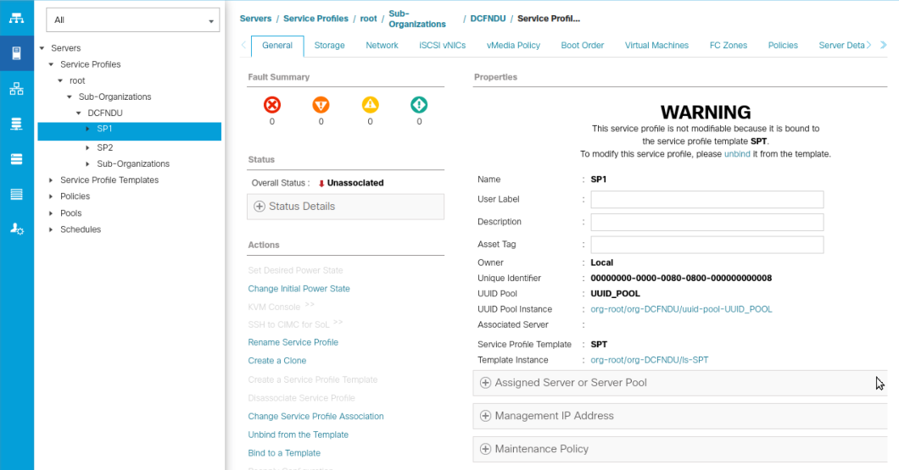

In the Equipment tab, choose **Chassis > Chassis 3 > Servers > Server1**. Right-click the displayed server **Server 1** and choose **Associate Service Profile** from the menu.

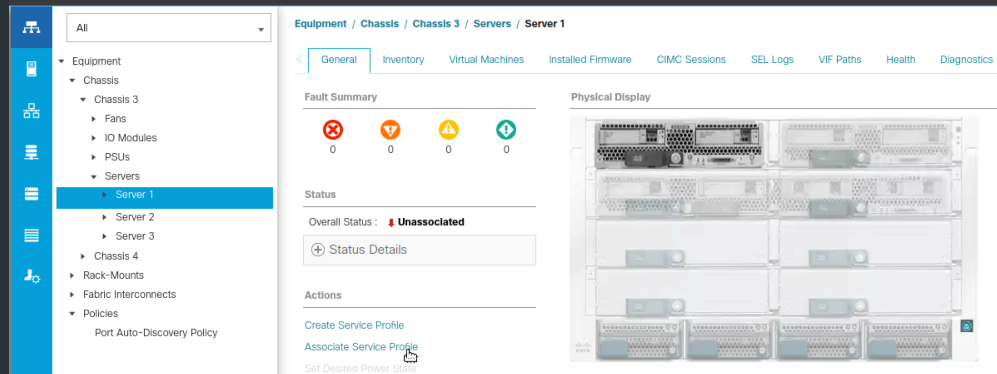

On the **Associate Service Profile** screen, click **Service Profile SP1** and click **OK**.

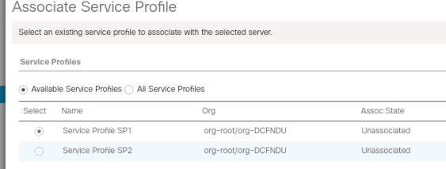

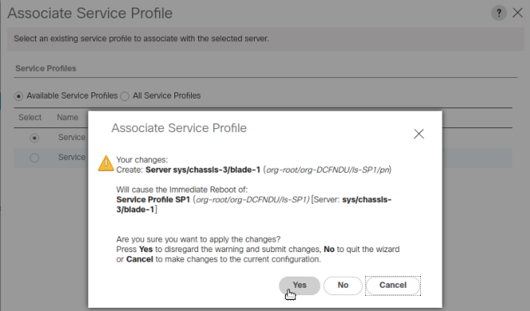

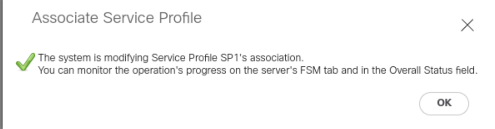

Observe the process of service profile association in the **Status Details** in the **General** tab of the Work Pane. Open the **Status Details** to see more details of the association. It should take up to 15 minutes to complete.

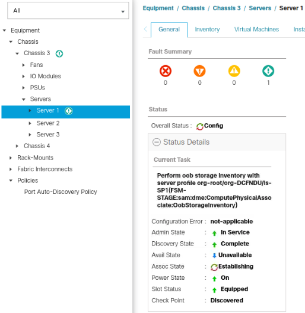

You can also observe the process of service profile association in the **FSM** tab of the service profile or the **FSM** tab of the rack-mount server. You may need to click the arrow in the top right to scroll to the right and find the **FSM** tab.

An associated service profile is the required starting point to install an operating system on the server.

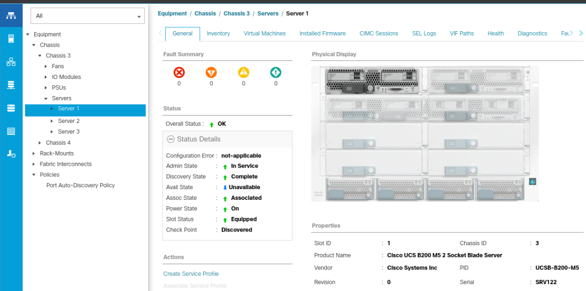

For more labs visit my GitHub repo: [https://github.com/TitusM/Cisco-Data-Center](https://github.com/TitusM/Cisco-Data-Center)

## References

**Cisco U courses:**

1. Understanding Cisco Network Automation Essentials | DEVNAE
