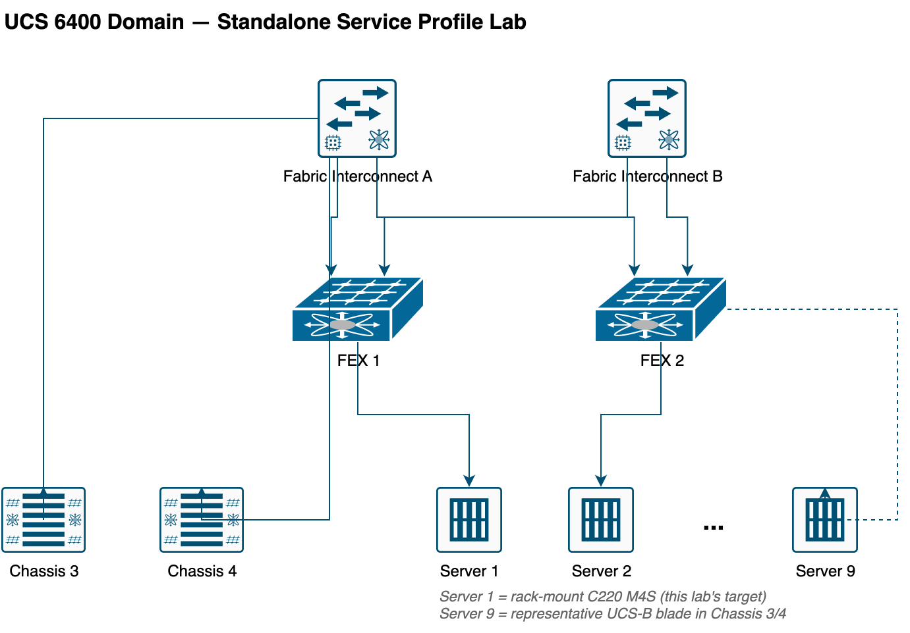

# Standalone Lab — Configure a Cisco UCS Service Profile (4.1.a)


*UCS 6400 domain: Fabric Interconnect A/B, FEX 1/2, Chassis 3/4, and rack/blade servers*

!!! note "How this lab relates to the rest of UCS & SAN"
    This is a **self-contained walkthrough**, not part of the Nexus DC-1 pod sequence above (Modules 0–13). It runs against its own UCS 6400 domain — a rack-mount C220 and a UCS-B chassis, no SAN/zoning involved — and builds one org, one pool set, and one service profile template from a blank UCSM. Use it as a shorter first rep on service profile mechanics before tackling Module 1's more elaborate dual-fabric templates, or any time you need to practice the whole pools → policies → template → profile → association flow in isolation.

**Objective:** starting from a UCSM domain with no configuration beyond factory defaults, take a rack-mount server from undiscovered hardware to an associated, LAN-connected service profile — covering port roles, organizations, identity pools, boot policy, and updating service profile templates end to end.

## 14.1 Task 1 — Configure Fabric Interconnect Ports

**Objective:** assign a role to every physical FI port before anything else can happen — an unconfigured port carries no traffic and connects to nothing UCSM recognizes.

Cisco UCS ports ship with no role at all. The two roles this lab needs:

- **Network (uplink) port** — northbound, toward the LAN.
- **Server port** — southbound, toward a chassis IOM or a rack-mount server's CIMC.

On **Equipment > Fabric Interconnects > Fabric Interconnect A > Fixed Module > Ethernet Ports**:

1. Select **Port 1**, right-click **Reconfigure > Configure as Uplink Port**. Confirm the change.
2. Select **Port 2**, right-click **Reconfigure > Configure as Server Port**. Confirm the change.
3. If a port doesn't light up green in the Physical Display view once configured, **Disable Port** then **Enable Port** — a fresh admin-down/up cycle clears most link issues that show up right after a role change.

**Verify:** Port 1 shows **Status = Up**, **Role = Network**; Port 2 shows **Status = Up**, **Role = Server**. Right-clicking Port 1 again should show **Configure as Uplink Port** greyed out — confirmation the role already applied.

!!! question "Check yourself"
    Why does a chassis or rack server stay completely undiscovered by UCSM until its FI-facing port is explicitly set to Server — what's UCSM actually waiting on while the port sits at its default, roleless state?

## 14.2 Task 2 — Verify Server Discovery and Create an Organization

**Objective:** confirm the Server Port role from Task 1 actually triggered discovery, then create the sub-organization every pool, policy, and profile in this lab will live under.

Assigning the Server Port role starts discovery automatically — there's no separate "discover now" action to trigger.

1. **Equipment > Main Topology View** — confirm Fabric Interconnect A shows connections to the FEXs and chassis in your domain.
2. **Equipment > Rack-Mounts > Enclosures > Rack Enclosure 1 > Servers > Server 1** — this is the target rack-mount server for this lab (a C220 M4S in the reference topology). It should show as discovered and unassociated.
3. **Equipment > Chassis > Chassis 3 > Servers > Server 1** — the corresponding blade-side inventory, for comparison; this lab's profile targets the rack-mount server above, not this blade.

Create the organization:

4. **Servers > Service Profiles > root**, right-click **root > Create Organization**.
5. Name it **DCFNDU** and click **OK**.

**Verify:** **Servers > Service Profiles > root > Sub-Organizations** lists **DCFNDU**. Every pool, policy, and profile from here on gets created inside it, not under `root` directly — keeps this lab's objects cleanly separated from anything else in the domain.

!!! note
    An organization is a container for pools, policies, and profiles — and doubles as an RBAC scope. Nothing about creating it discovers hardware or changes port roles; it's purely an administrative grouping, independent of Task 1.

## 14.3 Task 3 — Create a MAC Pool and VLAN

**Objective:** stock the two building blocks this lab's vNIC needs — a MAC address source and a VLAN to trunk — before the service profile template tries to reference either.

Pools hand out values on demand and reserve them so no two profiles collide. Under **LAN > Pools > root > Sub-Organizations > DCFNDU**:

1. Right-click **MAC Pools > Create MAC Pool**.
2. Name it **MAC_POOL**, click **Next**.
3. Add a block of **8** addresses starting at **00:25:B5:00:80:00**, click **Finish**.

Then, under **LAN > LAN Cloud > Fabric A**:

4. Right-click **VLANs > Create VLANs**.
5. **VLAN Name/Prefix**: `VM_Network`. **VLAN ID**: `12`. Scope: **Common/Global** (visible to both fabrics, not pinned to Fabric A only). Click **OK** twice.

**Verify:** **LAN > Pools > root > Sub-Organizations > DCFNDU > MAC Pools** shows `MAC_POOL` with 8 free addresses. **LAN > LAN Cloud > VLANs** shows VLAN 12 (`VM_Network`) alongside the default VLAN 1 — Common/Global scope is what makes it appear at this domain-wide level rather than nested under Fabric A only.

!!! question "Check yourself"
    If VLAN 12 had been created under Fabric A specifically instead of Common/Global scope, would it still show up at **LAN > LAN Cloud > VLANs**, and would Fabric B's uplinks be able to carry it?

## 14.4 Task 4 — Configure UUID Suffix and Prefix Pools

**Objective:** stock the identity pool the service profile template's Identity step needs — without it, the template creation wizard has no UUID source to select.

A UUID has two parts — **prefix** and **suffix** — and a service profile needs both to derive a complete device identifier the OS sees as unique, including across a hardware move.

Under **Servers > Pools > root > Sub-Organizations > DCFNDU**, right-click **UUID Suffix Pools > Create UUID Suffix Pool**:

| Parameter | Value |
|---|---|
| UUID pool name | `UUID_POOL` |
| Prefix | `00000000-0000-0080` |
| Suffix (From) | `8000-000000000001` |
| Size | `8` |

**Verify:** **Servers > Pools > root > Sub-Organizations > DCFNDU > UUID Suffix Pools > UUID_POOL** shows 8 free UUID suffixes under the configured prefix.

## 14.5 Task 5 — Configure Boot Policy

**Objective:** define what the associated server tries to boot from — this lab boots from local disk, so the policy only needs two simple entries, no SAN boot targets.

Under **Servers > Policies > root > Sub-Organizations > DCFNDU**, right-click **Boot Policies > Create Boot Policy**:

1. Name it **BOOT_POLICY**.
2. Add **CD/DVD** as the first boot device, **Local Disk** as the second.
3. Click **OK**.

**Verify:** **Servers > Policies > root > Sub-Organizations > DCFNDU > Boot Policies > BOOT_POLICY** shows CD/DVD then Local Disk, in that order.

!!! note
    You can override this order at boot time by entering the boot menu (**F6**) during POST — the policy sets the default UCSM hands the server, not a hard lock.

## 14.6 Task 6 — Create an Updating Service Profile Template

**Objective:** assemble every pool and policy built so far into one reusable, updating template — the object service profiles in Task 7 actually get created from.

An **updating** template keeps every service profile derived from it permanently bound: change a pool or policy on the template later, and every bound profile picks it up automatically, without being re-created. (This is the same binding behavior covered in [Module 1's Service Profile Template section](02-compute-policies.md#26-task-15-service-profile-template) — the mechanics don't change just because this lab's scenario is simpler.)

Under **Servers > Service Profile Templates > root > Sub-Organizations**, right-click **DCFNDU > Create Service Profile Template**, then work through the wizard:

1. **Identify Service Profile Template** — Name: `SPT`. Type: **Updating Template**. UUID Assignment: `UUID_POOL`.
2. **Storage Provisioning** — Local Disk Configuration Policy: **default**. Click **Next**.
3. **Networking** — select **Expert**, click **+ Add** to create a vNIC:
    - Name: `vNIC0`
    - MAC Address Assignment: `MAC_POOL`
    - Fabric: **Fabric A**
    - VLANs: check both **12** (`VM_Network`) and the **default** VLAN
    - Click **OK**, then **Next**.
4. **SAN Connectivity** — select **No vHBAs**, click **Next**. This lab only needs the local disk boot path, so there's nothing for a vHBA to reach.
5. **Zoning** — leave defaults, click **Next**.
6. **vNIC/vHBA Placement** — leave defaults (let the system place it), click **Next**.
7. **vMedia Policy** — leave defaults, click **Next**.
8. **Server Boot Order** — Boot Policy: `BOOT_POLICY`. Click **Next**.
9. **Maintenance Policy** — select **default**. Click **Next**.
10. **Server Assignment** — leave defaults. Click **Next**.
11. **Operational Policies** — expand **Management IP Address**, click **+** to create a management IP pool:
    - Name: `MGMT_POOL`, click **Next**.
    - Add an IPv4 block: **5** addresses starting at **10.10.1.151/24**, gateway **10.10.1.254**, primary DNS **192.168.10.40**.
    - Leave the IPv6 block step at defaults, click **Finish**, then **OK**.
12. Click **Finish** to complete the template.

**Verify:** **Servers > Service Profile Templates > root > Sub-Organizations > DCFNDU** shows `SPT` with Type = Updating Template.

!!! note "Out-of-band management, and why this pool matters before you ever open a KVM console"
    `MGMT_POOL` supplies each associated server's CIMC with an out-of-band management IP — reachable via the FI's dedicated management port, independent of the vNIC/VLAN traffic this template also builds. It must share a subnet with the fabric interconnects' own management IPs. Nothing in this task assigns an address to a specific server yet; that only happens once Task 7 associates a profile derived from this template.

!!! question "Check yourself"
    If `SPT` is edited after Task 7's profiles already exist and are associated — say, adding a second VLAN to `vNIC0` — what has to happen for that change to reach an already-associated server, and does the server need to be re-associated by hand?

## 14.7 Task 7 — Create Service Profiles from the Template and Associate a Server

**Objective:** instantiate concrete, per-server profiles from `SPT`, then associate one to actual hardware — the step that finally applies the built identity to a physical server.

A service profile **template** can't be assigned to a server directly; only a service profile created from it can be.

1. Right-click **Service Template SPT > Create Service Profiles From Template**.
2. Naming Prefix: `SP`. Name Suffix Starting Number: `1`. Number of Instances: `2`. Click **OK**.

This creates `SP1` and `SP2` under **Servers > Service Profiles > root > Sub-Organizations > DCFNDU**. Opening either one shows a warning that it can't be edited directly — expected, since both are still bound to the updating template `SPT`.

Associate `SP1` to the rack-mount server from Task 2:

3. **Equipment > Rack-Mounts > Enclosures > Rack Enclosure 1 > Servers > Server 1** (or **Equipment > Chassis > Chassis 3 > Servers > Server 1** if targeting the blade instead), right-click the server, choose **Associate Service Profile**.
4. Select **SP1**, click **OK**.

**Verify:**

??? "Commands"
    ```text
    scope org DCFNDU
    scope service-profile SP1
    show service-profile status
    show config
    ```

In the GUI: the service profile's **General** tab shows **Status Details** progressing through association (allow up to ~15 minutes); the **FSM** tab on either the service profile or the server shows the same process step by step. **Assoc State** should reach `associated` with **Overall Status = ok**.

!!! note
    An associated service profile is the required starting point for installing an OS on the server — association applies identity, pools, and policies to the hardware, but installing an actual OS is a separate step this lab doesn't cover.

!!! question "Check yourself"
    `SP1` and `SP2` were both created from the same updating template and both draw from the same 8-address `MAC_POOL` and 8-entry `UUID_POOL`. If you created a third profile, `SP3`, from `SPT` today, would it get the same MAC/UUID values as `SP1` or `SP2` — and what would happen if you deleted `SP2` first and then created `SP3`?

---

For more labs, visit the [Cisco-Data-Center repo](https://github.com/TitusM/Cisco-Data-Center).
