# Configure Basic Identity Pools

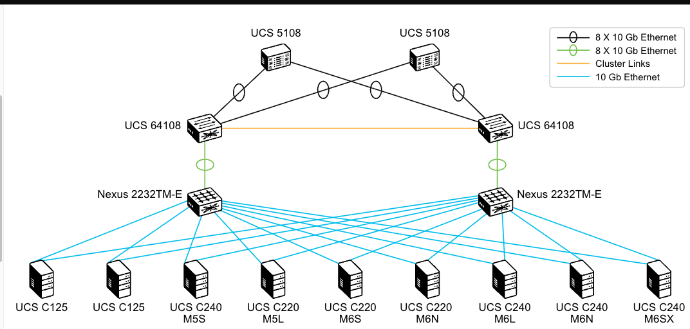

For more labs visit my GitHub repo: [https://github.com/TitusM/Cisco-Data-Center](https://github.com/TitusM/Cisco-Data-Center)

!!! note
    This lab was conducted in a controlled environment. Any configurations in a production network should be implemented during a designated maintenance window. Additionally, always refer to official documentation relevant to your specific hardware and software.

## Introduction

This activity provides the experience of creating identity pools, one of the foundational skills and concepts required to configure service profiles and service profile templates. Identity pools include UUID values pools, MAC addresses, WWN addresses, and IP addresses for in-band and out-of-band management.

There are also other types of pools that are used in Cisco UCS Manager—resource pools. **Unlike identity pools, resource pools contain resources, such as servers.** Server pools allow you to automatically place servers in pools based on their characteristics so that the Cisco UCS Manager can automatically pick them up when applying a service profile.

By using both types of pools, you only need to perform the provisioning procedure once to mass-provision many servers.

## Configure a UUID Pool

Navigate to **UUID Suffix Pools**.

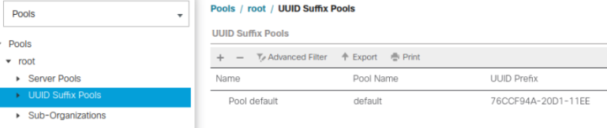

Create a new UUID pool with the **UUID-POOL** name the **00000000-0000-0001** prefix, and size **16**.

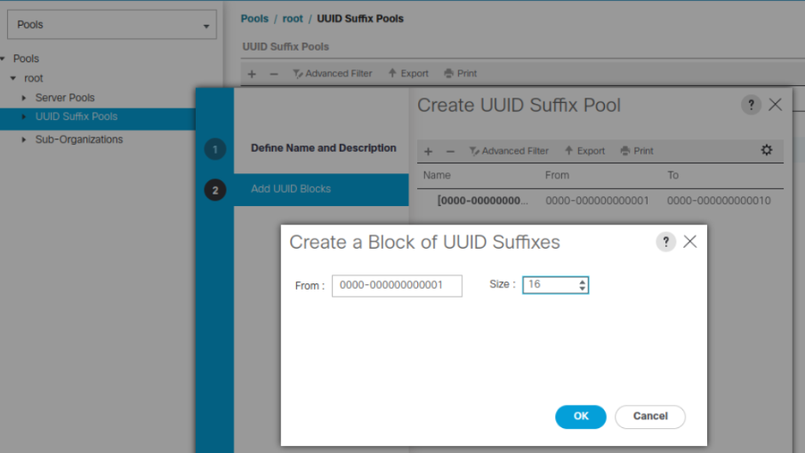

## Configure a MAC Pool

You will configure MAC pools that you will use when creating service profiles. MAC pools contain MAC addresses that are assigned to server network adapters—vNICs. For every vNIC that you create, the system will use one MAC address.

You can also use non-pooled MAC addresses. When creating a service profile, you can do that by entering the MAC address directly at the vNIC definition stage. Using MAC addresses from a pool is much more flexible, and it allows you to create service profiles from templates. It also enables automatic provisioning of servers.

!!! note
    It is not recommended to use non-pooled MAC addresses because their assignment and usage must be tracked manually.

Navigate to **MAC Pools**.

Create a new MAC Pool named MAC-POOL with 16 elements.

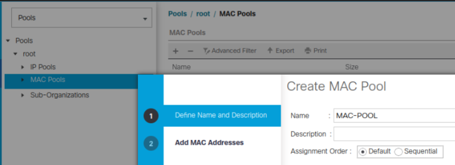

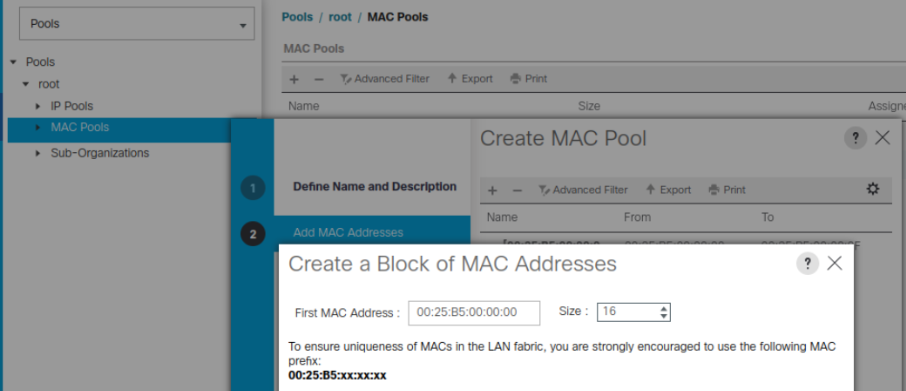

## Configure a Server Pool

Server pools gather multiple physical servers into a set. You can group multiple servers into a pool, which is especially convenient if you have two or three types of servers for different usage.

You will create a server pool that the server pool qualification policy will use. When you insert a server into the chassis, Cisco UCS Manager will discover the server. Based on the qualification criteria, Cisco UCS Manager will place the server in the appropriate pool.

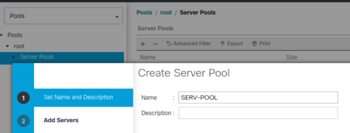

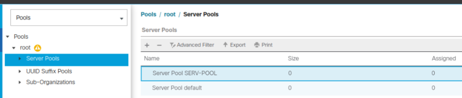

## Configure Automatic Population of Server Pools

You will configure a server qualification policy to enroll matched servers using qualification rules in a server pool.

!!! note
    You can use server pools with or without server qualification policies. If you plan to add servers to the pool manually, you do not need a server qualification policy to do that automatically for you. However, the manual approach is less scalable, and for larger deployments, you may want to use an automatic server pool placement that will speed up server provisioning if you do it in bulk.

Navigate to **Server Pool Policy Qualifications**.

Create a new server pool qualification policy **SERV-QUALIFY** with Rack Qualification (first Slot ID 1, number of Slots 4).

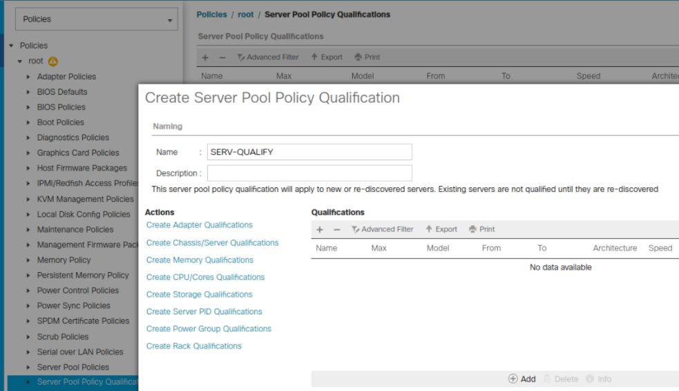

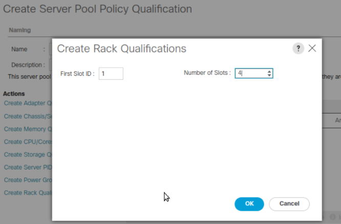

Create a server pool policy named **SERV-POOL-POLICY** and use the newly created Qualification **SERV-QUALIFY**.

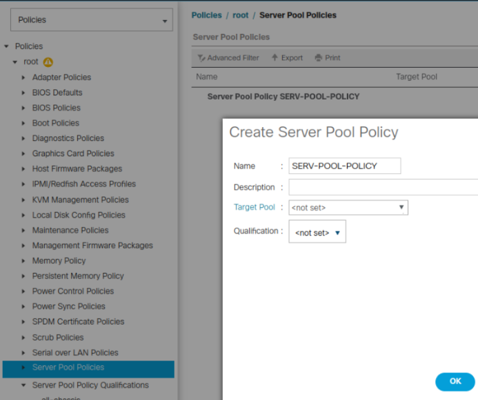

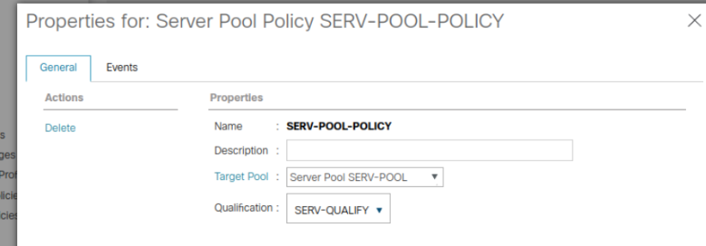

Verify that there are four servers as members of your Server Pool named SERV-POOL.

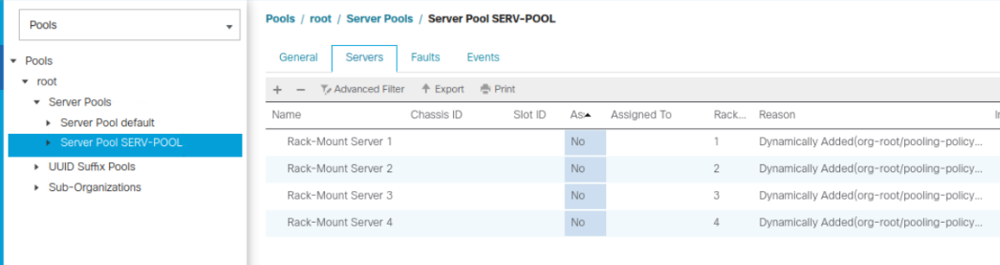

For more labs visit my GitHub repo: [https://github.com/TitusM/Cisco-Data-Center](https://github.com/TitusM/Cisco-Data-Center)

## References

**Cisco U courses:**

1. Understanding Cisco Data Center Foundations | DCFNDU
2. Implementing and Operating Cisco Data Center Core Technologies | DCCOR
3. Troubleshooting Cisco Data Center Infrastructure | DCIT
