# Building a VXLAN EVPN Fabric with Cisco NDFC

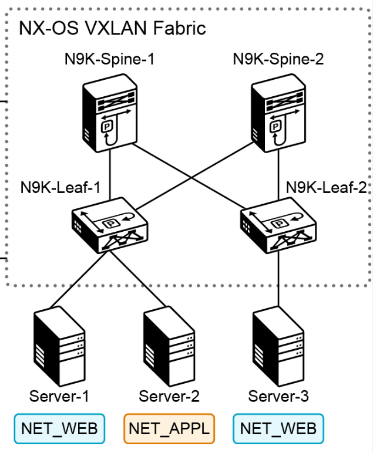

For more labs visit my GitHub repo: [https://github.com/TitusM/Cisco-Data-Center](https://github.com/TitusM/Cisco-Data-Center)

!!! note
    This lab was conducted in a controlled environment. Any configurations in a production network should be implemented during a designated maintenance window. Additionally, always refer to official Cisco documentation relevant to your specific hardware and software.

## Introduction

This lab demonstrates the fundamentals of creating and configuring a VXLAN EVPN fabric using Cisco NDFC. It begins with fabric creation, followed by switch discovery and onboarding, assignment of spine and leaf roles, and deployment of the initial fabric configuration. Once the fabric nodes are onboarded, the lab demonstrates how to create Virtual Routing and Forwarding (VRF) instances and overlay networks. Finally, it covers interface configuration and the attachment of interfaces to overlay networks to establish end-to-end connectivity between two PCs connected to different leaf switches.

## Lab Topology

The lab topology consists of a simple two-spine, two-leaf VXLAN EVPN fabric managed by Cisco NDFC. NDFC provides centralized fabric management and configuration, while each leaf switch connects to both spine switches to form the underlay fabric. **Server-1 and Server-2** connect to n9k-leaf-01 on the NET_WEB and NET_APP networks respectively, and **Server-3** connects to n9k-leaf-02 on the NET_WEB network. The lab uses this topology to demonstrate fabric onboarding, overlay network creation, interface configuration, and end-to-end connectivity across the VXLAN fabric.

## Create a Fabric

### Login Nexus Dashboard

Click **Manage**, then click **Fabrics** in the navigation panel that opens.

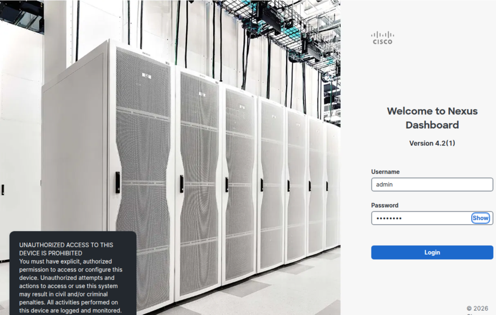

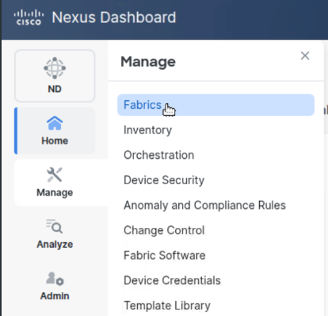

On the **Fabrics** page, click the **Actions** menu in the top right and choose **Create fabric**.

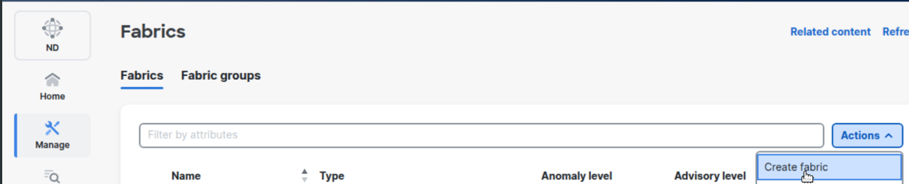

Click the **Create new LAN fabric** tile, then click **Next**.

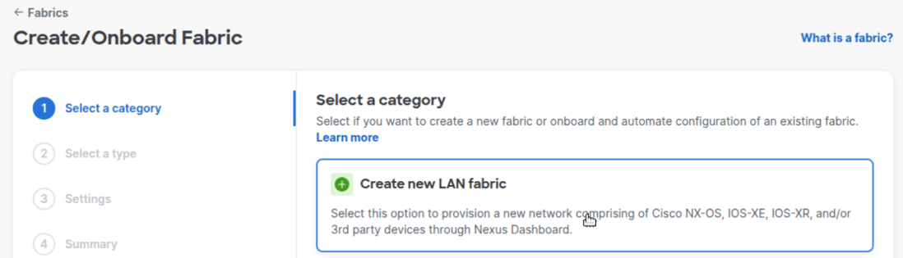

Click the **VXLAN** tile, leave **Data Center VXLAN EVPN** chosen as the fabric template, then click **Next**.

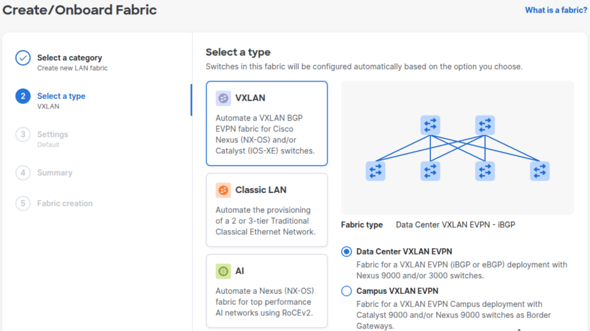

On the Settings page, change **Configuration mode** from Default to **Advanced**. Set the fabric **Name** to **OR-TAMBO** and **BGP ASN** to **65001**.

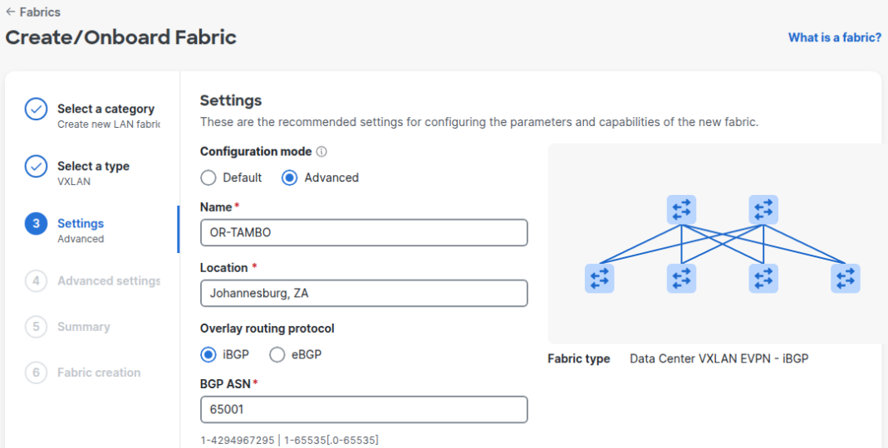

Click **Next.** Review the **General Parameters**. In this lab, all entries are left as defaults. Click the **Advanced** tab.

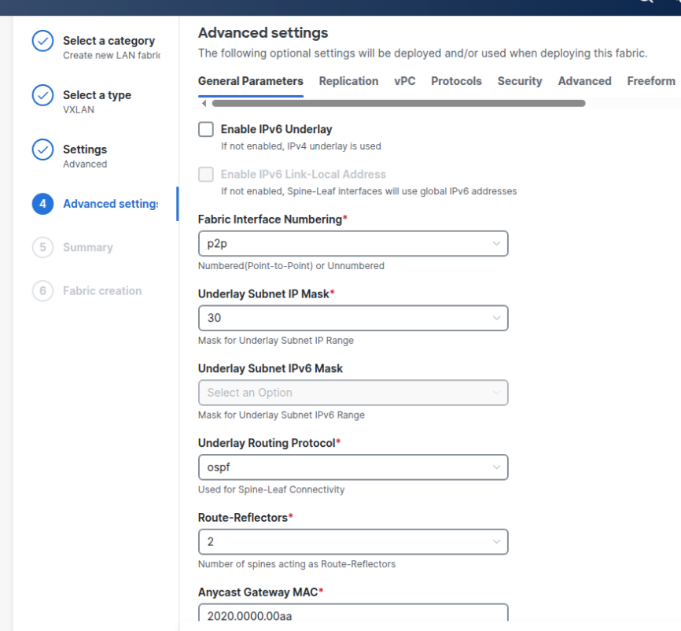

Scroll down to **Add Switches without Reload**, open the drop-down, and choose **enable**.

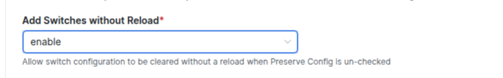

!!! note
    By default, Cisco Nexus Dashboard reloads a switch when it imports it with Preserve Config unchecked, to guarantee a clean baseline. Enabling Add Switches without Reload clears the running configuration and applies the calculated configuration without rebooting the switch.

Leave everything else as defaults and click **Next**. **Submit.**

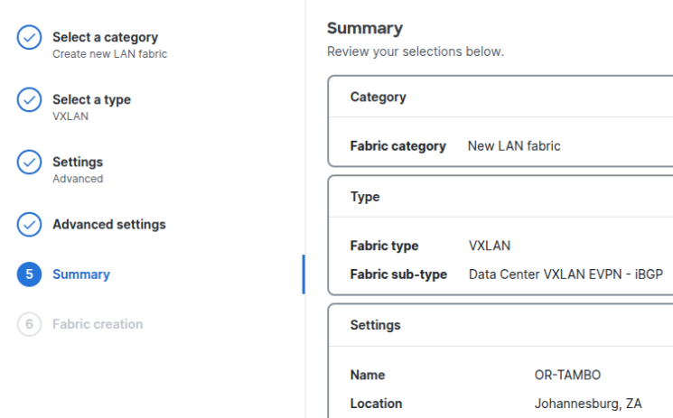

Wait for the Fabric creation process to complete.

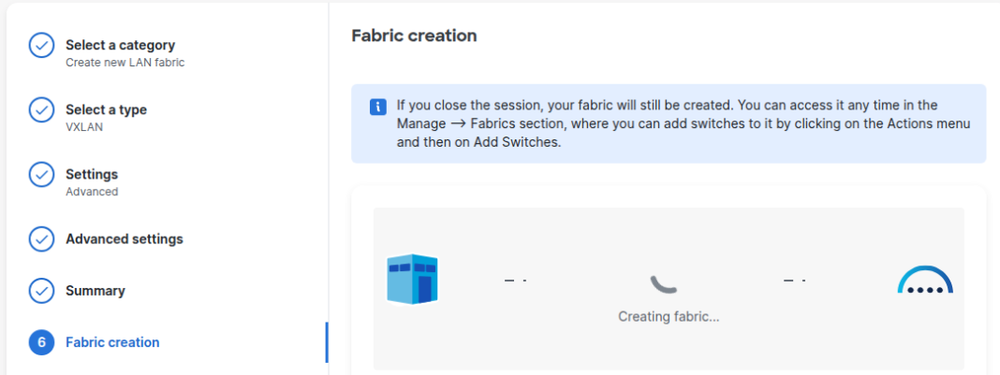


### Add Switches and Assign Roles

Under this section, the switches will be onboarded in the VXLAN fabric and will be assigned roles.

Click **"Add switches to fabric".** A warning shows that credentials for Cisco Nexus Dashboard to access the switches need to be set. Click **Set Default Credentials.**

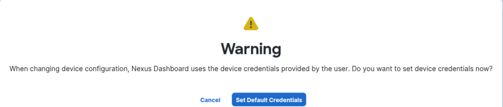

Create and save the default credentials.

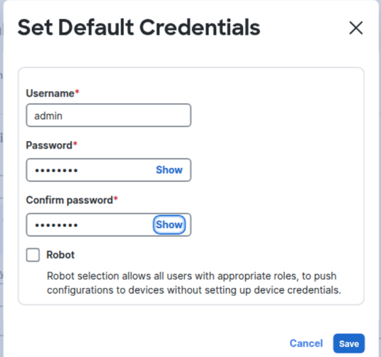

Fill in the Seed IP details and login credentials. **Ensure to untick "Preserve config".**

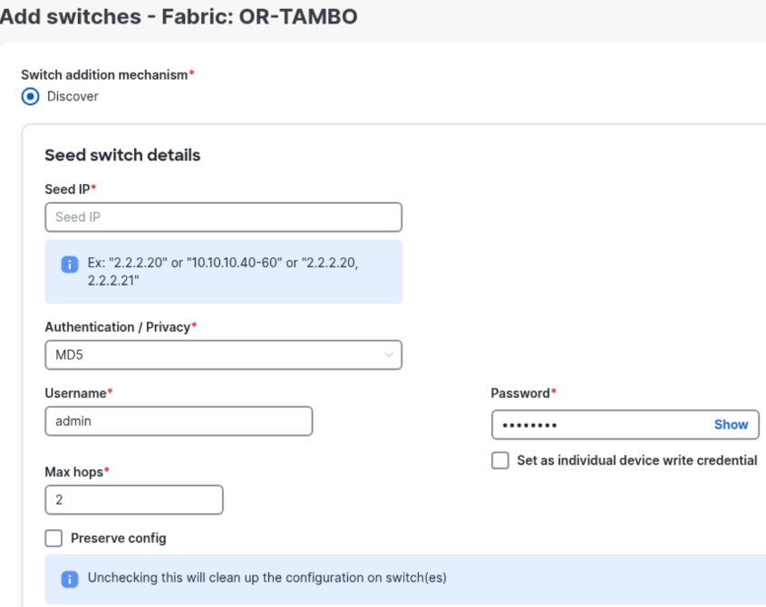

Click Discover switches to begin the switches discovery process. In the cleanup warning dialog, click **Confirm**.

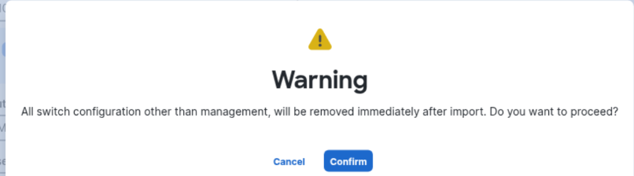

Tick on all the discovered switches and Click on **Add Switches.**

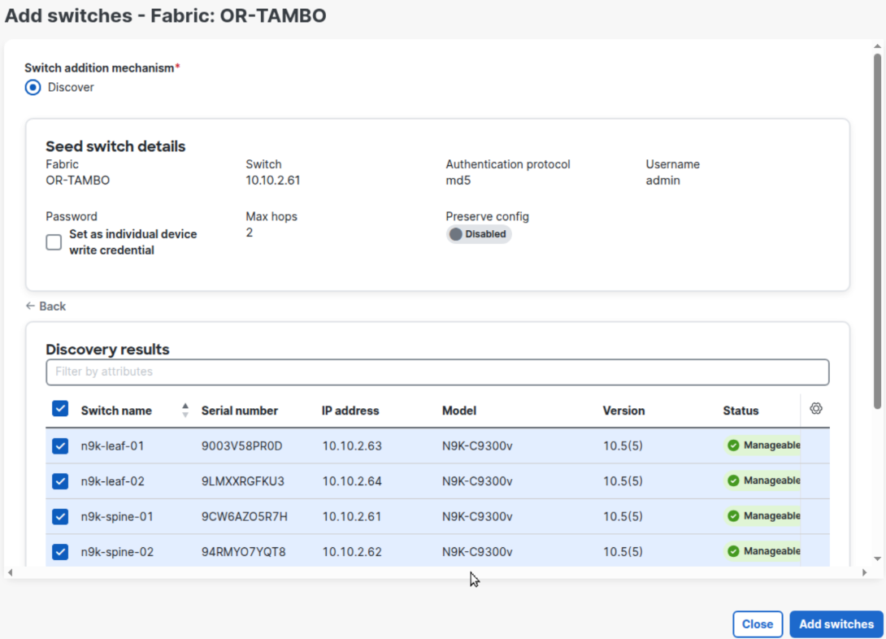

Wait for the discovery process to complete.

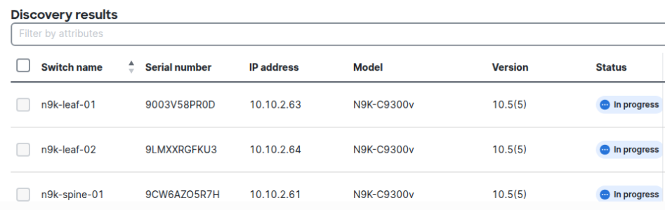

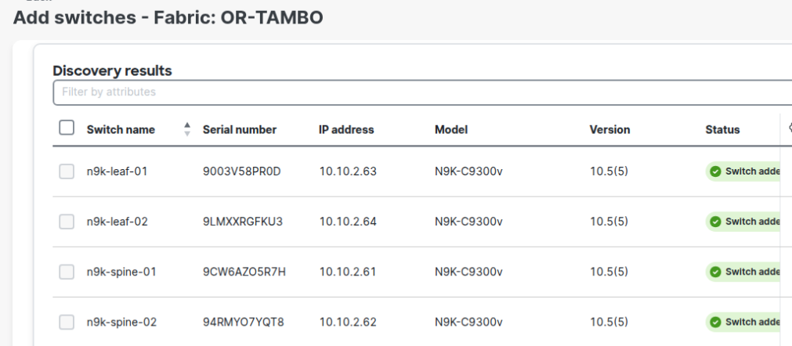

Review the fabric's Inventory page to verify that all devices have been successfully onboarded to the fabric. As observed all devices are by default assigned the role of "Leaf".

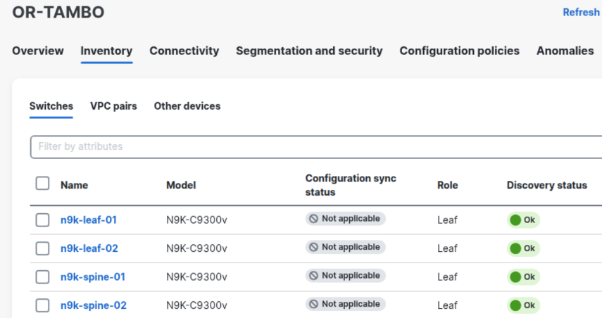

Check the check boxes for **n9k-spine-01** and **n9k-spine-02** and on the **Actions** menu and choose **Set role**.

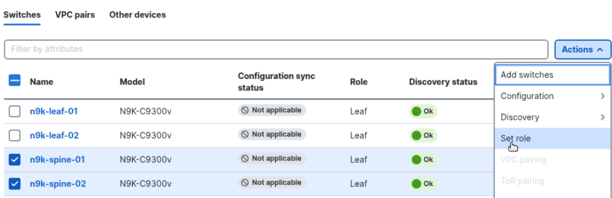

Select "Spine" as the role. In the warning dialog, click **Ok**.

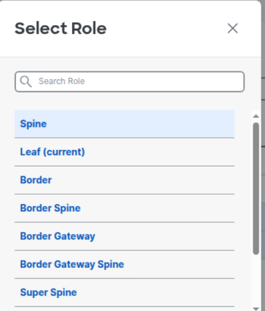

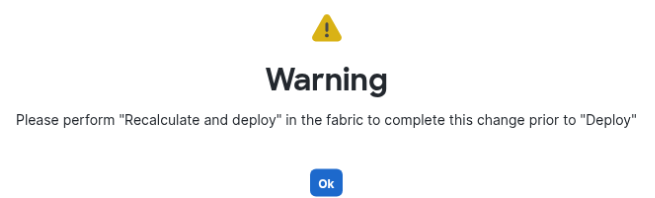

On the Inventory tab, verify that **n9k-spine-01** and **n9k-spine-02** show role **Spine** and the two leaves remain as **Leaf**.

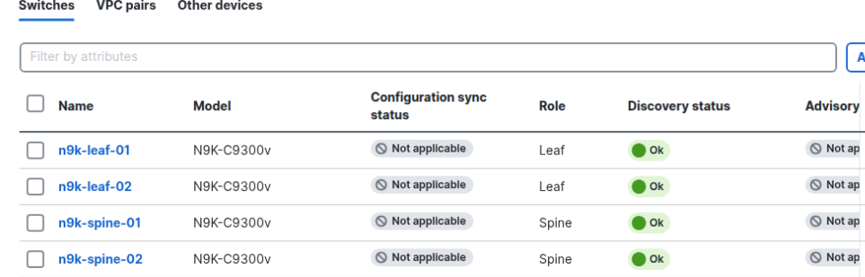

Click on the top "Action" button and select **Recalculate and deploy.**

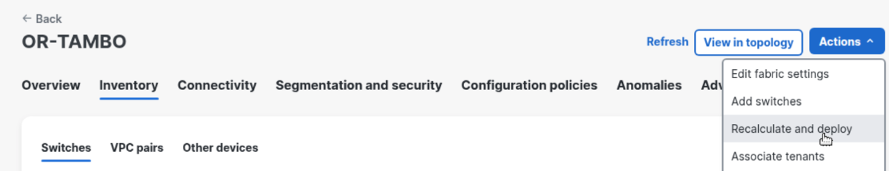

Review the **Deploy configuration** preview window, paying attention to the **Pending config** and **Diff** columns for each switch.

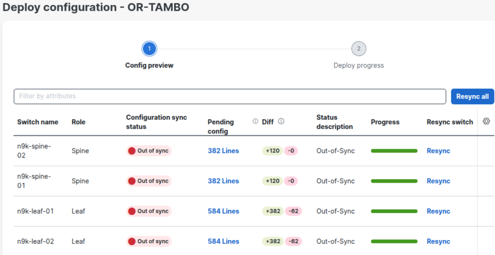

Click the **584 Lines** link in the **Pending config** column for **n9k-leaf-01**. Click the **Side-by-side comparison tab** at the top of the preview to see the configuration that will be added or removed on the switch.

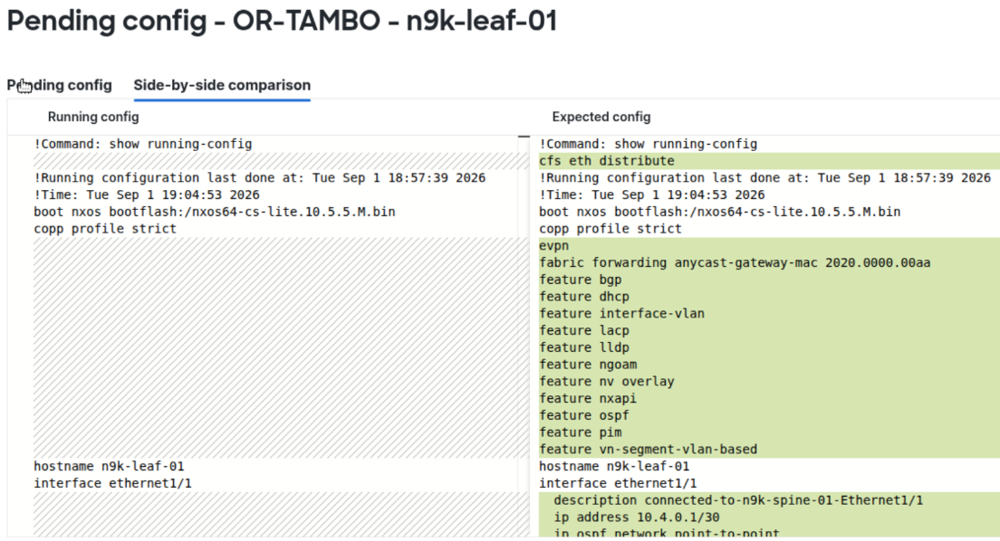

Click **"Deploy all"** to configure the devices. Wait for the deployment process to run until completion.

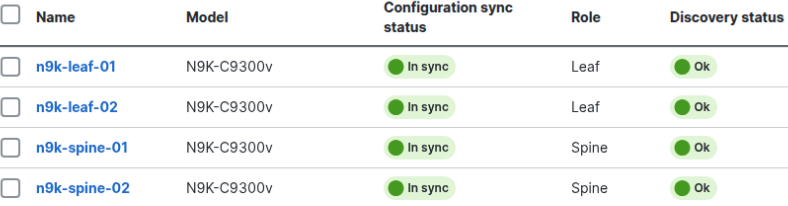

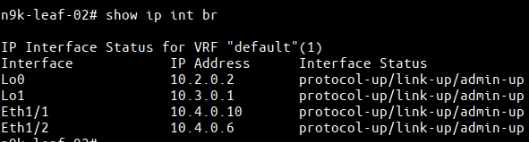

Ensure that the **Config-sync status** reads **in sync** for each device.

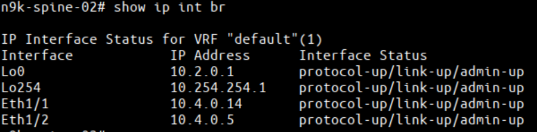

At this point a Data Center VXLAN EVPN fabric has been successfully created in Cisco Nexus Dashboard, switches successfully onboarded and assigned their respective roles.

## Verify the Underlay and Overlay

Leaf output: physical interfaces towards spines are up and loopback interfaces are up.

```text
n9k-leaf-02# show ip int br

IP Interface Status for VRF "default"(1)
Interface            IP Address      Interface Status
Lo0                  10.2.0.2        protocol-up/link-up/admin-up
Lo1                  10.3.0.1        protocol-up/link-up/admin-up
Eth1/1               10.4.0.10       protocol-up/link-up/admin-up
Eth1/2               10.4.0.6        protocol-up/link-up/admin-up
```

Spine output: physical interfaces towards leafs are up and loopback interfaces are up.

```text
n9k-spine-02# show ip int br

IP Interface Status for VRF "default"(1)
Interface            IP Address      Interface Status
Lo0                  10.2.0.1        protocol-up/link-up/admin-up
Lo254                10.254.254.1    protocol-up/link-up/admin-up
Eth1/1               10.4.0.14       protocol-up/link-up/admin-up
Eth1/2               10.4.0.5        protocol-up/link-up/admin-up
```

Take note of the IP addresses that were auto-assigned on the devices and the IP Ranges on the Resources page.

- Loopback0: underlay routing – 10.2.x.x
- Loopback1: underlay VTEP – 10.3.x.x
- Loopback254: underlay RP – 10.254.254.x

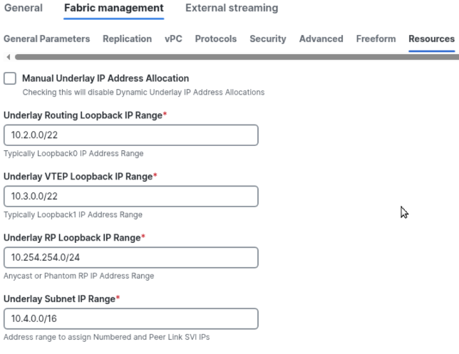

At this point, the leafs and spines have formed underlay (OSPF) and overlay (BGP L2VPN EVPN) neighborships, even though there are no prefixes yet exchanged.

```text
n9k-spine-02# show ip ospf neighbor
OSPF Process ID UNDERLAY VRF default
Total number of neighbors: 2
Neighbor ID     Pri State            Up Time    Address          Interface
10.2.0.3          1 FULL/ -          00:26:11   10.4.0.13        Eth1/1
10.2.0.2          1 FULL/ -          00:26:10   10.4.0.6         Eth1/2
```

```text
n9k-spine-02# show bgp l2vpn evpn summary
BGP summary information for VRF default, address family L2VPN EVPN
BGP router identifier 10.2.0.1, local AS number 65001
BGP table version is 3, L2VPN EVPN config peers 2, capable peers 2
0 network entries and 0 paths using 0 bytes of memory
BGP attribute entries [0/0], BGP AS path entries [0/0]
BGP community entries [0/0], BGP clusterlist entries [0/0]

Neighbor         V    AS        MsgRcvd      MsgSent   TblVer    InQ OutQ Up/Down State/PfxRcd
10.2.0.2         4 65001            34           34        3      0    0 00:26:37 0
10.2.0.3         4 65001            34           32        3      0    0 00:26:55 0
```

Next stop is to create a new VRF and new Networks (Layer 2 and Layer 3).

## Create a VRF

In Cisco Nexus Dashboard, Virtual Routing and Forwarding (VRF) instances act as isolated, tenant-specific routing tables. The VRF is identified by a Layer 3 VNI (L3VNI) that spans the entire fabric.

Navigate to **Manage > Fabrics**. From the list of fabrics, click on the fabric to open it. Click the **Segmentation and security** tab, and then click **VRFs**. Click **Actions** in the VRF subtab, then **create**.

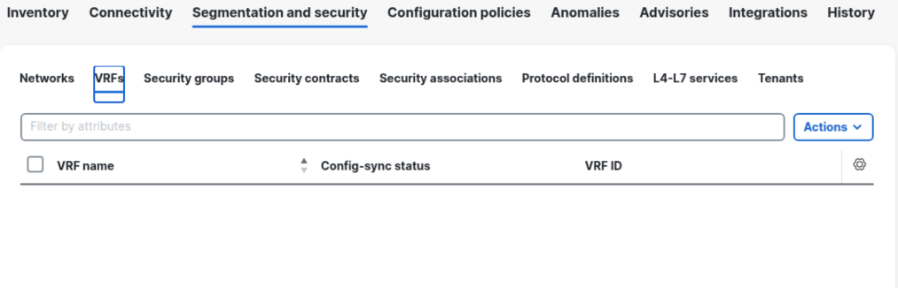

In the **Create VRF** page, enter **MAIN** for the **VRF name**, keep the proposed VRF ID **50000**, and click **Propose VLAN** to assign the tenant VLAN ID **2000**. Leave all other fields empty or as defaults.

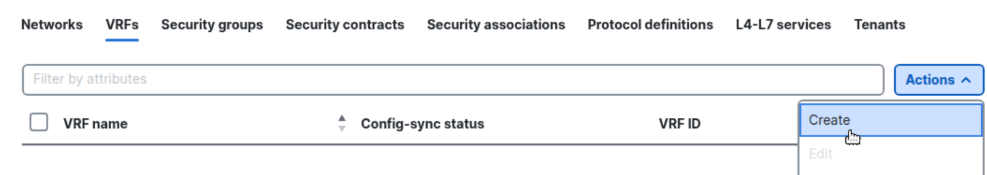

!!! note
    The **VRF ID** is derived from **the Layer 3 VXLAN VNI Range** in the Fabric's Resources, and the **VLAN ID** is derived from the **VRF VLAN** Range.

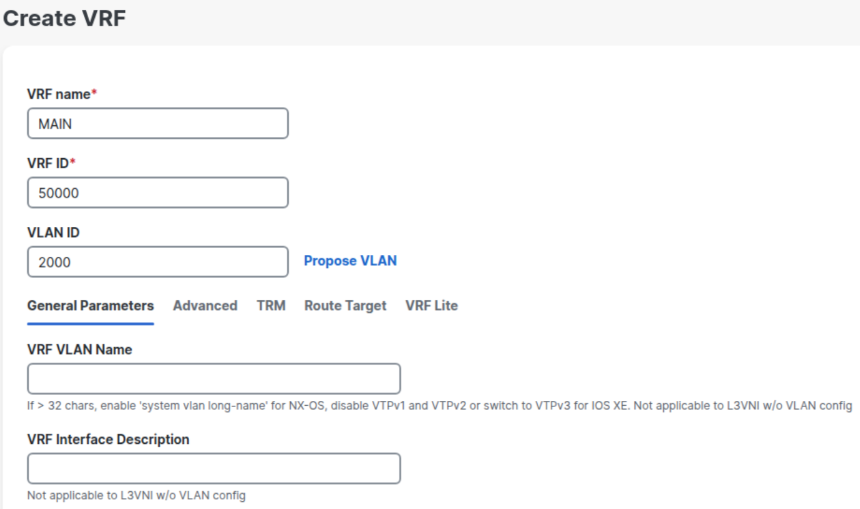

Click **Create** to add the new VRF. The **MAIN** VRF now appears in the VRFs list.

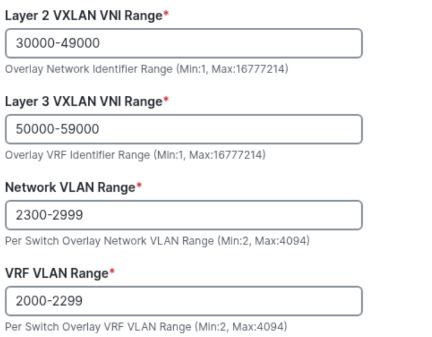

## Create a Layer 2 Network

In the VXLAN fabric, in the **Segmentation and security** tab, click **Networks**. Click **Actions** in the **Networks** subtab, then **Create** to create a new network.

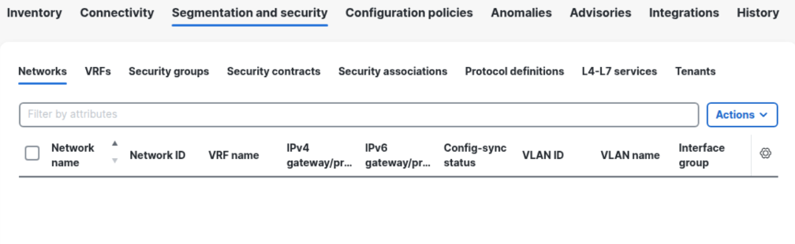

Enter **NET_WEB** for the **Network name**, set **Network mode** to **Layer 2 only** (Default is Layer 3), keep the proposed **Network ID** as **30000**, and click **Propose VLAN** to assign VLAN **2300**.

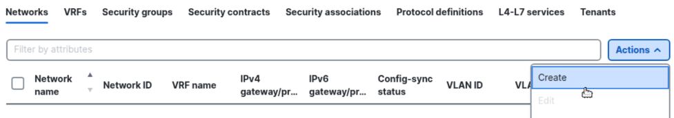

Leave all other fields as empty or defaults and click **Create**.

!!! note
    The Network ID and VLAN ID are not random values — they are automatically carved from the reservation pools defined in the Fabric's Resources. The Network ID was derived from the Layer 2 VXLAN VNI Range and the VLAN ID was derived from the Network VLAN Range.

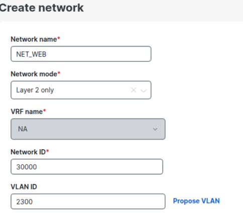

The Layer 2 Network is successfully created as shown below.

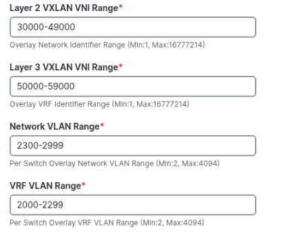

## Create a Layer 3 Network

This section showcases how to create a routed **Layer 3** network in the **MAIN** VRF.

On the **Networks** subtab of the VXLAN fabric, click **Actions > Create**. Enter **NET_APP** as the **Network name**, set **Network mode** to **Layer 3**, choose **MAIN** as the **VRF name**, set the **Network ID** to **30001**, and click **Propose VLAN** to assign VLAN **2301**. In the **IPv4 Gateway/NetMask** field, enter **192.168.2.254/24**.

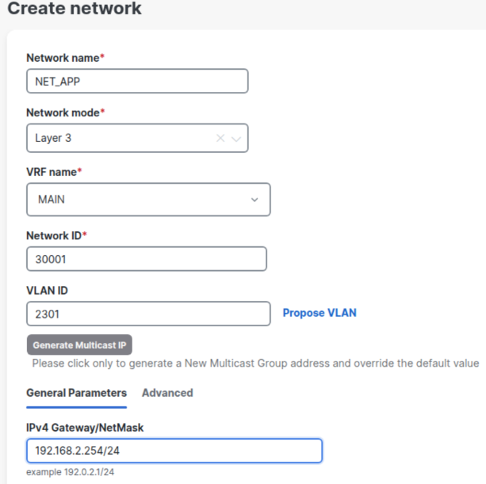

Leave the other fields as defaults or empty and click **Create**. The network **NET_APP** now appears in the **Networks** list, associated with VRF **MAIN** and gateway **192.168.2.254/24**.

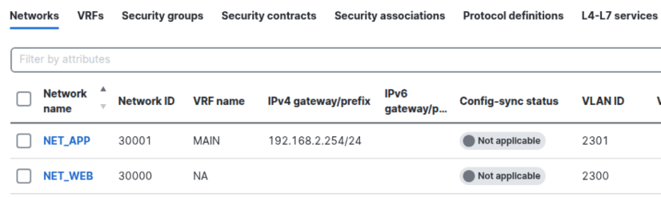

Click **Actions** in the top-right corner, then **Recalculate and Deploy** to push the configuration to the fabric.

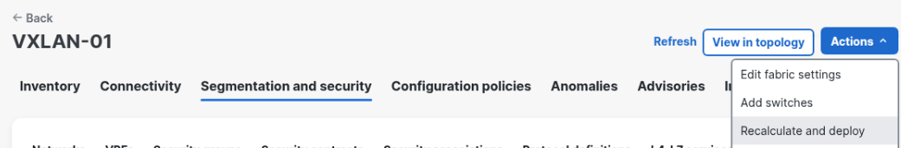

The Configuration Deployment window shows that there are no configurations to push to the switches. This is expected because the created VRF and networks are not yet attached to the switch interfaces.

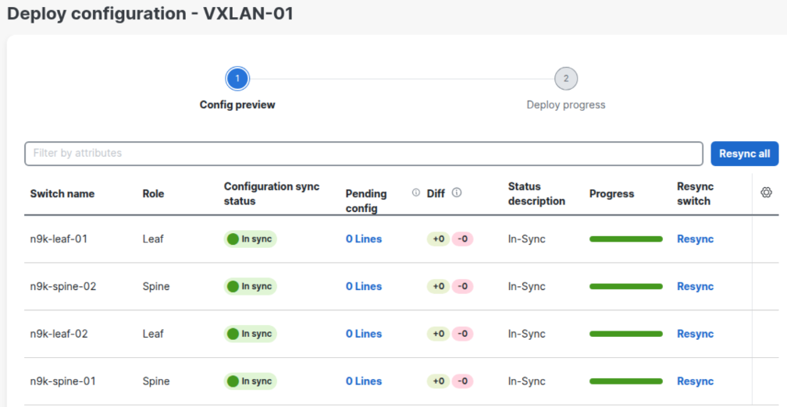

The topology below does indicate that the Fabric now has Networks and VRF objects even though they have not been deployed to the switches.

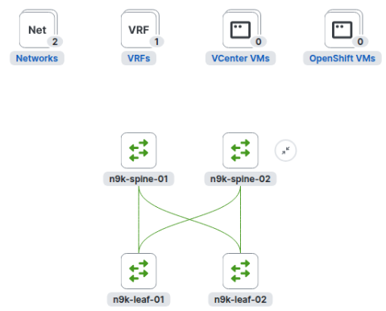

## Attach Endpoints

In VXLAN, attaching an endpoint tells the fabric which network a port belongs to and how to forward its traffic. This section of the lab shows how to set the leaf interface mode, attach the interface to the network, and deploy the configurations to the switches.

The host facing ports will be configured to **access mode** in the fabric.

Choose **Manage > Fabrics**. Click **OR-TAMBO** in the Fabrics list to open the fabric. On the **Connectivity** tab, open the **Interfaces** view and filter for interface **Ethernet1/3** for both leaf switches.

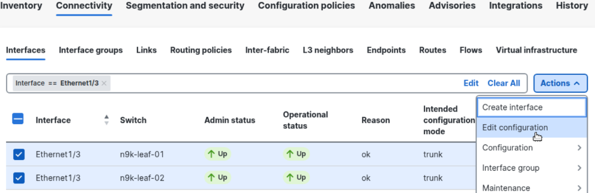

Select the Ethernet1/3 row on both **n9k-leaf-01** and **n9k-leaf-02** and click the lower **Actions** button, then choose **Edit configuration**.

Open the **Mode** drop-down for **n9k-leaf-01** Ethernet1/3 and select **Access**.

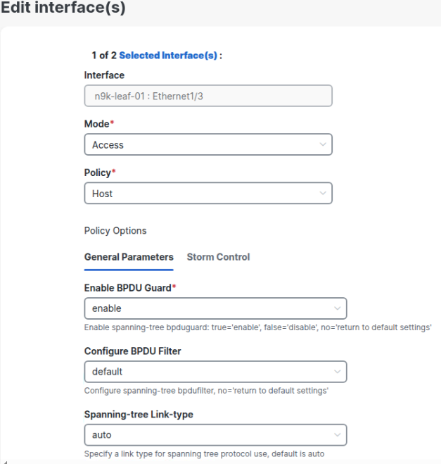

Scroll down, make sure that the **Access VLAN** box is empty and click **Save & Next**.

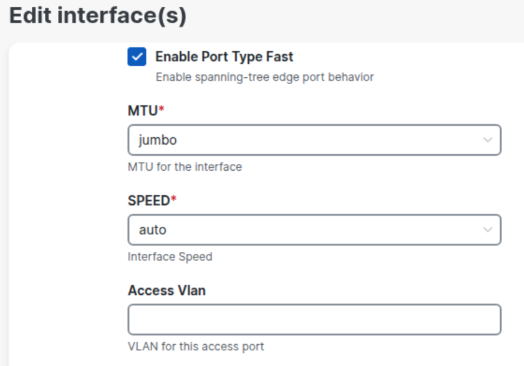

Repeat for n9k-leaf-02 Ethernet1/3, setting the Mode to Access.

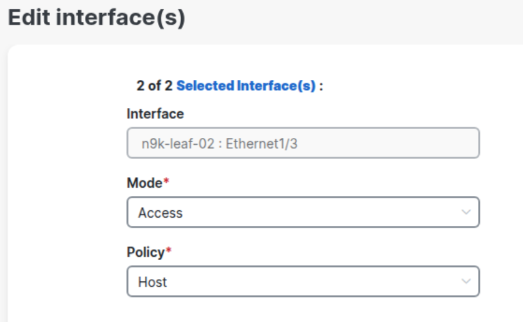

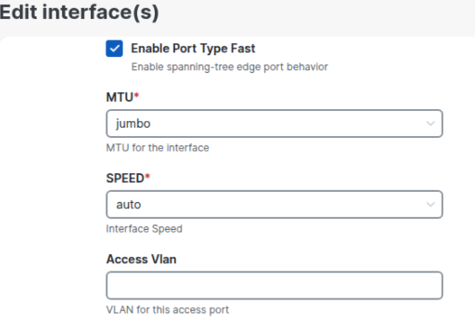

Click Save then Click Deploy. The pending configuration shows that the interfaces will be configured as access ports, instead of the default (trunk), and spanning-tree based configurations for these host facing ports are added.

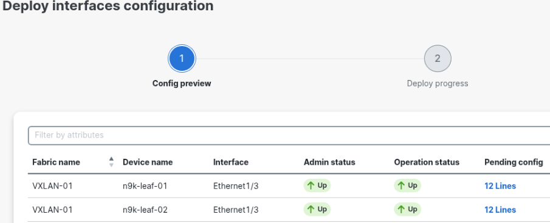

Click **Deploy Config** to push the change to the switches. Review the pending configuration for **n9k-leaf-01** **Ethernet1/3**.

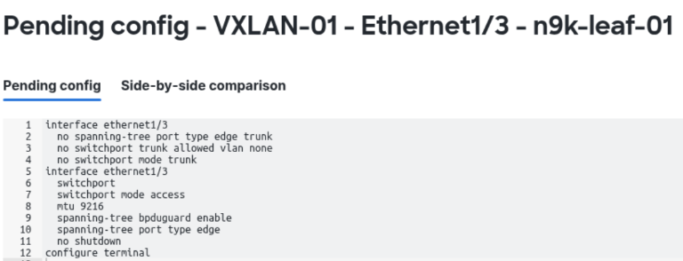

Confirm that both **Ethernet1/3** interfaces show intended configuration mode **access** and sync status **In-Sync**.

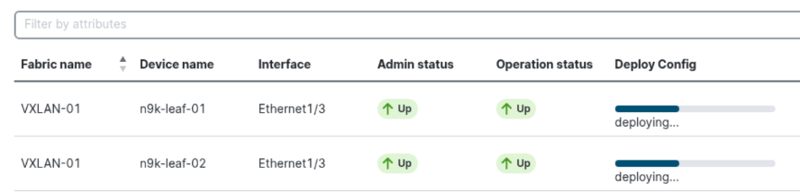

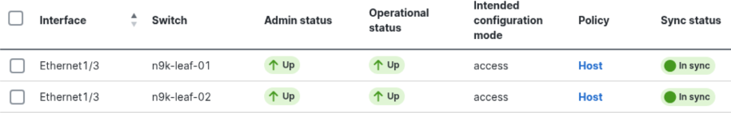

Repeat the filter from Step 4, but for **Ethernet1/4** on n9k-leaf-01. Click the lower **Actions** button, then choose **Edit configuration**.

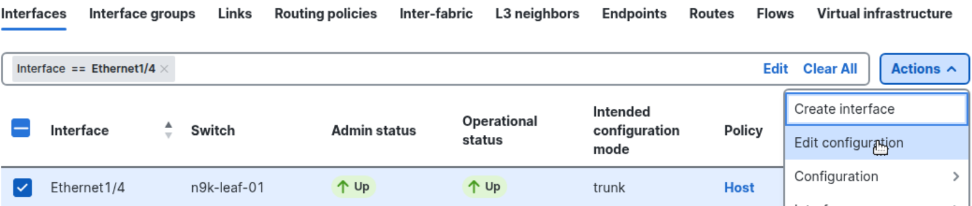

Verify that the **Ethernet1/4** interface has also been set to **Access** mode.

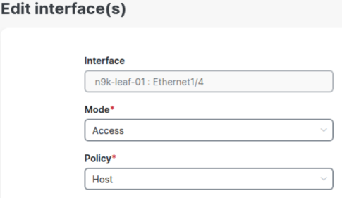

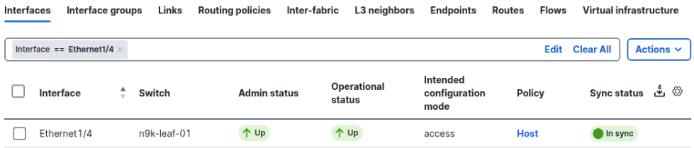

## Connect Interfaces to Networks

In this section, the Multi-Attach workflow of the Cisco Nexus Dashboard is used to attach endpoints to the networks.

Navigate to the **Segmentation and security**. Select **NET_WEB**, then click on the lower **Actions** button and select **Multi-Attach**.

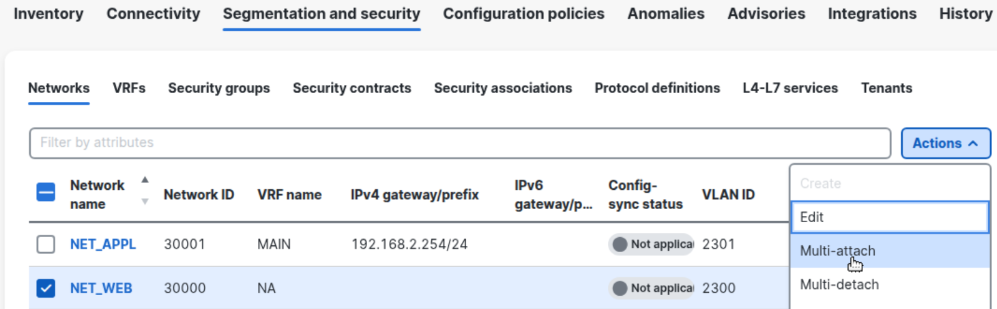

Select both leaf switches **n9k-leaf-01** and **n9k-leaf-02**, then click **Next**.

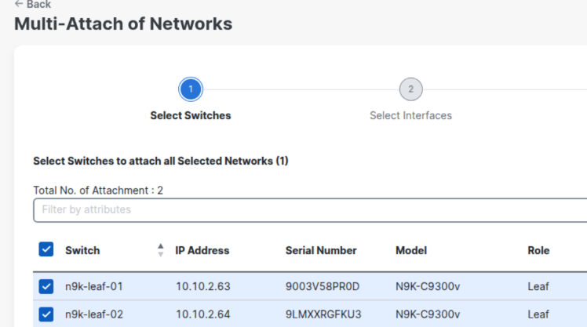

Select the interfaces that you are going to attach to the network **NET_WEB** on the first leaf. Click the **Select Interfaces** button in the row of **n9k-leaf-01**.

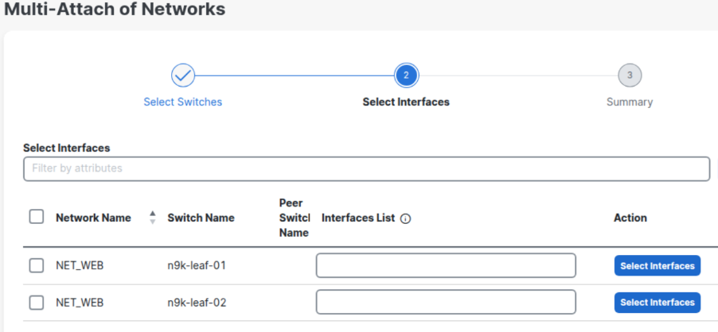

Choose **Ethernet1/3** for **n9k-leaf-01**, then click **Save**.

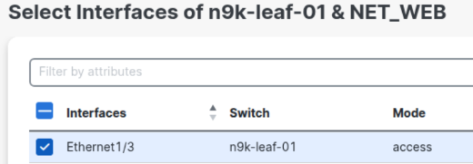

Select the interfaces that you are going to attach to the network **NET_WEB** on the second leaf. Click the **Select Interfaces** button in the row of **n9k-leaf-02**. Choose **Ethernet1/3** for **n9k-leaf-02**, then click **Save**. **Next**.

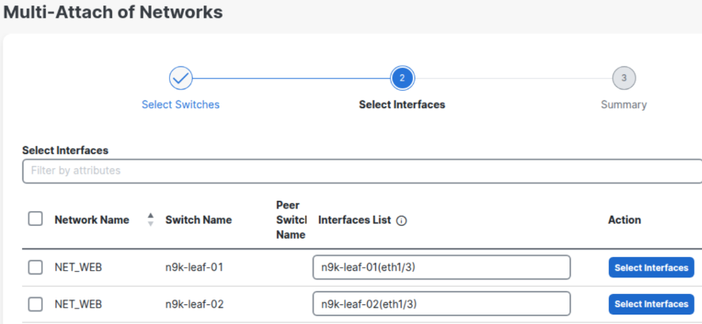

Click **Deploy later**. **Save**. Select **NET_APPL**, then click **Actions > Multi-Attach**.

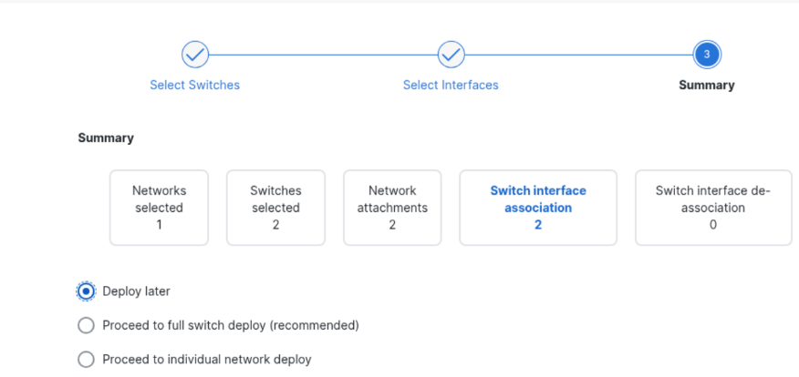

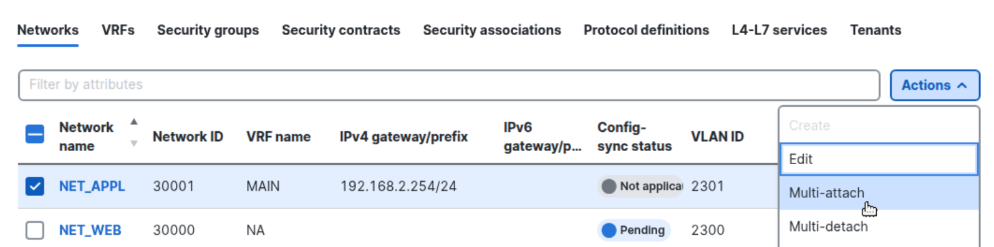

Select **n9k-leaf-01**, then click **Next**.

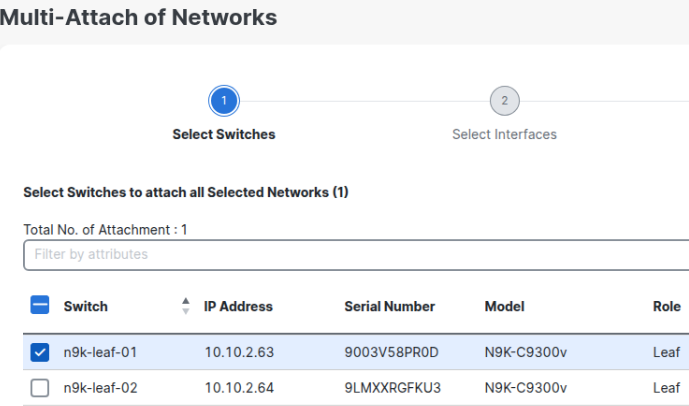

Choose **Ethernet1/4**, then click **Save**. **Next**.

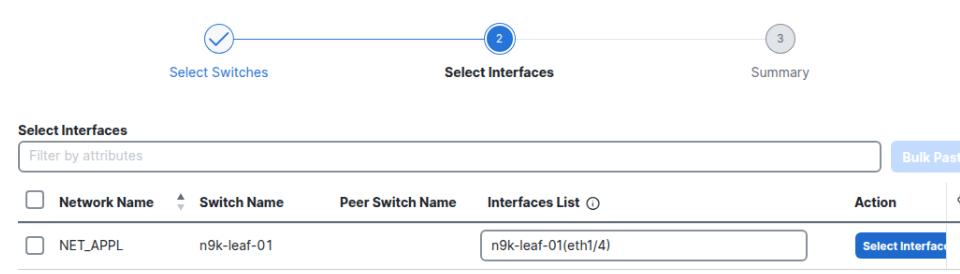

Choose **Deploy later**, then click **Save**.

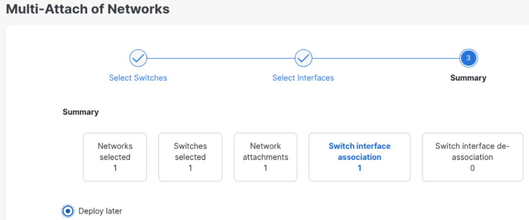

Click the upper **Actions** button, then select **Recalculate and Deploy**. Review the deployment intent.

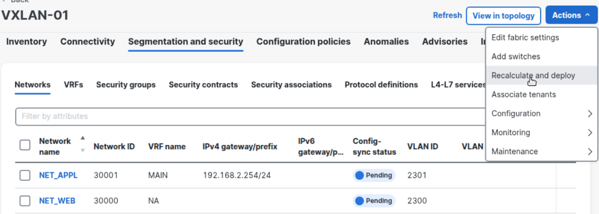

Review the pending configuration lines for each switch before deploying.

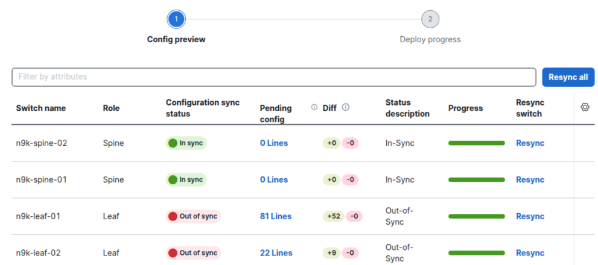

Deploying pushes the VRF, network, and interface attachment configuration to the leaf switches.

=== "n9k-leaf-01"
    ```text
    configure terminal
    interface nve1
      member vni 50000 associate-vrf
      member vni 30000
        mcast-group 239.1.1.0
      member vni 30001
        mcast-group 239.1.1.0
    configure terminal
    vlan 2300
      vn-segment 30000
    configure terminal
    vlan 2301
      vn-segment 30001
    configure terminal
    interface Vlan2301
      vrf member main
      ip address 192.168.2.254/24 tag 12345
      fabric forwarding mode anycast-gateway
      no shutdown
    configure terminal
    configure terminal
    evpn
      vni 30000 l2
        rd auto
        route-target import auto
        route-target export auto
      vni 30001 l2
        rd auto
        route-target import auto
        route-target export auto
    interface ethernet1/3
      switchport
      switchport mode access
      mtu 9216
      spanning-tree bpduguard enable
      spanning-tree port type edge
      no shutdown
      switchport access vlan 2300
    configure terminal
    interface ethernet1/4
      switchport
      switchport mode access
      mtu 9216
      spanning-tree bpduguard enable
      spanning-tree port type edge
      no shutdown
      switchport access vlan 2301
    configure terminal
    ```

=== "n9k-leaf-02"
    ```text
    vlan 2300
      vn-segment 30000
    configure terminal
    interface nve1
      member vni 30000
        mcast-group 239.1.1.0
    configure terminal
    configure terminal
    evpn
      vni 30000 l2
        rd auto
        route-target import auto
        route-target export auto
    interface ethernet1/3
      switchport
      switchport mode access
      mtu 9216
      spanning-tree bpduguard enable
      spanning-tree port type edge
      no shutdown
      switchport access vlan 2300
    configure terminal
    ```

Confirm that both **NET_WEB** and **NET_APPL** show the **Deployed** status.

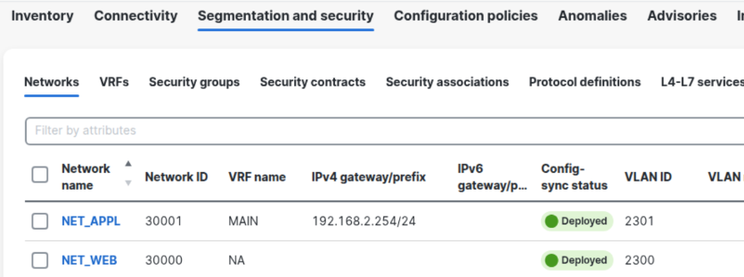

## Connectivity Verification

### Connect to Server-1

From **Server-1 (IP: 192.168.1.101)**, ping **Server-3** at **192.168.1.103**.

```text
student@server1:~$ ping 192.168.1.103
PING 192.168.1.103 (192.168.1.103) 56(84) bytes of data.
64 bytes from 192.168.1.103: icmp_seq=3 ttl=64 time=8.81 ms
64 bytes from 192.168.1.103: icmp_seq=1 ttl=64 time=2048 ms
64 bytes from 192.168.1.103: icmp_seq=2 ttl=64 time=1033 ms
64 bytes from 192.168.1.103: icmp_seq=4 ttl=64 time=3.87 ms
64 bytes from 192.168.1.103: icmp_seq=5 ttl=64 time=3.87 ms
64 bytes from 192.168.1.103: icmp_seq=6 ttl=64 time=3.71 ms
64 bytes from 192.168.1.103: icmp_seq=7 ttl=64 time=3.65 ms
^C
--- 192.168.1.103 ping statistics ---
7 packets transmitted, 7 received, 0% packet loss, time 6047ms
rtt min/avg/max/mdev = 3.650/443.537/2047.992/744.900 ms, pipe 3
```

From **Server-1**, ping **Server-2** at **192.168.2.102**.

```text
student@server1:~$ ping 192.168.2.102
PING 192.168.2.102 (192.168.2.102) 56(84) bytes of data.
From 192.168.1.101 icmp_seq=1 Destination Host Unreachable
From 192.168.1.101 icmp_seq=2 Destination Host Unreachable
From 192.168.1.101 icmp_seq=3 Destination Host Unreachable
From 192.168.1.101 icmp_seq=4 Destination Host Unreachable
From 192.168.1.101 icmp_seq=5 Destination Host Unreachable
From 192.168.1.101 icmp_seq=6 Destination Host Unreachable
^C
--- 192.168.2.102 ping statistics ---
8 packets transmitted, 0 received, +6 errors, 100% packet loss, time 7170ms
pipe 4
```

The ping fails with no replies and 100% packet loss. NET_WEB is a Layer 2-only network, so the endpoint reaches other endpoints in the same network but cannot reach another network without a gateway.

From **Server-2**, ping the gateway **192.168.2.254**.

```text
student@server2:~$ ping 192.168.2.254
PING 192.168.2.254 (192.168.2.254) 56(84) bytes of data.
64 bytes from 192.168.2.254: icmp_seq=2 ttl=255 time=0.867 ms
64 bytes from 192.168.2.254: icmp_seq=3 ttl=255 time=0.853 ms
64 bytes from 192.168.2.254: icmp_seq=4 ttl=255 time=0.948 ms
^C
--- 192.168.2.254 ping statistics ---
4 packets transmitted, 3 received, 25% packet loss, time 3066ms
rtt min/avg/max/mdev = 0.853/0.889/0.948/0.041 ms
```

Server-2 can communicate with its default gateway.

## Change Network Type from Layer 2 to Layer 3

NET_WEB is a Layer 2 network, so its endpoints reach each other in the same subnet but cannot reach other subnets. In this section of the lab the NET_WEB network will be converted to Layer 3 by adding a distributed anycast gateway (DAG). Inter-subnet connectivity will then be verified.

Navigate to **Segmentation and security > Networks**, select **NET_WEB**, and click **Actions > Edit**.

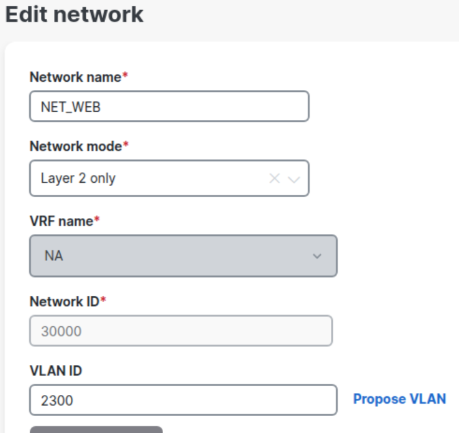

Change the network mode to **Layer 3** and associate the network with VRF – MAIN.

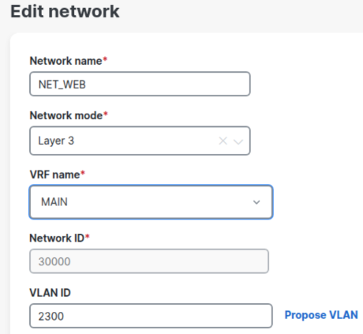

Enter the IPv4 gateway **192.168.1.254/24** for NET_WEB, then click **Save** to convert the Layer 2 network to Layer 3.

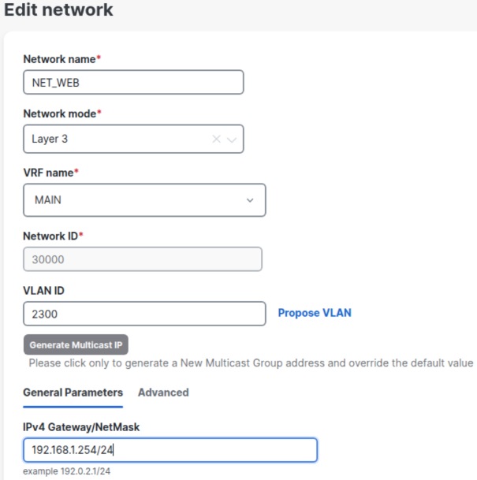

Select **NET_WEB**, then click **Actions > Deploy**.

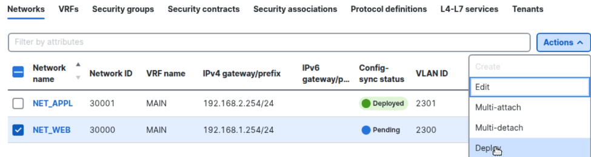

Connect to **Server-1** and ping the default gateway.

```text
student@server1:~$ ping 192.168.1.254
PING 192.168.1.254 (192.168.1.254) 56(84) bytes of data.
64 bytes from 192.168.1.254: icmp_seq=2 ttl=255 time=0.843 ms
64 bytes from 192.168.1.254: icmp_seq=3 ttl=255 time=0.934 ms
64 bytes from 192.168.1.254: icmp_seq=4 ttl=255 time=0.736 ms
^C
--- 192.168.1.254 ping statistics ---
4 packets transmitted, 3 received, 25% packet loss, time 3023ms
rtt min/avg/max/mdev = 0.736/0.837/0.934/0.080 ms
```

From **Server-1**, ping **Server-2** at **192.168.2.102**.

```text
student@server1:~$ ping 192.168.2.102
PING 192.168.2.102 (192.168.2.102) 56(84) bytes of data.
64 bytes from 192.168.2.102: icmp_seq=1 ttl=63 time=1.30 ms
64 bytes from 192.168.2.102: icmp_seq=2 ttl=63 time=1.25 ms
64 bytes from 192.168.2.102: icmp_seq=3 ttl=63 time=1.22 ms
64 bytes from 192.168.2.102: icmp_seq=4 ttl=63 time=1.36 ms
64 bytes from 192.168.2.102: icmp_seq=5 ttl=63 time=1.34 ms
```

!!! success "Checkpoint"
    With NET_WEB converted to Layer 3 and its distributed anycast gateway deployed, Server-1 (NET_WEB, 192.168.1.0/24) now reaches Server-2 (NET_APPL, 192.168.2.0/24) across the MAIN VRF — confirming symmetric IRB routing between the two overlay networks.

## Verify EVPN Routes

You verify the Virtual Extensible LAN (VXLAN) Ethernet VPN (EVPN) control plane on a Cisco Nexus 9000 leaf. You read the Border Gateway Protocol (BGP) Layer 2 VPN (L2VPN) EVPN route table and trace one route into the data plane.

On n9k-leaf-02, run the `show bgp l2vpn evpn summary` command to list the EVPN peers and their route-type counts.

```text
n9k-leaf-02# show bgp l2vpn evpn summary
BGP summary information for VRF default, address family L2VPN EVPN
BGP router identifier 10.2.0.2, local AS number 65001
BGP table version is 20, L2VPN EVPN config peers 2, capable peers 2
12 network entries and 18 paths using 4368 bytes of memory
BGP attribute entries [15/5520], BGP AS path entries [0/0]
BGP community entries [0/0], BGP clusterlist entries [2/8]

Neighbor         V    AS        MsgRcvd      MsgSent   TblVer    InQ OutQ Up/Down State/PfxRcd
10.2.0.1         4 65001            81           70       20      0    0 01:01:25 5
10.2.0.4         4 65001            81           68       20      0    0 01:01:56 5

Neighbor         T    AS    Type-1  Type-2  Type-3  Type-4  Type-5  Type-6  Type-7  Type-8  Type-12
10.2.0.1         I 65001 0        3       0       0       2       0       0       0       0
10.2.0.4         I 65001 0        3       0       0       2       0       0       0       0
```

The first table lists the two internal BGP (iBGP) sessions to the spine route reflectors, both in the same autonomous system as this leaf. The second table breaks the received prefixes down by EVPN route type. Type-2 carries host media access control (MAC) and MAC+IP addresses. Type-3 carries broadcast, unknown-unicast, and multicast (BUM) flooding. Type-4 carries Ethernet segment routes for multihoming. Type-5 carries IP prefixes.

Run the `show bgp l2vpn evpn` command to display the full EVPN route table.

```text
n9k-leaf-02# show bgp l2vpn evpn
BGP routing table information for VRF default, address family L2VPN EVPN
BGP table version is 20, Local Router ID is 10.2.0.2
Status: s-suppressed, x-deleted, S-stale, d-dampened, h-history, *-valid, >-best
Path type: i-internal, e-external, c-confed, l-local, a-aggregate, r-redist, I-injected
Origin codes: i - IGP, e - EGP, ? - incomplete, | - multipath, & - backup, 2 - best2

   Network            Next Hop            Metric     LocPrf     Weight Path
Route Distinguisher: 10.2.0.2:35067    (L2VNI 30000)
*>l[2]:[0]:[0]:[48]:[000c.2900.18a9]:[0]:[0.0.0.0]/216
                      10.3.0.1                          100      32768 i
*>l[2]:[0]:[0]:[48]:[000c.290b.228d]:[0]:[0.0.0.0]/216
                      10.3.0.2                          100          0 i
*>l[2]:[0]:[0]:[48]:[000c.290b.228d]:[32]:[192.168.1.101]/272
                      10.3.0.2                          100          0 i

Route Distinguisher: 10.2.0.3:4
* i[5]:[0]:[0]:[24]:[192.168.1.0]/224
                      10.3.0.2                            0        100          0 ?
*>i
* i[5]:[0]:[0]:[24]:[192.168.2.0]/224
                      10.3.0.2                            0        100          0 ?
*>i

Route Distinguisher: 10.2.0.3:35067
*>l[2]:[0]:[0]:[48]:[000c.290b.228d]:[0]:[0.0.0.0]/216
                      10.3.0.2                          100          0 i
* i
*>l[2]:[0]:[0]:[48]:[000c.290b.228d]:[32]:[192.168.1.101]/272
                      10.3.0.2                          100          0 i
* i

Route Distinguisher: 10.2.0.3:35068
* i[2]:[0]:[0]:[48]:[3ea2.cdb8.1048]:[32]:[192.168.2.102]/272
                      10.3.0.2                          100          0 i
*>i

Route Distinguisher: 10.2.0.2:4    (L3VNI 50000)
* i[2]:[0]:[0]:[48]:[000c.290b.228d]:[32]:[192.168.1.101]/272
                      10.3.0.2                          100          0 i
*>i[2]:[0]:[0]:[48]:[3ea2.cdb8.1048]:[32]:[192.168.2.102]/272
                      10.3.0.2                          100          0 i
* i[5]:[0]:[0]:[24]:[192.168.1.0]/224
                      10.3.0.2                            0        100          0 ?
*>l
*>i[5]:[0]:[0]:[24]:[192.168.2.0]/224
                      10.3.0.2                            0        100          0 ?
```

The table groups routes into one block per route distinguisher. The RD encodes the router ID of the originating leaf plus a locally significant index, while the inline (L2VNI 30000) or (L3VNI 50000) tag gives the VXLAN network identifier (VNI). Routes that this leaf originates show path type `l` (local), routes learned from the route reflectors show path type `i` (internal), and the Next Hop column is always the VTEP that owns the route.

The route `[2]:[0]:[0]:[48]:[000c.290b.228d]:[32]:[192.168.1.101]` carries the MAC and IP of Server-1. Its path type is `i` (internal), the local preference is 100, and the next hop is 10.3.0.2, the VTEP on the remote leaf n9k-leaf-01. This entry proves that n9k-leaf-02 learned the remote endpoint through the EVPN control plane rather than through data-plane flooding.

The route `[2]:[0]:[0]:[48]:[3ea2.cdb8.1048]:[32]:[192.168.2.102]` carries the MAC and IP of Server-2. Its path type is `i` (internal), the local preference is 100, and the next hop is 10.3.0.2, the VTEP on the remote leaf that Server-2 connects to. n9k-leaf-02 learned this endpoint in the NET_APPL network through the EVPN control plane.

The entries under L3VNI 50000 are Type-5 routes. They advertise IP prefixes rather than individual hosts and provide reachability for the subnets carried in the MAIN VRF instance, identified by the Layer 3 VNI 50000. The next hop 10.3.0.2 is the VTEP through which n9k-leaf-02 reaches those subnets with symmetric IRB.

Run the `show ip route vrf MAIN` command to see how the EVPN routes map to the data plane.

```text
n9k-leaf-02# show ip route vrf MAIN
IP Route Table for VRF "main"
'*' denotes best ucast next-hop
'**' denotes best mcast next-hop
'[x/y]' denotes [preference/metric]
'%<string>' in via output denotes VRF <string>

192.168.1.0/24, ubest/mbest: 1/0, attached
    *via 192.168.1.254, Vlan2300, [0/0], 00:07:09, direct, tag 12345
192.168.1.101/32, ubest/mbest: 1/0
    *via 10.3.0.2%default, [200/0], 00:06:10, bgp-65001, internal, tag 65001, segid: 50000, tunnelid: 0xa030002, encap: VXLAN
192.168.1.254/32, ubest/mbest: 1/0, attached
    *via 192.168.1.254, Vlan2300, [0/0], 00:07:09, local, tag 12345
192.168.2.0/24, ubest/mbest: 1/0
    *via 10.3.0.2%default, [200/0], 00:06:44, bgp-65001, internal, tag 65001, segid: 50000, tunnelid: 0xa030002, encap: VXLAN
192.168.2.102/32, ubest/mbest: 1/0
    *via 10.3.0.2%default, [200/0], 00:06:44, bgp-65001, internal, tag 65001, segid: 50000, tunnelid: 0xa030002, encap: VXLAN
```

The local subnet 192.168.1.0/24 and its DAG address 192.168.1.254 are attached through the Vlan2300 SVI. The remote endpoints and the NET_APPL subnet resolve through the VTEP 10.3.0.2 as bgp internal routes. Each carries `segid: 50000`, the Layer 3 VNI of the MAIN VRF, and is encapsulated in VXLAN.

The prefixes have different lengths: a /24 prefix represents a learned network, and a /32 prefix represents a learned host (server). Notice the 192.168.2.0/24 network: it is not learned locally as attached, because this leaf does not have any interfaces in that network.

!!! success "Checkpoint"
    The BGP L2VPN EVPN table and the VRF MAIN route table agree: Server-1 and Server-2's host routes and their subnets were learned through the EVPN control plane from the remote VTEP 10.3.0.2, and are forwarded across the fabric with VXLAN encapsulation under L3VNI 50000.

For more labs visit my GitHub repo: [https://github.com/TitusM/Cisco-Data-Center](https://github.com/TitusM/Cisco-Data-Center)

## References

**Cisco U Courses:**

1. [Cisco Data Center Nexus Dashboard Essentials | DCNDE](https://www.cisco.com/site/us/en/learn/training-certifications/training/courses/dcnde.html)
