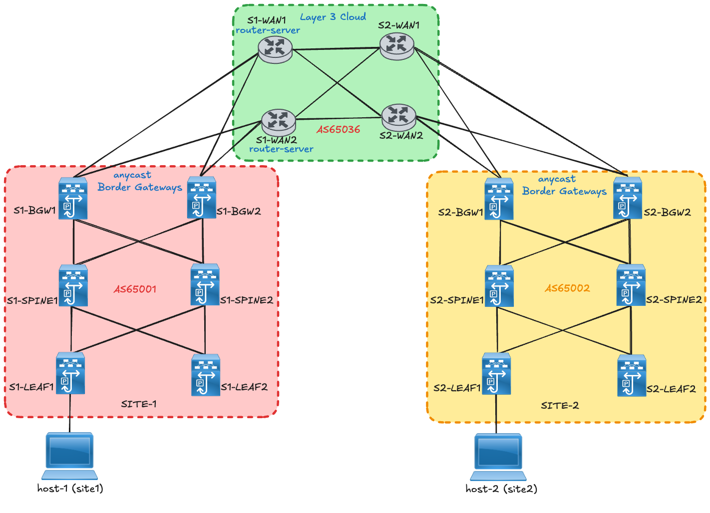
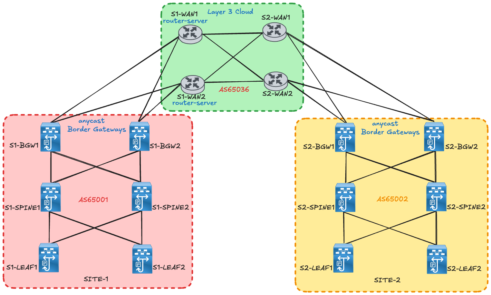
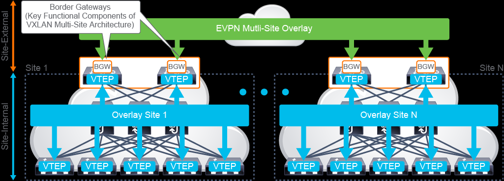
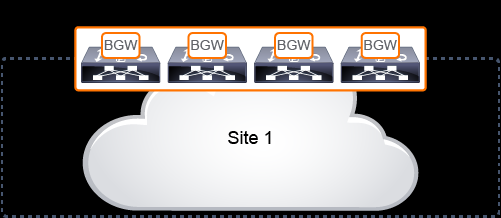
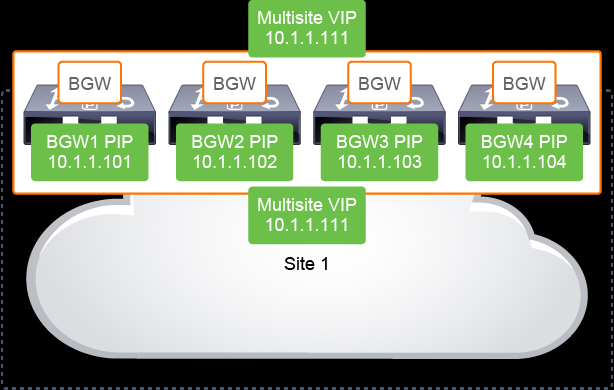
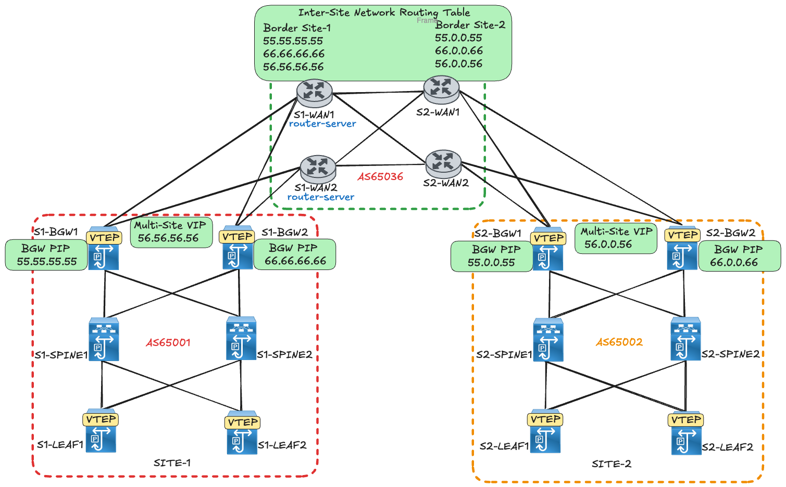
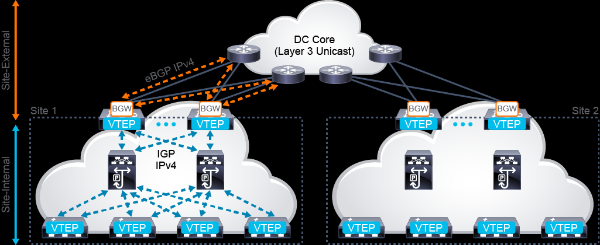
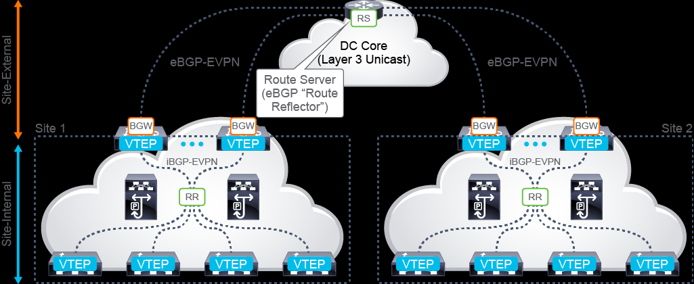
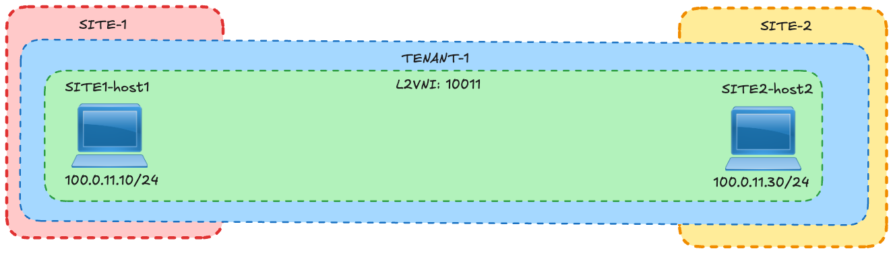

# VXLAN BGP EVPN Multi-Site (CLI) Configuration and Verification

!!! note
    This lab was conducted in a controlled environment. Any configurations in a production network should be implemented during a designated maintenance window. Additionally, always refer to official documentation relevant to your specific hardware and software.

## Introduction

VXLAN EVPN Multi-Site architecture is a design for VXLAN BGP EVPN–based overlay networks
that allows for the interconnection of multiple distinct VXLAN BGP EVPN fabrics or overlay
domains. A VXLAN Multi-Site architecture enables seamless extension of Layer 2 and Layer 3
domains. This lab document showcases how to configure a VXLAN EVPN Multi-Site to allow
communication of endpoints in different sites.
!!! note
    This lab assumes that the reader has enough knowledge about basic VXLAN. Some configurations like bringing up a VXLAN site from scratch are intentionally omitted.


## Solution Design – the Bigger Picture

I know it’s tempting to jump straight into the configurations — I feel the same way. However,
before we do that, let’s establish a solid foundation and the correct mental model. This will
ensure the rest of the lab is easier to follow and logically consistent. However if for some
reason you want to see the entire configuration of this lab first jump straight to
To see the detailed configuration for this entire lab navigate to
Appendix: Full Configurations.

This lab consists of a VXLAN Multi-Site made up of 2 sites (Site-1 and Site-2). Each site consist
of Anycast border gateways that are connected to a Layer 3 WAN in order to establish intersite
connectivity.

Connectivity between the border gateways and the spines will be referred to as “site-internal”
and connectivity between the Border Gateways and the WAN will be referred to as “site-
external”.


## Lab Topology Overview




This lab is made up of 2 VXLAN fabrics each with dedicated devices for leafs, spines and anycast
border gateways (BGWs). These 2 sites interconnect using a Layer 3 cloud that runs pure IP
routing. Each site and the Layer 3 cloud are in a different Autonomous System from a BGP
perspective. S1-WAN1 and S1-WAN2 will serve as route-servers (“ebgp route reflectors”).
Site-1                Site-2                  Layer 3
cloud
Internal site underlay routing protocol        OSPF                  OSPF                    OSPF
External site underlay routing protocol        eBGP                  eBGP                    eBGP
Internal site overlay routing protocol         iBGP                  iBGP                    iBGP
External site overlay routing protocol         eBGP                  eBGP                    eBGP
BGP ASN                                        65001                 65002                   65036
Internal site Replication mode                 multicast             multicast               n/a
External site Replication mode                 ingress replication ingress replication


### Figure 1 Lab Topology




## Border Gateway Overview

Before diving into the configurations, it is important to touch upon the concept of a Border
Gateway (BGW). The BGW is critical as it is used to separate the fabric-side (site-internal fabric)
from the network that interconnects the sites (site-external DC) and it abstracts the site-
internal VTEPs. The BGW interacts with both site-internal and site-external nodes. Hence, the
BGWs provide a network control boundary that is necessary for traffic enforcement and failure
containment functionality.




Image adopted from https://ondemandelearning.cisco.com/apollo-alpha/dc-nxa-02-multivxlanevpn-10/pages/2


The Border Gateway is connected to the site-internal VTEPs through the VXLAN fabric’s spine
nodes.

### Anycast Border Gateway
In an anycast Border Gateway setup, the BGWs in each site share a common anycast IP


address (or Mult-Site VIP address).


Example:



Images adopted from https://ondemandelearning.cisco.com/apollo-alpha/dc-nxa-02-multivxlanevpn-10/pages/4


The BGW VIP address is used for all data-plane communication leaving the site and between
sites when the VXLAN EVPN Multi-Site extension is used to reach a remote site. The single VIP
address is used both within the site to reach an exit point and between the sites, while the
BGWs always use the PIP address to communicate with each other in the site. The Multi-Site
VIP address is represented by a dedicated loopback interface associated with the Network
Virtualization Endpoint (NVE) interface. The PIP address is used to handle BUM traffic between
BGWs at different sites.

VTEPs are only aware of their overlay domain internal neighbors, including the BGWs' primary
IP (PIP) address and virtual IP (VIP) address. All routes external to the fabric have a next hop
on the BGWs for Layer 2 and Layer 3 traffic.


## Border Gateway Configurations
The configurations in this chapter aim to achieve the connectivity required:
1. between the BGWs and site-internal devices.
2. between the BGWs and site-external devices.
3. between the local-site BGWs and the remote-site BGWs.

For the underlay control plane:
1. OSPF neighborship is established as the IGP between the BGWs and the site-internal
devices.
2. eBGP is used as to peer with the site-external devices.

For the overlay control plane:
1. iBGP peering is established between the BGWs and the site-internal devices: site-
internal overlay.
2. eBGP peering is established between the BGWs and the DC/Layer 3 cloud: site-
external overlay.

The images below shows the peerings that will be formed:


#### Underlay Control Plane




Image adopted from https://ondemandelearning.cisco.com/apollo-alpha/dc-nxa-02-multivxlanevpn-10/pages/6


#### Overlay Control Plane




### BGW: Site-internal OSPF underlay

The configurations for a BGW with a site-internal OSPF underlay is shown below.

1. Enable OSPF for underlay IPv4 unicast routing and PIM for multicast-based BUM
replication.
```text
feature ospf
feature pim


```

!!! note
    If ingress replication is used in the intra-site underlay, then PIM is not required on the BGW.


2. Define the OSPF process tag and router ID. The OSPF process tag is used for site-
internal underlay routing.
```text
router ospf UNDERLAY
   router-id <lo0 IP address>


```

3. Define the loopback0 interface that will be used for the routing protocol router-ID and
for the overlay control-plane peering (BGP).
```text
interface loopback0
   description RID and BGP Peering
   ip address <ip-address>/32 tag 54321
   ip router ospf UNDERLAY area 0.0.0.0
   ip pim sparse-mode
```

The IP address is extended with a tag to allow easy selection for redistribution.

!!! note
    The loopback interface used for the router ID and BGP peering must be advertised to the site-
    internal underlay as well as to the site-external underlay.


4. Define the loopback1 interface as the NVE source interface (PIP VTEP).
```text
interface loopback1
   description NVE INTERFACE (PIP VTEP)
   ip address <ip-address>/32 tag 54321
   ip router ospf UNDERLAY area 0.0.0.0
   ip pim sparse-mode


```

!!! note
    The loopback interface used for the individual VTEP (PIP) must be advertised to the site-
    internal underlay as well as to the site-external underlay.


5. Define the loopback100 interface as the EVPN Multi-Site source interface (anycast and
virtual IP VTEP).
```text
interface loopback100
     description MULTI-SITE INTERFACE (VIP VTEP)
     ip address <ip-address>/32 tag 54321
     ip router ospf UNDERLAY area 0.0.0.0


```

!!! note
    The loopback interface used for the EVPN Multi-Site anycast VTEP (virtual IP address) must be
    advertised to the site-internal underlay as well as to the site-external underlay.


6. Define the site-internal underlay interfaces facing the spines.
```text
interface Ethernet1/<ID>
     description SITE-INTERNAL INTERFACE – connected to Spine1
     no switchport
     mtu 9216
     ip address <ip-address>/30
     ip ospf network point-to-point
     ip router ospf UNDERLAY area 0.0.0.0
     ip pim sparse-mode
     #evpn multisite fabric-tracking (don’t configure yet)


interface Ethernet1/<ID>
     description SITE-INTERNAL INTERFACE – connected to Spine2
     no switchport
     mtu 9216
     ip address <ip-address>/30
     ip ospf network point-to-point
     ip router ospf UNDERLAY area 0.0.0.0
     ip pim sparse-mode
     #evpn multisite fabric-tracking (don’t configure yet)


```

!!! note
    I am following the steps from the whitepaper guide and the “evpn multisite
    fabric-tracking” command was not working under the interface as required. At first
    glance it seems like this command doesn’t exist (see output below):
```text
S1-BGW1(config)# int e1/98
S1-BGW1(config-if)# evpn multisite border-gateway ?
```

*** No matching command found in current mode, matching in (config) mode ***
<1-281474976710655> Multisite Site-Id


However, after l used the evpn multisite border-gateway <site-id> command first,
I was able to configure the evpn multisite fabric tracking under the interface.

7. Define the BGW as an EVPN Multi-Site BGW with the appropriate site ID.
```text
evpn multisite border-gateway <site-id>
  delay-restore time 300


```

!!! note
    All BGWs at the same site must have the same site ID.

    As a sub configuration of the BGW definition, a time-delayed restore operation for BGW virtual
    IP address advertisement can be set.


8. Specify the EVPN Multi-Site interface tracking for the site-internal underlay. The evpn
```text
      multisite fabric-tracking command is mandatory to enable the Multi-Site virtual IP
      address on the BGW. At least one of the physical interfaces that are configured with
      fabric tracking must be up to enable the Multi-Site BGW function (keeping the virtual
      IP VTEP address active).

interface Ethernet1/<ID>
     evpn multisite fabric-tracking


```

Configuration template – site internal underlay
```text
feature ospf
feature pim
!
evpn multisite border-gateway <site-id>
  delay-restore time 300


!
router ospf UNDERLAY
   router-id <lo0 IP address>
!
interface loopback0
   description RID and BGP Peering
   ip address <ip-address>/32 tag 54321
   ip router ospf UNDERLAY area 0.0.0.0
ip pim sparse-mode
!
interface loopback1
   description NVE INTERFACE (PIP VTEP)
   ip address <ip-address>/32 tag 54321
   ip router ospf UNDERLAY area 0.0.0.0
ip pim sparse-mode
!
interface loopback100
     description MULTI-SITE INTERFACE (VIP VTEP)
     ip address <ip-address>/32 tag 54321
  ip router ospf UNDERLAY area 0.0.0.0
!
interface Ethernet1/<ID>
     description SITE-INTERNAL INTERFACE – connected to Spine1
     no switchport
     mtu 9216
     ip address <ip-address>/30
     ip ospf network point-to-point
     ip router ospf UNDERLAY area 0.0.0.0
     ip pim sparse-mode
     evpn multisite fabric-tracking
!
interface Ethernet1/<ID>
     description SITE-INTERNAL INTERFACE – connected to Spine2
     no switchport
     mtu 9216
     ip address <ip-address>/30
     ip ospf network point-to-point
     ip router ospf UNDERLAY area 0.0.0.0
     ip pim sparse-mode
  evpn multisite fabric-tracking


```

### BGW: Site-internal overlay

The configurations for a BGW with a site-internal iBGP overlay is shown below.

1. Enable the required features
```text
feature bgp
feature nv overlay
nv overlay evpn


```

2. Define the NVE interface (VTEP) and extend it with EVPN (host-reachability protocol).
Define the loopback1 interface as the NVE source interface (PIP VTEP).
Define the loopback100 interface as the EVPN Multi-Site source interface (anycast and
virtual IP VTEP).
```text
interface nve1
  host-reachability protocol bgp
  source-interface loopback1
  multisite border-gateway interface loopback100


```

3. Define the BGP routing instance with site-specific autonomous system.
```text
router bgp 65501
address-family l2vpn evpn
  neighbor <SPINE1-lo0-IP>
    remote-as 65501
    update-source loopback0
    address-family l2vpn evpn
      send-community
      send-community extended

  neighbor <SPINE2-lo0-IP>
    remote-as 65501
    update-source loopback0
    address-family l2vpn evpn
      send-community
      send-community extended


```

Configuration template – site internal overlay
```text
feature bgp
feature nv overlay
nv overlay evpn
!
interface nve1
  host-reachability protocol bgp
  source-interface loopback1
  multisite border-gateway interface loopback100
!
router bgp 65501
address-family l2vpn evpn
  neighbor <SPINE1-lo0-IP>
    remote-as 65501
    update-source loopback0
    address-family l2vpn evpn
      send-community
      send-community extended

  neighbor <SPINE2-lo0-IP>
    remote-as 65501
    update-source loopback0
    address-family l2vpn evpn
      send-community
      send-community extended


```

### Site-external underlay (DCI)
Connectivity between the Border Gateways and the Layer 3 Cloud.

The site-external underlay is the network that interconnects multiple VXLAN BGP EVPN fabrics.
It is a transport network that allows reachability between all the EVPN Multi-Site BGWs and
external VTEPs. In this document, eBGP is used to interconnect the BGWs and the WAN routers.
!!! note
    For BUM replication between sites, EVPN Multi-Site architecture exclusively uses ingress
    replication to simplify the requirements of the site-external underlay network.


    The configuration for a BGW with a site-external eBGP underlay is shown below.

1. Define the site-external underlay interfaces facing the external Layer 3 core.
```text
interface Ethernet1/<ID>
  description Connection-to-wan1
  no switchport
  mtu 9216
  ip address <ip-address>/30 tag 54321
  evpn multisite dci-tracking

interface Ethernet1/2
  description Connection-to-wan2
  no switchport
  mtu 9216
  ip address <ip-address>/30 tag 54321
  evpn multisite dci-tracking


```

!!! note
```text
  EVPN Multi-Site interface tracking is used for the site-external underlay (evpn multisite
  dci-tracking).This command is mandatory to enable the Multi-Site virtual IP address on
  the BGW. At least one of the physical interfaces that are configured with DCI tracking must be
  up to enable the Multi-Site BGW function.


```

2. Configure a route map that will redistribute tagged routes.
```text
route-map RMAP-REDIST-DIRECT permit 10
  match tag 54321


```

3. Define the BGP routing instance with a site-specific autonomous system.
```text
router bgp 65001
  router-id <BGW router-id>
  log-neighbor-changes
  address-family ipv4 unicast
    redistribute direct route-map RMAP-REDIST-DIRECT
    maximum-paths 4
neighbor <wan1-ip>
    remote-as 65036
    update-source Ethernet1/1
    address-family ipv4 unicast


   neighbor <wan2-ip>
     remote-as 65036
     update-source Ethernet1/2
     address-family ipv4 unicast


```

Configuration template – site external underlay DCI
```text
interface Ethernet1/<ID>
  description Connection-to-wan1
  no switchport
  mtu 9216
  ip address <ip-address>/30 tag 54321
  evpn multisite dci-tracking

interface Ethernet1/2
  description Connection-to-wan2
  no switchport
  mtu 9216
  ip address <ip-address>/30 tag 54321
  evpn multisite dci-tracking
!
route-map RMAP-REDIST-DIRECT permit 10
  match tag 54321
!
router bgp 65001
  router-id <BGW router-id>
  log-neighbor-changes
  address-family ipv4 unicast
    redistribute direct route-map RMAP-REDIST-DIRECT
    maximum-paths 4
  neighbor <wan1(ip-address)>
    remote-as 65036
    update-source Ethernet1/<bgw interface towards wan1>
    address-family ipv4 unicast

   neighbor <wan2(ip-address)>
     remote-as 65036
     update-source Ethernet1/<bgw interface towards wan2>
     address-family ipv4 unicast


```

The configuration for the external Layer 3 cloud to establish eBGP underlay peering with the
BGWs is shown below.
```text
interface Ethernet1/<ID>
  description <connecting to BGW1>
  mtu 9216
  ip address <ip-address>/31
  no shutdown

interface Ethernet1/<ID>
  description <connecting to BGW2>
  mtu 9216


   ip address <ip-address>/31
   no shutdown
!
router bgp 65036
  router-id <Lo0>
  neighbor <BGW-1 ip-address>
    remote-as <site-AS>
    update-source Ethernet1/<ID>
    address-family ipv4 unicast
  neighbor <BGW-2 ip-address>
    remote-as <site-AS>
    update-source Ethernet1//<ID>
    address-family ipv4 unicast


```

### Site-external overlay
In this lab, the BGP EVPN control-plane communication between the BGWs will be achieved
using a route server.
“A route-server functions like a route-reflector (in iBGP setups) but in this case it is for eBGP.
```text
[IETF RFC 7947: Internet Exchange BGP Route Server
```

https://datatracker.ietf.org/doc/html/rfc7947 “

Like a route reflector, a route server performs a pure control-plane function and doesn’t need
to be in the data path between any of the BGWs. The route server must be able to support the
EVPN address family, reflect VPN routes, and manipulate the next-hop behaviour (next-hop
unchanged).

The configuration for a BGW with a site-external eBGP overlay is shown below:

1. Configure the neighbor with the EVPN address family (L2VPN EVPN) for the site-
external overlay control plane facing the route server.
a. Configure the eBGP neighbor by specifying the source interface loopback0. This
setting allows underlay ECMP reachability from BGW loopback0 to route-server
loopback0.

!!! note
    Site-external EVPN peering is always considered to use eBGP with the next hop the remote site
    BGWs.


    b. With the route server or remote BGW potentially multiple routing hops away,
    you must increase the BGP session Time-To-Live (TTL) setting to an appropriate
    value (ebgp-multihop).
    c. In defining the site-external BGP peering session (peer-type fabric external),
    rewrite and re-origination are enabled.
    d. The autonomous system portion of the automated route target (ASN:VNI) will
```text
              be rewritten upon receipt from the site-external network (rewrite-evpn-rt-asn)
              without modification of any configurations on the site-internal VTEPs. The


              route-target rewrite will help ensure that the ASN portion of the automated
              route target matches the destination autonomous system.

#Configuration on the BGWs
router bgp 65001
!
  neighbor #<RID of WAN1>
    remote-as 65036
    update-source loopback0
    ebgp-multihop 5
    peer-type fabric-external
    address-family l2vpn evpn
      send-community
      send-community extended
      rewrite-evpn-rt-asn
!
  neighbor #<RID of WAN2>
    remote-as 65036
    update-source loopback0
    ebgp-multihop 5
    peer-type fabric-external
    address-family l2vpn evpn
      send-community
      send-community extended
      rewrite-evpn-rt-asn


```

The configuration for a site-external route server is shown below.

1. Configure a route-map that enforces the policy to leave the overlay next hop
unchanged when the route server is used.
a. Note: The route server is not a VTEP or BGW and hence should not have the next
hop pointing to itself.

```text
route-map UNCHANGED permit 10
  set ip next-hop unchanged


```

2. Configure the required BGP configurations (iBGP between the layer 3 cloud and eBGP
between Layer 3 cloud and BGWs).
a. Ensure that all the received EVPN advertisements are reflected even if all the
tenant VRF instances are not created on the route server. The route targets
```text
             must be preserved while that function is performed (retain route-target all).

router bgp 65036
  address-family l2vpn evpn
    retain route-target all
template peer OVERLAY-PEERING
    update-source loopback0
    ebgp-multihop 5
    address-family l2vpn evpn


        send-community both
        route-map UNCHANGED out

   neighbor <site1-spine1> remote-as 65001
     inherit peer OVERLAY-PEERING
     address-family l2vpn evpn
       rewrite-evpn-rt-asn

   neighbor <site1-spine2> remote-as 65001
     inherit peer OVERLAY-PEERING
     address-family l2vpn evpn
       rewrite-evpn-rt-asn

 neighbor <site2-spine1> remote-as 65002
    inherit peer OVERLAY-PEERING
    address-family l2vpn evpn
      rewrite-evpn-rt-asn

   neighbor <site2-spine2> remote-as 65002
     inherit peer OVERLAY-PEERING
     address-family l2vpn evpn
       rewrite-evpn-rt-asn

```

!!! note
    This lab does not show the iBGP configurations within the Layer 3 cloud.


### Tenant (L2VNI/L3VNI) Configurations
The EVPN Multi-Site architecture allows the extension of Layer 2 and Layer 3 segments beyond
a single site. This section displays the configurations needed for the VNIs, for either Layer 2 or
Layer 3 extension. A symmetric VNI configuration is used in this lab. Symmetric VNI means all
deployed sites must follow a consistent assignment of VNIs for either Layer 2 or Layer 3
extension. Therefore, a VLAN or VRF instance at the local site must be mapped to the same
VNI that is used at the remote site.

#### BGW Layer 3 extension configuration
The configuration shown below is configured across all BGWs in Site1 and Site2.

1. Define the Layer 3 VNI and attach it to a BGW local VLAN
```text
vlan 10
  vn-segment 50000


```

2. Define the VRF context and use the Layer 3 VNI (vn-segment) from the previous
configuration step.

```text
vrf context Tenant-1
  vni 50000
  rd auto


   address-family ipv4 unicast
     route-target both auto
     route-target both auto evpn


```

The route-distinguisher and the route-target are derived automatically. The route-targets are
enabled for the IPv4 address family and EVPN.

3. Define a Layer 3 interface to enable the previously defined VNI to become a fully
functional Layer 3 VNI.

```text
interface Vlan10
  no shutdown
  mtu 9216
  vrf member Tenant-1
  ip forward


```

4. Associate the Layer 3 VNI with the NVE interface (VTEP) and associate it with the VRF
type.

```text
interface nve1
  member vni 50001 associate-vrf


```

#### BGW Layer 2 extension configuration
The configuration shown below is configured across all BGWs in Site1 and Site2.

1. Define the Layer 2 VNI and attach it to a BGW local VLAN.
```text
vlan 11
  vn-segment 10011
vlan 12
  vn-segment 10012


```

2. Associate the Layer 2 VNI with the NVE interface (VTEP) and configure the relevant site-
internal and site-external BUM replication modes
```text
interface nve1
  member vni 10011
    multisite ingress-replication
    mcast-group 239.1.1.11
  member vni 10012
    multisite ingress-replication
    mcast-group 239.1.1.12


```

3. Define a VRF context (MAC VRF instance) with the appropriate Layer 2 VNI and the
forwarding mode (L2).

```text
evpn
  vni 10011 l2
     rd auto


                  route-target import auto
                  route-target export auto
                vni 10012 l2
                  rd auto
                  route-target import auto
                  route-target export auto


```

4. Define the SVIs IP addresses

```text
              interface Vlan11
                no shutdown
                mtu 9216
                vrf member Tenant-1
                ip address 100.0.11.1/24
                fabric forwarding mode anycast-gateway

              interface Vlan12
                no shutdown
                mtu 9216
                vrf member Tenant-1
                ip address 100.0.12.1/24
                fabric forwarding mode anycast-gateway


             To see the detailed configuration for this entire lab navigate to
```

## Appendix: Full Configurations


## Endpoint Communication
Before getting into deep verifications on the VXLAN multi-site fabric, let’s verify that east-
west traffic flow is operational between endpoints in Site-1 and Site-2.



#### host1 to host2 ping

```text
ping 100.0.11.30
PING 100.0.11.30 (100.0.11.30): 56 data bytes
64 bytes from 100.0.11.30: icmp_seq=0 ttl=254 time=1.267 ms
64 bytes from 100.0.11.30: icmp_seq=1 ttl=254 time=0.75 ms


64 bytes from 100.0.11.30: icmp_seq=2 ttl=254 time=0.664 ms
64 bytes from 100.0.11.30: icmp_seq=3 ttl=254 time=0.685 ms
64 bytes from 100.0.11.30: icmp_seq=4 ttl=254 time=0.637 ms


                Verify the routing table of S1-LEAF1 and S2-LEAF2
S1-LEAF1# show ip route vrf Tenant-1
IP Route Table for VRF "Tenant-1"

100.0.11.0/24, ubest/mbest: 1/0, attached
    *via 100.0.11.1, Vlan11, [0/0], 04:24:04, direct
100.0.11.1/32, ubest/mbest: 1/0, attached
    *via 100.0.11.1, Vlan11, [0/0], 04:24:04, local
100.0.11.10/32, ubest/mbest: 1/0, attached
    *via 100.0.11.10, Vlan11, [190/0], 03:05:43, hmm
100.0.11.30/32, ubest/mbest: 1/0
    *via 56.56.56.56%default, [200/0], 04:15:26, bgp-65001, inter
```

#### host2 to host1 ping

```text
 ping 100.0.11.10
 PING 100.0.11.10 (100.0.11.10): 56 data bytes
 64 bytes from 100.0.11.10: icmp_seq=0 ttl=254 time=1.04 ms
 64 bytes from 100.0.11.10: icmp_seq=1 ttl=254 time=0.707 ms


    64 bytes from 100.0.11.10: icmp_seq=2 ttl=254 time=0.495 ms
    64 bytes from 100.0.11.10: icmp_seq=3 ttl=254 time=0.703 ms
    64 bytes from 100.0.11.10: icmp_seq=4 ttl=254 time=0.529 ms


nal, tag 65036, segid: 50000 tunnelid:
```

0x38383838 encap: VXLAN (SITE2 endpoint)


```text
S2-LEAF1# show ip route vrf Tenant-1
IP Route Table for VRF "Tenant-1"
```

'*' denotes best ucast next-hop
'**' denotes best mcast next-hop
'[x/y]' denotes [preference/metric]
'%<string>' in via output denotes VRF <string>

```text
100.0.11.0/24, ubest/mbest: 1/0, attached
    *via 100.0.11.1, Vlan11, [0/0], 1w3d, direct
100.0.11.1/32, ubest/mbest: 1/0, attached
    *via 100.0.11.1, Vlan11, [0/0], 1w3d, local
100.0.11.10/32, ubest/mbest: 1/0
    *via 56.0.0.56%default, [200/0], 03:08:06, bgp-65002, internal, tag 65036, segid: 50000 tunnelid:
```

0x38000038 encap: VXLAN (SITE1 endpoint)

```text
100.0.11.30/32, ubest/mbest: 1/0, attached
    *via 100.0.11.30, Vlan11, [190/0], 04:42:11, hmm


                Verify the ARP suppression-cache table of S1-LEAF1 and S2-LEAF2
S1-LEAF1#    show ip arp suppression-cache   vlan 11

Flags: + - Adjacencies synced via CFSoE
       L - Local Adjacency
       R - Remote Adjacency

Ip Address       Age      Mac Address      Vlan Physical-ifindex       Flags     Remote Vtep Addrs

100.0.11.10      00:14:57 f04a.02b5.780f     11 Ethernet1/33           L
100.0.11.30      06:06:31 0003.0003.0003     11 (null)                 R         56.56.56.56


S2-LEAF1# show ip arp suppression-cache    vlan 11

Flags: + - Adjacencies synced via CFSoE
       L - Local Adjacency
       R - Remote Adjacency

Ip Address     Age      Mac Address       Vlan Physical-ifindex      Flags     Remote Vtep Addrs

100.0.11.30    00:11:26 0003.0003.0003      11 Ethernet1/33          L
100.0.11.10    04:53:16 f04a.02b5.780f      11 (null)                R         56.0.0.56


              Verify the MAC address-table of S1-LEAF1 and S2-LEAF2
              S1-LEAF1# show mac address-table dynamic
              Legend:
                      * - primary entry, G - Gateway MAC, (R) - Routed MAC, O - Overlay MAC
                      age - seconds since last seen,+ - primary entry using vPC Peer-Link,
                      (T) - True, (F) - False, C - ControlPlane MAC, ~ - vsan,
                      (NA)- Not Applicable A - ESI Active Path, S - ESI Standby Path
                      TL - True Learned, PS - Peer Sync, RO - Re-originate
                 VLAN     MAC Address      Type      age     Secure NTFY Ports
              ---------+-----------------+--------+---------+------+----+------------------
              C   11     0003.0003.0003   dynamic NA          F      F    nve1(56.56.56.56)
              *   11     f04a.02b5.780f   dynamic NA          F      F    Eth1/33


              S2-LEAF1# show mac address-table dynamic
              Legend:
                      * - primary entry, G - Gateway MAC, (R) - Routed MAC, O - Overlay MAC
                      age - seconds since last seen,+ - primary entry using vPC Peer-Link,
                      (T) - True, (F) - False, C - ControlPlane MAC, ~ - vsan,
                      (NA)- Not Applicable A - ESI Active Path, S - ESI Standby Path
                      TL - True Learned, PS - Peer Sync, RO - Re-originate
                 VLAN     MAC Address      Type      age     Secure NTFY Ports
              ---------+-----------------+--------+---------+------+----+------------------
              *   11     0003.0003.0003   dynamic NA          F      F    Eth1/33
              C   11     f04a.02b5.780f   dynamic NA          F      F    nve1(56.0.0.56)


```

## VXLAN Multi-Site Verifications
Most verifications will be shown for 1 site, however the same set of checks applies for both
sites.

Verify the VTEP interface status on the BGWs.

#### S1-BGW1

```text
show nve interface nve 1
Interface: nve1, State: Up, encapsulation: VXLAN
 VPC Capability: VPC-VIP-Only [not-notified]
 Local Router MAC: e41f.7b68.6407
 Host Learning Mode: Control-Plane
 Source-Interface: loopback1
           (primary: 55.55.55.55, secondary: 0.0.0.0)
```

#### S2-BGW1

```text
show nve interface nve 1
Interface: nve1, State: Up, encapsulation: VXLAN
 VPC Capability: VPC-VIP-Only [not-notified]
 Local Router MAC: 9077.ee36.4847
 Host Learning Mode: Control-Plane
 Source-Interface: loopback1
           (primary: 55.0.0.55, secondary: 0.0.0.0)
```

Verify the VTEP interface details on the BGWs.

#### S1-BGW1

```text
show nve interface nve 1 detail
Interface: nve1, State: Up, encapsulation: VXLAN
 VPC Capability: VPC-VIP-Only [not-notified]
 Local Router MAC: e41f.7b68.6407
 Host Learning Mode: Control-Plane
 Source-Interface: loopback1
       (primary: 55.55.55.55, secondary: 0.0.0.0)
 Source Interface State: Up
 Virtual RMAC Advertisement: No
 NVE Flags:
 Interface Handle: 0x49000001
 Source Interface hold-down-time: 180
 Source Interface hold-up-time: 30
 Remaining hold-down time: 0 seconds
 Virtual Router MAC: N/A
 Virtual Router MAC Re-origination: 0200.3838.3838
 Interface state: nve-intf-add-complete
 Fabric convergence time: 135 seconds
 Fabric convergence time left: 0 seconds
 Multisite delay-restore time: 300 seconds
 Multisite delay-restore time left: 0 seconds
 Multisite dci-advertise-pip configured: False
 Multisite bgw-if: loopback100
               (ip: 56.56.56.56, admin: Up, oper: Up)
 Multisite bgw-if oper down reason:
```

#### S2-BGW1

```text
show nve interface nve 1 detail
Interface: nve1, State: Up, encapsulation: VXLAN
 VPC Capability: VPC-VIP-Only [not-notified]
 Local Router MAC: 9077.ee36.4847
 Host Learning Mode: Control-Plane
 Source-Interface: loopback1
       (primary: 55.0.0.55, secondary: 0.0.0.0)
 Source Interface State: Up
 Virtual RMAC Advertisement: No
 NVE Flags:
 Interface Handle: 0x49000001
 Source Interface hold-down-time: 180
 Source Interface hold-up-time: 30
 Remaining hold-down time: 0 seconds
 Virtual Router MAC: N/A
 Virtual Router MAC Re-origination: 0200.3800.0038
 Interface state: nve-intf-add-complete
 Fabric convergence time: 135 seconds
 Fabric convergence time left: 0 seconds
 Multisite delay-restore time: 300 seconds
 Multisite delay-restore time left: 0 seconds
 Multisite dci-advertise-pip configured: False
 Multisite fabric-advertise-pip l3 configured: False
 Multisite bgw-if: loopback100
               (ip: 56.0.0.56, admin: Up, oper: Up)
 Multisite bgw-if oper down reason:
```

Verify the status of Multi-site dci-links

#### S1-BGW1

```text
show nve multisite dci-links
Interface      State
---------      -----
Ethernet1/1    Up
Ethernet1/2    Up
```

#### S2-BGW1

```text
show nve multisite dci-links
Interface      State
---------      -----
Ethernet1/47   Up
Ethernet1/48   Up
```

Verify the status of Multi-site fabric-links

#### S1-BGW1

```text
show nve multisite fabric-links
Interface      State
---------      -----
Ethernet1/98   Up
Ethernet1/99   Up
```

#### S2-BGW1

```text
show nve multisite fabric-links
Interface      State
---------      -----
Ethernet1/99   Up
Ethernet1/100  Up
```

Verify nve peers on the BGWs

#### S1-BGW1

```text
S1-BGW1# show nve peer
Interface Peer-IP                                          State LearnType Uptime   Router-Mac
--------- --------------------------------------           ----- --------- -------- -----------------
nve1      11.11.11.11                                      Up    CP        08:53:45 f8a7.3a39.3cb3
nve1      22.22.22.22                                      Up    CP        08:53:45 f8a7.3a2e.9311
nve1      55.0.0.55                                        Up    CP        08:53:42 n/a
nve1      56.0.0.56                                        Up    CP        08:53:42 0200.3800.0038
nve1      66.0.0.66                                        Up    CP        08:53:42 n/a
nve1      66.66.66.66                                      Up    CP        08:06:42 n/a
```

#### S2-BGW1

```text
S2-BGW1# show nve peer
Interface Peer-IP                                          State LearnType Uptime   Router-Mac
--------- --------------------------------------           ----- --------- -------- -----------------
nve1      11.0.0.11                                        Up    CP        5d20h    f8a7.3a2e.a30f
nve1      22.0.0.22                                        Up    CP        5d19h    f8a7.3a39.3d6b
nve1      55.55.55.55                                       Up    CP        08:56:46 n/a
nve1      56.56.56.56                                       Up    CP        08:52:03 0200.3838.3838
nve1      66.0.0.66                                        Up    CP        5d23h    n/a
nve1      66.66.66.66                                      Up    CP        08:09:56 n/a
```

#### S1-BGW1

```text
S1-BGW1# show nve peer detail
Details of nve Peers:
----------------------------------------
Peer-Ip: 11.11.11.11
    NVE Interface       : nve1
    Peer State          : Up
    Peer Uptime         : 08:53:50
    Router-Mac          : f8a7.3a39.3cb3
    Peer First VNI      : 50000
    Time since Create   : 08:53:50
    Configured VNIs     : 10011-10012,50000
    Provision State     : peer-add-complete
    Learnt CP VNIs      : 10011,50000
    vni assignment mode : SYMMETRIC
    Peer Location       : FABRIC
    Group policy capable: no
----------------------------------------
Peer-Ip: 22.22.22.22
    NVE Interface       : nve1
    Peer State          : Up
    Peer Uptime         : 08:53:50
    Router-Mac          : f8a7.3a2e.9311
    Peer First VNI      : 50000
    Time since Create   : 08:53:50
    Configured VNIs     : 10011-10012,50000
    Provision State     : peer-add-complete
    Learnt CP VNIs      : 50000
    vni assignment mode : SYMMETRIC
    Peer Location       : FABRIC
    Group policy capable: no
----------------------------------------
Peer-Ip: 55.0.0.55
    NVE Interface       : nve1
    Peer State          : Up
    Peer Uptime         : 08:53:47
    Router-Mac          : n/a
    Peer First VNI      : 10011
    Time since Create   : 08:53:47
    Configured VNIs     : 10011-10012,50000
    Provision State     : peer-add-complete
    Learnt CP VNIs      : 10011-10012
    vni assignment mode : SYMMETRIC
    Peer Location       : DCI
    Group policy capable: no
----------------------------------------
Peer-Ip: 56.0.0.56
    NVE Interface       : nve1
    Peer State          : Up
    Peer Uptime         : 08:53:47
    Router-Mac          : 0200.3800.0038
    Peer First VNI      : 10011
    Time since Create   : 08:53:47
    Configured VNIs     : 10011-10012,50000
    Provision State     : peer-add-complete
    Learnt CP VNIs      : 10011-10012,50000
    vni assignment mode : SYMMETRIC
    Peer Location       : DCI
    Group policy capable: no
----------------------------------------
Peer-Ip: 66.0.0.66
    NVE Interface       : nve1
    Peer State          : Up
    Peer Uptime         : 08:53:47
    Router-Mac          : n/a
    Peer First VNI      : 10011
    Time since Create   : 08:53:47
    Configured VNIs     : 10011-10012,50000
    Provision State     : peer-add-complete
    Learnt CP VNIs      : 10011-10012
    vni assignment mode : SYMMETRIC
    Peer Location       : DCI
    Group policy capable: no
----------------------------------------
Peer-Ip: 66.66.66.66
    NVE Interface       : nve1
    Peer State          : Up
    Peer Uptime         : 08:06:48
    Router-Mac          : n/a
    Peer First VNI      : 10011
    Time since Create   : 08:06:48
    Configured VNIs     : 10011-10012,50000
    Provision State     : peer-add-complete
    Learnt CP VNIs      : 10011-10012
    vni assignment mode : SYMMETRIC
    Peer Location       : FABRIC
    Group policy capable: no
----------------------------------------
```

#### S2-BGW1

```text
S2-BGW1# show nve peer detail
Details of nve Peers:
----------------------------------------
Peer-Ip: 11.0.0.11
    NVE Interface       : nve1
    Peer State          : Up
    Peer Uptime         : 5d20h
    Router-Mac          : f8a7.3a2e.a30f
    Peer First VNI      : 10011
    Time since Create   : 5d20h
    Configured VNIs     : 10011-10012,50000
    Provision State     : peer-add-complete
    Learnt CP VNIs      : 10011,50000
    vni assignment mode : SYMMETRIC
    Peer Location       : FABRIC
    Group policy capable: no
----------------------------------------
Peer-Ip: 22.0.0.22
    NVE Interface       : nve1
    Peer State          : Up
    Peer Uptime         : 5d19h
    Router-Mac          : f8a7.3a39.3d6b
    Peer First VNI      : 50000
    Time since Create   : 5d19h
    Configured VNIs     : 10011-10012,50000
    Provision State     : peer-add-complete
    Learnt CP VNIs      : 50000
    vni assignment mode : SYMMETRIC
    Peer Location       : FABRIC
    Group policy capable: no
----------------------------------------
Peer-Ip: 55.55.55.55
    NVE Interface       : nve1
    Peer State          : Up
    Peer Uptime         : 08:58:39
    Router-Mac          : n/a
    Peer First VNI      : 10011
    Time since Create   : 08:58:39
    Configured VNIs     : 10011-10012,50000
    Provision State     : peer-add-complete
    Learnt CP VNIs      : 10011-10012
    vni assignment mode : SYMMETRIC
    Peer Location       : DCI
    Group policy capable: no
----------------------------------------
Peer-Ip: 56.56.56.56
    NVE Interface       : nve1
    Peer State          : Up
    Peer Uptime         : 08:53:55
    Router-Mac          : 0200.3838.3838
    Peer First VNI      : 50000
    Time since Create   : 08:53:55
    Configured VNIs     : 10011-10012,50000
    Provision State     : peer-add-complete
    Learnt CP VNIs      : 10011-10012,50000
    vni assignment mode : SYMMETRIC
    Peer Location       : DCI
    Group policy capable: no
----------------------------------------
Peer-Ip: 66.0.0.66
    NVE Interface       : nve1
    Peer State          : Up
    Peer Uptime         : 5d23h
    Router-Mac          : n/a
    Peer First VNI      : 10011
    Time since Create   : 5d23h
    Configured VNIs     : 10011-10012,50000
    Provision State     : peer-add-complete
    Learnt CP VNIs      : 10011-10012
    vni assignment mode : SYMMETRIC
    Peer Location       : FABRIC
    Group policy capable: no
----------------------------------------
Peer-Ip: 66.66.66.66
    NVE Interface       : nve1
    Peer State          : Up
    Peer Uptime         : 08:11:49
    Router-Mac          : n/a
    Peer First VNI      : 10011
    Time since Create   : 08:11:49
    Configured VNIs     : 10011-10012,50000
    Provision State     : peer-add-complete
    Learnt CP VNIs      : 10011-10012
    vni assignment mode : SYMMETRIC
    Peer Location       : DCI
    Group policy capable: no
----------------------------------------
```

Verify BGP EVPN neighborship between spines and BGWs.

```text
S1-SPINE1# show bgp l2vpn evpn summary
BGP summary information for VRF default, address family L2VPN EVPN
BGP router identifier 3.3.3.3, local AS number 65001
BGP table version is 182, L2VPN EVPN config peers 4, capable peers 4
24 network entries and 26 paths using 6096 bytes of memory
BGP attribute entries [22/3784], BGP AS path entries [1/10]
BGP community entries [0/0], BGP clusterlist entries [0/0]

Neighbor        V    AS MsgRcvd MsgSent   TblVer InQ OutQ Up/Down State/PfxRcd
5.5.5.5         4 65001    2746    2715      182     0   0    1d03h 7
6.6.6.6         4 65001    2797    2736      182     0   0    1d03h 11
!
S1-SPINE2# show bgp l2vpn evpn summary
BGP summary information for VRF default, address family L2VPN EVPN
BGP router identifier 4.4.4.4, local AS number 65001
BGP table version is 172, L2VPN EVPN config peers 4, capable peers 4
24 network entries and 26 paths using 8944 bytes of memory
BGP attribute entries [22/8096], BGP AS path entries [1/10]
BGP community entries [0/0], BGP clusterlist entries [0/0]

Neighbor        V    AS    MsgRcvd       MsgSent       TblVer   InQ OutQ Up/Down State/PfxRcd
5.5.5.5         4 65001       2746          2716          172     0    0    1d03h 7
6.6.6.6         4 65001       2802          2735          172     0    0    1d03h 11
```

```text
S1-BGW1# show bgp l2vpn evpn summary
BGP summary information for VRF default, address family L2VPN EVPN
BGP router identifier 5.5.5.5, local AS number 65001
BGP table version is 496, L2VPN EVPN config peers 4, capable peers 4
58 network entries and 91 paths using 21840 bytes of memory
BGP attribute entries [64/23552], BGP AS path entries [1/10]
BGP community entries [0/0], BGP clusterlist entries [6/24]

Neighbor        V    AS    MsgRcvd    MsgSent   TblVer InQ OutQ Up/Down State/PfxRcd
3.3.3.3         4 65001       2813       2713      496    0    0    1d03h 13
4.4.4.4         4 65001       2814       2717      496    0    0    1d03h 13
!
S1-BGW2# sh bgp l2vpn evpn summary
BGP summary information for VRF default, address family L2VPN EVPN
BGP router identifier 6.6.6.6, local AS number 65001
BGP table version is 798, L2VPN EVPN config peers 4, capable peers 4
58 network entries and 91 paths using 14992 bytes of memory
BGP attribute entries [62/10664], BGP AS path entries [1/10]
BGP community entries [0/0], BGP clusterlist entries [6/24]

Neighbor        V    AS MsgRcvd MsgSent       TblVer    InQ OutQ Up/Down State/PfxRcd
3.3.3.3         4 65001    2922    2716          798      0    0    1d03h 13
4.4.4.4         4 65001    2927    2724          798      0    0    1d03h 13
```

Verify eBGP neighborship between the BGWs and the Route-Server.

```text
S1-BGW1# show bgp l2vpn evpn summary
BGP summary information for VRF default, address family L2VPN EVPN
BGP router identifier 5.5.5.5, local AS number 65001
BGP table version is 106, L2VPN EVPN config peers 4, capable peers 4
53 network entries and 84 paths using 20124 bytes of memory
BGP attribute entries [57/20976], BGP AS path entries [1/10]
BGP community entries [0/0], BGP clusterlist entries [6/24]

Neighbor        V    AS    MsgRcvd    MsgSent   TblVer InQ OutQ Up/Down State/PfxRcd
200.1.1.1       4 65036        566        526      106    0    0 08:41:57 16
200.1.1.2       4 65036        566        526      106    0    0 08:41:58 16
!
S2-BGW1# show bgp l2vpn evpn summary
BGP summary information for VRF default, address family L2VPN EVPN
BGP router identifier 5.0.0.5, local AS number 65002
BGP table version is 812, L2VPN EVPN config peers 4, capable peers 4
51 network entries and 78 paths using 15468 bytes of memory
BGP attribute entries [55/19800], BGP AS path entries [1/10]
BGP community entries [0/0], BGP clusterlist entries [6/24]

Neighbor          V    AS     MsgRcvd       MsgSent      TblVer    InQ OutQ Up/Down State/PfxRcd
200.1.1.1         4 65036        5039          4946         812      0    0 08:59:08 14
200.1.1.2         4 65036        5003          4920         812      0    0 08:59:04 14
```

```text
S1-WAN1# show bgp l2vpn evpn summary
BGP summary information for VRF default, address family L2VPN EVPN
BGP router identifier 200.1.1.1, local AS number 65036
BGP table version is 232, L2VPN EVPN config peers 4, capable peers 4
38 network entries and 50 paths using 10712 bytes of memory
BGP attribute entries [34/5848], BGP AS path entries [2/12]
BGP community entries [0/0], BGP clusterlist entries [0/0]

Neighbor        V    AS MsgRcvd MsgSent   TblVer InQ OutQ Up/Down State/PfxRcd
5.0.0.5         4 65002    3594    3575      232    0    0 09:00:58 13
5.5.5.5         4 65001    3579    3563      232    0    0 08:44:50 11
6.0.0.6         4 65002    3593    3573      232    0    0 08:59:18 13
6.6.6.6         4 65001    3496    3477      232    0    0 07:57:50 13
!
S1-WAN2# show bgp l2vpn evpn summary
BGP summary information for VRF default, address family L2VPN EVPN
BGP router identifier 200.1.1.2, local AS number 65036
BGP table version is 240, L2VPN EVPN config peers 4, capable peers 4
38 network entries and 50 paths using 10712 bytes of memory
BGP attribute entries [34/5848], BGP AS path entries [2/12]
BGP community entries [0/0], BGP clusterlist entries [0/0]

Neighbor        V    AS MsgRcvd MsgSent          TblVer    InQ OutQ Up/Down State/PfxRcd
5.0.0.5         4 65002    3581    3561             240      0    0 09:01:27 13
5.5.5.5         4 65001    3580    3565             240      0    0 08:45:23 11
6.0.0.6         4 65002    3580    3559             240      0    0 09:00:09 13
6.6.6.6         4 65001    3500    3480             240      0    0 07:58:33 13
```

Verify the EVPN IPv4 address (host IP) on S1-BGW1

```text
S1-BGW1# show bgp l2vpn evpn 100.0.11.10
BGP routing table information for VRF default, address family L2VPN EVPN
Route Distinguisher: 1.1.1.1:32778
BGP routing table entry for [2]:[0]:[0]:[48]:[f04a.02b5.780f]:[32]:[100.0.11.10]/272, version 102
Paths: (2 available, best #1)
Flags: (0x000202) (high32 00000000) on xmit-list, is not in l2rib/evpn, is not in HW

  Advertised path-id 1
  Path type: internal, path is valid, is best path, no labeled nexthop
             Imported to 3 destination(s)
             Imported paths list: Tenant-1 L3-50000 L2-10011
  AS-Path: NONE, path sourced internal to AS
    11.11.11.11 (metric 3) from 3.3.3.3 (3.3.3.3)
      Origin IGP, MED not set, localpref 100, weight 0
      Received label 10011 50000
      Extcommunity: RT:65001:10011 RT:65001:50000 ENCAP:8 Router MAC:f8a7.3a39.3cb3
      Originator: 1.1.1.1 Cluster list: 3.3.3.3

  Path type: internal, path is valid, not best reason: Neighbor Address, no labeled nexthop
  AS-Path: NONE, path sourced internal to AS
    11.11.11.11 (metric 3) from 4.4.4.4 (4.4.4.4)
      Origin IGP, MED not set, localpref 100, weight 0
      Received label 10011 50000
      Extcommunity: RT:65001:10011 RT:65001:50000 ENCAP:8 Router MAC:f8a7.3a39.3cb3
      Originator: 1.1.1.1 Cluster list: 4.4.4.4

  Path-id 1 not advertised to any peer

Route Distinguisher: 5.5.5.5:32778    (L2VNI 10011)
BGP routing table entry for [2]:[0]:[0]:[48]:[f04a.02b5.780f]:[32]:[100.0.11.10]/272, version 103
Paths: (1 available, best #1)
Flags: (0x000212) (high32 0x000400) on xmit-list, is in l2rib/evpn, is not in HW

  Advertised path-id 1
  Path type: internal, path is valid, is best path, no labeled nexthop, in rib
             Imported from 1.1.1.1:32778:[2]:[0]:[0]:[48]:[f04a.02b5.780f]:[32]:[100.0.11.10]/272
  AS-Path: NONE, path sourced internal to AS
    11.11.11.11 (metric 3) from 3.3.3.3 (3.3.3.3)
      Origin IGP, MED not set, localpref 100, weight 0
      Received label 10011 50000
      Extcommunity: RT:65001:10011 RT:65001:50000 ENCAP:8 Router MAC:f8a7.3a39.3cb3
      Originator: 1.1.1.1 Cluster list: 3.3.3.3

  Path-id 1 (dual) advertised to peers:
    200.1.1.1          200.1.1.2

Route Distinguisher: 5.5.5.5:4    (L3VNI 50000)
BGP routing table entry for [2]:[0]:[0]:[48]:[f04a.02b5.780f]:[32]:[100.0.11.10]/272, version 104
Paths: (1 available, best #1)
Flags: (0x000202) (high32 0x000400) on xmit-list, is not in l2rib/evpn, is not in HW

  Advertised path-id 1
  Path type: internal, path is valid, is best path, no labeled nexthop
             Imported from 1.1.1.1:32778:[2]:[0]:[0]:[48]:[f04a.02b5.780f]:[32]:[100.0.11.10]/272
  AS-Path: NONE, path sourced internal to AS


    11.11.11.11 (metric 3) from 3.3.3.3 (3.3.3.3)
      Origin IGP, MED not set, localpref 100, weight 0
      Received label 10011 50000
      Extcommunity: RT:65001:10011 RT:65001:50000 ENCAP:8 Router MAC:f8a7.3a39.3cb3
      Originator: 1.1.1.1 Cluster list: 3.3.3.3

  Path-id 1 (dual) not advertised to any peer
```

Verify the EVPN IPv4 address (host IP) on S1-WAN1 (route-server)

```text
S1-WAN1# show bgp l2vpn evpn 100.0.11.10
BGP routing table information for VRF default, address family L2VPN EVPN
Route Distinguisher: 1:10011
BGP routing table entry for [2]:[0]:[0]:[48]:[f04a.02b5.780f]:[32]:[100.0.11.10]/272, version 231
Paths: (2 available, best #2)
Flags: (0x000202) (high32 00000000) on xmit-list, is not in l2rib/evpn, is not in HW

  Path type: external, path is valid, not best reason: newer EBGP path, no labeled nexthop
  AS-Path: 65001 , path sourced external to AS
    56.56.56.56 (metric 0) from 6.6.6.6 (6.6.6.6)
      Origin IGP, MED 2000, localpref 100, weight 0
      Received label 10011 50000
      Extcommunity: RT:65036:10011 RT:65036:50000 ENCAP:8 Router MAC:0200.3838.3838

  Advertised path-id 1
  Path type: external, path is valid, is best path, no labeled nexthop
  AS-Path: 65001 , path sourced external to AS
    56.56.56.56 (metric 0) from 5.5.5.5 (5.5.5.5)
      Origin IGP, MED 2000, localpref 100, weight 0
      Received label 10011 50000
      Extcommunity: RT:65036:10011 RT:65036:50000 ENCAP:8 hex:03100000:00000001
          Router MAC:0200.3838.3838

  Path-id 1 advertised to peers:
    5.0.0.5            6.0.0.6
```

Verify the EVPN IPv4 address (host IP) on the S2-BGW1

```text
S2-BGW1# show bgp l2vpn evpn 100.0.11.10
BGP routing table information for VRF default, address family L2VPN EVPN
Route Distinguisher: 1:10011
BGP routing table entry for [2]:[0]:[0]:[48]:[f04a.02b5.780f]:[32]:[100.0.11.10]/272, version 809
Paths: (2 available, best #2)
Flags: (0x000202) (high32 00000000) on xmit-list, is not in l2rib/evpn, is not in HW

  Path type: external, path is valid, not best reason: newer EBGP path, no labeled nexthop
  AS-Path: 65036 65001 , path sourced external to AS
    56.56.56.56 (metric 0) from 200.1.1.1 (200.1.1.1)
      Origin IGP, MED not set, localpref 100, weight 0
      Received label 10011 50000
      Extcommunity: RT:65002:10011 RT:65002:50000 ENCAP:8 51380224:00000001
          Router MAC:0200.3838.3838

  Advertised path-id 1
  Path type: external, path is valid, is best path, no labeled nexthop
             Imported to 3 destination(s)


               Imported paths list: Tenant-1 L3-50000 L2-10011
    AS-Path: 65036 65001 , path sourced external to AS
      56.56.56.56 (metric 0) from 200.1.1.2 (200.1.1.2)
        Origin IGP, MED not set, localpref 100, weight 0
        Received label 10011 50000
        Extcommunity: RT:65002:10011 RT:65002:50000 ENCAP:8 51380224:00000001
            Router MAC:0200.3838.3838

    Path-id 1 not advertised to any peer

  Route Distinguisher: 5.0.0.5:32778    (L2VNI 10011)
  BGP routing table entry for [2]:[0]:[0]:[48]:[f04a.02b5.780f]:[32]:[100.0.11.10]/272, version 807
  Paths: (1 available, best #1)
  Flags: (0x000212) (high32 0x000400) on xmit-list, is in l2rib/evpn, is not in HW

    Advertised path-id 1
    Path type: external, path is valid, is best path, no labeled nexthop, in rib
               Imported from 1:10011:[2]:[0]:[0]:[48]:[f04a.02b5.780f]:[32]:[100.0.11.10]/272
    AS-Path: 65036 65001 , path sourced external to AS
      56.56.56.56 (metric 0) from 200.1.1.2 (200.1.1.2)
        Origin IGP, MED not set, localpref 100, weight 0
        Received label 10011 50000
        Extcommunity: RT:65002:10011 RT:65002:50000 ENCAP:8 51380224:00000001
            Router MAC:0200.3838.3838

    Path-id 1 (dual) advertised to peers:
      3.0.0.3            4.0.0.4

  Route Distinguisher: 5.0.0.5:4    (L3VNI 50000)
  BGP routing table entry for [2]:[0]:[0]:[48]:[f04a.02b5.780f]:[32]:[100.0.11.10]/272, version 808
  Paths: (1 available, best #1)
  Flags: (0x000202) (high32 0x000400) on xmit-list, is not in l2rib/evpn, is not in HW

    Advertised path-id 1
    Path type: external, path is valid, is best path, no labeled nexthop
               Imported from 1:10011:[2]:[0]:[0]:[48]:[f04a.02b5.780f]:[32]:[100.0.11.10]/272
    AS-Path: 65036 65001 , path sourced external to AS
      56.56.56.56 (metric 0) from 200.1.1.2 (200.1.1.2)
        Origin IGP, MED not set, localpref 100, weight 0
        Received label 10011 50000
        Extcommunity: RT:65002:10011 RT:65002:50000 ENCAP:8 51380224:00000001
            Router MAC:0200.3838.3838

    Path-id 1 (dual) not advertised to any peer


```

## Appendix: Full Configurations

### SITE-1 FULL CONFIGURATIONS
#### S1-LEAF1

```text
hostname S1-LEAF1

feature nxapi
nv overlay evpn


feature ospf
feature bgp
feature pim
feature interface-vlan
feature vn-segment-vlan-based
feature lldp
feature nv overlay


fabric forwarding anycast-gateway-mac 1234.5678.9000
ip pim rp-address 34.34.34.34 group-list 239.0.0.0/24
vlan 1,10-12
vlan 10
  vn-segment 50000
vlan 11
  vn-segment 10011
vlan 12
  vn-segment 10012

route-map PERMIT-ALL permit 10
vrf context Tenant-1
  vni 50000
  rd auto
  address-family ipv4 unicast
    route-target both auto
    route-target both auto evpn

interface Vlan10
  no shutdown
  vrf member Tenant-1
  ip forward

interface Vlan11
  no shutdown
  mtu 9216
  vrf member Tenant-1
  ip address 100.0.11.1/24
  fabric forwarding mode anycast-gateway

interface Vlan12
  no shutdown
  mtu 9216
  vrf member Tenant-1
  ip address 100.0.12.1/24
  fabric forwarding mode anycast-gateway

interface nve1
  no shutdown
  host-reachability protocol bgp
  source-interface loopback1
  member vni 10011
    suppress-arp
    mcast-group 239.0.0.11
  member vni 10012
    suppress-arp
    mcast-group 239.0.0.12


  member vni 50000 associate-vrf

interface Ethernet1/32
  description S1-LEAF1 TO S1-SPINE1
  mtu 9216
  ip address 10.1.1.0/31
  ip ospf network point-to-point
  ip router ospf UNDERLAY area 0.0.0.0
  ip pim sparse-mode
  no shutdown

interface Ethernet1/34
  description S1-LEAF1 TO S1-SPINE2
  mtu 9216
  ip address 10.1.1.2/31
  ip ospf network point-to-point
  ip router ospf UNDERLAY area 0.0.0.0
  ip pim sparse-mode
  no shutdown

interface loopback0
  description S1-LEAF1 Loopback0
  ip address 1.1.1.1/32
  ip router ospf UNDERLAY area 0.0.0.0
  ip pim sparse-mode

interface loopback1
  description S1-LEAF1 Loopback1
  ip address 11.11.11.11/32
  ip router ospf UNDERLAY area 0.0.0.0
  ip pim sparse-mode

router ospf UNDERLAY
  router-id 1.1.1.1
router bgp 65001
  router-id 1.1.1.1
  address-family l2vpn evpn
  neighbor 3.3.3.3
     remote-as 65001
     update-source loopback0
     address-family l2vpn evpn
       send-community
       send-community extended
  neighbor 4.4.4.4
     remote-as 65001
     update-source loopback0
     address-family l2vpn evpn
       send-community
       send-community extended
  vrf Tenant-1
     address-family ipv4 unicast
       advertise l2vpn evpn
       redistribute direct route-map PERMIT-ALL
evpn
  vni 10011 l2
     rd auto


    route-target import auto
    route-target export auto
  vni 10012 l2
    rd auto
    route-target import auto
    route-target export auto
```

#### S1-LEAF2

```text
 hostname S1-LEAF2

 feature nxapi
 nv overlay evpn


    feature ospf
    feature bgp
    feature pim
    feature interface-vlan
    feature vn-segment-vlan-based
    feature lldp
    feature nv overlay


    fabric forwarding anycast-gateway-mac 1234.5678.9000
    ip pim rp-address 34.34.34.34 group-list 239.0.0.0/24
    vlan 1,10-12
    vlan 10
      vn-segment 50000
    vlan 11
      vn-segment 10011
    vlan 12
      vn-segment 10012

    route-map PERMIT-ALL permit 10
    vrf context Tenant-1
      vni 50000
      rd auto
      address-family ipv4 unicast
        route-target both auto
        route-target both auto evpn

    interface Vlan10
      no shutdown
      vrf member Tenant-1
      ip forward

    interface Vlan11
      no shutdown
      mtu 9216
      vrf member Tenant-1
      ip address 100.0.11.1/24
      fabric forwarding mode anycast-gateway

    interface Vlan12
      no shutdown
      mtu 9216
      vrf member Tenant-1
      ip address 100.0.12.1/24
      fabric forwarding mode anycast-gateway

    interface nve1
      no shutdown
      host-reachability protocol bgp
      source-interface loopback1
      member vni 10011
        suppress-arp
        mcast-group 239.0.0.11
      member vni 10012
        suppress-arp
        mcast-group 239.0.0.12


    member vni 50000 associate-vrf

  interface Ethernet1/32
    description S1-LEAF2 TO S1-SPINE2
    mtu 9216
    ip address 10.1.1.6/31
    ip ospf network point-to-point
    ip router ospf UNDERLAY area 0.0.0.0
    ip pim sparse-mode
    no shutdown

  interface Ethernet1/33
    description S1-LEAF2 TO S1-SPINE2
    mtu 9216
    ip address 10.1.1.4/31
    ip ospf network point-to-point
    ip router ospf UNDERLAY area 0.0.0.0
    ip pim sparse-mode
    no shutdown

  interface loopback0
    description S1-LEAF2 Loopback0
    ip address 2.2.2.2/32
    ip router ospf UNDERLAY area 0.0.0.0
    ip pim sparse-mode

  interface loopback1
    description S1-LEAF2 Loopback1
    ip address 22.22.22.22/32
    ip router ospf UNDERLAY area 0.0.0.0
    ip pim sparse-mode

  router ospf UNDERLAY
    router-id 2.2.2.2
  router bgp 65001
    router-id 2.2.2.2
    address-family l2vpn evpn
    neighbor 3.3.3.3
       remote-as 65001
       update-source loopback0
       address-family l2vpn evpn
         send-community
         send-community extended
    neighbor 4.4.4.4
       remote-as 65001
       update-source loopback0
       address-family l2vpn evpn
         send-community
         send-community extended
    vrf Tenant-1
       address-family ipv4 unicast
         advertise l2vpn evpn
         redistribute direct route-map PERMIT-ALL
  evpn
    vni 10011 l2
       rd auto


     route-target import auto
     route-target export auto
   vni 10012 l2
     rd auto
     route-target import auto
     route-target export auto
```

#### S1-SPINE1

```text
hostname S1-SPINE1

feature nxapi
nv overlay evpn
feature ospf
feature bgp
feature pim
feature interface-vlan
feature lldp
feature nv overlay

ip pim rp-address 34.34.34.34 group-list 239.0.0.0/24
ip pim anycast-rp 34.34.34.34 33.33.33.33
ip pim anycast-rp 34.34.34.34 44.44.44.44

interface Ethernet1/1
  description S1-SPINE1 TO S1-LEAF2
  mtu 9216
  ip address 10.1.1.5/31
  ip ospf network point-to-point
  ip router ospf UNDERLAY area 0.0.0.0
  ip pim sparse-mode
  no shutdown

interface Ethernet1/97
  description S1-SPINE1 TO S1-LEAF1
  mtu 9216
  ip address 10.1.1.1/31
  ip ospf network point-to-point
  ip router ospf UNDERLAY area 0.0.0.0
  ip pim sparse-mode
  no shutdown

interface Ethernet1/98
  description S1-SPINE1 TO S1-BGW1
  mtu 9216
  ip address 10.1.1.8/31
  ip ospf network point-to-point
  ip router ospf UNDERLAY area 0.0.0.0
  ip pim sparse-mode
  no shutdown

interface Ethernet1/99
  description S1-SPINE1 TO S1-BGW2
  mtu 9216


  ip address 10.1.1.10/31
  ip ospf network point-to-point
  ip router ospf UNDERLAY area 0.0.0.0
  ip pim sparse-mode
  no shutdown

interface loopback0
  description S1-SPINE1 Loopback0
  ip address 3.3.3.3/32
  ip router ospf UNDERLAY area 0.0.0.0
  ip pim sparse-mode

interface loopback1
  description S1-SPINE1 Loopback1
  ip address 33.33.33.33/32
  ip router ospf UNDERLAY area 0.0.0.0
  ip pim sparse-mode

router ospf UNDERLAY
  router-id 3.3.3.3
router bgp 65001
  router-id 3.3.3.3
  address-family l2vpn evpn
  neighbor 1.1.1.1
    remote-as 65001
    update-source loopback0
    address-family l2vpn evpn
      send-community
      send-community extended
      route-reflector-client
  neighbor 2.2.2.2
    remote-as 65001
    update-source loopback0
    address-family l2vpn evpn
      send-community
      send-community extended
      route-reflector-client
  neighbor 5.5.5.5
    remote-as 65001
    update-source loopback0
    address-family l2vpn evpn
      send-community
      send-community extended
      route-reflector-client
  neighbor 6.6.6.6
    remote-as 65001
    update-source loopback0
    address-family l2vpn evpn
      send-community
      send-community extended
      route-reflector-client
```

#### S1-SPINE2

```text
 hostname S1-SPINE2

 feature nxapi
 nv overlay evpn
 feature ospf
 feature bgp
 feature pim
 feature interface-vlan
 feature lldp
 feature nv overlay

 ip pim rp-address 34.34.34.34 group-list 239.0.0.0/24
 ip pim anycast-rp 34.34.34.34 33.33.33.33
 ip pim anycast-rp 34.34.34.34 44.44.44.44

 interface Ethernet1/2
   description S1-SPINE2 TO S1-LEAF1
   mtu 9216
   ip address 10.1.1.3/31
   ip ospf network point-to-point
   ip router ospf UNDERLAY area 0.0.0.0
   ip pim sparse-mode
   no shutdown

 interface Ethernet1/97
   description S1-SPINE2 TO S1-LEAF2
   mtu 9216
   ip address 10.1.1.7/31
   ip ospf network point-to-point
   ip router ospf UNDERLAY area 0.0.0.0
   ip pim sparse-mode
   no shutdown

 interface Ethernet1/98
   description S1-SPINE2 TO S1-BGW2
   mtu 9216
   ip address 10.1.1.14/31
   ip ospf network point-to-point
   ip router ospf UNDERLAY area 0.0.0.0
   ip pim sparse-mode
   no shutdown

 interface Ethernet1/99
   description S1-SPINE2 TO S1-BGW1
   mtu 9216


   ip address 10.1.1.12/31
   ip ospf network point-to-point
   ip router ospf UNDERLAY area 0.0.0.0
   ip pim sparse-mode
   no shutdown

 interface loopback0
   description S1-SPINE2 Loopback0
   ip address 4.4.4.4/32
   ip router ospf UNDERLAY area 0.0.0.0
   ip pim sparse-mode

 interface loopback1
   description S1-SPINE2 Loopback1
   ip address 44.44.44.44/32
   ip router ospf UNDERLAY area 0.0.0.0
   ip pim sparse-mode

 router ospf UNDERLAY
   router-id 4.4.4.4
 router bgp 65001
   router-id 4.4.4.4
   address-family l2vpn evpn
   neighbor 1.1.1.1
     remote-as 65001
     update-source loopback0
     address-family l2vpn evpn
       send-community
       send-community extended
       route-reflector-client
   neighbor 2.2.2.2
     remote-as 65001
     update-source loopback0
     address-family l2vpn evpn
       send-community
       send-community extended
       route-reflector-client
   neighbor 5.5.5.5
     remote-as 65001
     update-source loopback0
     address-family l2vpn evpn
       send-community
       send-community extended
       route-reflector-client
   neighbor 6.6.6.6
     remote-as 65001
     update-source loopback0
     address-family l2vpn evpn
       send-community
       send-community extended
       route-reflector-client
```

#### S1-BGW1

```text
hostname S1-BGW1

feature nxapi
nv overlay evpn
feature ospf
feature bgp
feature pim
feature interface-vlan
feature vn-segment-vlan-based
feature lldp
feature nv overlay
evpn multisite border-gateway 1
  delay-restore time 300

ip pim rp-address 34.34.34.34 group-list 239.0.0.0/24
ip pim ssm range 232.0.0.0/8
vlan 1,10-12
vlan 10
  vn-segment 50000
vlan 11
  vn-segment 10011
vlan 12
  vn-segment 10012

route-map RMAP-REDIST-DIRECT permit 10
  match tag 54321
vrf context Tenant-1
  vni 50000
  rd auto
  address-family ipv4 unicast
    route-target both auto
    route-target both auto evpn

interface Vlan10
  no shutdown
  vrf member Tenant-1
  ip forward

interface nve1
  no shutdown
  host-reachability protocol bgp
  source-interface loopback1
  multisite border-gateway interface loopback100
  member vni 10011
    multisite ingress-replication
    mcast-group 239.1.1.11
  member vni 10012
    multisite ingress-replication
    mcast-group 239.1.1.12
  member vni 50000 associate-vrf

interface Ethernet1/1
  description S1-BGW1 TO S1-WAN1
  mtu 9216
  ip address 100.1.1.1/31 tag 54321
  no shutdown


  evpn multisite dci-tracking

interface Ethernet1/2
  description S1-BGW1 TO S1-WAN2
  mtu 9216
  ip address 100.1.1.5/31 tag 54321
  no shutdown
  evpn multisite dci-tracking

interface Ethernet1/98
  description S1-BGW1 TO S1-SPINE1
  mtu 9216
  ip address 10.1.1.9/31
  ip ospf network point-to-point
  ip router ospf UNDERLAY area 0.0.0.0
  ip pim sparse-mode
  no shutdown
  evpn multisite fabric-tracking

interface Ethernet1/99
  description S1-BGW1 TO S1-SPINE2
  mtu 9216
  ip address 10.1.1.13/31
  ip ospf network point-to-point
  ip router ospf UNDERLAY area 0.0.0.0
  ip pim sparse-mode
  no shutdown
  evpn multisite fabric-tracking

interface loopback0
  description S1-BGW1 Loopback0
  ip address 5.5.5.5/32 tag 54321
  ip router ospf UNDERLAY area 0.0.0.0
  ip pim sparse-mode

interface loopback1
  description S1-BGW1 Loopback1
  ip address 55.55.55.55/32 tag 54321
  ip router ospf UNDERLAY area 0.0.0.0
  ip pim sparse-mode

interface loopback100
  description MULTI-SITE INTERFACE (VIP VTEP)
  ip address 56.56.56.56/32 tag 54321
  ip router ospf UNDERLAY area 0.0.0.0
  ip pim sparse-mode

router ospf UNDERLAY
  router-id 5.5.5.5
router bgp 65001
  router-id 5.5.5.5
  log-neighbor-changes
  address-family ipv4 unicast
    redistribute direct route-map RMAP-REDIST-DIRECT
    maximum-paths 4
  address-family l2vpn evpn


  neighbor 3.3.3.3
     remote-as 65001
     update-source loopback0
     address-family l2vpn evpn
       send-community
       send-community extended
  neighbor 4.4.4.4
     remote-as 65001
     update-source loopback0
     address-family l2vpn evpn
       send-community
       send-community extended
  neighbor 100.1.1.0
     remote-as 65036
     update-source Ethernet1/1
     address-family ipv4 unicast
  neighbor 100.1.1.4
     remote-as 65036
     update-source Ethernet1/2
     address-family ipv4 unicast
  neighbor 200.1.1.1
     remote-as 65036
     update-source loopback0
     ebgp-multihop 5
     peer-type fabric-external
     address-family l2vpn evpn
       send-community
       send-community extended
       rewrite-evpn-rt-asn
  neighbor 200.1.1.2
     remote-as 65036
     update-source loopback0
     ebgp-multihop 5
     peer-type fabric-external
     address-family l2vpn evpn
       send-community
       send-community extended
       rewrite-evpn-rt-asn
evpn
  vni 10011 l2
     rd auto
     route-target import auto
     route-target export auto
  vni 10012 l2
     rd auto
     route-target import auto
     route-target export auto
```

#### S1-BGW2

```text
    hostname S1-BGW2

    feature nxapi
    nv overlay evpn
    feature ospf
    feature bgp
    feature pim
    feature interface-vlan
    feature vn-segment-vlan-based
    feature lldp
    feature nv overlay
    evpn multisite border-gateway 1
      delay-restore time 300

    ip pim rp-address 34.34.34.34 group-list 239.0.0.0/24
    ip pim ssm range 232.0.0.0/8
    vlan 1,10-12
    vlan 10
      vn-segment 50000
    vlan 11
      vn-segment 10011
    vlan 12
      vn-segment 10012

    route-map RMAP-REDIST-DIRECT permit 10
      match tag 54321
    vrf context Tenant-1
      vni 50000
      rd auto
      address-family ipv4 unicast
        route-target both auto
        route-target both auto evpn

    interface Vlan10
      no shutdown
      vrf member Tenant-1
      ip forward

    interface nve1
      no shutdown
      host-reachability protocol bgp
      source-interface loopback1
      multisite border-gateway interface loopback100
      member vni 10011
        multisite ingress-replication
        mcast-group 239.1.1.11
      member vni 10012
        multisite ingress-replication
        mcast-group 239.1.1.12
      member vni 50000 associate-vrf

    interface Ethernet1/1
      description S1-BGW2 TO S1-WAN2
      mtu 9216
      ip address 100.1.1.3/31 tag 54321
      no shutdown


   evpn multisite dci-tracking

 interface Ethernet1/2
   description S1-BGW2 TO S1-WAN1
   mtu 9216
   ip address 100.1.1.7/31 tag 54321
   no shutdown
   evpn multisite dci-tracking

 interface Ethernet1/98
   description S1-BGW2 TO S1-SPINE2
   mtu 9216
   ip address 10.1.1.15/31
   ip ospf network point-to-point
   ip router ospf UNDERLAY area 0.0.0.0
   ip pim sparse-mode
   no shutdown
   evpn multisite fabric-tracking

 interface Ethernet1/99
   description S1-BGW2 TO S1-SPINE1
   mtu 9216
   ip address 10.1.1.11/31
   ip ospf network point-to-point
   ip router ospf UNDERLAY area 0.0.0.0
   ip pim sparse-mode
   no shutdown
   evpn multisite fabric-tracking

 interface loopback0
   description S1-BGW2 Loopback0
   ip address 6.6.6.6/32 tag 54321
   ip router ospf UNDERLAY area 0.0.0.0
   ip pim sparse-mode

 interface loopback1
   description S1-BGW2 Loopback1
   ip address 66.66.66.66/32 tag 54321
   ip router ospf UNDERLAY area 0.0.0.0
   ip pim sparse-mode

 interface loopback100
   description MULTI-SITE INTERFACE (VIP VTEP)
   ip address 56.56.56.56/32 tag 54321
   ip router ospf UNDERLAY area 0.0.0.0
   ip pim sparse-mode

 router ospf UNDERLAY
   router-id 6.6.6.6
 router bgp 65001
   router-id 6.6.6.6
   log-neighbor-changes
   address-family ipv4 unicast
     redistribute direct route-map RMAP-REDIST-DIRECT
     maximum-paths 4
   address-family l2vpn evpn


    neighbor 3.3.3.3
       remote-as 65001
       update-source loopback0
       address-family l2vpn evpn
         send-community
         send-community extended
    neighbor 4.4.4.4
       remote-as 65001
       update-source loopback0
       address-family l2vpn evpn
         send-community
         send-community extended
    neighbor 100.1.1.2
       remote-as 65036
       update-source Ethernet1/1
       address-family ipv4 unicast
    neighbor 100.1.1.6
       remote-as 65036
       update-source Ethernet1/2
       address-family ipv4 unicast
    neighbor 200.1.1.1
       remote-as 65036
       update-source loopback0
       ebgp-multihop 5
       peer-type fabric-external
       address-family l2vpn evpn
         send-community
         send-community extended
         rewrite-evpn-rt-asn
    neighbor 200.1.1.2
       remote-as 65036
       update-source loopback0
       ebgp-multihop 5
       peer-type fabric-external
       address-family l2vpn evpn
         send-community
         send-community extended
         rewrite-evpn-rt-asn
  evpn
    vni 10011 l2
       rd auto
       route-target import auto
       route-target export auto
    vni 10012 l2
       rd auto
       route-target import auto
       route-target export auto
```

### LAYER 3 CLOUD FULL CONFIGURATIONS
#### S1-WAN1

```text
hostname S1-WAN1


feature nxapi
nv overlay evpn
feature ospf
feature bgp
feature lldp
feature nv overlay

route-map UNCHANGED permit 10
  set ip next-hop unchanged

interface Ethernet1/3
  description S1-WAN1 TO S2-WAN1
  mtu 9216
  ip address 200.0.0.0/31
  ip ospf network point-to-point
  ip router ospf WAN area 0.0.0.0
  no shutdown

interface Ethernet1/4
  description S1-WAN1 TO S2-WAN2
  mtu 9216
  ip address 200.0.0.2/31
  ip ospf network point-to-point
  ip router ospf WAN area 0.0.0.0
  no shutdown

interface Ethernet1/47
  description S1-WAN1 TO S1-BGW1
  mtu 9216
  ip address 100.1.1.0/31
  no shutdown

interface Ethernet1/48
  description S1-WAN1 TO S1-BGW2
  mtu 9216
  ip address 100.1.1.2/31
  no shutdown

interface loopback0
  ip address 200.1.1.1/32
  ip router ospf WAN area 0.0.0.0

router ospf WAN
router bgp 65036
  address-family ipv4 unicast
    network 200.1.1.1/32
  address-family l2vpn evpn
    retain route-target all
  template peer OVERLAY-PEERING
    update-source loopback0
    ebgp-multihop 5
    address-family l2vpn evpn
      send-community
      send-community extended
      route-map UNCHANGED out
  neighbor 5.0.0.5


    inherit peer OVERLAY-PEERING
    remote-as 65002
    address-family l2vpn evpn
      rewrite-evpn-rt-asn
  neighbor 5.5.5.5
    inherit peer OVERLAY-PEERING
    remote-as 65001
    address-family l2vpn evpn
      rewrite-evpn-rt-asn
  neighbor 6.0.0.6
    inherit peer OVERLAY-PEERING
    remote-as 65002
    address-family l2vpn evpn
      rewrite-evpn-rt-asn
  neighbor 6.6.6.6
    inherit peer OVERLAY-PEERING
    remote-as 65001
    address-family l2vpn evpn
      rewrite-evpn-rt-asn
  neighbor 100.1.1.1
    remote-as 65001
    update-source Ethernet1/47
    address-family ipv4 unicast
  neighbor 100.1.1.3
    remote-as 65001
    update-source Ethernet1/48
    address-family ipv4 unicast
  neighbor 200.1.1.2
    remote-as 65036
    update-source loopback0
    address-family ipv4 unicast
      next-hop-self
  neighbor 200.2.2.1
    remote-as 65036
    update-source loopback0
    address-family ipv4 unicast
      next-hop-self
  neighbor 200.2.2.2
    remote-as 65036
    update-source loopback0
    address-family ipv4 unicast
      next-hop-self
```

#### S1-WAN2

```text
 hostname S1-WAN2


feature nxapi
nv overlay evpn
feature ospf
feature bgp
feature lldp
feature nv overlay

route-map UNCHANGED permit 10
  set ip next-hop unchanged

interface Ethernet1/3
  description S1-WAN2 TO S2-WAN1
  mtu 9216
  ip address 200.0.0.4/31
  ip ospf network point-to-point
  ip router ospf WAN area 0.0.0.0
  no shutdown

interface Ethernet1/4
  description S1-WAN2 TO S2-WAN2
  mtu 9216
  ip address 200.0.0.6/31
  ip ospf network point-to-point
  ip router ospf WAN area 0.0.0.0
  no shutdown

interface Ethernet1/47
  description S1-WAN2 TO S1-BGW2
  mtu 9216
  ip address 100.1.1.6/31
  no shutdown

interface Ethernet1/48
  description S1-WAN2 TO S1-BGW1
  mtu 9216
  ip address 100.1.1.4/31
  no shutdown

interface loopback0
  ip address 200.1.1.2/32
  ip router ospf WAN area 0.0.0.0

router ospf WAN
router bgp 65036
  address-family ipv4 unicast
    network 200.1.1.2/32
  address-family l2vpn evpn
    retain route-target all
  template peer OVERLAY-PEERING
    update-source loopback0
    ebgp-multihop 5
    address-family l2vpn evpn
      send-community
      send-community extended
      route-map UNCHANGED out
  neighbor 5.0.0.5


    inherit peer OVERLAY-PEERING
    remote-as 65002
    address-family l2vpn evpn
      rewrite-evpn-rt-asn
  neighbor 5.5.5.5
    inherit peer OVERLAY-PEERING
    remote-as 65001
    address-family l2vpn evpn
      rewrite-evpn-rt-asn
  neighbor 6.0.0.6
    inherit peer OVERLAY-PEERING
    remote-as 65002
    address-family l2vpn evpn
      rewrite-evpn-rt-asn
  neighbor 6.6.6.6
    inherit peer OVERLAY-PEERING
    remote-as 65001
    address-family l2vpn evpn
      rewrite-evpn-rt-asn
  neighbor 100.1.1.5
    remote-as 65001
    update-source Ethernet1/48
    address-family ipv4 unicast
  neighbor 100.1.1.7
    remote-as 65001
    update-source Ethernet1/47
    address-family ipv4 unicast
  neighbor 200.1.1.1
    remote-as 65036
    update-source loopback0
    address-family ipv4 unicast
      next-hop-self
  neighbor 200.2.2.1
    remote-as 65036
    update-source loopback0
    address-family ipv4 unicast
      next-hop-self
  neighbor 200.2.2.2
    remote-as 65036
    update-source loopback0
    address-family ipv4 unicast
      next-hop-self
```

#### S2-WAN1

```text
hostname S2-WAN1

feature nxapi
nv overlay evpn
feature ospf
feature bgp
feature lldp
feature nv overlay


interface Ethernet1/3
  description S2-WAN1 TO S1-WAN1
  mtu 9216
  ip address 200.0.0.1/31
  ip ospf network point-to-point
  ip router ospf WAN area 0.0.0.0
  no shutdown

interface Ethernet1/4
  description S2-WAN1 TO S1-WAN2
  mtu 9216
  ip address 200.0.0.7/31
  ip ospf network point-to-point
  ip router ospf WAN area 0.0.0.0
  no shutdown

interface Ethernet1/47
  description S2-WAN1 TO S2-BGW1
  mtu 9216
  ip address 100.2.2.0/31
  no shutdown

interface Ethernet1/48
  description S2-WAN1 TO S2-BGW2
  mtu 9216
  ip address 100.2.2.2/31
  no shutdown

interface loopback0
  ip address 200.2.2.1/32
  ip router ospf WAN area 0.0.0.0

router ospf WAN
router bgp 65036
  router-id 200.2.2.1
  address-family ipv4 unicast
    network 200.2.2.1/32
  neighbor 100.2.2.1
    remote-as 65002
    update-source Ethernet1/47
    address-family ipv4 unicast
  neighbor 100.2.2.3
    remote-as 65002
    update-source Ethernet1/48
    address-family ipv4 unicast
  neighbor 200.1.1.1
    remote-as 65036
    update-source loopback0
    address-family ipv4 unicast
      next-hop-self
  neighbor 200.1.1.2
    remote-as 65036
    update-source loopback0
    address-family ipv4 unicast
      next-hop-self
  neighbor 200.2.2.2


    remote-as 65036
    update-source loopback0
    address-family ipv4 unicast
      next-hop-self
```

#### S2-WAN2

```text
 hostname S2-WAN2

 feature nxapi
 feature ospf
 feature bgp
 feature lldp


 interface Ethernet1/3
   description S2-WAN2 TO S1-WAN1
   mtu 9216
   ip address 200.0.0.5/31
   ip ospf network point-to-point
   ip router ospf WAN area 0.0.0.0
   no shutdown

 interface Ethernet1/4
   description S2-WAN2 TO S1-WAN2
   mtu 9216
   ip address 200.0.0.3/31
   ip ospf network point-to-point
   ip router ospf WAN area 0.0.0.0
   no shutdown

 interface Ethernet1/47
   description S2-WAN1 TO S2-BGW2
   mtu 9216
   ip address 100.2.2.6/31
   no shutdown

 interface Ethernet1/48
   description S2-WAN2 TO S2-BGW1
   mtu 9216
   ip address 100.2.2.4/31
   no shutdown

 interface loopback0
   ip address 200.2.2.2/32
   ip router ospf WAN area 0.0.0.0

 router ospf WAN
 router bgp 65036
   router-id 200.2.2.2
   address-family ipv4 unicast
     network 200.2.2.2/32
   neighbor 100.2.2.5
     remote-as 65002
     update-source Ethernet1/48
     address-family ipv4 unicast
   neighbor 100.2.2.7
     remote-as 65002
     update-source Ethernet1/47
     address-family ipv4 unicast
   neighbor 200.1.1.1
     remote-as 65036
     update-source loopback0
     address-family ipv4 unicast
       next-hop-self
   neighbor 200.1.1.2
     remote-as 65036
     update-source loopback0
     address-family ipv4 unicast
       next-hop-self
   neighbor 200.2.2.1


         remote-as 65036
         update-source loopback0
         address-family ipv4 unicast
           next-hop-self
```

### SITE-2 FULL CONFIGURATIONS
#### S2-LEAF1

```text
hostname S2-LEAF1

feature nxapi
cfs eth distribute
nv overlay evpn
feature ospf
feature bgp
feature pim
feature interface-vlan
feature vn-segment-vlan-based
feature lacp
feature dhcp
feature lldp
feature nv overlay
feature ngoam

fabric forwarding anycast-gateway-mac 1234.5678.9000
ip pim rp-address 34.0.0.34 group-list 239.0.0.0/24
ip pim ssm range 232.0.0.0/8
vlan 1,10-12
vlan 10
  vn-segment 50000
vlan 11
  vn-segment 10011
vlan 12
  vn-segment 10012

route-map PERMIT-ALL permit 10
vrf context Tenant-1
  vni 50000
  rd auto
  address-family ipv4 unicast
    route-target both auto
    route-target both auto evpn

interface Vlan10
  no shutdown
  vrf member Tenant-1
  ip forward

interface Vlan11
  no shutdown
  mtu 9216
  vrf member Tenant-1
  ip address 100.0.11.1/24
  fabric forwarding mode anycast-gateway

interface Vlan12
  no shutdown
  mtu 9216
  vrf member Tenant-1
  ip address 100.0.12.1/24
  fabric forwarding mode anycast-gateway

interface nve1
  no shutdown
  host-reachability protocol bgp
  source-interface loopback1
  member vni 10011
    suppress-arp
    mcast-group 239.0.0.11
  member vni 10012
    suppress-arp
    mcast-group 239.0.0.12
  member vni 50000 associate-vrf

interface Ethernet1/3
  description S2-LEAF1 TO S2-SPINE1
  mtu 9216
  ip address 20.2.2.0/31
  ip ospf network point-to-point
  ip router ospf UNDERLAY area 0.0.0.0
  ip pim sparse-mode
  no shutdown

interface Ethernet1/34
  description S2-LEAF1 TO S2-SPINE2
  mtu 9216
  ip address 20.2.2.2/31
  ip ospf network point-to-point
  ip router ospf UNDERLAY area 0.0.0.0
  ip pim sparse-mode
  no shutdown

interface loopback0
  description S2-LEAF1 Loopback0
  ip address 1.0.0.1/32
  ip router ospf UNDERLAY area 0.0.0.0
  ip pim sparse-mode

interface loopback1
  description S2-LEAF1 Loopback1
  ip address 11.0.0.11/32
  ip router ospf UNDERLAY area 0.0.0.0
  ip pim sparse-mode

router ospf UNDERLAY
  router-id 1.0.0.1
router bgp 65002
  router-id 1.0.0.1

  address-family l2vpn evpn
  neighbor 3.0.0.3
     remote-as 65002
     update-source loopback0
     address-family l2vpn evpn
       send-community
       send-community extended
  neighbor 4.0.0.4
     remote-as 65002
     update-source loopback0
     address-family l2vpn evpn
       send-community
       send-community extended
  vrf Tenant-1
     address-family ipv4 unicast
       advertise l2vpn evpn
       redistribute direct route-map PERMIT-ALL
evpn
  vni 10011 l2
     rd auto
     route-target import auto
     route-target export auto
  vni 10012 l2
     rd auto
     route-target import auto
     route-target export auto
```

#### S2-LEAF2

```text
hostname S2-LEAF2

feature nxapi
cfs eth distribute
nv overlay evpn
feature ospf
feature bgp
feature pim
feature interface-vlan
feature vn-segment-vlan-based
feature lacp
feature dhcp
feature lldp
feature nv overlay
feature ngoam

fabric forwarding anycast-gateway-mac 1234.5678.9000
ip pim rp-address 34.0.0.34 group-list 239.0.0.0/24
ip pim ssm range 232.0.0.0/8
vlan 1,10-12
vlan 10
  vn-segment 50000
vlan 11
  vn-segment 10011
vlan 12
  vn-segment 10012

route-map PERMIT-ALL permit 10
vrf context Tenant-1
  vni 50000
  rd auto
  address-family ipv4 unicast
    route-target both auto
    route-target both auto evpn

interface Vlan10
  no shutdown
  vrf member Tenant-1
  ip forward

interface Vlan11
  no shutdown
  mtu 9216
  vrf member Tenant-1
  ip address 100.0.11.1/24
  fabric forwarding mode anycast-gateway

interface Vlan12
  no shutdown
  mtu 9216
  vrf member Tenant-1
  ip address 100.0.12.1/24
  fabric forwarding mode anycast-gateway

interface nve1
  no shutdown
  host-reachability protocol bgp
  source-interface loopback1
  member vni 10011
    suppress-arp
    mcast-group 239.0.0.11
  member vni 10012
    suppress-arp
    mcast-group 239.0.0.12
  member vni 50000 associate-vrf

interface Ethernet1/3
  description S2-LEAF2 TO S2-SPINE2
  mtu 9216
  ip address 20.2.2.6/31
  ip ospf network point-to-point
  ip router ospf UNDERLAY area 0.0.0.0
  ip pim sparse-mode
  no shutdown

interface Ethernet1/34
  description S2-LEAF2 TO S2-SPINE1
  mtu 9216
  ip address 20.2.2.4/31
  ip ospf network point-to-point
  ip router ospf UNDERLAY area 0.0.0.0
  ip pim sparse-mode
  no shutdown

interface loopback0
  description S2-LEAF2 Loopback0
  ip address 2.0.0.2/32
  ip router ospf UNDERLAY area 0.0.0.0
  ip pim sparse-mode

interface loopback1
  description S2-LEAF2 Loopback1
  ip address 22.0.0.22/32
  ip router ospf UNDERLAY area 0.0.0.0
  ip pim sparse-mode

router ospf UNDERLAY
  router-id 2.0.0.2
router bgp 65002
  router-id 2.0.0.2

  address-family l2vpn evpn
  neighbor 3.0.0.3
     remote-as 65002
     update-source loopback0
     address-family l2vpn evpn
       send-community
       send-community extended
  neighbor 4.0.0.4
     remote-as 65002
     update-source loopback0
     address-family l2vpn evpn
       send-community
       send-community extended
  vrf Tenant-1
     address-family ipv4 unicast
       advertise l2vpn evpn
       redistribute direct route-map PERMIT-ALL
evpn
  vni 10011 l2
     rd auto
     route-target import auto
     route-target export auto
  vni 10012 l2
     rd auto
     route-target import auto
     route-target export auto
```

#### S2-SPINE1

```text
hostname S2-SPINE1

nv overlay evpn
feature ospf
feature bgp
feature pim
feature lldp
feature nv overlay

ip pim rp-address 34.0.0.34 group-list 239.0.0.0/24
ip pim ssm range 232.0.0.0/8
ip pim anycast-rp 34.0.0.34 33.0.0.33
ip pim anycast-rp 34.0.0.34 44.0.0.44

interface Ethernet1/48
  description S2-SPINE1 TO S2-LEAF2
  mtu 9216
  ip address 20.2.2.5/31
  ip ospf network point-to-point
  ip router ospf UNDERLAY area 0.0.0.0
  ip pim sparse-mode
  no shutdown

interface Ethernet1/99
  description S2-SPINE1 TO S2-BGW2


  mtu 9216
  ip address 20.2.2.10/31
  ip ospf network point-to-point
  ip router ospf UNDERLAY area 0.0.0.0
  ip pim sparse-mode
  no shutdown

interface Ethernet1/100
  description S2-SPINE1 TO S2-BGW1
  mtu 9216
  ip address 20.2.2.8/31
  ip ospf network point-to-point
  ip router ospf UNDERLAY area 0.0.0.0
  ip pim sparse-mode
  no shutdown

interface Ethernet1/101
  description S2-SPINE1 TO S2-LEAF1
  mtu 9216
  ip address 20.2.2.1/31
  ip ospf network point-to-point
  ip router ospf UNDERLAY area 0.0.0.0
  ip pim sparse-mode
  no shutdown

interface loopback0
  description S2-SPINE1 Loopback0
  ip address 3.0.0.3/32
  ip router ospf UNDERLAY area 0.0.0.0
  ip pim sparse-mode

interface loopback1
  description S2-SPINE1 Loopback1
  ip address 33.0.0.33/32
  ip router ospf UNDERLAY area 0.0.0.0
  ip pim sparse-mode

router ospf UNDERLAY
  router-id 3.0.0.3
router bgp 65002
  router-id 3.0.0.3
  address-family l2vpn evpn
  neighbor 1.0.0.1
    remote-as 65002
    update-source loopback0
    address-family l2vpn evpn
      send-community
      send-community extended
      route-reflector-client
  neighbor 2.0.0.2
    remote-as 65002
    update-source loopback0
    address-family l2vpn evpn
      send-community
      send-community extended
      route-reflector-client


  neighbor 5.0.0.5
    remote-as 65002
    update-source loopback0
    address-family l2vpn evpn
      send-community
      send-community extended
      route-reflector-client
  neighbor 6.0.0.6
    remote-as 65002
    update-source loopback0
    address-family l2vpn evpn
      send-community
      send-community extended
      route-reflector-client
```

#### S2-SPINE2

```text
 hostname S2-SPINE2

 nv overlay evpn
 feature ospf
 feature bgp
 feature pim
 feature lldp
 feature nv overlay

 ip pim rp-address 34.0.0.34 group-list 239.0.0.0/24
 ip pim ssm range 232.0.0.0/8
 ip pim anycast-rp 34.0.0.34 33.0.0.33
 ip pim anycast-rp 34.0.0.34 44.0.0.44

 interface Ethernet1/48
   description S2-SPINE2 TO S2-LEAF1
   mtu 9216
   ip address 20.2.2.3/31
   ip ospf network point-to-point
   ip router ospf UNDERLAY area 0.0.0.0
   ip pim sparse-mode
   no shutdown

 interface Ethernet1/99
   description S2-SPINE2 TO S2-BGW1


  mtu 9216
  ip address 20.2.2.12/31
  ip ospf network point-to-point
  ip router ospf UNDERLAY area 0.0.0.0
  ip pim sparse-mode
  no shutdown

interface Ethernet1/100
  description S2-SPINE2 TO S2-BGW2
  mtu 9216
  ip address 20.2.2.14/31
  ip ospf network point-to-point
  ip router ospf UNDERLAY area 0.0.0.0
  ip pim sparse-mode
  no shutdown

interface Ethernet1/101
  description S2-SPINE2 TO S2-LEAF2
  mtu 9216
  ip address 20.2.2.7/31
  ip ospf network point-to-point
  ip router ospf UNDERLAY area 0.0.0.0
  ip pim sparse-mode
  no shutdown

interface loopback0
  description S2-SPINE2 Loopback0
  ip address 4.0.0.4/32
  ip router ospf UNDERLAY area 0.0.0.0
  ip pim sparse-mode

interface loopback1
  description S2-SPINE2 Loopback1
  ip address 44.0.0.44/32
  ip router ospf UNDERLAY area 0.0.0.0
  ip pim sparse-mode

router ospf UNDERLAY
  router-id 4.0.0.4
router bgp 65002
  router-id 4.0.0.4
  address-family l2vpn evpn
  neighbor 1.0.0.1
    remote-as 65002
    update-source loopback0
    address-family l2vpn evpn
      send-community
      send-community extended
      route-reflector-client
  neighbor 2.0.0.2
    remote-as 65002
    update-source loopback0
    address-family l2vpn evpn
      send-community
      send-community extended
      route-reflector-client


     neighbor 5.0.0.5
       remote-as 65002
       update-source loopback0
       address-family l2vpn evpn
         send-community
         send-community extended
         route-reflector-client
     neighbor 6.0.0.6
       remote-as 65002
       update-source loopback0
       address-family l2vpn evpn
         send-community
         send-community extended
         route-reflector-client
```

#### S2-BGW1

```text
hostname S2-BGW1

feature nxapi
nv overlay evpn
feature ospf
feature bgp
feature pim
feature interface-vlan
feature vn-segment-vlan-based
feature lldp
feature nv overlay
evpn multisite border-gateway 2
  delay-restore time 300

ip pim rp-address 34.0.0.34 group-list 239.0.0.0/24
ip pim ssm range 232.0.0.0/8
vlan 1,10-12
vlan 10
  vn-segment 50000
vlan 11
  vn-segment 10011
vlan 12
  vn-segment 10012

route-map RMAP-REDIST-DIRECT permit 10
  match tag 54321
vrf context Tenant-1
  vni 50000
  rd auto
  address-family ipv4 unicast
    route-target both auto
    route-target both auto evpn

interface Vlan10
  no shutdown
  vrf member Tenant-1
  ip forward


interface nve1
  no shutdown
  host-reachability protocol bgp
  source-interface loopback1
  multisite border-gateway interface loopback100
  member vni 10011
    multisite ingress-replication
    mcast-group 239.1.1.11
  member vni 10012
    multisite ingress-replication
    mcast-group 239.1.1.12
  member vni 50000 associate-vrf


interface Ethernet1/47
  description S2-BGW1 TO S2-WAN1
  mtu 9216
  ip address 100.2.2.5/31 tag 54321
  no shutdown
  evpn multisite dci-tracking

interface Ethernet1/48
  description S2-BGW1 TO S2-WAN2
  mtu 9216
  ip address 100.2.2.1/31 tag 54321
  no shutdown
  evpn multisite dci-tracking


interface Ethernet1/99
  description S2-BGW1 TO S2-SPINE2
  mtu 9216
  ip address 20.2.2.13/31
  ip ospf network point-to-point
  ip router ospf UNDERLAY area 0.0.0.0
  ip pim sparse-mode
  no shutdown
  evpn multisite fabric-tracking

interface Ethernet1/100
  description S2-BGW1 TO S2-SPINE1
  mtu 9216
  ip address 20.2.2.9/31
  ip ospf network point-to-point
  ip router ospf UNDERLAY area 0.0.0.0
  ip pim sparse-mode
  no shutdown
  evpn multisite fabric-tracking

interface loopback0
  description S2-BGW1 Loopback0
  ip address 5.0.0.5/32 tag 54321
  ip router ospf UNDERLAY area 0.0.0.0
  ip pim sparse-mode


interface loopback1
  description S2-BGW1 Loopback1
  ip address 55.0.0.55/32 tag 54321
  ip router ospf UNDERLAY area 0.0.0.0
  ip pim sparse-mode

interface loopback100
  description MULTI-SITE INTERFACE (VIP VTEP)
  ip address 56.0.0.56/32 tag 54321
  ip router ospf UNDERLAY area 0.0.0.0
  ip pim sparse-mode

router ospf UNDERLAY
  router-id 5.0.0.5
router bgp 65002
  router-id 5.0.0.5
  log-neighbor-changes
  address-family ipv4 unicast
    redistribute direct route-map RMAP-REDIST-DIRECT
    maximum-paths 4
  address-family l2vpn evpn
  neighbor 3.0.0.3
    remote-as 65002
    update-source loopback0
    address-family l2vpn evpn
      send-community
      send-community extended
  neighbor 4.0.0.4
    remote-as 65002
    update-source loopback0
    address-family l2vpn evpn
      send-community
      send-community extended
  neighbor 100.2.2.0
    remote-as 65036
    update-source Ethernet1/48
    address-family ipv4 unicast
  neighbor 100.2.2.4
    remote-as 65036
    update-source Ethernet1/47
    address-family ipv4 unicast
  neighbor 200.1.1.1
    remote-as 65036
    update-source loopback0
    ebgp-multihop 5
    peer-type fabric-external
    address-family l2vpn evpn
      send-community
      send-community extended
      rewrite-evpn-rt-asn
  neighbor 200.1.1.2
    remote-as 65036
    update-source loopback0
    ebgp-multihop 5
    peer-type fabric-external
    address-family l2vpn evpn


      send-community
      send-community extended
      rewrite-evpn-rt-asn
evpn
  vni 10011 l2
     rd auto
     route-target import auto
     route-target export auto
  vni 10012 l2
     rd auto
     route-target import auto
     route-target export auto
vrf context Tenant-1
  rd auto
  address-family ipv4 unicast
     route-target both auto
     route-target both auto evpn
```

#### S2-BGW2

```text
 hostname S2-BGW2

 feature nxapi
 nv overlay evpn
 feature ospf
 feature bgp
 feature pim
 feature interface-vlan
 feature vn-segment-vlan-based
 feature lldp
 feature nv overlay
 evpn multisite border-gateway 2
   delay-restore time 300

 ip pim rp-address 34.0.0.34 group-list 239.0.0.0/24
 ip pim ssm range 232.0.0.0/8
 vlan 1,10-12
 vlan 10
   vn-segment 50000
 vlan 11
   vn-segment 10011
 vlan 12
   vn-segment 10012

 route-map RMAP-REDIST-DIRECT permit 10
   match tag 54321
 vrf context Tenant-1
   vni 50000
   rd auto
   address-family ipv4 unicast
     route-target both auto
     route-target both auto evpn

 interface Vlan10
   no shutdown
   vrf member Tenant-1
   ip forward

interface nve1
  no shutdown
  host-reachability protocol bgp
  source-interface loopback1
  multisite border-gateway interface loopback100
  member vni 10011
    multisite ingress-replication
    mcast-group 239.1.1.11
  member vni 10012
    multisite ingress-replication
    mcast-group 239.1.1.12
  member vni 50000 associate-vrf

interface Ethernet1/47
  description S2-BGW2 TO S2-WAN2
  mtu 9216
  ip address 100.2.2.7/31 tag 54321
  no shutdown
  evpn multisite dci-tracking

interface Ethernet1/48
  description S2-BGW2 TO S2-WAN1
  mtu 9216
  ip address 100.2.2.3/31 tag 54321
  no shutdown
  evpn multisite dci-tracking

interface Ethernet1/99
  description S2-BGW2 TO S2-SPINE1
  mtu 9216
  ip address 20.2.2.11/31
  ip ospf network point-to-point
  ip router ospf UNDERLAY area 0.0.0.0
  ip pim sparse-mode
  no shutdown
  evpn multisite fabric-tracking

interface Ethernet1/100
  description S2-BGW2 TO S2-SPINE2
  mtu 9216
  ip address 20.2.2.15/31
  ip ospf network point-to-point
  ip router ospf UNDERLAY area 0.0.0.0
  ip pim sparse-mode
  no shutdown
  evpn multisite fabric-tracking

interface loopback0
  description S2-BGW2 Loopback0
  ip address 6.0.0.6/32 tag 54321
  ip router ospf UNDERLAY area 0.0.0.0
  ip pim sparse-mode

interface loopback1
  description S2-BGW2 Loopback1
  ip address 66.0.0.66/32 tag 54321
  ip router ospf UNDERLAY area 0.0.0.0
  ip pim sparse-mode

interface loopback100
  description MULTI-SITE INTERFACE (VIP VTEP)
  ip address 56.0.0.56/32 tag 54321
  ip router ospf UNDERLAY area 0.0.0.0
  ip pim sparse-mode

router ospf UNDERLAY
  router-id 6.0.0.6
router bgp 65002
  router-id 6.0.0.6
  log-neighbor-changes
  address-family ipv4 unicast
    redistribute direct route-map RMAP-REDIST-DIRECT
    maximum-paths 4
  address-family l2vpn evpn
  neighbor 3.0.0.3
    remote-as 65002
    update-source loopback0
    address-family l2vpn evpn
      send-community
      send-community extended
  neighbor 4.0.0.4
    remote-as 65002
    update-source loopback0
    address-family l2vpn evpn
      send-community
      send-community extended
  neighbor 100.2.2.2
    remote-as 65036
    update-source Ethernet1/47
    address-family ipv4 unicast
  neighbor 100.2.2.6
    remote-as 65036
    update-source Ethernet1/48
    address-family ipv4 unicast
  neighbor 200.1.1.1
    remote-as 65036
    update-source loopback0
    ebgp-multihop 5
    peer-type fabric-external
    address-family l2vpn evpn
      send-community
      send-community extended
      rewrite-evpn-rt-asn
  neighbor 200.1.1.2
    remote-as 65036
    update-source loopback0
    ebgp-multihop 5
    peer-type fabric-external
    address-family l2vpn evpn
      send-community
      send-community extended
      rewrite-evpn-rt-asn
evpn
  vni 10011 l2
     rd auto
     route-target import auto
     route-target export auto
  vni 10012 l2
     rd auto
     route-target import auto
     route-target export auto
vrf context Tenant-1
  rd auto
  address-family ipv4 unicast
     route-target both auto
     route-target both auto evpn
```

## References
1. VXLAN EVPN Multi-Site Design and Deployment White Paper
https://www.cisco.com/c/en/us/products/collateral/switches/nexus-9000-series-
switches/white-paper-c11-739942.html
2. Cisco VXLAN Multi-Site playlist – Nick Carlton
https://www.youtube.com/watch?v=LOAgbGk6FOQ&list=PLsW6fohyObjZoUJpdxm2f
GOzMSnpeezYJ

3. Deploy Cisco VXLAN EVPN Multi-Site with EVE-NG & VMware ESXi (Part II)
https://www.linkedin.com/pulse/deploy-cisco-vxlan-evpn-multi-site-eve-ng-vmware-
esxi-s-oumar-ndiaye-eb6ie/
4. Cisco U Course: Implementing Cisco Nexus 9000 Switches in NX-OS Mode –
Advanced | DCNXA
