# VXLAN BGP EVPN (CLI)

CONFIGURATION AND VERIFICATION
For more labs visit my GitHub repo: https://github.com/TitusM/Cisco-Data-Center

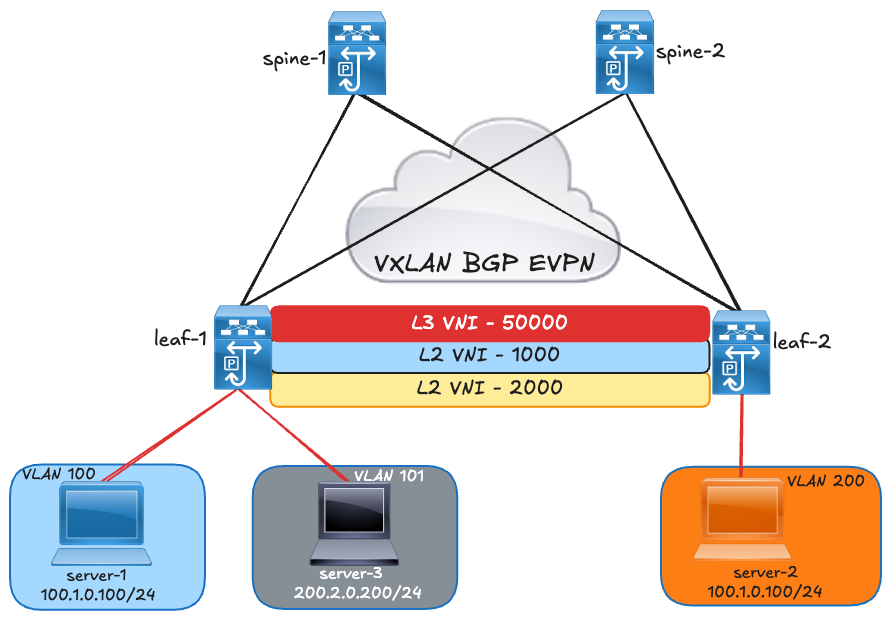

!!! note
    This lab was conducted in a controlled environment. Any configurations in a production network should be implemented during a designated maintenance window. Additionally, always refer to official Cisco documentation relevant to your specific hardware and software.

## Introduction
Virtual Extensible LAN (VXLAN) provides a mechanism to extend Layer 2 networks across a Layer 3
infrastructure using MAC-in-UDP encapsulation and tunnelling. This technology enables the creation of
virtualized and multitenant data center fabrics over a shared physical infrastructure. VXLAN enhances
workload mobility and flexibility by extending Layer 2 segments across the Layer 3 underlay network.

This lab demonstrates the complete configuration workflow for building a VXLAN fabric underlay and
overlay, including the setup required for intra-VNI (Layer 2) and inter-VNI (Layer 3) communication using
an L3 VNI. The lab also includes detailed verification steps at each stage of configuration. Additionally, a
Wireshark capture is provided to illustrate how a packet from a local endpoint is encapsulated and
transported through the VXLAN fabric to reach a remote endpoint.

## VXLAN Encapsulation and Packet Format

VXLAN defines a MAC-in-UDP encapsulation scheme where the original Layer 2 frame has a VXLAN
header added and is then placed in a UDP-IP packet. With this MAC-in-UDP encapsulation, VXLAN
tunnels Layer 2 network over Layer 3 network.

The images below show an Ethernet frame that has been encapsulated with a VXLAN header.

Exhibit 1.

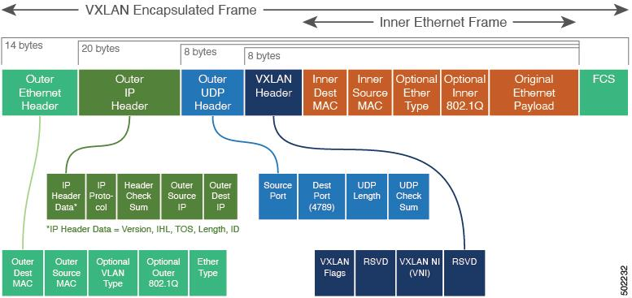

VXLAN uses an 8-byte VXLAN header that consists of a 24-bit VNID and a few reserved bits. The VXLAN
header, together with the original Ethernet frame, go inside the UDP payload. The 24-bit VNID is used to
identify Layer 2 segments and to maintain Layer 2 isolation between the segments. With all 24 bits in the
VNID, VXLAN can support 16 million LAN segments.

  I liked all three images showcasing a VXLAN packet hence l put all of them as l could not decide on a single image ☺

Exhibit 2.

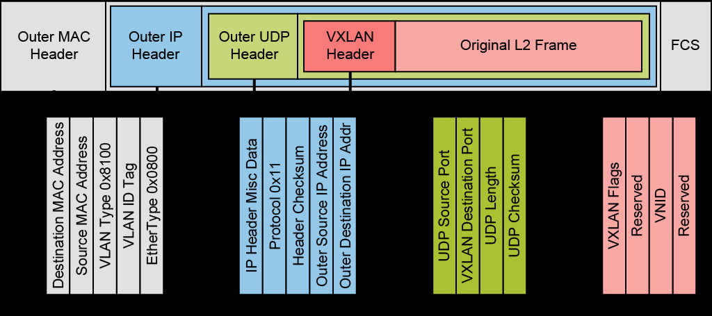

Exhibit 3.

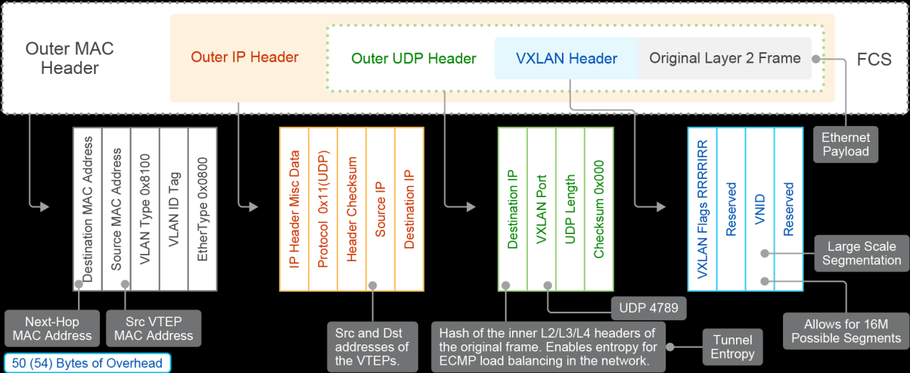

## Lab Topology

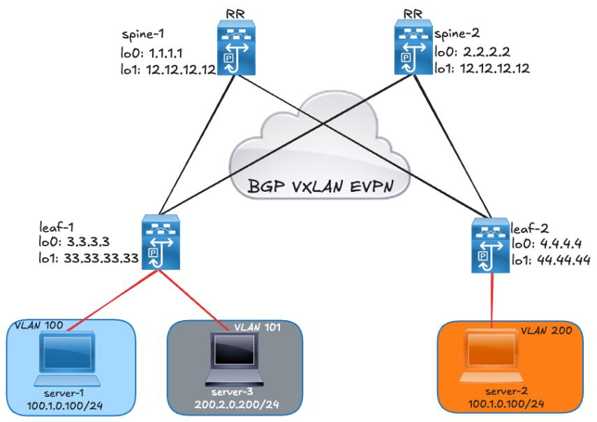

## VXLAN BGP EVPN Underlay Unicast Routing

           The underlay network in a VXLAN BGP EVPN fabric is a routed IP network that provides Layer 3 connectivity
           between the VTEPs (VXLAN Tunnel Endpoints). It is responsible for forwarding unicast traffic between
           VTEPs through VXLAN tunnels.

           In this design, VXLAN encapsulated packets are transported across the underlay based on the outer IP
           header. The source IP address in the outer header represents the initiating VTEP’s loopback interface,
           while the destination IP address corresponds to the terminating VTEP’s loopback interface. The underlay
           therefore ensures efficient IP-based transport of VXLAN traffic across the fabric, independent of the
           tenant’s Layer 2 or Layer 3 topology.

           This lab uses OSPF as the underlay routing protocol.

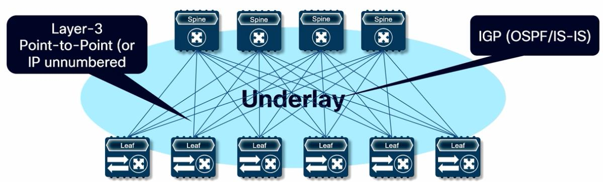

```text
SPINE-1
feature ospf
!
interface Ethernet1/3
  description to leaf-2
  mtu 9216
  ip address 10.14.14.1/30
  ip ospf network point-to-point
  ip router ospf UNDERLAY area 0.0.0.0
 no shutdown
!
interface Ethernet1/4
  description to leaf-1
  mtu 9216
  ip address 10.13.13.1/30
  ip ospf network point-to-point
  ip router ospf UNDERLAY area 0.0.0.0
 no shutdown
!
interface loopback0
  description for-vtep-reachability
  ip address 1.1.1.1/32
  ip router ospf UNDERLAY area 0.0.0.0
!
interface loopback1
  description for-mcast
  ip address 12.12.12.12/32
  ip router ospf UNDERLAY area 0.0.0.0
```

```text
SPINE-2
feature ospf
!
interface Ethernet1/3
description to leaf-1
mtu 9216
ip address 10.23.23.1/30
ip ospf network point-to-point
ip router ospf UNDERLAY area 0.0.0.0
no shutdown
!
interface Ethernet1/4
description to leaf-2
mtu 9216
ip address 10.24.24.1/30
ip ospf network point-to-point
ip router ospf UNDERLAY area 0.0.0.0
no shutdown
!
interface loopback0
description for-vtep-reachability
ip address 2.2.2.2/32
ip router ospf UNDERLAY area 0.0.0.0
!
interface loopback1
description for-mcast
ip address 12.12.12.12/32
ip router ospf UNDERLAY area 0.0.0.0
```

```text
LEAF-1
feature ospf
!
interface Ethernet1/3
  description to spine-2
  mtu 9216
  ip address 10.23.23.2/30
  ip ospf network point-to-point
  ip router ospf UNDERLAY area 0.0.0.0
 no shutdown
!
interface Ethernet1/4
  description to spine-1
  mtu 9216
  ip address 10.13.13.2/30
  ip ospf network point-to-point
  ip router ospf UNDERLAY area 0.0.0.0
  no shutdown
!
interface loopback0
  description for-vtep-reachability
  ip address 3.3.3.3/32
  ip router ospf UNDERLAY area 0.0.0.0
!
interface loopback1
  description for-vni-peering
  ip address 33.33.33.33/32
  ip router ospf UNDERLAY area 0.0.0.0
```

```text
LEAF2
feature ospf
!
interface Ethernet1/3
description to spine-1
mtu 9216
ip address 10.14.14.2/30
ip ospf network point-to-point
ip router ospf UNDERLAY area 0.0.0.0
no shutdown
!
interface Ethernet1/4
description to spine-2
mtu 9216
ip address 10.24.24.2/30
ip ospf network point-to-point
ip router ospf UNDERLAY area 0.0.0.0
no shutdown
!
interface loopback0
description for-vtep-reachability
ip address 4.4.4.4/32
ip router ospf UNDERLAY area 0.0.0.0
!
interface loopback1
description for-vni-peering
ip address 44.44.44.44/32
ip router ospf UNDERLAY area 0.0.0.0
```

           Verify OSPF routing adjacency (underlay).

```text
           Spine-1
            spine-1# show ip ospf neighbors
             OSPF Process ID UNDERLAY VRF default
             Total number of neighbors: 2
             Neighbor ID     Pri State            Up Time      Address           Interface
             4.4.4.4           1 FULL/ -          3d13h        10.14.14.2        Eth1/3
             3.3.3.3           1 FULL/ -          3d13h        10.13.13.2        Eth1/4
```

```text
           Spine-2
            spine-2# show ip ospf neighbors
             OSPF Process ID UNDERLAY VRF default
             Total number of neighbors: 2
             Neighbor ID     Pri State            Up Time      Address           Interface
             3.3.3.3           1 FULL/ -          3d13h        10.23.23.2        Eth1/3
             4.4.4.4           1 FULL/ -          3d13h        10.24.24.2        Eth1/4
```

```text
           Leaf-1
            leaf-1# show ip ospf neighbors
             OSPF Process ID UNDERLAY VRF default
             Total number of neighbors: 2
             Neighbor ID     Pri State            Up Time      Address           Interface
             2.2.2.2           1 FULL/ -          3d13h        10.23.23.1        Eth1/3
             1.1.1.1           1 FULL/ -          3d13h        10.13.13.1        Eth1/4
```

```text
           Leaf-2
            leaf-2# show ip ospf neighbors
             OSPF Process ID UNDERLAY VRF default
             Total number of neighbors: 2
             Neighbor ID     Pri State            Up Time      Address           Interface
             1.1.1.1           1 FULL/ -          3d13h        10.14.14.1        Eth1/3
             2.2.2.2           1 FULL/ -          3d13h        10.24.24.1        Eth1/4
```

## VXLAN BGP EVPN Underlay Multicast Routing

           Underlay multicast routing is used to handle Broadcast, Unknown unicast, and multicast (BUM) traffic. In
           this lab PIM ASM Sparse Mode is used. PIM Sparse mode creates one source tree per VTEP per multicast
           group. The PIM Sparse Mode uses PIM Anycast RP (RFC 4610) for RP redundancy. In a VXLAN fabric, the
           spine serves as RPs for the underlay.

```text
SPINE-1
feature pim
!
ip pim rp-address 12.12.12.12 group-list 239.0.0.0/24
ip pim anycast-rp 12.12.12.12 1.1.1.1 <spine-1 lo0>
ip pim anycast-rp 12.12.12.12 2.2.2.2 <spine-2 lo0>
!
interface Ethernet1/3
  ip pim sparse-mode
!
interface Ethernet1/4
  ip pim sparse-mode
!
interface loopback0
  ip pim sparse-mode
!
interface loopback1
  ip pim sparse-mode
```

```text
SPINE-2
feature pim
!
ip pim rp-address 12.12.12.12 group-list 239.0.0.0/24
ip pim anycast-rp 12.12.12.12 1.1.1.1 <lo1 – spine-1&2>
ip pim anycast-rp 12.12.12.12 2.2.2.2
!
interface Ethernet1/3
ip pim sparse-mode
!
interface Ethernet1/4
ip pim sparse-mode
!
interface loopback0
ip pim sparse-mode
!
interface loopback1
ip pim sparse-mode
```

```text
LEAF-1
feature pim
!
ip pim rp-address 12.12.12.12 group-list 239.0.0.0/24
!
interface Ethernet1/3
  ip pim sparse-mode
!
interface Ethernet1/4
  ip pim sparse-mode
!
interface loopback0
  ip pim sparse-mode
!
interface loopback1
  ip pim sparse-mode
```

```text
LEAF2
feature pim
!
ip pim rp-address 12.12.12.12 group-list 239.0.0.0/24
!
interface Ethernet1/3
ip pim sparse-mode
!
interface Ethernet1/4
ip pim sparse-mode
!
interface loopback0
ip pim sparse-mode
!
interface loopback1
ip pim sparse-mode
```

           Multicast Validation: check the PIM neighbors

```text
           Spine-1
            spine-1# show ip pim neighbor
            PIM Neighbor Status for VRF "default"
            Neighbor        Interface             Uptime    Expires    DR       Bidir- BFD      ECMP Redirect
                                                                       Priority Capable State       Capable
            10.14.14.2       Ethernet1/3          3d15h     00:01:34   1        yes     n/a      no
            10.13.13.2       Ethernet1/4          3d15h     00:01:31   1        yes     n/a      no
```

```text
           Spine-2
            spine-2# show ip pim neighbor
            PIM Neighbor Status for VRF "default"
            Neighbor        Interface             Uptime    Expires    DR       Bidir- BFD      ECMP Redirect
                                                                       Priority Capable State       Capable
            10.23.23.2       Ethernet1/3          3d15h     00:01:20   1        yes     n/a      no
            10.24.24.2       Ethernet1/4          3d15h     00:01:33   1        yes     n/a      no
```

```text
           Leaf-1
            leaf-1# show ip pim neighbor
            PIM Neighbor Status for VRF "default"
            Neighbor        Interface             Uptime    Expires    DR       Bidir- BFD      ECMP Redirect
                                                                       Priority Capable State       Capable
            10.23.23.1       Ethernet1/3          3d15h     00:01:18   1        yes     n/a      no
            10.13.13.1       Ethernet1/4          3d15h     00:01:28   1        yes     n/a      no
```

```text
           Leaf-2
            leaf-2# show ip pim neighbor
            PIM Neighbor Status for VRF "default"
            Neighbor        Interface             Uptime    Expires    DR       Bidir- BFD      ECMP Redirect
                                                                       Priority Capable State       Capable
            10.14.14.1       Ethernet1/3          3d15h     00:01:41   1        yes     n/a      no
            10.24.24.1       Ethernet1/4          3d15h     00:01:40   1        yes     n/a      no
```

           Verify the RP status.

```text
SPINE-1
spine-1# show ip pim rp
PIM RP Status Information for VRF "default"
BSR disabled
Auto-RP disabled
BSR RP Candidate policy: None
BSR RP policy: None
Auto-RP Announce policy: None
Auto-RP Discovery policy: None

Anycast-RP 12.12.12.12 members:
  1.1.1.1* 2.2.2.2

RP: 12.12.12.12*, (0),
 uptime: 3d17h   priority: 255,
 RP-source: (local),
 group ranges:
 239.0.0.0/24
```

```text
SPINE-2
spine-2# show ip pim rp
PIM RP Status Information for VRF "default"
BSR disabled
Auto-RP disabled
BSR RP Candidate policy: None
BSR RP policy: None
Auto-RP Announce policy: None
Auto-RP Discovery policy: None

Anycast-RP 12.12.12.12 members:
  1.1.1.1 2.2.2.2*

RP: 12.12.12.12*, (0),
 uptime: 3d03h   priority: 255,
 RP-source: (local),
 group ranges:
 239.0.0.0/24
```

```text
LEAF-1
leaf-1# show ip pim rp
PIM RP Status Information for VRF "default"
BSR disabled
Auto-RP disabled
BSR RP Candidate policy: None
BSR RP policy: None
Auto-RP Announce policy: None
Auto-RP Discovery policy: None

RP: 12.12.12.12, (0),
 uptime: 3d03h   priority: 255,
 RP-source: (local),
 group ranges:
 239.0.0.0/24
```

```text
LEAF2
leaf-2# show ip pim rp
PIM RP Status Information for VRF "default"
BSR disabled
Auto-RP disabled
BSR RP Candidate policy: None
BSR RP policy: None
Auto-RP Announce policy: None
Auto-RP Discovery policy: None

RP: 12.12.12.12, (0),
 uptime: 3d03h   priority: 255,
 RP-source: (local),
 group ranges:
 239.0.0.0/24
```

           Check the multicast routing table.

```text
           Leaf-1
            leaf-1# show ip mroute
            IP Multicast Routing Table for VRF "default"

            (*, 232.0.0.0/8), uptime: 3d14h, pim ip
              Incoming interface: Null, RPF nbr: 0.0.0.0
              Outgoing interface list: (count: 0)

            (*, 239.0.0.1/32), uptime: 3d14h, nve pim ip
              Incoming interface: Ethernet1/3, RPF nbr: 10.23.23.1
              Outgoing interface list: (count: 1)
                nve1, uptime: 3d14h, nve

            (33.33.33.33/32, 239.0.0.1/32), uptime: 3d14h, nve mrib pim ip
              Incoming interface: loopback1, RPF nbr: 33.33.33.33
              Outgoing interface list: (count: 1)
                Ethernet1/4, uptime: 3d14h, pim
```

```text
           Leaf-2
            leaf-2# show ip mroute
            IP Multicast Routing Table for VRF "default"

            (*, 232.0.0.0/8), uptime: 3d14h, pim ip
              Incoming interface: Null, RPF nbr: 0.0.0.0
              Outgoing interface list: (count: 0)

            (*, 239.0.0.1/32), uptime: 3d14h, nve pim ip
              Incoming interface: Ethernet1/3, RPF nbr: 10.14.14.1
              Outgoing interface list: (count: 1)
                nve1, uptime: 3d14h, nve

            (44.44.44.44/32, 239.0.0.1/32), uptime: 3d14h, nve mrib pim ip
              Incoming interface: loopback1, RPF nbr: 44.44.44.44
              Outgoing interface list: (count: 1)
                Ethernet1/4, uptime: 2d15h, pim
```

## VXLAN BGP EVPN Overlay Unicast Routing (Control Plane)

           In this lab, iBGP is configured between the spines and switches, i.e. the leafs and spines are part of the
           same autonomous system. The spines are configured as BGP route-reflectors. The spine's role in the
           EVPN overlay is to take the routes learned from each leaf and propagate them to the other leaves in the
           fabric. Using BGP EVPN as the control plane in the fabric allows for route learning, route distribution and
           VXLAN peer discovery.

           BGP Configurations on Spines.

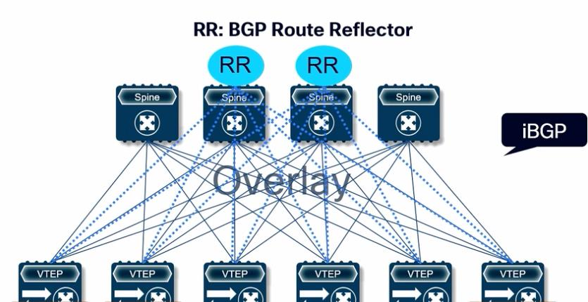

```text
SPINE-1
nv overlay evpn
!
router bgp 65000
  address-family l2vpn evpn
  neighbor 3.3.3.3
    remote-as 65000
    update-source loopback0
    address-family l2vpn evpn
      send-community
      send-community extended
      route-reflector-client
  neighbor 4.4.4.4
    remote-as 65000
    update-source loopback0
    address-family l2vpn evpn
      send-community
      send-community extended
      route-reflector-client
```

```text
SPINE-2
nv overlay evpn
!
router bgp 65000
address-family l2vpn evpn
neighbor 3.3.3.3
remote-as 65000
update-source loopback0
address-family l2vpn evpn
send-community
send-community extended
route-reflector-client
neighbor 4.4.4.4
remote-as 65000
update-source loopback0
address-family l2vpn evpn
send-community
send-community extended
route-reflector-client
```

```text
LEAF-1
feature bgp
feature nv overlay
!
route-map PERMIT-ALL
!route map to redistribute directly connected routes in
the BGP instance>
!
router bgp 65000
  address-family l2vpn evpn
  neighbor 1.1.1.1
    remote-as 65000
    update-source loopback0
    address-family l2vpn evpn
      send-community
      send-community extended
  neighbor 2.2.2.2
    remote-as 65000
    update-source loopback0
    address-family l2vpn evpn
      send-community
      send-community extended
  vrf tenant-1
    address-family ipv4 unicast
      redistribute direct route-map PERMIT-ALL
```

           BGP Configurations on Leaf Switches.

```text
LEAF2
feature bgp
feature nv overlay
!
route-map PERMIT-ALL
!route map to redistribute directly connected routes in
the BGP instance>
!
router bgp 65000
address-family l2vpn evpn
neighbor 1.1.1.1
remote-as 65000
update-source loopback0
address-family l2vpn evpn
send-community
send-community extended
neighbor 2.2.2.2
remote-as 65000
update-source loopback0
address-family l2vpn evpn
send-community
send-community extended
vrf tenant-1
address-family ipv4 unicast
redistribute direct route-map PERMIT-ALL
```

           Validate BGP

```text
           Spine-1
            spine-1# show bgp l2vpn evpn summary
            BGP summary information for VRF default, address family L2VPN EVPN
            BGP router identifier 1.1.1.1, local AS number 65000
            BGP table version is 39, L2VPN EVPN config peers 2, capable peers 2
            6 network entries and 6 paths using 1536 bytes of memory
            BGP attribute entries [5/920], BGP AS path entries [0/0]
            BGP community entries [0/0], BGP clusterlist entries [0/0]
```

```text
            Neighbor         V    AS MsgRcvd MsgSent        TblVer    InQ OutQ Up/Down State/PfxRcd
            3.3.3.3          4 65000    5154    5166            39      0    0    3d01h 0
            4.4.4.4          4 65000    5151    5164            39      0    0    3d01h 0
```

```text
           Spine-2
            spine-2# show bgp l2vpn evpn summary
            BGP summary information for VRF default, address family L2VPN EVPN
            BGP router identifier 2.2.2.2, local AS number 65000
            BGP table version is 35, L2VPN EVPN config peers 2, capable peers 2
            6 network entries and 6 paths using 1752 bytes of memory
            BGP attribute entries [5/1800], BGP AS path entries [0/0]
            BGP community entries [0/0], BGP clusterlist entries [0/0]
```

```text
            Neighbor         V    AS     MsgRcvd      MsgSent    TblVer     InQ OutQ Up/Down State/PfxRcd
            3.3.3.3          4 65000        5155         5164        35       0    0    3d01h 4
            4.4.4.4          4 65000        5154         5164        35       0    0    3d01h 2
```

```text
            Neighbor         T    AS PfxRcd        Type-2       Type-3       Type-4     Type-5
            3.3.3.3          I 65000 0             0            0            0          0
            4.4.4.4          I 65000 0             0            0            0          0
```

```text
           Leaf-1
            leaf-1# show bgp l2vpn evpn summary
            BGP summary information for VRF default, address family L2VPN EVPN
            BGP router identifier 3.3.3.3, local AS number 65000
            BGP table version is 28, L2VPN EVPN config peers 2, capable peers 2
            9 network entries and 11 paths using 2532 bytes of memory
            BGP attribute entries [11/4048], BGP AS path entries [0/0]
            BGP community entries [0/0], BGP clusterlist entries [2/8]
```

```text
            Neighbor          V    AS         MsgRcvd      MsgSent    TblVer   InQ OutQ Up/Down State/PfxRcd
            1.1.1.1           4 65000            5118         5099        28     0    0    3d01h 2
            2.2.2.2           4 65000            5114         5101        28     0    0    3d01h 2
```

```text
            Neighbor          T    AS PfxRcd            Type-2       Type-3    Type-4     Type-5     Type-12
            1.1.1.1           I 65000 0                 0            0         0          0          0
            2.2.2.2           I 65000 0                 0            0         0          0          0
```

```text
           Leaf-2
            leaf-2# show bgp l2vpn evpn summary
            BGP summary information for VRF default, address family L2VPN EVPN
            BGP router identifier 4.4.4.4, local AS number 65000
            BGP table version is 27, L2VPN EVPN config peers 2, capable peers 2
            9 network entries and 12 paths using 2532 bytes of memory
            BGP attribute entries [12/4416], BGP AS path entries [0/0]
            BGP community entries [0/0], BGP clusterlist entries [2/8]
```

```text
            Neighbor          V    AS         MsgRcvd      MsgSent    TblVer   InQ OutQ Up/Down State/PfxRcd
            1.1.1.1           4 65000            5121         5100        27     0    0    3d01h 0
            2.2.2.2           4 65000            5117         5103        27     0    0    3d01h 0
```

```text
            Neighbor          T    AS PfxRcd            Type-2       Type-3    Type-4     Type-5     Type-12
            1.1.1.1           I 65000 0                 0            0         0          0          0
            2.2.2.2           I 65000 0                 0            0         0          0          0
```

## VLAN to VNI Mapping

```text
LEAF-1
feature vn-segment-vlan-based
!
vlan 100
  vn-segment 1000
!
interface nve1
  no shutdown
  host-reachability protocol bgp
  source-interface loopback1
  member vni 1000
    mcast-group 239.0.0.1
```

```text
LEAF2
feature vn-segment-vlan-based
!
vlan 200
vn-segment 1000
!
interface nve1
no shutdown
host-reachability protocol bgp
source-interface loopback1
member vni 1000
mcast-group 239.0.0.1
```

           Note: The vn-segment command maps a VLAN to a specific VNI. This mapping is locally significant,
           which means that you can have different VLAN IDs on the other switches. The VNI ID is the only
           parameter that is globally significant.

           The configured segments are associated to a multicast group for multi-destination traffic.

           Verify the nve interface status.

```text
LEAF-1
leaf-1# show interface nve1
nve1 is up
admin state is up, Hardware: NVE
  MTU 9216 bytes
  Encapsulation VXLAN
```

```text
LEAF2
leaf-2# show interface nve1
nve1 is up
admin state is up, Hardware: NVE
MTU 9216 bytes
Encapsulation VXLAN
```

           Verify the nve interface components:

           VNIs associated in the NVE.

```text
           Leaf-1
            leaf-1# show nve vni
            Codes: CP - Control Plane        DP - Data Plane
                   UC - Unconfigured         SA - Suppress ARP
                   S-ND - Suppress ND
                   SU - Suppress Unknown Unicast
                   Xconn - Crossconnect
                   MS-IR - Multisite Ingress Replication
                   HYB - Hybrid IRB mode

            Interface VNI      Multicast-group   State Mode Type [BD/VRF]      Flags
            --------- -------- ----------------- ----- ---- ------------------ -----
            nve1      1000     239.0.0.1         Up    CP   L2 [100]
```

```text
           Leaf-2
            leaf-2# show nve vni
            Codes: CP - Control Plane        DP - Data Plane
                   UC - Unconfigured         SA - Suppress ARP
                   S-ND - Suppress ND
                   SU - Suppress Unknown Unicast
                   Xconn - Crossconnect
                   MS-IR - Multisite Ingress Replication
                   HYB - Hybrid IRB mode

            Interface VNI      Multicast-group   State Mode Type [BD/VRF]      Flags
            --------- -------- ----------------- ----- ---- ------------------ -----
            nve1      1000     239.0.0.1         Up    CP   L2 [200]
```

           To verify the NVE peers on a VTEP, use the show nve peers command. Notice that the output below in
           the LearnType column indicates CP. CP stands for control plane learning, meaning the NVE peer was
           learned dynamically using BGP EVPN.

```text
           Leaf-1
            leaf-1# show nve peers
            Interface Peer-IP                                     State LearnType Uptime   Router-Mac
            --------- --------------------------------------      ----- --------- -------- -----------------
            nve1      44.44.44.44                                 Up    CP        3d00h    3488.1815.5425
```

```text
           Leaf-2
            leaf-2# show nve peers
            Interface Peer-IP                                     State LearnType Uptime   Router-Mac
            --------- --------------------------------------      ----- --------- -------- -----------------
            nve1      33.33.33.33                                 Up    CP        3d00h    3488.1815.561f
```

           Verify the configured VLAN-to-VN-Segment mappings.

```text
LEAF-1
leaf-1# show vlan id 100 vn-segment

VLAN Segment-id
---- -----------
100 1000
```

```text
LEAF2
leaf-2#   show vlan id 200 vn-segment

VLAN Segment-id
---- -----------
200 1000
```

## Layer 3 VNI Configuration
             A Layer 3 VNI to route traffic between Layer 2 VNIs. The first step is to define the VRF (tenant) where the
             subnets will be members. The L3 VNI will be defined under the VRF context.

```text
LEAF-1
vrf context tenant-1
  vni 50000 l3
  rd auto
  address-family ipv4 unicast
    route-target both auto
    route-target both auto evpn
```

```text
LEAF2
vrf context tenant-1
  vni 50000 l3
  rd auto
  address-family ipv4 unicast
    route-target both auto
    route-target both auto evpn
```

                Note
                Beginning with Cisco NX-OS Release 10.2(3)F, the new L3VNI mode is supported on Cisco Nexus 9000 switches. The
                new CLI for L3 VNI does not require mapping a VLAN to L3VNI, which also removes the requirement to provision an
                SVI interface, saving on VLANs and increasing the scale of VNIs supported on a given leaf node

             The L3 VNI is associated to the VRF.

```text
LEAF-1
interface nve1
  no shutdown
  member vni 50000 associate-vrf
```

```text
LEAF2
interface nve1
no shutdown
member vni 50000 associate-vrf
```

             Displays VRFs and associated VNIs.

```text
LEAF-1
leaf-1# show nve vrf
VRF-Name     VNI        Interface Gateway-MAC
------------ ---------- --------- -----------------
tenant-1     50000      nve1      3488.1815.561f
```

```text
LEAF2
leaf-2# show nve vrf
VRF-Name     VNI        Interface Gateway-MAC
------------ ---------- --------- -----------------
tenant-1     50000      nve1      3488.1815.5425
```

             Display the new L3VNI mode configuration information.

```text
LEAF-1
leaf-1# show nve vni
Codes: CP - Control Plane        DP - Data Plane
       UC - Unconfigured         SA - Suppress ARP
       S-ND - Suppress ND
       SU - Suppress Unknown Unicast
       Xconn - Crossconnect
       MS-IR - Multisite Ingress Replication
       HYB - Hybrid IRB mode

Interface VNI      Multicast-group   State Mode Type [BD/VRF]
Flags
--------- -------- ----------------- ----- ---- ----------------
nve1      1000     239.0.0.1         Up    CP   L2 [100]
nve1      50000    n/a               Up    CP   L3 [tenant-1]
```

```text
LEAF2
leaf-2# show nve vni
Codes: CP - Control Plane        DP - Data Plane
UC - Unconfigured         SA - Suppress ARP
S-ND - Suppress ND
SU - Suppress Unknown Unicast
Xconn - Crossconnect
MS-IR - Multisite Ingress Replication
HYB - Hybrid IRB mode

Interface VNI      Multicast-group   State Mode Type [BD/VRF]
Flags
--------- -------- ----------------- ----- ---- ----------------
nve1      1000     239.0.0.1         Up    CP   L2 [200]
nve1      50000    n/a               Up    CP   L3 [tenant-1]
```

## Anycast Gateway Configuration

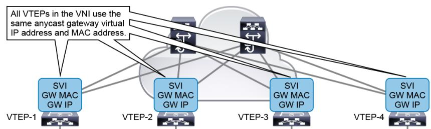

             The Anycast Gateway feature is a default gateway-addressing mechanism that enables you to use the
             same gateway IP addresses across all the leaf switches that are part of a VXLAN network. Every VTEP is
             assigned the same anycast gateway MAC address for every L2 VNI SVI interface. This feature gives you
             flexibility to put a workload to any leaf switch. It allows host mobility and optimal traffic forwarding.

```text
LEAF-1
feature interface-vlan
!
fabric forwarding
!
interface Vlan100
  no shutdown
  vrf member tenant-1
  ip address 100.1.0.254/24
  fabric forwarding mode anycast-gateway
```

```text
LEAF2
feature interface-vlan
!
fabric forwarding anycast-gateway-mac 0002.0002.0002
!
interface Vlan200
no shutdown
vrf member tenant-1
ip address 100.1.0.254/24
fabric forwarding mode anycast-gateway
```

```text
LEAF-1
leaf-1# show ip interface brief vrf tenant-1
IP Interface Status for VRF "tenant-1"(4)
Interface          IP Address      Interface Status
Vlan100            100.1.0.254     protocol-up/link-up/admin-up
Vni50000           forward-enabled protocol-up/link-up/admin-up
```

```text
LEAF-2
leaf-2# show ip interface brief vrf tenant-1
IP Interface Status for VRF "tenant-1"(4)
Interface          IP Address      Interface Status
Vlan200            100.1.0.254     protocol-up/link-up/admin-up
Vni50000           forward-enabled protocol-up/link-up/admin-up
```

## Layer 2 Communication

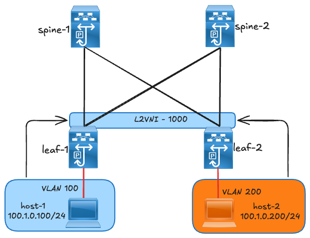

             This section will verify endpoint learning on each switch, verify endpoint communication across the fabric
             and the packet walk from the source endpoint to the destination endpoint across the fabric.

            Check the MAC address of each leaf.
            The output shows that each leaf has MAC address information for its locally connected endpoints and
            MAC address information for the remote endpoint.

```text
            Leaf-1
             leaf-1# show mac address-table dynamic
             Legend:
                     * - primary entry, G - Gateway MAC, (R) - Routed MAC, O - Overlay MAC
                     age - seconds since last seen,+ - primary entry using vPC Peer-Link,
                     (T) - True, (F) - False, C - ControlPlane MAC, ~ - vsan,
                     (NA)- Not Applicable A – ESI Active Path, S – ESI Standby Path
                VLAN     MAC Address      Type      age     Secure NTFY Ports
             ---------+-----------------+--------+---------+------+----+------------------
             C 100      00ee.abd0.9197   dynamic NA          F      F    nve1(44.44.44.44)
             * 100      10b3.d6cb.77e7   dynamic NA          F      F    Eth1/33
```

```text
            Leaf-2
             leaf-2# show mac address-table dynamic
             Legend:
                     * - primary entry, G - Gateway MAC, (R) - Routed MAC, O - Overlay MAC
                     age - seconds since last seen,+ - primary entry using vPC Peer-Link,
                     (T) - True, (F) - False, C - ControlPlane MAC, ~ - vsan,
                     (NA)- Not Applicable A – ESI Active Path, S – ESI Standby Path
                VLAN     MAC Address      Type      age     Secure NTFY Ports
             ---------+-----------------+--------+---------+------+----+------------------
             * 200      00ee.abd0.9197   dynamic NA          F      F    Eth1/34
             C 200      10b3.d6cb.77e7   dynamic NA          F      F    nve1(33.33.33.33)
```

            Check the routing table on each leaf.
            The routing table on each leaf for the respective tenant shows the endpoints IP addresses that are
            learned from BGP.

```text
            Leaf-1
leaf-1# show ip route vrf tenant-1
IP Route Table for VRF "tenant-1"
'*' denotes best ucast next-hop
'[x/y]' denotes [preference/metric]
'%<string>' in via output denotes VRF <string>

100.1.0.0/24, ubest/mbest: 1/0, attached
    *via 100.1.0.254, Vlan100, [0/0], 2d13h, direct
100.1.0.100/32, ubest/mbest: 1/0, attached
    *via 100.1.0.100, Vlan100, [190/0], 2d13h, hmm
100.1.0.200/32, ubest/mbest: 1/0
    *via 44.44.44.44%default, [200/0], 00:28:46, bgp-65000, internal, tag 65000, segid: 50000 tunnelid: 0x2c2c2c2c
encap: VXLAN <remote endpoint learned via BGP>

100.1.0.254/32, ubest/mbest: 1/0, attached
    *via 100.1.0.254, Vlan100, [0/0], 2d13h, local
```

```text
            Leaf-2
leaf-2# show ip route vrf tenant-1
IP Route Table for VRF "tenant-1"
100.1.0.0/24, ubest/mbest: 1/0, attached
    *via 100.1.0.254, Vlan200, [0/0], 2d13h, direct
100.1.0.100/32, ubest/mbest: 1/0

    *via 33.33.33.33%default, [200/0], 00:26:35, bgp-65000, internal, tag 65000, segid: 50000 tunnelid: 0x21212121
encap: VXLAN <remote endpoint learned via BGP>

100.1.0.200/32, ubest/mbest: 1/0, attached
    *via 100.1.0.200, Vlan200, [190/0], 2d13h, hmm
100.1.0.254/32, ubest/mbest: 1/0, attached
    *via 100.1.0.254, Vlan200, [0/0], 2d13h, local
```

            Check the BGP table on each leaf.
            The BGP table of each leaf shows that each leaf successfully advertised and learned Type-2 (MAC/IP
            routes) and Type-5 (IP prefix routes) over the EVPN control plane.

```text
            Leaf-1
leaf-1# show bgp l2vpn evpn
BGP routing table information for VRF default, address family L2VPN EVPN
BGP table version is 30, Local Router ID is 3.3.3.3
Status: s-suppressed, x-deleted, S-stale, d-dampened, h-history, *-valid, >-best
Path type: i-internal, e-external, c-confed, l-local, a-aggregate, r-redist, I-injected
Origin codes: i - IGP, e - EGP, ? - incomplete, | - multipath, & - backup, 2 - best2
```

```text
   Network            Next Hop            Metric     LocPrf         Weight Path
Route Distinguisher: 3.3.3.3:32867    (L2VNI 1000)
*>i[2]:[0]:[0]:[48]:[00ee.abd0.9197]:[0]:[0.0.0.0]/216
                      44.44.44.44                       100               0 i
*>l[2]:[0]:[0]:[48]:[10b3.d6cb.77e7]:[0]:[0.0.0.0]/216
                      33.33.33.33                       100          32768 i
*>i[2]:[0]:[0]:[48]:[00ee.abd0.9197]:[32]:[100.1.0.200]/272
                      44.44.44.44                       100               0 i <remote-endpoint from leaf-2>
*>l[2]:[0]:[0]:[48]:[10b3.d6cb.77e7]:[32]:[100.1.0.100]/272
                      33.33.33.33                       100          32768 i <local endpoint>
```

```text
Route Distinguisher: 4.4.4.4:32967
* i[2]:[0]:[0]:[48]:[00ee.abd0.9197]:[0]:[0.0.0.0]/216
                      44.44.44.44                       100               0 i
*>i                   44.44.44.44                       100               0 i
*>i[2]:[0]:[0]:[48]:[00ee.abd0.9197]:[32]:[100.1.0.200]/272
                      44.44.44.44                       100               0 i
* i                   44.44.44.44                       100               0 i
Route Distinguisher: 3.3.3.3:4    (L3VNI 50000)
*>i[2]:[0]:[0]:[48]:[00ee.abd0.9197]:[32]:[100.1.0.200]/272
                      44.44.44.44                       100               0 i <remote-endpoint from leaf-2>
*>l[5]:[0]:[0]:[24]:[100.1.0.0]/224
                      33.33.33.33              0        100          32768 ?
```

```text
            Leaf-2
leaf-2# show bgp l2vpn evpn
BGP routing table information for VRF default, address family L2VPN EVPN
BGP table version is 30, Local Router ID is 4.4.4.4
Status: s-suppressed, x-deleted, S-stale, d-dampened, h-history, *-valid, >-best
Path type: i-internal, e-external, c-confed, l-local, a-aggregate, r-redist, I-injected
Origin codes: i - IGP, e - EGP, ? - incomplete, | - multipath, & - backup, 2 - best2
```

```text
   Network            Next Hop              Metric      LocPrf      Weight Path
Route Distinguisher: 3.3.3.3:4
*>i[5]:[0]:[0]:[24]:[100.1.0.0]/224
                      33.33.33.33                0         100            0 ?
* i                   33.33.33.33                0         100            0 ?
*>i[5]:[0]:[0]:[24]:[200.2.0.0]/224
                      33.33.33.33                0         100            0 ?
* i                   33.33.33.33                 0         100           0 ?

Route Distinguisher: 3.3.3.3:32867
* i[2]:[0]:[0]:[48]:[10b3.d6cb.77e7]:[0]:[0.0.0.0]/216
                      33.33.33.33                       100               0 i
*>i                   33.33.33.33                       100               0 i
*>i[2]:[0]:[0]:[48]:[10b3.d6cb.77e7]:[32]:[100.1.0.100]/272
                      33.33.33.33                       100               0 i
* i                   33.33.33.33                       100               0 i
```

```text
Route Distinguisher: 4.4.4.4:32967    (L2VNI 1000)
*>l[2]:[0]:[0]:[48]:[00ee.abd0.9197]:[0]:[0.0.0.0]/216
                      44.44.44.44                       100           32768 i
*>i[2]:[0]:[0]:[48]:[10b3.d6cb.77e7]:[0]:[0.0.0.0]/216
                      33.33.33.33                       100               0 i
*>l[2]:[0]:[0]:[48]:[00ee.abd0.9197]:[32]:[100.1.0.200]/272
                      44.44.44.44                       100           32768 i
*>i[2]:[0]:[0]:[48]:[10b3.d6cb.77e7]:[32]:[100.1.0.100]/272
                      33.33.33.33                       100               0 i <remote-endpoint from leaf-1>
Route Distinguisher: 4.4.4.4:4    (L3VNI 50000)
*>i[2]:[0]:[0]:[48]:[10b3.d6cb.77e7]:[32]:[100.1.0.100]/272
                      33.33.33.33                       100               0 i
*>i[5]:[0]:[0]:[24]:[100.1.0.0]/224
                      33.33.33.33              0        100               0 ?
```

            Verify the Layer 2 routing table for EVPN. The table displays how the MAC address of an endpoint was
            learned, the next-hop IP address, and the VNI tag.

```text
            Leaf-1
leaf-1# show l2route evpn mac all
Flags -(Rmac):Router MAC (Stt):Static (L):Local (R):Remote
(Dup):Duplicate (Spl):Split (Rcv):Recv (AD):Auto-Delete (D):Del Pending
(S):Stale (C):Clear, (Ps):Peer Sync (O):Re-Originated (Nho):NH-Override
(Asy):Asymmetric (Gw):Gateway
(Bh):Blackhole, (Dum):Dummy
(Pf):Permanently-Frozen, (Orp): Orphan
```

```text
(PipOrp): Directly connected Orphan to PIP based vPC BGW
(PipPeerOrp): Orphan connected to peer of PIP based vPC BGW
Topology    Mac Address    Prod   Flags              Seq No     Next-Hops
----------- -------------- ------ ------------------ ---------- -----------------------------------------------------
100         00ee.abd0.9197 BGP    SplRcv             0          44.44.44.44 (Label: 1000)
100         10b3.d6cb.77e7 Local L,                  0          Eth1/33
8193        3488.1815.5425 VXLAN Rmac,               0          44.44.44.44
```

```text
            Leaf-2
leaf-2# show l2route evpn mac all
Flags -(Rmac):Router MAC (Stt):Static (L):Local (R):Remote
(Dup):Duplicate (Spl):Split (Rcv):Recv (AD):Auto-Delete (D):Del Pending
(S):Stale (C):Clear, (Ps):Peer Sync (O):Re-Originated (Nho):NH-Override
(Asy):Asymmetric (Gw):Gateway
(Bh):Blackhole, (Dum):Dummy
(Pf):Permanently-Frozen, (Orp): Orphan
```

```text
(PipOrp): Directly connected Orphan to PIP based vPC BGW
(PipPeerOrp): Orphan connected to peer of PIP based vPC BGW
Topology    Mac Address    Prod   Flags              Seq No     Next-Hops
----------- -------------- ------ ------------------ ---------- -----------------------------------------------------
200          00ee.abd0.9197 Local     L,                    0          Eth1/34
200          10b3.d6cb.77e7 BGP       SplRcv                0          33.33.33.33 (Label: 1000)
8193         3488.1815.561f VXLAN     Rmac,                 0          33.33.33.33
```

              Display the VRF associated with an L2VNI.

```text
LEAF-1
 leaf-1# show bgp evi 1000
 -----------------------------------------------
   L2VNI ID                     : 1000 (L2-1000)
   RD                           : 3.3.3.3:32867
   Prefixes (local/total)       : 2/4
   Created                      : Oct 6 16:32:41.058384
   Last Oper Up/Down            : Oct 6 16:32:41.060408 / never
   Enabled                      : Yes
   Associated IP-VRF            : tenant-1
   Active Export RT list        :
         65000:1000
   Active Import RT list        :
         65000:1000
```

```text
LEAF-2
leaf-2# show bgp evi 1000
-----------------------------------------------
L2VNI ID                     : 1000 (L2-1000)
RD                           : 4.4.4.4:32967
Prefixes (local/total)       : 2/4
Created                      : Oct 6 16:28:48.924753
Last Oper Up/Down            : Oct 6 16:28:48.956189 / never
Enabled                      : Yes
Associated IP-VRF            : tenant-1
Active Export RT list        :
65000:1000
Active Import RT list        :
65000:1000
```

```text
              The Hosts can successfully ping each other.
Server-1                                                            Server-2
 PING 100.1.0.200 (100.1.0.200) from 100.1.0.100: 56 data bytes     PING 100.1.0.100 (100.1.0.100) from 100.1.0.200: 56 data bytes
 64 bytes from 100.1.0.200: icmp_seq=0 ttl=254 time=1.351 ms        64 bytes from 100.1.0.100: icmp_seq=0 ttl=254 time=1.24 ms
 64 bytes from 100.1.0.200: icmp_seq=1 ttl=254 time=0.865 ms        64 bytes from 100.1.0.100: icmp_seq=1 ttl=254 time=0.86 ms
 64 bytes from 100.1.0.200: icmp_seq=2 ttl=254 time=0.85 ms         64 bytes from 100.1.0.100: icmp_seq=2 ttl=254 time=0.866 ms
 64 bytes from 100.1.0.200: icmp_seq=3 ttl=254 time=0.773 ms        64 bytes from 100.1.0.100: icmp_seq=3 ttl=254 time=0.83 ms
 64 bytes from 100.1.0.200: icmp_seq=4 ttl=254 time=0.977 ms        64 bytes from 100.1.0.100: icmp_seq=4 ttl=254 time=0.834 ms
```

```text
 --- 100.1.0.200 ping statistics ---                                --- 100.1.0.100 ping statistics ---
 5 packets transmitted, 5 packets received, 0.00% packet loss       5 packets transmitted, 5 packets received, 0.00% packet loss
 round-trip min/avg/max = 0.773/0.963/1.351 ms                      round-trip min/avg/max = 0.83/0.926/1.24 ms
```

              From a packet walk point of view:
                 1. Server-1 (100.1.0.100) initiated communication to Server-2 (100.1.0.200)

              As this was the first time the servers were communication, Server-1 sent an ARP (request) which is
              Broadcast packet.

              Packet on the Ethernet segment (between leaf and server-1):

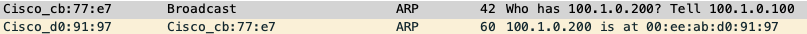

              This original Ethernet packet was the encapsulated with a VXLAN header, so that it can be sent to the
              other leaf switches with hosts in the same VNI segment.

              From the packet there are additional headers:

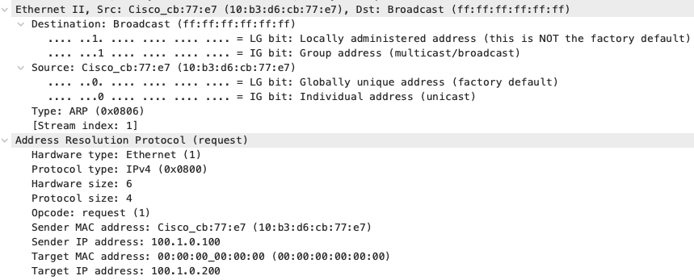

    1. VXLAN header showing the VXLAN network ID (VNI) – 1000
    2. A UDP packet with a random source port and a known VXLAN destination port of 4789.
    3. An outer IP header that enables a packet to traverse in the VXLAN fabric. This IPv4 packet has a
       source IP address (33.33.33.33) which is the nve1/loopback1 IP address of leaf-1 and the
       destination IP address is (239.0.0.1) which is the multicast group address that is associated with
       the VNI-1000. All multi-destination packets for a particular segment in a VXLAN fabric will be
       destined to the defined multicast group address.

When host-2 is identified to be located at leaf-2, leaf-2 encapsulates the packet with the outer headers

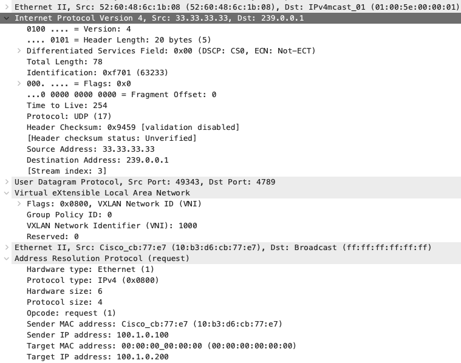

(VLXAN, UDP, outer IP and outer MAC). In the outer IP header, the source IP is the nve/loopback1 IP
address (44.44.44.44) of leaf-2 and destination IP address is the nve1/loopback1 IP address of the leaf-1
(33.33.33.33). This shows that a tunnel of communication is now between leaf-1 and leaf-2 since an ARP
reply is a unicast packet.

The ARP payload indicates that the target MAC (MAC address of server-2 is resolved).

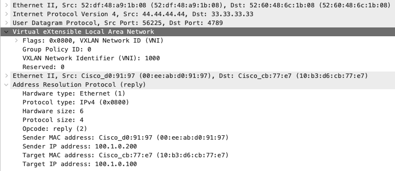

Expanded packet headers (below):

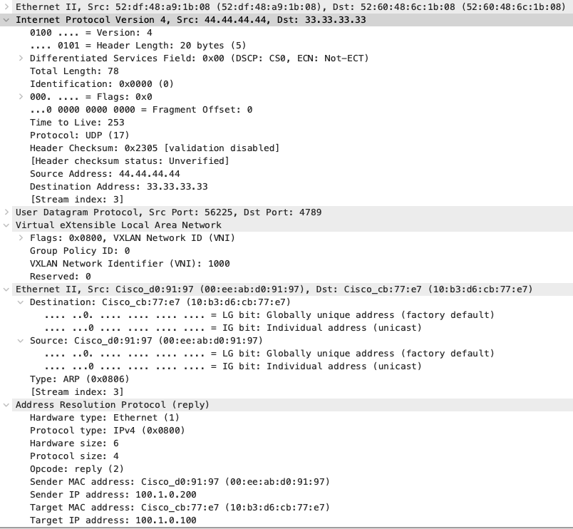

ICMP between the 2 servers is achieved:

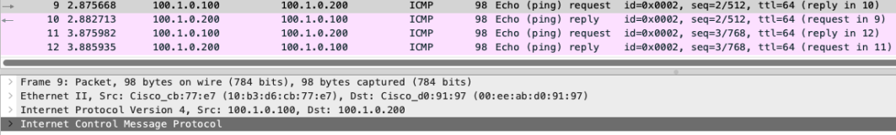

Overall, the packet capture confirms successful VXLAN encapsulation of Layer-2 traffic within an
IP/UDP/VXLAN header. The inner ARP request from source 10b3.d6cb.77e7 (IP 100.1.0.100) to target
100.1.0.200 is encapsulated by the VTEP with source IP 33.33.33.33 and destination IP 44.44.44.44.
The VXLAN header indicates VNI 1000, corresponding to the L2VNI used for the tenant segment. This
verifies that the leaf switch is correctly encapsulating local Layer-2 frames into VXLAN packets for
transport across the underlay network, enabling Layer-2 adjacency between remote endpoints.

## Layer 3 Communication

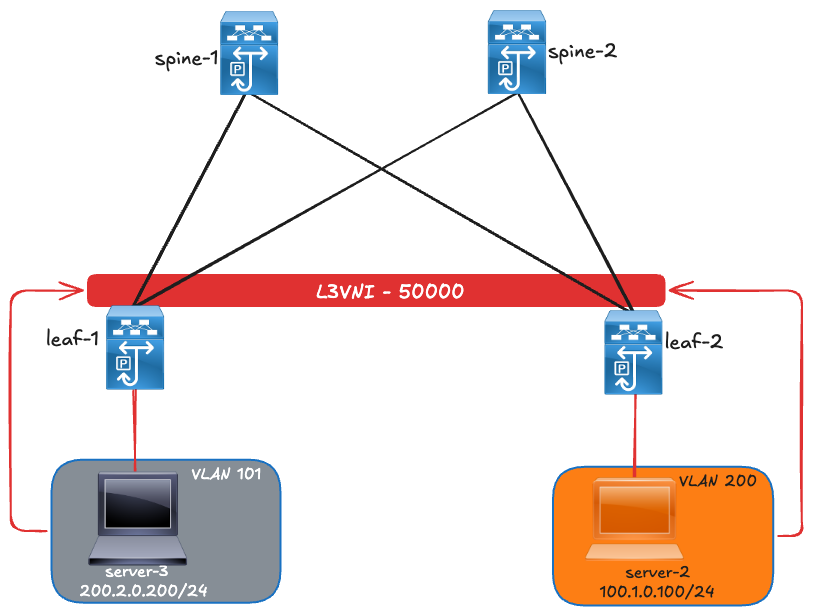

To achieve Layer 3 communication, additional configurations will be added.

An additional server (server-3) in a different L2 segment (VNI 2000) with a local VLAN 101 is added on
leaf-1

```text
Leaf-1
 vlan 101
  vn-segment 2000
!
interface Vlan101
  no shutdown
  vrf member tenant-1
  ip address 200.2.0.254/24
  fabric forwarding mode anycast-gateway
!
interface nve1
  no shutdown
  member vni 2000
    mcast-group 239.0.0.1
```

leaf-1# show ip interface brief vrf tenant-1

```text
Leaf-1
leaf-1# show ip interface brief vrf tenant-1
IP Interface Status for VRF "tenant-1"(4)
Interface            IP Address      Interface Status
Vlan100              100.1.0.254     protocol-up/link-up/admin-up
Vlan101              200.2.0.254     protocol-up/link-up/admin-up
Vni50000             forward-enabled protocol-up/link-up/admin-up
```

```text
Leaf-1
leaf-1# show nve vni
Codes: CP - Control Plane        DP - Data Plane
       UC - Unconfigured         SA - Suppress ARP
       S-ND - Suppress ND
       SU - Suppress Unknown Unicast

                     Xconn - Crossconnect
                     MS-IR - Multisite Ingress Replication
                     HYB - Hybrid IRB mode

             Interface VNI      Multicast-group   State Mode Type [BD/VRF]      Flags
             --------- -------- ----------------- ----- ---- ------------------ -----
             nve1      1000     239.0.0.1         Up    CP   L2 [100]
             nve1      2000     239.0.0.1         Up    CP   L2 [101]
             nve1      50000    n/a               Up    CP   L3 [tenant-1]
```

            Display the VRF associated with an L2VNI.

```text
LEAF-1
leaf-1# show bgp evi 1000
-----------------------------------------------
  L2VNI ID                     : 1000 (L2-1000)
  RD                           : 3.3.3.3:32867
  Prefixes (local/total)       : 2/4
  Created                      : Oct 6 16:32:41.058384
  Last Oper Up/Down            : Oct 6 16:32:41.060408 / never
  Enabled                      : Yes
  Associated IP-VRF            : tenant-1
  Active Export RT list        :
        65000:1000
  Active Import RT list        :
        65000:1000
leaf-1#
leaf-1# show bgp evi 2000
-----------------------------------------------
  L2VNI ID                     : 2000 (L2-2000)
  RD                           : 3.3.3.3:32868
  Prefixes (local/total)       : 2/2
  Created                      : Oct 6 16:32:41.060528
  Last Oper Up/Down            : Oct 6 16:32:41.060627 / never
  Enabled                      : Yes
  Associated IP-VRF            : tenant-1
  Active Export RT list        :
        65000:2000
  Active Import RT list        :
        65000:2000
```

```text
LEAF-2
leaf-2# show bgp evi 1000
-----------------------------------------------
  L2VNI ID                     : 1000 (L2-1000)
  RD                           : 4.4.4.4:32967
  Prefixes (local/total)       : 2/4
  Created                      : Oct 6 16:28:48.924753
  Last Oper Up/Down            : Oct 6 16:28:48.956189 / never
  Enabled                      : Yes
  Associated IP-VRF            : tenant-1
  Active Export RT list        :
        65000:1000
  Active Import RT list        :
        65000:1000
```

```text
            Local endpoint MAC address
             leaf-1# show mac address-table dynamic
             Legend:
                     * - primary entry, G - Gateway MAC, (R) - Routed MAC, O - Overlay MAC
                     age - seconds since last seen,+ - primary entry using vPC Peer-Link,
                     (T) - True, (F) - False, C - ControlPlane MAC, ~ - vsan
                VLAN     MAC Address      Type      age     Secure NTFY Ports
             ---------+-----------------+--------+---------+------+----+------------------
             C 100      00ee.abd0.9197   dynamic 0          F      F    nve1(44.44.44.44)
             * 100      10b3.d6cb.77e7   dynamic 0          F      F    Eth1/33
             * 101      00ee.abd0.3333   dynamic 0          F      F    Eth1/34
```

```text
             Leaf-1
             leaf-1# show ip route vrf tenant-1
             IP Route Table for VRF "tenant-1"
             '*' denotes best ucast next-hop
             '**' denotes best mcast next-hop
             '[x/y]' denotes [preference/metric]
             '%<string>' in via output denotes VRF <string>

             100.1.0.0/24, ubest/mbest: 1/0, attached
                 *via 100.1.0.254, Vlan100, [0/0], 2d17h, direct

100.1.0.100/32, ubest/mbest: 1/0, attached
    *via 100.1.0.100, Vlan100, [190/0], 2d17h, hmm
100.1.0.200/32, ubest/mbest: 1/0
    *via 44.44.44.44%default, [200/0], 04:17:36, bgp-65000, internal, tag 65000, segid: 50000 tunnelid: 0x2c2c2c2c
encap: VXLAN

100.1.0.254/32, ubest/mbest: 1/0, attached
    *via 100.1.0.254, Vlan100, [0/0], 2d17h, local
200.2.0.0/24, ubest/mbest: 1/0, attached.              <New subnet is now present in the routing table>
    *via 200.2.0.254, Vlan101, [0/0], 00:09:50, direct
200.2.0.200/32, ubest/mbest: 1/0, attached
    *via 200.2.0.200, Vlan101, [190/0], 00:03:32, hmm
200.2.0.254/32, ubest/mbest: 1/0, attached
    *via 200.2.0.254, Vlan101, [0/0], 00:09:50, local
```

```text
Leaf-2
leaf-2# show ip route vrf tenant-1
IP Route Table for VRF "tenant-1"
'*' denotes best ucast next-hop
'**' denotes best mcast next-hop
'[x/y]' denotes [preference/metric]
'%<string>' in via output denotes VRF <string>

100.1.0.0/24, ubest/mbest: 1/0, attached
    *via 100.1.0.254, Vlan200, [0/0], 2d17h, direct
100.1.0.100/32, ubest/mbest: 1/0
    *via 33.33.33.33%default, [200/0], 04:18:10, bgp-65000, internal, tag 65000, segid: 50000 tunnelid: 0x21212121
encap: VXLAN

100.1.0.200/32, ubest/mbest: 1/0, attached
    *via 100.1.0.200, Vlan200, [190/0], 2d17h, hmm
100.1.0.254/32, ubest/mbest: 1/0, attached
    *via 100.1.0.254, Vlan200, [0/0], 2d17h, local
200.2.0.0/24, ubest/mbest: 1/0
    *via 33.33.33.33%default, [200/0], 00:09:47, bgp-65000, internal, tag 65000, segid: 50000 tunnelid: 0x21212121
encap: VXLAN

200.2.0.200/32, ubest/mbest: 1/0
    *via 33.33.33.33%default, [200/0], 1d01h, bgp-65000, internal, tag 65000, segid: 50000 tunnelid: 0x21212121
encap: VXLAN
```

```text
Leaf-1
leaf-1# show bgp l2vpn evpn
BGP routing table information for VRF default, address family L2VPN EVPN
BGP table version is 38, Local Router ID is 3.3.3.3
Status: s-suppressed, x-deleted, S-stale, d-dampened, h-history, *-valid, >-best
Path type: i-internal, e-external, c-confed, l-local, a-aggregate, r-redist, I-injected
Origin codes: i - IGP, e - EGP, ? - incomplete, | - multipath, & - backup, 2 - best2
```

```text
   Network            Next Hop            Metric     LocPrf              Weight Path
Route Distinguisher: 3.3.3.3:32867    (L2VNI 1000)
*>i[2]:[0]:[0]:[48]:[00ee.abd0.9197]:[0]:[0.0.0.0]/216
                      44.44.44.44                       100                   0 i
*>l[2]:[0]:[0]:[48]:[10b3.d6cb.77e7]:[0]:[0.0.0.0]/216
                      33.33.33.33                       100               32768 i
*>i[2]:[0]:[0]:[48]:[00ee.abd0.9197]:[32]:[100.1.0.200]/272
                      44.44.44.44                       100                   0 i
*>l[2]:[0]:[0]:[48]:[10b3.d6cb.77e7]:[32]:[100.1.0.100]/272
                      33.33.33.33                       100               32768 i
```

```text
Route Distinguisher: 3.3.3.3:32868    (L2VNI 2000)
*>l[2]:[0]:[0]:[48]:[00ee.abd0.3333]:[0]:[0.0.0.0]/216
                      33.33.33.33                       100               32768 i
*>l[2]:[0]:[0]:[48]:[00ee.abd0.3333]:[32]:[200.2.0.200]/272
                      33.33.33.33                       100               32768 i
Route Distinguisher: 4.4.4.4:32967

* i[2]:[0]:[0]:[48]:[00ee.abd0.9197]:[0]:[0.0.0.0]/216
                      44.44.44.44                       100                 0 i
*>i                   44.44.44.44                       100                 0 i
*>i[2]:[0]:[0]:[48]:[00ee.abd0.9197]:[32]:[100.1.0.200]/272
                      44.44.44.44                       100                 0 i
* i                   44.44.44.44                       100                 0 i

```text
Route Distinguisher: 3.3.3.3:4    (L3VNI 50000)
*>i[2]:[0]:[0]:[48]:[00ee.abd0.9197]:[32]:[100.1.0.200]/272
                      44.44.44.44                       100                 0 i
* i[5]:[0]:[0]:[24]:[100.1.0.0]/224
                      44.44.44.44               0       100                 0 ?
*>l                   33.33.33.33              0        100             32768 ?
*>l[5]:[0]:[0]:[24]:[200.2.0.0]/224
                      33.33.33.33               0       100             32768 ?
```

```text
Leaf-2
leaf-2# show bgp l2vpn evpn
BGP routing table information for VRF default, address family L2VPN EVPN
BGP table version is 56, Local Router ID is 4.4.4.4
Status: s-suppressed, x-deleted, S-stale, d-dampened, h-history, *-valid, >-best
Path type: i-internal, e-external, c-confed, l-local, a-aggregate, r-redist, I-injected
Origin codes: i - IGP, e - EGP, ? - incomplete, | - multipath, & - backup, 2 - best2
```

```text
   Network            Next Hop                 Metric      LocPrf      Weight Path
Route Distinguisher: 3.3.3.3:4
*>i[5]:[0]:[0]:[24]:[100.1.0.0]/224
                      33.33.33.33                   0         100           0 ?
* i                   33.33.33.33                   0         100           0 ?
*>i[5]:[0]:[0]:[24]:[200.2.0.0]/224
                      33.33.33.33                   0         100           0 ?
* i                   33.33.33.33                   0         100           0 ?
```

```text
Route Distinguisher: 3.3.3.3:32867
* i[2]:[0]:[0]:[48]:[10b3.d6cb.77e7]:[0]:[0.0.0.0]/216
                      33.33.33.33                       100                 0 i
*>i                   33.33.33.33                       100                 0 i
*>i[2]:[0]:[0]:[48]:[10b3.d6cb.77e7]:[32]:[100.1.0.100]/272
                      33.33.33.33                       100                 0 i
* i                   33.33.33.33                       100                 0 i
```

```text
Route Distinguisher: 3.3.3.3:32868
*>i[2]:[0]:[0]:[48]:[00ee.abd0.3333]:[32]:[200.2.0.200]/272
                      33.33.33.33                       100                 0 i
* i                   33.33.33.33                       100                 0 i
```

```text
Route Distinguisher: 4.4.4.4:32967    (L2VNI 1000)
*>l[2]:[0]:[0]:[48]:[00ee.abd0.9197]:[0]:[0.0.0.0]/216
                      44.44.44.44                       100             32768 i
*>i[2]:[0]:[0]:[48]:[10b3.d6cb.77e7]:[0]:[0.0.0.0]/216
                      33.33.33.33                       100                 0 i
*>l[2]:[0]:[0]:[48]:[00ee.abd0.9197]:[32]:[100.1.0.200]/272
                      44.44.44.44                       100             32768 i
*>i[2]:[0]:[0]:[48]:[10b3.d6cb.77e7]:[32]:[100.1.0.100]/272
                      33.33.33.33                       100                 0 i
```

```text
Route Distinguisher: 4.4.4.4:4    (L3VNI 50000)
*>i[2]:[0]:[0]:[48]:[10b3.d6cb.77e7]:[32]:[100.1.0.100]/272
                      33.33.33.33                       100                 0 i
*>i[2]:[0]:[0]:[48]:[00ee.abd0.3333]:[32]:[200.2.0.200]/272
                      33.33.33.33                       100                 0 i
*>l[5]:[0]:[0]:[24]:[100.1.0.0]/224
                      44.44.44.44                      0          100           32768 ?
* i                   33.33.33.33                      0          100               0 ?
*>i[5]:[0]:[0]:[24]:[200.2.0.0]/224
                      33.33.33.33                      0          100              0 ?
```

Verify routes that are being advertised to the route reflectors by each leaf.

leaf-1# show bgp l2vpn evpn neig 1.1.1.1 advertised-routes

```text
Peer 1.1.1.1 routes for address family L2VPN EVPN:
BGP table version is 42, Local Router ID is 3.3.3.3
Status: s-suppressed, x-deleted, S-stale, d-dampened, h-history, *-valid, >-best
Path type: i-internal, e-external, c-confed, l-local, a-aggregate, r-redist, I-injected
Origin codes: i - IGP, e - EGP, ? - incomplete, | - multipath, & - backup, 2 - best2
```

```text
   Network            Next Hop            Metric     LocPrf                Weight Path
Route Distinguisher: 3.3.3.3:32867    (L2VNI 1000)
*>l[2]:[0]:[0]:[48]:[10b3.d6cb.77e7]:[0]:[0.0.0.0]/216
                      33.33.33.33                       100                     32768 i
*>l[2]:[0]:[0]:[48]:[10b3.d6cb.77e7]:[32]:[100.1.0.100]/272
                      33.33.33.33                       100                     32768 i
```

```text
Route Distinguisher: 3.3.3.3:32868    (L2VNI 2000)
*>l[2]:[0]:[0]:[48]:[00ee.abd0.3333]:[0]:[0.0.0.0]/216
                      33.33.33.33                       100                     32768 i
*>l[2]:[0]:[0]:[48]:[00ee.abd0.3333]:[32]:[200.2.0.200]/272
                      33.33.33.33                       100                     32768 i
```

```text
Route Distinguisher: 4.4.4.4:4

Route Distinguisher: 4.4.4.4:32967

Route Distinguisher: 3.3.3.3:4    (L3VNI 50000)
*>l[5]:[0]:[0]:[24]:[100.1.0.0]/224
                      33.33.33.33               0                 100           32768 ?
*>l[5]:[0]:[0]:[24]:[200.2.0.0]/224
                      33.33.33.33               0                 100           32768 ?
```

leaf-1# show bgp l2vpn evpn neig 2.2.2.2 advertised-routes

```text
Peer 2.2.2.2 routes for address family L2VPN EVPN:
BGP table version is 42, Local Router ID is 3.3.3.3
Status: s-suppressed, x-deleted, S-stale, d-dampened, h-history, *-valid, >-best
Path type: i-internal, e-external, c-confed, l-local, a-aggregate, r-redist, I-injected
Origin codes: i - IGP, e - EGP, ? - incomplete, | - multipath, & - backup, 2 - best2
```

```text
   Network            Next Hop            Metric     LocPrf                Weight Path
Route Distinguisher: 3.3.3.3:32867    (L2VNI 1000)
*>l[2]:[0]:[0]:[48]:[10b3.d6cb.77e7]:[0]:[0.0.0.0]/216
                      33.33.33.33                       100                     32768 i
*>l[2]:[0]:[0]:[48]:[10b3.d6cb.77e7]:[32]:[100.1.0.100]/272
                      33.33.33.33                       100                     32768 i
```

```text
Route Distinguisher: 3.3.3.3:32868    (L2VNI 2000)
*>l[2]:[0]:[0]:[48]:[00ee.abd0.3333]:[0]:[0.0.0.0]/216
                      33.33.33.33                       100                     32768 i
*>l[2]:[0]:[0]:[48]:[00ee.abd0.3333]:[32]:[200.2.0.200]/272
                      33.33.33.33                       100                     32768 i
```

```text
Route Distinguisher: 4.4.4.4:4

Route Distinguisher: 4.4.4.4:32967

Route Distinguisher: 3.3.3.3:4    (L3VNI 50000)
*>l[5]:[0]:[0]:[24]:[100.1.0.0]/224
                      33.33.33.33               0             100       32768 ?
*>l[5]:[0]:[0]:[24]:[200.2.0.0]/224
                      33.33.33.33               0             100       32768 ?
```

leaf-2# show bgp l2vpn evpn neig 1.1.1.1 advertised-routes

```text
Peer 1.1.1.1 routes for address family L2VPN EVPN:
BGP table version is 57, Local Router ID is 4.4.4.4
Status: s-suppressed, x-deleted, S-stale, d-dampened, h-history, *-valid, >-best
Path type: i-internal, e-external, c-confed, l-local, a-aggregate, r-redist, I-injected
Origin codes: i - IGP, e - EGP, ? - incomplete, | - multipath, & - backup, 2 - best2
```

```text
   Network            Next Hop                 Metric      LocPrf      Weight Path
Route Distinguisher: 3.3.3.3:4

Route Distinguisher: 3.3.3.3:32867

Route Distinguisher: 3.3.3.3:32868

Route Distinguisher: 4.4.4.4:32967    (L2VNI 1000)
*>l[2]:[0]:[0]:[48]:[00ee.abd0.9197]:[0]:[0.0.0.0]/216
                      44.44.44.44                       100             32768 i
*>l[2]:[0]:[0]:[48]:[00ee.abd0.9197]:[32]:[100.1.0.200]/272
                      44.44.44.44                       100             32768 i
```

```text
Route Distinguisher: 4.4.4.4:4    (L3VNI 50000)
*>l[5]:[0]:[0]:[24]:[100.1.0.0]/224
                      44.44.44.44               0             100       32768
```

leaf-2# show bgp l2vpn evpn neig 2.2.2.2 advertised-routes

```text
Peer 2.2.2.2 routes for address family L2VPN EVPN:
BGP table version is 57, Local Router ID is 4.4.4.4
Status: s-suppressed, x-deleted, S-stale, d-dampened, h-history, *-valid, >-best
Path type: i-internal, e-external, c-confed, l-local, a-aggregate, r-redist, I-injected
Origin codes: i - IGP, e - EGP, ? - incomplete, | - multipath, & - backup, 2 - best2
```

```text
   Network            Next Hop                 Metric      LocPrf      Weight Path
Route Distinguisher: 3.3.3.3:4

Route Distinguisher: 3.3.3.3:32867

Route Distinguisher: 3.3.3.3:32868

Route Distinguisher: 4.4.4.4:32967    (L2VNI 1000)
*>l[2]:[0]:[0]:[48]:[00ee.abd0.9197]:[0]:[0.0.0.0]/216
                      44.44.44.44                       100             32768 i
*>l[2]:[0]:[0]:[48]:[00ee.abd0.9197]:[32]:[100.1.0.200]/272
                      44.44.44.44                       100             32768 i
```

```text
Route Distinguisher: 4.4.4.4:4    (L3VNI 50000)
*>l[5]:[0]:[0]:[24]:[100.1.0.0]/224
                      44.44.44.44               0             100       32768 ?
```

             Displays all MAC IP routes.

```text
             Leaf-1
leaf-1# show l2route evpn mac-ip all
Flags -(Rmac):Router MAC (Stt):Static (L):Local (R):Remote
(Dup):Duplicate (Spl):Split (Rcv):Recv(D):Del Pending (S):Stale (C):Clear
(Ps):Peer Sync (Ro):Re-Originated (Orp):Orphan (Asy):Asymmetric (Gw):Gateway
(Bh):Blackhole
(Piporp): Directly connected Orphan to PIP based vPC BGW
(Pipporp): Orphan connected to peer of PIP based vPC BGW
Topology    Mac Address    Host IP                                 Prod   Flags              Seq No     Next -Hops
----------- -------------- --------------------------------------- ------ ----------------- ---------- ------------------------------
100         10b3.d6cb.77e7 100.1.0.100                             HMM    L,                 0         Local
100         00ee.abd0.9197 100.1.0.200                             BGP    --                 0         44.44.44.44 (Label: 1000)
101         00ee.abd0.3333 200.2.0.200                             HMM    L,                 0         Local
!
leaf-1# show l2route evpn mac-ip all detail
Topology    Mac Address    Host IP                                 Prod   Flags              Seq No     Next -Hops
----------- -------------- --------------------------------------- ------ ----------------- ---------- ------------------------------
100         10b3.d6cb.77e7 100.1.0.100                             HMM    L,                 0         Local
            L3-Info: 50000
            Sent To: BGP
100         00ee.abd0.9197 100.1.0.200                             BGP    --                 0         44.44.44.44 (Label: 1000)
            encap-type:1
101         00ee.abd0.3333 200.2.0.200                             HMM    L,                 0         Local
            L3-Info: 50000
            Sent To: BGP
```

```text
             Leaf-2
leaf-2# show l2route evpn mac-ip all
Flags -(Rmac):Router MAC (Stt):Static (L):Local (R):Remote
(Dup):Duplicate (Spl):Split (Rcv):Recv(D):Del Pending (S):Stale (C):Clear
(Ps):Peer Sync (Ro):Re-Originated (Orp):Orphan (Asy):Asymmetric (Gw):Gateway
(Bh):Blackhole
(Piporp): Directly connected Orphan to PIP based vPC BGW
(Pipporp): Orphan connected to peer of PIP based vPC BGW
Topology    Mac Address    Host IP                                 Prod   Flags              Seq No     Next -Hops
----------- -------------- --------------------------------------- ------ ----------------- ---------- ------------------------------
200         10b3.d6cb.77e7 100.1.0.100                             BGP    --                 0         33.33.33.33 (Label: 1000)
200         00ee.abd0.9197 100.1.0.200                             HMM    L,                 0         Local
!
leaf-2# show l2route evpn mac-ip all detail
Flags -(Rmac):Router MAC (Stt):Static (L):Local (R):Remote
(Dup):Duplicate (Spl):Split (Rcv):Recv(D):Del Pending (S):Stale (C):Clear
(Ps):Peer Sync (Ro):Re-Originated (Orp):Orphan (Asy):Asymmetric (Gw):Gateway
(Bh):Blackhole
(Piporp): Directly connected Orphan to PIP based vPC BGW
(Pipporp): Orphan connected to peer of PIP based vPC BGW
Topology    Mac Address    Host IP                                 Prod   Flags              Seq No     Next -Hops
----------- -------------- --------------------------------------- ------ ----------------- ---------- ------------------------------
200         10b3.d6cb.77e7 100.1.0.100                             BGP    --                 0         33.33.33.33 (Label: 1000)
            encap-type:1
200         00ee.abd0.9197 100.1.0.200                             HMM    L,                 0         Local
            L3-Info: 50000
            Sent To: BGP
```

```text
             The Hosts can successfully ping each other.
Server-2                                                           Server-3
PING 200.2.0.200 (200.2.0.200) from 100.1.0.200: 56 data bytes      PING 100.1.0.200 (100.1.0.200) from 200.2.0.200: 56 data bytes
64 bytes from 200.2.0.200: icmp_seq=0 ttl=254 time=1.386 ms         64 bytes from 100.1.0.200: icmp_seq=0 ttl=252 time=1.264 ms
64 bytes from 200.2.0.200: icmp_seq=1 ttl=254 time=0.861 ms         64 bytes from 100.1.0.200: icmp_seq=1 ttl=252 time=1.084 ms
64 bytes from 200.2.0.200: icmp_seq=2 ttl=254 time=0.886 ms         64 bytes from 100.1.0.200: icmp_seq=2 ttl=252 time=1.121 ms
```

```text
64 bytes from 200.2.0.200: icmp_seq=3 ttl=254 time=0.913 ms        64 bytes from 100.1.0.200: icmp_seq=3 ttl=252 time=0.97 ms
64 bytes from 200.2.0.200: icmp_seq=4 ttl=254 time=0.802 ms        64 bytes from 100.1.0.200: icmp_seq=4 ttl=252 time=0.876 ms
```

```text
--- 200.2.0.200 ping statistics ---                                --- 100.1.0.200 ping statistics ---
5 packets transmitted, 5 packets received, 0.00% packet loss       5 packets transmitted, 5 packets received, 0.00% packet loss
round-trip min/avg/max = 0.802/0.969/1.386 ms                      round-trip min/avg/max = 0.876/1.063/1.264 ms
```

             From a packet encapsulation point of view, an important factor to note is that when 2 hosts residing in

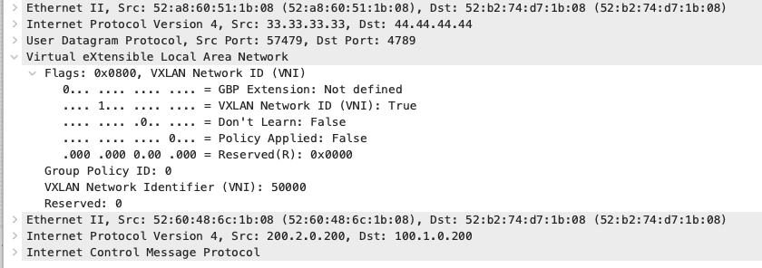

             different L2 segments (VNIDs) need to communicate, the VXLAN Network Identifier used is the L3VNI, in
             this case 50000.

## Full Configurations

```text
SPINE-1
hostname spine-1
nv overlay evpn
feature ospf
feature bgp
feature pim
feature lldp
ip pim rp-address 12.12.12.12 group-list 239.0.0.0/24
ip pim anycast-rp 12.12.12.12 1.1.1.1
ip pim anycast-rp 12.12.12.12 2.2.2.2
interface Ethernet1/3
  description to leaf-2
  mtu 9216
  ip address 10.14.14.1/30
  ip ospf network point-to-point
  ip router ospf UNDERLAY area 0.0.0.0
  ip pim sparse-mode
  no shutdown
interface Ethernet1/4
  description to leaf-1
  mtu 9216
  ip address 10.13.13.1/30
  ip ospf network point-to-point
  ip router ospf UNDERLAY area 0.0.0.0
  ip pim sparse-mode
  no shutdown
interface loopback0
  description for-vtep-reachability
  ip address 1.1.1.1/32
  ip router ospf UNDERLAY area 0.0.0.0
  ip pim sparse-mode
interface loopback1
  description for-mcast
  ip address 12.12.12.12/32
  ip router ospf UNDERLAY area 0.0.0.0
  ip pim sparse-mode
router ospf UNDERLAY
router bgp 65000
  address-family l2vpn evpn
  neighbor 3.3.3.3
    remote-as 65000
    update-source loopback0
    address-family l2vpn evpn
      send-community
      send-community extended
      route-reflector-client
  neighbor 4.4.4.4
    remote-as 65000
    update-source loopback0
    address-family l2vpn evpn
      send-community
      send-community extended
      route-reflector-client
```

```text
SPINE-2
hostname spine-2
nv overlay evpn
feature ospf
feature bgp
feature pim
feature lldp
ip pim rp-address 12.12.12.12 group-list 239.0.0.0/24
ip pim anycast-rp 12.12.12.12 1.1.1.1
ip pim anycast-rp 12.12.12.12 2.2.2.2
interface Ethernet1/3
  description to leaf-1
  mtu 9216
  ip address 10.23.23.1/30
  ip ospf network point-to-point
  ip router ospf UNDERLAY area 0.0.0.0
  ip pim sparse-mode
  no shutdown
interface Ethernet1/4
  description to leaf-2
  mtu 9216
  ip address 10.24.24.1/30
  ip ospf network point-to-point
  ip router ospf UNDERLAY area 0.0.0.0
  ip pim sparse-mode
  no shutdown
interface loopback0
  description for-vtep-reachability
  ip address 2.2.2.2/32
  ip router ospf UNDERLAY area 0.0.0.0
  ip pim sparse-mode
interface loopback1
  description for-mcast
  ip address 12.12.12.12/32
  ip router ospf UNDERLAY area 0.0.0.0
  ip pim sparse-mode
router ospf UNDERLAY
router bgp 65000
  address-family l2vpn evpn
  neighbor 3.3.3.3
    remote-as 65000
    update-source loopback0
    address-family l2vpn evpn
      send-community
      send-community extended
      route-reflector-client
  neighbor 4.4.4.4
    remote-as 65000
    update-source loopback0
    address-family l2vpn evpn
      send-community
      send-community extended
      route-reflector-client
```

```text
LEAF-1
hostname leaf-1
nv overlay evpn
feature ospf
feature bgp
feature pim
feature interface-vlan
feature vn-segment-vlan-based
feature lldp
feature nv overlay
fabric forwarding anycast-gateway-mac 0002.0002.0002
ip pim rp-address 12.12.12.12 group-list 239.0.0.0/24
vlan 1,100-101
vlan 100
  vn-segment 1000
vlan 101
  vn-segment 2000
route-map PERMIT-ALL permit 10
vrf context tenant-1
  vni 50000 l3
  rd auto
  address-family ipv4 unicast
   route-target both auto
   route-target both auto evpn
interface Vlan100
  no shutdown
  vrf member tenant-1
  ip address 100.1.0.254/24
  fabric forwarding mode anycast-gateway
interface Vlan101
  no shutdown
  vrf member tenant-1
  ip address 200.2.0.254/24
  fabric forwarding mode anycast-gateway
interface nve1
  no shutdown
  host-reachability protocol bgp
  source-interface loopback1
  member vni 1000
    mcast-group 239.0.0.1
  member vni 2000
    mcast-group 239.0.0.1
  member vni 50000 associate-vrf
interface Ethernet1/3
  description to spine-2
  mtu 9216
  ip address 10.23.23.2/30
  ip ospf network point-to-point
  ip router ospf UNDERLAY area 0.0.0.0
  ip pim sparse-mode
  no shutdown
interface Ethernet1/4
  description to spine-1
  mtu 9216
  ip address 10.13.13.2/30
  ip ospf network point-to-point
  ip router ospf UNDERLAY area 0.0.0.0
  ip pim sparse-mode
  no shutdown
interface loopback0
  description for-vtep-reachability
  ip address 3.3.3.3/32
  ip router ospf UNDERLAY area 0.0.0.0
  ip pim sparse-mode
interface loopback1
  description for-vni-peering
  ip address 33.33.33.33/32
  ip router ospf UNDERLAY area 0.0.0.0
  ip pim sparse-mode
router ospf UNDERLAY
router bgp 65000
  address-family l2vpn evpn
  neighbor 1.1.1.1
    remote-as 65000
    update-source loopback0
    address-family l2vpn evpn
    send-community
    send-community extended
  neighbor 2.2.2.2
    remote-as 65000
    update-source loopback0
    address-family l2vpn evpn
    send-community
    send-community extended
  vrf tenant-1
    address-family ipv4 unicast
    redistribute direct route-map PERMIT-ALL
```

```text
LEAF-2
hostname leaf-2
nv overlay evpn
feature ospf
feature bgp
feature pim
feature interface-vlan
feature vn-segment-vlan-based
feature lldp
feature nv overlay
fabric forwarding anycast-gateway-mac 0002.0002.0002
ip pim rp-address 12.12.12.12 group-list 239.0.0.0/24
vlan 1,200
vlan 200
  vn-segment 1000
route-map PERMIT-ALL permit 10
vrf context tenant-1
  vni 50000 l3
  rd auto
  address-family ipv4 unicast
   route-target both auto
   route-target both auto evpn
interface Vlan200
  no shutdown
  vrf member tenant-1
  ip address 100.1.0.254/24
  fabric forwarding mode anycast-gateway
interface nve1
  no shutdown
  host-reachability protocol bgp
  source-interface loopback1
  member vni 1000
    mcast-group 239.0.0.1
  member vni 50000 associate-vrf
interface Ethernet1/3
  description to spine-1
  mtu 9216
  ip address 10.14.14.2/30
  ip ospf network point-to-point
  ip router ospf UNDERLAY area 0.0.0.0
  ip pim sparse-mode
  no shutdown
interface Ethernet1/4
  description to spine-2
  mtu 9216
  ip address 10.24.24.2/30
  ip ospf network point-to-point
  ip router ospf UNDERLAY area 0.0.0.0
  ip pim sparse-mode
  no shutdown
interface loopback0
  description for-vtep-reachability
  ip address 4.4.4.4/32
  ip router ospf UNDERLAY area 0.0.0.0
  ip pim sparse-mode
interface loopback1
  description for-vni-peering
  ip address 44.44.44.44/32
  ip router ospf UNDERLAY area 0.0.0.0
  ip pim sparse-mode
router ospf UNDERLAY
router bgp 65000
  address-family l2vpn evpn
  neighbor 1.1.1.1
    remote-as 65000
    update-source loopback0
    address-family l2vpn evpn
    send-community
    send-community extended
  neighbor 2.2.2.2
    remote-as 65000
    update-source loopback0
    address-family l2vpn evpn
    send-community
    send-community extended
  vrf tenant-1
    address-family ipv4 unicast
    redistribute direct route-map PERMIT-ALL
```

                    For more labs visit my GitHub repo: https://github.com/TitusM/Cisco-Data-Center

## References
         https://www.cisco.com/c/en/us/td/docs/dcn/whitepapers/cisco-vxlan-bgp-evpn-design-and-
         implementation-guide.html

         https://www.cisco.com/c/en/us/td/docs/dcn/nx-os/nexus9000/105x/configuration/vxlan/cisco-nexus-
         9000-series-nx-os-vxlan-configuration-guide-release-105x/m_overview.html

         https://www.ciscolive.com/on-demand/on-demand-
         library.html?search=VXLAN#/video/1751036939701001hVz0

         https://www.ciscolive.com/on-demand/on-demand-
         library.html?search=VXLAN#/video/1751036941693001hMFt
